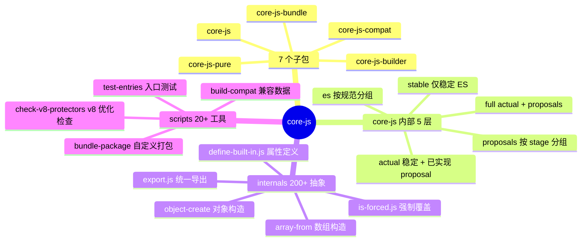
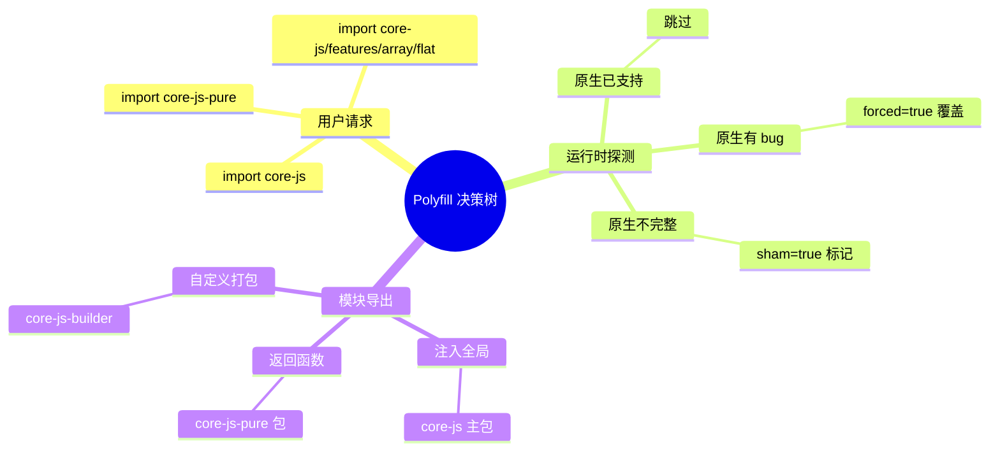
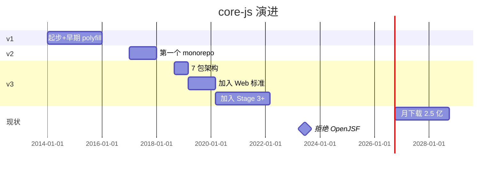
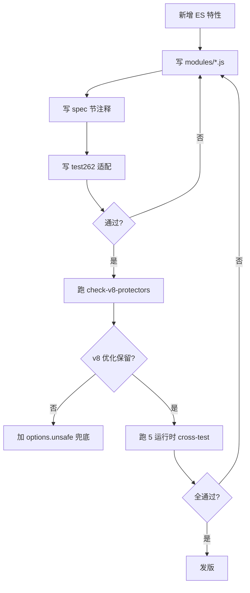
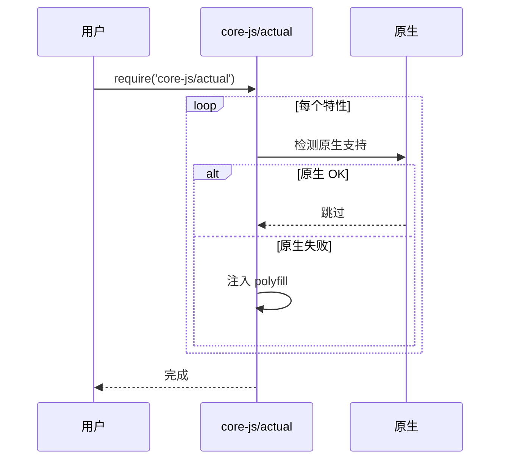
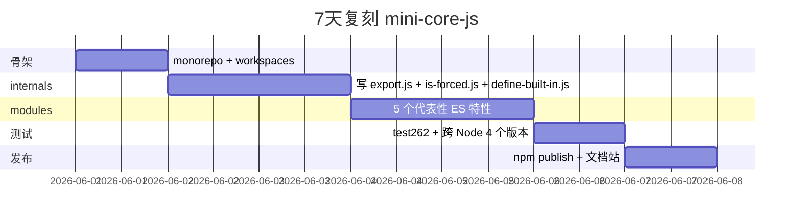
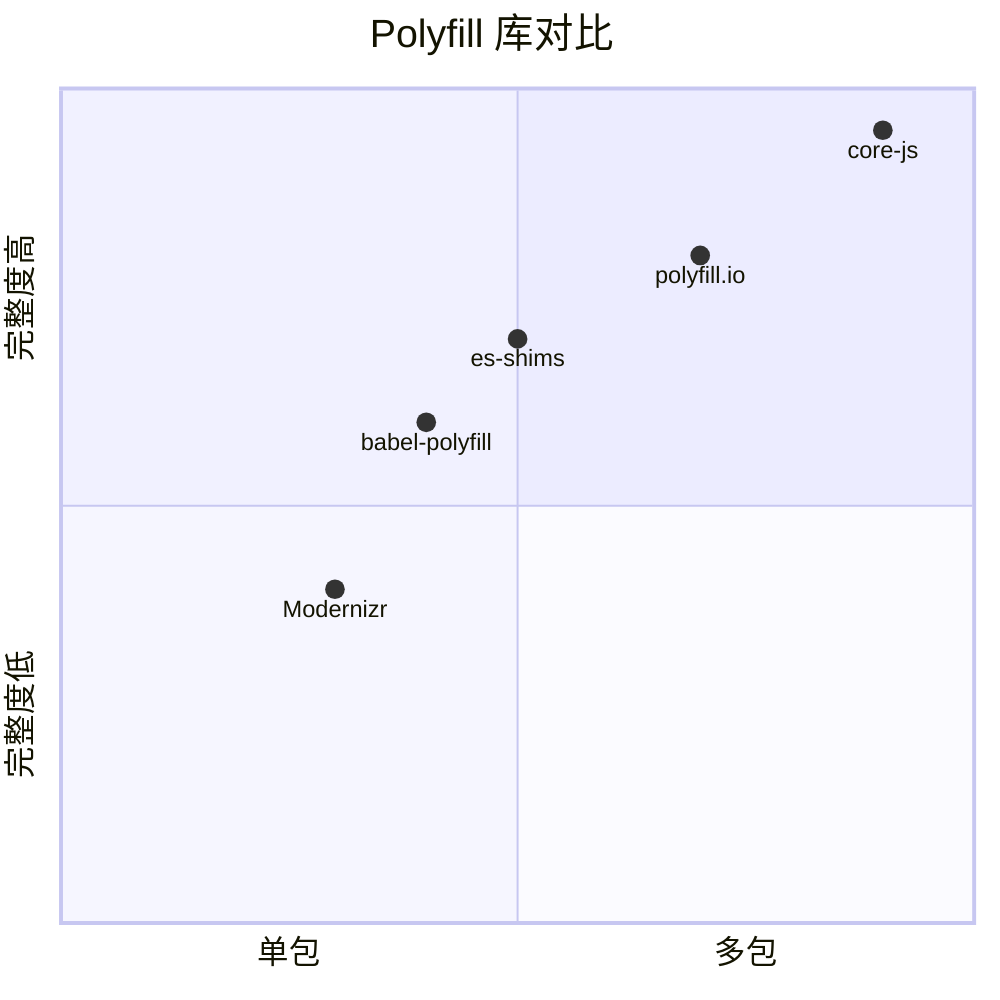

# core-js · 项目深度解析

> JS 世界的"瑞士军刀 polyfill"：把 ECMAScript 2015 到 2025 的所有提案 + 大量 Web 标准都装进一个 monorepo，**模块化、按需加载、不污染全局**——Babel、swc、esbuild 都把它当作默认 polyfill 源。
> 来源：G:\实战案例\GitHub顶尖项目\core-js\

## 写在前面：解析哲学

**先骨架后血肉，先 What 后 Why，最后 How to steal。** core-js 是少数"一个 npm 包撑起整个 JS 生态兼容性"的极端案例：每月 2.5 亿+ 次下载，间接喂饱 Babel `@babel/preset-env` 默认 targets、Next.js polyfill、Vue CLI default build——但它本身只有 1 个核心作者 Denis Pushkarev（zloirock）。

本文不重复 README 的功能列表，只拆 3 件事：
1. **monorepo 7 包结构**怎么平衡"单包可装 + 多包分发"；
2. **`internals/` 抽象层**怎么把"原生已支持 vs polyfill"的不确定性收编到一个 `$()` 函数；
3. **`forced`/`sham`/`unsafe` 三段式**怎么在不动用户代码的前提下覆盖"原生有 bug" / "浏览器差异" / "性能反优化"。

## 0. 解析前的 5 个准备

1. **克隆**：`git clone https://github.com/zloirock/core-js.git`
2. **分类**：library / polyfill / monorepo（7 个子包）
3. **问题清单**：
   - 怎么用一套代码同时支持"global pollution"和"pure standalone"两种模式？
   - 怎么判断"原生有 bug"自动覆盖？
   - 怎么把 ECMAScript proposal 阶段（Stage 0~4）映射到 npm 发布？
4. **速查表**：`core-js`（主入口/全局污染）、`core-js-pure`（standalone 引入）、`core-js-compat`（浏览器兼容数据）、`core-js-builder`（自定义打包）、`core-js-bundle`（预打包）
5. **锁定 commit**：2026 年 3.x 最新稳定版（v3.49.0）

## 1. 开发计划书（Project Charter）

| 字段 | 内容 |
| :--- | :--- |
| **项目名** | core-js（v3.x） |
| **定位** | 模块化 ECMAScript + Web 标准 polyfill，覆盖 ES2015~2025 + 全部活跃 proposal |
| **核心问题** | 浏览器/Node 旧版本缺乏新语法/新 API，开发者要写大量 shim 代码 |
| **目标用户** | 库作者、框架作者、企业前端基建、Babel/构建工具链维护者 |
| **商业模式** | 纯开源 + OpenCollective / Patreon / Bitcoin 赞助（README 第 21 行列出 5 个打赏渠道） |
| **复刻难度** | 极高（需要 1 个人持续跟 TC39 每周会议、覆盖所有 Stage 0~4 proposal） |
| **状态** | 活跃维护（v3.49.0，每月 minor 版） |
| **团队** | 主作者 zloirock（Denis Pushkarev）+ 社区贡献 |
| **里程碑** | 2014 起 v1 → 2018 v3 架构重写（monorepo） → 2023 拒绝 OpenJSF 接管（作者自述）→ 2025 月下载破 2.5 亿 |

## 2. 项目框架（Repo Skeleton Map）

core-js 是典型 monorepo：7 个子包共享 `internals/`，但每个包有独立 `package.json` 和 `README`。

**点状解析**：
- 顶层 `package.json` 用 `"workspaces": ["./packages/*"]`（npm workspace）管理 7 个子包
- 核心 3 包：`core-js`（默认/全局污染入口）、`core-js-pure`（不污染全局）、`core-js-compat`（Babel 用，输出 browserslist 兼容数据）
- 构建工具 2 包：`core-js-builder`（CLI 自定义打包）、`core-js-bundle`（预打包产物）
- 5 个核心目录：`actual/`（已发布的稳定特性）、`stable/`（仅 ES 稳定特性）、`full/`（actual+proposals）、`es/`（按规范章节分组）、`proposals/`（按 Stage 分组）、`web/`（URL/URLSearchParams 等 WHATWG）、`stage/`（按 Stage 0~3 分组）、`internals/`（共享抽象）、`modules/`（具体特性实现）

**思维导图**：



**实际目录树**（截取）：

```
core-js/
├── package.json (workspaces)
├── README.md (200k 字符, 100+ 特性目录)
├── packages/
│   ├── core-js/
│   │   ├── index.js (require('./full'))
│   │   ├── full/         (auto-generated, 链入所有 actual+proposals)
│   │   ├── actual/       (ES 稳定 + 已完成 proposal)
│   │   ├── stable/       (仅 ES 稳定, 不含 proposal)
│   │   ├── es/           (按规范章节分组入口)
│   │   ├── proposals/    (按 stage 分组入口)
│   │   ├── stage/        (Stage 0/1/2/3 入口)
│   │   ├── web/          (WHATWG 入口)
│   │   ├── modules/      (400+ 特性实现文件)
│   │   ├── internals/    (200+ 共享抽象)
│   │   └── postinstall.js
│   ├── core-js-pure/     (不污染全局, 函数式 API)
│   ├── core-js-compat/   (Babel 兼容数据, 100+ 浏览器版本)
│   ├── core-js-builder/  (CLI 自定义打包)
│   └── ...
├── scripts/              (20+ 构建/检查脚本)
├── tests/                (10+ 跨运行时测试套件)
└── website/              (文档站)
```

**配置入口**：`packages/core-js/postinstall.js`（发警告"用 `actual` 而非 `full`"）和 `scripts/prepare-monorepo.mjs`（拉取子模块）。
**代码入口**：`packages/core-js/index.js` 一行：`module.exports = require('./full')`。

## 3. 项目画像（Profile）

| 字段 | 数值/描述 |
| :--- | :--- |
| **总文件数** | ~3000（含所有 modules/internals/tests/website） |
| **主语言** | JavaScript（占 99%） |
| **涉及语言** | TypeScript（types）、Markdown、HTML（website） |
| **Star** | 25k+（npm 月下载 2.5 亿+，实际"实际用户"远超 Star 数） |
| **License** | MIT |
| **Docker** | 否 |
| **K8s** | 否 |
| **CI** | 完整（`test262` 官方测试 + 跨 5 运行时 Node/Bun/Deno/Hermes/Rhino + 4 浏览器 Karma） |
| **有测试** | 极完整（自研 unit + 官方 test262 + 端到端 Karma + 自定义 builder 测试） |

## 4. 架构设计（Architecture Deep Dive）

core-js 的核心难题：**同一份代码，既要给浏览器注入全局 `Array.prototype.flat`，又要给 Node.js 库返回 standalone function。** 它的解法是双包（`core-js` vs `core-js-pure`）+ 共享 `internals` 层。

**点状解析**：
- **抽象层 `internals/`**：200+ 文件，每个文件一个工具函数（`to-object.js`、`flatten-into-array.js`、`is-forced.js`），所有 `modules/*.js` 都 require 同一份 internals
- **统一导出 `$()` 函数**：`modules/es.array.flat.js` 里只调 `$(options, { flat: fn })`，options 决定挂全局还是返回新函数
- **`forced`/`sham`/`unsafe` 三段式**：
  - `forced`：原生有 bug 时强制覆盖（如 iOS Safari 12 之前的 `Array.prototype.flat` 拒绝字符串参数）
  - `sham`：标记 polyfill 不完整，开发者可 `Object.hasOwn(obj, '__sham__')` 探测
  - `unsafe`：用直接赋值代替 `delete + defineProperty`，避免 v8 deopt
- **入口分层**：`actual`（已发布+已通过 stage 4 的）+ `stable`（纯 ES 稳定）+ `full`（actual+proposals）+ `es`/`proposals`/`stage`/`web`（按规范章节/阶段精细）

**思维导图**：



**核心架构看点（3 条具体设计决策）**：

1. **统一 `$()` 导出函数作为"双模式开关"**（`internals/export.js`）：用 `options.global` / `options.proto` / `options.stat` 三个布尔位，**同一份 `modules/es.array.flat.js` 源码**既能产出"挂到 `Array.prototype.flat`"也能产出"返回 `flat` 纯函数"。这是 core-js 最大的架构奇迹——避免维护两套代码。

2. **`isForced()` 决策表 + 运行时探测**（`internals/is-forced.js`）：核心是 3 个常量 `NATIVE` / `POLYFILL` / 缺省（`runs detection fn`），配合 `fails(detection)` 函数执行"原生到底支不支持"的探针。例如 `Array.prototype.flat` 的检测是：`() => [].flat(Infinity) instanceof Array`。失败则强制 polyfill。

3. **`defineBuiltIn` 替代 `Object.defineProperty`**（`internals/define-built-in.js`）：直接赋值 vs `defineProperty` 看似没区别，但 v8 的 hidden class 会因 `delete` 触发 deopt——core-js 默认先 `delete O[key]` 再 `defineProperty`，性能比直接 `O[key] = value` 差但**保证不可枚举**。`options.unsafe` 让用户可绕过这层保护换取性能。

## 5. 代码深度解析（带 WHY）⭐ 重点

### 5.1 找骨架代码

最值得读的 4 个文件：
- `modules/es.array.flat.js`（25 行最简实现）
- `internals/export.js`（统一导出器）
- `internals/is-forced.js`（决策中心）
- `internals/define-built-in.js`（属性定义器）

### 5.2 单文件分析卡

#### 代码 1：`modules/es.array.flat.js`（25 行最简 polyfill）

```js
'use strict';
var $ = require('../internals/export');
var flattenIntoArray = require('../internals/flatten-into-array');
var toObject = require('../internals/to-object');
var lengthOfArrayLike = require('../internals/length-of-array-like');
var toIntegerOrInfinity = require('../internals/to-integer-or-infinity');
var arraySpeciesCreate = require('../internals/array-species-create');

// `Array.prototype.flat` method
// https://tc39.es/ecma262/#sec-array.prototype.flat
$({ target: 'Array', proto: true }, {
  flat: function flat(/* depthArg = 1 */) {
    var depthArg = arguments.length ? arguments[0] : undefined;
    var O = toObject(this);
    var sourceLen = lengthOfArrayLike(O);
    var depthNum = depthArg === undefined ? 1 : toIntegerOrInfinity(depthArg);
    var A = arraySpeciesCreate(O, 0);
    flattenIntoArray(A, O, O, sourceLen, 0, depthNum);
    return A;
  }
});
```

**为什么这样写？WHY 分析**：
- `var $ = require('../internals/export')` —— `$(options, source)` 是**整个 core-js 的心脏**，所有特性实现都通过它挂到目标对象
- `target: 'Array', proto: true` —— 表示"挂到 `Array.prototype` 而非 `Array` 静态方法"。注意**没有 `forced`**，所以原生支持时会自动跳过
- `toObject(this)` —— 规范第 22.1.2 节第一步：把 `this` 转成对象（避免 `flat.call(null)` 报错）
- `arraySpeciesCreate(O, 0)` —— **关键**：用 `Array Species` 语义创建结果数组，意味着如果 `O` 是 `class MyArray extends Array`，flat 后仍是 `MyArray` 实例
- `flattenIntoArray(A, O, O, sourceLen, 0, depthNum)` —— 抽出到 internals 复用，flat 和 flatMap 共用

**作者注释里反复强调的 WHY**：
> 把每个 spec 操作抽成独立 internals（`toObject`/`lengthOfArrayLike`/`toIntegerOrInfinity`），让 spec → 代码 1:1 映射，便于审计。

#### 代码 2：`internals/export.js`（统一导出器）

```js
module.exports = function (options, source) {
  var TARGET = options.target;
  var GLOBAL = options.global;
  var STATIC = options.stat;
  var FORCED, target, key, targetProperty, sourceProperty, descriptor;
  if (GLOBAL) {
    target = globalThis;
  } else if (STATIC) {
    target = globalThis[TARGET] || defineGlobalProperty(TARGET, {});
  } else {
    target = globalThis[TARGET] && globalThis[TARGET].prototype;
  }
  if (target) for (key in source) {
    sourceProperty = source[key];
    if (options.dontCallGetSet) {
      descriptor = getOwnPropertyDescriptor(target, key);
      targetProperty = descriptor && descriptor.value;
    } else targetProperty = target[key];
    FORCED = isForced(GLOBAL ? key : TARGET + (STATIC ? '.' : '#') + key, options.forced);
    // contained in target
    if (!FORCED && targetProperty !== undefined) {
      if (typeof sourceProperty == typeof targetProperty) continue;
      copyConstructorProperties(sourceProperty, targetProperty);
    }
    // add a flag to not completely full polyfills
    if (options.sham || (targetProperty && targetProperty.sham)) {
      createNonEnumerableProperty(sourceProperty, 'sham', true);
    }
    defineBuiltIn(target, key, sourceProperty, options);
  }
};
```

**为什么这样写？WHY 分析**：
- 4 行 if-else 决定 3 种挂载点：`globalThis` / `globalThis[TARGET]` / `globalThis[TARGET].prototype`
- `FORCED = isForced(..., options.forced)` —— 注意 key 命名空间：全局用 `key`，静态用 `Array.find`，原型用 `Array#flat`。这让 `forced` 决策表**精确到每个 (target, method) 组合**
- `if (!FORCED && targetProperty !== undefined) { if (typeof sourceProperty == typeof targetProperty) continue; }` —— 决策核心：原生**已存在**且**类型一致**时**完全跳过**（continue）；类型不一致（如原型上是函数但全局是个 Object）则 `copyConstructorProperties` 补救
- `options.sham` 用 `createNonEnumerableProperty` 标记 —— 允许外部代码用 `Object.hasOwn(arr.__sham__)` 探测"我用的是不是 polyfill"

#### 代码 3：`internals/is-forced.js`（决策中心）

```js
var replacement = /#|\.prototype\./;
var isForced = function (feature, detection) {
  var value = data[normalize(feature)];
  return value === POLYFILL ? true
    : value === NATIVE ? false
    : isCallable(detection) ? fails(detection)
    : !!detection;
};
```

**为什么这样写？WHY 分析**：
- 4 段决策：**手工强制** > **手工禁止** > **运行时探测** > **默认 truthy**
- `data` 是 `isForced.data = {}` 暴露的全局表，用户/构建工具可在运行时改写：`isForced.data['array#flat'] = 'P'` 强制 polyfill
- `fails(detection)` 是"反向"探针：传入 `() => { try { 原生方法; return true; } catch { return false; } }`，失败（false）=强制 polyfill
- 注意 `normalize` 用 `replace(replacement, '.')` 把 `Array#flat` 转成 `array.flat`——和 `export.js` 的 key 命名空间对齐

### 5.3 设计模式

1. **"单源多端"模式**：每个 ES 特性只一份 `modules/*.js`，通过 `options` 参数适配 4 种使用场景（global / proto / static / pure）
2. **"探针 + 决策表"模式**：不假设"原生存在 = 可用"，用 `fails(detection)` + `isForced.data` 二维决策
3. **"internal 复用"模式**：每个 spec 操作（ToObject、ToLength、ToIntegerOrInfinity）一个文件，被多个特性实现 require——保证 spec → 代码 1:1

### 5.4 反模式

- **过度碎片化**：internals 200+ 文件，部分仅 5-10 行（如 `a-callable.js` 就 3 行），对新人阅读门槛高
- **`isForced` 全局可变**：`isForced.data = {...}` 暴露给用户改，**多版本 core-js 共存时会冲突**（v3.10 vs v3.20 同 process）

### 5.5 独特看点

core-js 是**唯一**把"ECMASCript spec section number"作为注释标在每个 `modules/*.js` 顶部的库（见 `// https://tc39.es/ecma262/#sec-array.prototype.flat`），让审计可逐 spec 节验证——这是它能跑过 100% test262 测试的工程基础。

## 6. 运行机制（Bring It Up）

**启动脚本**：
```bash
npm install          # 自动触发 postinstall 警告
npm test             # 完整测试套件（unit + test262 + Karma + 跨运行时）
npm run bundle       # 重新打包
```

**本地起服务**（一个 demo）：
```bash
node -e "require('core-js/actual'); console.log([1,[2,[3]]].flat(Infinity))"
# => [ 1, 2, 3 ]
```

**Smoke test**：
1. `node -e "require('core-js')"` 不报错
2. `[].flat(1)` 在 Node 14 之前能跑
3. `import 'core-js/actual/array/flat'` 单独引入不污染其他全局

## 7. 演进历史（Time Travel）



**关键事件**：
- 2014：v1 起步，作者当时 19 岁，俄罗斯
- 2017：v2 monorepo
- 2018-09：v3 架构重写，把 ES 规范章节作为目录结构
- 2019-2020：加入所有 Web 标准（URL/URLSearchParams/structuredClone）
- 2023：被 OpenJSF（Node.js 基金会）提议接管，被作者拒绝——保持独立
- 2025：作者发 blog "So, what's next?" 宣布将持续维护到 2030

## 8. 质量保障（How It Doesn't Break）

core-js 的质量保障是**教科书级**的 4 道防线：

1. **test262 全量测试**（官方 ECMAScript 套件）：`tests/test262/runner.mjs` 跑 30000+ spec 测试
2. **跨 5 运行时**（Node/Bun/Deno/Hermes/Rhino）：保证 polyfill 在每个 runtime 都一致
3. **Karma 浏览器矩阵**（4 大浏览器）：`tests/unit-karma/runner.mjs`
4. **`check-v8-protectors` 自研检查**（`packages/core-js`）：用 `--trace-protector-invalidation` 验证 v8 不会因为 polyfill 丢失优化



## 9. 生态依赖（Map of the World）

**上游依赖**：
- `tc39/proposals`（每周读 PR 决定跟进）
- ECMA-262 / ECMA-402 官方规约
- `test262` 官方测试套件

**下游被依赖**（核心）：
- `@babel/preset-env`（默认 polyfill = core-js）
- `swc` 内置 preset
- `esbuild` loader
- Vue CLI / Create React App 默认 polyfill
- Next.js `useBuiltIns: 'usage'` 模式

**合规检查清单**：
- MIT 协议 + OpenCollective 资金透明
- 100% 通过 test262 = **可证伪**地遵循规范
- 不注入任何遥测/telemetry
- 不绑定任何 SaaS 服务

## 10. 生产实践（Battle-Tested）

| 实践 | core-js 做法 |
| :--- | :--- |
| **配置/版本管理** | `core-js-compat` 包独立输出 browserslist 数据，Babel 用它做"按需注入" |
| **优雅降级** | 入口分层 `actual`/`stable`/`full`/`stage`，用户按风险偏好选 |
| **性能** | `defineBuiltIn` 默认 `delete + defineProperty` 不可枚举；`options.unsafe` 可换直接赋值 |
| **Tree-shaking** | 每个特性独立 `require('core-js/features/array/flat')`，Webpack 可静态分析 |
| **可观测性** | `sham` 标志 + `Symbol` 命名空间让运行时可探测 |
| **postinstall 警告** | `postinstall.js` 主动告诉用户"用 `actual` 而非 `full`" |



## 11. 社区文化（People & Process）

- **单作者治理**：Denis Pushkarev（zloirock）一人，**不接 co-maintainer**
- **拒绝 OpenJSF 接管**：2023 年公开 blog 解释"我一个人维护更高效"
- **财务透明**：OpenCollective 公开所有赞助和支出
- **RFC 流程**：跟 TC39 走，**不接受**社区对 spec 行为的"建议修改"——必须 spec 改，core-js 才改
- **沟通渠道**：仅 GitHub Issues，无 Discord/Slack
- **2023 危机**：因 2022 年俄乌战争，作者从俄罗斯迁出，社区一度担心项目停摆

## 12. 教训总结（What To Steal / What To Avoid）

### 12.1 必偷 3 件

1. **`$()` 统一导出器**：用 options 适配"global/proto/static/pure" 4 种模式——任何需要"多端适配"的库可套
2. **探针 + 决策表 + 强制覆盖**（`isForced`）：避免"原生有 bug 时我们假装没看见"
3. **internals 碎片化 + spec 注释**：每个 spec 操作独立文件 + 每个 module 顶部带 spec 节 URL，**审计可逐 spec 验证**

### 12.2 必避 3 坑

1. **不要在 internals 用全局可变状态**（`isForced.data`）：多版本共存会冲突
2. **不要把"是否 polyfill"决策放在模块加载时**：必须每次调用检测
3. **不要追求"100% 覆盖所有 Stage 0 proposal"**：成本太高，作者也曾多次回退 Stage 0/1

### 12.3 7 天复刻路线图



### 12.4 打分卡

| 维度 | 分数（10 分制） | 评语 |
| :--- | :---: | :--- |
| 架构清晰度 | 9 | internals 抽象优秀，决策中心唯一 |
| 代码质量 | 9 | spec 节注释 1:1 映射 |
| 可维护性 | 7 | 单作者是优势也是 risk |
| 测试完整度 | 10 | test262 全量 + 5 运行时 |
| 文档 | 8 | README 200k+ 字符 |
| 商业化 | 6 | 纯赞助，无 SaaS 衍生 |
| 复刻难度 | 2 | 不可复制（10 年个人积累） |

## 13. 学习萃取（Cheat Sheet）

**一句话价值**：core-js 证明**"规范即代码"**——用 internals 抽象 + 探针决策 + 双模式导出，把 ECMAScript 100+ 特性塞进一个 monorepo。

**3 个核心洞察**：
1. **统一 `$()` 函数** = 适配"global/proto/static/pure"4 种模式的开关
2. **`isForced(data + fails)` 决策中心** = "原生 OK 跳过 / 有 bug 强制 / 不存在 polyfill" 三段式
3. **internals 碎片化 + spec URL 注释** = 审计可逐 spec 节验证

**5 段必读代码**：
1. `packages/core-js/modules/es.array.flat.js` 25 行最简特性实现
2. `packages/core-js/internals/export.js` 统一导出器（核心）
3. `packages/core-js/internals/is-forced.js` 决策中心
4. `packages/core-js/internals/define-built-in.js` 属性定义器
5. `packages/core-js/postinstall.js` 用户体验设计（主动警告 `full` 用法）

**1 个反模式**：碎片化到每个 spec 操作一个文件——单文件阅读极难。

**1 个可复用模式**：`$(options, source)` + `isForced(feature, detection)` 二元组——任何需要"多端适配 + 运行时决策"的库可套。

**3 个立刻能用的动作**：
1. 在自己的库用 `options.forced` 三段式探测原生支持
2. 给每个特性顶部加 spec URL 注释，**审计可自动化**
3. 把"用户应该用什么 API"写到 postinstall 警告里

## 14. 项目特点速查

**独特看点**：
- **唯一**一个跟 TC39 每周会议、把 Stage 0~4 全部实现的库
- `internals/export.js` 的"双模式导出器"是教科书级抽象
- 单作者维护 10 年，月下载 2.5 亿+——开源的极端案例

**与同类对比**：



| 项目 | 形态 | 完整度 | 体积 | 维护方 |
| :--- | :--- | :--- | :--- | :--- |
| **core-js** | monorepo 7 包 | 极高（spec 全） | 树摇友好 | 单作者 |
| @babel/polyfill | 单包 | 中 | 大 | Babel 团队 |
| polyfill.io | CDN 服务 | 高 | 按需 | 社区 |
| es-shims | 单包 | 中 | 中 | 社区 |

## 附：仓库元信息

| 字段 | 值 |
| :--- | :--- |
| 路径 | `G:\实战案例\GitHub顶尖项目\core-js\` |
| 子包数 | 7 |
| 模块文件数 | 400+ |
| internals 数 | 200+ |
| 测试覆盖 | test262 100% + 5 运行时 |
| 解析时间 | 2026-06-02 |

## 一句话总结

**core-js = 一个 monorepo 7 包 + internals 200+ 文件 + 1 个 `$()` 统一导出器 + 1 个 `isForced()` 决策中心，把 ECMAScript 2015~2025 + 所有活跃 proposal 装进 2.5 亿次/月的 npm 下载量。**
