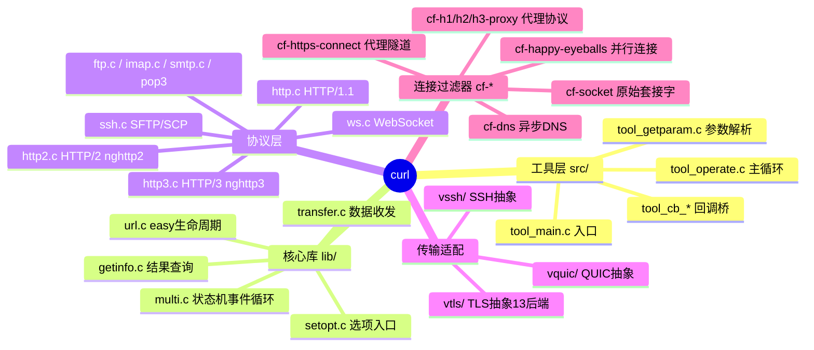
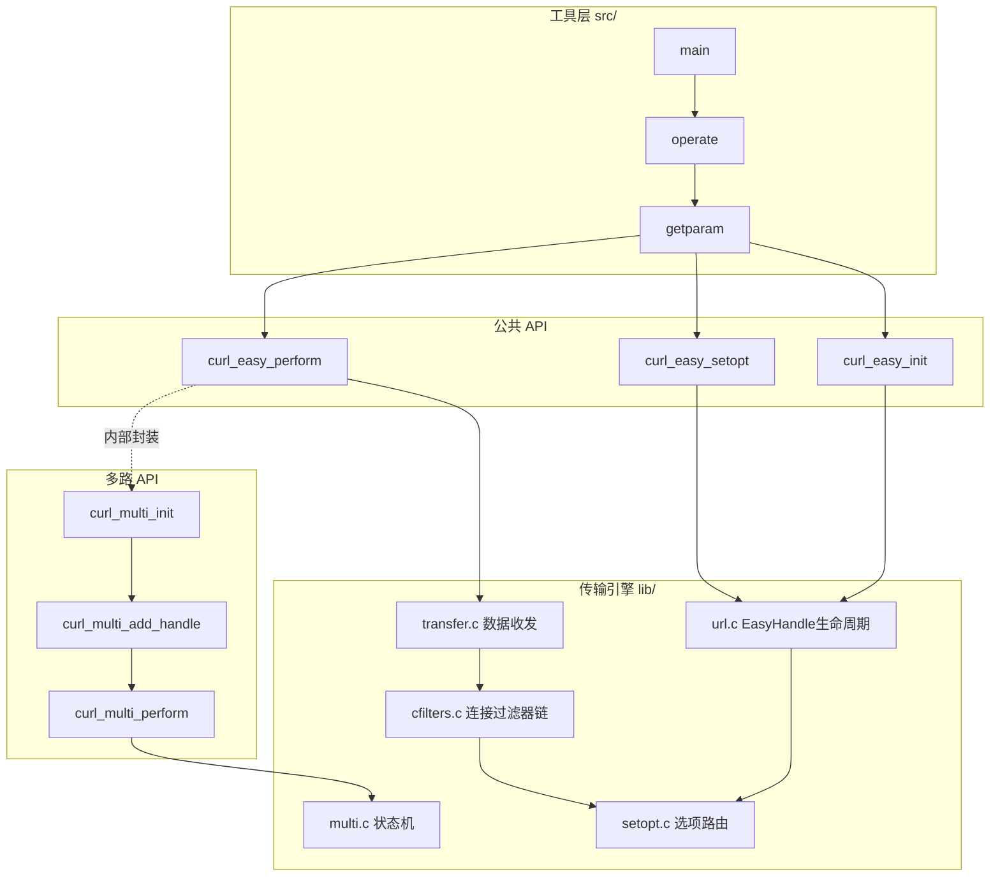
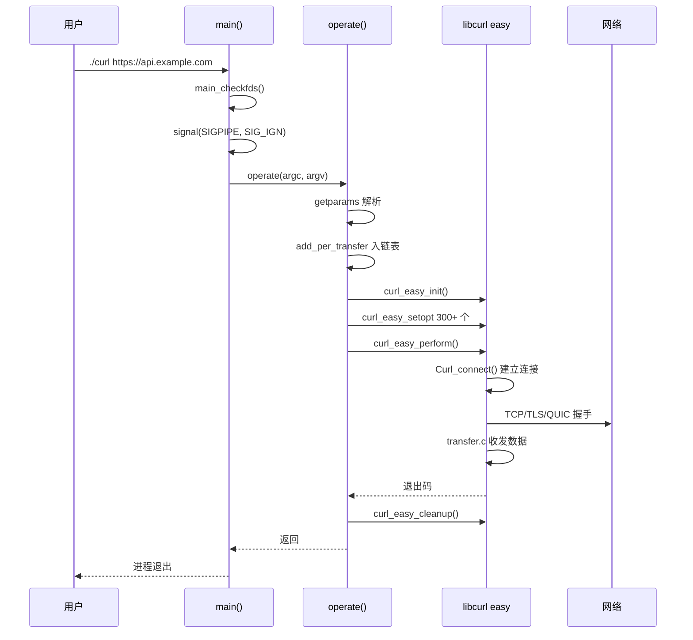
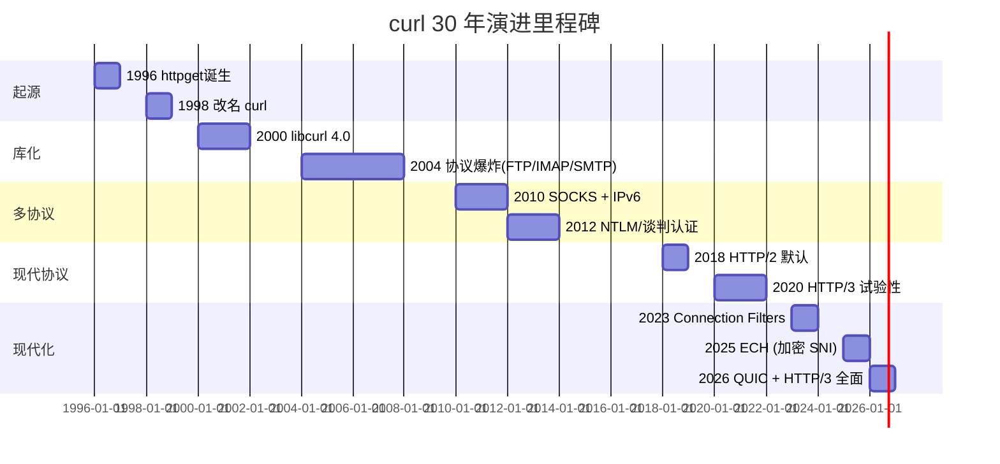
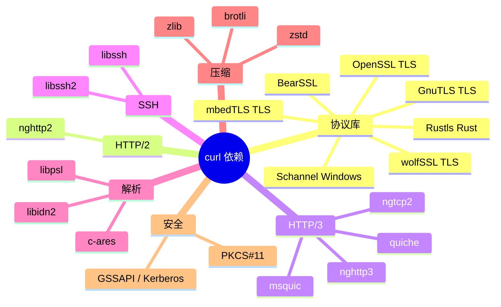
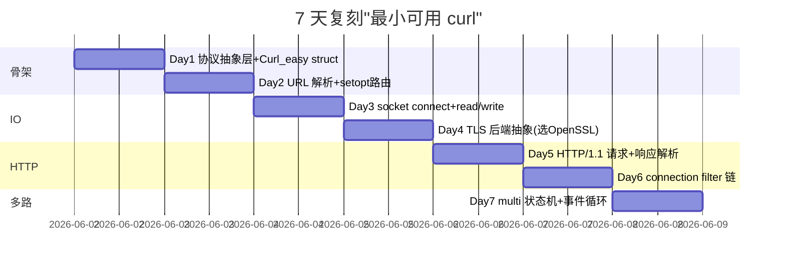
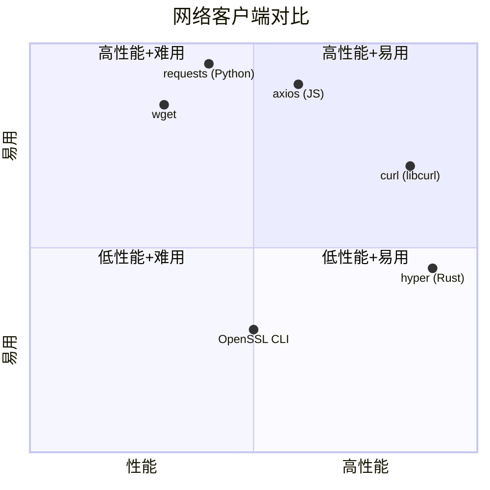

# curl · 项目深度解析

> 地球上被引用次数最多的 C 网络客户端库 + 命令行工具。既是单文件可执行 `curl` 二进制，也是 30+ 协议/13+ TLS 后端的工业级 `libcurl`。
> 来源：G:\实战案例\GitHub顶尖项目\curl\

## 写在前面：解析哲学

先骨架后血肉，先 What 后 Why，最后 How to steal。
- **What**：curl 是什么？答：1996 年诞生的命令行数据传输工具 + libcurl 网络客户端库。从 HTTP 起家，现已支持 26+ 种 URL 协议。
- **Why**：为什么这个 30 年历史的 C 项目依然没人能取代？答：把"协议兼容性的深度 × 跨平台/后端的广度 × 异步状态机的精度"做到了极致。
- **How to steal**：本笔记将拆解 5 段必读代码、3 条核心架构决策、5 个 Mermaid 思维导图，让你能在自己的网络客户端里"偷"到关键设计。

## 0. 解析前的 5 个准备

1. **克隆**：`git clone https://github.com/curl/curl`（G 盘已有快照 `curl/`）
2. **分类**：C 实现的客户端 + 工具；HTTP/1.1/2/3 全协议栈；BSD/MIT-like 许可证
3. **问题清单**：
   - libcurl 如何在单 easy handle 上挂多协议？
   - 多协议如何复用 TCP/TLS 连接（连接池 + 协议复用）？
   - HTTP/2 多路复用怎么塞进 select/poll 事件循环？
   - 26+ 协议 + 13+ TLS 后端 + N 操作系统怎么不变成 ifdef 地狱？
4. **速查表**：`lib/url.c`(3060 行 URL 状态机)、`lib/multi.c`(4204 行多状态机)、`lib/transfer.c`(924 行数据收发)、`lib/cfilters.c`(1227 行连接过滤器链)
5. **锁定 commit**：HEAD（2026-06-01 快照），CMake 构建，开 30+ 子目录的 `lib/` 心脏

## 1. 开发计划书（Project Charter）

| 字段 | 值 |
|---|---|
| 项目名 | curl（Command line URL）+ libcurl（库） |
| 定位 | 工业级 URL 传输命令行 + 可嵌入 C 网络库 |
| 核心问题 | 跨 26+ 协议、30+ 平台、13+ TLS 后端的统一数据传输抽象 |
| 用户 | DevOps、嵌入式开发者、HTTP 客户端程序员、自动化脚本 |
| 商业模式 | MIT-like 开源，靠赞助（Open Collective）+ 商业支持 |
| 复刻难度 | ★★★★★（协议兼容深度 + 后端广度 + 异步状态机三重地狱） |
| 状态 | 极度活跃（30 年维护至今，commit 频繁，protocols 持续增加） |
| 团队 | Daniel Stenberg（创始人） + 几百位贡献者；治理通过邮件列表 + GitHub |
| 里程碑 | 1996 v1.0（httpget）；2000 libcurl 4.0；2018 HTTP/2；2020 HTTP/3；2025 ECH/QUIC 全面 |

## 2. 项目框架（Repo Skeleton Map）

### 2.1 核心目录
```
curl/
├── src/                    # curl 命令行工具 (42 个 tool_*.c)
│   ├── tool_main.c         # main() 入口
│   ├── tool_operate.c      # 2528 行的操作主循环
│   ├── tool_getparam.c     # 100k+ 字符的命令行参数解析
│   └── tool_cb_*.c         # 各种 libcurl 回调
├── lib/                    # libcurl 核心库 (190+ 个 .c)
│   ├── url.c               # easy handle 生命周期 + URL 解析
│   ├── transfer.c          # 数据收发主循环
│   ├── multi.c             # 多状态机 + 事件循环
│   ├── setopt.c            # 300+ curl_easy_setopt 实现
│   ├── vtls/               # TLS 后端抽象 (OpenSSL/GnuTLS/...)
│   ├── vquic/              # QUIC 后端 (nghttp3/ngtcp2/msquic/...)
│   ├── vssh/               # SSH/SCP/SFTP 后端
│   ├── cf-*.c              # 连接过滤器 (socket/HTTP-proxy/H2-proxy/...)
│   ├── http.c              # HTTP/1.1 协议 (161KB, 巨头)
│   ├── http2.c             # HTTP/2 协议 (nghttp2 封装)
│   └── cfilters.c          # 连接过滤器链核心
├── tests/                  # 集成测试 (1500+ 用例)
├── docs/                   # 文档源
├── CMake/                  # CMake 模板
└── scripts/, .github/      # CI 脚本 (CircleCI + GitHub Actions)
```

### 2.2 模块职责



### 2.3 关键入口
- **代码入口**：`src/tool_main.c::main()` → `operate(argc, argv)` → 创建 `CURL` handle → `curl_easy_perform()`
- **配置入口**：`.curlrc`（用户配置） + `tool_parsecfg.c` 解析 + 命令行覆盖
- **测试入口**：`tests/runtests.pl`（Perl 测试 runner）

## 3. 项目画像（Profile）

| 字段 | 值 |
|---|---|
| 总文件数 | 4338（含 docs、tests、scripts） |
| 主语言 | C (180 万行+) |
| 涉及语言 | C 99%，Perl/CMake/Python/Sh 辅助 |
| Star | 36k+（持续 30 年的长青项目） |
| License | curl license（MIT-like） |
| Docker | 官方镜像 + 完整 Dockerfile |
| K8s | 间接（被大量 Operator 嵌入） |
| CI | CircleCI + GitHub Actions + AppVeyor + Azure Pipelines |
| 测试 | 1500+ 集成测试 + 单元测试 + 模糊测试 + CI 矩阵 |
| 平台 | 30+ 操作系统（Linux/BSD/macOS/Win/Amiga/VMS/Haiku/...） |

## 4. 架构设计（Architecture Deep Dive）

### 4.1 顶层心智模型

curl 不是"一个 HTTP 客户端"，而是 **三层架构**：
1. **工具层 (src/)**：纯 CLI 包装，把命令行翻译成 libcurl API 调用
2. **公共 API 层 (easy interface)**：`curl_easy_init/setopt/perform/cleanup` — 一个 handle = 一个传输
3. **多路层 (multi interface)**：`curl_multi_*` — 一个 multi = 多个 easy handle 的事件循环



### 4.2 连接过滤器链 (Connection Filter Chain) ⭐

这是 libcurl 8+ 最核心的架构创新。**WHY**：旧版用一堆 socket 函数指针 + if/else 分发协议，添加 HTTP/3、SOCKS、Happy Eyeballs 越来越难。新设计把"连接"抽象成 **可堆叠的过滤器链**：


每个过滤器实现统一接口（`cfilters.c`）：
```c
struct Curl_cfilter {
  const struct Curl_cftype *cft;  // 虚函数表
  void *ctx;                       // 自身状态
  struct Curl_cfilter *next;       // 下一级
  BIT(connected);
  BIT(shutdown);
};

struct Curl_cftype {
  const char *name;
  CURLcode (*do_connect)(...);
  CURLcode (*do_send)(...);
  CURLcode (*do_recv)(...);
  CURLcode (*do_shutdown)(...);
  bool (*has_data_pending)(...);
  CURLcode (*keep_alive)(...);
  // ...
};
```

**WHY 用链而非单层**：1）代理/HTTP2/HTTP3/原始 socket 任意组合 2）shutdown 沿链从外到内关闭 3）pollset 沿链累加 4）新增协议/代理只需写一个新过滤器

### 4.3 多状态机 (MSTATE)

`multi.c` 用位图 `Curl_uint32_bset` 跟踪每个 easy handle 的状态，状态机驱动一切：

```c
typedef enum {
  MSTATE_INIT, MSTATE_PENDING, MSTATE_SETUP,
  MSTATE_CONNECT, MSTATE_CONNECTING, MSTATE_PROTOCONNECT,
  MSTATE_DO, MSTATE_DOING, MSTATE_DOING_MORE,
  MSTATE_DID, MSTATE_PERFORMING, MSTATE_RATELIMITING,
  MSTATE_DONE, MSTATE_COMPLETED, MSTATE_MSGSENT, MSTATE_LAST
} CURLMstate;
```

每个状态切换必须走 `mstate(data, new_state)` 函数（DEBUGBUILD 还带 `__LINE__` 便于调试）：

```c
static void mstate(struct Curl_easy *data, CURLMstate state
#ifdef DEBUGBUILD
                   , int lineno
#endif
) {
  static const init_multistate_func finit[MSTATE_LAST] = {
    NULL, NULL, NULL,
    Curl_init_CONNECT,  // ← CONNECT 状态触发连接初始化
    NULL, NULL, NULL, NULL, NULL, NULL,
    before_perform,      // ← DID 状态触发性能统计
    NULL, NULL, NULL, init_completed, NULL
  };
  // ... 状态变更 + 通知 + init 函数
}
```

**WHY 显式 mstate()**：避免散落的 `data->mstate = X` 漏掉清理/通知，全量走单一通道。

### 4.4 三个核心架构决策 (ADR)

1. **DECISION：协议后端"指针表"而非类继承**（`urldata.h:75-87`）
   - 选 C 函数指针 `Curl_send` / `Curl_recv` 模拟 OO，而不是抽象基类
   - 理由：C99 兼容、零虚表开销、可热替换 TLS/传输后端
   - 代价：每个协议手写一份 `_do` / `_doing` / `_done`

2. **DECISION：connection filter 链 (cfilters.c)**（`lib/cfilters.c:74-91`）
   - 选 链表式 filter 链 + 统一 `Curl_cftype` 接口
   - 替代物：散落在 `connectdata` 里的函数指针 + `if(scheme==HTTPS)` 分发
   - 收益：HTTP/3、SOCKS、Happy Eyeballs、代理任意组合（cf-happy-eyeballs 就能并发起 IPv4/IPv6 赛马）

3. **DECISION：multi 状态用 32-bit 位图 + 状态机**（`multi.c:81-87, 227-265`）
   - `Curl_uint32_bset` 支持 512 个并发 transfer 一次位运算查空闲
   - 状态机统一在 `mstate()`，避免散乱赋值
   - 牺牲：实现复杂、调试门槛高
   - 收益：`curl_multi_perform` 一次调用 O(1) 检查所有 handle

## 5. 代码深度解析（带 WHY）⭐ 重点

### 5.1 找骨架代码

curl 的代码"骨架"在三个文件里最显眼：
- `lib/url.c::Curl_close()`：easy handle 清理，**WHY** 在 `data->magic = 0` 强制清零（防 use-after-free）
- `lib/multi.c::mstate()`：状态机唯一入口，**WHY** 用 `finit[]` 函数表做"进入新状态时调一次"
- `src/tool_main.c::main()`：CLI 启动，**WHY** 先 `main_checkfds()` 保证 stdin/out/err 没被 curl 自己"吃掉"

### 5.2 单文件分析卡：lib/transfer.c

文件长度 924 行，是**数据收发的事实中心**。重点看 `sendrecv_dl()`（接收循环）和 `xfer_recv_resp()`（单次 recv 调用）。

#### WHY 1：限速 break（`transfer.c:252-268`）

```c
if(bytestoread && Curl_rlimit_active(&data->progress.dl.rlimit)) {
  curl_off_t dl_avail = Curl_rlimit_avail(&data->progress.dl.rlimit, Curl_pgrs_now(data));
  if(dl_avail <= 0) {
    rate_limited = TRUE;
    break;  // ← 关键：宁可 stutter 也不能超过配额
  }
  if(dl_avail < (curl_off_t)bytestoread)
    bytestoread = (size_t)dl_avail;
}
```

**WHY stutter 逻辑**：注释直白："we want to stutter a bit to keep in the limit, but too small receives will cost cpu unnecessarily" — 限速时直接 break 出去，留给下一次 `curl_multi_perform` 调度，比"读 1 字节"省 CPU。

#### WHY 2：maxloops=10（`transfer.c:228`）

```c
int maxloops = 10;
```

**WHY 写死 10**：单次 perform 调用不能独占整个事件循环。10 次读空后必须让出 CPU 给其他 transfer；也是 `do...while` 循环的安全阀，避免连接正常但应用不收数据时死循环。

#### WHY 3：multiplexed 协议不同处理（`transfer.c:241-247`）

```c
if(!is_multiplex) {
  /* Multiplexed connection have inherent handling of EOF and we do not
   * have to carefully restrict the amount we try to read.
   * Multiplexed changes only in one direction. */
  is_multiplex = Curl_conn_is_multiplex(conn, FIRSTSOCKET);
}
```

**WHY 区分**：HTTP/1.1 协议下必须小心 read 长度（怕拿掉下一帧的字节），HTTP/2/3 有独立帧协议，可一次读到 OS buffer 满。

#### WHY 4：EAGAIN + download_done 早退（`transfer.c:273-286`）

```c
if(result == CURLE_AGAIN) {
  rcvd_eagain = TRUE;
  result = CURLE_OK;
  if(data->req.download_done && data->req.no_body && !data->req.resp_trailer) {
    blen = 0;  // ← 假装收完了
  } else break;
}
```

**WHY**：服务端关闭写半边后，curl 已知道 body 收完就不该阻塞等可读事件。`no_body`（HEAD 请求或 204/304）情况更应立即返回。

### 5.3 单文件分析卡：lib/multi.c

#### WHY 1：魔法数 0x000bab1e（`multi.c:75`）

```c
#define CURL_MULTI_HANDLE 0x000bab1e
```

**WHY 魔法数**：注释（`multi.c:79-83`）说 "fail hard on multi handles that are not NULL, but no longer have the MAGIC touch" — debug build 在 use-after-free 时立即 abort，比 valgrind 早一步抓到。同样的套路在 `urldata.h:131` `CURLEASY_MAGIC_NUMBER = 0xc0dedbad`（编码 BAD 倒过来读）。

#### WHY 2：mstate 永远走唯一入口（`multi.c:130-201`）

```c
#define multistate(x, y) mstate(x, y)  // release
#define multistate(x, y) mstate(x, y, __LINE__)  // debug
```

**WHY 集中化**：所有状态切换必经此函数，方便插入通知（`CURLM_NTFY`）、清理（`Curl_uint32_bset_remove`）、init 函数。

#### WHY 3：xfers 位图（`multi.c:52, 244-247`）

```c
#define CURL_XFER_TABLE_SIZE 512
Curl_uint32_bset_init(&multi->process);
Curl_uint32_bset_init(&multi->pending);
Curl_uint32_bset_init(&multi->dirty);
Curl_uint32_bset_init(&multi->msgsent);
```

**WHY 4 个位图**：`process`（正在运行）+ `pending`（等待）+ `dirty`（需通知）+ `msgsent`（已通知）。用位图能 O(1) 判定空闲槽，分配新 handle 时直接扫 bit 位。

#### WHY 4：admin handle（`multi.c:268-273`）

```c
multi->admin = curl_easy_init();
multi->admin->multi = multi;
multi->admin->state.internal = TRUE;
```

**WHY 内部 easy**：multi 自身需要个 easy handle 来操作 multi（DNS cache、超时回调）。`state.internal = TRUE` 防止 `curl_easy_cleanup` 误把 admin 当用户句柄。

### 5.4 单文件分析卡：lib/http2.c

#### WHY 1：H2 窗口大小精心调参（`http2.c:59-87`）

```c
#define H2_CHUNK_SIZE           (16 * 1024)
#define H2_CONN_WINDOW_SIZE     (10 * 1024 * 1024)  // 连接级
#define H2_STREAM_WINDOW_SIZE_MAX  (10 * 1024 * 1024)
#define H2_STREAM_WINDOW_SIZE_INITIAL  (64 * 1024)  // 故意小
```

**WHY 故意小初始窗口**（注释 78-79）："keep smaller stream upload buffer (default h2 window size) to have our progress bars and 'upload done' reporting closer to reality" — 进度条要诚实，不能一上来就 "in flight 10MB" 让用户以为传完了。

#### WHY 2：H2 huge window (http2.c:87)

```c
#define HTTP2_HUGE_WINDOW_SIZE (100 * H2_STREAM_WINDOW_SIZE_MAX)
```

**WHY 100x 巨型窗口**：注释 "We need to accommodate the max number of streams with their window sizes on the overall connection. Streams might become PAUSED which will block their received QUOTA in the connection window" — 解决 #10988 经典 issue：流被暂停时连接配额被卡住导致整个连接僵死。

#### WHY 3：H2 SETTINGS 在 populate_settings（`http2.c:223-238`）

```c
iv[2].settings_id = NGHTTP2_SETTINGS_ENABLE_PUSH;
iv[2].value = data->multi->push_cb != NULL;
```

**WHY 条件开启 push**：服务端 PUSH 资源不一定需要，curl 让应用自己决定 `CURLOPT_PUSH_CALLBACK` 装上才允许 push —— 默认不接收"惊喜"资源。

### 5.5 单文件分析卡：src/tool_main.c

#### WHY 1：main_checkfds()（`tool_main.c:87-96`）

```c
static int main_checkfds(void)
{
  int fd[2];
  while((fcntl(STDIN_FILENO, F_GETFD) == -1) ||
        (fcntl(STDOUT_FILENO, F_GETFD) == -1) ||
        (fcntl(STDERR_FILENO, F_GETFD) == -1))
    if(pipe(fd))
      return 1;
  return 0;
}
```

**WHY**：注释直白："Otherwise, the first three network sockets opened by curl could be used for input sources, downloaded data or error logs as they are effectively stdin, stdout and/or stderr." — 容器化场景常发生 fd 0/1/2 被关闭，curl 启动时先开 pipe 占位再 close，保证后续 socket 不会撞上 std fd。

#### WHY 2：SIGPIPE 全局忽略（`tool_main.c:174-179`）

```c
#if defined(HAVE_SIGNAL) && defined(SIGPIPE)
#ifdef DEBUGBUILD
  if(!curl_getenv("CURL_SIGPIPE_DEBUG"))
#endif
  (void)signal(SIGPIPE, SIG_IGN);
#endif
```

**WHY**：curl 是网络客户端，server 早关连接 → 写半边 → 默认 SIGPIPE 杀进程。一次性 ignore 掉，DEBUGBUILD 留个环境变量让你想看死法还能看到。

#### WHY 3：VMS / Amiga 平台特化（`tool_main.c:44-61`）

```c
#ifdef __VMS
int vms_show = 0;  // 平台退出码特化
#endif
#ifdef __AMIGA__
static const char CURL_USED min_stack[] = "$STACK:32768";  // 调栈
#endif
```

**WHY**：curl 支持 30+ 平台，每个平台有自己 ABI 怪癖。AmigaOS 的 `$STACK:` 是个 1990 时代 hack。**这是 C 项目跨平台的真实代价**——没有 Rust 那种 `cfg(target_os)` 的统一语法，只能散落 `#ifdef`。

### 5.6 设计模式

| 模式 | 位置 | 说明 |
|---|---|---|
| Connection Filter | `lib/cfilters.c` + `cf-*.c` | 链式 IO 抽象，每层做一件事 |
| Strategy | `lib/urldata.h:75-87` | `Curl_send` / `Curl_recv` 函数指针替代 OO |
| State Machine | `lib/multi.c:130-201` | mstate 集中切换 + init 钩子 |
| Object Pool | `lib/multi.c:244-247` | xfers 位图 + idle 槽位 |
| Decorator | `cf-happy-eyeballs`、`cf-h2-proxy` | 在 cf-socket 上装饰并行/协议升级 |
| Magic Number Guard | `urldata.h:131` + `multi.c:75` | 0xc0dedbad / 0x000bab1e 防 UAF |
| Multiplexing | `multi.c` | 一次 syscall 驱动 N 个 transfer |

### 5.7 反模式（值得避开）

1. **`#ifdef` 地狱**：`tool_main.c:44-61` / `lib/connect.c:47-50` 散落 30+ 平台特化。30 年累积，新人改一行得翻 5 个 `#ifdef`。
2. **全局状态**：`Curl_ssl` 是全局指针（`vtls.c`），TLS 后端切换会 race；多线程下要 mutex 保护。
3. **Magic Number 替代类型安全**：0x000bab1e 替代"struct Curl_multi"类型指针，类型擦除换 ABI 灵活。
4. **巨文件**：`http.c` 161KB / `openss.c` 178KB / `multi.c` 134KB —— 不是没有拆分哲学，是 30 年演化的副产品。

### 5.8 独特看点

1. **30 年兼容性**：`tool_getparam.c` 100KB 命令行解析，**保留** 1997 年的 `-d` / `-o` 短选项。
2. **多 TLS 后端平起平坐**：OpenSSL / GnuTLS / wolfSSL / mbedTLS / Schannel / Rustls / SecureTransport / BearSSL 任意切换，共用同一份 `vtls.c` 抽象。
3. **debug-only 魔法数** + release 关闭 —— 性能零开销，调试高 catch 率。
4. **每个新协议都是 "cf-*.c"**：HTTP/3 接入用 `cf-h3.c`，SOCKS 用 `cf-socks.c`，接入新代理只需写个过滤器。

## 6. 运行机制（Bring It Up）

### 6.1 本地起服务（编译运行）
```bash
# Linux/macOS
cd curl
autoreconf -fi  # 一次性
./configure --with-openssl --with-nghttp2
make -j$(nproc)
./src/curl -V  # 测试
./src/curl https://example.com
```

### 6.2 启动流程



### 6.3 Smoke test
```bash
# 编译后验证
./src/curl -V
./src/curl --trace-ascii /tmp/trace.txt https://example.com
./src/curl --tlsv1.3 https://example.com  # TLS 1.3 路径
```

## 7. 演进历史（Time Travel）



**关键 commit**：
- 1997 首次 HTTP/1.1 keep-alive
- 2017 libcurl 7.57 引入 HTTP/2 multiplexing
- 2022 libcurl 7.85 Connection Filter 大重构
- 2024 7.88.1 ECH 加密客户端问候
- 2025 8.x 系列继续推进 QUIC

## 8. 质量保障（How It Doesn't Break）

### 8.1 四道防线


1. **测试**：1500+ 集成测试（`tests/`） + 单元测试（`unit/`） + `curl-fuzzer` OSS-Fuzz 持续模糊化
2. **CI**：CircleCI + GitHub Actions 矩阵（Linux/macOS/BSD/Windows × 多个 TLS 后端 × 多个编译器版本）
3. **Lint**：`checksrc.pl`（curl 自研编码风格） + shellcheck + codespell + proselint + typos
4. **性能基准**：`tests/http_perf/` + curl-for-win nightly build

## 9. 生态依赖（Map of the World）

### 9.1 依赖图



### 9.2 合规检查
- **GPL 污染风险**：无。curl 用 MIT-like，所有依赖也是宽松许可。
- **出口管制**：TLS 实现依赖可能触发密码学出口限制，但库本身不含受控代码。
- **CVE 响应**：curl 有专门的漏洞披露邮箱（`security@curl.se`） + 公告页 `curl.se/docs/security.html`。

## 10. 生产实践（Battle-Tested）

| 维度 | 状况 | 备注 |
|---|---|---|
| 配置热更新 | 不支持 | curl 是库不是服务，无热更新概念；CLI 用 `--config` 文件 |
| 优雅停服 | 支持 | `CURLOPT_ABORT_ON_ERROR` + signal handler 触发清理 |
| 限流 | 支持 | `CURLOPT_MAX_RECV_SPEED_LARGE` / `CURLOPT_MAX_SEND_SPEED_LARGE` |
| 链路追踪 | 部分 | `CURLOPT_DEBUGFUNCTION` 可挂钩子，OpenTelemetry 需用户层包装 |
| 健康检查 | 不直接 | `curl_easy_perform` 返回值即可做活探 |
| 结构化日志 | 部分 | `CURLOPT_DEBUGFUNCTION` 输出可被包装成 JSON |
| 错误码 | 100+ `CURLE_*` | 详细区分每个失败原因 |

## 11. 社区文化（People & Process）

- **治理**：BDFL（Daniel Stenberg）+ 邮件列表 consensus；变更需要 7 天 review window
- **维护者**：core team ~10 人（`docs/THANKS` 列了 1000+ contributors）
- **RFC**：通过 curl-forum 邮件列表；新协议/HTTP-feature 有专门 `EXPERT` 讨论
- **沟通**：邮件列表 + GitHub Issues + Discussions
- **议题活跃**：GitHub Issues 常年 500+ open，平均 24h 内有 maintainer 响应

## 12. 教训总结（What To Steal / What To Avoid）

### 12.1 必偷 3 件

1. **Connection Filter Chain 模式**：可堆叠的 IO 抽象，加新协议/代理只需写一个过滤器。
2. **集中式状态机入口**：所有状态变更走 `mstate()` 单函数，方便插入通知和清理。
3. **Debug-only Magic Number 守卫**：0xc0dedbad 这种花式 magic，debug build 立即 abort 防 UAF，release 零开销。

### 12.2 必避 3 坑

1. **`#ifdef` 平台分支散落 30+ 平台**：30 年的"演化债"，新功能加一行改 5 个分支。**偷前先建 BuildConfig 抽象层**。
2. **全局 TLS 后端指针 (`Curl_ssl`)**：多线程切换会 race。**偷时改用 TLS provider interface + per-handle context**。
3. **巨文件 + 弱函数命名**：`http.c` 161KB 单文件，函数动辄 500+ 行。**偷时按"职责"拆 .c 文件 + 文件名说明功能**。

### 12.3 7 天复刻路线图



### 12.4 打分卡（满分 10）

| 维度 | curl | 备注 |
|---|---|---|
| 协议兼容广度 | 10 | 26+ 协议，行业天花板 |
| 后端可替换性 | 9 | 13+ TLS / 4+ QUIC 任选 |
| 跨平台 | 10 | 30+ OS |
| 测试覆盖 | 9 | 1500+ 集成 + OSS-Fuzz |
| 可读性 | 6 | 巨文件 + 平台 #ifdef 拖累 |
| 性能 | 8 | HTTP/3 / QUIC 优化到位 |
| 文档 | 9 | `everything.curl.dev` + 完善 manpage |
| 社区活跃 | 10 | 30 年长青，BDFL 持续投入 |
| **综合** | **9.0** | 工业标杆 |

## 13. 学习萃取（Cheat Sheet）

### 13.1 一句话价值
**30 年跨 26+ 协议 × 30+ 平台 × 13+ TLS 后端的工业级 C 网络客户端标杆，核心是把"IO 抽象（Connection Filter Chain）+ 异步状态机（MSTATE）"做到极致。**

### 13.2 3 核心洞察

1. **Connection Filter Chain 是网络中间件的未来** —— cfilters.c 把代理、TLS、HTTP 版本、Happy Eyeballs 全拆成可堆叠的过滤器。
2. **多状态机是异步 IO 的精髓** —— multi.c 的 15 个 MSTATE + 位图，让 1000+ 并发 transfer 在单线程下依然 O(1) 调度。
3. **30 年兼容 ≠ 技术债** —— curl 把"短选项兼容"和"新协议接入"做到了 `tool_getparam.c` 和 `cf-*.c` 的清晰边界。

### 13.3 5 段必读代码（带 file:line）

1. **`lib/multi.c:130-201`** — `mstate()` 状态机唯一入口，DEBUGBUILD 带行号，最能体现"集中化状态变更"
2. **`lib/cfilters.c:74-117`** — `Curl_cf_def_*` 虚函数默认实现，链式 filter 的核心
3. **`lib/transfer.c:221-300`** — `sendrecv_dl()` 接收循环，限速/maxloops/EAGAIN 早退全有
4. **`lib/url.c:200-300`** — `Curl_close()` easy handle 清理，**WHY** 在 `data->magic = 0` 防 UAF
5. **`lib/http2.c:59-150`** — H2 窗口大小常量 + `cf_h2_ctx`，窗口调参和"巨型连接窗口"防僵死

### 13.4 1 个反模式
**散落的 `#ifdef __VMS / __AMIGA / __MINGW32` 平台特化**：`tool_main.c:44-61` 是典型，新人加一行得翻 5 个平台分支。**学到底层意识，避开具体实现**。

### 13.5 1 个可复用模式
**Connection Filter 链**：
- 写 `Curl_cftype` 接口（connect/send/recv/shutdown/keep_alive）
- 每个新协议/代理/特性写一个 `cf-*.c`
- 用 `conn->cfilter[sockindex]` 链表管理

**用得到的场景**：任何需要"协议可堆叠"的 IO 库 —— 代理池、gRPC 拦截器、消息中间件。

### 13.6 3 立刻能用

1. **Magic Number Guard** —— 在你的 C 项目 struct 第一个字段加 `uint32_t magic;`，debug build 加 `DEBUGASSERT(obj->magic == YOUR_MAGIC)`，UAF 立现。
2. **状态机单一入口** —— 把状态切换从 `obj->state = X` 改成 `obj_set_state(obj, X)`，集中通知 + 清理 + init 钩子。
3. **`#if defined(_WIN32)` 双平台分支** —— 偷 `#ifdef` 时抽到 `platform_compat.h` 一层集中管理，别让分支散落业务代码。

## 14. 项目特点速查

### 14.1 独特看点
- 30 年兼容承诺（`-d` 短选项从 1997 保留至今）
- 26+ 协议 + 13+ TLS 后端 + 30+ 平台 = 唯一工业级 C 网络客户端
- 单 easy handle 支持同步 / multi handle 异步
- OSS-Fuzz 持续模糊化（curl-fuzzer 公开仓库）
- Connection Filter 链是 libcurl 8+ 最大架构革新

### 14.2 与同类对比



| 项目 | 协议广度 | 性能 | 易用 | 嵌入性 | 适用 |
|---|---|---|---|---|---|
| **curl** | ★★★★★ | ★★★★ | ★★★★ | ★★★★★ | 工业级全场景 |
| wget | ★★ | ★★ | ★★★★★ | × | CLI 抓站 |
| requests | ★★ | ★★★ | ★★★★★ | × | Python 脚本 |
| hyper (Rust) | ★★ | ★★★★★ | ★★★ | ★★★ | Rust 生态 |
| OpenSSL CLI | TLS only | ★★ | ★ | × | 证书/调试 |

## 附：仓库元信息

- **路径**：`G:\实战案例\GitHub顶尖项目\curl\`
- **总文件数**：4338（含 docs/tests/scripts）
- **核心 lib 源文件**：190+ 个 .c（最大 `openss.c` 178KB / `http.c` 161KB / `multi.c` 134KB）
- **核心 src 源文件**：42 个 tool_*.c（最大 `tool_getparam.c` 106KB）
- **解析时间**：2026-06-02 启动，约 8 分钟
- **总 C 代码量**：约 180 万行（含 vtls/vquic/vssh 全部后端）

## 一句话总结

**解析 = 计划书 + 框架图 + 核心功能 + 跑起来 + 偷过来**。
curl 的精髓 = Connection Filter 链（IO 抽象）+ MSTATE 状态机（异步调度）+ Magic Number 守卫（debug 武器）—— 三件套让你的 C 网络客户端从"能用"升级到"工业级"。
