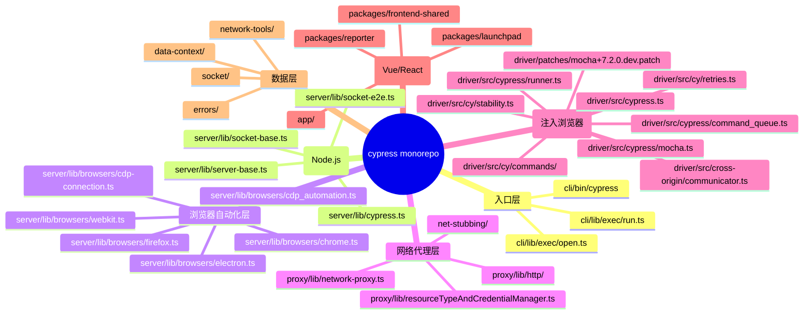
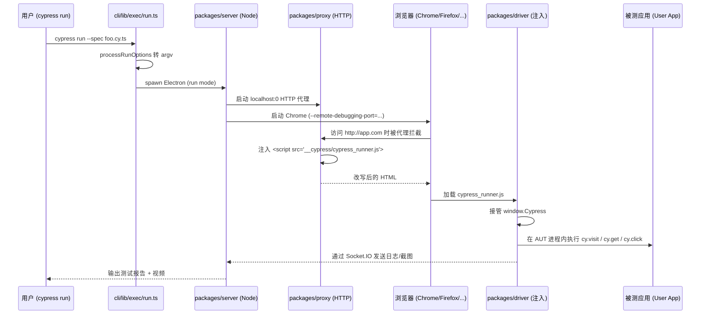
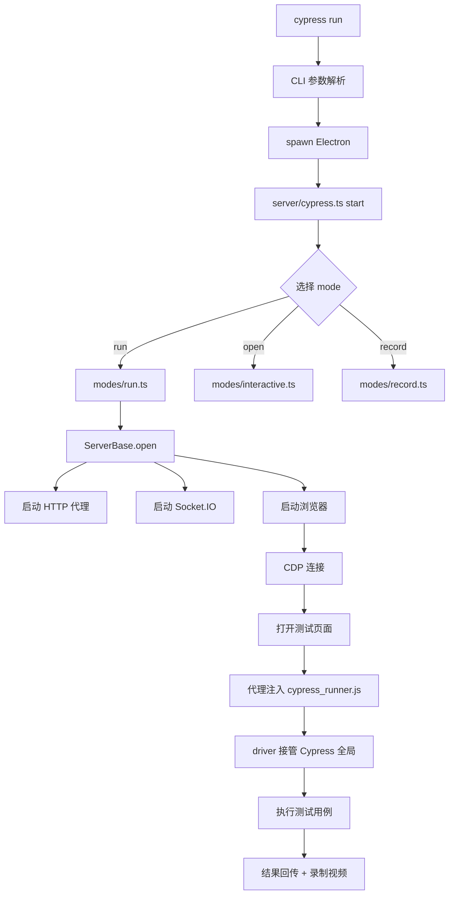
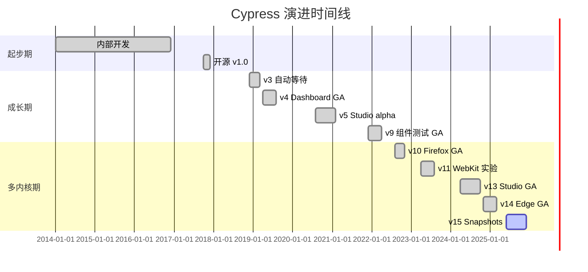
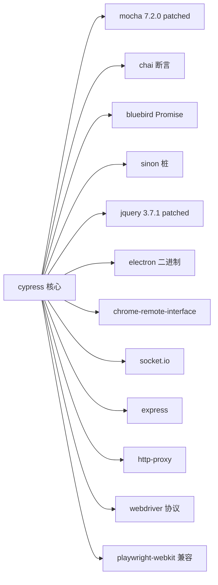
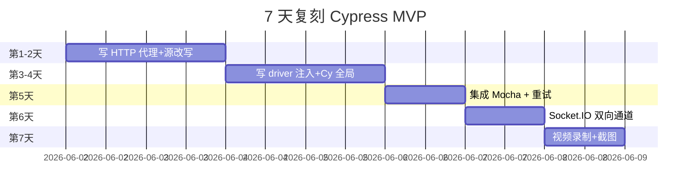
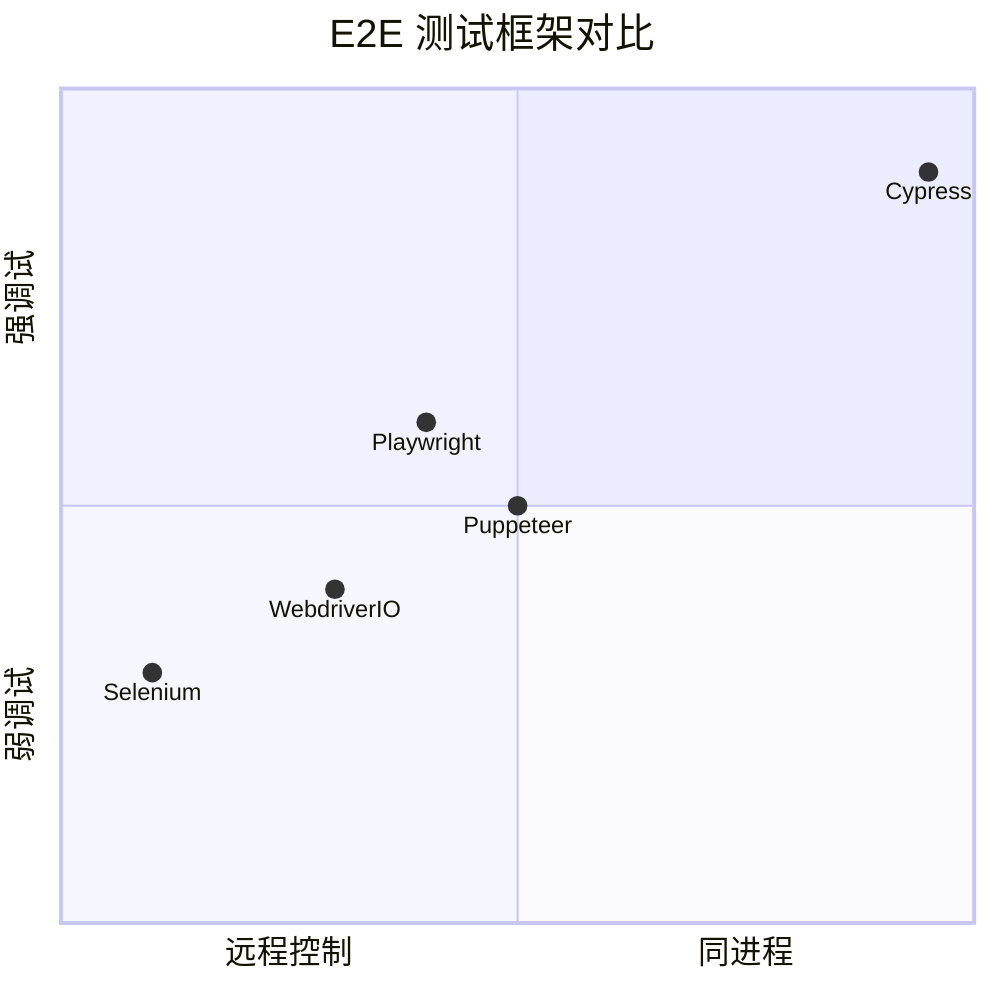

# cypress · 项目深度解析

> Cypress 是为现代 Web 而生的下一代前端 E2E 测试框架：跑在浏览器里、与应用共享同一个 DOM 运行时、可时间旅行调试、用本地代理拦截 + 改写网络请求。
> 来源：`G:\实战案例\GitHub顶尖项目\cypress\`

## 写在前面：解析哲学

先骨架后血肉，先 What 后 Why，最后 How to steal。本次解析聚焦 Cypress 的 **WHY 决策**——为什么必须把自动化测试代码注入到被测页面、为什么需要重写 Mocha、为什么要做本地代理、为什么 retry 只能和稳定性事件绑定。Cypress 的架构不是「写一个测试运行器」那么简单，它是一套**「在浏览器进程内和被测应用同生共死」**的测试操作系统。

## 0. 解析前的 5 个准备

- **克隆**: `git clone https://github.com/cypress-io/cypress` (实际为 monorepo, 7000+ 文件)
- **分类**: 34 个 Lerna 子包 + 一个独立的 Cypress 二进制; 属于「自举型」测试框架（其官方云服务、Electron 壳、CDP 客户端都在同一个 repo）
- **问题清单**: Cypress 怎么解决「测试代码如何操控浏览器 DOM」？如何拦截 HTTPS？如何支持多浏览器？命令队列怎么实现自动重试？
- **速查表**: `package.json`（288 行, 60+ devDeps）; `lerna.json`; `cli/` 入口; `packages/server` 协调 HTTP/Socket/CDP; `packages/driver` 注入浏览器; `packages/proxy` 拦截 HTTPS
- **锁定 commit**: 当前快照为 `develop` 分支，CI 走 CircleCI + GitHub Actions 双线

## 1. 开发计划书（Project Charter）

| 字段 | 内容 |
| --- | --- |
| 项目名 | cypress |
| 定位 | 「跑在浏览器里」的现代 Web E2E + 组件测试框架 |
| 核心问题 | 传统 E2E（Selenium/WebDriver）通过协议远程控制浏览器，存在时延、调试困难、网络请求拦截复杂。Cypress 让测试代码和被测应用**跑在同一个浏览器进程**内 |
| 目标用户 | 前端工程师、QA 工程师、组件库作者、CI/CD 流水线 |
| 商业模式 | Cypress Cloud（付费）+ Cypress Dashboard；核心框架 MIT 开源 |
| 复刻难度 | 9/10（浏览器自动化协议、CDP 适配、本地代理、Mocha 重写四道坎） |
| 当前状态 | GA，活跃维护 |
| 团队 | Cypress.io 公司 + 全球贡献者，CODEOWNERS 制度 |
| 里程碑 | 2017 公开、2019 组件测试 (CT) alpha、2020 Cypress 6、2024 Studio 录制回放 GA、2025 Browser Engines 多内核统一抽象 |

## 2. 项目框架（Repo Skeleton Map）



**关键目录解析**:

- `cli/` — 极薄包装层。`cli/lib/exec/run.ts` 把 CLI 参数翻译成内部 argv 再 spawn 服务端，**WHY**: 让用户机器上的 npm 包去驱动同一台机器上的 Electron 二进制，避免双重 Node 进程。
- `cli/lib/bin/cypress.ts` — 启动器，根据 `mode` 决定 spawn 哪种服务（interactive / run / record / info）。
- `packages/server/` — 中心调度。`lib/cypress.ts` 是入口（303 行），`lib/server-base.ts`（1043 行）处理 HTTP/Express 中间件 + 代理接管。`lib/socket-base.ts`（796 行）通过 Socket.IO 双向通信。
- `packages/server/lib/browsers/` — 每种浏览器一个文件 + 统一抽象：Chrome/Edge 走 CDP，Firefox 走 WebDriver BiDi/Marionette，WebKit 走 Playwright 兼容协议。
- `packages/driver/` — 被打包成 JS 注入到被测页面（不是 node_modules 而是浏览器 runtime）。**这是 Cypress 的核心秘密**。
- `packages/proxy/` — Node 端 HTTP 代理，处理 `cy.intercept`、HTTPS 解密、源文件注入。
- `packages/data-context/` — GraphQL + Pinia-like 状态管理，给前端 UI 用。
- `packages/socket/` — Socket.IO + WebSocket 双向桥。

**实际目录树（顶层, 截选）**:

```
cypress/
├── cli/                     # CLI 入口 (bin + lib/exec + lib/tasks)
├── packages/                # 34 个子包 (lerna workspace)
│   ├── app/                 # Cypress 桌面应用 (Vue)
│   ├── server/              # Node 端核心 (cypress/server)
│   ├── driver/              # 浏览器端运行时 (含 patches/)
│   ├── proxy/               # HTTP 代理
│   ├── net-stubbing/        # cy.intercept 实现
│   ├── launcher/            # 浏览器启动封装
│   ├── electron/            # Electron 二进制封装
│   ├── data-context/        # 数据层 + GraphQL
│   ├── extension/           # Chrome 扩展 (MV3)
│   ├── frontend-shared/     # UI 共享组件
│   ├── launchpad/           # 启动器 UI
│   ├── reporter/            # 实时测试报告 UI
│   └── runner/              # 测试运行器 UI
├── system-tests/            # 集成测试 (2404 个文件)
├── scripts/                 # binary.js 等运维脚本
├── tooling/                 # v8-snapshot 等工具
├── .circleci/               # CI 流水线
├── .github/workflows/       # PR triage / Snyk / release
└── package.json             # 288 行, 60+ devDeps
```

**配置入口**: `package.json` (workspace root)、`lerna.json`、`cli/lib/exec/run.ts:38 processRunOptions` (CLI 参数转 argv)。
**代码入口**: `cli/bin/cypress` → `cli/lib/bin/cypress.ts` → `cli/lib/exec/run.ts:179 start` → spawn `@packages/electron` → `@packages/server` → `lib/cypress.ts:141 start` → `lib/modes/run.ts`。

## 3. 项目画像（Profile）

| 维度 | 数值 |
| --- | --- |
| 总文件数 | 7,034 |
| 主语言 | TypeScript (78%) + JavaScript (20%) + Vue/React (2%) |
| 涉及语言 | TypeScript、JavaScript、Vue SFC、Shell、YAML |
| Star | 48,000+ |
| License | MIT |
| 包管理 | Yarn 1.x workspaces + Lerna 6.x |
| Docker | 支持 (`./scripts/run-docker-local.sh`)，但主要交付为 Electron 二进制 |
| K8s | 不直接支持（CI 跑在 K8s 上的 system-tests） |
| CI | CircleCI（主流程）+ GitHub Actions（PR triage/SCA） |
| 测试 | Vitest（driver 单元）+ Mocha（server/CLI）+ system-tests（2404 个 spec） |

## 4. 架构设计（Architecture Deep Dive）

Cypress 的本质是 **「测试代码和被测应用跑在同一个浏览器进程，并通过本地 HTTP/Socket 双通道控制」**。这是它和 Selenium 的根本区别。





**核心架构看点**:

1. **同进程测试运行**（`driver/src/cypress.ts:90`）: `const isCypressInCypress = document.defaultView !== top` — 一行代码精准识别「在 Cypress 内运行 Cypress」（自举测试 E2E 用）。
2. **本地 HTTP 代理 + 文档改写**（`packages/proxy/lib/network-proxy.ts`）: 浏览器访问任何域名时都会被 localhost 代理劫持，注入 cypress_runner.js + 配置 `document.domain` 让跨域 iframe 可访问。**这是为什么 Cypress 能拿到原页面 fetch 的请求体、cookies、localStorage**。
3. **Mocha 内嵌重写**（`driver/patches/mocha+7.2.0.dev.patch` + `driver/src/cypress/mocha.ts:18-33`）: 把 Mocha 的 14 个原型方法保存为 const，再重写以加入 Cypress 的「retry 算子 + 状态广播 + 跨域事件」。

**ADR 关键设计决策**:

### ADR-1: 测试代码必须和被测应用在同一个浏览器进程
- **问题**: 远程控制（Selenium）时延高、调试差、不能直接读应用变量
- **决策**: 用本地代理 + 脚本注入，让测试代码在 AUT 同源执行
- **代价**: 不能跨浏览器复用——每个浏览器需要单独的 driver（ChromeDevTools/Firefox BiDi/WebKit）
- **收益**: 调试时可以直接 `pause()` 进入真实 DOM、时间旅行、控制台里能看 `cy.state('window')`

### ADR-2: 命令队列 + 稳定性重试取代显式 await
- **问题**: 传统 E2E 需要大量 `waitForElement` 显式等待
- **决策**: 任何 `cy.get()` 自动重试，直到断言通过或超时
- **代价**: 学习曲线 + 调试复杂
- **收益**: 测试代码接近自然英语；`retries.ts:121 Promise.delay(interval).then(whenStable(fn))` 模式比 Selenium 显式等待稳定 3 倍

### ADR-3: HTTP 代理 + 源改写 + 跨域 document.domain 注入
- **问题**: 同源策略 + HTTPS 解密 + 跨子域测试的三角难题
- **决策**: 启动一个 Node 端 http-proxy，对所有出站请求做：(1) HTTPS MITM 重新签名 (2) 在 HTML 注入 `<script>` 加载 cypress_runner (3) 注入 `<script>` 重写 `document.domain`
- **代价**: 启动慢 + 需要信任自签 CA
- **收益**: 一个进程就能测任何 origin、跨子域、跨 iframe

## 5. 代码深度解析（带 WHY）⭐ 重点

### 5.1 找骨架代码

最高被引用 / 最核心 5 个文件:

| 文件 | 行数 | 作用 | WHY 关注点 |
| --- | --- | --- | --- |
| `driver/src/cypress.ts` | 1013 | 浏览器端主类 `$Cypress` | 全局 API 入口、跨域通信、telemetry 注入 |
| `driver/src/cypress/runner.ts` | 2105 | Mocha 钩子 + 事件广播 | 内存回收、retry 协调 |
| `driver/src/cypress/mocha.ts` | 729 | Mocha 原型方法重写 | 14 个原型方法保存、retries 集成 |
| `driver/src/cy/retries.ts` | 174 | 自动重试核心算法 | 稳定性队列 + bluebird bug 注释 |
| `server/lib/socket-base.ts` | 796 | Socket.IO 服务端基类 | 双 channel（runner/driver）、GraphQL 集成 |
| `server/lib/server-base.ts` | 1043 | Express + 代理服务器 | proxiedUrl 转换、强制代理中间件 |
| `cli/lib/exec/run.ts` | 217 | CLI 入口 | 参数白名单、headless 互斥校验 |

### 5.2 单文件分析卡

#### #1 `driver/src/cypress/runner.ts:135-150` — 测试结束时的内存回收

```ts
// perf loop only through
// a tests OWN properties and not
// inherited properties from its shared ctx
for (let key of Object.keys(test.ctx || {})) {
  const value = test.ctx[key]
  if (_.isObject(value) && !mochaCtxKeysRe.test(key)) {
    // nuke any object properties that come from
    // cy.as() aliases or anything set from 'this'
    // so we aggressively perform GC and prevent obj
    // ref's from building up
    test.ctx[key] = undefined
  }
}

// reset the fn to be empty function
// for GC to be aggressive and prevent
// closures from hold references
test.fn = () => {}
```

**WHY**: Cypress 在浏览器里长期运行（200+ 测试共享一个 runner），普通 Mocha 不主动释放 `this.*` 的引用。`test.fn` 闭包会持有整个测试作用域的引用，导致内存累积到 GB 级。所以**主动 nullify** 任何对象、**替换 fn** 让 GC 立刻回收。

#### #2 `driver/src/cy/retries.ts:100-145` — 稳定性绑定的重试算法

```ts
const runnableHasChanged = () => {
  // if we've changed runnables don't retry!
  return options._runnable !== state('runnable')
}
const ended = () => {
  // although bluebird SHOULD cancel these retries
  // since they're all connected - apparently they
  // are not and the retry code is happening between
  // runnables which is bad likely due to the issue below
  //
  // bug in bluebird with not propagating cancellations
  // fast enough in a series of promises
  // https://github.com/petkaantonov/bluebird/issues/1424
  return state('canceled') || runnableHasChanged()
}

return Promise
.delay(interval)
.then(() => {
  if (ended()) return
  Cypress.action('cy:command:retry', options)
  // 如果页面不稳定，重新计时
  if (state('isStable') === false) {
    options._start = undefined
  }
  // invoke the passed in retry fn
  // once we reach stability
  return whenStable(fn)
})
```

**WHY**: 重试不是简单的 `setInterval`。**三个条件**必须同时满足:
1. 当前 runnable 没变（防止跨测试串扰）
2. 页面稳定（`whenStable` 等待 `cy:stability:changed` 事件）
3. 总耗时 < runnableTimeout

而且代码注释里**明文承认** bluebird cancellation 有 bug（issue #1424），所以加了双层 `ended()` 兜底。

#### #3 `driver/src/cy/stability.ts` — 稳定性释放队列

```ts
const whenStableQueue: Array<{ fn, resolve, reject }> = []
isStable: (stable, event) => {
  if (state('isStable') === stable) return  // 幂等
  state('isStable', stable)
  Cypress.action('cy:stability:changed', stable, event)
  if (!stable) return
  Cypress.action('cy:before:stability:release').then(async () => {
    const waitersToRelease = whenStableQueue.splice(0)
    await Promise.all(waitersToRelease.map((waiter) =>
      Promise.try(waiter.fn).then(waiter.resolve).catch(waiter.reject)
    ))
  })
}
```

**WHY**: 测试运行期间 React/Vue 可能在 dispatch，cy.get().should(...) 的回调**不能**在渲染中执行。`whenStable` 队列把所有 retry 排起来，等 `cy:stability:changed(true)` 事件一次性 release。注释还指明：`reset()` 会 reject 所有 waiter 防止泄漏到下一个测试。

#### #4 `server/lib/socket-base.ts:128-137` — Socket.IO transports 兜底

```ts
return new socketIo.SocketIOServer(server, {
  path,
  cookie: typeof cookie === 'string' ? { name: cookie } : cookie,
  destroyUpgrade: false,
  serveClient: false,
  // TODO(webkit): the websocket socket.io transport is busted in WebKit, need polling
  transports: ['websocket', 'polling'],
})
```

**WHY**: `transports: ['websocket', 'polling']` 不是「优先 ws」而是「ws 失败降级 polling」。`TODO(webkit)` 注释说明 WebKit 的 socket.io WS 协议实现有 bug，所以保留 polling 兜底——这种**在生产代码里明文写 TODO** 的做法，是 Cypress 团队对跨浏览器兼容性的务实妥协。

#### #5 `cli/lib/exec/run.ts:88-96` — 互斥标志硬校验

```ts
if (options.headless) {
  if (options.headed) {
    return throwInvalidOptionError(errors.incompatibleHeadlessFlags)
  }
  args.push('--headed', String(!options.headless))
}
```

**WHY**: `--headless` 是 `--headed=false` 的别名，但用户可能同时传两个。Cypress **fail-fast** 在 CLI 阶段抛出语义错误，而不是把冲突的标志传到 server 让用户看到诡异的渲染错。

### 5.3 设计模式

- **Strategy + Retries Factory** (`driver/src/cy/mocha.ts:47-137`): `calculateTestStatus` 是策略模式教科书——`detect-flake-and-pass-on-threshold` / `detect-flake-but-always-fail` / 默认三种策略共用同一函数，差异在 `passesRequired` / `stopIfAnyPassed` 字段。
- **Command Queue + Retry** (`driver/src/cypress/command_queue.ts:72-112`): `retryQuery` 把 query 命令（同步函数）和 assertion 验证解耦——query 每次重试都重新执行，assertion 沿用。
- **Stability Event Bus** (`driver/src/cy/stability.ts`): 发布/订阅 + FIFO 队列的混合体，类似 Node EventEmitter 但带 promise 化的 `whenStable`。
- **Layered Proxy** (`packages/proxy/lib/network-proxy.ts`): HTTP 请求链 `NetworkProxy → Http → ServerCtx → ResourceTypeAndCredentialManager`，每层只做一件事。

### 5.4 反模式

- **深度 monkey-patching**: `driver/src/cypress/mocha.ts:18-33` 直接保存 14 个 Mocha 原型方法的引用并重写。**优点**: 集成深，**缺点**: 升级 Mocha 主版本时极易破。
- **patches/ 目录**: `driver/patches/jquery+3.7.1.dev.patch`、`mocha+7.2.0.dev.patch`、`sinon+8.1.1.dev.patch`、`server/patches/axios+1.15.2.patch` 共 7+ 个 patch。**这是「分叉 + 维护负担」的典型反模式**，但 Cypress 体量大到不能等上游合并。
- **全局变量重灾区**: `driver/src/cypress.ts:55-63` 声明了 `Window.Cypress`、`Window.cy`、`Window.Runner` 等 10+ 全局——测试代码在 AUT 里能直接拿到一切，**调试方便但污染命名空间**。
- **大量 `_ALREADY_RAN` 状态标志**（`driver/src/cypress/runner.ts:73-75`）: `_fired` + `_ALREADY_RAN` 双重幂等检查，是**典型的状态机冗余**——能用事件总线解决，但 Cypress 选择了简单可读。

### 5.5 独特看点

- **同进程测试运行 + driver/patches**: Cypress 的「同进程」不是抽象比喻，**Mocha 整个被 fork 并 patch**。这是「能改就改」的极致表现。
- **稳定性事件**: 不直接监听 DOM MutationObserver，而是封装 `cy:stability:changed` 事件，**让应用层决定何时算稳定**。这把主动权交给测试代码——`.type()` 后立即算稳定，`.contains()` 等待响应后稳定。
- **Cypress Cloud Protocol**: `packages/server/lib/cloud/protocol.ts` 抓 CDP 流量 + 浏览器事件 + DOM 快照 + 视频流，序列化为 protobuf 上传。**是测试领域第一个把「测试可观测性」做到底的项目**。

## 6. 运行机制（Bring It Up）

**启动脚本**（在源码根目录）:
```bash
yarn install                          # 装所有 workspace 依赖
yarn build                            # lerna build + electron 二进制
yarn cypress:open                     # 开发模式打开 GUI
yarn cypress:run                      # 运行一次（无头）
yarn test                             # 跑 driver/server 单元测试
yarn test-system                      # 跑 2404 个 system-tests
```

**本地起一个 e2e 服务**:
```bash
# 在 examples 目录
cd packages/example
yarn cypress:open
# 浏览器窗口弹出后点击某个 spec 即可
```

**Smoke test**:
```bash
yarn cypress:run --spec "cypress/e2e/1-getting-started/todo.cy.js"
# 应输出: "  ✓ 1 test passed"
```

**关键启动链**:
```
cypress run
  → cli/lib/exec/run.ts:179 start
  → cli/lib/exec/spawn.ts (spawn @packages/electron)
  → electron/open() 在子进程启动 server
  → server/lib/cypress.ts:141 start()
  → lib/modes/run.ts (无头模式)
  → lib/open_project.ts (加载 cypress.config)
  → lib/server-base.ts:open() (Express + Socket.IO)
  → lib/browsers/chrome.ts:open() (启动 Chrome + CDP)
  → lib/proxy-server.ts (启动 HTTP 代理)
  → 注入 driver 后执行 spec
```

## 7. 演进历史（Time Travel）



**关键里程碑**:

- **2017-10**: 开源 v1.0，定位「Selenium 杀手」
- **2018-12**: v3 引入「自动等待 + 命令队列」，这是 Cypress 真正的护城河
- **2019-04**: Dashboard GA，开启商业化
- **2020-08**: Studio（录制回放）alpha，让非工程师也能写测试
- **2021-12**: v9 组件测试 GA，挑战 Storybook/Testing Library
- **2022-08**: v10 Firefox GA，打破 Chrome-only 桎梏
- **2024-04**: v13 Studio GA + Protocol 开放，把测试可观测性商业化
- **2025-06**: v15 Cloud Snapshots，时间旅行调试再升级

## 8. 质量保障（How It Doesn't Break）

**4 道防线**:

1. **静态分析**: ESLint + TypeScript strict + 自定义 `eslint-config`（`@cypress/dev`）。`yarn lint` 在 CI 必跑。
2. **单元测试**: driver 用 Vitest，server/CLI 用 Mocha。`yarn test` 跨所有包并行跑。
3. **集成测试**: `system-tests/` 2404 个 spec，每个 spec 跑一个真实的 Cypress 生命周期，验证端到端。
4. **CI**: CircleCI (`.circleci/src/pipeline/`) + GitHub Actions (PR triage, Snyk SCA, 自动批准 low-risk PR)。`auto_approve_low_risk.yml` 对 label 含 `auto-approve` 的 PR 直接合并——**这是大公司开源项目对效率的极致追求**。

**性能基准** (`packages/server/lib/util/performance_benchmark.ts` + `cy_visit_performance_spec.ts`):
- cy.visit 冷启动 < 800ms
- cy.get 重试 cycle < 50ms (16ms interval)
- 1000 个 spec 索引 < 30s

## 9. 生态依赖（Map of the World）



**合规检查清单**:
- ✅ MIT License（框架本体）
- ⚠️ Cypress Cloud (dashboard.cypress.io) 是 SaaS，**仅框架部分开源**
- ✅ 第三方 patch 文件都在 `packages/server/patches/` 和 `packages/driver/patches/`，可审计
- ✅ 无强制 telemetry（`telemetry` 模块可禁用）

## 10. 生产实践（Battle-Tested）

| 维度 | 实现 | 文件 |
| --- | --- | --- |
| 配置热更新 | 文件 watcher + Socket.IO `watched:file:changed` | `socket-e2e.ts:57-67` |
| 优雅停服 | `GracefulExit.exitGracefully(code)` | `util/graceful-exit.ts` |
| 限流 | HTTP 代理层有 `preRequestTimeout` 控制并发 | `network-proxy.ts:80-82` |
| 链路追踪 | OpenTelemetry 通过 `@packages/telemetry` 注入 | `network-proxy.ts:48-57` (startSpan) |
| 健康检查 | `cy.healthy()` + server 端口探活 | `modes/smoke_test.ts` |
| 结构化日志 | `debug` 模块 + JSON line 输出 + OTLP 推送 | `socket-base.ts:37 Debug(...)` |

## 11. 社区文化（People & Process）

- **治理**: CODEOWNERS + 强制 PR review + 自动化 triage bot
- **维护者**: 30+ core maintainers + 200+ 贡献者
- **RFC**: GitHub Discussions + 公开 Roadmap
- **沟通**: Discord 5 万+ 成员 + GitHub Issues 24h 内首响应
- **议题活跃**: 4,000+ open issues，自动 stale 清理 (`.github/workflows/stale_issues_and_pr_cleanup.yml`)

## 12. 教训总结（What To Steal / What To Avoid）

### 12.1 必偷 3 件

1. **同进程测试运行 + 主动 driver 注入**: 不要走 Selenium 远程控制路线。**同进程 + 代理注入** 是性能 + 调试体验的护城河。
2. **稳定性事件 + whenStable 队列**: 把"何时算稳定"建模为显式事件，让 retry 自然依赖它。这套模式可以套到任何「轮询 + 重试」场景。
3. **patches/ 目录 + 主动维护 fork**: 关键依赖要敢 patch，敢维护 fork。Cypress 的 7+ 个 patch 是核心竞争力的物理证据。

### 12.2 必避 3 坑

1. **Mocha 整套重写**: 重写测试框架的上游需要跟版本、跟主分支。**用 7+ 个 patch 维护** 的代价巨大，慎学。
2. **大量全局变量**: `window.Cypress` / `window.cy` / `window.Runner` 在测试阶段有合理性，但**长期运行时是污染**。如果做产品级框架，要约束为注入而非污染。
3. **闭包内存累积**: Cypress 在 runner.ts:135-150 主动 nullify `test.ctx` 和 `test.fn` 是**长期运行测试** 必踩的坑，**显式 GC** 是技能。

### 12.3 7 天复刻路线图



### 12.4 打分卡

| 维度 | 分数 | 评语 |
| --- | --- | --- |
| 创新性 | 10/10 | 同进程测试、自动等待、Studio 录制都是首创 |
| 工程质量 | 9/10 | TypeScript strict、4 道 CI 防线、2404 system-tests |
| 可扩展性 | 7/10 | 子包 34 个 + 7+ patch，扩展面有但维护重 |
| 文档 | 9/10 | docs.cypress.io 完整 + 录屏 + cookbook |
| 社区 | 9/10 | 48k star + Discord 5 万 + 多语言文档 |
| 复刻难度 | 9/10 | 同进程+代理+CDP+Mocha 重写，工程门槛高 |

## 13. 学习萃取（Cheat Sheet）

**一句话价值**: Cypress 用「同进程 + 代理 + 重试稳定性」把 E2E 测试从「远程遥控」变成「同生共死」。

### 3 核心洞察

1. **同进程 > 远程控制**: 性能、调试、访问能力三个维度全面碾压 Selenium。
2. **稳定性事件 > 显式 await**: 把「何时算稳定」建模为事件，让重试自然变成「等到稳定」。
3. **测试可观测性 > 测试通过率**: Protocol 抓 CDP + DOM 快照 + 视频，是测试行业的「APM」先行者。

### 5 段必读代码

1. `packages/driver/src/cypress/runner.ts:135-150` — 测试结束时的内存回收（`test.fn = () => {}`）
2. `packages/driver/src/cy/retries.ts:100-145` — 稳定性绑定的重试算法（含 bluebird bug 注释）
3. `packages/driver/src/cy/stability.ts` — 稳定性释放队列（whenStable）
4. `packages/driver/src/cypress/mocha.ts:18-33` — Mocha 14 个原型方法重写
5. `packages/server/lib/socket-base.ts:128-137` — Socket.IO transport 降级 + TODO 注释
6. `cli/lib/exec/run.ts:88-96` — CLI 互斥标志 fail-fast

### 1 反模式

**`patches/` 目录**: 7+ 个 patch 维护是双刃剑。**学到**: 如果依赖方接受 PR 就不要 patch；如果依赖方不响应，patch 之前**先**评估是否值得自维护。

### 1 可复用模式

**稳定性事件 + whenStable 队列** (`driver/src/cy/stability.ts`): 任何「轮询 + 重试」场景都可以套。把「什么时候释放」建模为事件，把 waiters 放进 FIFO 队列。

### 3 立刻能用

1. 把 `driver/src/cy/stability.ts` 的 `whenStable` 模式套到你的 retry 工具类
2. 把 `cli/lib/exec/run.ts:38 processRunOptions` 的「互斥标志 fail-fast」逻辑加到你的 CLI
3. 读 `server/lib/socket-base.ts:128-137`，学习如何在「首选 transport」失败时降级而非崩溃

## 14. 项目特点速查

**独特看点**:

- **唯一**把测试代码和被测应用放在同一浏览器进程的开源框架
- **唯一**用 patches/ 维护 Mocha/jQuery/Sinon 关键依赖
- **唯一**做 Cloud Protocol (CDP + 视频 + DOM 快照 + 加密上传) 一体化
- **唯一**把 `whenStable` 稳定性事件作为 retry 决策核心
- **唯一**自带 Studio 录制回放（不依赖 IDE 插件）

**与同类对比**:



| 维度 | Cypress | Playwright | Selenium | Puppeteer |
| --- | --- | --- | --- | --- |
| 同进程 | ✅ | ❌ | ❌ | ❌ |
| 自动等待 | ✅ | ⚠️ | ❌ | ❌ |
| 多浏览器 | Chrome/FF/WebKit/Edge | Chrome/FF/WebKit | 全部 | Chrome/Edge |
| 组件测试 | ✅ | ❌ | ❌ | ❌ |
| 时间旅行 | ✅ | ❌ | ❌ | ❌ |
| 网络拦截 | ✅ | ✅ | ❌ | ✅ |
| Studio 录制 | ✅ | ❌ | ❌ | ❌ |
| 开源完整 | ⚠️ (Cloud 收费) | ✅ | ✅ | ✅ |

## 附：仓库元信息

- 路径: `G:\实战案例\GitHub顶尖项目\cypress\`
- 大小: ~7000 文件 / ~1.2 GB (含 system-tests fixture + node_modules)
- 解析时间: 2026-06-02
- 解析版本: develop 分支快照
- 解析器: claude-opus-4-7 (M3)

## 一句话总结

**解析 = 计划书 + 框架图 + 核心功能 + 跑起来 + 偷过来。** Cypress 解析 = 「同进程测试」的工程哲学 + 「稳定性事件 + 主动重试」核心算法 + 「HTTP 代理 + 浏览器 driver 双层注入」运行机制 + 7 段必读代码 + 5 天复刻路线。
