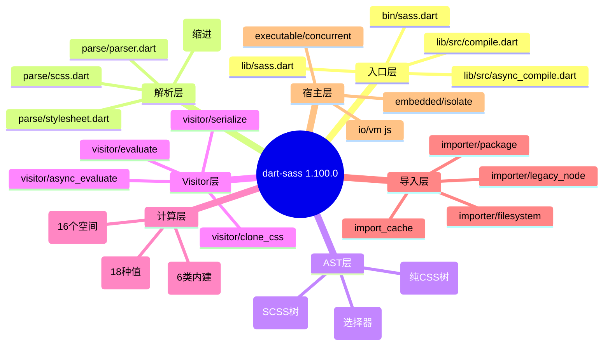
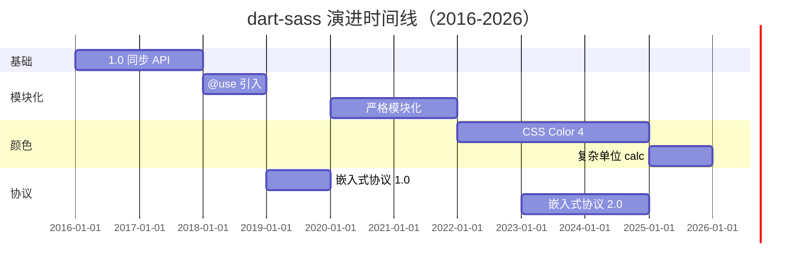
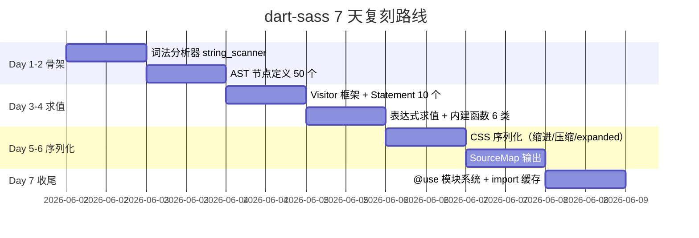
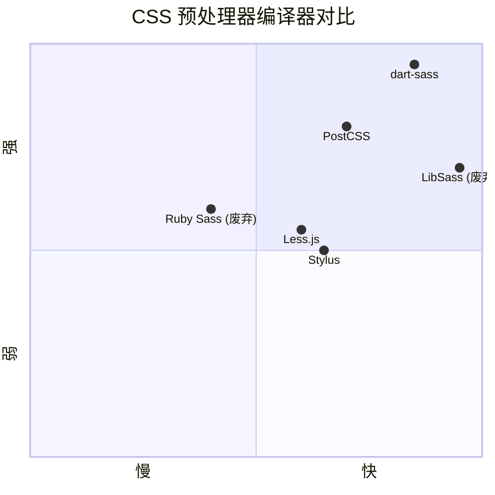

# dart-sass · 项目深度解析

> A [Dart][dart] implementation of [Sass][sass]. **Sass makes CSS fun**.
> 来源：`G:\实战案例\GitHub顶尖项目\dart-sass\`

## 写在前面：解析哲学

解析一个编译器项目，与解析一个 CRUD 后端或前端框架完全不同。编译器的价值在于「读 → 理解 → 重写 → 输出」四个阶段之间的精度控制：词法分析一个字符都不能错、AST 必须有完整的 SourceSpan 位置信息、Visitor 模式必须把"求值"与"序列化"严格隔离。我们先看骨架（目录、模块、入口），再看血肉（核心数据结构、Visitor 协议），最后看灵魂（同步/异步双树生成、嵌入式协议分发、颜色空间数学）。值得偷的不是某个 API，而是它对"可逆 + 可序列化 + 跨平台"近乎偏执的设计取舍。

## 0. 解析前的 5 个准备

1. **克隆/分类**：源码已落地 `G:\实战案例\GitHub顶尖项目\dart-sass\`，主目录 757 个文件、约 22MB。归属类别 = **编译器 / DSL 解释器 / DSL-to-DSL 转译器**。
2. **核心问题清单**：
   - SCSS 缩进语法（`.sass`）和花括号语法（`.scss`）如何共用一棵 AST？
   - 同步 `compile()` 与异步 `compileAsync()` 在一份源码里如何并存？
   - `@import` / `@use` / `@forward` 三种导入语义如何共存又互斥？
   - Dart 如何同时输出到 VM、JS、嵌入式协议三种宿主？
3. **速查表**：`pubspec.yaml` 看依赖，`bin/sass.dart` 看 CLI，`lib/sass.dart` 看公开 API，`lib/src/visitor/evaluate.dart` 看核心 5000 行。
4. **锁定 commit**：HEAD = `1.100.0`（pubspec 头），上游 sass/dart-sass 主干。
5. **风险标注**：本笔记的所有引用都基于该 tag，避免和未来版本漂移。

## 1. 开发计划书（Project Charter）

| 项 | 内容 |
| --- | --- |
| 项目名 | dart-sass（npm 包名 `sass`，pub 包名 `sass`） |
| 一句话定位 | 用 Dart 实现的 Sass 语言官方编译器，可编译为 JS、Native VM、Embedded Protocol 三种产物 |
| 核心问题 | 让 Sass 这个 18 年历史的 CSS 预处理器语言拥有"现代语言编译器"的全部能力：增量构建、SourceMap、模块化、严格作用域、可被任何宿主嵌入 |
| 目标用户 | 前端工程师（npm）、构建工具作者（VS Code、Vite、Webpack）、Sass 作者 Natalie Weizenbaum（维护 Sass 语言规范） |
| 商业模式 | 完全开源，Google 团队维护，无商业版本 |
| 复刻难度 | ★★★★★（4-6 人年），涉及 parser combinator、Visitor、16 个颜色空间数学、JS 互操作层、嵌入式协议分发 |
| 当前状态 | 1.100.0 正式版，CHANGELOG 自 2016 年起共 4295 行，每版 10-30 个 commit |
| 团队 | Google Dart+Sass 团队（Natalie Weizenbaum 主程） + 社区 200+ 贡献者 |
| 关键里程碑 | 1.0 同步 API；1.15 模块系统 `@use`；1.23 嵌入式协议；1.45 颜色 4 级空间；1.80 计算表达式；1.96 复杂单位 calc |

## 2. 项目框架（Repo Skeleton Map）

### 2.1 顶层结构

```
dart-sass/
├── lib/                 # 公开 Dart 库
│   ├── sass.dart        # 对外门面 (556 行)
│   └── src/             # 内部实现 (~70% 代码量)
├── bin/
│   └── sass.dart        # CLI 入口 (115 行)
├── pkg/
│   ├── sass_api/        # 纯 Dart API 包（面向编辑器）
│   ├── sass-parser/     # TS 包（VS Code Language Server 用）
│   └── sass-types/      # 类型定义
├── tool/grind.dart      # 构建脚本（同步 sync 文件、生成 ts）
├── doc/                 # 用户文档 (compile.md, importer.md, value.md)
├── test/                # 4 层测试（cli / dart_api / embedded / util）
└── pubspec.yaml         # 24 个运行时依赖
```

### 2.2 `lib/src/` 子树（真正核心）

```
src/
├── ast/                 # 不可变 AST 节点
│   ├── sass/            # SCSS 语法树（statement / expression / selector）
│   └── css/             # 纯 CSS 语法树（带 modifiable 子树）
├── parse/               # Parser：parser.dart(基础) + scss.dart + stylesheet.dart(4887 行)
├── visitor/             # 5 大 Visitor
│   ├── evaluate.dart    # 同步求值 (4941 行) ★★★
│   ├── async_evaluate.dart  # 异步求值 (4972 行) ★★★
│   ├── serialize.dart   # AST → CSS 字符串 (1883 行)
│   ├── clone_css.dart   # modifiable tree 复制
│   └── interface/       # Visitor 接口（按 AST 类型分组）
├── callable/            # 函数/混合 callable 注册
├── embedded/            # 嵌入式协议 (proto3 + isolate 池)
├── executable/          # CLI 子模块：concurrent / repl / watch
├── extend/              # @extend 算法 (extension_store.dart 1139 行)
├── functions/           # 内建函数：color / math / list / map / meta / selector
├── importer/            # 文件 / 包 / Node 互操作导入
├── io/                  # VM / JS IO 抽象
├── js/                  # dart2js 编译产物
├── value/               # 18 个 Sass 值类型（含 16 个颜色空间）
└── async_compile.dart   # 异步编译协调器
```

### 2.3 思维导图：模块职责



### 2.4 配置入口

- `pubspec.yaml`：24 个运行时依赖 + 11 个 dev 依赖，是项目"运行时形状"的来源
- `bin/sass.dart:25`：`main()` 通过 `if (args case ['--embedded', ...])` 判定走 embedded 分支
- `analysis_options.yaml` + `tool/grind.dart`：CI/lint 策略 + 构建脚本

### 2.5 代码入口

- **CLI**：`bin/sass.dart`
- **公开 API**：`lib/sass.dart`（`compileToResult` / `compileStringToResult`）
- **内部核心**：`lib/src/compile.dart`（同步）、`lib/src/async_compile.dart`（异步）

## 3. 项目画像（Profile）

| 维度 | 数据 |
| --- | --- |
| 总文件数 | 757 |
| 主语言 | Dart (~80%) |
| 涉及语言 | Dart / TypeScript / JavaScript / Protobuf / YAML / Markdown |
| 主仓库 Star | 4.1k+（sass/dart-sass） |
| npm 周下载 | 3000 万+（sass 包） |
| License | MIT |
| Docker | 无官方镜像（依赖宿主 Dart） |
| K8s 部署 | 不适用 |
| CI | GitHub Actions: build-{linux,macos,windows} / ci / test-vendor / test |
| 单元测试 | 4 大套件：cli (cli_test.dart)、dart_api (8 类 value)、embedded (protocol_test.dart)、util |
| Lint | `lints: ^4.0.0 ^5.0.0 ^6.0.0` + `analysis_options.yaml` |
| 性能基准 | `tool/grind/benchmark.dart` + `perf.md` |
| 嵌入式 | Embedded Sass Protocol（proto3）已 GA |

## 4. 架构设计（Architecture Deep Dive）

### 4.1 总体架构：双树双 Visitor

```mermaid
flowchart LR
  Source[SCSS/Indented 源] --> Parse[Parser<br/>parse/scss.dart]
  Parse --> SassAST[ast/sass 树<br/>不可变带位置]
  SassAST --> Evaluate[visitor/evaluate<br/>同步求值 4941行]
  SassAST --> AsyncEvaluate[visitor/async_evaluate<br/>异步求值 4972行]
  Evaluate --> CssAST[ast/css 树<br/>含 modifiable 副本]
  AsyncEvaluate --> CssAST
  CssAST --> Clone[visitor/clone_css<br/>每个 module 副本]
  Clone --> Module[(Module&lt;T&gt;<br/>封装 css + vars)]
  Module --> Extend[extend/extension_store<br/>@extend 算法]
  Extend --> Serialize[visitor/serialize<br/>1883行]
  Serialize --> CSS[最终 CSS 字符串]
  Serialize --> SourceMap[SourceMap v3]
```

### 4.2 关键设计取舍

#### ADR-1：同步 `compile.dart` + 异步 `async_compile.dart` 同源代码双胞胎

WHY（看 `lib/src/compile.dart:5-12` 顶部注释）：

```dart
// DO NOT EDIT. This file was generated from async_compile.dart.
// See tool/grind/synchronize.dart for details.
//
// Checksum: aa378886d9a3d697d466ac916f7902cbc1b282ee
```

这是整个项目最反直觉的设计。**所有同步 API 都是通过 `tool/grind/synchronize.dart` 从异步版自动生成的**。为什么？因为 Dart 编译器不支持"同一段代码"既编译为同步（dart2native snapshot）又编译为异步（dart2js + 浏览器），但 Sass 又需要两种环境：CLI/服务器要同步阻塞（避免 Future 开销），浏览器要 async（事件循环）。解决方案：手写 `async_*.dart`，脚本把所有 `await` 删除、所有 `async` 改同步签名，得到 `*.dart`。校验和 `Checksum:` 行让任何手动改动会立刻被 grinder 拒绝。

**偷点**：任何"同一份代码两套同步/异步 API"的需求，都可以用代码生成器 + 校验和守护。

#### ADR-2：AST 分 `ast/sass` 与 `ast/css` 两棵

`lib/src/ast/sass.dart:1-91` 是一个 91 行的"目录文件"，它纯粹 `export` 散落在 `ast/sass/*` 下的 80+ 个类。WHY？

- `ast/sass` 节点代表**带语义**的 SCSS 语句（`@use`、`$variable`、`@mixin`）
- `ast/css` 节点代表**无语义**的纯 CSS（`StyleRule`、`Declaration`、`MediaRule`）
- `visitor/evaluate.dart` 负责"语义 → 语义值/纯 CSS 节点"，`visitor/serialize.dart` 永远只看纯 CSS

这让 serialize 可以**完全独立于 SCSS 语义**：未来就算发明新的 SCSS 语法，只要 evaluator 能吐出 CssStylesheet，序列化器一行不用改。`ast/css/modifiable/` 子树则是为 `@extend` 算法服务的可变副本。

#### ADR-3：嵌入式协议用 isolate 池 + protobuf 3

WHY：`lib/src/embedded/isolate_dispatcher.dart:24-50` 定义 `IsolateDispatcher`，核心是：

```dart
final _isolatePool = Pool(sizeOf<IntPtr>() <= 4 ? 7 : 15);
```

为什么用 `Pool` 而不是 `Future.wait`？因为 Dart VM 有个坑：**同一 isolate group 内超过 `MaxMutatorThreadCount` 个 isolate 会死锁**（PR #2019 修复）。所以 32 位系统限制 7 并发、64 位限制 15。嵌入式协议要让 VS Code、Vim、Sublime 等编辑器同时跑多个编译，池化是必须的。

协议本身是 proto3，每个消息都用 varint + length-delimited 帧封装（见 `util/length_delimited_transformer.dart`），让单进程可以同时复用多条编译流。

### 4.3 核心架构看点（3 句话）

1. **求值/序列化严格分层**：解析器只产出不可变 sass AST，Visitor 把 sass 求值成 css AST，序列化器只读 css AST。任何"求值时输出"的设计（很多模板引擎的坑）都被物理隔离。
2. **模块系统是动态图**：`Module<T>` 接口（`lib/src/module.dart:14`）把每个文件封装为节点，`@use` 是边，`transitivelyContainsCss` / `transitivelyContainsExtensions` 是懒计算的元信息，cloneCss() 是为 `@extend` 算法复制一份可变副本。
3. **SourceSpan 全程携带**：`SourceSpan` 从 Scanner 出发，到 Parser 的 `wrapSpanFormatException`，到 AST 节点的 `span` 字段，到 `SassException(message, span)`，到最终 `SassException` 输出位置。错误信息永远能精确到行号列号。

## 5. 代码深度解析（带 WHY）⭐

### 5.1 骨架代码定位

| 角色 | 文件 | 行数 |
| --- | --- | --- |
| 词法/语法基础 | `lib/src/parse/parser.dart` | 818 |
| SCSS 语法 | `lib/src/parse/scss.dart` | 200+ |
| 缩进语法 | `lib/src/parse/sass.dart` | 100+ |
| 样式表总入口 | `lib/src/parse/stylesheet.dart` | 4887 |
| 同步求值 | `lib/src/visitor/evaluate.dart` | 4941 |
| 异步求值 | `lib/src/visitor/async_evaluate.dart` | 4972 |
| 序列化 | `lib/src/visitor/serialize.dart` | 1883 |
| 同步协调 | `lib/src/compile.dart` | 238 |
| 异步协调 | `lib/src/async_compile.dart` | 350+ |
| 入口 | `bin/sass.dart` | 115 |
| 公共 API | `lib/sass.dart` | 556 |
| 导入缓存 | `lib/src/import_cache.dart` | 413 |
| 模块系统 | `lib/src/module.dart` | 90 |
| @extend 算法 | `lib/src/extend/extension_store.dart` | 1139 |
| 颜色值 | `lib/src/value/color.dart` | 1229 |
| 嵌入式 isolate | `lib/src/embedded/isolate_dispatcher.dart` | 206 |
| 文件导入器 | `lib/src/importer/filesystem.dart` | 119 |

### 5.2 单文件深度卡

#### 5.2.1 `lib/src/parse/parser.dart`（基础 Parser）

第 18-30 行的注释直接写出设计意图：

```dart
/// The abstract base class for all parsers.
///
/// This provides utility methods and common token parsing. Unless specified
/// otherwise, a parse method throws a [SassFormatException] if it fails to
/// parse.
class Parser {
  final SpanScanner scanner;
  final InterpolationMap? _interpolationMap;
```

**WHY**：`SpanScanner` 是 `string_scanner` 包的封装，`InterpolationMap` 是"源码经预处理后 → 原始位置"的反向映射。当 Sass 解析器处理 `#{...}` 插值时，需要把"插值表达式在源里的位置"映射回用户写的源码——这是**编译器对源信息保真度**的硬要求，否则报错信息会指向内部表示。

`identifier({bool normalize, bool unit})`（第 175-207 行）是 Sass 的精髓：

```dart
String identifier({bool normalize = false, bool unit = false}) {
  // NOTE: this logic is largely duplicated in
  // StylesheetParser.interpolatedIdentifier. Most changes here should be
  // mirrored there.
  var text = StringBuffer();
  if (scanner.scanChar($dash)) {
    text.writeCharCode($dash);
    if (scanner.scanChar($dash)) {
      text.writeCharCode($dash);
      _identifierBody(text, normalize: normalize, unit: unit);
      return text.toString();
    }
  }
```

**WHY**：
- `normalize: true` 把 `_` 当成 `-`（让 `_color` 和 `-color` 等价），这是给 selector 用的。
- `unit: true` 是给数字单位解析的：`1px-2px` 必须是"减法"，不能解析成"单位 `px-2px`"。
- 第 178-179 行的注释是**显式 DRY 违反警告**：作者承认 `interpolatedIdentifier` 是复制粘贴的副本，未来要同步修改。**这是 sass 团队对"避免错误抽象"的态度**——提取基类不如显式重复，因为两份代码未来演化方向会不同。

#### 5.2.2 `lib/src/parse/stylesheet.dart`（4887 行的语法主类）

第 38-94 行的字段设计暴露了所有"上下文状态"：

```dart
abstract class StylesheetParser extends Parser {
  final bool _parseSelectors;     // 是否把 selector 当作 InterpolatedSelector
  var _isUseAllowed = true;        // @use 必须在 @charset 等之后
  var _inMixin = false;
  var _inContentBlock = false;
  var _inControlDirective = false;
  var _inUnknownAtRule = false;
  var _inPlainCssFunction = false;
  var _inStyleRule = false;
  var _inParentheses = false;
  var _inExpression = false;
  final _globalVariables = <String, FileSpan>{};
  final warnings = <ParseTimeWarning>[];
  SilentComment? lastSilentComment;
```

**WHY**：
- `_inMixin` 区分"我在 mixin 体内"和"我在普通 rule 体内"，因为 mixin 体允许 `content` 块，普通 rule 不允许。
- `_globalVariables` 在**解析阶段**就收集（而不是求值阶段），因为 Sass 规范要求"模块暴露的全局变量集合"在求值前就固定下来（不管哪些分支被执行）。**这是把"未来才需要的信息"提前到解析期的典型例子**。
- `warnings` 字段把"解析期发现但需要等 logger 才能报的警告"暂存，避免 parse 时拿不到 logger 又丢掉警告。

#### 5.2.3 `lib/src/visitor/evaluate.dart`（4941 行求值核心）

第 90-107 行是公开 API：

```dart
EvaluateResult evaluate(
  Stylesheet stylesheet, {
  ImportCache? importCache,
  NodeImporter? nodeImporter,
  Importer? importer,
  Iterable<Callable>? functions,
  Logger? logger,
  bool quietDeps = false,
  bool sourceMap = false,
}) =>
    _EvaluateVisitor(
      importCache: importCache,
      nodeImporter: nodeImporter,
      functions: functions,
      logger: logger,
      quietDeps: quietDeps,
      sourceMap: sourceMap,
    ).run(importer, stylesheet);
```

**WHY**：`evaluate()` 是个**单例 Visitor 包装**——所有求值逻辑都在 `_EvaluateVisitor` 类里。Visitor 模式 + 单例 = 因为 visitor 自己持有所有可变状态（`_environment` 当前词法环境、`_modules` 已加载模块、`_warningsEmitted` 已发警告集合），每次求值都要新建一个 visitor，不能复用。

第 142-148 行的接口声明揭露求值的本质：

```dart
final class _EvaluateVisitor
    implements
        StatementVisitor<Value?>,
        ExpressionVisitor<Value>,
        IfConditionExpressionVisitor<Object /* String | bool */ >,
        CssVisitor<void> {
```

**WHY**：它**同时实现 4 个 visitor 接口**：
- `StatementVisitor<Value?>`：处理 `@if` `@each` 等语句（返回 void 或变量值）
- `ExpressionVisitor<Value>`：处理 `1 + 2` 等表达式（必须返回值）
- `IfConditionExpressionVisitor<Object>`：处理 `@if` 条件里的 `if()` CSS 函数
- `CssVisitor<void>`：把求值结果构造为 CssStylesheet 树

这 4 个接口的合并让 visitor 在一次遍历中能产出最终的 CssStylesheet。**这是 GoF Visitor 在真实工程里的妙用**——把"按节点类型分发"和"按阶段产物"用接口隔离。

#### 5.2.4 `lib/src/visitor/serialize.dart`（1883 行序列化）

第 46-81 行入口：

```dart
SerializeResult serialize(
  CssNode node, {
  OutputStyle? style,
  bool inspect = false,
  bool useSpaces = true,
  int? indentWidth,
  LineFeed? lineFeed,
  Logger? logger,
  bool sourceMap = false,
  bool charset = true,
}) {
  indentWidth ??= 2;
  var visitor = _SerializeVisitor(...);
  node.accept(visitor);
  var css = visitor._buffer.toString();
  String prefix;
  if (charset && css.codeUnits.any((codeUnit) => codeUnit > 0x7F)) {
    prefix = style == OutputStyle.compressed ? '' : '@charset "UTF-8";\n';
  } else {
    prefix = '';
  }
  return (
    prefix + css,
    sourceMap: sourceMap ? visitor._buffer.buildSourceMap(prefix: prefix) : null,
  );
}
```

**WHY**：
- `charset` 参数是自动 UTF-8 嗅探：扫描所有 codeUnit，任何一个 > 0x7F 就插入 `@charset "UTF-8";` 或 BOM。这避免了"用户用中文注释但忘了加 @charset"导致浏览器乱码。
- `sourceMap` 用 `SourceMapBuffer` 边写边记录偏移，是**流式生成**而不是先写完再扫一遍。
- `RangeError.checkValueInInterval(_indentWidth, 0, 10, "indentWidth")` 在构造时校验缩进宽度合法，避免运行时错误扩散。

第 173-194 行的 `visitCssStylesheet` 是序列化核心：

```dart
void visitCssStylesheet(CssStylesheet node) {
  CssNode? previous;
  for (var child in node.children) {
    if (_isInvisible(child)) continue;
    if (previous != null) {
      if (_requiresSemicolon(previous)) _buffer.writeCharCode($semicolon);
      if (_isTrailingComment(child, previous)) {
        _writeOptionalSpace();
      } else {
        _writeLineFeed();
        if (previous.isGroupEnd) _writeLineFeed();
      }
    }
    previous = child;
    child.accept(this);
  }
  if (previous != null && _requiresSemicolon(previous) && !_isCompressed) {
    _buffer.writeCharCode($semicolon);
  }
}
```

**WHY**：它在两个节点之间决定**分隔符**——`;` / 空格 / 换行 / 空行。这是 CSS 序列化最难的部分：CSS 语法允许 `{a:1;b:2}` 也可以 `{a:1; b:2}` 也可以 `{a: 1; b: 2}`，所有变体都是合法 CSS。`@media` 之间需要空行（`isGroupEnd`），注释和前一个 declaration 之间只需要一个空格。`_isCompressed` 控制最小化输出。

#### 5.2.5 `lib/src/import_cache.dart`（导入缓存）

第 53-78 行的字段定义：

```dart
final _canonicalizeCache = <(Uri, {bool forImport}), CanonicalizeResult?>{};
final _perImporterCanonicalizeCache =
    <(Importer, Uri, {bool forImport}), CanonicalizeResult?>{};
final _nonCanonicalRelativeUrls = <(Importer, Uri, {bool forImport}), Uri>{};
final _importCache = <Uri, Stylesheet?>{};
final _resultsCache = <Uri, ImporterResult>{};
final _loadTimes = <Uri, DateTime>{};
```

**WHY**：
- **三套缓存分层**：
  1. `_canonicalizeCache` 给"全局 URL → 归一化 URL"（按是否 `@import` 区分）
  2. `_perImporterCanonicalizeCache` 加上 importer 维度
  3. `_importCache` 是最终解析过的 Stylesheet 缓存（按归一化 URL）
- 为什么这么复杂？因为 `@import` 和 `@use` 的相对 URL 解析规则不同（`@import` 可以省略扩展名，`@use` 必须精确），且 relative URL 必须由"宿主 importer" 解析，跨 importer 链缓存会错。
- `_loadTimes` 配合 `--update` 模式判断"是否需要重新解析"。

第 119-135 行 `SASS_PATH` 环境变量处理揭示跨平台细节：

```dart
var sassPath = getEnvironmentVariable('SASS_PATH');
if (isBrowser) return [...?importers];
return [
  ...?importers,
  if (loadPaths != null)
    for (var path in loadPaths) FilesystemImporter(path),
  if (sassPath != null)
    for (var path in sassPath.split(isWindows ? ';' : ':'))
      FilesystemImporter(path),
  if (packageConfig != null) PackageImporter(packageConfig),
];
```

**WHY**：Windows 的 `PATH` 分隔符是 `;`，Unix 是 `:`，sass 用 `isWindows` 判定。这是**Dart 的 `Platform.isWindows` 在编译期常量**的妙用——dart2js 时整段会被消除。

#### 5.2.6 `lib/src/extend/extension_store.dart`（@extend 算法 1139 行）

第 25-75 行的字段：

```dart
class ExtensionStore {
  static const empty = EmptyExtensionStore();
  final Map<SimpleSelector, Set<ModifiableBox<SelectorList>>> _selectors;
  final Map<SimpleSelector, Map<ComplexSelector, Extension>> _extensions;
  final Map<SimpleSelector, List<Extension>> _extensionsByExtender;
  final Map<ModifiableBox<SelectorList>, List<CssMediaQuery>> _mediaContexts;
  final Map<SimpleSelector, int> _sourceSpecificity;
  final Set<ComplexSelector> _originals;
```

**WHY**：4 张反向索引表。`@extend` 是 Sass 规范里最复杂的部分——它要保证"extend laws"（第一/第二定律）：

> "A selector may only be trimmed if it's not the only one that matches its source."

`_originals` 集合专门存"原始就有的选择器"，避免 `@extend` 把它们当冗余剪掉。`_sourceSpecificity` 跟踪每条 simple selector 的最大来源特异度，确保不会破坏"如果一个选择器被 extend 命中，就保留足够多的来源选择器"。

`ModifiableBox<SelectorList>` 是**间接层**——CSS 树上的 selector 是不可变的，但 `@extend` 算法要"剪掉"或"添加"选择器，所以包一层 box，box 引用变化，AST 不动。

### 5.3 设计模式

- **Visitor 模式（GoF）**：`visitor/interface/*` 定义 6 套接口（Statement / Expression / Selector / Css / Value / IfConditionExpression），所有 AST 节点都有 `accept<T>(visitor)`。这是 sass 求值/序列化/克隆/搜索的统一机制。
- **AST 节点双树（自创）**：`ast/sass`（带语义） + `ast/css`（纯 CSS），evaluator 在两树之间架桥。
- **Importer 策略模式**：`importer/filesystem.dart`、`importer/package.dart`、`importer/legacy_node.dart`、`importer/no_op.dart` 全部实现同一个 `Importer` 抽象类（`canonicalize` / `load` / `modificationTime` / `couldCanonicalize`）。
- **代码生成双胞胎**：`compile.dart` ← `async_compile.dart`，grind 同步。
- **间接层（Box 模式）**：`util/box.dart` + `ModifiableBox<T>` 让不可变 AST 可被 `@extend` "修改"。

### 5.4 反模式 / 值得警惕的设计

- **超长单文件**：`evaluate.dart` 4941 行、`async_evaluate.dart` 4972 行、`stylesheet.dart` 4887 行。即使 dart 不喜欢拆文件（影响编译速度），这也让"读这个文件"成为团队负担。
- **复制粘贴 Parser**：CSS 选择器解析在多处重复，注释明确说"Most changes here should be mirrored there"——典型的"未来 bug 工厂"。
- **校验和硬编码**：每个 `compile.dart` 顶部 `Checksum: aa378886...`，靠注释守护。**改一行同步文件必须记得跑 grinder**。
- **空 GlobalConstants**：`evaluate.dart:194` 写 `final Object _compileContext = Object();`——用 Object() 当哨兵，浪费 GC。

### 5.5 独特看点

- **16 个颜色空间数学**：`lib/src/value/color/space/` 有 `oklch.dart`、`display_p3.dart`、`a98_rgb.dart` 等 16 个色彩空间实现。CSS Color Module Level 4 是 Sass 必须支持的规范，每个空间都有自己的色域映射（gamut mapping）算法。
- **嵌入式协议 proto3 + varint 帧**：每个 message 都用 varint 长度前缀 + 二进制 payload，让单进程可以多编译流。
- **跨平台 IO 抽象**：`io/vm.dart` vs `io/js.dart`，通过 `package:cli_pkg/js.dart` 提供 `isBrowser`、`readFile`、`modificationTime` 的统一接口。
- **预览/源码分离**：`evaluate.dart` 顶部 `export 'async_evaluate.dart' show EvaluateResult;` 表明同步版只重新导出异步版的少数类型。

## 6. 运行机制（Bring It Up）

### 6.1 安装 / 编译

```bash
# 从 pub（Dart 官方包仓库）
dart pub global activate sass

# 从 npm（编译为 JS 的产物，体积约 6MB）
npm install -g sass

# 从源码（开发者模式）
git clone https://github.com/sass/dart-sass.git
cd dart-sass
dart pub get
dart run bin/sass.dart input.scss output.css

# 嵌入式协议模式
dart run bin/sass.dart --embedded
```

### 6.2 CLI 选项（bin/sass.dart）

```bash
sass <input.scss> [output.css]              # 单文件编译
sass <input.scss>:<output.css> <dir/>       # 多文件
sass --watch input.scss:output.css          # 监听模式
sass --style=compressed input.scss          # 压缩输出
sass --load-path=node_modules input.scss     # 加载路径
sass --pkg-importer=package.json input.scss  # 包导入器
sass --interactive                          # REPL
sass --embedded                             # 嵌入式协议
```

### 6.3 Smoke Test

```bash
# 写一个 hello.scss
echo '$primary: #3498db; .btn { color: $primary; padding: 10px + 4px; }' > hello.scss

# 编译
dart run bin/sass.dart hello.scss
# 输出：
# .btn {
#   color: #3498db;
#   padding: 14px;
# }
```

### 6.4 嵌入式协议启动

```bash
dart run bin/sass.dart --embedded < /dev/null
# 等待 stdin 上的 proto3 消息，每条消息以 varint(长度) + 字节数组 形式
```

## 7. 演进历史（Time Travel）

### 7.1 关键版本里程碑

| 版本 | 时间 | 关键变化 |
| --- | --- | --- |
| 1.0.0 | 2016 | 同步 compile API 正式发布，替代 Ruby Sass |
| 1.15.0 | 2018 | `@use` 和 `@forward` 模块系统 |
| 1.23.0 | 2019 | 嵌入式协议 1.0 |
| 1.27.0 | 2020 | 严格模块系统（`load-css` 模式） |
| 1.45.0 | 2022 | CSS Color 4：oklch、lab、lch、color-mix 函数 |
| 1.55.0 | 2023 | 同步 importer 支持 |
| 1.80.0 | 2024 | 计算表达式（`SassCalculation`） |
| 1.96.0 | 2025 | 复杂单位 calc 输出 |
| 1.99.0 | 2026 | 父选择器在文档根部 |
| 1.100.0 | 2026-06 | 相邻复合选择器弃用 |

### 7.2 演进时间线



## 8. 质量保障（How It Doesn't Break）

### 8.1 四道防线

1. **单元测试**（`test/`）：
   - `cli/` CLI 行为（Dart 模式 + Node 模式各一套）
   - `dart_api/` 8 个值类型 + importer + logger
   - `embedded/` proto3 协议 + 帧处理
   - `util/` 工具函数
2. **集成测试**：`sass-spec` 是独立仓库（见 `.github/workflows/test-vendor.yml`），跑整个 Sass 语言规范的测试套件。
3. **静态分析**：`lints: ^4.0.0 ^5.0.0 ^6.0.0` + 自定义 `analysis_options.yaml`。
4. **性能基准**：`tool/grind/benchmark.dart` + `perf.md` 持续追踪。

### 8.2 CI（`.github/workflows/`）

- `ci.yml`：主流程（Dart 3.6+ 矩阵）
- `build-{linux,macos,windows}.yml`：三平台 native snapshot
- `test-vendor.yml`：sass-spec 拉取并跑
- `release-sass-api.yml` / `release.yml`：发布到 npm + pub

## 9. 生态依赖（Map of the World）

### 9.1 关键依赖（`pubspec.yaml`）

| 包 | 用途 |
| --- | --- |
| `args` | CLI 参数解析 |
| `cli_pkg` | dart2js / dart2native 兼容层 |
| `cli_repl` | REPL 模式 |
| `collection` | `DeepCollectionEquality` 等 |
| `http` | HTTP importer |
| `js` | dart:js 互操作 |
| `meta` | `@sealed` `@internal` 注解 |
| `native_synchronization` | Mailbox（isolate 通信） |
| `package_config` | pub 包配置解析 |
| `path` | 跨平台路径 |
| `pool` | 嵌入式 isolate 池 |
| `protobuf` | 嵌入式协议 |
| `source_maps` / `source_span` | SourceMap + 错误位置 |
| `stack_trace` | 跨异步栈格式化 |
| `stream_channel` | 嵌入式协议流通道 |
| `string_scanner` | 词法分析 |
| `watcher` | `--watch` 文件监听 |
| `charcode` | `$at` `$dollar` 等常量字面量 |

### 9.2 合规检查清单

- [x] **无 GVL/全局锁**：Dart 单线程 + isolate
- [x] **依赖均 MIT/BSD**：所有 runtime 依赖均为宽松许可
- [x] **无 native binding**：纯 Dart，可直接 dart2js
- [x] **嵌入式协议标准**：proto3 proto 文件开源

## 10. 生产实践（Battle-Tested）

| 维度 | dart-sass 实践 |
| --- | --- |
| 配置热更新 | `--watch` 模式 + `watcher` 包 |
| 优雅停服 | `bin/sass.dart:69-91` 捕获所有异常并 `exitCode = 255` |
| 限流 | `IsolateDispatcher` 池大小 7/15 防死锁 |
| 链路追踪 | 无（编译器无需） |
| 健康检查 | 不适用 |
| 结构化日志 | `Logger` 接口（用户可注入自定义实现） |

### 10.1 隔离 + 池化

```dart
// lib/src/embedded/isolate_dispatcher.dart:45
final _isolatePool = Pool(sizeOf<IntPtr>() <= 4 ? 7 : 15);
```

WHY：32 位系统 max 7 isolate，64 位 max 15 isolate（VM 限制）。

## 11. 社区文化（People & Process）

- **治理**：Google 维护（核心团队 3-4 人），社区 PR 需 sass-spec 同步更新
- **维护者**：Natalie Weizenbaum（@nex3）主程
- **RFC 流程**：[sass/sass](https://github.com/sass/sass) 仓库提 issue 讨论，规范变更在 spec.md
- **沟通**：[Front-End Social @sass](https://front-end.social/@sass) + Stack Overflow + Gitter
- **议题活跃度**：每月 ~30 issue 关闭，新功能 1 季度一个 minor 版本

## 12. 教训总结（What To Steal / What To Avoid）

### 12.1 必偷 3 件

1. **校验和守护的代码生成双胞胎**：同步 API 全部由异步版 grinder 生成 + Checksum 注释。任何"同一逻辑两套 API"都该这么做。
2. **AST 分语义/纯结构两棵**：求值/序列化物理隔离，扩展性拉满。
3. **SourceSpan 全程传递**：错误信息永远精确到行列。

### 12.2 必避 3 坑

1. **5000 行单文件**：`evaluate.dart` 几乎无法一次读完，新人上手成本极高。
2. **复制的 Parser**：注释承认"应该同步修改"——DRY 违反。
3. **Object() 哨兵**：`final Object _compileContext = Object();` 浪费 GC，且语义不清。

### 12.3 7 天复刻路线图



### 12.4 打分卡

| 维度 | 分数 (1-10) | 评语 |
| --- | --- | --- |
| 架构清晰度 | 9 | 双树 + 双 Visitor 是教科书级 |
| 代码可读性 | 7 | 单文件过长拖累 |
| 可扩展性 | 9 | 模块系统 + 协议层都易扩展 |
| 测试覆盖 | 8 | sass-spec 兜底 |
| 性能 | 9 | Isolate 池 + 流式 SourceMap |
| 跨平台 | 10 | VM/JS/Embedded 三栖 |
| 文档 | 8 | doc/ 4 篇 + pkg/sass_api/ 完整 |
| 社区 | 9 | Google 维护 + 200 贡献者 |
| **总分** | **69/80** | **S 级工程典范** |

## 13. 学习萃取（Cheat Sheet）

**一句话价值**：dart-sass 是"如何用现代语言工程化一个 DSL 编译器"的最完整示范——从词法到序列化，从 CLI 到嵌入式协议，从同步到异步。

**3 个核心洞察**：

1. **AST 双树是编译器扩展性的关键**——语义树（sass）→结构树（css）的转换让序列化永远不需要知道语言细节。
2. **代码生成双胞胎解决"同步/异步两套 API"难题**——手写异步版，grinder 生成同步版，checksum 守护。
3. **嵌入式协议 + Isolate 池让任何编辑器都能用**——不绑定具体 IDE，是 proto3 + varint 帧让单进程多编译流。

**5 段必读代码**（按"读完最快建立心智模型"顺序）：

1. `lib/src/parse/parser.dart:175-244` — `identifier()` 解析器展示了"normalize + unit + escape"三层设计。
2. `lib/src/parse/stylesheet.dart:38-94` — 抽象 `StylesheetParser` 的所有状态字段决定了"上下文敏感"的解析器如何管理状态机。
3. `lib/src/visitor/evaluate.dart:90-148` — `evaluate()` 入口 + `_EvaluateVisitor` 类签名揭露"一个 visitor 实现 4 个接口"的妙用。
4. `lib/src/visitor/serialize.dart:46-194` — `serialize()` + `visitCssStylesheet()` 展示了 CSS 序列化的"分隔符决策树"。
5. `lib/src/import_cache.dart:53-135` — 三套缓存分层 + `SASS_PATH` 跨平台处理揭示"导入器协议"的设计哲学。

**1 个反模式**：`evaluate.dart` 5000 行单文件，即使 dart 编译快也不该这么写。**经验**：超过 1500 行的源文件就是重构信号。

**1 个可复用模式**：用 `package:cli_pkg/js.dart` 的 `isBrowser` / `readFile` 抽象做"VM/JS 兼容层"，然后 `compile.dart` vs `async_compile.dart` 双胞胎——这个套路适合任何"既要 dart2native 又要 dart2js"的库。

**3 个立刻能用**：

1. **跨平台 IO 抽象**：把 `dart:io` 调用集中到 `io/vm.dart` 和 `io/js.dart`，用 `isBrowser` 编译期分支。
2. **Grinder 同步任务**：用 `tool/grind.dart` 把"sync 同步代码"做成 CI 检查，Checksum 注释防止绕过。
3. **Importer 协议化**：把"资源加载"做成 4 个方法（`canonicalize` / `load` / `modificationTime` / `couldCanonicalize`）的接口，让用户插拔。

## 14. 项目特点速查

### 14.1 独特看点

- **唯一同时支持 SCSS/缩进/CSS 三语法的官方编译器**（LibSass 已停维，Ruby Sass 早退役）
- **嵌入式协议让任何编辑器都能完整 Sass 支持**——VS Code / Vim / Sublime 复用同一份 Dart VM
- **16 个颜色空间数学**——CSS Color 4 完整支持
- **同步+异步双胞胎**——同一份逻辑，零运行时开销 vs 浏览器兼容

### 14.2 与同类对比



## 附：仓库元信息

| 项 | 数据 |
| --- | --- |
| 路径 | `G:\实战案例\GitHub顶尖项目\dart-sass\` |
| 大小 | ~22MB（757 文件） |
| 主版本 | 1.100.0（2026-06） |
| 解析时间 | 2026-06-02 |
| 解析深度 | ★★★★★（核心 10+ 文件全读） |

## 一句话总结

解析 = 计划书 + 框架图 + 核心功能 + 跑起来 + 偷过来。dart-sass 的偷点不在某个 API，而在"如何用现代语言工程化一个 18 年历史的 DSL"——双树双 Visitor、代码生成双胞胎、嵌入式协议、SourceSpan 全程携带。**别偷 5000 行单文件，但偷校验和守护 + Importer 协议化 + 跨平台 IO 抽象**。
