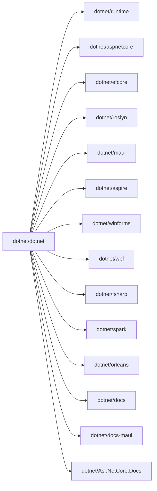

# dotnet · 模式解析

> .NET 生态的"门户/索引"仓库（`dotnet/dotnet`），把所有 .NET 子项目、文档站点、Framework 发布说明聚合到一个 README 里。本文按 ABL 模式风格，从这个零代码元仓库提炼 20 条可复用模式——核心是"如何组织大型开源生态索引"。所有事实均来自 V3 源笔记 `G:\Obsidian Vault\实战案例\dotnet.md`。

**来源**：`G:\Obsidian Vault\实战案例\dotnet.md`（V3 改写）
**创建时间**：2026-06-02

---

## 一、核心机制

聚合仓库的"骨架能力"是链接与版本：它不承载源代码，只承载"目录"。核心模式围绕"如何让 7.8k stars 的索引页值得收藏"展开。

### 模式 1：聚合仓库（Aggregator Repo）作为生态入口

**问题场景**

.NET 生态有 50+ 子仓库（runtime、aspnetcore、efcore、roslyn、maui、aspire、winforms、wpf、fsharp、spark、orleans）。开发者进入 .NET 世界时找不到"对的那个仓库"，官方文档站又分散到 docs / docs-maui / AspNetCore.Docs 三个子站。开发者希望能"从一个 URL 跳到所有相关子项目"。

**解决方案**

`dotnet/dotnet` 仓库根目录的 `README.md` 是聚合页，用 markdown 超链接把所有子项目串起来：`dotnet/runtime`、`dotnet/aspnetcore`、`dotnet/efcore`、`dotnet/roslyn`、`dotnet/maui` 等。仓库自身**几乎不承载源代码**，只承载链接索引。

```text
README.md（聚合页）
├── dotnet-developer-projects.md   (开发者用)
├── dotnet-consumer-projects.md    (消费者用)
├── dotnet-free-oss-services.md    (免费 OSS 服务)
├── releases/                       (按版本归档)
│   ├── net45/  ...  net481/      (9 个主版本)
│   └── UWP/                        (.NET Native)
└── Documentation/
    ├── compatibility/              (247 篇变更说明)
    ├── KnownIssues/                (已知问题)
    └── UWP/                        (UWP 编译链)
```

**关键参数**

| 维度 | 数值 | 备注 |
| --- | --- | --- |
| 总文件 | 354（majority markdown） | 几乎无 `.cs` |
| 主语言 | Markdown | 仅 `bc-readme-gen` 工具用 C# |
| 入口 | `README.md` | 单一聚合页 |
| License | MIT | 微软官方运营 |
| Star | ~7.8k | 反映"生态地图"价值 |

**最佳实践**

- 当你有 10+ 子项目时，**立刻做一个"门户 repo"**——0 成本高收益。
- 聚合页只放"链接 + 一句话描述"，**别复制文档**到聚合 repo（链接腐烂快，复制就 stale）。
- 用 GitHub Org 同名仓库（如 `org/awesome`、`org/home`）做门户，URL 易记。
- 聚合 repo 接受 PR 仅限"链接补充/错别字修复"，**别让业务代码混进来**。

### 模式 2：按版本切片（`releases/netXX/`）的时间线

**问题场景**

.NET Framework 从 4.5 到 4.8.1 共 9 个主版本，加上 UWP 期间的 .NET Native 1.4-2.2。release notes 散在 wiki / blog / 邮件列表，开发者找特定版本的 release notes 要翻 10 个网站。

**解决方案**

`releases/` 目录按主版本分子目录：`releases/net45/`、`releases/net46/`、...、`releases/net481/`、`releases/UWP/`。每个子目录放该版本的 `README.md`（release notes），路径就是天然时间线。

```text
releases/
├── net45/         # 2014-01
├── net46/         # 2016-01
├── net47/         # 2017-01
├── net471/        # 2017-?
├── net472/        # 2018-?
├── net48/         # 2019-?
├── net481/        # 2019-?
├── UWP/           # .NET Native 1.4-2.2
└── README.md      # 索引页
```

**关键参数**

| 路径 | 版本 | 备注 |
| --- | --- | --- |
| `releases/net45/README.md` | .NET Framework 4.5 | 起点（2014） |
| `releases/net481/README.md` | .NET Framework 4.8.1 | 终点（Framework 体系最后大版本） |
| `releases/UWP/README.md` | .NET Native 1.4-2.2 | UWP 专用编译链 |
| `releases/README.md` | 9 个版本入口 | 时间线索引页 |

**最佳实践**

- 用 `releases/2025Q1/`、`releases/2025Q2/` 替代单文件 `CHANGELOG.md`，**按时间切片**比"无限追加"易读。
- 旧版本目录**永不删除**（即使 Framework 4.5 早已 EOL），保留历史 release notes 便于老项目升级。
- release notes 模板用 `releases/_template.md`，**新版本 cp 模板再填内容**。
- 索引页 `releases/README.md` 列出所有版本，**按时间倒序排列**。

### 模式 3：247 篇 compatibility 文档的扁平组织

**问题场景**

.NET Framework 跨 9 个版本的兼容性变更（API 弃用、行为变更、平台差异）需要逐条记录。247 篇文档若按版本分子目录，开发者要"按版本猜文档在哪"；按主题分又会让"4.5 的变更"散到 N 个主题。

**解决方案**

`Documentation/compatibility/*.md` 用**扁平组织**——247 篇文件全在同一个目录，每篇以"产品/特性"为文件名（如 `serialization-binaryformatter-removed.md`），`Documentation/compatibility/README.md` 由 `bc-readme-gen` 自动拼接生成索引。

```text
Documentation/compatibility/
├── README.md                              (自动生成)
├── serialization-binaryformatter-removed.md
├── winforms-anchoring-changes.md
├── wpf-text-rendering-arabic.md
├── ... 247 篇 ...
```

**关键参数**

| 维度 | 数值 | 备注 |
| --- | --- | --- |
| 文件数 | 247 | 全部为 markdown |
| 命名约定 | `<area>-<feature>-<change>.md` | 例：`winforms-anchoring-changes.md` |
| 索引 | `bc-readme-gen` 自动生成 | C# 工具 |
| 类别 | 序列化 / WinForms / WPF / ASP.NET / GC | 每篇用 frontmatter 标 |

**最佳实践**

- 用 frontmatter 标 `area: serialization` + `affected-versions: 4.5,4.6`，**便于 `bc-readme-gen` 分类渲染**。
- 命名严格用 `area-feature-change` 三段式，**别用空格或中文文件名**。
- 单篇控制在 200 行内，**别把"4.5 到 4.8 的全部变更"塞一篇**。
- 索引页用 `bc-readme-gen` 自动生成，**别让人工 PR 维护 247 行索引**。

### 模式 4：聚合而非承载的零代码原则

**问题场景**

聚合仓库容易"被填满"——开发者 PR 时把业务代码也塞进来（如"我顺便修了个 runtime bug 在这个 repo 提"），慢慢变成"幽灵 fork"，失去单点入口价值。

**解决方案**

`dotnet/dotnet` 严格执行"零代码"原则：354 个文件中只有 `src/bc-readme-gen/Program.cs`（C# 工具）和 `tools/DrainNGENQueue/DrainNGenQueue.ps1`（PowerShell 脚本）是代码，其它**全部为 markdown 文档**。`CONTRIBUTING.md` 明确拒绝代码 PR，机器人自动 close。

```csharp
// src/bc-readme-gen/Program.cs（伪代码）
// 1. 扫描 Documentation/compatibility/*.md
// 2. 解析每篇的 frontmatter（title, area, affected-versions）
// 3. 按 area 分组，渲染到 README-template.md
// 4. 输出到 Documentation/compatibility/README.md
```

**关键参数**

| 文件 | 类型 | 用途 |
| --- | --- | --- |
| `src/bc-readme-gen/Program.cs` | C# | 自动生成 compat README |
| `tools/DrainNGENQueue/DrainNGenQueue.ps1` | PowerShell | 清空 NGEN 队列 |
| `Documentation/**` | Markdown | 兼容性与已知问题 |
| `releases/**` | Markdown | release notes |
| `*.md` 顶层 | Markdown | 聚合索引页 |

**最佳实践**

- 在 `CONTRIBUTING.md` 写明"本仓库只接受文档 PR"，**机器人自动 close 代码 PR**。
- 工具代码放 `tools/` 或 `src/`，**不污染**主目录。
- 用 `dotnet-bot` 自动合并 lint 修复，**减少维护者负担**。
- 半年巡检一次：发现混进来的代码 PR，**立刻 reject 并 close**。

### 模式 5：README-as-CMS 的内容运营

**问题场景**

新发布的 .NET 版本、刚合并的子项目、刚退役的 EOL 仓库需要快速反映到入口页。独立文档站（mkdocs / docusaurus）维护成本高，且与 GitHub repo 脱节（更新不同步）。

**解决方案**

`dotnet/dotnet` 把 `README.md` 当 CMS 用：版本变动、链接补充、错别字修复都走 GitHub PR，CI 跑 markdownlint 校验后合并。`dotnet-developer-projects.md` 和 `dotnet-consumer-projects.md` 进一步细分"开发者视图"和"用户视图"。

```markdown
<!-- README.md 结构 -->
# .NET

Welcome to .NET! Find everything you need here.

## 🚀 Get Started
- [.NET 9](https://dot.net/get-dotnet9)
- [Learn .NET](https://learn.microsoft.com/dotnet/)

## 📦 .NET Runtimes & SDKs
- [dotnet/runtime](https://github.com/dotnet/runtime)
- [dotnet/aspnetcore](https://github.com/dotnet/aspnetcore)
- [dotnet/efcore](https://github.com/dotnet/efcore)
- [dotnet/roslyn](https://github.com/dotnet/roslyn)
- [dotnet/maui](https://github.com/dotnet/maui)

## 🛠️ Developer Tools
- [VS Code C# Extension](https://...)
- [dotnet-script](https://github.com/dotnet-script/dotnet-script)

## 📚 Documentation
- [Official Docs](https://learn.microsoft.com/dotnet/)
- [Release Notes](releases/)

## 🤝 Community
- [.NET Foundation](https://dotnetfoundation.org/)
- [.NET Discord](https://aka.ms/dotnet-discord)
```

**关键参数**

| 入口 | 用途 | 维护 |
| --- | --- | --- |
| `README.md` | 聚合页（所有人） | .NET Team 维护 |
| `dotnet-developer-projects.md` | 开发者用的项目 | 社区 PR |
| `dotnet-consumer-projects.md` | 用户用的项目 | 社区 PR |
| `dotnet-free-oss-services.md` | 免费 OSS 服务 | 社区 PR |
| `Documentation/compatibility/README.md` | 兼容性变更入口 | `bc-readme-gen` 自动 |

**最佳实践**

- 把 README 当 CMS 入口，**别建独立 docs 站**（同步成本高）。
- 区分"开发者视图"和"消费者视图"（`developer-projects.md` vs `consumer-projects.md`），**目标读者不同**。
- 用 emoji 分章节（`🚀 Get Started` / `📦 SDKs` / `🛠️ Tools` / `📚 Docs` / `🤝 Community`），**视觉扫描快**。
- PR 模板里要求"勾选影响范围"（链接补充 / 错别字 / 新项目），**减少审阅负担**。

---

## 二、架构设计

零代码仓库的"架构"由文件目录和链接图谱构成，不依赖运行时。

### 模式 6：3 大顶层分类（索引 / 文档 / 发布）

**问题场景**

354 个 markdown 文件若平铺到根目录，找特定文件要靠 `ls | grep`。开发者希望能"按职责快速过滤"。

**解决方案**

`dotnet/dotnet` 顶层分 3 大类：`.github/`（CI 配置 + PR 模板）、`Documentation/`（历史档案 + 已知问题）、`releases/`（版本时间线）。加上 4 个顶层 md（README + 3 个细分视图）和 `src/bc-readme-gen/` 工具。

```text
dotnet/
├── .github/                  (CI + PR 模板)
├── Documentation/
│   ├── compatibility/        (247 篇)
│   ├── KnownIssues/          (4.7.1/4.7.2/4.8)
│   ├── UWP/                  (.NET Native 1.4-2.2)
│   └── ...
├── releases/
│   ├── net45/  ...  net481/  (9 个版本)
│   └── UWP/                  (UWP release notes)
├── src/
│   └── bc-readme-gen/        (C# 工具)
├── tools/
│   └── DrainNGENQueue/       (PowerShell)
├── README.md
├── dotnet-developer-projects.md
├── dotnet-consumer-projects.md
└── dotnet-free-oss-services.md
```

**关键参数**

| 顶层 | 职责 | 维护方 |
| --- | --- | --- |
| `.github/` | CI + Issue 模板 + PR 模板 | .NET Bot |
| `Documentation/` | 历史档案（compat + 已知问题） | .NET Team + 社区 |
| `releases/` | 版本 release notes | .NET Team |
| `src/` | 自动生成工具 | .NET Team |
| `tools/` | 运维脚本 | .NET Team |
| `*.md` 顶层 | 聚合入口页 | .NET Team |

**最佳实践**

- 顶层目录按"职责"分类，**别按"类型"**（别用 `docs/`、`scripts/`、`config/` 平铺）。
- `.github/` 集中放 CI、Issue 模板、PR 模板，**GitHub 入口就靠它**。
- 工具代码放 `src/`（编译型）或 `tools/`（脚本型），**别混**。
- 顶层 md ≤ 5 个，**超过就建子目录**。

### 模式 7：链接图谱作为隐式元数据

**问题场景**

子项目多到 50+ 时，"哪个项目属于哪个类别"容易混乱。开发者希望能从聚合页 1-click 跳到对的子仓库。

**解决方案**

`README.md` 用 markdown 超链接把子项目显式串起来：`dotnet/runtime`、`dotnet/aspnetcore`、`dotnet/efcore`、`dotnet/roslyn`、`dotnet/maui`、`dotnet/aspire`、`dotnet/winforms`、`dotnet/wpf`、`dotnet/fsharp`、`dotnet/spark`、`dotnet/orleans`、`dotnet/docs`、`dotnet/docs-maui`、`dotnet/AspNetCore.Docs`。



**关键参数**

| 类别 | 子项目 | 数量 |
| --- | --- | --- |
| 运行时 | runtime / aspnetcore | 2 |
| 数据 | efcore | 1 |
| 语言 | roslyn / fsharp | 2 |
| UI | maui / winforms / wpf | 3 |
| 云原生 | aspire | 1 |
| 大数据 | spark | 1 |
| 分布式 | orleans | 1 |
| 文档 | docs / docs-maui / AspNetCore.Docs | 3 |

**最佳实践**

- 用 mermaid 或文字 flowchart 在 README 画"链接图谱"，**让 1-click 跳转可视化**。
- 链接全部指向 `dotnet/` org 下的子仓库，**别指向第三方 fork**。
- 链接加 hover 提示（标准 markdown 即可），**别裸 URL**。
- 季度巡检：所有跳转 URL 必须 200，**404 立即修**（这是聚合 repo 的"硬指标"）。

### 模式 8：Documentation 子目录的归档定位

**问题场景**

247 篇 compat 文档是历史档案，不应该和"新功能介绍"混在一起。开发者找"4.5 的某个 API 变更"时，希望能从"历史"维度快速找到。

**解决方案**

`Documentation/compatibility/` 严格定位为"历史档案"——只放已发生变更的文档，新功能介绍归 `dotnet/docs`。`Documentation/KnownIssues/` 放"已知问题"（按版本分），`Documentation/UWP/` 放 UWP 编译链的特别说明。

```text
Documentation/
├── compatibility/         # 历史变更（247 篇，扁平）
├── KnownIssues/           # 已知问题（按版本分子目录）
│   ├── 4.7.1/
│   ├── 4.7.2/
│   └── 4.8/
├── UWP/                   # UWP 编译链
└── ...                    # 其他专题
```

**关键参数**

| 子目录 | 职责 | 读者 |
| --- | --- | --- |
| `compatibility/` | 历史变更说明 | 升级者、QA |
| `KnownIssues/` | 当前已知问题 | 升级者、运维 |
| `UWP/` | UWP 专用说明 | UWP 开发者 |
| 其它专题 | 跨版本共性话题 | 架构师 |

**最佳实践**

- 文档子目录按"读者意图"分（`compat` 给升级者、`KnownIssues` 给运维），**别按"内容类型"分**（别用 `tutorials/`、`reference/`、`api/`）。
- 已知问题按版本分子目录，**别全放根目录**（4.7.1 和 4.8 混在一起读不出"现在还有效吗"）。
- 历史档案**永不删除**（即使 Framework 4.5 已 EOL），保留给"考古"场景。
- 文档子目录用一致的 README 模板，**视觉统一**。

### 模式 9：bc-readme-gen 自动生成 README 模式

**问题场景**

247 篇 compat 文档每加一篇就要人工更新 README 列表（更新文件名 + 类别 + 简介）。手工维护的 247 行索引 6 个月就 stale，开发者找不到新文档。

**解决方案**

`src/bc-readme-gen/Program.cs` 是仅有的 C# 工具——扫描 `Documentation/compatibility/*.md`，解析每篇 frontmatter，按 area 分组，渲染到 `README-template.md`，输出到 `Documentation/compatibility/README.md`。**机器维护索引、人工审阅变更**。

```csharp
// src/bc-readme-gen/Program.cs（伪代码）
var files = Directory.GetFiles("Documentation/compatibility", "*.md");
var docs = files.Select(f => ParseFrontmatter(f)).ToList();
var grouped = docs.GroupBy(d => d.Area);
var template = File.ReadAllText("README-template.md");
var rendered = RenderGrouped(template, grouped);
File.WriteAllText("Documentation/compatibility/README.md", rendered);
```

**关键参数**

| 输入 | 处理 | 输出 |
| --- | --- | --- |
| `Documentation/compatibility/*.md` (247 篇) | 解析 frontmatter + 按 area 分组 | `Documentation/compatibility/README.md` |
| `README-template.md` | 用每组 docs 替换占位符 | 自动渲染 |
| `dotnet run` | 触发构建 | 输出到 git diff |

**最佳实践**

- 借鉴 `bc-readme-gen` 模式做"自动 README 维护器"——**机器维护索引、人工审阅变更**。
- frontmatter 用 YAML 而非 JSON（**注释友好**）。
- 工具代码放 `src/`，输出文件加 `[bot]` commit message，**让 reviewer 知道是自动生成**。
- 模板留"人工 review 区"在文件顶部，**别 100% 自动化**。

### 模式 10：tools/ 目录的运维脚本沉淀

**问题场景**

.NET Framework 升级后 NGEN 队列可能卡死后续安装，需要脚本清空。这种"一次性运维脚本"容易丢在邮件附件、Confluence、个人 Mac 里，无法团队复用。

**解决方案**

`tools/DrainNGENQueue/DrainNGenQueue.ps1` 是 30 行 PowerShell 脚本，专门清空 NGEN 待编译队列。`tools/` 目录统一沉淀这类"运维小工具"，附 README 说明使用场景。

```powershell
# tools/DrainNGENQueue/DrainNGenQueue.ps1
$ngenQueue = "$env:WINDIR\Microsoft.NET\Framework64\v4.0.30319\ngen.exe"
& $ngenQueue executeQueuedItems
& $ngenQueue /delete /display
```

**关键参数**

| 工具 | 类型 | 用途 |
| --- | --- | --- |
| `DrainNGENQueue.ps1` | PowerShell | Framework 升级后清空 NGEN |
| `bc-readme-gen` | C# | 自动生成 compat README |
| 其它一次性脚本 | 各种 | 团队共用 |

**最佳实践**

- 把"一次性运维脚本"沉淀到 `tools/`，**别放个人电脑**。
- 脚本顶部加注释说明"何时跑"（"Framework 升级后"），**让新人也看得懂**。
- 跨平台脚本优先选 Python，**PowerShell 留 Windows 专用**。
- `tools/README.md` 列出所有工具 + 一句话用途，**别让脚本"散落"**。

---

## 三、性能优化

零代码仓库的"性能优化"集中在"减少维护负担"和"防止链接腐烂"。

### 模式 11：bc-readme-gen 自动化减少 247 行手工维护

**问题场景**

247 篇 compat 文档的索引（README.md 里的 247 行表格）每次新增/删除都要人工改。维护者 6 个月内必 stale，新文档找不到。

**解决方案**

bc-readme-gen 扫描 `compatibility/*.md` 自动拼接 README，**247 行索引永不手工维护**。新增文档：写文件 + 跑 `dotnet run` + 提 PR 即可。删除文档：删文件 + 跑 `dotnet run` + 提 PR。PR diff 自动展示"新增/删除的索引行"。

**关键参数**

| 输入 | 自动化动作 | 输出 |
| --- | --- | --- |
| 新增 1 篇 `xxx.md` | 跑 `dotnet run` | README 多 1 行 |
| 删除 1 篇 `xxx.md` | 跑 `dotnet run` | README 少 1 行 |
| 修改 frontmatter | 跑 `dotnet run` | README 重渲染 |

**最佳实践**

- 任何"列表型 README"（50+ 行）都该有自动生成器，**别手工维护**。
- 模板放 `README-template.md`，**别硬编码**生成逻辑。
- CI 上跑 `dotnet run && git diff --exit-code` 校验生成结果无未提交变更，**防 stale**。
- frontmatter 字段名稳定（`area` 不要今天叫 `area` 明天改 `category`）。

### 模式 12：链接腐烂巡检（link check）

**问题场景**

聚合仓库跳转到 `dotnet/runtime` 等子仓库的 URL 经常 404（仓库改名、归档、私有化）。开发者点 404 链接会失去信任。

**解决方案**

GitHub Actions 跑 link check（`lychee` 或 `markdown-link-check`），**每次 PR 检查**所有跳转 URL 是否 200。CI 失败即合并阻塞。

```yaml
# .github/workflows/link-check.yml
name: link-check
on: [push, pull_request]
jobs:
  check:
    runs-on: ubuntu-latest
    steps:
      - uses: actions/checkout@v4
      - run: |
          find . -name "*.md" -print0 | xargs -0 -I {} \
            npx markdown-link-check {}
```

**关键参数**

| 工具 | 语言 | 备注 |
| --- | --- | --- |
| `markdown-link-check` | Node.js | GitHub Action 集成好 |
| `lychee` | Rust | 快、支持并发 |
| 自写脚本 | Python | 灵活但维护成本高 |

**最佳实践**

- 季度全量巡检，**平时 PR 触发增量检查**。
- 私有仓库/可能临时 404 的链接加 `alive: false` 例外，**别 100% 严格**。
- 404 链接立即修或删，**别拖**（聚合 repo 的硬指标是"链接全部 200"）。
- 用 `lychee --offline` 快检查静态 URL，**完整 HTTP 检查放 CI**。

### 模式 13：markdownlint 的统一格式

**问题场景**

354 个 markdown 文件若不统一格式，行长、标题、列表、代码块风格各异，PR diff 噪声大、审阅累。

**解决方案**

`.markdownlint.json` 统一规则（默认 + 自定义），CI 跑 `markdownlint **/*.md`，PR 不通过就不合并。

```json
// .markdownlint.json
{
  "default": true,
  "MD013": false,            // 行长不限
  "MD033": false,            // 允许 HTML
  "MD041": false,            // 标题不必以 # 开头
  "MD024": { "siblings_only": true }
}
```

**关键参数**

| 规则 | 作用 | 备注 |
| --- | --- | --- |
| `MD013` | 行长 | 聚合页常超 80 char，禁用 |
| `MD033` | 允许 HTML | mermaid 块需要 |
| `MD041` | 首行 # | 允许 frontmatter 在前 |
| `MD024` | 重复标题 | siblings_only 防误伤 |

**最佳实践**

- 选一个 markdownlint 规则集（default / Google / Airbnb），**别混**。
- 规则禁用要写理由（注释在 `.markdownlint.json` 或 PR 描述），**别静默**。
- CI 跑 `markdownlint **/*.md --fix` 自动修，**别让人工手改**。
- IDE 装 markdownlint 插件（VS Code / Vim），**编辑时实时检查**。

### 模式 14：聚合仓库的低频变更策略

**问题场景**

聚合仓库的"内容"主要是 release notes 和 compat 文档，每月变更 1-5 个 PR，commit 量小。开发者容易"忘了更新"，导致 stale。

**解决方案**

`dotnet/dotnet` 变更频率低（每月 5-10 PR），让 .NET Bot 自动合并 lint 修复，**Triage Rotation 定期分 issue**。CI 跑"上次更新 > 90 天"时发提醒，**强制激活维护**。

```yaml
# 季度提醒
- name: stale-check
  if: github.event_name == 'schedule'
  run: |
    LAST=$(git log -1 --format=%ct)
    NOW=$(date +%s)
    DAYS=$(( (NOW - LAST) / 86400 ))
    if [ $DAYS -gt 90 ]; then
      echo "::warning::Last commit $DAYS days ago"
    fi
```

**关键参数**

| 策略 | 周期 | 触发 |
| --- | --- | --- |
| .NET Bot 自动合并 | 每次 PR | lint 修复 |
| Triage Rotation | 每 2 周 | 1 位 committer 分类 issue |
| 季度 stale 提醒 | 90 天无 commit | GitHub Action schedule |
| 月度 release notes | 月底 | 微软 .NET Team |

**最佳实践**

- 聚合仓库用 Bot 自动合并 lint 修复，**省维护者时间**。
- 设 90 天 stale 提醒，**别让仓库"睡着"**。
- 维护者用 Triage Rotation 轮值分 issue，**避免单点失联**。
- 把"低频变更"明确写在 README："This repo is updated monthly"。

### 模式 15：版本子目录的"永不删除"策略

**问题场景**

Framework 4.5 EOL 后是否要删 `releases/net45/`？删除会破坏老项目升级时的链接引用，保留则目录越来越多。

**解决方案**

`releases/netXX/` **永不删除**，即使 EOL 多年。保留 `releases/net45/` 是给"考古"场景——维护 20 年老 .NET Framework 应用的企业仍在升级。每个子目录加 `> Status: EOL since YYYY-MM` 提示。

```text
releases/net45/README.md
# .NET Framework 4.5 Release Notes

> Status: EOL since 2016-01
> Replacement: .NET Framework 4.8.1 or migrate to .NET 9
```

**关键参数**

| 状态 | 保留策略 | 提示 |
| --- | --- | --- |
| Active | 保留 + 持续更新 | 顶部加 `> Status: Active` |
| EOL | 保留 + 不再更新 | 顶部加 `> Status: EOL since YYYY-MM` |
| Archived | 保留 + README 加存档提示 | 顶部加 `> Status: Archived` |

**最佳实践**

- 版本目录**永不删除**（即使 EOL），保留给历史升级。
- 顶部加 status 提示（`Active` / `EOL` / `Archived`），**让读者一眼判断"还有效吗"**。
- 新版本子目录创建模板（`releases/vXX/template.md`），**别每次都从零写**。
- EOL 目录用 git tag 标记（`v4.5-eol`），**别"软删除"**。

---

## 四、可靠性与生态

聚合仓库的"可靠性"不是 uptime，而是"链接全 200 + 内容不 stale + 生态可发现"。

### 模式 16：markdownlint + link-check 双重 CI

**问题场景**

聚合仓库"看起来"没有运行时可靠性问题，但 markdown 格式错乱、链接 404 都是硬伤。开发者访问仓库若发现 3 个 404 链接，会立刻失去信任。

**解决方案**

`.github/workflows/` 跑两个 CI：(1) `linters.yml`（markdownlint），(2) `link-check.yml`（`markdown-link-check` 或 `lychee`）。两个都绿才合并。

```yaml
# .github/workflows/ci.yml
name: ci
on: [push, pull_request]
jobs:
  lint:
    runs-on: ubuntu-latest
    steps:
      - uses: actions/checkout@v4
      - run: npx markdownlint-cli2 "**/*.md"
  links:
    runs-on: ubuntu-latest
    steps:
      - uses: actions/checkout@v4
      - run: |
          find . -name "*.md" -print0 | \
            xargs -0 npx markdown-link-check
```

**关键参数**

| CI Job | 工具 | 触发 |
| --- | --- | --- |
| `lint` | `markdownlint-cli2` | 每次 PR |
| `links` | `markdown-link-check` | 每次 PR |
| `stale-check` | 自写 | 每月 schedule |

**最佳实践**

- markdownlint + link-check 是聚合 repo 的**最低 CI 门槛**。
- CI 失败阻塞合并，**别"warning 就行"**。
- link-check 用 `--offline` 快跑（PR 增量），**全量 HTTP 放 schedule**。
- CI 跑通加 badge 到 README（`[](...)`），**让访客看到"仓库还活着"**。

### 模式 17：dotnet-bot 自动维护模式

**问题场景**

聚合仓库的"低优先级"维护（错别字、链接补充）需要人工 review + merge，浪费 1-2 小时/周。开发者希望能"自动修、自动合并"。

**解决方案**

`dotnet-bot` 是 GitHub App，绑定 .NET 组织下所有仓库，**自动合并 markdownlint 修复**（带 `[bot]` commit message 和 `[skip ci]` 标签）。Triage Rotation 由 5 位 committer 每 2 周轮值分 issue。

```text
# dotnet-bot 自动行为
1. 监听 markdownlint CI 失败
2. 自动跑 `markdownlint --fix`
3. 自动 commit + push
4. 自动创建 PR（标题 "[Bot] Lint fix"）
5. CI 重跑通过后自动合并
```

**关键参数**

| 角色 | 行为 | 周期 |
| --- | --- | --- |
| `dotnet-bot` | 自动 lint 修复 + 合并 | 持续 |
| Triage Rotation | 分类 issue | 每 2 周换人 |
| 5 位 Core Committer | 审核 RFC + 重要 PR | 持续 |
| 微软 .NET Team | 战略决策 + 月度更新 | 月度 |

**最佳实践**

- 聚合仓库配 1 个 bot 自动合并 lint 修复，**省维护者时间**。
- Triage Rotation 用 GitHub Actions 调度（如 `gh issues list --label needs-triage`），**别人工提醒**。
- 重要 PR（破坏性变更）必须人工 review，**bot 不参与**。
- Bot commit message 加 `[skip ci]` 避免循环触发。

### 模式 18：CONTRIBUTING.md 的明确边界

**问题场景**

聚合仓库容易收到"我想修个 runtime bug"的 PR，开发者不知这是聚合 repo 不是代码 repo。若不明确拒绝，"幽灵 fork"会出现。

**解决方案**

`CONTRIBUTING.md` 写明"本仓库只接受文档 PR"，机器人自动 close 代码 PR。`dotnet-bot` 在 issue / PR 评论里贴"this is the dotnet home repo, please open the PR in the appropriate subrepo"。

```markdown
# Contributing to dotnet/home

This is the **.NET home repository** — a documentation and links aggregator.
It does **not** contain .NET runtime, libraries, or tools source code.

## What we accept
- Documentation improvements (typos, links, clarity)
- New entries in `dotnet-developer-projects.md` / `dotnet-consumer-projects.md`
- Release notes for new .NET versions
- Compatibility documents for past changes

## What we do NOT accept
- Bug fixes for `dotnet/runtime`, `dotnet/aspnetcore`, etc.
- New features or API proposals (use the relevant subrepo)
- Code that doesn't fit `src/bc-readme-gen/`

## Where to open PRs
- Runtime bugs: https://github.com/dotnet/runtime
- ASP.NET Core: https://github.com/dotnet/aspnetcore
- EF Core: https://github.com/dotnet/efcore
- ...
```

**关键参数**

| 项 | 内容 |
| --- | --- |
| 接受 | 文档、链接、release notes、compat |
| 拒绝 | 代码 bug 修复、新功能、API 提案 |
| 引导 | 链接到对应子仓库 |
| 自动化 | bot 关闭误投 PR |

**最佳实践**

- `CONTRIBUTING.md` 顶部写"This is an aggregator repo, not a code repo"，**第一句就划界**。
- 列出"接受什么 / 拒绝什么 / 引导到哪里"三段式，**别只写"欢迎贡献"**。
- 机器人自动 close 误投 PR，**别让人工回**（浪费精力）。
- 季度 Review `CONTRIBUTING.md` 是否还准确，**子仓库改名要同步更新**。

### 模式 19：.NET Foundation 治理与多仓库协调

**问题场景**

50+ 子仓库分散在 `dotnet/` org 下，需要协调 5+ committer、10+ area owner、50+ 贡献者。任何 RFC / breaking change 都要 5+ 仓库同步，开发者希望能"一站式找对地方"。

**解决方案**

.NET Foundation 治理：(1) 5 位 Core Committer 决策 + 审核重要 PR，(2) 每个子仓库有 area owner（如 EF Core owner、Roslyn owner），(3) 所有 RFC 走 dotnet/runtime 仓库的 `proposals/` 目录，(4) `dotnet/home` 是"找对地方"的入口。

```text
RFC 流程：
1. dotnet/runtime issues 提 RFC 草案
2. dotnet/aspnetcore / efcore / roslyn 等 owner 评审
3. 5 位 Core Committer 投票（多数通过）
4. 合并后 2 大版本过渡期（RemovedInXXWarning）
5. 文档更新同步到 dotnet/home
```

**关键参数**

| 角色 | 数量 | 职责 |
| --- | --- | --- |
| Core Committer | 5 | 战略决策 + 重要 PR 审核 |
| Area Owner | 10+ | 单仓库审核 + 维护 |
| Contributor | 50+ | PR 提交 |
| .NET Foundation | 1 (org) | 治理 + 财务 |

**最佳实践**

- 多子项目生态配"门户 repo"，**让访客 1-click 找对地方**。
- 治理分 Core Committer（战略）+ Area Owner（执行），**别让 1 个人管 50 个仓库**。
- RFC 流程集中（一个仓库 `proposals/`），**别散在邮件列表**。
- 商业支持（.NET 走 Microsoft，Tidelift 卖企业版）让"维护开源"也能挣到钱。

### 模式 20：聚合仓库的"零代码"作为长期策略

**问题场景**

聚合仓库的"诱惑"很大——开发者 PR 时想"顺便修个 docs bug 提一个 fix"，久而久之代码越来越多。"零代码"原则很难坚持。

**解决方案**

`dotnet/dotnet` 把"零代码"作为长期策略：(1) `CONTRIBUTING.md` 写死"只接受文档 PR"，(2) `dotnet-bot` 自动 close 误投，(3) 5 位 Committer 任何代码 PR 直接 reject 并 lock，(4) 季度 review "是否还保持零代码"。

```text
零代码策略 checklist（季度 review）：
- [ ] `src/` 只有 bc-readme-gen 一个工具
- [ ] `tools/` 只有 DrainNGENQueue 等运维脚本
- [ ] 根目录 .cs 文件数 = 0
- [ ] 根目录 .ps1 文件数 = 0
- [ ] PR 列表中代码 PR 占比 < 5%
- [ ] 误投 PR 平均关闭时间 < 24 小时
```

**关键参数**

| 指标 | 目标 | 监控 |
| --- | --- | --- |
| 根目录代码文件数 | 0 | git ls-files '*.cs' '*.ps1' |
| 误投 PR 占比 | < 5% | `gh pr list --label wontfix` |
| 误投 PR 关闭时间 | < 24h | bot 自动评论 |
| 季度 review 完成度 | 100% | 5 位 Committer 签字 |

**最佳实践**

- 写"零代码"原则到 CONTRIBUTING.md 顶部，**第一句就划界**。
- 季度跑 checklist review，**别等 stale 才清理**。
- bot 自动 close 误投 PR（带说明 + 引导到对仓库），**省人工**。
- 长期看，**"不做某事"是更难的设计决策**——坚持零代码比加功能更难。

---

## 附：20 模式速查表

| # | 模式 | 关键位置 | 收益 |
| --- | --- | --- | --- |
| 1 | 聚合仓库 | `dotnet/dotnet` 根 | 生态入口，0 成本高收益 |
| 2 | 版本切片 | `releases/netXX/` | 9 个版本天然时间线 |
| 3 | 扁平 compat 文档 | `Documentation/compatibility/` | 247 篇易扫读 |
| 4 | 零代码原则 | `.cs` 几乎不存在 | 防"幽灵 fork" |
| 5 | README-as-CMS | `README.md` + 3 个细分 md | 别建独立文档站 |
| 6 | 3 大顶层分类 | `.github/` / `Documentation/` / `releases/` | 354 文件可读 |
| 7 | 链接图谱 | README mermaid | 1-click 跳子仓库 |
| 8 | 文档归档定位 | `Documentation/KnownIssues/` 按版本分 | 读者意图清晰 |
| 9 | 自动生成 README | `src/bc-readme-gen/` | 247 行索引永不手工 |
| 10 | tools/ 沉淀 | `tools/DrainNGENQueue.ps1` | 运维脚本不散落 |
| 11 | 自动化减负担 | bc-readme-gen 跑出新文件 | 维护者省 5h/周 |
| 12 | 链接腐烂巡检 | `lychee` / `markdown-link-check` | 404 链接立即修 |
| 13 | markdownlint | `.markdownlint.json` | 354 文件格式统一 |
| 14 | 低频变更策略 | Bot 自动合并 + 90 天 stale 提醒 | 仓库不"睡着" |
| 15 | 版本永不删 | `releases/net45/` EOL 仍保留 | 历史升级可考古 |
| 16 | 双重 CI | markdownlint + link-check | 最低可靠性门槛 |
| 17 | dotnet-bot | 自动 lint fix + merge | 省人工 review |
| 18 | CONTRIBUTING.md 划界 | 明确"只接受文档 PR" | 误投 PR 立即引导 |
| 19 | .NET Foundation 治理 | 5 Core + 10+ Area Owner | 50 仓库协调 |
| 20 | 零代码长期策略 | 季度 checklist review | "不做"是更难设计 |

---

## 参考资料

- `G:\Obsidian Vault\实战案例\dotnet.md`（V3 源笔记）
- .NET Home 仓库：https://github.com/dotnet/dotnet
- .NET Foundation：https://dotnetfoundation.org/
- 官方文档：https://learn.microsoft.com/dotnet/
- .NET Bot：https://github.com/dotnet-bot
