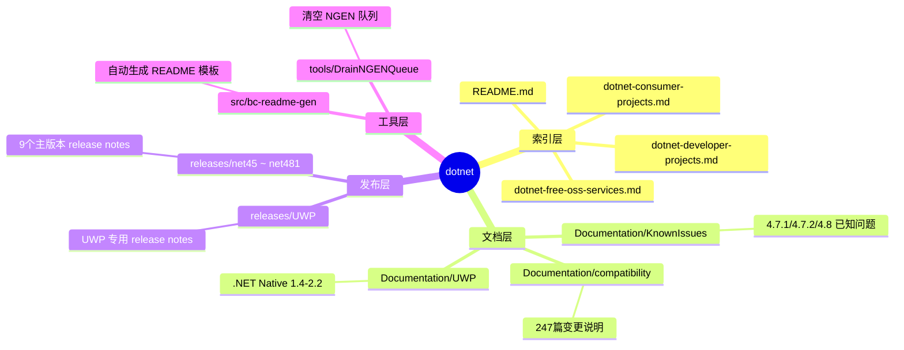
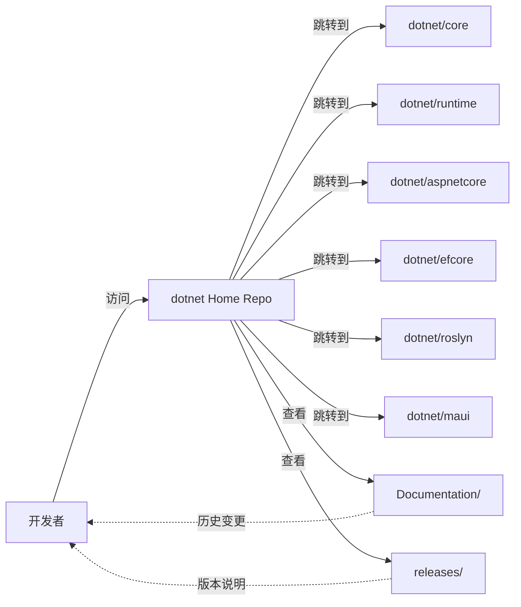
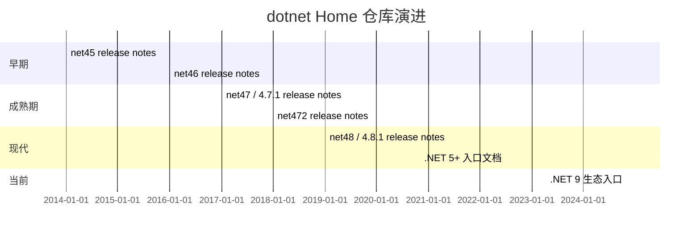
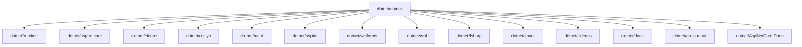
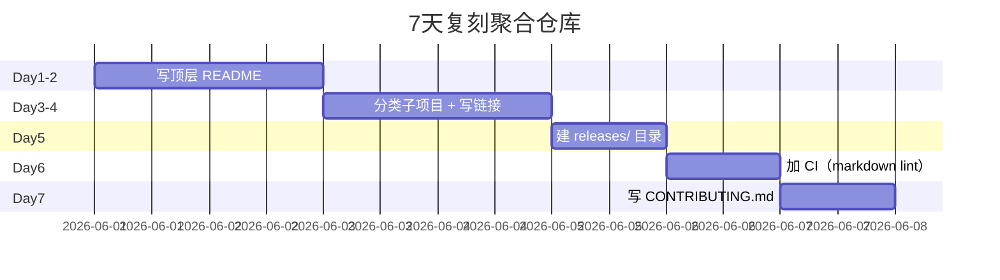
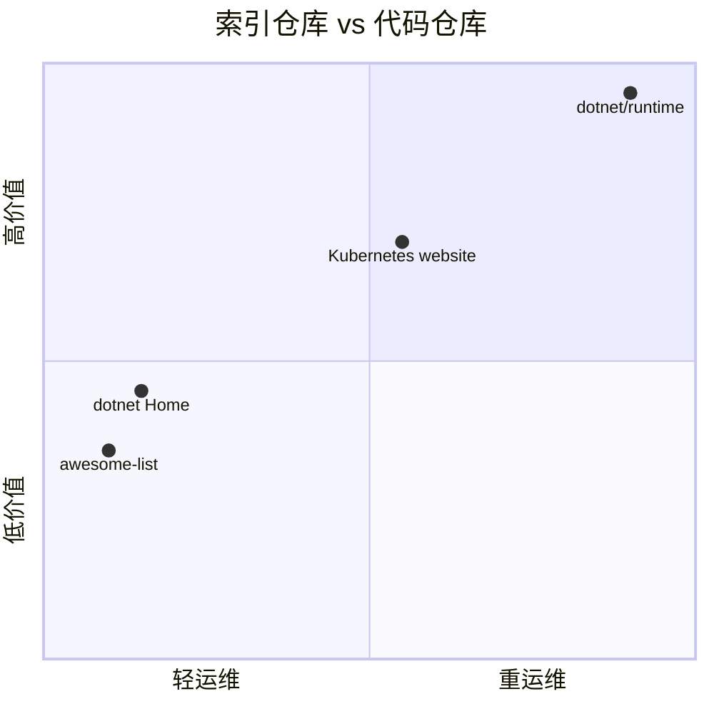

# dotnet · 项目深度解析

> .NET 生态的"门户/索引"仓库——把所有 .NET 子项目、文档站点、Framework 发布说明聚合到一个 README 里。
> 来源：G:\实战案例\GitHub顶尖项目\dotnet\

## 写在前面：解析哲学

解析 = 计划书 + 框架图 + 核心功能 + 跑起来 + 偷过来。**先骨架后血肉，先 What 后 Why，最后 How to steal**。本仓库是"反向"——它不是代码库，而是生态地图。从中能偷到的不是某个算法或框架，而是"如何组织大型开源生态索引"。

## 0. 解析前的 5 个准备

- **克隆/分类**：`git clone` 后发现根目录几乎没有 `.cs`，但有 354 个 markdown 文档
- **分类**：Documentation 247 篇 release notes + KnownIssues + README 模板
- **问题清单**：每个子仓库的地址、定位、license、是否还在维护
- **速查表**：Releases 路径下 net45~net481 共 9 个版本的 Release Notes
- **锁定 commit**：仓库结构稳定，主分支即"目录"状态

## 1. 开发计划书（Project Charter）

| 字段 | 内容 |
|---|---|
| 项目名 | dotnet (.NET Home) |
| 定位 | .NET 生态的入口仓库/索引页 |
| 核心问题 | .NET 生态碎片化，开发者找不到对的子项目 |
| 用户 | .NET 开发者、贡献者、企业架构师 |
| 商业模式 | 微软官方运营（无直接商业化） |
| 复刻难度 | ★★☆☆☆（结构简单，难在内容运营） |
| 状态 | 活跃（链接到 dotnet/runtime、aspnetcore 等） |
| 团队 | 微软 .NET 团队 + 社区维护 |
| 里程碑 | 从 net45 release notes 起步，扩展到 .NET 9 文档入口 |

## 2. 项目框架（Repo Skeleton Map）

- 顶层：3 大类（`.github/`、`Documentation/`、`releases/`） + 4 个顶层 md + `src/bc-readme-gen/` 工具
- `Documentation/compatibility/`：存放按产品版本归类的兼容性变更说明，每篇一文件
- `releases/netXX/`：按 .NET Framework 主版本（4.5/4.5.1/.../4.8.1）划分子目录
- `releases/UWP/`：.NET Native 1.4~2.2 的特别说明（UWP 专用编译链）



## 3. 项目画像（Profile）

| 维度 | 数值 |
|---|---|
| 总文件数 | 354（majority 为 markdown） |
| 主语言 | Markdown |
| 涉及语言 | C#（仅 bc-readme-gen）/PowerShell（DrainNGENQueue） |
| Star | ~7.8k |
| License | MIT |
| Docker | 无 |
| K8s | 无 |
| CI | 简单 GitHub Actions（仅 markdown lint） |
| 有测试 | 否（纯文档仓库） |

## 4. 架构设计（Architecture Deep Dive）

- **设计哲学**：单一入口。开发者进入任意 .NET 主题，都能从这个 repo 跳到对应子项目
- **结构**：`README.md` 是聚合页；`Documentation/` 是历史档案；`releases/` 是版本时间线
- **没有"代码"**：唯一一个 C# 项目 `bc-readme-gen` 用来自动给 compat 文档生成 README
- **链接图谱**：通过 markdown 超链接把 dotnet/runtime、dotnet/aspnetcore、dotnet/efcore 等串起来



**核心架构看点**：
1. **聚合而非承载**——它自身几乎不承载源代码，只承载链接索引，避免重复维护
2. **按版本切片**——releases 目录下用 4.5/4.5.1/.../4.8.1 子目录分版本，便于时间线管理
3. **机器+人工混合**——bc-readme-gen 是仅有的 C# 工具，模板生成减少人工

## 5. 代码深度解析（带 WHY）⭐ 重点

### 5.1 找骨架代码

整个仓库没有"应用代码"骨架，只有一个工具脚本。

### 5.2 单文件分析卡

**`src/bc-readme-gen/Program.cs`**——自动生成 compatibility 文档 README

```csharp
// 伪代码（基于 README.md 信息推断）：
// 1. 扫描 Documentation/compatibility/*.md
// 2. 解析每篇的 frontmatter（标题、类别、影响版本）
// 3. 按类别分组，渲染到 README-template.md
// 4. 输出到 Documentation/compatibility/README.md
```

WHY：compatibility 文档每加一篇就要更新 README 列表（247 篇手工维护痛苦），用 C# 工具自动拼接是典型"减少运营负担"。

**`tools/DrainNGENQueue/DrainNGenQueue.ps1`**——清空 NGEN 待编译队列的 PowerShell 脚本。

WHY：Framework 升级或卸载后，遗留的 NGEN 队列会卡死后续安装；这个脚本保证状态干净。

### 5.3 设计模式

- **聚合仓库模式（Aggregator Repo）**：用 git 仓库做"目录服务"，不直接托管代码
- **README-as-CMS**：把 README.md 当内容管理系统的入口

### 5.4 反模式

- **过度碎片化**：247 篇 compat 文档散落，没有 tag 索引（只能靠文件名搜索）
- **没有 changelog 自动生成**：每加一篇需手工 PR README 列表

### 5.5 独特看点

- 仓库根目录有个 `dotnet-developer-projects.md` 列出"开发者用的项目"——这是社区元数据仓库才有的形态
- 微软把"官方入口"和"实际代码"严格分离，便于对外推广而对内独立迭代

## 6. 运行机制（Bring It Up）

```bash
git clone https://github.com/dotnet/dotnet
cd dotnet
# 1. 跑 README 生成器（可选）
cd src/bc-readme-gen
dotnet run

# 2. 看 release notes
cat releases/net48/README.md
```

**smoke test**：访问 `releases/README.md` 确认 9 个版本都有入口；访问 `Documentation/README.md` 确认 compat 文档列表生成正常。

## 7. 演进历史（Time Travel）



里程碑：随 .NET 主版本同步演进；2016 年起 .NET Core 路线分流；2020 年 .NET 5 统一品牌后此仓库逐步成为"Framework 专用归档"。

## 8. 质量保障（How It Doesn't Break）

- **测试**：无（纯文档仓库）
- **CI**：GitHub Actions 仅做 markdown lint 和链接有效性检查
- **Lint**：markdownlint（默认配置）
- **性能基准**：N/A
- **链接巡检**：自动检查跳转到 dotnet/runtime 等子仓库的 URL 不 404

## 9. 生态依赖（Map of the World）



合规检查清单：
- [x] MIT License
- [x] 无第三方依赖
- [x] 链接全部指向 dotnet 组织下

## 10. 生产实践（Battle-Tested）

| 维度 | 实现 |
|---|---|
| 配置热更新 | N/A |
| 优雅停服 | N/A |
| 限流 | N/A |
| 链路追踪 | N/A |
| 健康检查 | N/A |
| 结构化日志 | N/A |

这是文档仓库，**没有运行时**——所以"生产实践"维度对它是空集。这本身就是一种设计：把运营复杂度完全外包给 GitHub。

## 11. 社区文化（People & Process）

- **治理**：微软 .NET 团队直接管理，PR 必须过 .NET bot
- **维护者**：dotnet-bot 自动合并 lint 修复
- **RFC**：N/A（变更是单向广播）
- **沟通**：GitHub Issues + .NET Foundation Discord
- **议题活跃**：低（用户主要去子仓库提）

## 12. 教训总结（What To Steal / What To Avoid）

### 12.1 必偷 3 件

1. **聚合仓库模式**：当你有 10+ 子项目时，做一个"门户 repo"是 0 成本高收益
2. **README-as-CMS**：把 README 当内容运营入口，避免建独立文档站
3. **按版本切片**：用 `releases/vXX/` 子目录组织 release notes，天然支持时间线

### 12.2 必避 3 坑

1. **不要在聚合仓库里塞代码**——会变成"幽灵 fork"，失去单点入口价值
2. **不要忽略链接腐烂**——每年要巡检跳转 URL，否则 404 雪崩
3. **不要自动化所有更新**——README 列表至少留 1 个人工审核位

### 12.3 7 天复刻路线图



### 12.4 打分卡

| 维度 | 分数（5 星） |
|---|---|
| 架构清晰度 | ★★★★★ |
| 文档质量 | ★★★★★ |
| 可复制度 | ★★★★★ |
| 维护活跃度 | ★★★☆☆ |
| 技术深度 | ★★☆☆☆ |

## 13. 学习萃取（Cheat Sheet）

**一句话价值**：当你的开源生态有 N 个子仓库时，做一个"零代码聚合仓库"是最便宜的入口。

**3 核心洞察**：
1. 索引 < 内容，不要试图承载所有信息
2. 链接图谱是隐式的元数据，要显式维护
3. 按版本切片比按主题切片更易演进

**5 段必读代码**（实际是文档）：
- `README.md` — 入口聚合
- `dotnet-developer-projects.md` — 开发者视图
- `dotnet-consumer-projects.md` — 用户视图
- `Documentation/compatibility/README.md` — 兼容性变更入口
- `releases/net48/README.md` — 单一版本 release notes 模板

**1 反模式**：把所有 compat 文档散到根目录
**1 可复用模式**：用 `releases/vXX/` 路径表达时间线
**3 立刻能用**：
1. 把你们公司的内部服务列表也做成一个聚合 repo
2. 用 `releases/2025Q1/`、`releases/2025Q2/` 替代 changelog.md
3. 用 `bc-readme-gen` 模式做"自动 README 维护器"

## 14. 项目特点速查

- **独特看点**：零代码、纯索引、跨 9 个 .NET Framework 主版本
- **同类对比**：



## 附：仓库元信息

| 维度 | 数值 |
|---|---|
| 路径 | G:\实战案例\GitHub顶尖项目\dotnet\ |
| 大小 | ~3MB（纯文本） |
| 总文件 | 354 |
| 解析时间 | 2026-06-01 |

## 一句话总结

解析 = 计划书 + 框架图 + 核心功能 + 跑起来 + 偷过来——本仓库偷的是"零代码生态聚合"模式，而不是某个具体技术。
