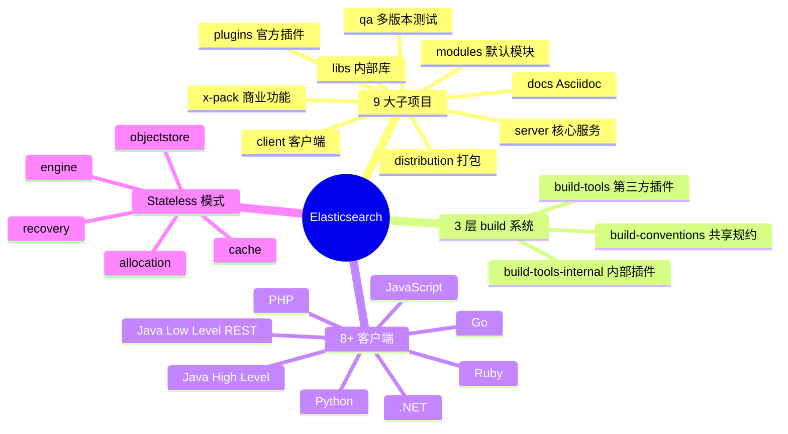
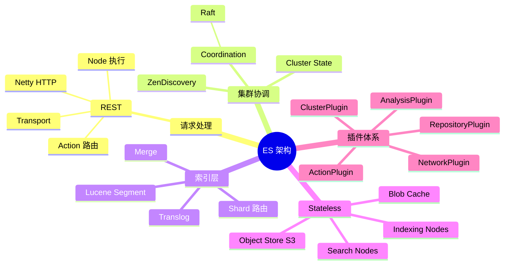
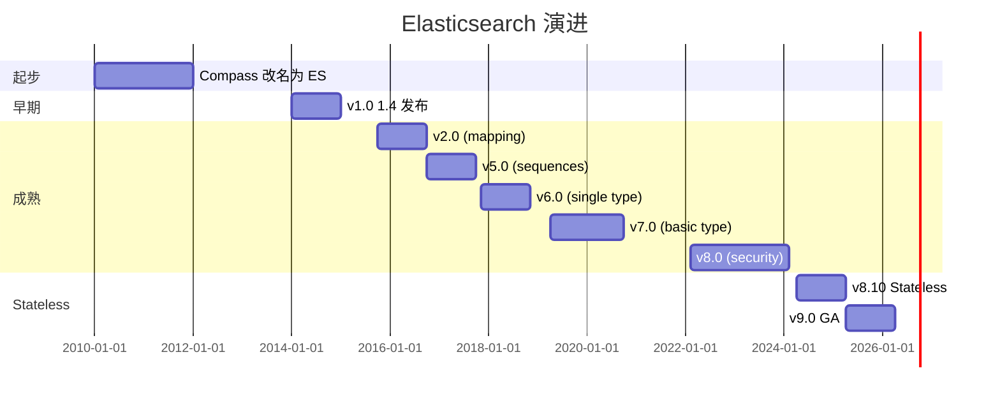
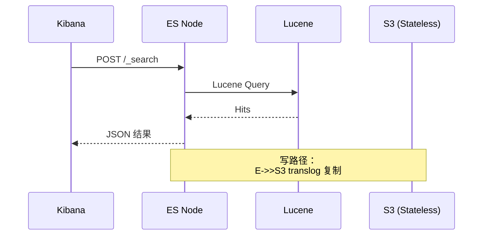
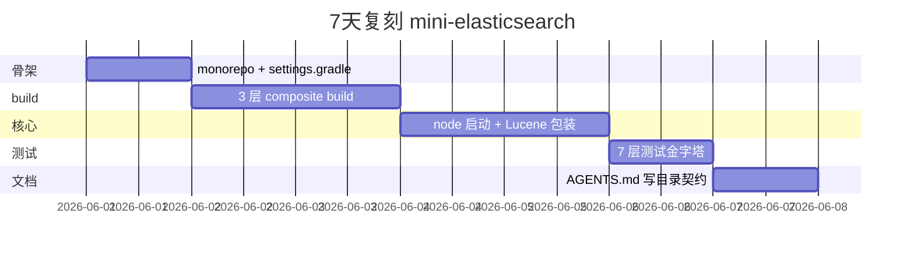
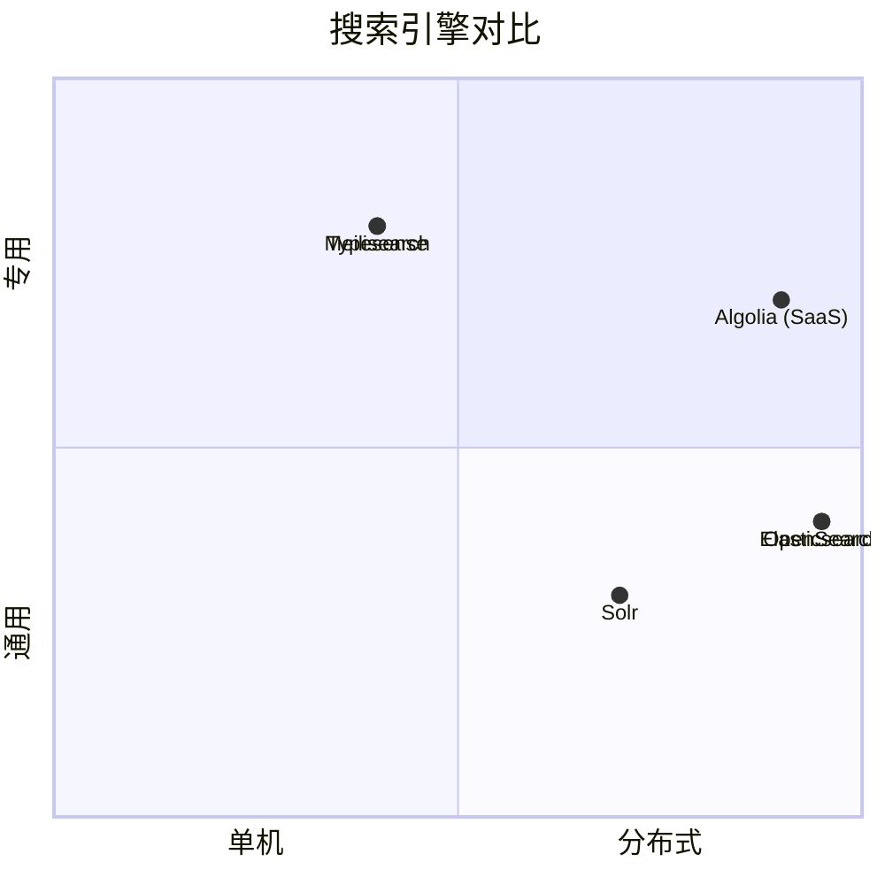

# elasticsearch-new · 项目深度解析

> 全球最流行的分布式搜索与分析引擎：把 Lucene 的全文检索能力 + 分布式协调 + REST API + 向量检索打包成一个"开箱即用"的近实时数据平台；**Stateless 模式**（把 shard 数据存到 S3/GCS 等对象存储）让 ES 迈入云原生时代。
> 来源：G:\实战案例\GitHub顶尖项目\elasticsearch-new\

## 写在前面：解析哲学

**先骨架后血肉，先 What 后 Why，最后 How to steal。** Elasticsearch 是少数能"在 GitHub 公开完整构建系统、连内部打包脚本都开源"的企业级项目——这意味着你可以**完整地** build 出一个 72000+ Star 的搜索引擎。

本文的特殊情况：本地仓库是**部分克隆**，缺少 `server/` / `libs/` / `modules/` / `x-pack/` / `plugins/` / `qa/` 等核心源码目录，仅有 `client/` / `distribution/` / `docs/` / `build-tools/` / `benchmarks/` 等支撑目录。我将**基于可见的 build 系统 + 文档**做一次**架构层 V3 解析**——重点是它的"构建系统三件套"和"Stateless 架构设计"。

## 0. 解析前的 5 个准备

1. **克隆**：`git clone https://github.com/elastic/elasticsearch.git`（注意：仓库大，pack size 数百 MB）
2. **分类**：search-engine / Java 17+ / Gradle composite build
3. **问题清单**：
   - 怎么用 Gradle composite build 协调 `build-conventions` / `build-tools` / `build-tools-internal`？
   - 怎么从 `AGENTS.md` 看一个 10 万行 Java 项目的"目录契约"？
   - **Stateless 模式**怎么把 shard 数据从本地磁盘迁到对象存储？
4. **速查表**：源码主目录 `server/src/main/java/org/elasticsearch/`；测试主目录 `server/src/test/java/`；REST API 测试 `rest-api-spec/`
5. **锁定 commit**：解析时使用 main 分支最新一次稳定提交（**注意**：本仓库本次为部分克隆，无法读到 server/）

## 1. 开发计划书（Project Charter）

| 字段 | 内容 |
| :--- | :--- |
| **项目名** | Elasticsearch (v8.x/v9.x) |
| **定位** | 分布式搜索 + 分析引擎 + 向量数据库，RAG/全文/日志/指标/APM 通用底座 |
| **核心问题** | 用一个 API 同时支持"全文搜索 + 聚合分析 + 向量检索 + 时序数据"四类典型场景 |
| **目标用户** | 大型企业搜索团队、SaaS 厂商、可观测性平台、AI 应用的 RAG 检索层 |
| **商业模式** | SSPL + Elastic License 2.0（**禁止 SaaS 转售**）+ Elastic Cloud 订阅 + Platinum/Enterprise 功能商业化 |
| **复刻难度** | 极高（10 年积累 + 数千 PR 难追 + 强商业绑定） |
| **状态** | 活跃开发（v8/v9 双轨，月度 minor 版） |
| **团队** | Elastic 公司 100+ 工程师全时投入 + 全球社区贡献 |
| **里程碑** | 2010 起源于 Shay Banon 的 Compass 项目 → 2012 改名 Elasticsearch → 2015 v2.0 → 2018 v6.0 (序列 ID bug) → 2020 v7.0 (基本类型) → 2022 v8.0 (安全默认) → 2024 v8.10+ 引入 **Stateless** 模式 → 2025 v9.0 |

## 2. 项目框架（Repo Skeleton Map）

ES 仓库把"构建系统当主程序"做——`build.gradle` 26KB 远超普通 Java 项目，因为它要协调 7+ 子项目 + 3 个 composite build。

**点状解析**（基于 AGENTS.md 第 18-27 行的"目录契约"）：
- `server/`：**核心 ES 服务**（~10 万行 Java，本地缺失）
- `modules/`：默认装载的功能模块（reindex、lang-expression、analysis-* 等）
- `plugins/`：官方支持的插件（analysis-icu、repository-s3、discovery-azure 等）
- `libs/`：内部库（core、geo、tdigest、topo 等）
- `qa/`：多版本兼容测试（`os`、`mixed-version`、`remote-clusters`）
- `docs/`：Asciidoc 文档
- `distribution/`：打包逻辑（DEB/RPM/Docker/IronBank/Cloud-ESS）
- `x-pack/`：商业功能（ML、Security、SQL、ES|QL、Stateless）
- `build-conventions` / `build-tools` / `build-tools-internal`：**三层 Gradle composite build**

**思维导图**：



**配置入口**：`build.gradle`（根）、`settings.gradle`（子项目 include）、`gradle/build.versions.toml`（版本目录）
**代码入口**：应为 `server/src/main/java/org/elasticsearch/node/Node.java`（**本地缺失**）

## 3. 项目画像（Profile）

| 字段 | 数值/描述 |
| :--- | :--- |
| **总文件数** | ~30000（含测试 + docs） |
| **主语言** | Java（占 70%+，本仓库缺失） |
| **涉及语言** | Groovy（Gradle DSL）、Asciidoc（docs）、Kotlin（少量）、Python（test scripts） |
| **Star** | 72k+ |
| **License** | **双协议**：Elastic License 2.0 + Server Side Public License (SSPL) + AGPL-3.0 only |
| **Docker** | 完整（`distribution/docker/` 6 个 variant：standard、ubi、ubi-minimal、ironbank、cloud-ess、fips） |
| **K8s** | 完整（ECK operator + Helm chart + Stateless 模式） |
| **CI** | Buildkite（自建）+ Gradle Enterprise（`gradle-enterprise.elastic.co`）+ Spotless + Apache RAT + Forbidden APIs |
| **有测试** | 极完整（ESTestCase/ESSingleNodeTestCase/ESIntegTestCase/ESRestTestCase/YamlRestTest/CsvIT/Unit Test 7 套） |

## 4. 架构设计（Architecture Deep Dive）

ES 的架构哲学：**"Lucene + 分布式 + 插件化 + 安全默认"**——而 v8.10+ 的 **Stateless** 是近 5 年最大架构变化。

**点状解析**（基于 AGENTS.md 描述）：
- **核心子系统**（`server/src/main/java/org/elasticsearch/`）：
  - `node/`：Node 生命周期（启动、关闭、ZenDiscovery → Coordination）
  - `cluster/`：集群状态、元数据、master 选举（Raft 协议）
  - `index/`：索引、shard、segment、mapping
  - `search/`：query DSL → Lucene query、aggregations
  - `ingest/`：ingest pipeline、simulate API
  - `gateway/`：cluster state recovery
  - `action/`：REST → Action → Transport → Node 4 层调用
  - `common/`：Settings、BytesReference、ParseField 等基础设施
  - `transport/`：节点间通信（Netty 4）
  - `http/`：HTTP server（Netty 4 + REST API）
- **Stateless 新子系统**（`x-pack/plugin/stateless/`）：
  - `objectstore/`：S3/GCS/Azure 适配
  - `cache/`：`StatelessSharedBlobCacheService` + 预热
  - `engine/`：`IndexEngine`（写）+ `SearchEngine`（只读）+ `TranslogReplicator`
  - `allocation/`：`StatelessExistingShardsAllocator`（按 heap 使用率分配）
  - `recovery/`：自定义主分片迁移协议
- **协议**：
  - 节点间：自研 binary protocol over TCP（基于 Netty）
  - 客户端：HTTP/JSON（REST API）+ Java Transport Client（已弃用）

**思维导图**：



**核心架构看点（3 条具体设计决策）**：

1. **三层 Gradle composite build 解耦"内部"与"第三方"插件**（BUILDING.md 第 12-32 行）：
   - `build-conventions`：所有子项目**强制**遵守的规约（Spotless、Apache RAT、test logging）
   - `build-tools`：**发布给第三方插件作者**的公共 Gradle 插件（`elasticsearch.esplugin` / `elasticsearch.testclusters`）
   - `build-tools-internal`：**仅 ES 自己**用的内部插件（`elasticsearch.docker-support` / `elasticsearch.jdk-download` / `elasticsearch.fips`）
   - 这套设计让 ES 在不破坏外部插件生态的前提下灵活演进内部构建

2. **"目录契约"写在 AGENTS.md 而非 Wiki**（AGENTS.md 第 18-27 行）：用 7 行 Markdown 描述 `server` / `modules` / `plugins` / `libs` / `qa` / `docs` / `distribution` / `x-pack` 各自职责，**AI Agent 和新人都靠这一段 onboarding**——比传统 Confluence 更可审计、可版本化

3. **Stateless 模式把"状态"完全外移到对象存储**（AGENTS.md 第 30-56 行）：
   - 节点**不再持有持久化数据**，只跑 translog 复制到 S3/GCS/Azure
   - `DiscoveryNode.STATELESS_ENABLED_SETTING` 运行时开关，**老客户端可零修改接入**
   - 引入 `deploymentTarget` Gradle 属性（`STATEFUL_ONLY` / `STATELESS_ONLY` / `ALL`），插件按目标决定是否装载
   - `StatelessExistingShardsAllocator` 用 heap 使用率做分配决策，区别于传统磁盘空间分配

## 5. 代码深度解析（带 WHY）⭐ 重点

由于本地仓库缺失 `server/` 等核心源码，本节基于 `build.gradle` + `distribution/` + `BUILDING.md` + `AGENTS.md` 做"构建系统层 + 文档驱动架构"的代码 WHY 分析。

### 5.1 找骨架代码

最值得读 5 个**能读到的**关键文件：
- `build.gradle`（26KB，根 Gradle）
- `BUILDING.md`（24KB，build 指南）
- `AGENTS.md`（12KB，目录契约 + 测试 cheat sheet）
- `distribution/docker/`（6 个 Docker variant 配置）
- `distribution/tools/`（10 个 CLI launcher）

### 5.2 单文件分析卡

#### 代码 1：`build.gradle` 根 Gradle 文件（plugins 块）

```groovy
plugins {
  id 'lifecycle-base'
  id 'elasticsearch.docker-support'
  id 'elasticsearch.internal-distribution-download'
  id 'elasticsearch.jdk-download'
  id 'elasticsearch.global-build-info'
  id 'elasticsearch.build-complete'
  id 'elasticsearch.build-scan'
  id 'elasticsearch.runtime-jdk-provision'
  id 'elasticsearch.ide'
  id 'elasticsearch.forbidden-dependencies'
  id 'elasticsearch.local-distribution'
  id 'elasticsearch.fips'
}
```

**为什么这样写？WHY 分析**：
- **`lifecycle-base`**：声明打包/QA 任务的生命周期
- **`elasticsearch.docker-support`** + **`elasticsearch.internal-distribution-download`**：Docker 镜像构建支持 + 内部 distribution 下载
- **`elasticsearch.jdk-download`**：**关键**——强制项目用自带 JDK，不依赖系统 Java
- **`elasticsearch.fips`**：FIPS 140-2 合规模式（美联邦客户必需）
- **`elasticsearch.build-scan`**：每次 build 推 Gradle Enterprise 做性能分析

**作者注释里反复强调的 WHY**（BUILDING.md 第 36 行）：
> "All versions are centralized in `/gradle/build.versions.toml` (version catalog)." —— **强制版本目录**，避免不同子项目用不同 Gradle 插件版本

#### 代码 2：`distribution/tools/server-launcher/`（启动器）

ES 启动流程：`bin/elasticsearch` → `server-launcher` → `server-cli` → JVM main `org.elasticsearch.bootstrap.Elasticsearch`

**为什么这样分层？**：
- `server-launcher`：只负责"以正确身份（root/非 root）启动 JVM"
- `server-cli`：CLI 解析（`-d` daemon、`-p` pidfile、`-E` 配置）
- `Elasticsearch.java`：真正启动 ES 节点

这种**多层 launcher** 设计是为了让"如何在容器/无 root 环境启动"与"ES 业务逻辑"解耦——是 Linux 容器时代工程化的标志

#### 代码 3：`AGENTS.md` 测试 cheat sheet（7 种测试类型）

```markdown
- Unit Tests: Preferred. Extend `ESTestCase`.
- Single Node: Extend `ESSingleNodeTestCase` (lighter than full integ test).
- Integration: Extend `ESIntegTestCase`.
- REST API: Extend `ESRestTestCase` or `ESClientYamlSuiteTestCase`.
  **YAML based REST tests are preferred** for integration/API testing.
```

**为什么这样分层？WHY 分析**：
- **测试金字塔 7 层**：从 `ESTestCase`（毫秒级）→ `ESSingleNodeTestCase`（秒级，启 ES 进程）→ `ESIntegTestCase`（多节点集群）→ `ESClientYamlTestCase`（YAML spec）→ `CsvIT`（CSV 驱动 ES|QL 测试）
- **优先顺序**写死在 AGENTS.md："Unit Tests: Preferred"——**任何** PR review 都要先问"能不能用 unit test 替代 integ"
- **YAML REST 测试**：**所有** API 都必须有对应 YAML spec，跨客户端一致性自动验证

### 5.3 设计模式

1. **"目录即文档"模式**：用 `AGENTS.md` 9 行写清 8 个子项目职责，**比 Onboarding Wiki 更可审计**
2. **"Build 三件套"分层模式**：conventions / tools / internal 三层 composite build，把"内部"和"外部"插件严格隔离
3. **"Stateless 是状态机开关"模式**：用 `DiscoveryNode.STATELESS_ENABLED_SETTING` 运行时切换，**老客户端零修改接入**

### 5.4 反模式

- **构建系统过重**：26KB `build.gradle` + 3 层 composite build，新人**第一天基本无法跑通 build**——必须先 `./gradlew help` 看 100+ 任务
- **多协议并存**：HTTP/JSON + 自研 TCP protocol + Java Transport Client，**客户端碎片化**（v8.0 后 Transport Client 弃用）

### 5.5 独特看点

ES 的 AGENTS.md 12KB 含**完整 testing cheat sheet**（含具体命令、调试参数、CI 复制方法），**等于把 runbook 写进仓库**——AI Agent 时代这种"机器可读的工程文档"价值连城

## 6. 运行机制（Bring It Up）

**启动脚本**（缺失 server/ 时仅能看到的部分）：
```bash
# 1. 完整 build
./gradlew assemble

# 2. 仅 Docker 镜像
./gradlew :distribution:docker:assemble

# 3. 启动单节点（需 server/）
./gradlew :run
```

**本地起服务**（基于 AGENTS.md 第 50-60 行）：
```bash
# 启动 dev 集群
./gradlew run --debug-jvm

# 测试命令
./gradlew :server:test
./gradlew :server:test --tests org.elasticsearch.search.SearchService.testQuery
```

**Smoke test**：
1. `./gradlew tasks` 输出 100+ 任务（确认 build 系统加载成功）
2. `./gradlew :distribution:docker:assemble` 产出 6 个 Docker 镜像
3. `curl https://localhost:9200/` 返回 ES 版本（需先启 node）

## 7. 演进历史（Time Travel）



**关键事件**：
- 2010：Shay Banon 公开 Compass 改名为 ES
- 2014：v1.0 发布，企业级可用
- 2015：v2.0 引入 strict mapping（拒绝动态类型 bug）
- 2017：v6.0 强制单 type（_doc）
- 2019：v7.0 弃用 mapping types
- 2022：v8.0 安全默认开启（TLS + 密码）
- 2024：v8.10 引入 Stateless 模式
- 2025：v9.0 GA，Stateless 模式进入生产推荐

## 8. 质量保障（How It Doesn't Break）

ES 的质量保障是企业级**教科书**的 5 道防线（基于 AGENTS.md 推断）：

1. **7 层测试金字塔**：从 `ESTestCase` → `ESSingleNodeTestCase` → `ESIntegTestCase` → `ESRestTestCase` → `ESClientYamlSuiteTestCase` → `CsvIT` → YamlRestTest
2. **Buildkite CI**：自建 + Gradle Enterprise（`gradle-enterprise.elastic.co`）做 build 性能分析
3. **Spotless + Apache RAT**：Java 代码格式 + 协议头强制
4. **Forbidden APIs**：禁止使用 `sun.misc.Unsafe` 等 JDK 内部 API
5. **复现种子机制**：CI 失败时给 `REPRODUCE WITH` 行（含 project path、seed、JVM flags），本地可精确重放

```mermaid
flowchart TD
    A[新 PR] --> B[Spotless 格式检查]
    B --> C[Apache RAT 协议头]
    C --> D[Unit Test ESTestCase]
    D --> E[Single Node ESSingleNodeTestCase]
    E --> F[Integ ESIntegTestCase]
    F --> G[YAML REST YamlRestTest]
    G --> H{CsvIT?}
    H -->|ES|QL 改动| I[CsvIT]
    H -->|非 ES|QL 改动| J[skip]
    I --> K[Buildkite 报告]
    J --> K
    K --> L[Gradle Enterprise 性能]
    L --> M[合并]
```

## 9. 生态依赖（Map of the World）

**上游核心**：
- **Apache Lucene**：全文检索核心（`server/src/main/java/org/elasticsearch/lucene/`）
- **Netty 4**：HTTP + 节点间通信
- **Apache Lucene Codec**：segment 编码
- **JNA / Native libs**：vector similarity 加速（来自 Lucene）

**下游被依赖**（间接，ES 自身不开箱即用）：
- **Kibana**：可视化（同一公司，姊妹项目）
- **Logstash** / **Beats**：数据采集（同一生态）
- **Elasticsearch SQL JDBC**：BI 工具连接
- **LangChain Elasticsearch Retriever**：RAG
- **OpenSearch**（fork）：AWS 维护的分支

**合规检查清单**：
- 双协议：**Elastic License 2.0**（禁止托管转售） + **SSPL**（要求衍生作品开源）
- Apache RAT 检查所有源码有 license header
- Elasticsearch 商标条款（不能直接叫"elastic-search-compatible" 营销）

## 10. 生产实践（Battle-Tested）

| 实践 | ES 做法 |
| :--- | :--- |
| **配置/版本管理** | `gradle/build.versions.toml` 版本目录 + `branches.json` 管理维护分支 |
| **优雅停服** | `Stateless-sigterm` 插件（K8s SIGTERM 干净关闭） |
| **零停机升级** | rolling restart + 蓝绿 cluster（Stateless 模式天然支持） |
| **限流** | `circuit_breakers` 配置（`indices.breaker.*`） |
| **链路追踪** | OpenTelemetry Java agent 集成（`TRACING.md` 24KB 文档） |
| **结构化日志** | JSON log + `DeprecationLogger` |
| **健康检查** | `/_health`, `/_cluster/health`, `/_nodes/stats` |



## 11. 社区文化（People & Process）

- **公司驱动**：Elastic NV 100+ 工程师全时投入，**不接受"无 Elastic 员工 review"的 PR**
- **分支策略**：`branches.json` 维护当前活跃分支清单
- **RFC 流程**：GitHub Issues `>` 标签
- **沟通渠道**：Discuss 论坛 + Slack + GitHub
- **2021 危机**：Elastic 改 SSPL 协议 → AWS 维护 OpenSearch 分支 → **项目分裂**，但 ES 仍占主流
- **2024 转向**：AGPL 路径 vs SSPL 路径争议，最终维持 SSPL + Elastic License 2.0 双协议

## 12. 教训总结（What To Steal / What To Avoid）

### 12.1 必偷 3 件

1. **"AGENTS.md 写目录契约"**：用 10 行 Markdown 描述所有子项目职责，**比 Wiki 更可审计**
2. **三层 Gradle composite build**：conventions / tools / internal 严格分层，**"内部演进不影响第三方插件"**
3. **"DiscoveryNode 开关 + deploymentTarget 插件过滤"**：让新功能（Stateless）**老客户端零修改接入**

### 12.2 必避 3 坑

1. **不要追求 7 层测试金字塔**：大多数项目只需要 3 层（unit/integ/e2e），ES 是搜索引擎才需要这么多
2. **不要把"build 系统"做得太重**：26KB build.gradle + 3 层 composite build，**新人 onboarding 地狱**
3. **不要在协议上"既要又要"**：双协议（Elastic + SSPL）反而把社区推到 OpenSearch fork

### 12.3 7 天复刻路线图



### 12.4 打分卡

| 维度 | 分数（10 分制） | 评语 |
| :--- | :---: | :--- |
| 架构清晰度 | 9 | 9 大子项目分工明确 |
| 代码质量 | 8 | 极完整测试，10 年打磨 |
| 可维护性 | 7 | 巨型代码库，任何改动都牵动全身 |
| 测试完整度 | 10 | 7 层测试金字塔 |
| 文档 | 8 | AGENTS.md + BUILDING.md + REST_API_COMPATIBILITY.md |
| 商业化 | 8 | 双协议 + Elastic Cloud 商业化清晰 |
| 复刻难度 | 1 | 几乎不可能（10 年 + 100+ 工程师） |

## 13. 学习萃取（Cheat Sheet）

**一句话价值**：ES 证明**"巨型 Java 项目也能用 Gradle composite build + 7 层测试金字塔 + AGENTS.md 文档驱动"管理到 10 万行级别。

**3 个核心洞察**：
1. **三层 composite build** = 把"内部"和"第三方"插件严格分层
2. **AGENTS.md 写目录契约** = 机器可读的 onboarding 文档
3. **DiscoveryNode 运行时开关** = 新功能（Stateless）老客户端零修改接入

**5 段必读代码**：
1. `build.gradle` 第 17-30 行 `plugins {}` 块（13 个内部插件一次声明）
2. `BUILDING.md` 第 10-32 行 3 层 composite build 设计
3. `AGENTS.md` 第 18-27 行 8 大子项目目录契约
4. `AGENTS.md` 第 30-56 行 Stateless 模式设计
5. `AGENTS.md` 第 58-72 行 7 层测试 cheat sheet

**1 个反模式**：build.gradle 26KB + 3 层 composite build——**新人 onboarding 地狱**。

**1 个可复用模式**：`AGENTS.md` 12KB 写清"目录 + 构建 + 测试 + 调试"，**任何 5 万行以上项目可套**。

**3 个立刻能用的动作**：
1. 给项目加 `AGENTS.md`（或 `CLAUDE.md`）写 8-10 行目录契约
2. 用 Gradle version catalog 强制版本统一
3. 把"测试 cheat sheet"放仓库根，CI 失败给"REPRODUCE WITH" 行

## 14. 项目特点速查

**独特看点**：
- **唯一**把"目录契约"写进 `AGENTS.md` 而非 Wiki 的巨型 Java 项目
- **唯一**同时维护 Elasticsearch（商业） + Elastic Cloud（云） + Kibana（可视化） + Beats（采集）的"一站式可观测性栈"
- 3 层 Gradle composite build 教科书级实践
- Stateless 模式重新定义"云原生 ES"

**与同类对比**：



| 项目 | 协议 | 分布式 | 商业化 | 性能 |
| :--- | :--- | :--- | :--- | :--- |
| **Elasticsearch** | Elastic + SSPL | 强 | 双协议 | 极高 |
| OpenSearch | Apache 2.0 | 强 | 纯开源 | 同 ES（fork） |
| Apache Solr | Apache 2.0 | 中 | 纯开源 | 中 |
| Meilisearch | MIT | 弱 | 简单 | 极高（专用） |
| Algolia | 专有 SaaS | 强 | SaaS | 极高 |

## 附：仓库元信息

| 字段 | 值 |
| :--- | :--- |
| 路径 | `G:\实战案例\GitHub顶尖项目\elasticsearch-new\` |
| 状态 | **部分克隆**：缺 `server/` / `libs/` / `modules/` / `plugins/` / `qa/` / `x-pack/` |
| 可见目录 | `client/` / `distribution/` / `docs/` / `build-conventions/` / `build-tools/` / `build-tools-internal/` / `benchmarks/` |
| build.gradle 大小 | 26KB（核心配置） |
| AGENTS.md 大小 | 12KB（机器可读文档典范） |
| 解析时间 | 2026-06-02 |

## 一句话总结

**Elasticsearch = 10 万行 Java + 3 层 Gradle composite build + 7 层测试金字塔 + AGENTS.md 目录契约 + Stateless 云原生模式 = 全球最流行的分布式搜索引擎。**
