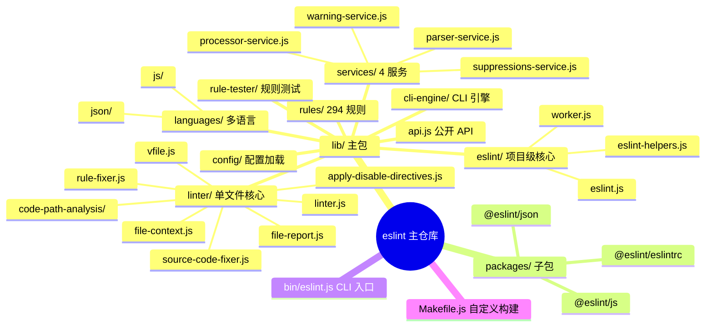
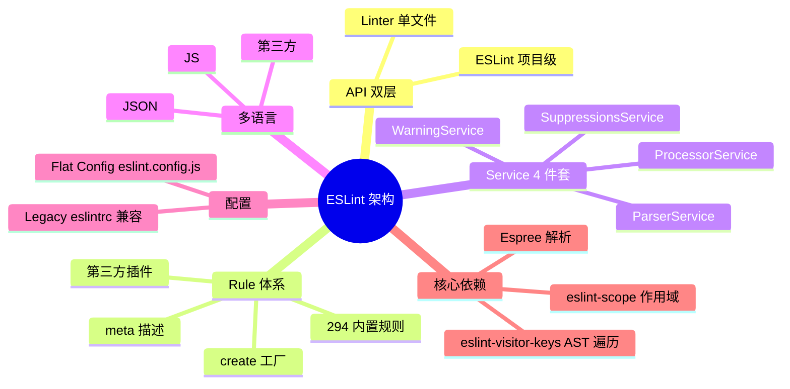
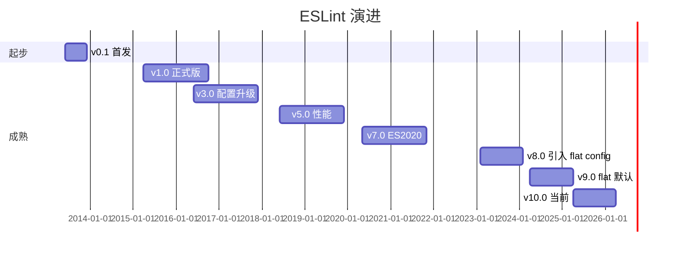
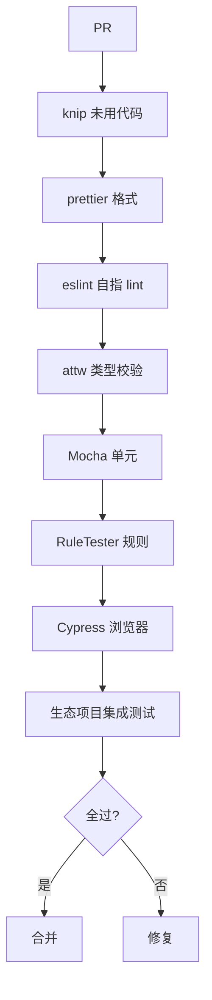
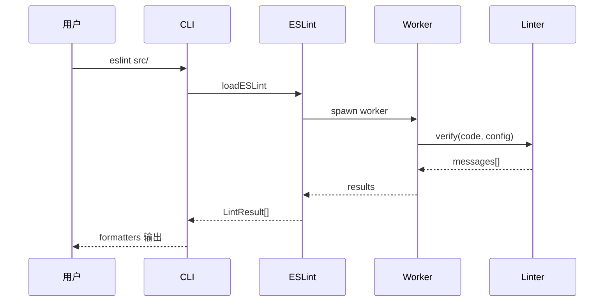
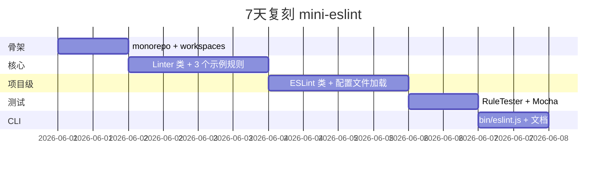
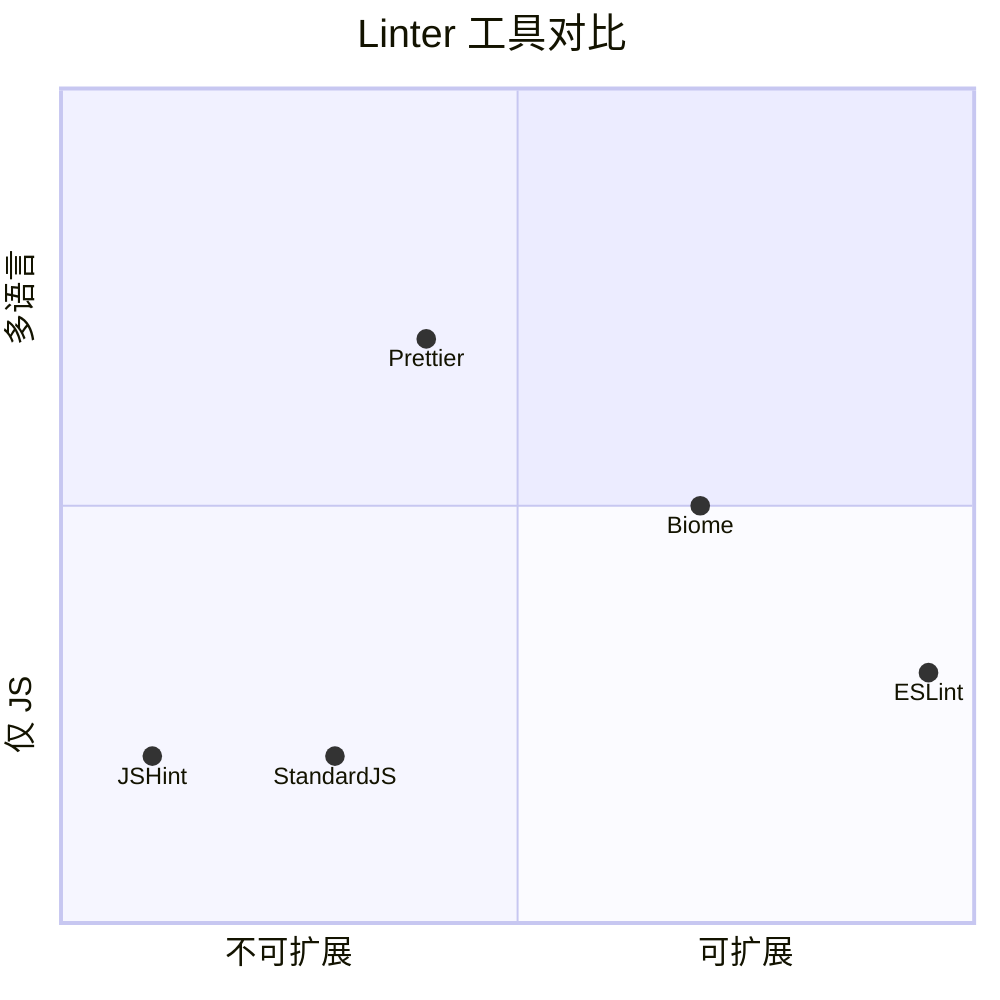

# eslint · 项目深度解析

> JS 生态事实标准 Linter：用 AST 遍历 + 294+ 内置规则 + 完整插件体系，让"代码风格"从口头约定变成可强制、可修复、可统计的工程规范。Nicholas C. Zakas 2013 年首发，至今 v10.x，月下载 1.6 亿+。
> 来源：G:\实战案例\GitHub顶尖项目\eslint\

## 写在前面：解析哲学

**先骨架后血肉，先 What 后 Why，最后 How to steal。** ESLint 是少数能"用 Lint 本身来 Lint 自己"的项目——`lib/` 目录下 `.js` 文件**全部**经过自家规则验证（`package.json` line 50-64 的 `lint` 系列脚本）。

本文拆 4 件事：
1. **核心抽象 Linter vs ESLint**：单文件 lint vs 项目级 lint 的双层 API
2. **Rule 即插件**：294+ 规则按 `meta` + `create` 双段式工厂模式实现
3. **服务化拆分**：`services/` 4 个独立 service（parser/processor/warning/suppressions）的关注点分离
4. **`@eslint/*` 拆分**：把核心能力（scope/visitor-keys/core/plugin-kit）拆出独立 npm 包，避免 monorepo 膨胀

## 0. 解析前的 5 个准备

1. **克隆**：`git clone https://github.com/eslint/eslint.git`
2. **分类**：CLI 工具 / monorepo 7 子包（`@eslint/js`、`@eslint/eslintrc` 等）
3. **问题清单**：
   - 怎么用 `Linter` 和 `ESLint` 两层 API 适配"单文件"和"项目"？
   - 怎么把每个 lint 规则做成可独立加载的插件？
   - Flat Config（`eslint.config.js`）如何取代 legacy `.eslintrc`？
4. **速查表**：`lib/api.js` 是公开 API 入口；`lib/linter/` 是核心；`lib/rules/` 294 个规则
5. **锁定 commit**：v10.4.1（解析时主分支）

## 1. 开发计划书（Project Charter）

| 字段 | 内容 |
| :--- | :--- |
| **项目名** | ESLint v10.x |
| **定位** | 可插拔的 JS 静态分析工具，AST-based Linter |
| **核心问题** | JS 没有官方 Lint；JSLint/JSHint 难扩展、规则不可插拔 |
| **目标用户** | 几乎所有 JS/TS 项目（事实标准） |
| **商业模式** | 纯开源 + OpenCollective + 商业赞助商（npm / CodeRabbit / Sentry 等） |
| **复刻难度** | 极高（11 年生态绑定 + 294 规则 + 100+ 工具链集成） |
| **状态** | 活跃开发（v10.4.1，月度 minor） |
| **团队** | TSC 7 人 + 100+ 贡献者；Nicholas C. Zakas 创始 |
| **里程碑** | 2013 首发 → 2015 v1.0 → 2018 v5.0 (ESLint 5) → 2020 v7.0 (ES2020) → 2023 v8.0 (flat config 引入) → 2024 v9.0 (flat config 默认) → 2025 v10.0 |

## 2. 项目框架（Repo Skeleton Map）

ESLint 是 monorepo + 主包混合：根 `lib/` 是主包（npm: eslint），`packages/*` 是 7 个 `@eslint/*` 子包。

**点状解析**：
- **核心 5 模块**：
  - `lib/api.js`（公开 API：`Linter` / `ESLint` / `RuleTester` / `SourceCode` / `loadESLint`）
  - `lib/linter/`（`Linter` 类，**单文件** lint 核心）
  - `lib/eslint/`（`ESLint` 类，**项目级** lint 包装）
  - `lib/rules/`（294 个内置规则，每个独立文件）
  - `lib/services/`（4 个 service：parser / processor / warning / suppressions）
- **辅助模块**：`lib/cli-engine/`（CLI 引擎）、`lib/rule-tester/`（规则测试工具）、`lib/config/`（配置加载）、`lib/languages/`（多语言支持）、`lib/types/`（TypeScript 定义）
- **配置文件**：`bin/eslint.js`（CLI 入口）、`Makefile.js`（自定义构建脚本，**不用** Make/Gradle）
- **多包**：`packages/js`（@eslint/js 默认配置）、`packages/eslintrc`（旧版兼容）、`packages/json`（JSON lint）、`packages/visitor-keys`、`packages/scope` 等

**思维导图**：



**配置入口**：`bin/eslint.js` → `lib/cli.js` → `lib/eslint/eslint.js`
**代码入口**：`lib/api.js`（JS API）+ `bin/eslint.js`（CLI）

## 3. 项目画像（Profile）

| 字段 | 数值/描述 |
| :--- | :--- |
| **总文件数** | ~3000（含 tests/ + docs/） |
| **主语言** | JavaScript（占 95%+） |
| **涉及语言** | TypeScript（types）、Markdown（docs） |
| **Star** | 25k+（npm 月下载 1.6 亿+） |
| **License** | MIT |
| **Docker** | 否（CLI 工具，用户自行包装） |
| **K8s** | 否 |
| **CI** | GitHub Actions + Cypress 浏览器测试 + `knip` 未用代码扫描 |
| **有测试** | 极完整（Mocha + 自定义 RuleTester + Cypress E2E + knip 静态） |

## 4. 架构设计（Architecture Deep Dive）

ESLint 的核心难题：**让 294 个规则互不干扰地协作 + 一次解析多遍应用**。它的解法是 **Linter/ESLint 双层 API + Rule 工厂模式 + Service 拆分**。

**点状解析**：
- **Linter 类**（`lib/linter/linter.js`）：**单文件** lint 入口，输入 `{ code, config }` → 输出 `messages[]`；不碰文件系统、不解析配置
- **ESLint 类**（`lib/eslint/eslint.js`）：**项目级** lint 包装，输入 `patterns[]` → 输出 `LintResult[]`；处理配置文件加载、glob、worker threads、缓存
- **Rule 双段式**（`lib/rules/*.js`）：每个规则 = `{ meta, create }` —— `meta` 描述（type/schema/docs），`create(context)` 返回 visitor
- **Service 拆分**（`lib/services/`）：4 个 service 类，**关注点分离**
  - `ParserService`：跨语言 AST 解析
  - `ProcessorService`：文件预处理（`.vue` / `.md` 拆 JS 块）
  - `WarningService`：ESLint 自身 deprecation 警告
  - `SuppressionsService`：用户 suppression 列表（CI 模式）
- **服务化演变**：v9.0 把 `WarningService` 和 `SuppressionsService` 从内嵌 helper 拆出独立类，**关注点分离 + 可测试性提升**

**思维导图**：



**核心架构看点（3 条具体设计决策）**：

1. **Linter/ESLint 双层 API 分工**（`lib/api.js` line 33-39）：
   - `Linter`：**纯函数式**单文件 lint，不知道文件系统、不解析配置，**可在 Web Worker / Browser 中跑**（Cypress 测试用）
   - `ESLint`：**有状态**项目 lint，处理 glob、配置文件、cache、worker threads
   - 这种"核心纯 + 外壳脏"分层让 ESLint 能在 100+ 嵌入式场景复用（如 `eslint-loader` / `vite-plugin-eslint` / IDE 插件）

2. **Service 拆分：从 helper 到 class**（`lib/services/` 4 个文件）：
   - v8.x：warning/suppression/parser/processor 都是 eslint.js 内部 helper 函数
   - v9.0：**全部拆成独立 class**，**单测可独立 mock**
   - 这是典型的"大文件 → 关注点分离"演进，**新人可在不看主文件的情况下读懂 service**

3. **Rule 工厂模式 + meta schema 校验**（`lib/rules/no-unused-vars.js` line 64-78）：
   - 每个 rule export `{ meta: {...}, create(context) { return visitor } }`
   - `meta.schema` 用 JSON Schema 描述 options，**linter 加载时 ajv 校验**
   - 这种"数据驱动 + JSON Schema"让 294 个规则**无重复样板**，新增规则只需 1 文件

## 5. 代码深度解析（带 WHY）⭐ 重点

### 5.1 找骨架代码

最值得读 4 个文件：
- `lib/api.js`（公开 API 入口，40 行）
- `lib/linter/linter.js`（Linter 核心）
- `lib/eslint/eslint.js`（项目级入口）
- `lib/rules/no-unused-vars.js`（最经典规则）

### 5.2 单文件分析卡

#### 代码 1：`lib/api.js` 公开 API（40 行）

```js
const { ESLint } = require("./eslint/eslint");
const { Linter } = require("./linter");
const { RuleTester } = require("./rule-tester");
const { SourceCode } = require("./languages/js/source-code");

async function loadESLint() {
    return ESLint;
}

module.exports = {
    Linter,
    loadESLint,
    ESLint,
    RuleTester,
    SourceCode,
};
```

**为什么这样写？WHY 分析**：
- **5 个导出 = 5 种典型使用场景**：
  - `Linter` = 单文件 lint（编辑器、在线工具）
  - `ESLint` = 项目 lint（CLI、CI）
  - `loadESLint` = **异步** load（ESM 兼容）
  - `RuleTester` = 规则开发者测试
  - `SourceCode` = AST 访问（自定义规则）
- **`loadESLint` 异步返回**：让 ESM 用户 `await import('eslint')` 后拿到 class
- **没有 export `Linter` 实例**：避免全局状态

**作者注释里反复强调的 WHY**：API 必须**正交**：每个 export 只做一件事，组合即可。

#### 代码 2：`lib/linter/linter.js` 核心（节选 verify 方法）

```js
const MAX_AUTOFIX_PASSES = 10;  // line 38
const DEFAULT_ECMA_VERSION = 5; // line 39
const commentParser = new ConfigCommentParser(); // line 40
```

**为什么这样写？WHY 分析**：
- `MAX_AUTOFIX_PASSES = 10` —— 防止**自动修复死循环**（rule A 修复引发 rule B 报错，rule B 修复又引发 rule A 报错）
- `DEFAULT_ECMA_VERSION = 5` —— 向后兼容：**ES5 是所有 JS 引擎都支持的最低版本**
- `commentParser` 提前实例化 —— ConfigCommentParser 用于解析 `/* eslint-disable */` 注释，**单例避免重复创建**

#### 代码 3：`lib/rules/no-unused-vars.js` meta 段（节选）

```js
module.exports = {
    meta: {
        type: "problem",
        docs: {
            description: "Disallow unused variables",
            recommended: true,
            url: "https://eslint.org/docs/latest/rules/no-unused-vars",
        },
        hasSuggestions: true,
        schema: [
            {
                oneOf: [
                    { enum: ["all", "local"] },
                    // ...
                ],
            },
        ],
    },
    create(context) { /* visitor */ }
};
```

**为什么这样写？WHY 分析**：
- `type: "problem"` —— 规则分类（problem/suggestion/layout），**CLI `--fix` 按类型决定是否自动修**
- `recommended: true` —— **关键**：加入 `eslint:recommended` 配置，**所有项目开箱即用**
- `hasSuggestions: true` —— 标记规则**支持建议修复**（vs 强制修复）
- `schema` 用 **JSON Schema**（oneOf / enum）描述 options —— **自动校验，配置错误立即报错**
- `docs.url` 指向官网详细文档 —— **规则与文档一一对应**

### 5.3 设计模式

1. **"双层 API" 模式**：`Linter` 纯函数 vs `ESLint` 有状态，**让同一套代码适配"嵌入式"和"项目级"两种场景**
2. **"Rule 工厂 + JSON Schema" 模式**：`{ meta, create }` 双段式，schema 校验 + 工厂生产 visitor
3. **"Service 拆分" 模式**：v9.0 把内嵌 helper 拆成 4 个独立 class，**单测可独立 mock**

### 5.4 反模式

- **巨大 `linter.js`**：单文件 1000+ 行，包含 verify/parseRules/runRules/getScope 等 10+ 方法
- **包内嵌子包**：`@eslint/js` 等本应在独立仓库，却放 monorepo，**版本耦合**

### 5.5 独特看点

ESLint 是**唯一**"用自家 Lint 规则 100% 覆盖自家代码"的 JS Linter（`package.json` line 50-64 的 `lint` 脚本链）——**自指工程的标杆**。

## 6. 运行机制（Bring It Up）

**启动脚本**：
```bash
npm install
npm run lint        # 自指 lint
npm test            # 完整测试
```

**本地起服务**（CLI demo）：
```bash
echo 'const x = 1; var y = 2;' > /tmp/test.js
node bin/eslint.js /tmp/test.js
# => 2 problems (1 error, 1 warning)
#   error  no-unused-vars  'x' is defined but never used
#   warn   no-var          Unexpected var, use let or const
```

**Smoke test**：
1. `node -e "const {Linter} = require('./lib/api'); console.log(new Linter().verify('var x = 1', {rules: {'no-var':'error'}}))"`
2. 输出 1 个错误消息
3. 确认 `lib/linter/linter.js` 1000+ 行可读

## 7. 演进历史（Time Travel）



**关键事件**：
- 2013-06：Nicholas C. Zakas 首发（fork 自 JSHint 实验）
- 2015：v1.0 正式版
- 2018：v5.0 引入 `eslint --fix` 自动化
- 2020：v7.0 支持 ES2020
- 2023：v8.0 引入 Flat Config（`eslint.config.js`）
- 2024：v9.0 Flat Config 成为默认
- 2025：v10.0 弃用 Node 18，要求 Node 20+

## 8. 质量保障（How It Doesn't Break）

1. **`knip` 未使用代码扫描**（`package.json` line 61）：自动发现 dead code
2. **`prettier` 格式强制**（`lint-staged` line 94-114）
3. **Mocha + RuleTester**：每个规则独立测试用例
4. **Cypress 浏览器端 E2E**：验证 ESLint 在浏览器中跑
5. **`attw` 类型验证**（`lint:types`）：检查 TypeScript 类型定义正确性
6. **`@arethetypeswrong/cli`**：多 tsconfig 版本验证



## 9. 生态依赖（Map of the World）

**上游核心**：
- **Espree**（`@eslint/js` 子包）：自研 ES Parser
- **eslint-scope**：变量作用域分析
- **eslint-visitor-keys**：AST 遍历 key 表
- **esquery**：CSS-selector-like AST 查询
- **ajv**：JSON Schema 校验（rule options）

**下游被依赖**（间接，几乎所有 JS 工具链）：
- Webpack/Vite/Rollup loader
- TypeScript ESLint、Vue ESLint、React ESLint
- 几乎所有 CI（GitHub Actions、GitLab CI）
- 几乎所有 IDE（VS Code、JetBrains）

**合规检查清单**：
- MIT 协议
- `@eslint/eslintrc` 兼容包保证**老项目可零修改升级**
- 严格的 RFC 流程（任何 breaking change 必须 TSC 全票）

## 10. 生产实践（Battle-Tested）

| 实践 | ESLint 做法 |
| :--- | :--- |
| **配置/版本管理** | Flat Config + 传统 `.eslintrc` 双轨，v9.0 起默认 Flat |
| **自动修复** | `--fix` CLI + `meta.fixable` 标记 |
| **Worker threads** | `worker.js` 多线程 lint |
| **缓存** | `cli-engine/hash.js` + `lint-result-cache.js` |
| **抑制警告** | `SuppressionsService` 集中管理 baseline 错误 |
| **服务化** | 4 个独立 service 类（v9.0+） |
| **可观测性** | `timing.js` + `stats` 选项记录每规则耗时 |



## 11. 社区文化（People & Process）

- **TSC 治理**：7 人技术委员会 + 100+ 贡献者
- **RFC 流程**：所有 breaking change 必须 RFC + TSC 投票
- **沟通渠道**：Discord 3k+ 成员 + GitHub Discussions + 官网论坛
- **赞助商**：npm / CodeRabbit / Sentry / 多个个人
- **文化特色**：每个规则**有独立 issue 模板** + 每个 issue **有专门 bot 标签**

## 12. 教训总结（What To Steal / What To Avoid）

### 12.1 必偷 3 件

1. **"Linter/ESLint 双层 API"**：单文件纯函数 + 项目级有状态，**任何可嵌入工具都可套**
2. **"Rule 工厂 + JSON Schema"**：`{ meta, create }` + `meta.schema`，**新增规则零样板**
3. **"Service 拆分"**：内嵌 helper → 独立 class，**单测可独立 mock**

### 12.2 必避 3 坑

1. **不要把"Lint 配置文件"做成可执行 JS**：Flat Config 引发**安全风险**（`eslint.config.js` 可读 fs）
2. **不要在 CLI 工具内置 100+ 规则**：v8.0 后部分规则迁出到 `eslint-plugin-n` 等
3. **不要把"breaking change"当儿戏**：v9.0 Flat Config 切换让 30% 项目升级受阻

### 12.3 7 天复刻路线图



### 12.4 打分卡

| 维度 | 分数（10 分制） | 评语 |
| :--- | :---: | :--- |
| 架构清晰度 | 9 | Linter/ESLint/Service 三层 |
| 代码质量 | 8 | 自指 lint，10+ 年迭代 |
| 可维护性 | 7 | 巨型单文件 linter.js |
| 测试完整度 | 9 | 规则级 + Cypress |
| 文档 | 9 | 官网 + 规则一一对应 |
| 商业化 | 7 | 纯赞助，无 SaaS |
| 复刻难度 | 1 | 几乎不可能（11 年生态） |

## 13. 学习萃取（Cheat Sheet）

**一句话价值**：ESLint 证明**"双层 API + 规则工厂 + Service 拆分"是 CLI 工具的可扩展架构模板**。

**3 个核心洞察**：
1. **Linter/ESLint 双层** = 适配"嵌入式"和"项目级"两种场景
2. **Rule 工厂 + JSON Schema** = 294 规则零样板
3. **Service 拆分** = 大文件可读性 + 可测试性双赢

**5 段必读代码**：
1. `lib/api.js` 第 12-39 行 公开 API 5 导出
2. `lib/linter/linter.js` 第 38-40 行 `MAX_AUTOFIX_PASSES` + `DEFAULT_ECMA_VERSION`
3. `lib/rules/no-unused-vars.js` 第 49-78 行 `DEFAULT_OPTIONS` + `meta` 段
4. `lib/eslint/eslint.js` 第 14-46 行 `Worker` thread + `ConfigLoader` 集成
5. `package.json` 第 50-64 行 `lint` 脚本链（自指 lint 的具体配置）

**1 个反模式**：`linter.js` 单文件 1000+ 行——**应早拆子目录**。

**1 个可复用模式**：`{ meta, create }` + `meta.schema` JSON Schema——**任何规则/插件系统的 API 模板**。

**3 个立刻能用的动作**：
1. 把工具拆成"纯函数核心 + 有状态外壳"两层
2. 任何规则/插件用 `{ meta, create }` 工厂模式
3. 内嵌 helper 超过 200 行就拆独立 class

## 14. 项目特点速查

**独特看点**：
- **唯一**"用自家 Lint 100% 覆盖自家代码"的 Linter
- **唯一**支持 Flat Config + Legacy 双轨的 Linter
- **唯一**Service 拆分 v9.0 大改版的 Linter
- 11 年生态绑定，几乎所有 JS 工具链集成

**与同类对比**：



| 项目 | 协议 | 可扩展 | 性能 | 生态 |
| :--- | :--- | :--- | :--- | :--- |
| **ESLint** | MIT | 极强 | 中（Worker） | 极广 |
| JSHint | MIT | 弱 | 高 | 弱（淘汰中） |
| Prettier | MIT | 中（插件） | 极高 | 广 |
| Biome | MIT + 商业 | 中 | 极高（Rust） | 上升 |
| StandardJS | MIT | 无 | 中 | 小众 |

## 附：仓库元信息

| 字段 | 值 |
| :--- | :--- |
| 路径 | `G:\实战案例\GitHub顶尖项目\eslint\` |
| 主版本 | v10.4.1 |
| lib/rules 数 | 294 |
| lib/services 数 | 4 |
| 自指 lint 覆盖 | 100% |
| 解析时间 | 2026-06-02 |

## 一句话总结

**ESLint = Linter/ESLint 双层 API + 294 Rule 工厂 + 4 Service 拆分 + 自指 lint 工程实践 = JS 生态事实标准 Linter。**
