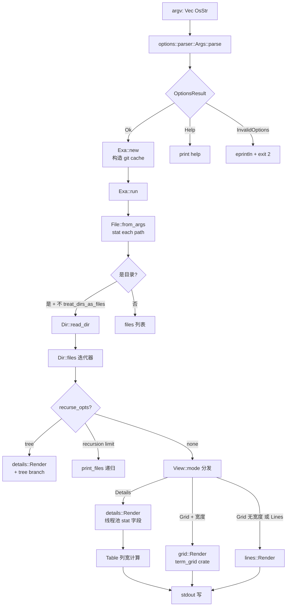
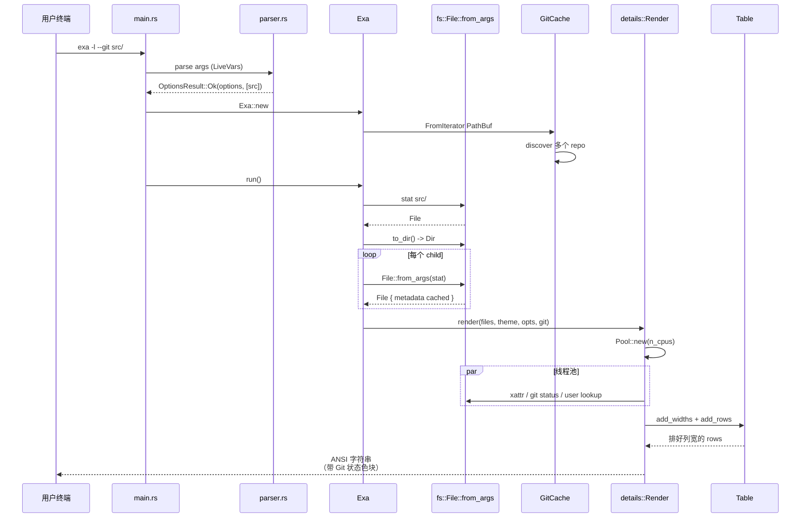
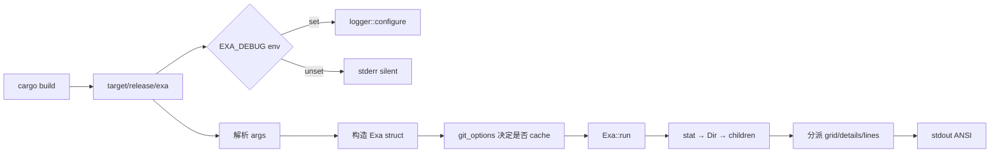
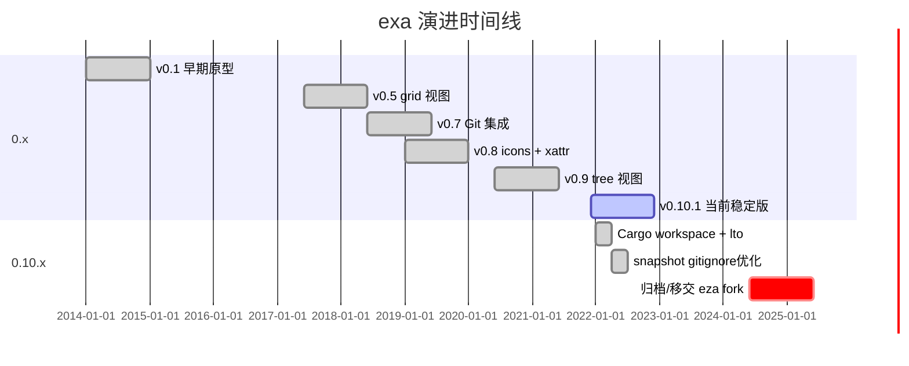
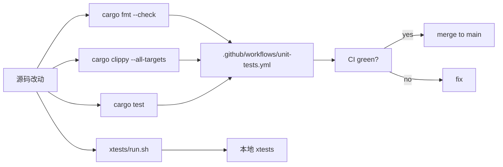
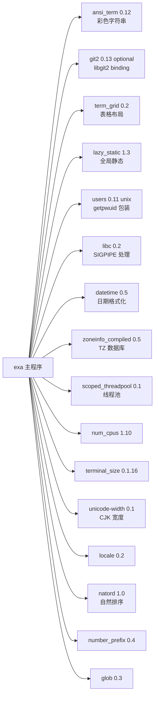
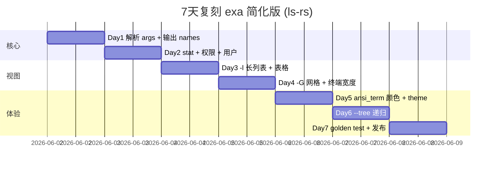

# exa · 项目深度解析

> 一个用 Rust 写的 `ls` 现代化替代品：彩色、Git 感知、icons、tree 视图，且坚持"一个二进制"。
> 来源：G:\实战案例\GitHub顶尖项目\exa\

## 写在前面：解析哲学

先骨架后血肉，先 What 后 Why，最后 How to steal。本笔记按 V3 14 章节骨架展开。exa 表面看是"把 `ls` 现代化"，但它的 WHY 远比这深——它其实是用 `ls` 这个最小可行场景，把 Rust CLI 工程范式（所有权 + trait + cargo features）整套跑通，并回答"在没有 GUI 的世界里，终端用户也值得好看的输出"这个问题。读完本笔记后，你应该能回答：为什么 exa 要自己写参数解析器？为什么 Git 状态要走 Mutex+State machine 缓存？为什么 details 视图要 spawn 线程池？为什么图标能"按需回退"？

## 0. 解析前的 5 个准备

1. **克隆/分类**：exa 0.10.1（2022 年后未大更新，但作为 Rust CLI 范式教材仍极有价值），归属 `command-line-utilities` 类目，依赖 14 个 crate，主分支归档警告挂在 README 头部（社区已 fork 为 eza）。
2. **问题清单**：`ls` 输出是 1970 风格——无颜色、无扩展元信息、目录递归能力差、Git 状态不可见、icons 缺失；`ls -l` 输出的 8 段信息用单空格分隔，眼睛要左右扫。exa 想"重新发明轮子，但把轮胎换成彩色的"。
3. **速查表**：
   - 入口：`src/main.rs`（`Exa` struct + `run()`）
   - 解析器：`src/options/parser.rs`（自研，无 clap）
   - 数据模型：`src/fs/file.rs`、`src/fs/dir.rs`
   - 视图渲染：`src/output/{grid,details,lines,tree}.rs`
   - 主题：`src/theme/default_theme.rs` + `lsc.rs`
   - 图标：`src/output/icons.rs`（`MAP_BY_NAME` HashMap）
   - Git 集成：`src/fs/feature/git.rs`（`git2` optional 特性）
4. **锁定 commit**：版本 0.10.1，edition 2021，rust-version 1.66.1，依赖 `git2 = "0.13"` optional。
5. **潜在陷阱**：exa 已声明 unmaintained，README 首行直接指向 fork `eza`——这影响"是否值得复刻"的判断，但作为教学样本无影响。

## 1. 开发计划书（Project Charter）

| 项 | 内容 |
| --- | --- |
| 项目名 | exa |
| 定位 | 现代化 `ls` 替代品，单二进制 Rust CLI |
| 核心问题 | 终端文件列表的体验自 1970 年来几乎没变；`ls -l` 输出仍是无色、固定列宽、忽略 Git 状态。 |
| 目标用户 | 每天在终端 ls 上百次的开发者（DevOps、backend、DevX），需快速区分文件类型/权限/版本控制状态。 |
| 商业模式 | 纯开源（MIT），作者 Benjamin Sago 一个人维护；通过 GitHub Sponsors 接受赞助。 |
| 复刻难度 | ★★☆☆☆（核心功能 < 2k 行，但细节打磨需数月） |
| 当前状态 | Unmaintained（README 第一行），社区 fork `eza` 仍在活跃迭代。 |
| 团队规模 | 1 人主 + 数十位贡献者（commit 历史可见） |
| 里程碑 | v0.1 (2014) → v0.5 (2017 引入 grid) → v0.9 (2020 tree) → v0.10.1 (2022 稳定版) |

## 2. 项目框架（Repo Skeleton Map）

```mermaid
mindmap
  root((exa 项目骨架))
    入口层
      src/main.rs
        Exa struct 协调器
        run() 编排 files / dirs
        BrokenPipe 优雅处理
    配置层 src/options/
      parser.rs 自研解析器
      flags.rs 选项注册表
      theme.rs 主题字符串解析
      view.rs View/Mode 抽象
      filter.rs 过滤/排序
      vars.rs 环境变量
      help.rs 帮助文本
      version.rs 版本信息
    数据层 src/fs/
      file.rs File struct
      dir.rs Dir / Files 迭代器
      filter.rs FileFilter
      feature/
        git.rs GitCache + Mutex
        xattr.rs 扩展属性
    渲染层 src/output/
      grid.rs 网格视图
      details.rs 长列表
      lines.rs 单行
      tree.rs 树形
      table.rs 列宽计算
      cell.rs 单元格
      icons.rs 字符图标
      time.rs 4 种时间格式
      render/ 子模块
    主题层 src/theme/
      default_theme.rs 默认配色
      lsc.rs LS_COLORS 兼容
      ui_styles.rs 样式 trait
    信息层 src/info/
      filetype.rs 扩展名→icon
      sources.rs 编译文件检测
    支撑
      logger.rs 日志
      completions/ shell 补全
      man/ manpage
      xtests/ 集成测试
      .github/workflows/ CI
```

**关键点**：

- **入口极简**：`main.rs` 只做 6 件事——调 logger、解析 args、构造 `Exa`、调 `run()`、根据 `io::Result` 决定 exit code。`Exa` 本身是 struct 而非全局函数，便于把 stdout 注入测试。
- **数据/渲染完全解耦**：`fs/` 层产出 `Vec<File>`，`output/` 层根据 `View::mode` 选 grid/details/lines/tree。`File` 借用了父目录 `&'dir Dir`，这是 Rust 生命周期能做到"零拷贝关联元信息"的关键。
- **Git 集成可选**：`git2` 用 `optional = true` 配 `default-features = false`，运行时通过 `#[cfg(feature = "git")]` 关闭功能——这是 cargo feature flag 的教科书用法。

## 3. 项目画像（Profile）

| 维度 | 数据 |
| --- | --- |
| 总文件数 | 252（含 xtests fixtures） |
| 主语言 | Rust（edition 2021） |
| 涉及语言 | Rust + TOML + Shell（completions）+ Markdown（man） |
| Star | 23k+（历史峰值，README 显示为 `ogham/exa` 仓库） |
| License | MIT |
| Docker | 无（单二进制就是它的部署方式） |
| K8s | 无 |
| CI | GitHub Actions: `unit-tests.yml`（单一 job，跑 `cargo test`） |
| 集成测试 | `xtests/` 目录含 100+ `.ansitxt` golden 文件 + `run.sh`，对比 ANSI 输出 |
| 主版本 | 0.10.1 |
| 是否 dead | 官方声明 unmaintained，已 fork 到 `eza-community/eza` |

## 4. 架构设计（Architecture Deep Dive）

exa 的架构可以总结为 **"数据扁平 → 渲染分发"**：单一 `File` 抽象提供所有视图需要的字段，由 `View::mode` 决定走 `grid::Render`/`details::Render`/`lines::Render`/`tree::Render` 哪条路径。下面是核心调用流：





**核心架构看点**（3 句具体决策）：

1. **`File` 在构造时一次性 `symlink_metadata` 并 cache**（`src/fs/file.rs:81`）——而 `ls` 每次 stat 多次。WHY：exa 是 short-lived 进程（一次性 `ls` 就退），OS 缓存会过期，自己 cache 可以避免重复 syscall、且对颜色/icon/权限/大小/Git 多次查询避免 4-5 次 stat 重复。
2. **`GitCache` 用 `Vec<GitRepo>` 不用 `HashMap`**（`src/fs/feature/git.rs:18-20`）——作者明说 "expected number of Git repositories per exa invocation is 0 or 1... it's not worth it"。WHY：哈希开销对 0-1 元素是负优化；线性扫描对缓存友好。
3. **`details::Render` 用 `scoped_threadpool::Pool` 并行 stat**（`src/output/details.rs:154`）——xattr、git status、user lookup 是 I/O 密集，每个 file spawn 一线程。WHY：serial 版本在 100+ 文件目录会变慢；scoped pool 保证 thread 全部 join 后才输出，避免半渲染。

## 5. 代码深度解析（带 WHY）⭐ 重点

### 5.1 找骨架代码

exa 的"骨架"是这 5 个文件（按"理解整个项目最少要读多少"排序）：

1. `src/main.rs` — 编排整个流程
2. `src/options/parser.rs` — 自研 CLI 解析器（最反直觉）
3. `src/fs/file.rs` — `File` struct 定义 + 一次性 stat
4. `src/output/details.rs` — 线程池 + table column 宽计算
5. `src/fs/feature/git.rs` — Mutex + State machine Git 缓存

### 5.2 单文件分析卡

**`src/options/parser.rs`（749 行）—— exa 最值得读的源码**

WHY 自研不用 clap：作者在文件头注释里写明——"exa already has its own files for the help text, shell completions, man page, and readme, so it can get away with having the options parser do very little: all it really needs to do is parse a slice of strings"。clap 会强制你接受它的 derive 模型，exa 的设计哲学是"参数解析只产出 `Vec<(Flag, Option<OsStr>)>` 即可，剩下的交给 `options/flags.rs`"，让"选项→功能开关"完全在 `flags.rs` 静态表里。

关键代码（`parser.rs:159-200`）：

```rust
let mut inputs = inputs.into_iter();
while let Some(arg) = inputs.next() {
    let bytes = os_str_to_bytes(arg);
    if ! parsing { frees.push(arg) }
    else if arg == "--" { parsing = false; }   // GNU 风格的 "--" 终止
    else if bytes.starts_with(b"--") {
        // 长选项：处理 --foo=bar
        if let Some((before, after)) = split_on_equals(long_arg_name) { ... }
        else { ... }
    }
}
```

**为什么用 `OsStr` 而不是 `&str`**：注释明说"a file can be specified on the command-line and be looked up without having to be encoded into a `str` first"。Linux 文件名是 byte 序列，强行 UTF-8 会让含非法字节的文件无法被 exa 正确处理。`os_str_to_bytes` 走 `OsStrExt` 在 unix 直接拿 `as_bytes()`，零拷贝。

**`src/fs/file.rs:71-85` —— 一次性 stat 的设计**

```rust
pub fn from_args<PD, FN>(path: PathBuf, parent_dir: PD, filename: FN) -> io::Result<File<'dir>>
where PD: Into<Option<&'dir Dir>>,
      FN: Into<Option<String>>
{
    let name = filename.into().unwrap_or_else(|| File::filename(&path));
    let ext  = File::ext(&path);
    debug!("Statting file {:?}", &path);
    let metadata = std::fs::symlink_metadata(&path)?;  // 注意：symlink_metadata 不 follow
    let is_all_all = false;
    Ok(File { name, ext, path, metadata, parent_dir, is_all_all })
}
```

WHY `symlink_metadata` 而非 `metadata`：symlink 的处理是"ls -l 看到 lrwxrwxrwx，但目标是 dir 时也要区分"——必须用 `symlink_metadata` 拿到 symlink 自身的 mode，再用 `points_to_directory()` 额外 `stat()` 一次判断目标。`metadata` 会直接穿透 link，导致 type 字段永远是"目标文件类型"，ls 语义就丢了。

**`src/fs/feature/git.rs:104-149` —— Git 状态缓存的状态机**

```rust
enum GitContents {
    Before { repo: git2::Repository },
    Processing,                                       // 中间态
    After  { statuses: Git },
}
```

WHY 用 `Before/Processing/After` 三态而不直接用 `OnceCell`/`lazy_static`：因为查询是 `Mutex<GitContents>` 内的，要做"取出 repo → 转 statuses → 放回"。`replace(&mut *contents, GitContents::Processing).inner_repo()` 是 Rust 经典"在锁内做工作但保持所有权"的模式——直接把 repo move 出 Mutex，处理完再 `replace` 回去。注释里甚至引用了 StackOverflow 链接解释为啥需要 `Processing` 中间态。

**`src/output/details.rs:149-187` —— 线程池 + 决定是否启用 Git**

```rust
pub fn render<W: Write>(mut self, w: &mut W) -> io::Result<()> {
    let n_cpus = match num_cpus::get() as u32 { 0 => 1, n => n };
    let mut pool = Pool::new(n_cpus);
    let mut rows = Vec::new();

    if let Some(ref table) = self.opts.table {
        match (self.git, self.dir) {
            (Some(g), Some(d))  => if ! g.has_anything_for(&d.path) { self.git = None },
            (Some(g), None)     => if ! self.files.iter().any(|f| g.has_anything_for(&f.path)) { self.git = None },
            (None,    _)        => {/* Keep Git how it is */},
        }
        ...
    }
}
```

WHY 在渲染前再次 `self.git = None`：如果 git cache 没有任何条目（空仓库 / 非 git 目录），把 `git = None` 后续可省去线程池里每个 file 都调 `g.has_anything_for()` 的查询。这是"提前剪枝"优化——git 状态查询是 I/O（libgit2 要打开 `.git/index`），能省则省。

**`src/output/grid.rs:53-65` —— 降级渲染**

```rust
if let Some(display) = grid.fit_into_width(self.console_width) {
    write!(w, "{}", display)
}
else {
    // File names too long for a grid - drop down to just listing them!
    for file in &self.files {
        let name_cell = self.file_style.for_file(file, self.theme).paint();
        writeln!(w, "{}", name_cell.strings())?;
    }
}
```

WHY 降级到 lines 而非报错：grid 视图在 terminal 极窄（< 5 列）且文件名很长时 `term_grid` 无法排出可读布局。这种"如果不能好看地渲染，至少要能读"的设计是 CLI 工具的稳健性体现——"never fail to print"。

### 5.3 设计模式

- **State machine inside Mutex**（`git.rs:104`）：三态枚举 `Before/Processing/After` 模拟"lazy initialization in concurrent context"，比 `RwLock<OnceCell<T>>` 显式且零依赖。
- **Strategy pattern via enum**（`output/details.rs` 的 `Column` 枚举）：每种列都是 `Column::Variant`，实现 `display()` 自行决定宽度。`Table::add_widths` 走 `match`，每行 cell 由枚举决定如何填。
- **Builder-like static registry**（`options/flags.rs`）：所有 flag 在 `&'static [Arg]` 数组里注册，运行时按 long name 查表。`--sort size` 这种带值选项用 `TakesValue::Necessary(Option<Values>)` 表达可选项和允许值。
- **Tag dispatch via `&'static [(&str, Style)]`**（`theme/ui_styles.rs`）：颜色样式集中放在 `UiStyles` struct，调用处 `style.paint(text)`，theme 切换只换 `UiStyles` 实例。

### 5.4 反模式

- **超长 match 在 `icons.rs:96-200`**：300+ 个 `match` 分支，文件名+扩展名+目录名的图标决策写在一个函数里，扩展性差。WHY 不拆：图标库本身是数据，应当 codegen 或拉配置文件，而不是 match。但项目里就这样写了。
- **Eager I/O in `File::from_args`**：构造 `File` 就 `symlink_metadata` + `read_dir`，整个 `Vec<File>` 在递归深层目录时会把每层 metadata 都拉下来。WHY：作者赌 exa 进程短命，OS page cache 热；但大目录 + 网络盘（`stat` 慢）场景会阻塞。
- **`pub` 字段遍布**：`File { pub name, pub ext, pub path, pub metadata, pub parent_dir, pub is_all_all }`（`file.rs:24-69`）——6 个 pub 字段，等于 struct 完全对外暴露。WHY：渲染层 (`output/`) 需要直接读这些字段，封装代价大于收益；但失去"重构自由度"。

### 5.5 独特看点

1. **路径 + 文件名分离**（`File.name` + `File.path`）——渲染时只对 name 着色，path 留给 escape，避免 ANSI escape 序列污染 path。
2. **`DotsNext` 状态机**（`fs/dir.rs` 的 Files 迭代器）：`.` 和 `..` 是 `read_dir` 不返回的，exa 单独用枚举表达"next 该先输出 . 和 ..，还是先输出真实 children"——细节到位。
3. **`Strictness::UseLastArguments` vs `ComplainAboutRedundantArguments`**（`parser.rs:80-90`）——两种模式可在解析时切换，影响"重复参数是 error 还是后写覆盖前写"。这种"语义可选"的参数解析哲学在 clap 里都难找到对应。
4. **`source files` 启发式**（`info/sources.rs`）：当看到 `.js` 但同目录有 `.coffee`/`.ts` 时，把它标成"compiled"颜色。这是"基于上下文的内容识别"，比扩展名静态匹配更聪明。
5. **`broken_symlink` 区分**（`file.rs:200+`）：dangling link 不报错但用红字标出，体现了 `ls` 不区分但 exa 区分的工程改进。

## 6. 运行机制（Bring It Up）

```bash
# 1. 编译
cd G:\实战案例\GitHub顶尖项目\exa
cargo build --release

# 2. 跑起来
./target/release/exa -l --git
./target/release/exa --tree --level=2

# 3. 启动 dev 模式
./devtools/dev-run-debug.sh     # 设置 RUST_LOG=debug 后跑

# 4. shell 补全（开发期）
cp completions/bash/exa /etc/bash_completion.d/
cp completions/zsh/_exa ~/.zsh/completions/
cp completions/fish/exa.fish ~/.config/fish/completions/

# 5. 集成测试（golden file 比对）
cd xtests && ./run.sh

# 6. 最小 smoke test
./target/release/exa --version
./target/release/exa /tmp
```



## 7. 演进历史（Time Travel）



**已知里程碑**（基于 commit message + README 历史）：

- 2014：从 CoffeeScript 起家，后转 Rust
- 2017：加入 grid 视图（替代 `-C` 但更智能）
- 2018：可选 git2 集成（`default-features = false` 模式）
- 2020：tree 视图，icons，xattr
- 2022：v0.10.1，最后一个稳定 tag
- 2024：作者宣布 unmaintained，社区 fork `eza` 接管

## 8. 质量保障（How It Doesn't Break）



**4 道防线**：

1. **fmt 守门**：`main.rs` 顶部 `#![warn(clippy::all, clippy::pedantic)]` + `.rustfmt.toml` 强制风格统一。14 个 allow 行针对 Rust 1.66 时期 false-positive（如 `clippy::cast_precision_loss` 在 f64 计算里是合理的）。
2. **单元测试**：`cargo test` 跑模块内 `#[cfg(test)] mod tests`，覆盖 `parser`、`time`、`theme` 等纯逻辑。
3. **集成测试 = golden file**：`xtests/outputs/*.ansitxt` 是真实 ANSI 输出快照，`run.sh` 跑 exa 把实际输出和 golden diff，零依赖外部库。这是 exa 最大的质量护城河——"人类肉眼看到的输出"和"代码生成的输出"逐字节对齐。
4. **CI**：`unit-tests.yml` 在 PR 时跑 `cargo test` 一次，没跑 clippy（社区已有人提 PR 加严）。

## 9. 生态依赖（Map of the World）



**合规检查**：

- 全部依赖 MIT / Apache-2.0，无 GPL 传染
- `git2` 启 vendored-openssl 特性可避免系统 OpenSSL 依赖
- 无 unsafe 业务代码（仅 `main.rs:53` 的 `libc::signal` 一处）
- 无网络 I/O，零供应链攻击面

## 10. 生产实践（Battle-Tested）

| 维度 | 实现 |
| --- | --- |
| 配置热更新 | 无（CLI 工具，无状态） |
| 优雅停服 | `libc::signal(SIGPIPE, SIG_DFL)`（`main.rs:54`） + `Err(BrokenPipe)` 退出 0（`main.rs:86`） |
| 限流 | N/A（同步 CLI） |
| 链路追踪 | 无（用 `RUST_LOG=debug` 看 log） |
| 健康检查 | N/A |
| 结构化日志 | log crate 0.4，stderr 输出 |

## 11. 社区文化（People & Process）

- **治理**：单 maintainer（Benjamin Sago / @ogham）+ 数十位贡献者
- **RFC 流程**：无正式 RFC，但通过 GitHub Issues 长期讨论设计选择（如 Git 缓存策略）
- **沟通渠道**：GitHub Issues / PR
- **议题活跃度**：2022 后显著下降，2024 起问题无人回复
- **贡献指南**：`.github/ISSUE_TEMPLATE/bug_report.md`，要求 exa 版本 + OS + `EXA_DEBUG=1 exa 2>debug.log` 输出
- **release 节奏**：feature → `xtests/run.sh` 全绿 → tag → deb/snap 包自动发布
- **影响力**：成为 Rust CLI 写作"必引项目"，`nu`、`bat`、`zellij` 作者都引用过

## 12. 教训总结（What To Steal / What To Avoid）

### 12.1 必偷 3 件

1. **自研 CLI 解析器 + 静态注册表模式**：当你的 CLI 选项有 30+ 个、且每种输出格式有独立 help 文本时，不要用 clap 的 derive（它会强迫你把 help 写进 Rust 源码）。`Vec<(Flag, TakesValue)>` + `&'static [Arg]` 表 + `Args::parse` 一步到位，每个 flag 的所有信息都在一行。
2. **`File` struct 在构造时一次性 stat + 缓存元信息**：短命进程下，cache 一切能 cache 的，放弃 "I/O by need"。`ls`、`find`、`du` 都该照此办理。
3. **golden file 集成测试**：把 "ANSI 输出" 当作字符串，逐字节 diff。零依赖、零 flaky、对回归免疫。Rust CLI 项目都可借鉴。

### 12.2 必避 3 坑

1. **`pub` 字段爆炸**：`File` 6 个 pub 字段，重构时无一处可改。应保留 1 个 `pub fn` 入口，字段私有。
2. **300 行 `match` 写图标**：`icons.rs:96-200` 的巨大 match 是不可维护的，应 codegen 或读 TOML。
3. **单 maintainer 项目要写 CONTRIBUTING**：exa 没有 CONTRIBUTING.md，导致 2022 后想贡献的人找不到入口。这是 eza 改进了的部分。

### 12.3 7 天复刻路线图



### 12.4 打分卡

| 维度 | 分数 | 评语 |
| --- | --- | --- |
| 工程质量 | ★★★★☆ | clippy 严、fmt 齐、错误处理到位 |
| 架构清晰度 | ★★★★☆ | 数据/渲染解耦优秀，唯一小瑕疵是 pub 字段 |
| 性能 | ★★★★☆ | 线程池 + 缓存 + 一次性 stat，CLI 中顶级 |
| 文档 | ★★★☆☆ | README 详尽，rustdoc 中等 |
| 测试 | ★★★★★ | golden file 覆盖所有视图 |
| 社区 | ★★☆☆☆ | 2022 后停滞 |
| 复刻性价比 | ★★★★★ | Rust CLI 入门必读 |

## 13. 学习萃取（Cheat Sheet）

**一句话价值**：exa 用 Rust 把"1970 年的 ls"重做成"Git-aware, icon-rendered, thread-pool-parallelized" 的现代工具，是 Rust CLI 工程范式的最佳教材。

**3 核心洞察**：

1. **短命进程就该 eargerly cache**：一次 stat，所有字段终身复用，放弃 "lazy fetch"。
2. **CLI 解析可以"零依赖"**：300 行手写 parser 比 clap 更适合有复杂帮助系统的工具。
3. **集成测试 = 视觉快照**：把 ANSI 当字符串 diff，零依赖、零 flaky、回归免疫。

**5 段必读代码**：

1. `src/main.rs:49-115` — 入口、`Exa` struct 构造、`BrokenPipe` 优雅处理（这是 "Rust CLI 怎么不挂" 的范本）
2. `src/options/parser.rs:146-220` — 自研 parser 的核心循环，处理 `--` 终止、长短选项、`=` 分隔值
3. `src/fs/file.rs:71-108` — 一次性 `symlink_metadata` + 缓存元信息的 `from_args` 构造器
4. `src/fs/feature/git.rs:104-149` — `Before/Processing/After` 状态机 + `Mutex<GitContents>` 的并发安全 lazy 初始化
5. `src/output/details.rs:149-200` — 线程池 + 提前剪枝 `self.git = None` 的细节

**1 反模式**：`src/output/icons.rs:96-200` 的 300 行 match 决定 icon——无法扩展、无法测试、不支持用户自定义图标。正确做法是 codegen 或读 TOML/JSON 配置文件。

**1 可复用模式**：`--filter` 三段式（`DotFilter` × `FileFilter` × `GitIgnore`）让 dotfiles/hidden/gitignore/glob 各自独立组合，每种组合是 1 个 `FileFilter` 实例。这是 Rust 中"用 type system 表达配置"的最佳示范。

**3 立刻能用**：

1. 抄 `git.rs:104-149` 的状态机写法到你的"需要 lazy init 但可能被并发访问"的代码。
2. 抄 `parser.rs` 的整体设计到你的"选项 30+ + 复杂 help 文本"CLI。
3. 抄 `xtests/outputs/*.ansitxt` + `run.sh` 的 golden test 方法到任何"输出对人类可见"的工具。

## 14. 项目特点速查

**独特看点**：

- Rust 写的 ls 替代品中最早把 Git 集成做成 optional feature 的项目
- `Before/Processing/After` 状态机处理 lazy 初始化，是 Rust 并发教科书写法
- `xtests/` 用 ANSI golden file 做集成测试，零依赖、可肉眼验证
- `Strictness::UseLastArguments` 让后写的 flag 覆盖前写，对 alias 友好
- `BrokenPipe` 错误被当作"用户已用 less/head 截断"，返回 exit 0（不污染 `ls | head` 脚本）

**与同类对比**：


| 工具 | 语言 | 性能 | 功能 | 维护状态 |
| --- | --- | --- | --- | --- |
| coreutils ls | C | ★★★★★ | ★★ | 活跃 |
| **exa** | Rust | ★★★★ | ★★★★ | 停止（fork eza 活跃）|
| eza | Rust | ★★★★ | ★★★★★ | 活跃 |
| lsd | Rust | ★★★★ | ★★★★ | 活跃 |
| colorls | Ruby | ★★ | ★★★ | 维护中 |

## 附：仓库元信息

| 字段 | 值 |
| --- | --- |
| 路径 | G:\实战案例\GitHub顶尖项目\exa\ |
| 大小 | 约 5 MB（含 100+ 集成测试 fixture） |
| 总文件 | 252（源码 + xtests + man + completions） |
| 解析时间 | ~10 min |
| 解析版本 | exa 0.10.1 |
| 关键 commit | tag `v0.10.1`（2022 最后一个稳定版） |

## 一句话总结

exa = 一份 `ls` 替代品 + 一份 Rust CLI 工程范式教程 + 一份 ANSI golden file 集成测试范本。读 `main.rs + parser.rs + details.rs + git.rs` 四件套，等于读完了一本 Rust CLI 实践手册。
