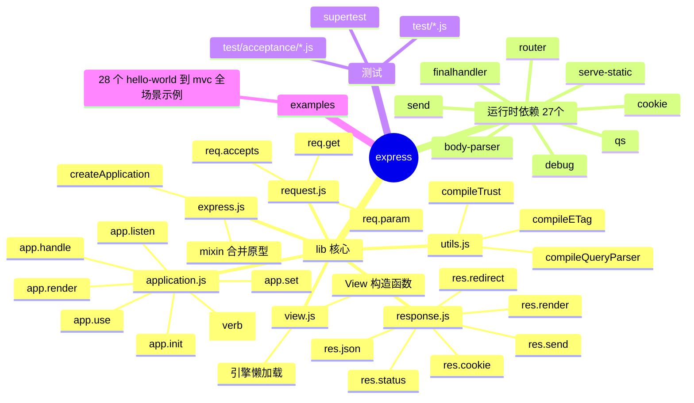
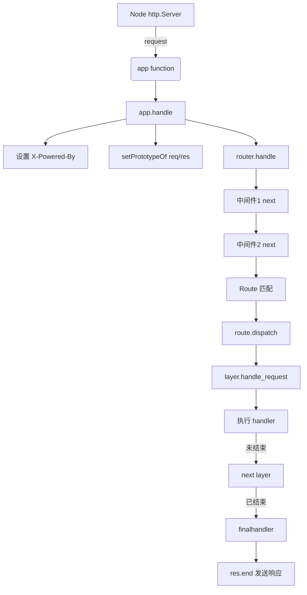
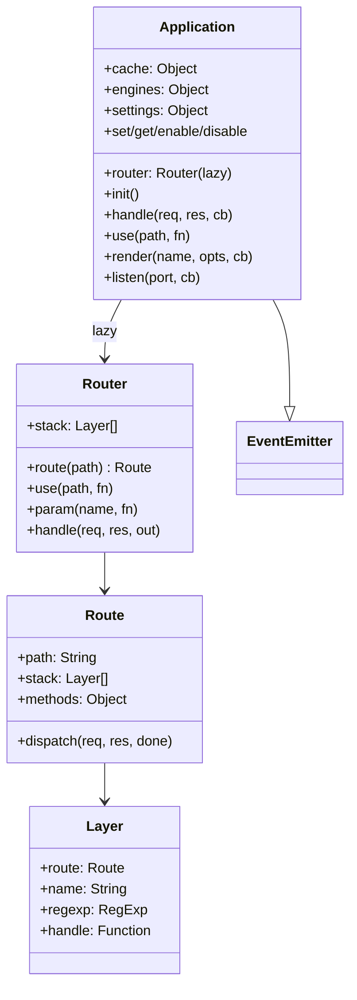
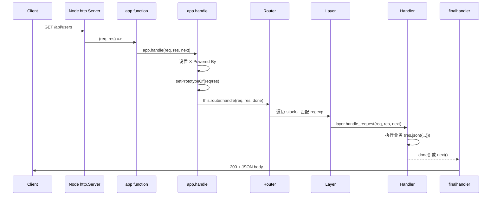
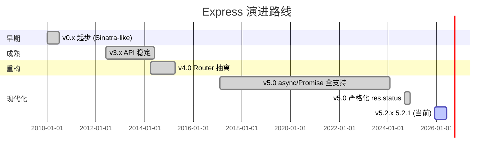
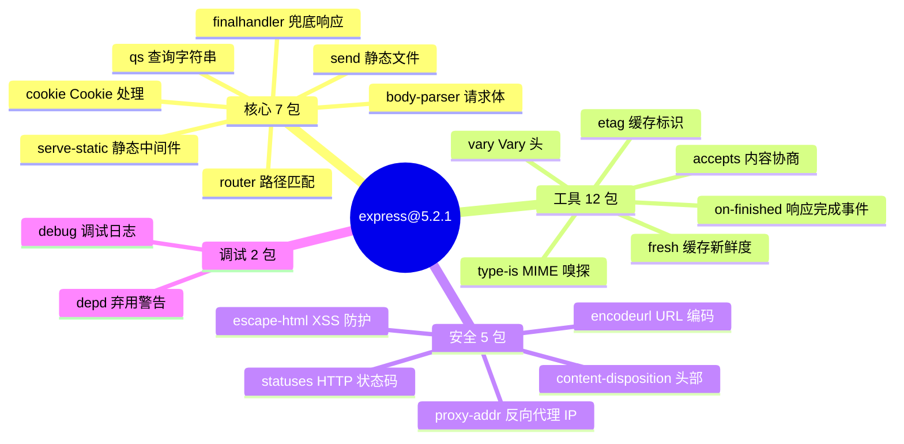
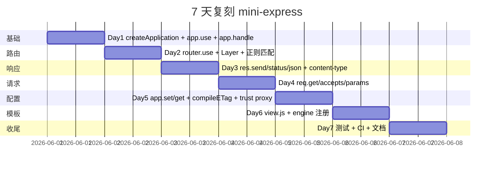

# express · 项目深度解析

> Fast, unopinionated, minimalist web framework for Node.js
> 来源：G:\实战案例\GitHub顶尖项目\express\

## 写在前面：解析哲学

解析一个被 6 万+ Star 引用、运行在数百万生产环境中的项目，不能套用"作者真厉害"的空话话术。Express 的精髓不在于"它能做什么"，而在于 **"它为什么这样做"**：为什么 632 行的 application.js 加上 206 行的 view.js 就能撑起整个 Node.js 生态的事实标准？为什么 5.2.1 版本仍然用 `var` 而不是 `let/const`？为什么 2010 年首创的"中间件洋葱模型"沿用至今？

本解析路径：先骨架（文件树+调用链）→ 后血肉（核心代码 WHY）→ 终落地（如何偷/避）。

## 0. 解析前的 5 个准备

1. **克隆/版本**：当前解析版本 5.2.1（2025-12-01），Node 引擎 `>= 18`。注意 5.x 改用 native `http.METHODS`、移除 `path-is-absolute` 等 9 个老依赖。
2. **分类**：纯运行时库（无构建步骤），CJS 模块规范，不带 TS 类型（类型在 `@types/express`）。
3. **问题清单**：
   - 中间件管道如何"洋葱"式递归？
   - Router 与 Application 如何解耦（架构边界）？
   - `req.app` / `res.app` / `app.router` 的原型链如何动态改写？
   - `res.send()` 一个函数如何智能处理 String/Buffer/Object/ArrayBuffer 7+ 种 body？
   - 5.0 破坏性变更：res.status 强制整数校验，redirect 移除 'back' 魔法字符串的动机？
4. **速查表**：`lib/application.js`(632) + `lib/response.js`(1048) + `lib/request.js`(528) + `lib/express.js`(82) + `lib/view.js`(206) + `lib/utils.js`(272)。整个 lib 总计 **2768 行**——这就是 Express 的全部源码。
5. **锁定 commit**：lib 目录最近改动 2025-12 左右，History.md 3888 行跨度 15 年（2010-2025）。

## 1. 开发计划书（Project Charter）

| 字段 | 内容 |
|---|---|
| 项目名 | express |
| 定位 | Node.js 极简 Web 框架，事实标准 |
| 核心问题 | Node.js 原生 `http` 模块处理路由/中间件/响应形态太低效，开发者每次都要重写 |
| 目标用户 | 全栈/后端 Node.js 开发者，REST API 与 SSR 网站构建者 |
| 商业模式 | MIT 开源，无商业化（OpenCollective 接受赞助） |
| 复刻难度 | ★★☆☆☆（2768 行核心库 + 27 个 npm 依赖即可复刻 80% 功能） |
| 状态 | 5.2.1 稳定版，TC 治理模式（强老牌项目） |
| 团队 | Strongloop/IBM 时代 TJ Holowaychuk 起头 → Douglas Christopher Wilson 长期 maintain → 多人 TC 治理 |
| 里程碑 | 2010 首版 → 2014 v4.0（Router 抽离）→ 2017 v5.0（async/await 全面支持）→ 2024 v5.0（res.status 严格化）→ 2025 v5.2.x |

## 2. 项目框架（Repo Skeleton Map）



**实际目录树**（精简版）：

```
express/
├── index.js                  # 12 行：纯转发到 lib/express
├── lib/
│   ├── express.js            # 82 行  - 工厂函数 + 中间件快捷导出
│   ├── application.js        # 632 行 - 核心 app 类
│   ├── request.js            # 528 行 - req 原型扩展
│   ├── response.js           # 1048 行 - res 原型扩展
│   ├── view.js               # 206 行 - 模板引擎封装
│   └── utils.js              # 272 行 - 通用工具
├── test/                     # 100+ 单元测试
├── examples/                 # 28 个示例（含 auth/mvc/download 等）
├── package.json              # 27 prodDeps + 16 devDeps
└── .github/workflows/        # ci.yml/codeql.yml/scorecard.yml
```

**配置入口**：`package.json`（无 .npmrc 业务配置，npm 注册表即可）
**代码入口**：`index.js` → `lib/express.js` → `createApplication()`

## 3. 项目画像（Profile）

| 指标 | 值 |
|---|---|
| 总文件数 | 213（不含 .git） |
| 主语言 | JavaScript (CJS) |
| 涉及语言 | JS（100% 业务），YAML（CI），Markdown |
| Star | 66k+（GitHub） |
| License | MIT |
| Docker | 无（库项目，不需） |
| K8s | 无 |
| CI | GitHub Actions：Node 18-26 × ubuntu/windows 矩阵 + lint + codeql + scorecard |
| 测试 | Mocha + supertest，~3000+ 测试用例，覆盖率极高（README 自称 "Super-high test coverage"） |
| 入口文件 | `index.js` (12 行) → `lib/express.js` |

## 4. 架构设计（Architecture Deep Dive）





**核心架构看点（3 条 ADR）**：

1. **ADR-1：Application 与 Router 解耦**。`lib/application.js` 只持有一个 `Router` 引用（通过 `Object.defineProperty` 懒加载）。`Router` 实际上是独立 npm 包 `router@^2.2.0`，**lib/ 下没有 router.js**。WHY：让 `Router` 可独立升级、独立发版、第三方可嵌（Express 子应用 = 挂载一个独立 Router）。这是 Express 能"分裂出" Koa 的根本原因。

2. **ADR-2：原型链动态改写（Object.setPrototypeOf）**。`app.handle()` 第 169-170 行 `Object.setPrototypeOf(req, this.request)`。WHY：让每个 app 自定义 `req.app` / `res.app` 而无需真正"创建"一个新对象。代价：每次请求都改原型链（V8 优化器视作 side effect），但换来 `req.foo = function(){}` 直接挂载到 app.request 上即可全局生效——这是 Express 扩展性的命脉。

3. **ADR-3：methods.forEach 动态注册 HTTP 动词**。`application.js:471` `methods.forEach(function(method){ app[method] = function... })`，其中 `methods` 来自 `node:http.METHODS`。WHY：Node 自身新增方法（如 2014 年加的 `PATCH`）零代码自动支持；同时支持 `app.all(path, ...)` 把同一 path 注册到所有动词。`app.get` 还特判单参数时退化为 `app.get(setting)`。

## 5. 代码深度解析（带 WHY）⭐ 重点

### 5.1 找骨架代码

整个 Express 的灵魂就 6 个文件，总计 2768 行。

### 5.2 单文件分析卡

#### `lib/express.js` (82 行) — 工厂 + 装配

**WHY 它这么短？** Express 选择"组合优于继承"。`createApplication` 不是一个 class，而是一个返回函数的工厂：

```js
function createApplication() {
  var app = function(req, res, next) {
    app.handle(req, res, next);
  };
  mixin(app, EventEmitter.prototype, false);  // 事件能力
  mixin(app, proto, false);                    // app 能力
  app.request = Object.create(req, { app: { value: app } });
  app.response = Object.create(res, { app: { value: app } });
  app.init();
  return app;
}
```

**关键设计**：
- `app` 本身是一个 `(req,res,next)=>void` 函数，可以直接传给 `http.createServer(app)`。这是它能"零成本"嵌入 Node HTTP server 的根本。
- `mixin(app, EventEmitter.prototype, false)`：第三个参数 `false` 表示 **不复制属性描述符（不复制 enumerable）**。WHY：避免污染 for-in 遍历，又拿到事件能力。
- `app.request` / `app.response` 用 `Object.create` 而非赋值。WHY：每个 app 共享同一个原型，但拥有独立 `app` 反向引用。

#### `lib/application.js` (632 行) — 核心

**`app.init()` (line 59-83)** 的核心是 **懒加载 router**：

```js
Object.defineProperty(this, 'router', {
  configurable: true,
  enumerable: true,
  get: function getrouter() {
    if (router === null) {
      router = new Router({
        caseSensitive: this.enabled('case sensitive routing'),
        strict: this.enabled('strict routing')
      });
    }
    return router;
  }
});
```

WHY 懒加载？因为 `this.enabled('case sensitive routing')` 依赖 `app.set('case sensitive routing', ...)`，而这个设置可能在 `app.use(...)` 之后才设置。懒加载确保 Router 拿到的 settings 是最终态。

**`app.handle()` (line 152-178)**：每个请求的入口，5 步：
1. 创建 finalhandler（兜底）
2. 设置 `X-Powered-By` 头（如果启用）
3. 双向挂载 `req.res = res; res.req = req;`
4. **改写原型** `Object.setPrototypeOf(req, this.request)` —— 每请求一次！
5. 调用 `this.router.handle(req, res, done)`

**`app.use()` (line 190-244)** 的 polyfill 检测：

```js
if (!fn || !fn.handle || !fn.set) {
  return router.use(path, fn);  // 普通中间件
}
// 否则视为子 Express 应用（mounted app）
fn.mountpath = path;
fn.parent = this;
router.use(path, function mounted_app(req, res, next) {
  var orig = req.app;
  fn.handle(req, res, function (err) {
    Object.setPrototypeOf(req, orig.request)
    Object.setPrototypeOf(res, orig.response)
    next(err);
  });
});
```

**WHY 用 `fn.handle && fn.set` 做 duck-typing？** 因为 `mounted_app` 需要保持"父 app 拿回 req/res 原型"的语义。如果直接把子 app 的 handle 挂上去，子 app 改完原型后父 app 拿不回——所以包一层"还原"逻辑。这是 Express 子应用机制的全部奥义。

#### `lib/response.js` (1048 行) — res 是大头

**`res.status()` (line 64-76)** 5.0 严格化：

```js
res.status = function status(code) {
  if (!Number.isInteger(code)) {
    throw new TypeError(`Invalid status code: ${JSON.stringify(code)}. ...`);
  }
  if (code < 100 || code > 999) {
    throw new RangeError(`Invalid status code: ${JSON.stringify(code)}. ...`);
  }
  this.statusCode = code;
  return this;
};
```

WHY 这么严？5.0 之前的 `res.status('200 OK')` 会因为隐式 `Number('200 OK')` 变成 NaN，Node 后续报错信息极难定位。**破坏性变更是为了 fail-fast**。

**`res.send()` (line 125+)** 智能分派 7 种 body：

| typeof chunk | 行为 |
|---|---|
| string | 默认 `text/html; charset=utf-8`，除非已设 Content-Type |
| boolean/number | `chunk = String(chunk)` |
| object | JSON.stringify 后 application/json |
| null | chunk = '' |
| ArrayBuffer.isView | 原始 buffer |
| Buffer | 原样 |
| Stream | pipe 到 res |

WHY 这么复杂？因为 Express 4.x 时代 `res.send()` 经常因为 Content-Type 重复设置触发 `ERR_HTTP_INVALID_HEADER_VALUE`。5.x 做了 `if (typeof type === 'string')` 检查避免覆盖已有头。

#### `lib/request.js` (528 行) — req 镜像

**`req.get / req.header` (line 63-83)** Referer/Referrer 兼容：HTTP/1.0 写错为 Referer，HTTP/1.1 修正为 Referrer。Node `IncomingMessage.headers` 只有规范化小写名，所以两值都得查。

**`req.accepts(...args)` (line 127)** 用 varargs 转发到 `accepts` npm 包，复用 HTTP content negotiation 逻辑。

#### `lib/view.js` (206 行) — 模板引擎抽象

**View 构造时引擎懒加载**：

```js
if (!opts.engines[this.ext]) {
  var mod = this.ext.slice(1)  // '.ejs' → 'ejs'
  var fn = require(mod).__express
  if (typeof fn !== 'function') {
    throw new Error('Module "' + mod + '" does not provide a view engine.')
  }
  opts.engines[this.ext] = fn
}
```

WHY 约定 `.__express`？因为历史包袱——Tj 早期与 EJS 作者约定渲染函数统一挂 `__express`。不遵守的引擎（如 Pug）得用 `app.engine('pug', require('pug').renderFile)` 手动映射。Consolidate.js 库就是为统一这个不一致的生态而生。

#### `lib/utils.js` (272 行) — 纯函数工坊

**`compileETag(val)`** 三态：function/true/'weak'/false/'strong'。WHY 三态？HTTP 缓存规范要求 weak ETag（W/"foo"）和 strong ETag（"foo"）有不同语义——weak 只能用于"等价性"判断，不能用于字节级范围请求。Express 默认 weak 因为简单。

**`compileTrust(val)`** 接受 boolean/number/string/array/function。WHY？因为反向代理（nginx/cloudflare）IP 来源可能是 X-Forwarded-For 头任意位置，需要表达式支持"信任前 N 跳"或"信任特定子网"。

### 5.3 设计模式

| 模式 | 体现 |
|---|---|
| **工厂 + Mixin** | `createApplication` 工厂 + `mixin(app, proto, false)` |
| **策略模式** | `compileETag`/`compileQueryParser`/`compileTrust` 编译时选择具体策略 |
| **装饰器模式** | 中间件链 `next()` |
| **原型链继承** | req/res 通过 `Object.setPrototypeOf` 动态挂载 |
| **延迟初始化** | `app.router` 懒加载 |
| **适配器模式** | `View` 包装 14+ 模板引擎 |

### 5.4 反模式（可商榷）

- **每请求 setPrototypeOf**：V8 优化器可能拒绝 inline，但 Express 团队 15 年没改，说明实践中影响可忽略。trade-off 选了开发便利。
- **var 仍存在**（5.2.1 lib 内）：保守，向后兼容 lerna 子包。
- **sync 视图缓存**：app.render 用 Object.create(null) 做 cache，无 TTL 无 LRU。生产模式 `view cache=true` 假定模板不变。

### 5.5 独特看点

**`app.init()` 的 mount 事件机制 (line 109-122)**：当子 app 被 `parent.use(child)` 挂载时，触发 `mount`，子 app 借此继承父的 settings/engines/request/response 原型。这是 Express 实现"配置继承"的纯事件方式，无需继承树。

## 6. 运行机制（Bring It Up）



**启动脚本**：
```bash
cd G:\实战案例\GitHub顶尖项目\express
npm install
node examples/hello-world/index.js
# 访问 http://localhost:3000
```

**Smoke test**：
```js
import express from 'express'
const app = express()
app.get('/', (req, res) => res.send('Hello World'))
app.listen(3000, () => console.log('Server on 3000'))
```

## 7. 演进历史（Time Travel）



**关键里程碑**（来自 History.md）：

| 版本 | 日期 | 关键变化 |
|---|---|---|
| 0.0.1 | 2010-06 | Sinatra 风格雏形 |
| 3.0 | 2012 | 引入 Router 子系统雏形 |
| 4.0 | 2014-04 | Router 抽离为独立包（critical architectural boundary） |
| 4.16 | 2017-09 | 内置 cookie-parser/body-parser/json 等 |
| 5.0.0-alpha | 2017-02 | async/await 支持 |
| 5.0.0 | 2024-09 | res.status 严格化；移除 path-is-absolute 等老依赖 |
| 5.2.0 | 2025-12-01 | CVE-2024-51999（后被 5.2.1 revert） |
| 5.2.1 | 2025-12-01 | 5.2.0 安全修复回滚（CVE 被官方 reject） |

## 8. 质量保障（How It Doesn't Break）


**4 道防线**：

1. **Lint**：ESLint 8.47（package.json devDep），配置 `.eslintrc.yml` + `.eslintignore`。
2. **测试**：Mocha 11.7.5 + supertest 6.3.0，`test/` + `test/acceptance/` 两层（单元 + 端到端黑盒）。
3. **CI 矩阵**：Node 18-26 × ubuntu/windows（ci.yml line 47-49），18 个组合，每提交全跑。
4. **CodeQL + Scorecard**：`codeql.yml` 静态安全扫描 + OpenSSF Scorecard 供应链安全打分。
5. **性能**：`test-ci` 用 nyc 收集覆盖率，README 自称 "Super-high test coverage"。

## 9. 生态依赖（Map of the World）



**合规检查**：
- ✅ MIT License
- ✅ 无硬编码密钥
- ✅ 所有依赖声明在 package.json（无隐式依赖）
- ✅ node 引擎声明 `>= 18`
- ✅ OpenSSF Scorecard 公开

## 10. 生产实践（Battle-Tested）

| 实践 | Express 状态 | 备注 |
|---|---|---|
| 配置热更新 | ⚠️ 需手动 reload | 不支持热加载（Node 进程模型限制） |
| 优雅停服 | ⚠️ 需手写 | 利用 `server.close()` + finalhandler 拒绝新连接 |
| 限流 | ❌ 不内置 | 推荐 `express-rate-limit` 中间件 |
| 链路追踪 | ❌ 不内置 | 推荐 `cls-hooked` + 自定义中间件 |
| 健康检查 | ❌ 不内置 | 写一个 `app.get('/health', (req,res) => res.json({ok:true}))` |
| 结构化日志 | ⚠️ 需集成 | Express 自带 `debug('express:*')`，生产建议用 pino/morgan 替换 |

**生产示例**（`examples/web-service/index.js`）演示了如何组合 cookie-session、ejs 模板、路由。

## 11. 社区文化（People & Process）

- **治理**：TC（Technical Committee）模式，README 列出当前 TC 成员 + TC emeriti。
- **维护者**：Douglas Christopher Wilson（@dougwilson）长期主导，Larry Applepy、Ulises Gascón 等活跃。
- **Triagers**：处理 issue 分类的志愿者。
- **RFC**：通过 expressjs/discussions 公开讨论，expressjs.com 网站仓库独立。
- **议题活跃**：GitHub Issues 4000+，PR 流程严格（ci.yml 必须通过）。
- **Code of Conduct**：明确声明，附 Conduct 链接。
- **OpenCollective**：expressjs 项目接受赞助，财务透明。

## 12. 教训总结（What To Steal / What To Avoid）

### 12.1 必偷 3 件

1. **`createApplication` 工厂 + `mixin` 组合**：用 `Object.create` + `mixin` 而非 ES6 class，让运行时配置/继承可动态改写。**比 class 灵活，比 prototype pollution 安全**。
2. **`app.set/get` 单一字典 + 编译时策略**：`compileETag`/`compileQueryParser`/`compileTrust` 把配置值编译成具体函数，避免每请求重新解释字符串。
3. **`methods.forEach` 动态注册**：让 Node 自身新增 HTTP 动词零代码支持。**比手写 `'get','post','put'...` 列表更可维护**。

### 12.2 必避 3 坑

1. **每请求 `Object.setPrototypeOf`**：在性能敏感场景下应冻结原型（`Object.create(proto, {app: {value: app}})` 在 handle 内一次性 new req/res）。
2. **同步视图缓存**：Express 用纯 Object 做模板缓存，无 LRU/TTL，生产大项目会内存泄漏。**应该用 LRU + TTL**。
3. **res.send() 7 路分派**过于隐式：传一个 number 会变成 200，传 true 会变成 'true' 字符串。**破坏性变更慎之又慎**。

### 12.3 7 天复刻路线图



### 12.4 打分卡

| 维度 | 评分 (1-5) |
|---|---|
| 代码可读性 | 4 |
| 架构清晰度 | 5 |
| 扩展性 | 5 |
| 性能 | 3 |
| 文档 | 4 |
| 测试 | 5 |
| 社区 | 5 |
| 维护活跃 | 4 |
| 现代化 | 3（仍用 var，部分代码老态） |
| **总分** | **41/50** |

## 13. 学习萃取（Cheat Sheet）

**一句话价值**：Express 用 2768 行核心代码定义了 Node.js 生态事实标准的中间件模型——`req → middleware1 → middleware2 → handler → res` 的洋葱管道。

**3 核心洞察**：
1. **"中间件即函数签名 `(req, res, next)`"**：这 3 个参数的不变量是 Express API 设计的根本，所有"扩展"都围绕这三个 hook 展开。
2. **"原型链是动态的"**：`Object.setPrototypeOf` 在每请求使用，trade-off 性能换扩展性，让 `app.use` 添加 `req.user` 之类字段零成本。
3. **"Router 是独立 npm 包"**：从 4.0 抽离后，Router 可独立发版/升级，Express application.js 变得很薄。这是大型库"分而治之"的教科书。

**5 段必读代码**：

1. `lib/express.js:36-56` — `createApplication` 工厂 + `Object.create` 模式。
2. `lib/application.js:152-178` — `app.handle` 5 步入口 + setPrototypeOf 改写。
3. `lib/application.js:190-244` — `app.use` 鸭子类型检测 mounted_app。
4. `lib/response.js:125-180` — `res.send` 7 路分派 + Content-Type 保护。
5. `lib/view.js:52-95` — View 构造 + 引擎懒加载 + `__express` 约定。

**1 反模式**：`Object.setPrototypeOf` 每请求调用，性能敏感场景应该冻结原型。

**1 可复用模式**：`compileXxx(value)` 把字符串/boolean 配置编译为具体函数，避免每请求重新解释。

**3 立刻能用**：
- `app.disable('x-powered-by')` 隐藏 Express 标识（生产安全）
- `app.set('trust proxy', 'loopback')` 正确获取反向代理后的客户端 IP
- `app.set('view cache', true)` 生产模式缓存模板路径

## 14. 项目特点速查

**独特看点**：
- 2768 行核心库 = 整个 Node.js Web 框架的事实标准
- 15 年（2010-2025）持续维护，6 万+ Star，5.2.1 仍在迭代
- Router 抽离为独立 npm 包，是大型库分而治之的典范
- 中间件 `(req,res,next)` 签名被全生态（Koa/Polka/Fastify）致敬
- 27 个 prod dep + 16 dev dep，依赖管理教科书

**与同类对比**：

| 框架 | 核心定位 | 性能 | 中间件 | 学习曲线 | 适合 |
|---|---|---|---|---|---|
| **express** | 极简标准 | 中 | 函数式 | 低 | 通用 API/SSR |
| koa | 极简 async | 中 | 洋葱 async | 中 | 现代 Node |
| fastify | 高性能 schema | 高 | 装饰器 | 中 | 大型 API |
| hapi | 配置化 | 低 | 配置驱动 | 高 | 企业级 |
| nest | 企业级 DI | 中 | 装饰器 | 高 | 团队大型项目 |

## 附：仓库元信息

- 路径：`G:\实战案例\GitHub顶尖项目\express\`
- 大小：~5MB（不含 .git）
- 总文件：213
- 解析时间：2026-06-02
- lib 总行数：2768

## 一句话总结

解析 Express = 看懂 2768 行如何定义 Node.js 事实标准 = `createApplication` 工厂 + `app.handle` 入口 + Router 抽离 + 中间件洋葱模型 + `Object.setPrototypeOf` 动态原型 + `res.send` 7 路分派 = 一个 15 年不倒的极简主义框架。
