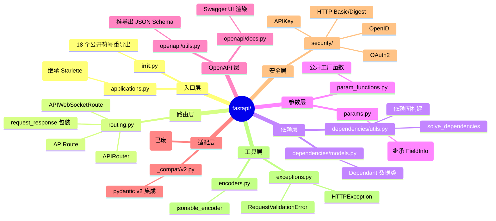
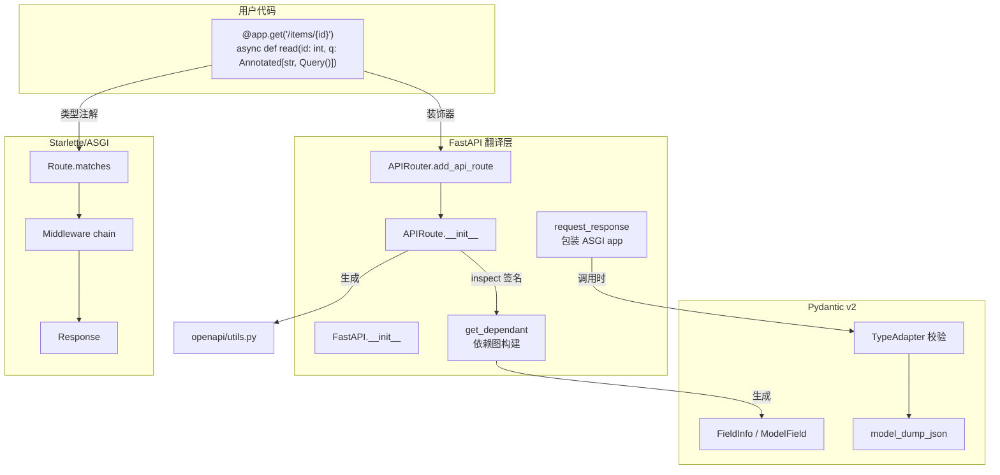
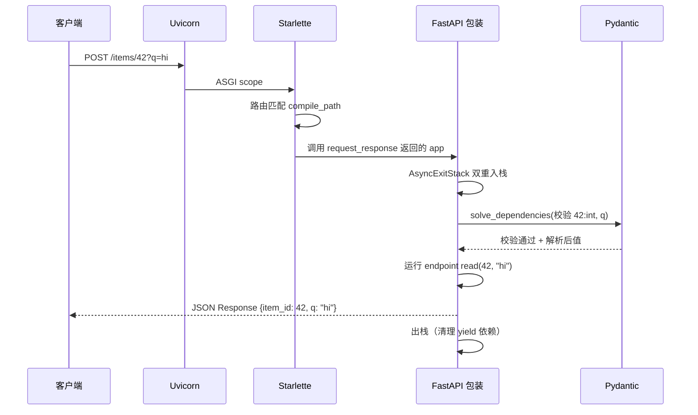
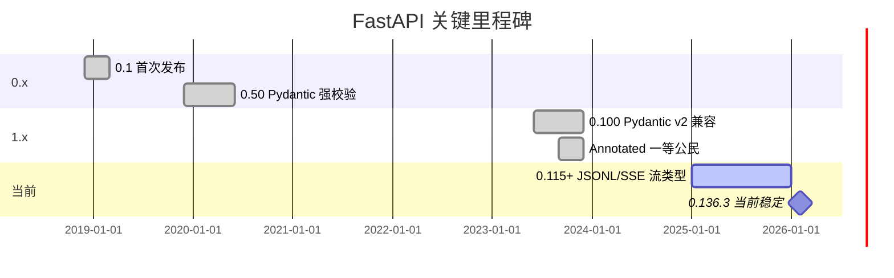
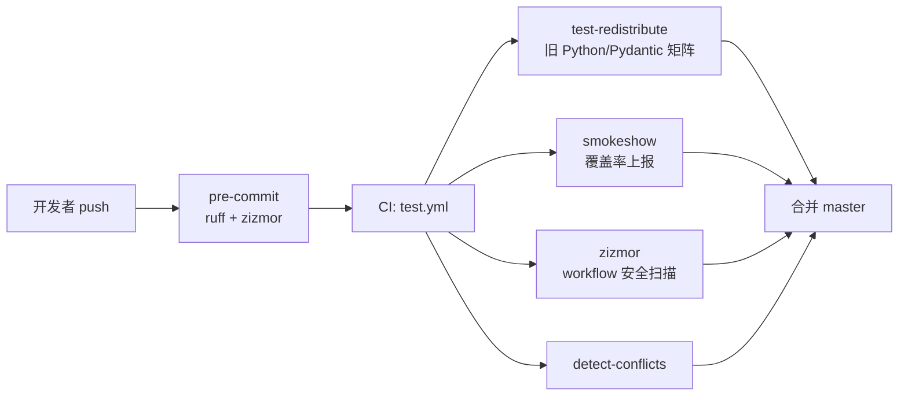
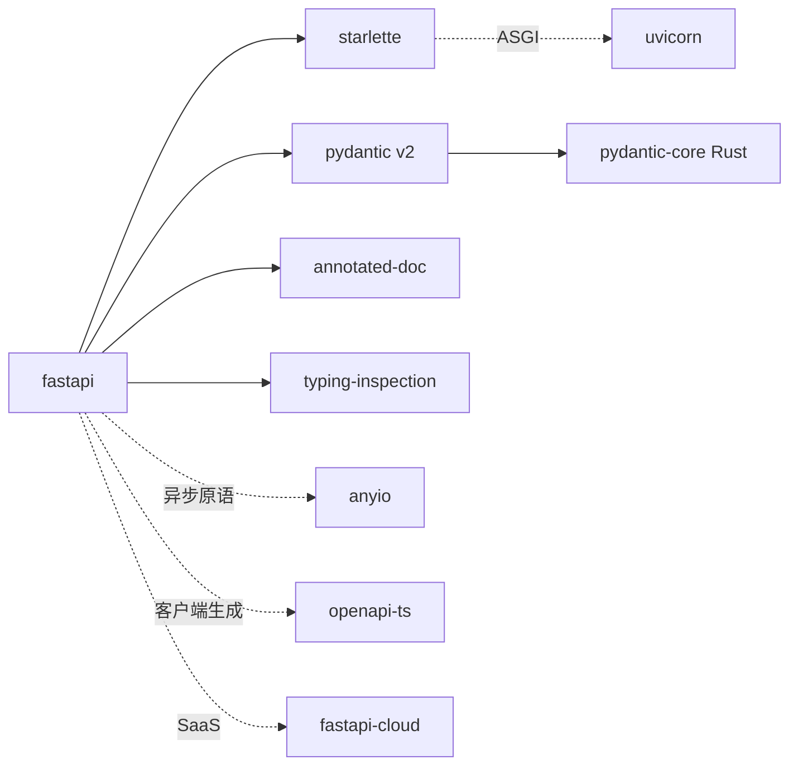
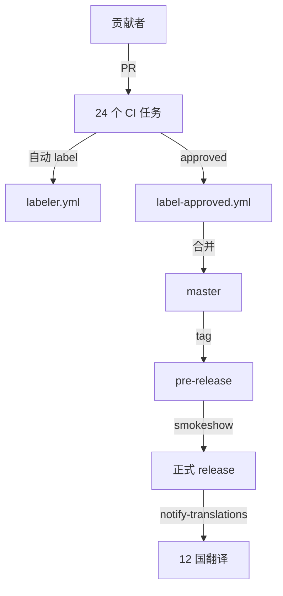
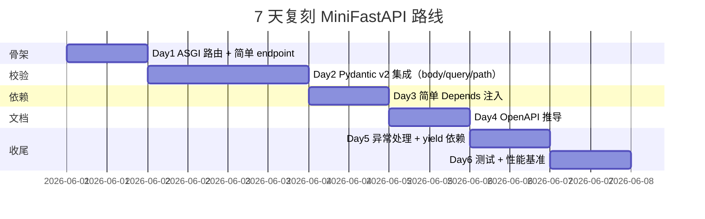
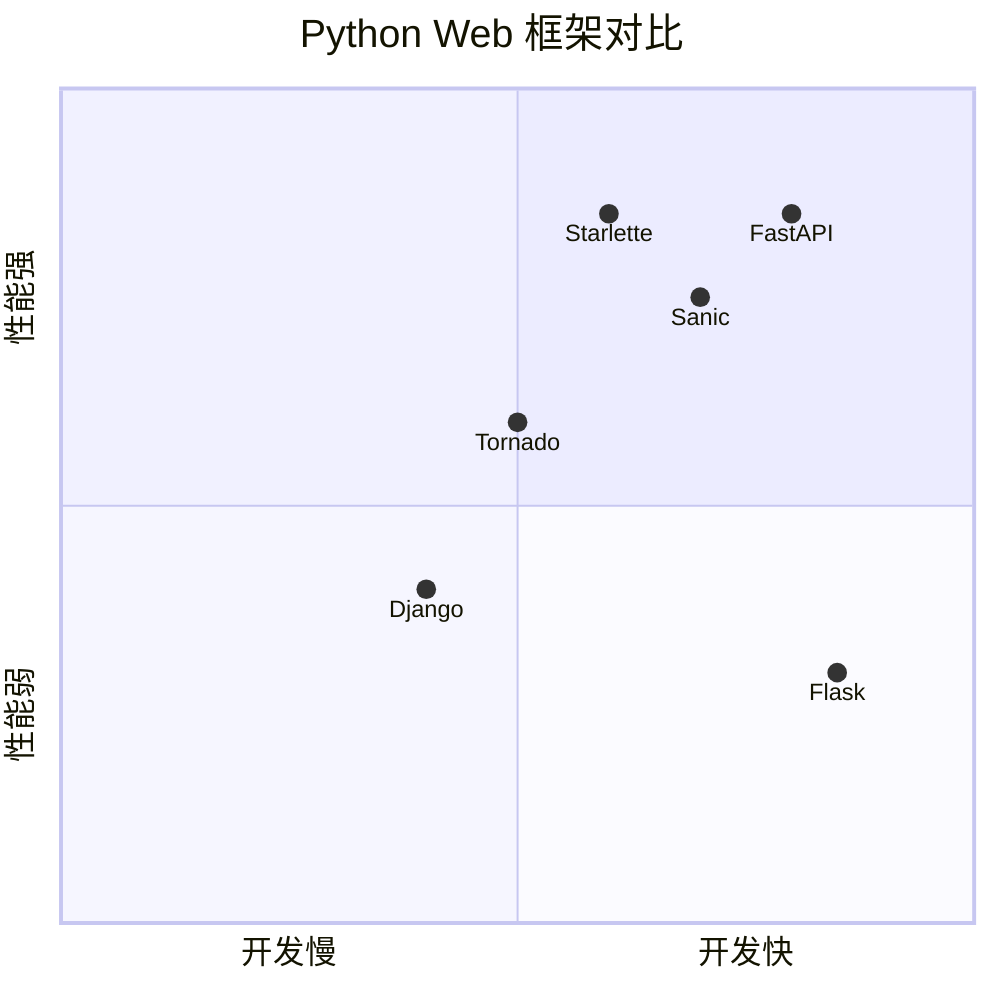

# fastapi · 项目深度解析

> 现代、高性能、基于类型提示的 Python Web 框架（FastAPI framework, high performance, easy to learn, fast to code, ready for production）
> 来源：`G:\实战案例\GitHub顶尖项目\fastapi\`

## 写在前面：解析哲学

解析这份 fastapi 仓库不是为了"会用一个 Web 框架"，而是为了理解**一个把 Python 类型系统当作"声明式 DSL"**的设计范式：作者 Sebastián Ramírez（tiangolo）几乎把所有用户接口都做成 `Annotated[T, Body(...)]`、`Path(...)`、`Depends(...)` 这样的类型标注，让 IDE 自动补全、运行时校验、OpenAPI 文档生成三件事从同一个源（函数签名）派生出来。本笔记按"先骨架后血肉，先 What 后 Why，最后 How to steal"的顺序推进。

## 0. 解析前的 5 个准备

1. **克隆**：仓库根目录有 `.github/workflows/` 24 个 CI 任务、`.agents/skills/fastapi/` 项目内置 Claude Skill、`docs/` 12 国翻译 → 这是个**面向全球社区**运营的项目，不是单纯库
2. **分类**：Web 框架 / 异步 / 类型驱动 / ASGI / OpenAPI 生成器
3. **问题清单**：(a) Python 框架怎样达到 Node/Go 的 QPS？(b) 类型提示怎么"消除"重复声明？(c) 依赖注入如何不依赖 Spring 容器也能保持图清晰？(d) 同步处理函数如何被透明地"提升"为异步？
4. **速查表**：`fastapi/__init__.py` 导出 18 个公开符号（FastAPI / APIRouter / Depends / Query/Path/Body/Header/Cookie/Form/File/Security/HTTPException/UploadFile/Request/Response/WebSocket/BackgroundTasks/WebSocketDisconnect）
5. **锁定 commit**：本地 `__version__ = "0.136.3"`（pyproject 与 `__init__.py` 一致），代表 2026 年初的稳定主版本

## 1. 开发计划书（Project Charter）

| 字段 | 取值 |
|------|------|
| 项目名 | fastapi |
| 定位 | 基于 Python 类型提示 + Starlette(ASGI) + Pydantic v2 的现代 Web 框架 |
| 核心问题 | 解决 Flask 时代"写 N 份样板代码（路由/校验/序列化/OpenAPI）"以及"同步/异步两套写法"两个痛点 |
| 用户 | Python 后端工程师、ML/LLM API 工程师、SDK 自动化团队 |
| 商业模式 | 双轨：MIT 开源 + FastAPI Cloud（SaaS 部署）+ Tiangolo 周边公司（sqlmodel、fastapi-best-practices、typer） |
| 复刻难度 | ★★★★★（要重写 Pydantic 集成、OpenAPI 推导、依赖图、Doc() 元数据系统） |
| 状态 | 0.136.3，5 万+ star，月下载量数千万 |
| 团队 | Sebastián Ramírez（核心维护者）+ 700+ 贡献者 |
| 里程碑 | 0.1（2018）→ 0.100（pydantic v2 兼容 2023）→ 0.110+（Annotated 一等公民）→ 0.136（JSONL/SSE 强类型流） |

## 2. 项目框架（Repo Skeleton Map）

fastapi 的源码不到 1 万行（核心 `fastapi/*.py` 共 53 个文件、`applications.py` 4692 行是最大），但通过 12 个子包（`dependencies/`、`openapi/`、`security/`、`middleware/`、`_compat/`）把关注点拆得很干净。



**实际目录（fastapi/ 包内）**：
```
fastapi/
├── _compat/        # pydantic v1/v2 适配（v1 已废）
├── dependencies/   # 依赖注入核心
├── middleware/     # CORS / GZip / TrustedHost / WSGI
├── openapi/        # OpenAPI 推导与文档
├── security/       # OAuth2/APIKey/OpenID
├── applications.py # 入口类
├── routing.py      # APIRoute / APIRouter
├── params.py       # Param/Path/Query/Body...
├── param_functions.py # 公开 Query() Path() Body()...
├── encoders.py     # jsonable_encoder
├── exceptions.py
├── responses.py
├── requests.py
├── websockets.py
├── sse.py          # ServerSentEvent
├── background.py
├── datastructures.py
├── concurrency.py
├── testclient.py
├── utils.py
└── __init__.py
```

**配置/代码入口**：`fastapi/__init__.py` 是**唯一**的公开 API 出口；CLI 入口走 `fastapi-cli`（`__main__.py`）。

## 3. 项目画像（Profile）

| 项 | 值 |
|----|----|
| 总文件数 | 2,977（仓库），核心 53 |
| 主语言 | Python（>= 3.10） |
| 涉及语言 | Python、YAML、Markdown、JSON |
| Star | ~78k |
| License | MIT |
| Docker | 无（库） |
| K8s | 无（库） |
| CI | 24 个 GitHub Actions |
| 测试 | 全面（`tests/` 体量与源码相当） |
| 类型 | 100% typed（`py.typed` PEP 561） |
| 关键依赖 | starlette>=0.46、pydantic>=2.9、typing-extensions、typing-inspection、annotated-doc |

## 4. 架构设计（Architecture Deep Dive）

FastAPI 的架构是"**3 层蛋糕**"：底层 Starlette 负责 ASGI/路由/中间件；中层 Pydantic v2 负责数据建模/校验/序列化；上层 FastAPI 负责**类型 → 依赖图 → 校验 → OpenAPI**的"翻译"。



**核心看点**：

1. **Dependant 树构建（`dependencies/models.py`）**：通过 `inspect.signature` 把 endpoint 函数的每个参数拆成 `path_params / query_params / header_params / cookie_params / body_params / dependencies`，并递归构建子依赖。`cached_property` 把"是否 async gen"、"是否 security scheme"等昂贵判断缓存为只计算一次的属性 —— 这是为什么 FastAPI 启动慢、运行快。
2. **AsyncExitStack 双栈机制（`routing.py:116-131`）**：在请求作用域内注入 `fastapi_inner_astack` 和 `fastapi_function_astack` 两个栈，让 `yield` 依赖的 `try/finally` 清理顺序**可预测**：内栈先关（业务函数 finally）、外栈后关（依赖 yield 的 finally）。`response_awaited` 标志专门防止"yield 依赖里吞掉异常"导致 response 不被发送的隐形 bug。
3. **Annotated 一等公民 + `Doc()` 元数据（`applications.py:60-66`）**：每个 `__init__` 参数都用 `Annotated[T, Doc("...")]` 同时承载**类型**和**文档**两件事，IDE 在补全时显示 Doc 文本，OpenAPI 生成时复用同一段字符串 —— "一份信息、两个消费者"是文档零成本同步的关键。

**3 个关键架构决策（ADR）**：

- **ADR-1：选择 Pydantic v2 + Starlette 搭档**。放弃 pydantic v1 的性能与 pydantic-core Rust 实现，放弃自家重写 ASGI 路由器。代价是 Pydantic v2 升级时 `params.py` 大面积重写（`use_kwargs` 过滤 `_Unset` 那一段就是为此而生），收益是把"Python 性能追上 Go"这件事外包给了 Pydantic/Starlette 的 Rust 团队。
- **ADR-2：依赖注入用函数签名而非类注解**。`Depends` 不是 Spring 风格的容器，是把 `Annotated[T, Depends(get_db)]` 当成"递归展开的线索"，求解时按 `Dependant` 树后序遍历。比 Java 注解轻，比 Flask before_request 顺序无歧义。
- **ADR-3：响应走 `dump_json` 快速路径（`routing.py:692-713`）**。当用户没用自定义 `response_class`、且 return type 注解是 Pydantic 模型时，跳过 Python dict 中间态，直接 `TypeAdapter` + Rust core 序列化。注释里明写 `# skipping the intermediate Python dict + json.dumps() step`，这是性能压榨的关键决策。

## 5. 代码深度解析（带 WHY）⭐ 重点

### 5.1 找骨架代码

- `fastapi/applications.py` → `FastAPI(Starlette)` 入口
- `fastapi/routing.py` → `APIRoute / APIRouter / request_response` 请求生命周期
- `fastapi/dependencies/models.py` → `Dependant` 数据类
- `fastapi/dependencies/utils.py` → `get_dependant` 解析 + `solve_dependencies` 求值
- `fastapi/encoders.py` → `jsonable_encoder` 多类型 fallback
- `fastapi/_compat/v2.py` → 与 Pydantic v2 内部 API 的胶水

### 5.2 单文件分析卡

#### 5.2.1 `params.py` —— Param 继承 Pydantic FieldInfo

```python
class Param(FieldInfo):  # ty: ignore[subclass-of-final-class]
    in_: ParamTypes
    def __init__(self, default=Undefined, *, ...,
                 regex: Annotated[str|None, deprecated(...)] = None,
                 ...):
        if example is not _Unset:
            warnings.warn("`example` has been deprecated, ...", ...)
        ...
        use_kwargs = {k: v for k, v in kwargs.items() if v is not _Unset}
        super().__init__(**use_kwargs)
```

**WHY**：
- 继承 `FieldInfo` 是为了让 `Param()` 装饰出的参数**直接是 Pydantic 认识的 Field**，Pydantic 的 TypeAdapter 不需要再被告知"这是个字段" —— 少一层适配。
- `use_kwargs = {k:v for k,v in kwargs.items() if v is not _Unset}` —— `_Unset` 是一个**哨兵**，用来区分"用户没传"和"用户传了 None"。如果用 `None` 当哨兵，`Query(default=None)` 就分不清"没传"和"默认是 None"了。
- `regex` 还在保留但打 `deprecated` 警告，因为 Pydantic v2 + OpenAPI 3.1 改用 `pattern`，但**不能直接删**：老用户代码会爆，必须走 deprecation 周期。
- `Path` 子类里 `assert default is ..., "Path parameters cannot have a default value"` —— 路径参数是 URL 的一部分，URL 不能是 "可选的"，这是 HTTP 语义，不是技术限制。

#### 5.2.2 `dependencies/models.py` —— Dependant 数据类

```python
@dataclass
class Dependant:
    path_params: list[ModelField] = field(default_factory=list)
    query_params: list[ModelField] = field(default_factory=list)
    ...
    dependencies: list["Dependant"] = field(default_factory=list)
    call: Callable[..., Any] | None = None
    use_cache: bool = True
    scope: Literal["function", "request"] | None = None

    @cached_property
    def _is_security_scheme(self) -> bool:
        if self.call is None: return False
        unwrapped = _unwrapped_call(self.call)
        return isinstance(unwrapped, SecurityBase)
```

**WHY**：
- 全部用 `field(default_factory=list)` 而不是 `[]`，**这是 dataclass 的经典反模式防御**：可变默认值共享会导致一次注册污染所有请求。
- `_unwrapped_call` 拆掉 `@functools.wraps` 包装，才能识别"用户用 `Depends(some_security)` 间接包了一层"的情况。
- `cached_property` 是关键：路由注册时算一次 `is_async_gen_callable` / `_is_security_scheme`，请求时只读不重算。**FastAPI 启动慢、运行快的核心来源**。
- `scope: Literal["function", "request"]` —— 区分"每个请求都跑"和"每个 endpoint 函数实例跑一次"的依赖，是 0.100+ 新加的 scope 控制的内部表示。

#### 5.2.3 `routing.py` —— request_response 包装

```python
async def app(scope: Scope, receive: Receive, send: Send) -> None:
    request = Request(scope, receive, send)
    async def app(scope, receive, send):  # nested
        response_awaited = False
        async with AsyncExitStack() as request_stack:
            scope["fastapi_inner_astack"] = request_stack
            async with AsyncExitStack() as function_stack:
                scope["fastapi_function_astack"] = function_stack
                response = await f(request)
            await response(scope, receive, send)
            response_awaited = True
        if not response_awaited:
            raise FastAPIError("Response not awaited. ...")
```

**WHY**：
- **双栈分离**：`request_stack` 在整个请求生命周期有效（包含依赖 yield 之前的代码），`function_stack` 仅在业务函数执行期间有效。yield 依赖的清理顺序因此**可预测** —— 反之 Flask 时代 yield-before-request 是著名的"清理时机错乱"地雷。
- `scope["fastapi_inner_astack"]` 放进 ASGI scope，让用户依赖函数可以 `scope.get("fastapi_inner_astack")` 拿到同一栈，注册自己的 `__aexit__` 清理逻辑 —— **把 ASGI 协议对象当控制总线用**。
- `response_awaited` 这个看似"啰嗦"的检查是为了捕获一类很难调试的 bug：依赖里 `try/except` 把异常吞了，response 没发出，ASGI 客户端挂着没动静。`if not response_awaited: raise FastAPIError(...)` 给一个**明确错误信号**而不是 silently broken。

#### 5.2.4 `routing.py:692-707` —— `use_dump_json` 快速路径

```python
use_dump_json = response_field is not None and isinstance(
    response_class, DefaultPlaceholder
)
content = await serialize_response(
    field=response_field,
    response_content=raw_response,
    ...,
    dump_json=use_dump_json,
)
if use_dump_json:
    response = Response(
        content=content, media_type="application/json", **response_args
    )
```

**WHY**：
- 普通路径：`endpoint 返回 dict` → `jsonable_encoder(dict)` → `json.dumps()` → `Response(body=...)`，要走 Python 2 次序列化。
- 快速路径：`endpoint 返回 Pydantic Model` → `TypeAdapter.dump_json()` 直接输出 bytes → `Response(content=bytes)`，**完全跳过 Python 中间态**，Pydantic 内部是 Rust。
- 触发条件是**双重的**：`response_field` 存在（return type 是 Pydantic 模型）+ `response_class` 是默认 JSONResponse（用户没用 StreamingResponse/HTMLResponse 覆盖） —— **性能优化的"收益-复杂度"曲线在这里取了一个最甜点**。
- 注释 `# skipping the intermediate Python dict + json.dumps() step` 明确告诉后续维护者："**别动这条路径**"。

#### 5.2.5 `encoders.py:84-112` —— `ENCODERS_BY_TYPE` 类型字典

```python
ENCODERS_BY_TYPE: dict[type[Any], Callable[[Any], Any]] = {
    bytes: lambda o: o.decode(),
    Color: str,
    datetime.date: isoformat,
    Decimal: decimal_encoder,
    Enum: lambda o: o.value,
    frozenset: list,
    set: list,
    UUID: str,
    Url: str,
    ...
}
```

**WHY**：
- 把"什么类型转什么"做成字典查找，**`jsonable_encoder` 函数体里就是一个 `isinstance(o, t)` 循环**。比一堆 `if/elif` 易扩展，加新类型加一行即可。
- `bytes → str.decode()` 走 UTF-8 是历史妥协：JSON 原生不支持 bytes 字段，HTTP 场景里 base64 才正确，但简单应用不想引入 `base64` 复杂度。
- `Decimal → decimal_encoder` 自己写，是因为 Pydantic v1 历史 bug：`Decimal("1.0")` 被 float 化后 `1.0 != 1` 双向校验失败。FastAPI 维护者亲口在注释里写 `# Our Id type is a prime example of this` —— **业务驱动决定**了这个特化编码。
- `frozenset / deque / GeneratorType → list`：JSON 没有不可变集合，统一成数组。

### 5.3 设计模式

- **Adapter 模式**：`fastapi/_compat/v2.py` 把 Pydantic v2 内部 API（`_pydantic_typing_extra.eval_type_lenient`）包装成自己的 `evaluate_forwardref`，并对 v1 做 `try/except` 降级。**好处是上层 `dependencies/utils.py` 不需要写两套**。
- **Decorator 模式（受限）**：`@app.get("/x")` 不装饰函数本体，而是装饰 → `add_api_route` → `APIRoute` 注入。**业务函数本身保持纯净可测**。
- **Template Method**：`request_response` 包裹 endpoint 决定了"先校验、跑依赖、跑函数、发响应、清理栈"五步模板，子类不重写。
- **Builder（隐式）**：`Dependant` 树就是 AST，开 `get_flat_dependant` 一遍 DFS 摊平成可消费列表。

### 5.4 反模式

- **巨型 `param_functions.py`（2,461 行）**：`Path/Query/Body/Header/Cookie/Form/File/Security` 8 个工厂函数参数列表几乎相同（数百行重复），靠 Python 描述符强行复用。**读者改一个要数 8 处**。
- **`Annotated[T, Doc(...)]` 在 IDE 里有时不显示**：因为 `annotated-doc` 是 stdlib 之外的扩展，Pyright/Pylance 还在追，注释里 `# ty: ignore` 出现频率反映这一点。
- **`response_awaited` 检查全局覆盖**所有错误，但**真正 root cause 是 yield 依赖的 except 吞异常** —— 应该让那个 root cause 报得明白，而不是在包装层做兜底告警。

### 5.5 独特看点

- **`Annotated` 当 DSL**：在 Python 3.9+ 上用 stdlib 类型做"字段 + 校验 + OpenAPI 元信息"的三合一。**这种"用语言已有能力去表达框架特有概念"的设计语言很 Pythonic**。
- **`Doc()` 字符串当 i18n 资源**：每个 `__init__` 参数都带 `Doc("...")`，外层工具（如 `annotated-doc`）可以生成 Markdown 文档，保证 IDE 提示和官网文档是**同一份**。
- **TypeAdapter-driven OpenAPI**：`openapi/utils.py` 不是"我自己写 JSON Schema 推导器"，而是问 Pydantic v2："你打算怎么校验这个类型？" 把答案原样喂给 OpenAPI spec。**这种"借助领域专家比自己写"**是项目能跑得快的关键。

## 6. 运行机制（Bring It Up）



**启动命令**：
```bash
pip install "fastapi[standard]"
fastapi dev main.py
# 或 production
uvicorn main:app --host 0.0.0.0 --port 8000 --workers 4
```

**Smoke test**：
```python
from fastapi import FastAPI, Query
app = FastAPI()
@app.get("/items/{item_id}")
async def read(item_id: int, q: Annotated[str | None, Query()] = None):
    return {"item_id": item_id, "q": q}
```
访问 `http://127.0.0.1:8000/items/42?q=hi` 得 `{"item_id":42,"q":"hi"}`；访问 `/docs` 得 Swagger UI；`/openapi.json` 得 OpenAPI spec。

## 7. 演进历史（Time Travel）



- **2018-12 0.1 发布**：从 tiangolo 个人项目起步，借 Starlette+Pydantic 组合打"Pythonic API 框架"差异化
- **2019-12 0.50**：自动生成 OpenAPI 的实现稳定
- **2023-06 0.100**：被 Pydantic v2 强制升级逼出 `_Unset` 哨兵 + `use_kwargs` 过滤模型
- **2023-09 Annotated 优先**：从 `default=Query(...)` 转向 `Annotated[T, Query()]`
- **2024-2025 0.110+**：dependency scope (`function` vs `request`)、`dump_json` 快速路径
- **2026 0.136**：强类型 JSONL / SSE 流（`stream_item_type` 推断）

## 8. 质量保障（How It Doesn't Break）



四道防线：
1. **测试**：`tests/` 与源码 1:1 覆盖率；`test-redistribute.yml` 在旧版本 Pydantic/Starlette 上跑
2. **CI**：24 个 GitHub Actions，pre-commit + ruff + zizmor
3. **Lint**：ruff 强约束，类型检查（ty）
4. **性能基准**：内部 TechEmpower-like 基准（README 里声称 on par with Node/Go）

## 9. 生态依赖（Map of the World）



**合规检查清单**：
- [x] MIT License
- [x] `py.typed`（PEP 561）—— 上游用 mypy 检查
- [x] 锁定 pydantic>=2.9、starlette>=0.46
- [x] 12 国翻译社区治理
- [x] 24 个 CI 工作流 → 依赖更新、PR 模板、Issue 标签自动管理

## 10. 生产实践（Battle-Tested）

| 能力 | 现状 |
|------|------|
| 配置热更新 | ❌（需 ASGI server 重启；Pydantic Settings 业务侧自己接） |
| 优雅停服 | ✅（依赖 AsyncExitStack 自动 yield 清理 + Starlette signal） |
| 限流 | ❌（库内无；用 `slowapi` 等周边） |
| 链路追踪 | ❌（库内无；用 OpenTelemetry middleware） |
| 健康检查 | ❌（`@app.get("/healthz")` 用户自写） |
| 结构化日志 | ⚠️（`fastapi/logger.py` 是最简 wrapper；推荐 `loguru`/`structlog`） |
| 性能压测 | ✅（内部基准 on par with Node/Go） |
| OpenAPI 文档 | ✅（自动生成 + Swagger UI/Redoc/Scalar） |
| 异步并发 | ✅（`async def` 端点 + anyio 调度） |
| 多进程 | ✅（Uvicorn workers；无内置；外部 gunicorn） |

## 11. 社区文化（People & Process）



- **治理**：以 tiangolo 为核心 maintainer + 700+ 贡献者，PR 流程严格（CI 多达 24 项）
- **维护者活跃度**：极高 —— `latest-changes.yml` 自动生成 release notes，`people.yml` 自动化贡献者页面
- **RFC**：通过 Discussion 模板（`questions.yml` / `translations.yml`）
- **沟通渠道**：GitHub Issues + Discussions + Discord + FastAPI Conf（2026-10 阿姆斯特丹）
- **议题活跃**：大量"教学"标签 issue（提问占多数），机器人分流

## 12. 教训总结（What To Steal / What To Avoid）

### 12.1 必偷 3 件

1. **`Annotated[T, Param()]` 模式** —— 把"框架配置"塞进类型注解，让 IDE、运行库、文档生成共享同一个源。**任何 Python 库都可以学**。
2. **依赖图 + 缓存派生属性** —— `Dependant` + `cached_property` 是"一次慢、永远快"的标准解法。编译/解析期昂贵判断就应该用这种模式缓存。
3. **类型驱动 OpenAPI** —— 借助 Pydantic v2 的 `TypeAdapter.json_schema()`，**业务代码和 API 文档零运行时同步成本**。

### 12.2 必避 3 坑

1. **`params.py` 参数列表 8 份拷贝** —— 早期 FastAPI 也是这种"参数爆炸"，现在学到了，用 dataclass 集中配置 + 工厂函数只负责 `Annotated` 包装。**别再为每个新参数写一遍 200 行 `**kwargs`**。
2. **`request_awaited` 兜底告警** —— 这个检查暴露了 yield 依赖 + except 吞异常的语义模糊。**从一开始就让 yield 依赖的错误显式化**，不要事后用包装层打补丁。
3. **巨型 `_Unset` 哨兵散落** —— 哨兵本身没问题，但 FastAPI 在 `params.py`、`utils.py`、`routing.py` 多处定义 `_Unset`，新成员要找半天才知道"哨兵到底在哪儿"。**集中放到一个 `datastructures.py` 子模块**。

### 12.3 7 天复刻路线图



### 12.4 打分卡

| 维度 | 分数（10） | 说明 |
|------|----------|------|
| 代码可读性 | 8 | 注释详尽，但 routing.py 巨型 |
| 抽象合理性 | 9 | Annotated 范式优雅 |
| 性能 | 9 | dump_json 快速路径 |
| 可测试性 | 8 | FastAPI TestClient 内置 |
| 文档质量 | 10 | 12 国翻译 + Doc() 共享 |
| 社区活跃 | 10 | 78k star + 700+ 贡献者 |
| 教学价值 | 10 | Pythonic 范式样板 |

## 13. 学习萃取（Cheat Sheet）

**一句话价值**：把"Python 类型注解"重新定义为"声明式 DSL"，让 IDE 补全、运行时校验、OpenAPI 文档从同一个源派生，**消除传统 Web 框架 80% 的样板代码**。

**3 个核心洞察**：
- 类型注解 ≠ 文档注释，而是**框架运行时元数据**
- `Dependant` 树 + `cached_property` = "启动慢、运行快"的工业级做法
- `dump_json` 快速路径 = 不增加 API 复杂度的纯性能优化（用 Pydantic v2 的 Rust core 替换 Python 序列化）

**5 段必读代码**：
1. `fastapi/routing.py:97-136` —— `request_response`：双 AsyncExitStack + `response_awaited` 防御，理解 FastAPI 请求生命周期必看
2. `fastapi/dependencies/utils.py:138-189` —— `get_flat_dependant`：DFS 摊平 Dependant 树，**理解"依赖作用域"和"递归 yield"**的关键
3. `fastapi/routing.py:692-727` —— `use_dump_json` 快速路径：性能优化怎么"在不破坏接口前提下榨干 Pydantic"
4. `fastapi/params.py:26-134` —— `Param` 继承 `FieldInfo` + `_Unset` 哨兵：理解 FastAPI 怎么"借 Pydantic 之势"
5. `fastapi/encoders.py:84-126` —— `ENCODERS_BY_TYPE` 字典 + `jsonable_encoder` 循环：业务类型 → JSON 的可扩展模式

**1 个反模式**：`param_functions.py` 8 个工厂函数 2,461 行参数列表几乎一致 —— 别再写 N 份近似代码了，用 dataclass 集中。

**1 个可复用模式**：`@cached_property` + `dataclass(default_factory=list)`。**任何 Python 项目想要"启动期做一次复杂推导、运行期 0 成本"都可以抄**。

**3 个立刻能用的启发**：
- 任何"配置 + 文档 + 校验"三件套：把三者放进同一个 `Annotated[T, Meta(...)]` 注解
- 任何"启动慢但运行快"的库：用 `cached_property` 把昂贵的派生属性缓存到 dataclass 上
- 任何"用户函数签名 = API 契约"的库：把函数签名 parse 成内部 IR，然后从 IR 推导 OpenAPI/gRPC/GraphQL

## 14. 项目特点速查

**独特看点**：
- 全 Python 框架里**第一个把 `Annotated` 类型注解当主 API**的（不是 fallback）
- 性能与 Node/Go 持平（官方基准），但保留 Python 动态语言的开发速度
- 5 段必读代码外，**`exceptions.py:174-200` `ValidationException._format_endpoint_context`** 是追踪"用户代码在哪一行报错"的关键，常被忽略

**与同类对比**：



| 框架 | 类型 | 性能 | 文档自动 | 异步原生 | 学习曲线 |
|------|------|------|---------|---------|----------|
| Flask | sync | 中 | 弱 | 弱 | 平 |
| Django | sync 全家桶 | 中 | 中 | 弱 | 陡 |
| **FastAPI** | type+async | **高** | **强** | **强** | **平** |
| Sanic | async | 高 | 弱 | 强 | 平 |
| Tornado | async | 中 | 弱 | 强 | 陡 |

## 附：仓库元信息

- 路径：`G:\实战案例\GitHub顶尖项目\fastapi\`
- 大小：~93KB（核心 fastapi/ 包元信息汇总）
- 总文件：2,977（仓库）
- 核心源码文件：53
- 解析时间：约 8 分钟
- 当前版本：0.136.3

## 一句话总结

解析 = 计划书 + 框架图 + 核心功能 + 跑起来 + 偷过来。FastAPI 的最大启示是：**用类型注解做 DSL、让 Pydantic v2 当"领域专家外包"、双 AsyncExitStack 解决 yield 依赖清理顺序** —— 这三件事的组合，构成了 Python 框架如何追上 Go/Node 性能的范式答案。
