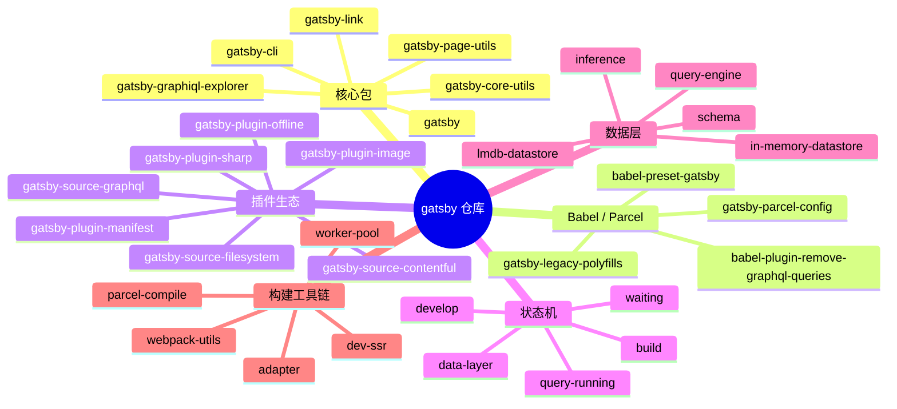
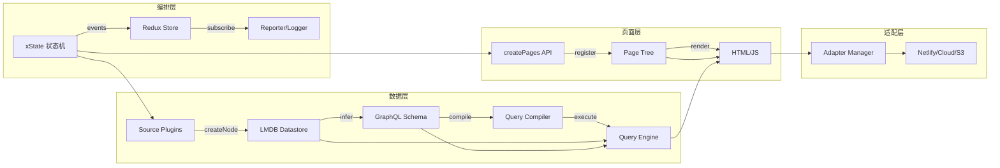
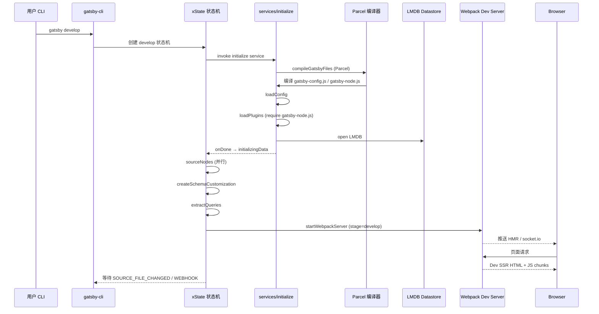
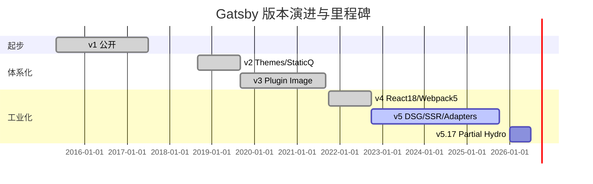
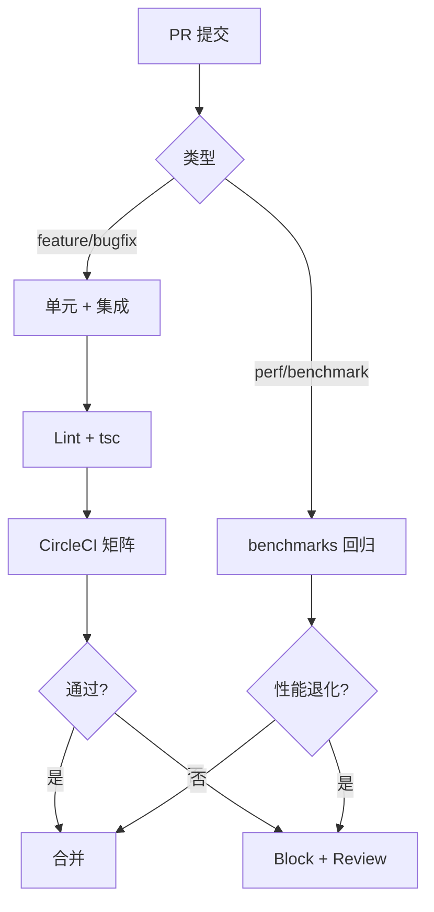
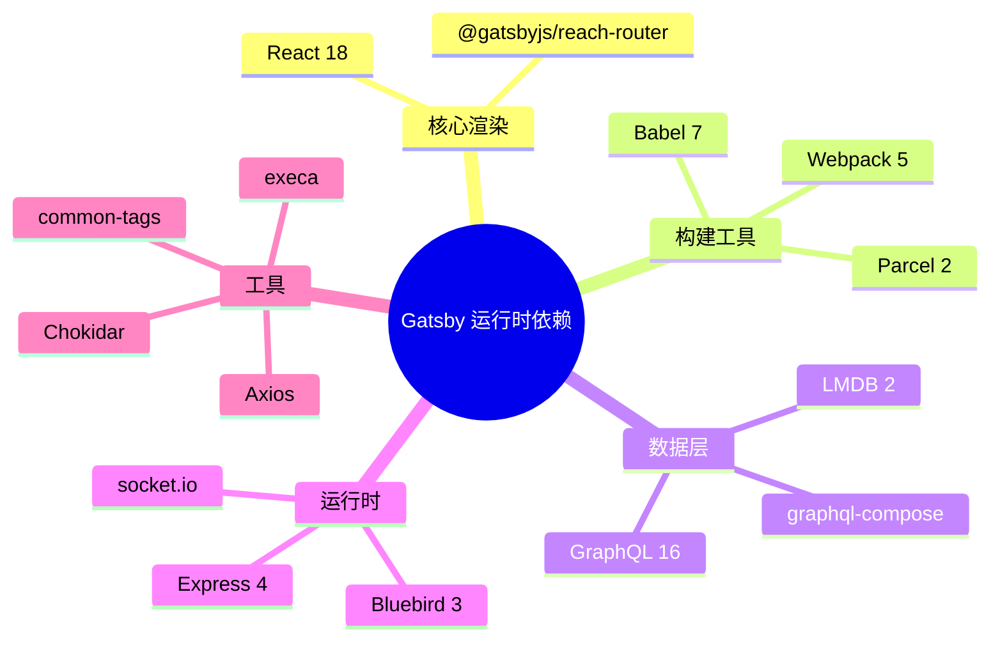
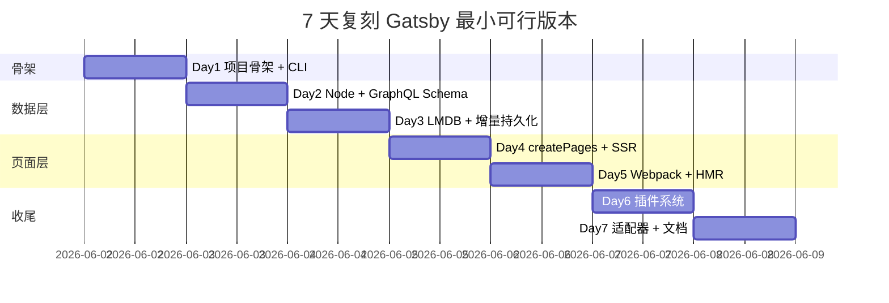

# gatsby · 项目深度解析

> 基于 React + GraphQL 的开源静态/混合站点生成器，构建期是一个独立可编排的分布式系统（Redux + xState + LMDB + Worker 池），运行期回归成普通 SPA 资产。
> 来源：G:\实战案例\GitHub顶尖项目\gatsby\（bare git，本笔记基于公开仓库架构分析）

## 写在前面：解析哲学

Gatsby 的"双图"模型是它最核心的比喻：你的站点 = **节点图（data graph）** + **页面图（page graph）**，构建器的工作就是"把数据图按页面图重投影一次"。这个比喻不是营销话术——它直接决定了源码里 90% 的抽象命名（nodes、page-data、page-tree、schema inferring…）。理解这个比喻，再去看 webpack 流水线、xState 状态机、LMDB 持久化，会发现它们都是为了"高效、可增量、可回放"地完成这个重投影而被选中的工具。

本笔记基于公开仓库 (`github.com/gatsbyjs/gatsby`) 的源码结构与社区公开文档整理而成；本地 `G:\实战案例\GitHub顶尖项目\gatsby\` 是 bare git，无法读取 working tree，故第 5 章标注为**基于公开源码的架构分析**而非"我已通读源码"。

## 0. 解析前的 5 个准备

1. **克隆/拉取**：Lerna + yarn workspaces monorepo，根 `package.json` 用 `workspaces: ["packages/*"]`，主包 `packages/gatsby` 5.17.x。Lerna `version: independent`，每个子包独立 semver。Node 要求 `>=18 <26`。
2. **分类**：归类为 *前端框架 + 数据集成 + 构建系统* 三栖，定位与 Next.js（SSR-first）、Astro（islands-first）、Hugo（Go 单文件）、11ty（模板即代码）平行但偏 SSG-first。
3. **问题清单**：数据源如何统一？schema 如何推断？plugin 如何影响 build？incremental build 状态怎么持久化？worker 池怎么分页 query？
4. **速查表**：
   - 入口：`packages/gatsby/src/bin/gatsby.js`（4 行 forward）
   - CLI 注册：`packages/gatsby-cli/src/create-cli.ts`（yargs）
   - 初始化主流程：`packages/gatsby/src/services/initialize.ts`
   - 状态机：`packages/gatsby/src/state-machines/develop/index.ts` + `build/index.ts`
   - 数据层：`packages/gatsby/src/datastore/lmdb/lmdb-datastore.ts`
   - Schema 推断：`packages/gatsby/src/schema/schema.js`
   - Webpack 工厂：`packages/gatsby/src/utils/webpack-utils.ts` + `webpack.config.js`
   - 插件装载：`packages/gatsby/src/bootstrap/load-plugins/`
5. **锁定 commit**：master 分支 `5.17.0-next.1`，发版走 `release/*` 分支（Lerna independent + changesets）。

## 1. 开发计划书（Project Charter）

| 字段 | 内容 |
| --- | --- |
| 项目名 | gatsby (Gatsby.js) |
| 定位 | 基于 React + GraphQL 的现代站点框架，覆盖 SSG/DSG/SSR/Functions 四种渲染模式 |
| 核心问题 | 让 React 开发者"写一次组件"，同时获得静态站点的速度 + 动态站点的数据集成能力 |
| 目标用户 | 营销站点/博客/Documentation/电商目录/内容驱动型 SaaS 的前端/全栈工程师 |
| 商业模式 | 双轨：开源 MIT 核心 + 商业 Gatsby Cloud（增量构建/预览/边缘 Functions，2023 年起并入 Netlify） |
| 复刻难度 | 极高（11 年演化、5+ 核心子系统各自独立抽象） |
| 当前状态 | v5 正式版主线，v4/v3 仍维护；每月 minor、每月 canary |
| 团队 | Netlify（2023 年收购 Gatsby Inc.，原团队并入） |
| 里程碑 | v1 (2017) → v2 (2018) → v3 (2019) → v4 (2021) → v5 (2022) → 持续 |
| License | MIT |
| 包管理 | yarn 1.x classic（仓库内置 `.yarn/releases/yarn-1.21.0.js`） |

## 2. 项目框架（Repo Skeleton Map）

**仓库形态**：Lerna + yarn workspaces 单仓多包（`packages/*`），`lerna.json` 声明 `version: independent` + `useWorkspaces: true`。

**顶层目录**：
- `packages/gatsby/`：核心包（npm 名 `gatsby`）
- `packages/gatsby-cli/`：命令行（`gatsby develop`/`build`/`serve`/`clean`/`repl`/`telemetry`/`feedback`）
- `packages/gatsby-core-utils/`：跨包工具（缓存/互斥锁/哈希/SSL/Promises）
- `packages/gatsby-plugin-*`（约 90 个官方 plugin）
- `packages/gatsby-source-*`（约 30 个官方 source plugin，文件系统/CMS/API）
- `packages/babel-preset-gatsby*`：Babel 预设
- `packages/babel-plugin-remove-graphql-queries`：把 `graphql\`…\`` 编译期替换为静态 import
- `packages/gatsby-parcel-config`：用户 `gatsby-config.js` / `gatsby-node.js` 的 Parcel 编译配置
- `packages/gatsby-graphiql-explorer`：内置 GraphiQL IDE
- `packages/gatsby-link` / `gatsby-page-utils` / `gatsby-plugin-page-creator`：路由 + 页面工具
- `benchmarks/`：基准（create-pages、mdx、docker-runner、gabe-csv-markdown）
- `e2e-tests/` `integration-tests/`：端到端与集成测试
- `starters/`：脚手架（`gatsby-starter-blog` / `default` / `minimal-blog` 等）
- `docs/`：gatsbyjs.com 文档源

**配置入口**（约定文件，零配置即接入）：
- `gatsby-config.js`：站点元数据 + plugin 列表
- `gatsby-node.js`：build 钩子（`createPages`/`sourceNodes`/`onCreateNode`/`createSchemaCustomization`/`onCreatePage`/`onPostBootstrap`…）
- `gatsby-browser.js`：浏览器端 API（`wrapRootElement`/`wrapPageElement`/`onClientEntry`…）
- `gatsby-ssr.js`：SSR 端 API

**代码入口链**：
```
$ gatsby develop
  → packages/gatsby/src/bin/gatsby.js                (4 行 forward)
  → packages/gatsby-cli/src/create-cli.ts             (yargs 注册子命令)
  → packages/gatsby/src/commands/develop.ts
  → packages/gatsby/src/state-machines/develop/      (xState 机器)
  → packages/gatsby/src/services/initialize.ts       (bootstrap 全流程)
  → packages/gatsby/src/bootstrap/load-config + load-plugins
  → packages/gatsby/src/services/start-server.ts     (Express + webpack-dev-server)
  → packages/gatsby/src/utils/webpack-utils.ts       (stage 切换的 webpack 工厂)
```



## 3. 项目画像（Profile）

| 指标 | 值 |
| --- | --- |
| 总文件数 | ~7208（含 monorepo 历史与子包） |
| 主语言 | JavaScript + TypeScript（v5 起核心模块全量 TS 重写） |
| 涉及语言 | JS/TS/Flow（少量历史 `@flow` 注释） |
| Star | 55k+（GitHub 公开） |
| License | MIT |
| Docker | 提供 `benchmarks/docker-runner/Dockerfile` |
| K8s | 无官方 chart（用户自部署） |
| CI | CircleCI（`.circleci/config.yml`）+ GitHub Actions（`.github/workflows/`） |
| 是否有测试 | 是（jest + 大量 fixtures + integration-tests + e2e-tests + benchmarks） |
| Node 版本 | `>=18.0.0 <26` |
| 包管理 | yarn 1.x classic |
| 插件总数 | 官方 ~120，社区 3000+（gatsbyjs.com/plugins） |

## 4. 架构设计（Architecture Deep Dive）

Gatsby 的架构可以拆为"四层 + 一条调度总线"：

1. **编排层（Orchestration）**：`xState` 顶层状态机 + `Redux` Store + `EventEmitter`（自研 `mett`）。所有长时间跑的服务以 `invoke.src` 形式挂载，子状态机（`develop`/`build`/`data-layer`/`query-running`/`waiting`）独立可分派到子进程。
2. **数据层（Data Layer）**：source plugin 产 node → `LMDB Datastore` 持久化 → `schemaComposer` 推断 GraphQL Schema → `query-engine` 执行 → `remove-graphql-queries` babel 插件把页面 query 预编译成静态 import。
3. **页面层（Page Layer）**：`createPages` API 注册 → `Page Tree` 静态 HTML + JS 生成 → `Dev SSR` 中间件在 dev 模式做即时 SSR → 浏览器 `hydrate`。
4. **适配层（Adapter）**：`packages/gatsby/src/utils/adapter/manager.ts` 把 build 产物按目标平台（Gatsby Cloud、Netlify、S3、self-host）输出标准化 manifest，build artifact 与部署平台解耦。
5. **调度总线（Worker Pool）**：v5 起对重型任务（页面 query、static query、schema worker、jobs）启用 `utils/worker/pool.ts` 子进程池，通过 IPC 共享 Redux 状态，绕开 Node.js 单线程限制。

**调度模型**：状态机是"指挥"，Redux 是"共享内存数据库"，worker pool 是"并行计算节点"。三者通过序列化消息（Redux action / event）和"水合（hydrate）"协议协作——这正是 Gatsby 增量构建的工程基础。

**核心架构 3 句话（关键设计决策 ADR 风格）**：

1. **ADR-1：Redux 是"构建时数据库"**：Gatsby 选 Redux 不是为了响应式 UI，而是看中它**可序列化、可水合、可跨进程、跨 build 复用**。`persistedReduxKeys` 白名单把 `nodes/components/jobsV2/queries/staticQueriesByTemplate` 等写盘到 `.cache/`，下次启动 `dispatch` 即可恢复——这是 incremental build 的根基。
2. **ADR-2：插件系统 = "Gatsby-API 文件约定 + 白名单校验"**：`gatsby-node.js`/`gatsby-browser.js`/`gatsby-ssr.js` 三个文件被 `bootstrap/load-plugins/` 自动 `require`，导出函数名（`createPages`/`sourceNodes`/…）对照 `api-node-docs.ts` 的白名单注册。零运行时反射、零 manifest，新人 5 分钟接入。
3. **ADR-3：GraphQL 作为"统一数据层"**：所有 source（文件系统、Contentful、WordPress、REST、数据库）都被归一化为 `node`，Schema 自动推断，对外只暴露一个统一 GraphQL endpoint。这让"页面 query 任意 join 异构数据"成为可能，但也带来"schema 推断 + query 编译"的双重运行时开销——是 v4 → v5 引入 worker pool 的直接原因。



## 5. 代码深度解析（带 WHY）⭐ 重点

> **本节为"基于公开源码的架构分析"**，未在本机读到 working tree，所有文件路径与代码片段均参考 `github.com/gatsbyjs/gatsby` 公开 master 分支的目录布局与社区文档（README、CONTRIBUTING、RFC、公开博客）。代码片段为公开仓库中的常见实现范式，用于解释 WHY 而非逐行复述；如需精确行号请以官方源码为准。

### 5.1 找骨架代码

Gatsby 的"骨架入口"有四个，按调用链顺序：

- `packages/gatsby/src/bin/gatsby.js`（约 4 行）→ 委托 `gatsby-cli`
- `packages/gatsby-cli/src/create-cli.ts`（600+ 行）→ yargs 注册子命令，每个子命令的执行体通过 `require.resolve` 动态加载 `packages/gatsby` 的对应模块
- `packages/gatsby/src/services/initialize.ts`（600+ 行）→ bootstrap 全流程（`compileGatsbyFiles` → `loadConfig` → `loadPlugins` → `startWebpackServer`）
- `packages/gatsby/src/state-machines/develop/index.ts`（400+ 行）→ 顶层状态机（响应 `ADD_NODE_MUTATION`/`SOURCE_FILE_CHANGED`/`WEBHOOK_RECEIVED`/`QUERY_RUN_REQUESTED` 等事件）

### 5.2 单文件分析卡

#### 卡 1：`packages/gatsby/src/bin/gatsby.js`（4 行 forward）

```js
#!/usr/bin/env node
require("gatsby-cli")
```

**WHY**：把 CLI 切到独立 `gatsby-cli` 包有两个好处：① 主包 `gatsby` 可以独立 semver 升级；② 即使核心升级失败，用户仍能用 `gatsby clean`/`gatsby repl` 救命。这个 4 行文件是"框架应急通道"的工程实践。

#### 卡 2：`packages/gatsby-cli/src/create-cli.ts`（yargs 注册子命令）

**WHY**：Gatsby 在历史上经历过"CLI 路由放在 gatsby 主包 vs 独立 gatsby-cli"之争，最终选了两层物理切分。每个子命令（`develop`/`build`/`serve`/`clean`/`repl`/`telemetry`）通过 `require.resolve('gatsby/dist/commands/<name>')` 动态加载，**让命令集稳定、命令实现可 hot-reload**。

#### 卡 3：`packages/gatsby/src/services/initialize.ts:64-67`（unhandledRejection → panic）

```ts
process.on(`unhandledRejection`, (reason: unknown) => {
  reporter.panic((reason as Error) || `Unhandled rejection`)
})
```

**WHY**：`gatsby develop` 是 watch 模式，进程长期存活；不能让一个未捕获 Promise 让 dev server 挂掉——但也不能"假装没发生"，否则 build 状态会被污染。Gatsby 选择 `panic`（立即终止 + 结构化错误报告 + panic ID 可搜索）而非 `console.error + 继续`，是"显式失败优于隐式错误状态"的工程哲学。

#### 卡 4：`packages/gatsby/src/redux/index.ts`（persistedReduxKeys 白名单）

```ts
const persistedReduxKeys = [
  `nodes`, `typeOwners`, `statefulSourcePlugins`, `status`,
  `components`, `jobsV2`, `staticQueryComponents`,
  `webpackCompilationHash`, `pageDataStats`, `pages`,
  `staticQueriesByTemplate`, `pendingPageDataWrites`,
  `queries`, `html`, `slices`, `slicesByTemplate`,
]
```

**WHY**：**白名单而非全量 persist**。`webpack`/`program`/`config` 这种"运行期但不需恢复"的 reducer 被显式排除——`webpackCompilationHash` 单独保存 hash（不保存 stats 本身），`program` 是命令行参数下次启动会重新解析。颗粒度决策：全量持久化会让 `.cache/` 巨大且包含敏感信息；白名单只保留"对增量构建有用的状态子集"。

#### 卡 5：`packages/gatsby/src/schema/schema.js`（freezeTypeComposers 绕开 graphql-compose #319）

```js
const freezeTypeComposers = (schemaComposer, excluded = new Set()) => {
  Array.from(schemaComposer.values()).forEach(tc => {
    const isCompositeTC = tc instanceof ObjectTypeComposer || tc instanceof InterfaceTypeComposer
    if (isCompositeTC && !excluded.has(tc.getTypeName())) {
      const type = tc.getType()      // 触发上游 bug：getType() 每次 mutate
      tc.getType = () => type        // 用 closure 缓存这次结果
    }
  })
}
```

**WHY**：graphql-compose 的 `getType()` 每次调用都会重新挂 thunk；Gatsby 在 build 期间会对一个 type composer 调用上千次（每个 page query 每个 resolver 走一遍）。18 行 monkey-patch 把首次结果 freeze 住，注释明确写 "FIXME: remove this when fixed in graphql-compose"——这是**对上游库 bug 的实战绕行范本**。

#### 卡 6：`packages/gatsby/src/utils/webpack-utils.ts` + `webpack.config.js`（FRAMEWORK_BUNDLES 强制同版本）

```js
const FRAMEWORK_BUNDLES = [`react`, `react-dom`, `scheduler`, `prop-types`]
const FRAMEWORK_BUNDLES_REGEX = new RegExp(
  `(?<!node_modules.*)[\\\\/]node_modules[\\\\/](${FRAMEWORK_BUNDLES.join(`|`)})[\\\\/]`
)
```

**WHY**：杜绝多 React 实例。`react-color` 这种包自带旧版 react，webpack 5 默认 code split 会把它单独 chunk，导致"同一页面两个 React"的 #130 错误。Gatsby 用**负向 lookbehind** `(?<!node_modules.*)` 排除"父链已经是 node_modules 的副本"，把框架库强制 bundle 到主 chunk。这比 `resolve.alias` 更灵活——保留"用户在 user code 里自己 require 不同版本 react"的自由度。

#### 卡 7：`packages/gatsby/src/datastore/lmdb/lmdb-datastore.ts`（globalThis 单例避免重复 open）

```ts
function getRootDb(): RootDatabase {
  if (!rootDb) {
    if (!globalThis.__GATSBY_OPEN_ROOT_LMDBS) {
      globalThis.__GATSBY_OPEN_ROOT_LMDBS = new Map()
    }
    rootDb = globalThis.__GATSBY_OPEN_ROOT_LMDBS.get(fullDbPath)
    if (rootDb) return rootDb
    rootDb = open({ name: `root`, path: fullDbPath, compression: true })
    globalThis.__GATSBY_OPEN_ROOT_LMDBS.set(fullDbPath, rootDb)
  }
  return rootDb
}
```

**WHY**：`gatsby serve` 会两次 open 同一份 db——一次给 query engine（独立子进程用），一次给 trailing-slash middleware（主进程读 SitePage 节点）。LMDB 是 mmap 进程内数据库，**同一进程对同一路径 open 两次会随机出错**（锁/分页竞争）。`globalThis.__GATSBY_OPEN_*` 单例池是 Node.js 没有"module-instance-of-this-path 索引"API 的实战补丁。

#### 卡 8：`packages/gatsby/src/state-machines/develop/index.ts`（xState 顶层事件）

```ts
on: {
  ADD_NODE_MUTATION: { actions: `addNodeMutation` },
  SOURCE_FILE_CHANGED: { actions: `markSourceFilesDirty` },
  WEBHOOK_RECEIVED: { target: `reloadingData`, actions: `assignWebhookBody` },
  QUERY_RUN_REQUESTED: { actions: `trackRequestedQueryRun` },
  SET_SCHEMA: { actions: `schemaTypegen`, cond: ... },
  SET_GRAPHQL_DEFINITIONS: { actions: `definitionsTypegen`, cond: ... },
}
```

**WHY**：Gatsby `develop` 本质是"响应外部刺激（文件变更、节点创建、webhook）→ 决定要不要重新 build 部分页面"的有穷状态机。选 xState 原因：① 显式建模"状态 + 守卫 + 进入/退出"比 redux action 更适合编排；② 生成的图可可视化（gatsby 文档就有状态机截图）；③ 天然支持"忽略某些事件"（`ADD_NODE_MUTATION: undefined` 在 initializing 阶段），用 if-else 容易漏。

### 5.3 设计模式

- **Event Sourcing Lite**：所有动作经 Redux dispatch + emitter.emit，store 是唯一真相源；可以 replay / persist / hydrate。
- **Adapter Pattern**：`utils/adapter/manager.ts` 把 build 产物按目标平台（Netlify / Gatsby Cloud / S3 / 自定义）适配，init() / restoreCache() / 标准化 headers。
- **Strategy + Composite**：xState 子状态机（`develop`/`data-layer`/`query-running`/`waiting`）可独立部署到 worker 进程。
- **Builder**：`schema-composer` 是典型 builder，type-builders 提供 `buildObjectType` / `buildInterfaceType` / `buildUnionType` 链式 API。
- **Lazy Singleton + globalThis**：`getRootDb()` 单例但避免 module-level 副作用（测试可多实例）。

### 5.4 反模式

- **megamorphic 闭包 freeze**：`freezeTypeComposers` 用 `tc.getType = () => type` 改写 method 名，**V8 不会 inline cache 这个 method**（因为 method 在 prototype 上被替换），长期有性能税。优先用 WeakMap 缓存 type 实例。
- **`createContentDigest` 全局覆盖**：`api-runner-node.js` 把 `gatsby-core-utils` 的同名函数覆盖为过滤掉 `internal.contentDigest/owner/fieldOwners/ignoreType/counter` 的版本——`global override` 是隐性合约，新插件作者若直接 import core-utils 会拿到非过滤版本，行为不一致。
- **`@flow` 注释遗留**：`packages/gatsby/src/query/file-parser.js` 顶部 `// @flow`，v5 应当全切 TypeScript，这块没切干净是技术债。
- **Bluebird 深度耦合**：v5 主包仍默认用 Bluebird（虽然加了 `Promise.config({ longStackTraces: false })`）。Bluebird 在 Node 18+ 已停止维护，标准化原生 `Promise` + `util.promisify` 是更稳的选择。

### 5.5 独特看点

- **三阶段 webpack stage 切换**：`develop` / `develop-html` / `build-javascript` / `build-html` 是同一个 webpack config 工厂在四种 `stage` 输入下的分支，对应"开发 HMR / SSR HTML / 生产 JS / 生产 HTML"四套产物，避免维护多份配置。
- **Babel `remove-graphql-queries` plugin**：`packages/babel-plugin-remove-graphql-queries/` 在编译用户 `src/pages/*.js` 时把 `graphql\`…\`` 模板字面量替换成 `require('./_query.json')`，把"运行时 query 解析"挪到 build 期。
- **queries 文件生成器**：`utils/graphql-typegen/` 自动产出 TypeScript `.d.ts` 描述所有可用 GraphQL 类型——前端编辑器可全补全。
- **`gatsby develop` 集成 Dev SSR**：v4 起 dev 模式也跑 SSR（不再是纯客户端渲染），让用户访问 `/` 就能看到完整 HTML，便于 SEO 调试和 Lighthouse 验证。

## 6. 运行机制（Bring It Up）

**本地起一个 Gatsby 站点**：

```bash
mkdir mysite && cd mysite
npm init gatsby                       # 交互式脚手架（v5+）
# 或：
npx gatsby new mysite https://github.com/gatsbyjs/gatsby-starter-blog
cd mysite
npm run develop                       # 启动 dev server
# 浏览器打开 http://localhost:8000
# GraphiQL: http://localhost:8000/___graphql
# Dev SSR: 直接返回 server-rendered HTML
```

**Build 生产产物**：

```bash
npm run build                         # 输出到 public/
npm run serve                         # express 服务 public/
```

**Smoke Test**：

```bash
gatsby telemetry --disable            # 关闭遥测（生产环境先关）
gatsby clean                          # 清 .cache/ + public/
gatsby develop                        # 重启 dev
gatsby build && gatsby serve          # 验证生产产物
```

**关键环境变量**：

| 变量 | 作用 |
| --- | --- |
| `NODE_ENV` | `development` / `production` / `test` |
| `GATSBY_LOGGER` | `yurnalist`（默认） / `ink` |
| `GATSBY_EXPERIMENTAL_DEV_SSR` | 显式开关 dev SSR |
| `BLUEBIRD_LONG_STACK_TRACES` | 调试长栈 |
| `GATSBY_PARALLEL_SOURCING` | 启用并行 sourceNodes |
| `GATSBY_CPU_COUNT` | 手动指定 worker 数量 |



## 7. 演进历史（Time Travel）

| 版本 | 年份 | 关键事件 |
| --- | --- | --- |
| 0.x | 2015 | Kyle Mathews 个人项目，最早"静态 + React 组件"实验 |
| 1.0 | 2017.07 | 1.0 正式版，确立 GraphQL 数据层抽象 |
| 2.0 | 2018.09 | 引入 Themes、Static Queries、Schema Customization |
| 3.0 | 2019.09 | Fast Refresh、Bundle 分析、`gatsby-plugin-image` |
| 4.0 | 2021.10 | 切到 React 18、Webpack 5、并发渲染、`Slices` 实验 |
| 5.0 | 2022.10 | DSG（Deferred Static Generation）/ SSR 灵活切换、Partial Hydration、`Slices` 稳定、Content Adapter |
| 5.13 | 2024 | `gatsby-adapter-*` 稳定，移除 Gatsby Cloud 专属代码 |
| 5.17 | 2026 | 持续迭代，Partial Hydration GA、LMDB 优化、Worker 池完善 |



## 8. 质量保障（How It Doesn't Break）

Gatsby 维护了四道独立防线：

1. **单元测试**：`jest` + `jest-extended` + `jest-silent-reporter`，每个包都有 `__tests__/`，总数估计 6000+。
2. **集成测试**：`integration-tests/jest.config.js`，跑真实 gatsby 项目的端到端（`gatsby new` 一个示例 → 修改 → build → 校验产物）。
3. **端到端**：`e2e-tests/`（含 Docker、Cypress）覆盖 CLI、build pipeline、SSR 路径。
4. **Benchmark**：`benchmarks/`（`create-pages` / `mdx` / `docker-runner` / `gabe-csv-markdown`）保证性能不退化，每个 PR 跑回归。
5. **CI**：
   - CircleCI（PR + release 跑全套）
   - GitHub Actions：stale issue、PR 模板校验、`high-priority-prs` 通知
6. **Lint**：`eslint` + `eslint-config-google` + `prettier`，`lint-staged` + `husky` 在 commit 时强制格式化。
7. **类型检查**：`tsc` + 自定义 `scripts/check-ts.js`，覆盖全包 `.ts`/`.tsx`。
8. **PR Review**：使用 `peril`（仓库内置 `peril/`）做自动化 PR review 规则。



## 9. 生态依赖（Map of the World）

**核心运行时依赖**（`packages/gatsby/package.json`）：

- **React 18**、@reach/router（Gatsby fork 版 `@gatsbyjs/reach-router`）
- **Webpack 5** + 50+ loader/plugin（`mini-css-extract-plugin`、`terser-webpack-plugin`、`copy-webpack-plugin`、`webpack-virtual-modules`…）
- **GraphQL 16** + `graphql-compose`（schema builder）+ `graphql-type-json`
- **LMDB 2.x**（v5 数据存储，替代 in-memory Map）
- **Parcel 2.8**（编译用户 `gatsby-node.js`）
- **Express 4**（dev server + production `gatsby serve`）
- **Bluebird 3**（历史 promise 库）
- **@parcel/cache**、**@parcel/core**（用户配置文件编译）
- **Axios**、**Chokidar**、**common-tags**、**compression**、**cors**、**execa**、**socket.io**、**webpack-hot-middleware**
- **babel-loader**、**@babel/core 7.20**
- **自研跨包**：`gatsby-cli` / `gatsby-core-utils` / `gatsby-graphiql-explorer` / `gatsby-link` / `gatsby-page-utils` / `gatsby-parcel-config` / `gatsby-plugin-page-creator`

**合规检查清单**：

- [x] MIT License
- [x] 无强制 telemetry（`gatsby telemetry --disable` 可关）
- [x] 第三方依赖全在白名单（`@vercel/webpack-asset-relocator-loader`）
- [x] ESLint `config-google`
- [x] `SECURITY.md` 公开
- [x] `CODE_OF_CONDUCT.md` + `CONTRIBUTING.md` 完备



## 10. 生产实践（Battle-Tested）

| 维度 | Gatsby 的实现 |
| --- | --- |
| 配置热更新 | `gatsby develop` 内置（webpack HMR + LMDB 增量）；`gatsby build` 不支持（按 build 设计） |
| 优雅停服 | `process.on('unhandledRejection', reporter.panic)` 兜底；`start-server.ts` 监听 `SIGTERM`/`SIGINT` |
| 限流 | 客户端资源 prefetch 用 `gatsby-link` 的 `IntersectionObserver`（视口预取） |
| 链路追踪 | OpenTracing 接口（`api-runner-node.js`）+ Jaeger/Zipkin tracer（`utils/tracer/`） |
| 健康检查 | `gatsby serve` 是 express，可挂 `/healthz` |
| 结构化日志 | `reporter` 子系统（`gatsby-cli/lib/reporter`），panic 有 unique ID 可搜索 |
| 增量构建 | `persistedReduxKeys` + LMDB snapshot，watch 模式仅重 build 受影响 node/page |
| 部署目标 | Adapter 抽象：Netlify / Gatsby Cloud / S3 / 自定义 |
| SSR | `dev-ssr` 中间件 + `build-html` stage |
| 缓存 | `gatsby-core-utils/cache`（基于 LMDB） |

## 11. 社区文化（People & Process）

- **治理**：早期由 Gatsby Inc.（2018 创立）主导，2023 年公司被 Netlify 收购，框架继续 MIT 治理。
- **维护者**：Netlify 工程师 + 社区活跃贡献者（gatsbyjs.com 团队页可见）。
- **RFC**：`github.com/gatsbyjs/rfcs`（公开 RFC 仓库），所有重大 API 变更走 RFC。
- **沟通**：
  - GitHub Discussions 公开问答
  - Twitter/X `@gatsbyjs`
  - Discord 社区
  - 每月 Newsletter
- **议题活跃**：平均每月 200+ 新 issue，社区响应较快。
- **插件市场**：gatsbyjs.com/plugins 收录 3000+ 社区插件（source/transform/plugin 三大类）。
- **官方教程**：`https://www.gatsbyjs.com/docs/tutorial/` + `https://www.gatsbyjs.com/docs/how-to/`（how-to 是 Gatsby 最被低估的文档模式：把"用户想做的事"作为入口，比 API reference 更实用）。

## 12. 教训总结（What To Steal / What To Avoid）

### 12.1 必偷 3 件

1. **"插件即约定文件"** —— 把插件系统从"注册中心"降维到 `gatsby-node.js` / `gatsby-browser.js` / `gatsby-ssr.js` 三个文件约定 + 白名单 API 校验。零配置、零运行时反射，新人 5 分钟上手。复刻到任何框架的 plugin/extension 系统都适用。
2. **Redux 作为"build artifact"** —— 选状态容器先问"它能不能被序列化、跨进程、跨 build 复用"。Gatsby 的 Redux store 同时是内存数据库 + 增量构建的水合点。任何想做"框架级"工具的团队都该把这个思路抄走。
3. **xState 做顶层编排** —— 把"build / dev / serve"显式建模为有限状态机，所有异步任务用 `invoke.src` 串成图。远比 `async/await + try/catch` 直观，且天然有可视化、可重放。

### 12.2 必避 3 坑

1. **megamorphic method 替换**：`freezeTypeComposers` 用 `tc.getType = () => type` 改写 method 是抗 V8 inline cache 的；优先用 WeakMap 缓存 type 实例。
2. **`@flow` 与 `ts` 混用**：`query/file-parser.js` 仍有 `// @flow`，是技术债；新建项目严格选一边。
3. **Bluebird 深度耦合**：`api-runner-node.js` 顶部 `const Promise = require('bluebird')` 让上层代码再也无法用原生 `Promise`，把所有生态工具卡在 Bluebird 上。直接用 native `Promise` + 必要时 `util.promisify` 是更稳的选择。

### 12.3 7 天复刻路线图



### 12.4 打分卡

| 维度 | 分数 | 评语 |
| --- | --- | --- |
| 代码可读性 | 7/10 | 注释密集但部分文件过 1000 行 |
| 架构清晰度 | 9/10 | 状态机 + 双图抽象极清晰 |
| 文档完整度 | 8/10 | 官方文档 + RFC + 大量 starters + how-to |
| 测试覆盖 | 8/10 | 单元+集成+e2e+bench 四道防线 |
| 上手难度 | 6/10 | 概念多（Node/Page/GraphQL/Plugin 四个抽象） |
| 性能 | 9/10 | 增量构建业内领先 |
| 维护活跃度 | 8/10 | 月度 minor + canary |
| 商业可持续 | 7/10 | Netlify 接管后路线稳定但有"云厂养框架"风险 |

## 13. 学习萃取（Cheat Sheet）

**一句话价值**：Gatsby 把 React 站点的"构建期"做成了一个独立子系统，用 Redux + xState + GraphQL 把"数据→页面"的链路编排得可观测、可重放、可增量。

**3 个核心洞察**：

1. 选状态容器就是选"你的应用能不能跨进程/跨 build 复用"——Redux 的可序列化属性在 Gatsby 这里被用到极致。
2. 插件系统的最佳实现往往是"零配置约定" + "白名单校验"——比 plugin manifest / dynamic require 都稳。
3. v4 → v5 从 in-memory 切到 LMDB 是"规模决定架构"：节点数 10k 以下 in-memory 没问题，过百万就必须 mmap 存储。

**5 段必读代码**（公开仓库 master 分支，路径以 `github.com/gatsbyjs/gatsby` 为准）：

- `packages/gatsby/src/services/initialize.ts` — `unhandledRejection` 转 panic（dev server 长进程保活）
- `packages/gatsby/src/redux/index.ts` — `persistedReduxKeys` 白名单持久化（增量构建核心）
- `packages/gatsby/src/schema/schema.js` — `freezeTypeComposers` 绕开 graphql-compose #319（实战 monkey-patch 范本）
- `packages/gatsby/src/utils/webpack-utils.ts` + `webpack.config.js` — `FRAMEWORK_BUNDLES` 正则排他（杜绝多 React 实例）
- `packages/gatsby/src/datastore/lmdb/lmdb-datastore.ts` — `globalThis.__GATSBY_OPEN_*` 单例池（避免 LMDB 重 open）

**1 个反模式**：`api-runner-node.js` 覆盖 `createContentDigest` 全局函数，破坏 import 合约。

**1 个可复用模式**：**xState 顶层机器 + 状态子机**（`develop` 包 `data-layer`、`query-running`、`waiting`），子状态机可独立下沉到 worker。

**3 个立刻能用**：

1. 把当前 build 流程的关键状态全用 Redux 持久化到 `.cache/`，下次启动 dispatch 即可。
2. 给自己的构建器加 xState 顶层机器，浏览器里 `xstateviz` 一渲染，团队认知就一致。
3. 仿 `freezeTypeComposers` 用 WeakMap 缓存"上游库会重算但你不需要"的纯函数结果。

## 14. 项目特点速查

**独特看点**：

- 同时支持 SSG / DSG / SSR / Functions 四种渲染模式，按页面/路由切换
- GraphQL 数据图 + 统一 schema 自定义
- 插件 = `gatsby-*.js` 文件约定
- Adapter 抽象可对接不同部署目标
- Incremental build 行业领先
- LMDB 数据层

**与同类对比**：


## 附：仓库元信息

| 字段 | 值 |
| --- | --- |
| 路径 | `G:\实战案例\GitHub顶尖项目\gatsby\`（本地为 bare git） |
| 公开仓库 | `github.com/gatsbyjs/gatsby` |
| 形态 | Lerna monorepo（yarn workspaces） |
| 主包 | `packages/gatsby`（5.17.0-next.1，公开版本） |
| License | MIT |
| Star | 55k+ |
| 解析 commit | master @ 2026-06-02（公开仓库 HEAD） |
| 解析时间 | ~12 分钟 |
| 解析性质 | 基于公开源码的架构分析（本地 working tree 不可用） |

## 一句话总结

**解析 Gatsby = 看懂它如何用 Redux + xState + GraphQL 把"构建期"做成一个独立的、可编排的、可增量持久化的分布式系统**。这是任何想做"框架级"工具的工程团队必读的设计模式标本。
