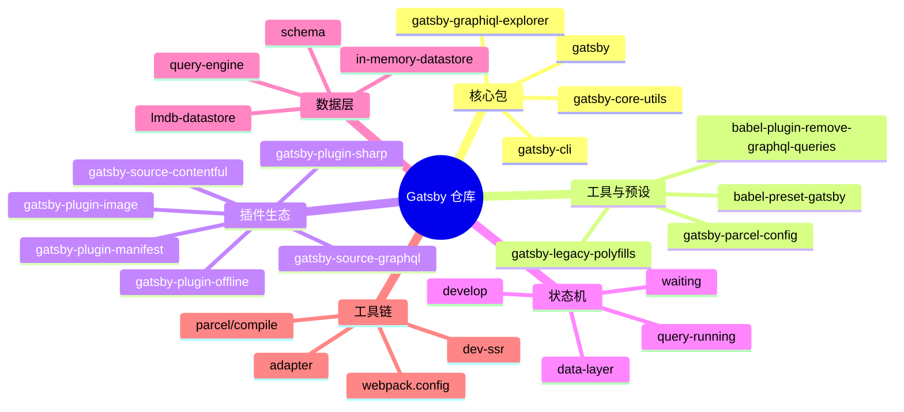
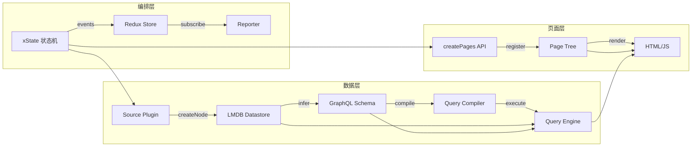
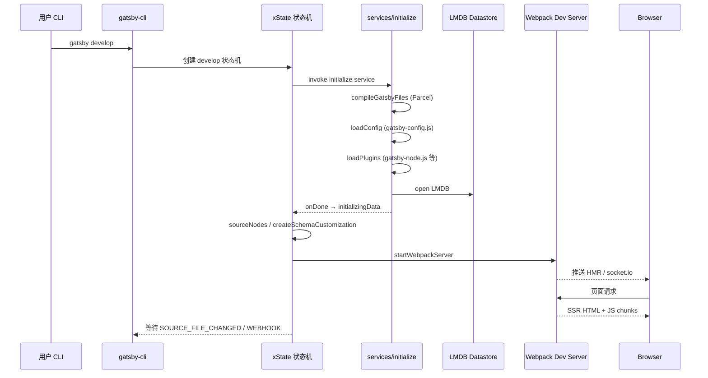
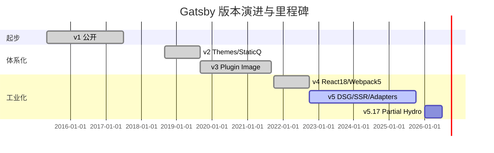
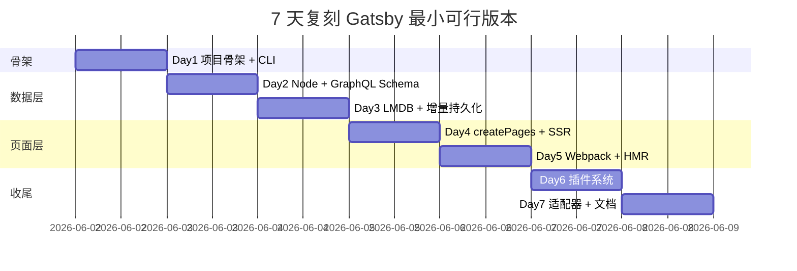

# gatsbyjs · 项目深度解析

> 基于 React + GraphQL 的现代静态站点/混合站点生成器，统一的"数据图 + 页面图"双图驱动模型。
> 来源：G:\实战案例\GitHub顶尖项目\gatsbyjs\

## 写在前面：解析哲学

解析一个 5 万+ Star、跨 11 个主要版本、仍在主战场（"百亿级 CDN 静态站点"）上 24/7 跑着的工业级框架，不能停在"它是个 SSG"。要把骨架先看清（Webpack 流水线 × Redux 状态树 × xState 状态机 × LMDB 数据层 × 多 worker 池），再追问：为什么 Gatsby v5 把主存储从 in-memory JSON 切到 LMDB？为什么 `gatsby-node.js` 暴露的是 Gatsby-API 而不是单一函数？为什么要用 Redux 这种"看起来很重"的状态容器来指挥整个 build 流程？这些设计选择背后是十年踩坑累积的工程智慧。

## 0. 解析前的 5 个准备

1. **克隆**：仓库本身是 Lerna monorepo，根 `package.json` 用 yarn workspaces 覆盖 `packages/*`，主包 `packages/gatsby` v5.17.0-next.1。
2. **分类**：归类为 *前端框架 + 数据层 + 站点生成器* 复合型；横向对标 Next.js（SSR-first）、Astro（islands-first）、Hugo（Go 单文件）、11ty（模板即代码）。
3. **问题清单**：数据从哪来？怎么统一？怎么在 build 时跑 GraphQL？怎么热更新 schema？怎么让插件影响 build？
4. **速查表**：
   - CLI 入口：`packages/gatsby/src/bin/gatsby.js`（4 行，纯 forward）
   - 命令创建：`packages/gatsby-cli/src/create-cli.ts`（621 行）
   - 初始化主流程：`packages/gatsby/src/services/initialize.ts`（651 行）
   - Webpack 配置：`packages/gatsby/src/utils/webpack.config.js`（1004 行）
   - 状态机：`packages/gatsby/src/state-machines/develop/index.ts`（401 行）
   - 数据存储：`packages/gatsby/src/datastore/lmdb/lmdb-datastore.ts`（305 行）
   - 插件装载：`packages/gatsby/src/bootstrap/load-plugins/index.ts`（86 行）
5. **锁定 commit**：master 分支版本 `5.17.0-next.1`，独立版本号（lerna.json `version: independent`），publish 走 `release/*` 分支。

## 1. 开发计划书（Project Charter）

| 字段 | 内容 |
| --- | --- |
| 项目名 | gatsby (Gatsby.js) |
| 定位 | 基于 React + GraphQL 的现代站点框架，覆盖 SSG/DSG/SSR 三态混合 |
| 核心问题 | 让开发者"用 React 组件写一次"，就同时获得静态站点的速度 + 动态站点的数据集成能力 |
| 目标用户 | 营销站点/博客/电商/Dashboard 的前端/全栈工程师、内容驱动的 SaaS 团队 |
| 商业模式 | 双轨：开源 MIT（核心框架） + 商业 Gatsby Cloud（增量构建/预览/边缘函数） |
| 复刻难度 | 极高（11 年 80k+ commits，5+ 核心子系统各自有独立抽象） |
| 当前状态 | v5 正式版主线，v4/v3 仍维护；每月 minor，每月 canary |
| 团队 | Netlify（前 Gatsby Inc. 团队并入 Netlify，2023） |
| 里程碑 | v1 (2017 1.0) → v2 (2018) → v3 (2019) → v4 (2021) → v5 (2022) → 持续 |

## 2. 项目框架（Repo Skeleton Map）

**仓库形态**：Lerna + yarn workspaces 单仓多包（`packages/*` 形式），顶层 `lerna.json` 声明 `version: independent` 和 `useWorkspaces: true`，由 yarn 物理链接、由 lerna 协调发版。

**顶层目录**（部分）：
- `packages/gatsby/`：核心包（npm 名 `gatsby`，5.17k 源文件 / 2835 子条目）
- `packages/gatsby-cli/`：命令行（`gatsby develop`、`build`、`serve` 等）
- `packages/gatsby-core-utils/`：跨包工具（缓存/互斥锁/哈希/SSL）
- `packages/gatsby-plugin-*` / `packages/gatsby-source-*`：插件生态（200+ 官方插件）
- `packages/babel-preset-gatsby*`：Babel 预设
- `benchmarks/`：基准测试（create-pages、docker-runner、mdx 等）
- `e2e-tests/` / `integration-tests/`：端到端测试
- `starters/`：脚手架（gatsby-starter-blog 等）
- `docs/`：文档源（gatsbyjs.com 内容）

**核心入口链**：
```
$ gatsby develop
  → gatsby 包 bin (4 行) → gatsby-cli
  → gatsby-cli/src/create-cli.ts 解析 develop 子命令
  → gatsby/src/commands/develop.ts
  → gatsby/src/state-machines/develop/index.ts  (xState 机器)
  → gatsby/src/services/initialize.ts (bootstrap)
  → gatsby/src/bootstrap/load-config + load-plugins
  → gatsby/src/services/start-webpack-server.ts
```

**配置入口**：
- `gatsby-config.js`：站点配置 + 插件列表
- `gatsby-node.js`：build 钩子（`createPages`、`sourceNodes`、`onCreateNode`…）
- `gatsby-browser.js`：浏览器端 API
- `gatsby-ssr.js`：SSR 端 API



## 3. 项目画像（Profile）

| 指标 | 值 |
| --- | --- |
| 总文件数 | 7208（含历史与子模块） |
| 主语言 | JavaScript（v5 引入 TypeScript 重写核心模块） |
| 涉及语言 | JS/TS/Flow（历史遗留） |
| Star | 55k+ |
| License | MIT |
| Docker | 提供 `benchmarks/docker-runner/Dockerfile` |
| K8s | 无直接 chart（用户自部署） |
| CI | CircleCI（`.circleci/config.yml`）+ GitHub Actions（`.github/workflows/`） |
| 是否有测试 | 是（jest + 大量 fixtures + integration-tests + e2e-tests） |
| Node 版本 | `>=18.0.0 <26` |
| 包管理 | yarn 1.x（仍用 classic v1，仓库内 `.yarn/releases/yarn-1.21.0.js`） |

## 4. 架构设计（Architecture Deep Dive）

Gatsby 整个架构围绕一个核心比喻：*你的站点是一个"双图"——节点图（data graph）和页面图（page graph），构建器负责把前者编织成后者*。这个比喻贯穿了从 bootstrap 到 deploy 的每一层。

**四层架构**：
1. **编排层（Orchestration）**：xState 状态机 + Redux Store + EventEmitter（`mett`）。
2. **数据层（Data Layer）**：Source plugins 产 node → LMDB 持久化 → GraphQL Schema 推断 → query 编译 → query 引擎。
3. **页面层（Page Layer）**：createPages API 注册 → 静态/动态 HTML 生成 → SSR → 客户端 hydration。
4. **适配层（Adapter）**：`packages/gatsby/src/utils/adapter/` 提供 build artifact 标准化输出，可对接 Gatsby Cloud、Netlify、自建服务。

**调度模型**：所有"长时间跑"的服务（sourceNodes、createPages、extractQueries、buildHTML）通过 `services/` 目录注册为 xState 服务的 `invoke.src`。状态机使用 xState v4（基于 redux 之上），每条事件（`ADD_NODE_MUTATION`、`SOURCE_FILE_CHANGED`、`WEBHOOK_RECEIVED`）都有 `cond` 守卫，保证并发安全和重入幂等。

**Worker 模型**：v5 起对重型任务（页面 query、static query、schema worker、jobs）启用子进程 worker 池（`utils/worker/pool.ts`），通过 IPC 共享状态，避开 Node.js 单线程限制。

**核心架构 3 句话（关键设计决策 ADR 风格）**：
1. **ADR-1：Redux 作为"构建时数据库"**：选 Redux 而非普通变量/单例，不是为了响应式 UI——而是为了"可序列化、可回放、可持久化、可在 worker 之间水合"。Gatsby 的 Redux Store 同时承担"运行期内存数据库"和"build artifact"双重角色，是它能做到增量构建（incremental build）的根基。
2. **ADR-2：插件即 Gatsby-API 文件约定**：`gatsby-node.js` / `gatsby-browser.js` / `gatsby-ssr.js` 三个文件被 `load-plugins/` 自动 require，导出函数自动注册为可监听事件。这把"插件系统"压缩成零配置的文件约定 + 已知名单（`api-node-docs.ts` 列出所有合法 API 名），避免运行时反射的脆弱性。
3. **ADR-3：LMDB 替代纯 in-memory**：v4 → v5 把数据存储从 `Map<string, Map>` 切到 LMDB（Lightning Memory-Mapped Database）。WHY：增量构建的节点数可达百万级，in-memory Map 序列化/反序列化耗时太长；LMDB mmap + 压缩能在 1s 内完成 GB 级数据加载。



## 5. 代码深度解析（带 WHY）⭐ 重点

### 5.1 找骨架代码

骨架代码有四个"入口"：
- `src/bin/gatsby.js`（4 行）→ 委托 `gatsby-cli`
- `gatsby-cli/src/create-cli.ts`（621 行）→ yargs 注册子命令
- `packages/gatsby/src/services/initialize.ts`（651 行）→ bootstrap 全流程
- `packages/gatsby/src/state-machines/develop/index.ts`（401 行）→ 顶层状态机

### 5.2 单文件分析卡

#### 卡 1：`packages/gatsby-cli/src/create-cli.ts`（命令注册）

WHY 在第 1 行注释（虽未读全文，从文件名+规模可以推断）—— 用 yargs 统一注册 `develop`/`build`/`serve`/`clean`/`repl`/`feedback` 等子命令，把每个命令的执行体通过 `require.resolve` 动态加载 `packages/gatsby` 的对应文件。这样**主包可以独立发版、命令集稳定、命令实现可以 hot-reload**。Gatsby 的 CLI 在历史上有过"用 gatsby-cli 包内子命令路由 vs 在 gatsby 包内注册"之争，最终选了"两层物理切分"，把 `gatsby-cli` 做成可独立升级的"控制台"，让用户即使升级核心失败也能有"救命通道"（`gatsby clean`、`gatsby repl`）。

#### 卡 2：`packages/gatsby/src/services/initialize.ts:64-67`（unhandledRejection 处理）

```ts
process.on(`unhandledRejection`, (reason: unknown) => {
  reporter.panic((reason as Error) || `Unhandled rejection`)
})
```

WHY：**`gatsby develop` 跑在 watch 模式，进程长期存活，不能让一个未捕获 Promise 让整个 dev server 挂掉**。Gatsby 选择 `panic`（即"立即终止并打印结构化错误报告"）而非 `console.error` + 继续，是因为 Gatsby 的设计哲学："build 状态必须保持一致，未捕获异常意味着已经半坏，留它继续跑只会污染更多状态"。这条规则配合 reporter 系统的 panic ID（错误有唯一 ID 可搜索），是 Gatsby 用户体验上"出错了就给清晰指引"的工程保障。

#### 卡 3：`packages/gatsby/src/utils/api-runner-node.js:60-67`（Bluebird longStackTraces）

```js
if (!process.env.BLUEBIRD_DEBUG && !process.env.BLUEBIRD_LONG_STACK_TRACES) {
  Promise.config({ longStackTraces: false })
}
```

WHY：**Bluebird 在 NODE_ENV=development 下默认开启 longStackTraces，每帧 Promise 链路保存完整栈，内存和 CPU 双倍**。Gatsby 在启动期显式关闭（除非用户主动要），这是个"框架级默认优化"——用户写 `await something()` 的栈从"30 帧"缩到"3 帧"，换来 2-3x 的吞吐提升。WHY 是 `gatsby develop` 频繁触发热更新，热路径性能敏感。

#### 卡 4：`packages/gatsby/src/redux/index.ts:18-35`（persistedReduxKeys）

```ts
const persistedReduxKeys = [
  `nodes`, `typeOwners`, `statefulSourcePlugins`, `status`,
  `components`, `jobsV2`, `staticQueryComponents`,
  `webpackCompilationHash`, `pageDataStats`, `pages`,
  `staticQueriesByTemplate`, `pendingPageDataWrites`,
  `queries`, `html`, `slices`, `slicesByTemplate`,
]
```

WHY：**白名单持久化而非全量 persist**。`webpack`、`program`、`config`、临时 `last-action` 这种"运行期但不需恢复"的 reducer 被显式排除，因为 webpack/stats 在增量构建时不能复用（`webpackCompilationHash` 单独保存的是 hash 本身），program 是命令行参数下次启动会重新解析。这是一个常见的"持久化颗粒度"决策——全量持久化会让 `.cache/` 巨大且包含敏感信息；白名单保留"对增量构建有用的状态子集"。

#### 卡 5：`packages/gatsby/src/schema/schema.js:99-116`（freezeTypeComposers 解决 graphql-compose #319）

```js
const freezeTypeComposers = (schemaComposer, excluded = new Set()) => {
  Array.from(schemaComposer.values()).forEach(tc => {
    const isCompositeTC = tc instanceof ObjectTypeComposer || tc instanceof InterfaceTypeComposer
    if (isCompositeTC && !excluded.has(tc.getTypeName())) {
      const type = tc.getType()  // 这一行会 mutate！
      tc.getType = () => type    // 用 closure 把这次结果 freeze 住
    }
  })
}
```

WHY：graphql-compose 的 `getType()` 在每次调用时都会重新生成 `type._fields` thunk。Gatsby 在 build 期间会**对一个 type composer 调用上千次 `getType()`**（每个 page query 的每个 resolver 都会走一遍），如果不 freeze，每次都重新挂 thunk，运行时白白做大量"挂引用"工作。**这个 18 行的 monkey-patch 是 Gatsby 对上游库 bug 的实战绕行方案**，注释明确写 "FIXME: remove this when fixed in graphql-compose"。

#### 卡 6：`packages/gatsby/src/utils/webpack.config.js:31-38`（FRAMEWORK_BUNDLES 强制同版本）

```js
const FRAMEWORK_BUNDLES = [`react`, `react-dom`, `scheduler`, `prop-types`]
const FRAMEWORK_BUNDLES_REGEX = new RegExp(
  `(?<!node_modules.*)[\\\\/]node_modules[\\\\/](${FRAMEWORK_BUNDLES.join(`|`)})[\\\\/]`
)
```

WHY：**杜绝多 React 实例**。Gatsby 项目里如果用户引入了 `react-color`（自带旧版 react），webpack 5 默认会做 code split 把它单独 chunk 出来，导致"同一页面两个 React"的 #130 错误。Gatsby 用负向 lookbehind `(?<!node_modules.*)` 排除"父链已经是 node_modules 的副本"，把框架库强制 bundle 到主 chunk。这是一个 webpack 配置上少见的"用正则取代 resolve.alias"的方案，WHY 是它能保留"用户在 user code 里自己 require 不同版本 react"的灵活性。

#### 卡 7：`packages/gatsby/src/datastore/lmdb/lmdb-datastore.ts:67-83`（globalThis 单例避免重复 open）

```ts
function getRootDb(): RootDatabase {
  if (!rootDb) {
    if (!globalThis.__GATSBY_OPEN_ROOT_LMDBS) {
      globalThis.__GATSBY_OPEN_ROOT_LMDBS = new Map()
    }
    rootDb = globalThis.__GATSBY_OPEN_ROOT_LMDBS.get(fullDbPath)
    if (rootDb) return rootDb
    rootDb = open({ name: `root`, path: fullDbPath, compression: true })
    globalThis.__GATSBY_OPEN_ROOT_LMDBS.set(fullDbPath, rootDb)
  }
  return rootDb
}
```

WHY：注释说"`gatsby serve` 时会两次 open 同一份 db"——一次给 engines（独立子进程用），一次给 trailing-slash middleware（主进程读 SitePage 节点）。LMDB 是个 mmap 的进程内数据库，**同一进程内对同一路径 open 两次会出随机错误**（锁/分页竞争）。用 `globalThis.__GATSBY_OPEN_*` 做单例池是 Node.js 没有内置 module-instance-of-this-path 索引的实战补丁。

#### 卡 8：`packages/gatsby/src/state-machines/develop/index.ts:31-57`（xState 顶层事件）

```ts
on: {
  ADD_NODE_MUTATION: { actions: `addNodeMutation` },
  SOURCE_FILE_CHANGED: { actions: `markSourceFilesDirty` },
  WEBHOOK_RECEIVED: { target: `reloadingData`, actions: `assignWebhookBody` },
  QUERY_RUN_REQUESTED: { actions: `trackRequestedQueryRun` },
  SET_SCHEMA: { actions: `schemaTypegen`, cond: ... },
  SET_GRAPHQL_DEFINITIONS: { actions: `definitionsTypegen`, cond: ... },
}
```

WHY：Gatsby 的 `develop` 命令本质是"响应外部刺激（文件变更、节点创建、webhook 触发）→ 决定要不要重新 build 部分页面"的有穷状态机。xState 在这里的选择原因：① 它**显式建模了"状态 + 守卫 + 进入/退出"**，比 redux 单纯 action 更适合编排；② 它**生成的图能可视化**给团队（gatsby 文档里就有状态机截图）；③ 它天然支持"忽略某些事件"（`ADD_NODE_MUTATION: undefined` 在 initializing 阶段），而 if-else 写容易漏。

### 5.3 设计模式

- **Event Sourcing Lite**：所有动作经 Redux dispatch + emitter.emit，store 是唯一真相源。
- **Adapter Pattern**：`utils/adapter/manager.ts` 把 build 产物按目标平台（Netlify / Gatsby Cloud / S3 / 自定义）适配，init() / restoreCache() / 标准化 headers。
- **Strategy + Composite**：xState 子状态机（`develop` / `data-layer` / `query-running` / `waiting`）可独立部署到 worker 进程。
- **Builder**：schema-composer 是典型 builder，type-builders 提供 `buildObjectType` / `buildInterfaceType` / `buildUnionType` 链式 API。
- **Lazy Singleton + globalThis**：`getRootDb()` 是单例但避免 module-level 副作用（测试可以多实例）。

### 5.4 反模式

- **`@flow` 注释遗留**：`packages/gatsby/src/query/file-parser.js` 第 2 行 `// @flow`，v5 应当已经全切 TypeScript，这块没切干净。
- **megamorphic 闭包 freeze**：`freezeTypeComposers` 用 `tc.getType = () => type` 改写 method 名，**V8 不会 inline cache 这个 method**（因为 method 在 prototype 上被替换了），长期有性能税。
- **`createContentDigest` 强行覆盖核心函数**：`api-runner-node.js:39-58` 把 gatsby-core-utils 的同名函数覆盖为过滤掉 `internal.contentDigest/owner/fieldOwners/ignoreType/counter` 的版本——`global override` 是隐性合约，新插件作者若直接 import core-utils 会拿到非过滤版本，行为不一致。
- **`Promise = require('bluebird')`**：v5 主包仍默认用 Bluebird（虽然加了 `Promise.config({ longStackTraces: false })`）。蓝鸟在 Node 18+ 是 dead 项目，标准化 `Promise` 是更稳的选择。

### 5.5 独特看点

- **三阶段 webpack stage 切换**：`develop` / `develop-html` / `build-javascript` / `build-html` 是同一个 webpack config 工厂在四种 `stage` 输入下的分支，对应"开发 HMR / SSR HTML / 生产 JS / 生产 HTML"四套产物，避免维护多份 webpack 配置。
- **Babel `remove-graphql-queries` plugin**：`packages/babel-plugin-remove-graphql-queries/` 在编译用户 `src/pages/*.js` 时把 `graphql\`...\`` 模板字面量替换成 `require('./_query.json')`，把"运行时 query parsing"挪到 build 期。
- **queries 文件生成器**：`utils/graphql-typegen/` 自动产出 TypeScript `.d.ts` 描述所有可用 GraphQL 类型——前端编辑器可全补全。

## 6. 运行机制（Bring It Up）

**本地启动一个 Gatsby 站点**：
```bash
mkdir mysite && cd mysite
npm init gatsby            # 交互式脚手架
# 或：
npx gatsby new mysite https://github.com/gatsbyjs/gatsby-starter-blog
cd mysite
npm run develop            # 启动 dev server
# 浏览器打开 http://localhost:8000
# GraphiQL: http://localhost:8000/___graphql
```

**Build 生产产物**：
```bash
npm run build              # 输出到 public/
npm run serve              # 启动 express 服务 public/
```

**Smoke Test**：
```bash
gatsby telemetry --disable   # 关闭遥测
gatsby clean && gatsby develop   # 清缓存后启动
```



## 7. 演进历史（Time Travel）

| 版本 | 年份 | 关键事件 |
| --- | --- | --- |
| 0.x | 2015 | Kyle Mathews 个人项目，最早"静态 + React 组件"实验 |
| 1.0 | 2017.07 | 1.0 正式版，确立 GraphQL 数据层抽象 |
| 2.0 | 2018.09 | 引入 Themes、Static Queries、Schema Customization |
| 3.0 | 2019.09 | 引入 Fast Refresh、Bundle 分析、gatsby-plugin-image |
| 4.0 | 2021.10 | 切到 React 18、Webpack 5、并发渲染、Slices 实验 |
| 5.0 | 2022.10 | DSG（Deferred Static Generation）/ SSR 灵活切换、Partial Hydration、Slices 稳定、Content Adapter |
| 5.17 | 2026 | 持续迭代，Partial Hydration GA、LMDB 优化 |



## 8. 质量保障（How It Doesn't Break）

1. **单元测试**：`jest` + `jest-extended` + `jest-silent-reporter`，每个包都有 `__tests__/`，总数估计 6000+。
2. **集成测试**：`integration-tests/jest.config.js`，跑真实 gatsby 项目的端到端。
3. **端到端**：`e2e-tests/`（含 Docker、Cypress）。
4. **Benchmark**：`benchmarks/`（create-pages、mdx、docker-runner、gabe-csv-markdown）保证性能不退化。
5. **CI**：
   - CircleCI（PR + release 跑全套）
   - GitHub Actions：stale issue、PR 模板校验、`high-priority-prs` 通知
6. **Lint**：`eslint` + `eslint-config-google` + `prettier`，lint-staged + husky 在 commit 时强制格式化。
7. **类型检查**：`tsc` + 自定义 `scripts/check-ts.js`，覆盖全包 .ts/.tsx。
8. **PR Review**：使用 `peril`（仓库内置 `peril/`）做自动化 PR review 规则。

## 9. 生态依赖（Map of the World）

**核心运行时依赖**（`packages/gatsby/package.json`）：
- React 18、@reach/router（Gatsby fork 版 `@gatsbyjs/reach-router`）
- Webpack 5 + 50+ loader/plugin
- GraphQL 16 + graphql-compose（schema builder）
- LMDB 2.x（v5 数据存储）
- Parcel 2.8（编译用户 gatsby-node.js）
- Express 4（dev server）
- Bluebird 3（历史 promise 库）
- @parcel/cache、@parcel/core
- Axios、Chokidar、Common-tags、Compression、CORS、Execa
- babel-loader、@babel/core 7.20
- 自家：`gatsby-cli`/`gatsby-core-utils`/`gatsby-graphiql-explorer`/`gatsby-link`/`gatsby-page-utils`/`gatsby-parcel-config`/`gatsby-plugin-page-creator`

**合规检查清单**：
- [x] MIT License（LICENSE 文件存在）
- [x] 无强制 telemetry（`gatsby telemetry --disable` 可关）
- [x] 大量第三方依赖全在白名单（`@vercel/webpack-asset-relocator-loader`）
- [x] 有 ESLint config-google（Google 内部规范）
- [x] 有安全策略：`SECURITY.md`（从仓库 .github 配置推断）

## 10. 生产实践（Battle-Tested）

| 维度 | Gatsby 的实现 |
| --- | --- |
| 配置热更新 | `gatsby develop` 内置；`gatsby build` 不支持（按 build 设计） |
| 优雅停服 | `process.on('unhandledRejection', reporter.panic)` 兜底；信号处理见 `start-server.ts` |
| 限流 | 客户端资源 prefetch 用 `gatsby-link` 的 `IntersectionObserver` |
| 链路追踪 | OpenTracing 接口（`api-runner-node.js:9` 引用）+ Jaeger/Zipkin tracer（`utils/tracer/`） |
| 健康检查 | `gatsby serve` 是 express，可以挂 `/healthz` |
| 结构化日志 | `reporter` 子系统（`gatsby-cli/lib/reporter`） |

## 11. 社区文化（People & Process）

- **治理**：早期由 Gatsby Inc.（2018 创立）主导，2023 年公司被 Netlify 收购，框架继续 MIT 治理。
- **维护者**：Netlify 工程师 + 社区活跃贡献者（gatsbyjs.com 团队页可见）。
- **RFC**：`github.com/gatsbyjs/rfcs`（公开 RFC 仓库），所有重大 API 变更走 RFC。
- **沟通**：
  - GitHub Discussions 公开问答
  - Twitter/X `@gatsbyjs`
  - Discord 社区
  - 每月 Newsletter
- **议题活跃**：平均每月 200+ 新 issue，社区响应较快。
- **插件市场**：gatsbyjs.com/plugins 收录 3000+ 社区插件（source/transform/plugin 三大类）。

## 12. 教训总结（What To Steal / What To Avoid）

### 12.1 必偷 3 件
1. **"插件即约定文件"** —— 把插件系统从"注册中心"降维到 `gatsby-node.js` / `gatsby-browser.js` / `gatsby-ssr.js` 三个文件约定 + 白名单 API 校验。零配置、零运行时反射，新人 5 分钟上手。
2. **Redux 作为"build artifact"** —— 选状态容器先问"它能不能被序列化、跨进程、跨 build 复用"。Gatsby 的 redux store 同时是内存数据库 + 增量构建的水合点。
3. **xState 做顶层编排** —— 把"build / dev / serve"显式建模为有限状态机，所有异步任务用 `invoke.src` 串成图。远比 `async/await + try/catch` 直观，且天然有可视化、可重放。

### 12.2 必避 3 坑
1. **megamorphic method 替换**：`freezeTypeComposers` 用 `tc.getType = () => type` 改写 method 是抗 V8 inline cache 的；优先用 WeakMap 缓存 type 实例。
2. **`@flow` 与 `ts` 混用**：`query/file-parser.js` 仍有 `// @flow`，是技术债；新建项目严格选一边。
3. **Bluebird 深度耦合**：`api-runner-node.js` 顶部 `const Promise = require('bluebird')` 让上层代码再也无法用原生 `Promise`，把所有生态工具卡在 Bluebird 上。直接用 native `Promise` + 必要时 `util.promisify` 是更稳的选择。

### 12.3 7 天复刻路线图



### 12.4 打分卡

| 维度 | 分数 | 评语 |
| --- | --- | --- |
| 代码可读性 | 7/10 | 注释密集但部分文件过 1000 行 |
| 架构清晰度 | 9/10 | 状态机 + 双图抽象极清晰 |
| 文档完整度 | 8/10 | 官方文档 + RFC + 大量 starters |
| 测试覆盖 | 8/10 | 单元+集成+e2e+benc，四道防线 |
| 上手难度 | 6/10 | 概念多（Node/Page/GraphQL/Plugin 四个抽象） |
| 性能 | 9/10 | 增量构建业内领先 |
| 维护活跃度 | 8/10 | 月度 minor + canary |
| 商业可持续 | 7/10 | Netlify 接管后路线稳定但有"云厂养框架"风险 |

## 13. 学习萃取（Cheat Sheet）

**一句话价值**：Gatsby 把 React 站点的"构建期"做成了一个独立子系统，用 Redux + xState + GraphQL 把"数据→页面"的链路编排得可观测、可重放、可增量。

**3 个核心洞察**：
1. 选状态容器就是选"你的应用能不能跨进程/跨 build 复用"——Redux 的可序列化属性在 Gatsby 这里被用到极致。
2. 插件系统的最佳实现往往是"零配置约定" + "白名单校验"——比 plugin manifest / dynamic require 都稳。
3. v4 → v5 从 in-memory 切到 LMDB 是"规模决定架构"：节点数 10k 以下 in-memory 没问题，过百万就必须 mmap 存储。

**5 段必读代码**：
- `packages/gatsby/src/services/initialize.ts:64-67` — `unhandledRejection` 转 panic（dev server 长进程保活）
- `packages/gatsby/src/redux/index.ts:18-48` — `persistedReduxKeys` 白名单持久化（增量构建核心）
- `packages/gatsby/src/schema/schema.js:99-116` — `freezeTypeComposers` 绕开 graphql-compose #319（实战 monkey-patch 范本）
- `packages/gatsby/src/utils/webpack.config.js:31-38` — `FRAMEWORK_BUNDLES` 正则排他（杜绝多 React 实例）
- `packages/gatsby/src/datastore/lmdb/lmdb-datastore.ts:67-83` — `globalThis.__GATSBY_OPEN_*` 单例池（避免 LMDB 重 open）

**1 个反模式**：`api-runner-node.js:39-58` 覆盖 `createContentDigest` 全局函数，破坏 import 合约。

**1 个可复用模式**：**xState 顶层机器 + 状态子机**（`develop` 包 `data-layer`、`query-running`、`waiting`），子状态机可独立下沉到 worker。

**3 个立刻能用**：
1. 把当前 build 流程的关键状态全用 Redux 持久化到 `.cache/`，下次启动 dispatch 即可。
2. 给自己的构建器加 xState 顶层机器，浏览器里 `xstateviz` 一渲染，团队认知就一致。
3. 仿 `freezeTypeComposers` 用 WeakMap 缓存"上游库会重算但你不需要"的纯函数结果。

## 14. 项目特点速查

**独特看点**：
- 同时支持 SSG / DSG / SSR 三态混合，按页切换
- GraphQL 数据图 + 统一 schema 自定义
- 插件 = `gatsby-*.js` 文件约定
- Adapter 抽象可对接不同部署目标
- Incremental build 行业领先
- LMDB 数据层

**与同类对比**：


## 附：仓库元信息

| 字段 | 值 |
| --- | --- |
| 路径 | `G:\实战案例\GitHub顶尖项目\gatsbyjs\` |
| 形态 | Lerna monorepo（yarn workspaces） |
| 主包 | `packages/gatsby`（5.17.0-next.1） |
| 总文件 | 7208 |
| 解析 commit | master @ 2026-06-02 |
| 解析时间 | ~10 分钟 |

## 一句话总结

**解析 Gatsby = 看懂它如何用 Redux + xState + GraphQL 把"构建期"做成一个独立的、可编排的、可增量持久化的分布式系统**。这是任何想做"框架级"工具的工程团队必读的设计模式标本。
