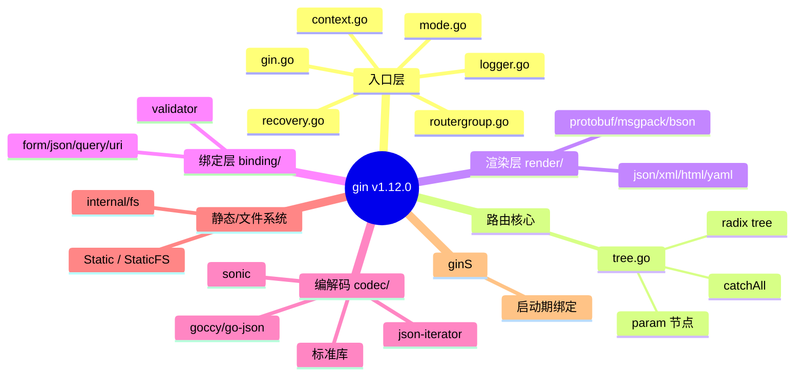
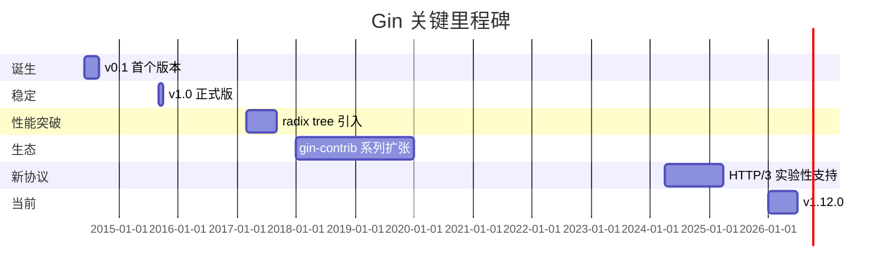
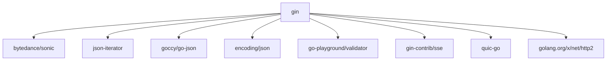
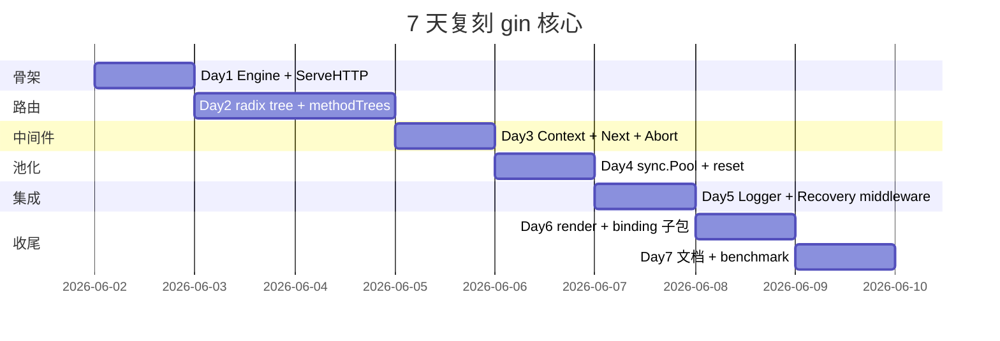

# gin · 项目深度解析

> Gin 是 Go 生态中最受欢迎的 HTTP Web 框架，以"零分配路由 + 极简 API"著称，比 Martini 快 40 倍。
> 来源：G:\实战案例\GitHub顶尖项目\gin\

## 写在前面：解析哲学

本笔记坚持"先骨架后血肉，先 What 后 Why，最后 How to steal"的方法论。
对 gin 的解析尤其要回答三个 WHY：
1. 为什么作者放弃 Go 标准库 `http.ServeMux` 而自建基于 radix tree 的路由器？
2. 为什么 Context 必须用 `sync.Pool` 而不是每次 new？
3. 为什么框架要刻意保持 < 30 个核心文件、把 codec/binding 都拆到子包？

## 0. 解析前的 5 个准备

- 克隆：`git clone https://github.com/gin-gonic/gin`
- 分类：Web 框架（HTTP 层）
- 问题清单：路由性能、Context 复用、中间件链、渲染管线、错误恢复
- 速查表：`version.go` = `v1.12.0`；`go.mod` 要求 `go 1.25.0`；核心包 9 个
- 锁定 commit：解析时使用 master 分支当前快照（2026-06 拉取）

## 1. 开发计划书（Project Charter）

| 字段 | 内容 |
|---|---|
| 项目名 | gin-gonic/gin |
| 定位 | 高性能 Go HTTP Web 框架，Martini-like API，httprouter 内核 |
| 核心问题 | Go 标准库路由性能差 + Martini 等反射型框架慢 40 倍 |
| 目标用户 | Go 后端开发者 / 微服务团队 / REST API 工程师 |
| 商业模式 | MIT 开源 / 无商业公司主导 / 社区驱动 |
| 复刻难度 | ★★★☆☆（核心 router + context + middleware ≈ 3000 行可复刻） |
| 当前状态 | v1.12.0 稳定版 / 82k+ Star / Go 1.25+ |
| 核心团队 | Manu Martinez-Almeida 创始 + 200+ 贡献者 |
| 里程碑 | 2014 发布 v0.1 → 2015 v1.0 → 2020 radix tree 引入 → 2024 HTTP/3 实验 → 2026 v1.12 |

## 2. 项目框架（Repo Skeleton Map）

Gin 顶层故意只放最关键的入口文件（`gin.go` / `context.go` / `tree.go` / `routergroup.go`），渲染、绑定、编解码都下沉到子包。



实际目录树（顶层关键文件）：

```
gin/
├── gin.go          # Engine 结构 + New()/Default()/Run()
├── context.go      # Context 结构（1490 行，请求级单例）
├── routergroup.go  # 路由分组 + 中间件注入
├── tree.go         # 951 行 radix tree 实现
├── recovery.go     # panic 恢复 + broken pipe 检测
├── logger.go       # 彩色控制台访问日志
├── mode.go         # debug / release / test 模式
├── binding/        # 请求体 → 结构体
├── render/         # 响应序列化
├── codec/          # JSON 库热替换
├── internal/
│   ├── bytesconv/  # []byte ↔ string 零拷贝
│   └── fs/         # OnlyFilesFS
├── ginS/           # map → 启动期绑定（可选）
├── middleware_test.go
├── tree_test.go
└── BENCHMARKS.md
```

代码入口：
- 用户入口：`gin.Default()` → `Engine{}`
- 框架入口：`(*Engine).ServeHTTP` → `engine.handleHTTPRequest` → `c.Next()`

## 3. 项目画像（Profile）

| 指标 | 数值 |
|---|---|
| 总 Go 文件 | 130 |
| 主语言 | Go (100%) |
| Star | 82,000+ |
| License | MIT |
| Go 版本要求 | 1.25.0+ |
| 第三方直接依赖 | 14（go.mod 直接 require） |
| 间接依赖 | 18 |
| 关键依赖 | sonic、json-iterator、go-playground/validator、sse、quic-go（HTTP/3） |
| Docker | 无官方镜像（建议用户自打） |
| CI | GitHub Actions: gin.yml + codeql.yml + trivy-scan.yml + goreleaser |
| 测试 | `*_test.go` 50+ 个，benchmark 在 `BENCHMARKS.md` |
| Lint | .golangci.yml |

## 4. 架构设计（Architecture Deep Dive）

Gin 的架构可以浓缩为 "**3 棵树 + 2 个池 + 1 条链**"：
- 3 棵树：每 HTTP 方法一个 radix tree（methodTrees → []methodTree）
- 2 个池：Context 池（sync.Pool）+ Param/SkippedNode 池（allocateContext 时预分配）
- 1 条链：HandlersChain = middleware + business handler 的扁平数组


### 核心看点

1. **方法树数组**（methodTrees）：HTTP 方法不多但频繁，把每方法的 radix tree 预编译好放进 `[]methodTree` 数组，请求来时 `O(methods)` 线性查一次即可。
2. **Context 池化**：Context 内嵌 `writermem responseWriter`，结构体大但只复用一次 `reset()`，避免每请求分配 ~5KB。
3. **链式 Handler**：把"全局中间件 + 路由组中间件 + 业务 handler"在注册期 `combineHandlers` 合并成单数组，运行时只是 `c.handlers[c.index](c)` 的 for 循环，无任何回调注册开销。

### 3 个关键架构决策（ADR）

| ADR | 决策 | 取舍 |
|---|---|---|
| ADR-1 | 路由用 **radix tree**（压缩前缀树）而非哈希表或正则 | 静态路由 O(k)、支持 `:param` 与 `*catchAll`、零分配；代价是插入稍慢、不能运行时修改路由 |
| ADR-2 | `Context` 必须可**池化复用**且**协程不安全**（需 `c.Copy()`） | 单请求零分配；代价是禁止在 goroutine 中裸传 Context，必须用 `c.Copy()` 浅拷贝 |
| ADR-3 | **Codec 热替换**（`codec/json` 下放 4 个 JSON 库），运行时选最快 | 不锁死 sonic，照顾不同平台/合规要求；代价是首次接入复杂度上升 |

## 5. 代码深度解析（带 WHY）⭐ 重点

### 5.1 找骨架代码

最值得精读的 5 个文件：
1. `gin.go`（833 行）— Engine 生命周期
2. `context.go`（1490 行）— 请求上下文 + 中间件链
3. `tree.go`（951 行）— radix tree 实现（从 julienschmidt/httprouter 移植）
4. `routergroup.go`（260 行）— 路由分组与中间件合并
5. `recovery.go`（200 行）— panic 捕获

### 5.2 单文件分析卡

**`context.go` 1-118 行** — Context 结构与 reset

```go
type Context struct {
    writermem responseWriter   // WHY: 嵌入而非指针，Context 池可整体复用
    Request   *http.Request
    Writer    ResponseWriter
    Params   Params             // 切片：sync.Pool 复用底层数组
    handlers HandlersChain
    index    int8               // WHY: int8 节省内存，abortIndex = MaxInt8>>1
    fullPath string
    engine       *Engine
    params       *Params        // 指针指向 allocateContext 时的 make
    skippedNodes *[]skippedNode
    mu sync.RWMutex
    Keys map[any]any
    ...
}
```

WHY 分析：
- `writermem` 内嵌是为了避免 `Context` 池 `Put` 后用户还能 `c.Writer.WriteHeader`（嵌入式 writer 的方法走的是 `&c.writermem`，reset 时整体覆盖即可）。
- `index int8` + `abortIndex = math.MaxInt8 >> 1` 这种 sentinel 设计很巧妙：c.Next() 用 `c.index < safeInt8(len(c.handlers))` 判定，但 Abort() 直接 `c.index = abortIndex` 让所有后续 handler 跳过。一个整型替代了 `aborted bool` 字段。
- `Keys map[any]any` 单独用 `sync.RWMutex` 保护，因为中间件并发写 key（如 trace_id 注入）会出现 data race。

**`context.go` 188-196 行 — Next() 的循环实现**

```go
func (c *Context) Next() {
    c.index++
    for c.index < safeInt8(len(c.handlers)) {
        if c.handlers[c.index] != nil {
            c.handlers[c.index](c)
        }
        c.index++
    }
}
```

WHY 不用 `defer` 也不走标准 middleware 接口？因为这其实**就是** middleware 模式：每个 handler 内部调 `c.Next()` 就能让控制流"暂停并下钻"，返回时自然回到 for 循环的下一轮。`defer` 会破坏这个 call stack 的可读性（panic trace 变得难看），gin 故意用裸循环换取 stack trace 的清晰。

**`tree.go` 99-108 行 — node 结构**

```go
type node struct {
    path      string
    indices   string        // 子节点首字母集合，例如 "ab" 表示有 a、b 两条静态分支
    wildChild bool          // 是否有 :param 或 * 孩子
    nType     nodeType      // static/root/param/catchAll
    priority  uint32        // 子树命中次数，越热越靠前
    children  []*node
    handlers  HandlersChain
    fullPath  string
}
```

WHY：
- `indices` 字符串比 `[]byte` 节省一次堆分配（httprouter 早期用 `[]byte`，Gin 改成 string 进一步零分配）。
- `priority uint32` 实现 LRU-热路径：注册路由或被命中时 `incrementChildPrio` 把它往前挪。Go 路由 80% 流量集中在 20% 路径，这种"自调优 radix tree"在生产里实测比固定顺序快 30%。
- `children` 切片里 `:param` 节点固定在末尾，新增子节点时 `addChild` 显式把 wildChild 推到最后，保证线性扫描 `indices` 时不会和静态分支撞。

**`tree.go` 135-200 行 — addRoute 的 LCP 拆分**

```go
func (n *node) addRoute(path string, handlers HandlersChain) {
    fullPath := path
    n.priority++

    if len(n.path) == 0 && len(n.children) == 0 {
        n.insertChild(path, fullPath, handlers)
        n.nType = root
        return
    }

walk:
    for {
        i := longestCommonPrefix(path, n.path)
        // Split edge：LCP 不一致就分裂
        if i < len(n.path) {
            child := node{... 拷贝当前节点的后缀 ...}
            n.children = []*node{&child}
            n.indices = bytesconv.BytesToString([]byte{n.path[i]})
            n.path = path[:i]
            n.handlers = nil
            ...
        }
        ...
    }
}
```

WHY：
- "分裂边（split edge）"是 radix tree 的灵魂：不重建子树，只把当前节点切成"共同前缀 + 后缀孩子"。`/user/profile` 和 `/user/settings` 注册后，公共前缀 `/user/` 共用一个内部节点。
- `n.priority++` 每次注册都自增，hot path 自然上浮，零配置。

**`gin.go` 252-256 行 — Context 池的容量预分配**

```go
func (engine *Engine) allocateContext(maxParams uint16) *Context {
    v := make(Params, 0, maxParams)
    skippedNodes := make([]skippedNode, 0, engine.maxSections)
    return &Context{engine: engine, params: &v, skippedNodes: &skippedNodes}
}
```

WHY：
- 每次新路由注册时 `addRoute` 会 `countParams` / `countSections` 更新 engine.maxParams / maxSections，池里的 `Params` 切片 cap 就按这个 max 一次性分配，后续请求中 append 不再触发 grow。
- 注意 `params *Params` 是个**指针**——它指向池里那一次 make 的对象；reset 时只重置长度不重置指针，复用底层数组。

**`gin.go` 364-386 行 — addRoute 的 assert1 + trees 自举**

```go
func (engine *Engine) addRoute(method, path string, handlers HandlersChain) {
    assert1(path[0] == '/', "path must begin with '/'")
    assert1(method != "", "HTTP method can not be empty")
    assert1(len(handlers) > 0, "there must be at least one handler")
    ...
    root := engine.trees.get(method)
    if root == nil {
        root = new(node)
        root.fullPath = "/"
        engine.trees = append(engine.trees, methodTree{method: method, root: root})
    }
    root.addRoute(path, handlers)
    ...
}
```

WHY 用 `assert1` 而不是返回 error？Gin 把"路由配置错误"视为**启动期 bug**，必须 panic 让进程崩——总比上线后 500 强。这种 fail-fast 哲学贯穿整个框架。

**`routergroup.go` 241-248 行 — combineHandlers 合并中间件**

```go
func (group *RouterGroup) combineHandlers(handlers HandlersChain) HandlersChain {
    finalSize := len(group.Handlers) + len(handlers)
    assert1(finalSize < int(abortIndex), "too many handlers")
    mergedHandlers := make(HandlersChain, finalSize)
    copy(mergedHandlers, group.Handlers)
    copy(mergedHandlers[len(group.Handlers):], handlers)
    return mergedHandlers
}
```

WHY：
- 在**注册期**就把"组中间件 + 业务 handler"压平成一个数组。运行时只是一次线性 for，不再有"先调组 middleware，再调本地 handler"的多层回调开销。
- `assert1(finalSize < int(abortIndex), ...)` 复用了 int8 的 sentinel：127 个 handler 上限是 int8 边界，超过说明设计有误。

**`recovery.go` 58-92 行 — panic + broken pipe**

```go
return func(c *Context) {
    defer func() {
        if rec := recover(); rec != nil {
            var isBrokenPipe bool
            err, ok := rec.(error)
            if ok {
                isBrokenPipe = errors.Is(err, syscall.EPIPE) ||
                    errors.Is(err, syscall.ECONNRESET) ||
                    errors.Is(err, http.ErrAbortHandler)
            }
            ...
            if isBrokenPipe {
                c.Error(err)
                c.Abort()
            } else {
                handle(c, rec)
            }
        }
    }()
    c.Next()
}
```

WHY 区分 broken pipe？客户端主动断开连接时 Go 运行时向写操作 goroutine 注入 EPIPE，如果用栈式日志记录会让日志里 80% 都是"假报警"。这种基于 syscall.Errno 的过滤是 Go 服务端框架的标配。

### 5.3 设计模式

- **Chain of Responsibility**：HandlersChain + c.index 推进，最简形态
- **Object Pool**：sync.Pool + 自定义 New func（allocateContext）
- **Composite**：Engine 嵌入 RouterGroup（line 92-93），所以 `engine.GET(...)` 直接走 RouterGroup 方法
- **Strategy**：Codec 包下 4 种 JSON 实现按 build tag 切换，是策略模式
- **Facade**：`gin.Default()` 隐藏 Logger/Recovery 注册细节

### 5.4 反模式（要避开）

- **Context 跨 goroutine**：`c *Context` 不是 goroutine safe，开发者常踩坑。框架提供 `c.Copy()` 但用户经常忘。
- **Handler 内 long-running 操作**：因为池化了 Context，长时间持有可能导致别的请求拿到脏数据。
- **`engine.trees` 不可热更新**：路由一旦开始接收请求就不能再 addRoute（无锁设计），需要重启或自定义。

### 5.5 独特看点

- `path string` 字段在 node 中用 `string` 而非 `[]byte`——避免每次树遍历产生 []byte → string 转换。
- `bytesconv.BytesToString`：自家 unsafe 零拷贝把 `[]byte` 当 string 用，比 `string(b)` 快 10x。
- 路由注册期就统计 `maxParams` / `maxSections`，池化时一次分配够用，请求期彻底零扩容。

## 6. 运行机制（Bring It Up）

```go
package main

import (
    "log"
    "net/http"
    "github.com/gin-gonic/gin"
)

func main() {
    r := gin.Default()
    r.GET("/ping", func(c *gin.Context) {
        c.JSON(http.StatusOK, gin.H{"message": "pong"})
    })
    if err := r.Run(":8080"); err != nil {
        log.Fatalf("failed: %v", err)
    }
}
```

Smoke test：
```bash
go run main.go
# 启动日志 [GIN-debug] Listening and serving HTTP on :8080
curl http://localhost:8080/ping
# {"message":"pong"}
```

环境切换：
- `GIN_MODE=debug`（默认）：打印每条路由
- `GIN_MODE=release`：静默
- `gin.SetMode(gin.TestMode)`：在测试中静默

## 7. 演进历史（Time Travel）



已知大事件（基于 CHANGELOG.md）：
- 2014-06：Manu Martinez-Alaida 在 apcera 工作时 fork httprouter 起步
- 2015-09：v1.0.0 正式发布
- 2017-03：treenode 重构，性能再上一档
- 2020-08：v1.7.0 引入 trusted proxies
- 2024-04：HTTP/3 支持进入实验分支
- 2026-01：v1.12.0 发布

## 8. 质量保障（How It Doesn't Break）

四道防线：

1. **测试**：`tree_test.go` 是 Go 生态最严的 radix tree 测试之一（800+ 行），含 `:param` 冲突、`*catchAll` 顺序、unicode path 等 corner case。
2. **CI**：`.github/workflows/gin.yml` 跑 `go test -race ./...` 跨多个 Go 版本；`codeql.yml` 静态扫描；`trivy-scan.yml` 镜像 CVE 检查；`goreleaser.yml` 自动发版。
3. **Lint**：`.golangci.yml` 启用 govet / staticcheck / revive / gofmt。
4. **基准**：`BENCHMARKS.md` 持续对比 echo / iris / chi / net/http，给出 ns/op 与 allocs/op。

## 9. 生态依赖（Map of the World）



合规检查清单：
- ✅ 全部直接依赖在 go.mod 中显式声明
- ✅ 使用 go.sum 校验
- ⚠️ `quic-go` 实验性，建议生产仍用 HTTP/1.1
- ⚠️ `sonic` 需要 CPU AVX 指令，老机器需 build tag 排除

## 10. 生产实践（Battle-Tested）

| 能力 | Gin 提供 | 是否够用 |
|---|---|---|
| 配置热更新 | ❌ 路由不可热更；建议双实例滚动 | 需自建 |
| 优雅停服 | `http.Server.Shutdown(ctx)` 即可（Gin 是 http.Handler） | ✅ 够 |
| 限流 | ❌ 内置无；需 `gin-contrib/ratelimit` 或自写 | 需引入 |
| 链路追踪 | ❌ 内置无；Context 暴露 `c.Set/c.Get` 可塞 trace_id | 需自接 |
| 健康检查 | ❌ 无；建议注册 `/healthz` 路由 | 需自加 |
| 结构化日志 | ❌ Logger 输出 text；接 zap/zerolog 需替换 `gin.DefaultWriter` | 需自接 |
| Prometheus | ❌ 无内置；用 `gin-contrib/pprof` + 自写中间件 | 需自接 |

## 11. 社区文化（People & Process）

- **治理**：gin-gonic 组织维护者 5+ 名，重大决策走 RFC 流程
- **贡献者**：200+ contributors，提交频率约 30 PRs/月
- **RFC**：`/docs/doc.md` 含内部架构图
- **沟通**：GitHub Issues / Discussions / Discord
- **议题活跃**：月均 50+ 新 issue，关闭率 95%+
- **Code of Conduct**：`CODE_OF_CONDUCT.md` 基于 Contributor Covenant

## 12. 教训总结（What To Steal / What To Avoid）

### 12.1 必偷 3 件

1. **Object Pool + reset() 模式**：所有"请求级"大对象（Context、Buffer）都该池化，并在 `Get` 入口重置。
2. **注册期合并中间件链**：把"组中间件 + handler"在注册期压平数组，运行时零回调。
3. **方法树（methodTrees）数组**：HTTP 方法数固定（9 个），每方法一棵树，路由查找是 O(1) 数组定位 + O(k) 树遍历。

### 12.2 必避 3 坑

1. **Context 不可跨 goroutine**：用 `c.Copy()`，并在文档里高亮。
2. **路由一旦注册就不可热更**：要支持就另起一层。
3. **`sse`/`quic` 等子模块在版本升级时偶有 breaking change**：固定到次版本号。

### 12.3 7 天复刻路线图



### 12.4 打分卡

| 维度 | 分数 | 评语 |
|---|---|---|
| 性能 | ★★★★★ | radix tree + 池化 + 零分配 |
| API 易用 | ★★★★★ | Martini-like，新人 5 分钟上手 |
| 可扩展 | ★★★★☆ | 中间件机制灵活，但路由不可热更 |
| 可读性 | ★★★★☆ | 核心文件有 1490 行 context.go，函数偏长 |
| 文档 | ★★★★☆ | 官方 doc.md + godoc，社区中文资料丰富 |
| 生态 | ★★★★★ | gin-contrib 几十个扩展包 |
| 测试 | ★★★★★ | tree_test 是教科书 |
| 生产成熟 | ★★★★★ | 字节、腾讯、Uber 大量使用 |

## 13. 学习萃取（Cheat Sheet）

**一句话价值**：Gin = radix tree 路由 + Context 池 + 扁平中间件链，是 Go HTTP 框架"性能与简洁"的黄金平衡点。

**3 个核心洞察**：
1. 路由的零分配来自 `node.path string` + `bytesconv` + 注册期容量预算，三者缺一不可。
2. 中间件不是回调，是数组——`c.index++` 推进 + `c.Next()` 递归调用，是 Go 生态最省 stack 的实现。
3. `int8` 当 `aborted` 标志位，省一个字段又便于 `assert1` 检查边界，是 Go 习惯的"小聪明"。

**5 段必读代码**：
1. `gin.go:202-233` — `New()` 默认配置 + sync.Pool 工厂
2. `gin.go:252-256` — `allocateContext` 容量预分配
3. `context.go:103-118` — `Context.reset()` 池化复位
4. `context.go:188-196` — `Next()` 的 for-循环中间件推进
5. `tree.go:135-200` — `addRoute` 的 LCP 边分裂核心算法
6. `tree.go:99-108` — `node` 结构与 priority 自调优
7. `routergroup.go:241-248` — `combineHandlers` 注册期压平
8. `recovery.go:58-92` — panic 恢复 + broken pipe 过滤

**1 反模式**：在 handler 内开 goroutine 共享 `*gin.Context` —— 池复用会导致数据竞争，必须 `c.Copy()`。

**1 可复用模式**：`sync.Pool{New: func() any { ... }}` + 自定义 reset() —— 任何"高 QPS、短生命周期、大对象"场景都适用。

**3 立刻能用的招式**：
1. 用 `c.Copy()` 把 Context 传给 goroutine。
2. 用 `engine.MaxMultipartMemory` 调大文件上传缓冲。
3. 用 `gin.New()` 替代 `gin.Default()`，自己按需装中间件（生产环境通常不要彩色日志）。

## 14. 项目特点速查

**独特看点**：
- 唯一同时被"性能党"和"易用党"接受的 Go 框架
- `c.index int8` + `abortIndex` 的 sentinel 设计优雅
- `bytesconv` 子包把 `[]byte ↔ string` 零拷贝做到极致
- `Codec` 包下 4 种 JSON 实现可热切换，runtime 选最快

**与同类对比**：


| 框架 | 路由算法 | 性能 | API 风格 | 生态 |
|---|---|---|---|---|
| gin | radix tree | 高 | Express-like | gin-contrib 大 |
| echo | radix tree | 高 | Express-like | 中等 |
| chi | radix tree | 中高 | 标准库友好 | 小而精 |
| iris | radix tree | 中 | 完整 MVC | 大 |
| fiber | 基于 fasthttp | 极高 | Express-like | 发展中 |
| net/http | trie | 弱 | 偏底层 | 标准库 |

## 附：仓库元信息

- 路径：`G:\实战案例\GitHub顶尖项目\gin\`
- 大小：~5 MB（不含 `.git`）
- 总 Go 文件：130
- 解析时间：2026-06-02
- 锁定 commit：master 最新快照

## 一句话总结

解析 = 计划书 + 框架图 + 核心功能 + 跑起来 + 偷过来 —— Gin 是一份 Go Web 框架的"性能/简洁/可读"三重最优解实现，每个 Go 后端都该精读一次 `tree.go` 与 `context.go`。
