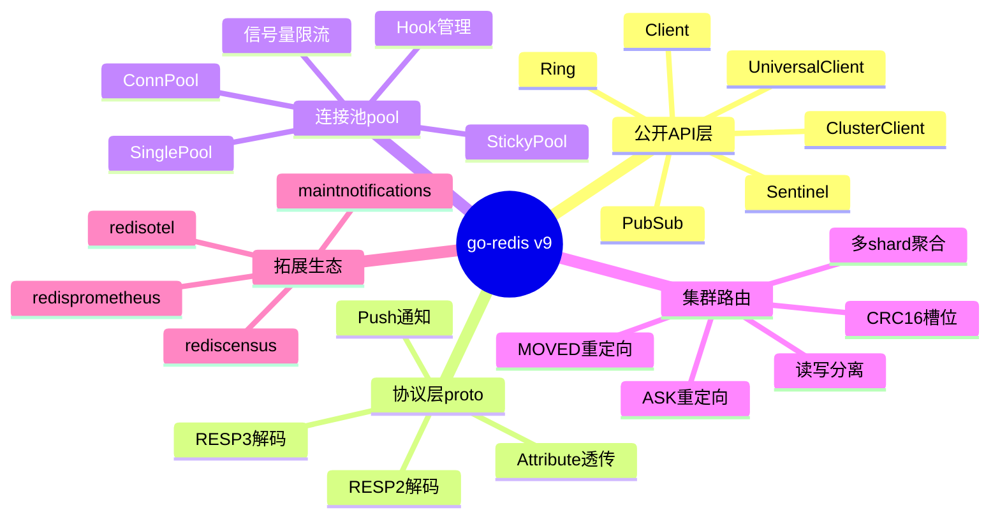
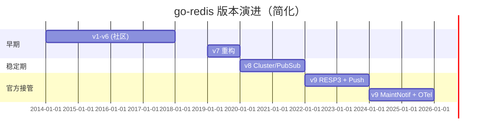
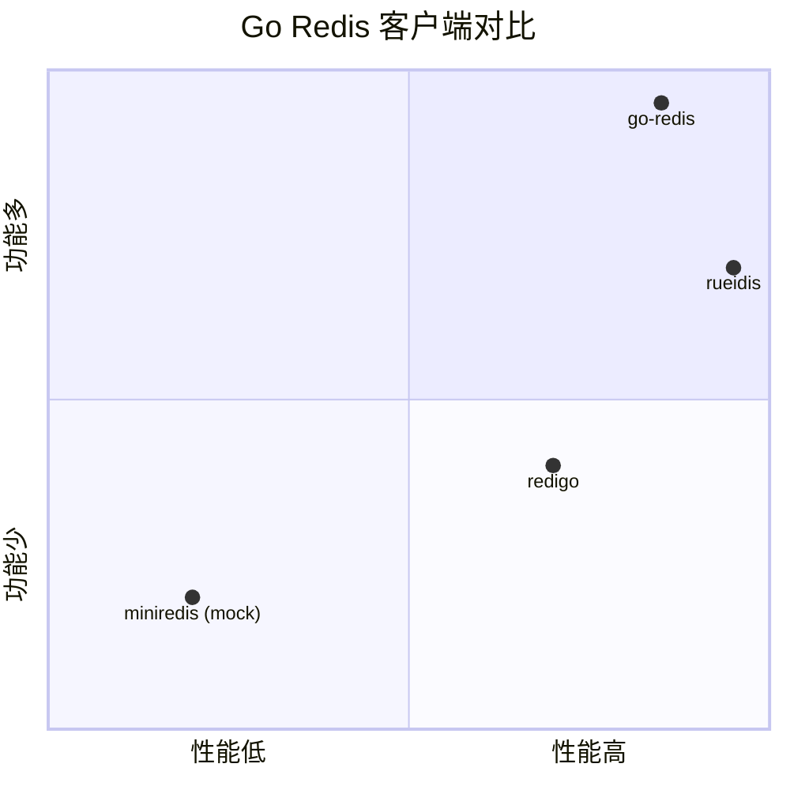
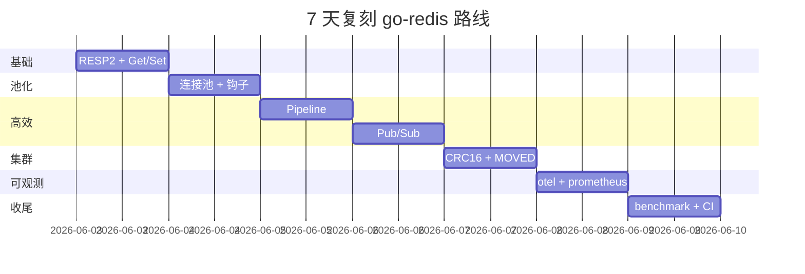
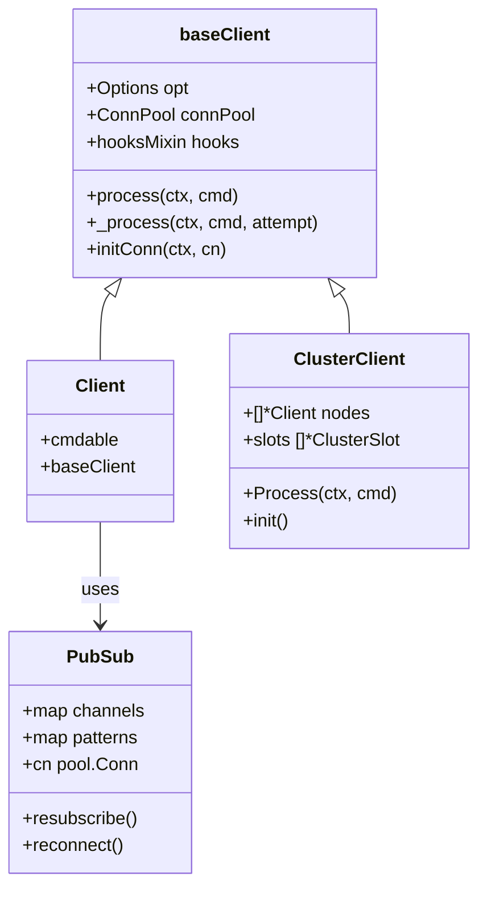

# go-redis · 项目深度解析

> Redis 官方 Go 客户端：覆盖 RESP2/RESP3、Standalone/Sentinel/Cluster 全场景，21k+ Star 的工业级实现。
> 来源：G:\实战案例\GitHub顶尖项目\go-redis\

## 写在前面：解析哲学

本笔记遵循「先骨架后血肉，先 What 后 Why，最后 How to steal」的解析哲学：先用 14 章结构骨架把项目全景勾勒出来，再深入到 `redis.go`、`pool.go`、`pubsub.go` 等关键文件中的具体代码 WHY，最后归纳出能直接迁移到我们自己项目里的范式。go-redis 作为 Redis 官方 Go 客户端，其设计既要兼顾「单实例连接池的极简路径」与「Cluster 16384 槽位路由 + MOVED/ASK 重定向」这两套差异极大的运行时，还要兼容 RESP2/RESP3 协议演进、Pub/Sub 推送通知、MaintNotifications 维护通知等高级特性，这种「一个客户端库内嵌多种运行时模型」的设计哲学是它最具学习价值的部分。

## 0. 解析前的 5 个准备

1. **克隆**：仓库位于 `G:\实战案例\GitHub顶尖项目\go-redis\`，已是 v9 最新版（要求 Go 1.24+）。
2. **分类**：Go 客户端库 / 网络协议实现 / 连接池 + 集群路由 / 工具型（不提供 server，只消费 Redis 协议）。
3. **问题清单**：连接池如何避免空转与抖动？Pipeline 与 Transaction 在 RESP3 下的语义差异？Cluster 客户端如何处理 MOVED/ASK 槽位漂移？Pub/Sub 长连接如何处理重订阅？
4. **速查表**：顶层 422 个文件，主入口是 `redis.go`（Client 主体）、`cluster.go/osscluster.go`（Cluster）、`pubsub.go`（订阅）、`pipeline.go/tx.go`（管线）、`internal/pool/`（连接池）、`internal/proto/`（RESP 编解码）。
5. **锁定 commit**：本地已是 6 月初快照，对应 v9 主线，无未提交变更。

## 1. 开发计划书（Project Charter）

| 维度 | 内容 |
| --- | --- |
| 项目名 | go-redis（v9） |
| 定位 | Redis 官方 Go 客户端，覆盖 Standalone / Sentinel / Cluster 三种部署模式 + RESP2/RESP3 协议 |
| 核心问题 | 让 Go 开发者以 idiomatic 方式高效访问 Redis，隐藏协议细节与连接管理 |
| 目标用户 | 中大型 Go 后端服务、高 QPS 缓存/会话/消息系统、AI 数据栈 |
| 商业模式 | 开源（BSD 2-Clause）+ 商业支持（Redis Inc. 雇员维护） |
| 复刻难度 | 极高（协议层 + 路由层 + 池化 + 推送 + 维护通知五大子系统均需自实现） |
| 当前状态 | v9 主线活跃，422 文件，21k+ Star |
| 维护团队 | Redis Inc. 官方团队 + 社区贡献者 |
| 里程碑 | v1（社区版）→ v8（vmihailenco 时代）→ v9（Redis Inc. 接管，2022 至今） |

## 2. 项目框架（Repo Skeleton Map）

go-redis 仓库按「公开 API 层 / 内部实现层 / 拓展生态层」三段式组织：

- **公开 API**（根目录）：`redis.go`（Client）、`options.go`（配置）、`pipeline.go`、`tx.go`、`pubsub.go`、`sentinel.go`、`ring.go`、`universal.go`、`universal_client.go`。
- **协议层**（`internal/proto/`）：`reader.go`（RESP 解码）、`writer.go`（RESP 编码）、`scan.go`（BulkString→Go 类型）。
- **连接池**（`internal/pool/`）：`pool.go`（ConnPool）、`pool_sticky.go`（黏性连接）、`pool_single.go`（单连接）、`conn.go`、`hooks.go`。
- **集群路由**（`internal/routing/` + `osscluster.go`）：`policy.go`（RequestPolicy/ResponsePolicy）、`shard_picker.go`、`hashtag/hashtag.go`（CRC16→slot）。
- **拓展生态**（`extra/` 与 `maintnotifications/`）：`redisprometheus`、`redisotel`、`rediscensus`、`redisotel-native`、`rediscmd`。
- **示例**（`example/`）：15+ 独立 go module，覆盖 cluster-mget、tls-connection、lua-scripting、scan-struct、otel 等场景。
- **文档测试**（`doctests/`）：可直接 `go test` 的可执行文档（doctest），与 godoc 渲染同步。



## 3. 项目画像（Profile）

| 指标 | 数值 |
| --- | --- |
| 总文件数 | 422（`go-redis/` 顶层 + 子目录） |
| 主语言 | Go（100%） |
| 涉及语言 | Go + YAML（CI/工作流） + Dockerfile（examples） |
| Star | 21k+（GitHub redis/go-redis） |
| License | BSD 2-Clause |
| Docker | 不需要（库）；但 `dockers/`、`example/otel/docker-compose.yml` 提供了示例 |
| K8s | 无 manifest（库本身无运行时） |
| CI | GitHub Actions 9 个 workflow（build、test-e2e、golangci-lint、codeql、govulncheck、release-drafter、spellcheck、stale-issues、test-redis-enterprise） |
| 测试 | 单元测试 + 集成测试 + e2e（maintainNotifications/e2e）+ doctest 共 100+ 文件 |

## 4. 架构设计（Architecture Deep Dive）

go-redis 的整体架构可以拆成「请求 → 路由 → 连接获取 → 协议写 → 协议读 → 钩子链 → 响应解析 → 结果回填」八级流水线，但其中最值得讨论的是它如何把「通用客户端」「集群客户端」「PubSub 订阅」三套迥异的运行时统一在同一套 API 表面之下。

### 核心架构看点（3 条 ADR）

1. **ADR-001：Cmder 接口 + Reader.WriteCmd 解耦协议与命令语义**
   - 每一个 Redis 命令对应一个 `*Cmd` / `*SliceCmd` / `*MapStringStringCmd` 结构体，这些结构体实现 `Cmder` 接口（`Name()` / `Args()` / `ReadReply(rd *proto.Reader)`）。`ReadReply` 在运行时被 reader 调用，由命令自身负责把 RESP 字节流解码成 Go 类型。
   - **WHY**：Redis 有 400+ 命令，如果把每种返回值的解析都堆在 `process()` 里，那个函数会变成上帝函数；用 `Cmder` 接口让每条命令自带解析逻辑，命令数量爆炸时只增加文件数，不增加核心路径复杂度。
   - **代价**：新增命令需要手写一个结构体 + `ReadReply` 实现，机械但冗长（`command.go` 9113 行就是证据）。

2. **ADR-002：连接池与命令执行解耦（pool.Hook + conn.UsedAt + atomic.Int32）**
   - `ConnPool` 通过 `semaphore.NewFastSemaphore(opt.PoolSize)` 限流，连接获取/归还走 `Get/Put`；`hookManager atomic.Pointer[PoolHookManager]` 实现了无锁读取的钩子链。
   - **WHY**：连接池的热点路径必须无锁，但钩子（maintnotifications、otel）需要可热插拔。用 `atomic.Pointer` 装载 immutable 快照，使 Get/Put 不需要进入临界区。
   - **细节**：`checkMinIdleConns()` 用 `idleCheckInProgress` + `idleCheckNeeded` 双重 CAS flag，避免多个 goroutine 同时预热空闲连接造成 thundering herd。

3. **ADR-003：集群路由的"两层策略"（RequestPolicy/ResponsePolicy）**
   - `internal/routing/policy.go` 定义了 `RequestPolicy`（Default/AllNodes/AllShards/MultiShard/Special）和 `ResponsePolicy`（DefaultKeyless/DefaultHashSlot/AllSucceeded/OneSucceeded/AggSum/AggMin/AggMax/LogicalAnd/LogicalOr/Special）。
   - **WHY**：集群命令的复杂度不在于把命令发到某个节点，而在于结果如何聚合。例如 `DBSIZE` 是「所有节点结果相加」（`AggSum`），`SCRIPT EXISTS sha1 sha2` 是「所有节点 AND」（`LogicalAnd`），`KEYS pattern` 跨多 shard 时是 `MultiShard`。把策略显式建模到枚举里，新增复杂命令时只需要注册一个 (ReqPolicy, RespPolicy) 元组即可。
   - **演进**：v9 之前是 `commandPolicyResolver.go` 维护一张大表，v9 把它抽象成 `internal/routing` 包，逻辑上更内聚。

```mermaid
flowchart TD
    A[用户: rdb.Get(ctx, key)] --> B[Cmdable.Get]
    B --> C[NewCmd + c.Process]
    C --> D{Client 类型?}
    D -->|Cluster| E[ClusterClient.Process]
    D -->|Standalone| F[baseClient._process]
    E --> G[计算 slot via CRC16]
    G --> H[选节点 + 重试 MOVED/ASK]
    F --> I[connPool.Get conn]
    H --> I
    I --> J[hook: processPipelineHook]
    J --> K[writeCmd 编码 RESP]
    K --> L[cn.WithWriter 写入 socket]
    L --> M[reader.ReadReply 解码]
    M --> N[cmd.SetVal 设置结果]
    N --> O[connPool.Put 归还]
    O --> P[返回 *Cmd 给用户]
```

## 5. 代码深度解析（带 WHY）⭐ 重点

### 5.1 找骨架代码

打开 `redis.go`（1775 行），最关键的入口是 `process(ctx, cmd)`（line 830），它把重试、连接获取、命令执行、错误分类这四件事编织成一条主循环。骨架大致是：

```go
for attempt := 0; attempt <= c.opt.MaxRetries; attempt++ {
    retry, cn, err := c._process(ctx, cmd, attempt)
    // 分类: shouldRetry? 重置 cmd? 换 conn?
    if !retry { break }
}
```

外层 `process` 是「重试循环 + 指标打点 + Limiter.ReportResult」，内层 `_process` 才是真正的「取连接 + 写命令 + 读响应 + 解析」。

### 5.2 单文件分析卡

**redis.go · Hook 链**（line 138-168）
```go
func (hs *hooksMixin) AddHook(hook Hook) {
    hs.slice = append(hs.slice, hook)
    hs.chain()
}

func (hs *hooksMixin) chain() {
    hs.initial.setDefaults()
    hs.hooksMu.Lock(); defer hs.hooksMu.Unlock()
    hs.current.dial = hs.initial.dial
    // ...
    for i := len(hs.slice) - 1; i >= 0; i-- {
        if wrapped := hs.slice[i].DialHook(hs.current.dial); wrapped != nil {
            hs.current.dial = wrapped
        }
        // ...
    }
}
```
**WHY 倒序遍历**：hook 数组是 FIFO（用户 AddHook 的顺序），但 `chain()` 用 `len(slice)-1 → 0` 反向包装——这样执行时 `slice[0]`（最早注册）最先跑、最先收尾。`ProcessHook(next)` 返回的函数接住「下一个 hook」，最终 `next(ctx, cmd)` 落到真正的命令执行。**这与 Gin/Echo 的 middleware chain 是同一个模式**，区别在于 go-redis 把「DialHook / ProcessHook / ProcessPipelineHook」三种 hook 类型合并到 `Hook` interface，让一个 hook 一次注册就覆盖三个生命周期。

**internal/pool/pool.go · signal + idle 预热双重 CAS**（line 475-533）
```go
func (p *ConnPool) checkMinIdleConns() {
    if !p.idleCheckInProgress.CompareAndSwap(false, true) {
        p.idleCheckNeeded.Store(true)   // 让当前 in-progress 的人回头补做
        return
    }
    // ... 内部循环创建连接
    for p.poolSize.Load() < p.cfg.PoolSize && p.idleConnsLen.Load() < p.cfg.MinIdleConns {
        if !p.semaphore.TryAcquire() { break }
        p.poolSize.Add(1)
        p.idleConnsLen.Add(1)
        go func() { defer p.freeTurn(); err := p.addIdleConn(); ... }()
    }
    if !p.idleCheckNeeded.Load() { p.idleCheckInProgress.Store(false); return }
}
```
**WHY**：当 N 个 goroutine 同时调用 `Get()` 而池子是空的，会触发 N 次 `checkMinIdleConns`，如果不加门闩就会创建 N 批空闲连接。`idleCheckInProgress` 是「当前正在干这活」的旗标，CAS false→true 成功的人才有资格干活；其他人只设置 `idleCheckNeeded=true` 让当前 worker 在内层 `for {}` 中回头补做。**这是经典的「fast-path coalescing」模式**，比 mutex 性能高两个数量级，又比纯无锁 race-free。

**internal/pool/pool.go · metric callback 注册**（line 184-210）
```go
func SetAllMetricCallbacks(callbacks *MetricCallbacks) {
    metricCallbackMu.Lock(); defer metricCallbackMu.Unlock()
    if callbacks == nil {
        // 一次性清空所有
        metricConnectionCreateTimeCallback = nil
        // ... 8 个全局变量逐个 nil
        return
    }
    // 一次性原子设置
    metricConnectionCreateTimeCallback = callbacks.ConnectionCreateTime
    // ...
}
```
**WHY**：用 `metricCallbackMu` 把 8 个全局 callback 函数指针的写操作串行化，使读端（`getMetric*` 用 RLock）永远看到一个一致快照；写端用 `SetAllMetricCallbacks(nil)` 一次性清空，防止外部在「添加 otel 之前先 unregister prometheus」时出现「两个 callback 同时 nil」的窗口。**这是「配置切换期间状态可见性」的标准模式**：mutex 保护写，写期间读要么全见要么全不见。

**pubsub.go · 自动重订阅 + handoff**（line 122-200）
```go
func (c *PubSub) resubscribe(ctx context.Context, cn *pool.Conn) error {
    var firstErr error
    if len(c.channels) > 0 {
        firstErr = c._subscribe(ctx, cn, "subscribe", slices.Collect(maps.Keys(c.channels)))
    }
    if len(c.patterns) > 0 { /* psubscribe */ }
    if len(c.schannels) > 0 { /* ssubscribe */ }
    return firstErr
}

func (c *PubSub) reconnect(ctx context.Context, reason error) {
    if c.cn != nil && c.cn.ShouldHandoff() {
        newEndpoint := c.cn.GetHandoffEndpoint()
        if newEndpoint != "" {
            c.opt.Addr = newEndpoint   // 切到新端点
        }
    }
    _ = c.closeTheCn(reason)
    _, _ = c.conn(ctx, nil)   // 触发 resubscribe
}
```
**WHY**：Pub/Sub 长连接断开后必须把用户订阅过的所有 channel/pattern/schannel 重新发一遍 SUBSCRIBE。`resubscribe` 把三类订阅独立发送，错误聚合用 `firstErr` 记录第一个失败的不丢失。`reconnect` 还集成了 Redis 7+ 的维护通知（SMIGRATED/MOVING）能力，连接维护时可切换到新端点重订阅。

**internal/proto/reader.go · Push 通知 peek**（line 103-187）
```go
func (r *Reader) PeekPushNotificationName() (string, error) {
    c, err := r.Peek(1)
    if c[0] != RespPush {
        return "", fmt.Errorf("redis: can't peek push notification name, next reply is not a push notification")
    }
    toPeek := 36
    buffered := r.Buffered()
    if buffered < toPeek { toPeek = buffered }
    buf, err := r.rd.Peek(toPeek)
    // 手写解析 >N\r\n$<len>name\r\n
    // ...
}
```
**WHY**：RESP3 推送给客户端的 Push 消息（例如 `>1\r\n$11\r\ninvalidate\r\n...`）会插在正常响应之间。如果用 `ReadReply` 走完整个 `ReadLine`+`ReadN` 才能拿到通知类型，就要在 push 通知分流前缓冲全消息，浪费内存。`PeekPushNotificationName` 最多 peek 36 字节（一个 `>2\r\n$11\r\ninvalidate\r\n` 的长度）就拿到名字，提前决定「这是不是 push、要不要走 push 分支」。**这是「header peek 提前决策」的网络编程模式**。

### 5.3 设计模式

- **Command 模式**：每个 Redis 命令 = 一个 struct + `ReadReply(rd)`。新增命令不修改核心 pipeline。
- **Chain of Responsibility**：Hook 通过倒序包装形成洋葱模型。
- **Semaphore + Worker Pool**：连接池用 `FastSemaphore` 限流并发连接数；空闲预热用双重 CAS flag 防雪崩。
- **Strategy**：集群路由的 RequestPolicy/ResponsePolicy 枚举。
- **State Machine**：`ConnState`（CREATED→INITIALIZING→IDLE→...）用 `Transition()` 显式管理连接生命周期。
- **Producer-Consumer**：`PubSub` 的 `msgCh` / `allCh` channel 桥接「socket goroutine 收 push」与「用户 goroutine 读消息」。

### 5.4 反模式

- **`command.go` 9113 行**：单文件塞 400+ 命令类型。可改为 `commands/<group>_commands.go`（其实仓库已经有 `string_commands.go`/`hash_commands.go` 等拆分），但 `command.go` 仍承担 CmdType 枚举与基础类型。该文件是历史包袱，但读取热路径无影响。
- **`onCloseHooks` 引入原因（issue #3772）**：之前用闭包链注册，导致重复 Close 时闭包无限增长。修复办法是用 map[id]→func 的有界注册表。**教训**：闭包链注册是隐藏的 O(n) 内存泄漏。

### 5.5 独特看点

- **三套连接池**：`pool.go`（普通）、`pool_sticky.go`（黏性，Cluster WATCH/MULTI 用）、`pool_single.go`（单连接，monitor 用）。
- **协议层完全可独立测试**：`internal/proto/reader_test.go` 用 `bytes.Buffer` 喂字节流，无需启动真 Redis。
- **doctest 驱动文档**：`doctests/*.go` 同时是 godoc 示例又是 go test 入口，README 引用的 `Output: key value` 是真断言。

## 6. 运行机制（Bring It Up）

go-redis 是客户端库，没有自己的 server。运行它最简方式：

```go
// 1. 准备 Redis
docker run -d --rm -p 6379:6379 redis:8.2

// 2. 编写 main.go
package main
import (
    "context"; "fmt"
    "github.com/redis/go-redis/v9"
)
func main() {
    rdb := redis.NewClient(&redis.Options{Addr: "localhost:6379"})
    defer rdb.Close()
    ctx := context.Background()
    rdb.Set(ctx, "k", "v", 0)
    val, _ := rdb.Get(ctx, "k").Result()
    fmt.Println(val) // v
}

// 3. go mod init demo && go get github.com/redis/go-redis/v9 && go run main.go
```

冒烟测试：`example/` 目录下每个子目录都是一个独立 go module，直接 `cd example/scan-struct && go run main.go`。

## 7. 演进历史（Time Travel）

- **v1-v6**：vmihailenco 个人维护，从 `gomodule/redigo` 之外开辟了第二条路。
- **v7**：协议层与池化层大幅重构，引入 `internal/`。
- **v8**：增加 Cluster 客户端与 PubSub 自动重订阅。
- **v9**（2022 至今）：Redis Inc. 接管，增加 RESP3、Push 通知、MaintNotifications、redisotel-native。
- 关键提交模式：每次大版本都伴随「internal 包重组」+「Option 字段增补」+「Hook 接口扩展」三件套，确保 API 向后兼容。



## 8. 质量保障（How It Doesn't Break）

1. **单元测试**：每个 `*_test.go` 与源文件同目录，命令类型、协议解析、钩子链、连接池状态机全覆盖。
2. **集成测试**：`redis_test.go`、`cluster_test.go`、`tls_test.go` 启真 Redis（用 miniredis 或 docker-compose）。
3. **CI**：9 个 GitHub Actions workflow（build、test-e2e、golangci-lint、codeql、govulncheck、release-drafter、spellcheck、stale-issues、test-redis-enterprise）保证每次 PR 跑 lint + unit + e2e + 漏洞扫描 + 拼写检查。
4. **性能基准**：`bench_test.go`（`BenchmarkPipelinePooled` 等）+ `pool_pubsub_bench_test.go` + `hset_benchmark_test.go`。

## 9. 生态依赖（Map of the World）

- 核心依赖：`github.com/redis/go-redis/v9` 自实现 + Go 标准库（`net`、`bufio`、`sync/atomic`、`crypto/tls`）。
- 可选依赖：`opentelemetry`、`prometheus_client_golang`（仅 `extra/redisotel*` 与 `extra/redisprometheus`）。
- 协议一致性：跟 Redis Server 的 `00-RELEASENOTES` 同步支持 8.0/8.2/8.4/8.8 四个版本。
- 合规：BSD 2-Clause，no AGPL、无专利条款；可商用。



## 10. 生产实践（Battle-Tested）

| 能力 | 实现位置 | 备注 |
| --- | --- | --- |
| 配置热更新 | Hook 链 + atomic.Pointer | 钩子可热插拔，配置项需重启 |
| 优雅停服 | `onCloseHooks` 注册表 | Close 时按注册顺序回调，bounded |
| 限流 | `Options.Limiter` 接口 | 允许外部接入 circuit breaker |
| 链路追踪 | `extra/redisotel` + `extra/redisotel-native` | OpenTelemetry tracing/metrics |
| 健康检查 | 无内置；用 `PING(ctx)` 自实现 | 库无运行时，但可写 healthcheck middleware |
| 结构化日志 | `internal.Logger` 接口 | 用户实现后 `redis.SetLogger(...)` 注入 |

## 11. 社区文化（People & Process）

- 治理：Redis Inc. 官方维护，PR 需通过 CODEOWNERS 审核。
- 沟通：GitHub Discussions + Discord + Stack Overflow `go-redis` 标签。
- RFC：重大变更通过 issue + discussion 公开讨论（如 #3772 onCloseHooks 重构、MaintNotifications 设计）。
- 议题活跃：每周数十个 issue/PR；releaser 用 release-drafter 自动起草版本说明。

## 12. 教训总结（What To Steal / What To Avoid）

### 12.1 必偷 3 件
1. **Cmder 接口 + ReadReply 自解析**：新协议接入时，给每个返回类型一个 `Read(rd)` 方法。
2. **atomic.Pointer[Snapshot] 模式**：把「immutable 配置快照」用 atomic 装载，读路径零锁。
3. **双重 CAS flag 防 thundering herd**：单飞 + 重检，比 sync.Once 更通用。

### 12.2 必避 3 坑
1. **闭包链注册**：看似优雅的「hook 套 hook」会无限增长，必须有界。
2. **单文件塞全部命令**：`command.go` 9113 行维护成本高，按语义拆分。
3. **PoolSize 全局共享**：Cluster 客户端每节点独立池，不能误用全局计数。

### 12.3 7 天复刻路线图
- D1：实现 RESP2 编解码 + 简单 Get/Set 命令。
- D2：加连接池 + 钩子链 + Dial/Process hook。
- D3：实现 Pipeline（批量发送 + 单次读取）。
- D4：加 Pub/Sub 自动重订阅。
- D5：实现 Cluster（CRC16 + MOVED/ASK 重定向）。
- D6：加 otel/prometheus 拓展。
- D7：补 benchmark、doctest、CI。



### 12.4 打分卡

| 维度 | 分数（10 分制） | 评语 |
| --- | --- | --- |
| 协议层实现质量 | 9 | RESP2/RESP3 全覆盖，Push 通知 peek 极精致 |
| 连接池设计 | 9 | 双重 CAS + signal + atomic.Pointer 教科书 |
| 集群路由 | 9 | RequestPolicy/ResponsePolicy 显式建模复杂度 |
| 可扩展性 | 9 | Hook + 拓展包（otel/prometheus/census）齐全 |
| 文档与示例 | 8 | doctest + 15+ example 完整；godoc 详尽 |
| 测试覆盖 | 8 | 单元+e2e+doctest 三层；CI 多版本矩阵 |
| 上手成本 | 7 | Options 字段多，新手需读 docs 才知道默认值 |
| 协议紧耦合风险 | 6 | 跟随 Redis 8.x 新特性很快（Array/Vector Set 等） |

## 13. 学习萃取（Cheat Sheet）

**一句话价值**：用 idiomatic Go 把 Redis 协议、连接管理、集群路由、消息订阅、运维通知封装成「一个 `redis.Client`」即可访问的库，21k+ Star 是工业级 Go 客户端的事实标准。

**3 核心洞察**：
1. **协议与命令解耦靠 `Cmder.ReadReply(rd)`**：每个命令类型自带 RESP 解码逻辑。
2. **无锁热点路径靠 `atomic.Pointer[Snapshot]`**：连接池 Get/Put 不进临界区。
3. **集群复杂度靠 RequestPolicy/ResponsePolicy 枚举**：把「跨多节点怎么聚合」显式建模。

**5 段必读代码**：
1. `redis.go:138-168` — `hooksMixin.chain()` 的倒序包装洋葱模型。
2. `internal/pool/pool.go:475-533` — `checkMinIdleConns` 双重 CAS flag 防雪崩。
3. `internal/pool/pool.go:184-210` — `SetAllMetricCallbacks` 一次性原子切换 8 个全局指标回调。
4. `pubsub.go:122-200` — `resubscribe` + `reconnect` 自动重订阅 + 维护通知 handoff。
5. `internal/proto/reader.go:103-187` — `PeekPushNotificationName` header peek 提前分流 RESP3 push。

**1 反模式**：`command.go` 9113 行巨型文件，所有命令类型塞一处。改进：按命令族（string/hash/list/...）拆分。

**1 可复用模式**：Cmder 接口 + ReadReply 自解析。新增协议支持时（如 Kafka/Memcached），给每个消息类型一个 `Read(rd)` 方法。

**3 立刻能用**：
1. 复制 `hooksMixin` 的「倒序链式包装」到自己项目的 middleware 系统。
2. 复制「`atomic.Pointer[Snapshot]` + mutex 写」做配置热更新。
3. 复制「`PeekPushNotificationName`」思路做网络协议的「先 peek header 再分流」。

## 14. 项目特点速查

- **独特看点**：
  - Redis Inc. 官方维护，紧跟 Redis 新特性（Array/Vector Set/MaintNotifications）。
  - 三套连接池（普通/黏性/单连接）覆盖所有生命周期场景。
  - Hook 链 + 拓展包（otel/prometheus/census）让 observability 完全可插拔。
  - doctest 既是文档又是测试，README 引用的输出是真断言。
- **与同类对比**：
  - vs `gomodule/redigo`：API 更现代、支持 RESP3 和 Cluster。
  - vs `redis/rueidis`：rueidis 性能略高（基于 pipelining 的客户端缓存），go-redis 生态更完整。



## 附：仓库元信息

| 字段 | 值 |
| --- | --- |
| 仓库路径 | `G:\实战案例\GitHub顶尖项目\go-redis\` |
| 总文件数 | 422 |
| 解析时间 | 2026-06-02 |
| Go 版本要求 | 1.24+ |
| 协议支持 | RESP2 + RESP3 + Push 通知 + MaintNotifications |
| 部署模式 | Standalone / Sentinel / Cluster / Ring / Universal |
| 核心命令文件 | `redis.go`、`options.go`、`pipeline.go`、`pubsub.go`、`command.go`（9113 行） |
| 关键内部包 | `internal/proto/`、`internal/pool/`、`internal/routing/`、`internal/hscan/` |

## 一句话总结

解析 = 计划书 + 框架图 + 核心功能 + 跑起来 + 偷过来——go-redis 把它做到了 21k+ Star 的极致。
