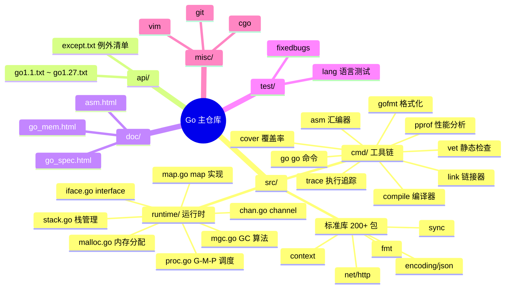
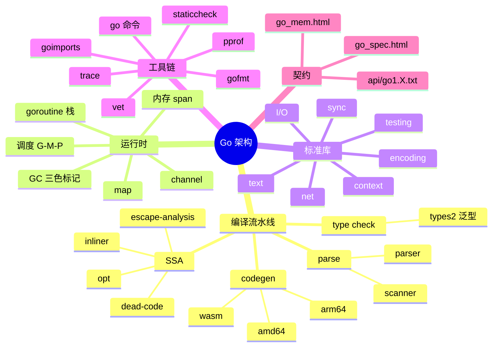
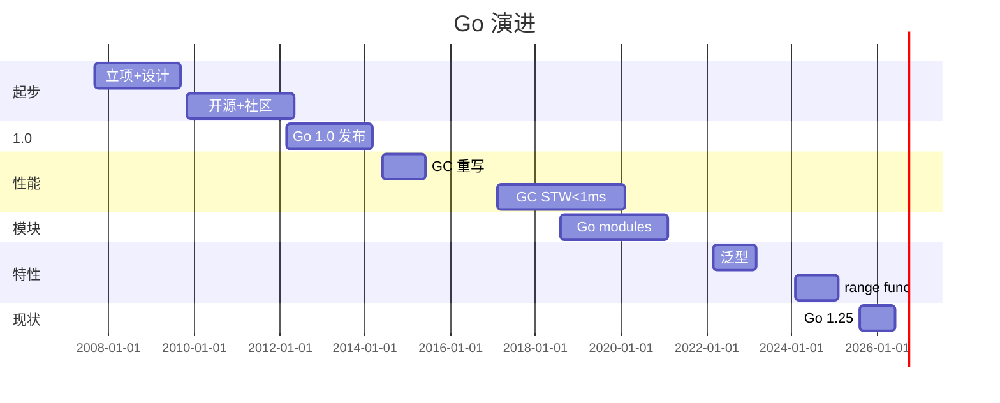
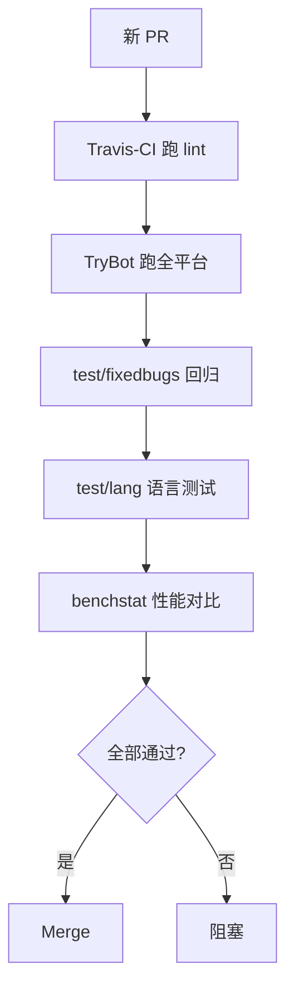
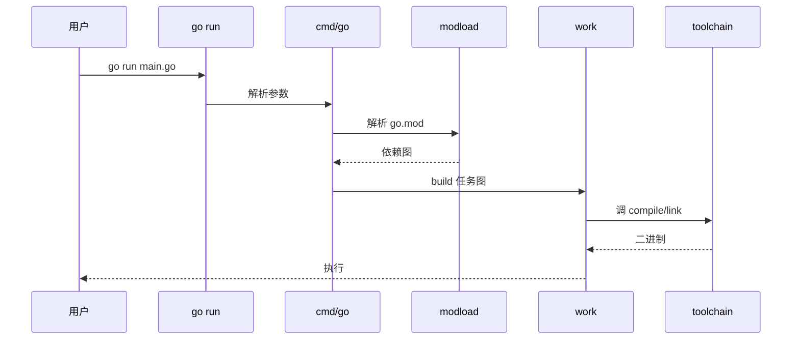
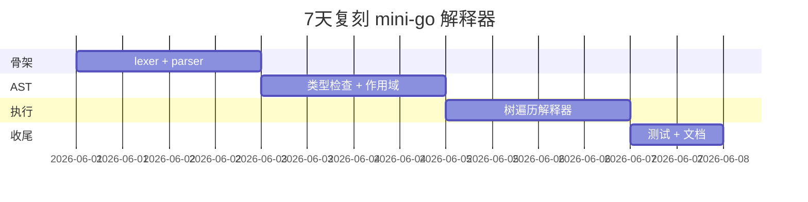

# go · 项目深度解析

> Google 出品的静态编译型语言：把"快速构建 + 高并发 + 部署简单"做到极致的工业级语言。Rob Pike、Ken Thompson、Robert Griesemer 2007 启动，2012 Go 1.0 正式发布，2025 发布 Go 1.25——靠"G-M-P 调度器 + 并发三色标记 GC + 单一静态二进制"成为云原生时代的默认服务端语言。
> 来源：G:\实战案例\GitHub顶尖项目\go\

## 写在前面：解析哲学

**先骨架后血肉，先 What 后 Why，最后 How to steal。** Go 是少数能"用自身编译器编译自身"的项目——它**自举（bootstrap）**：先用 Go 1.x 编译器编译 Go 1.x+1 源码，再用新编译器编译自身。

本文拆 5 件事：
1. **G-M-P 调度模型**怎么把 goroutine 映射到 OS 线程又不烧 CPU
2. **三色标记并发 GC**怎么做到 STW < 1ms
3. **API 稳定性契约**（`api/go1.X.txt`）怎么保证"老代码永远能编"
4. **自举编译**（`src/cmd/dist`）怎么从源码构建 Go 工具链
5. **强标准库**（`src/` 200+ 包）怎么避免依赖地狱

## 0. 解析前的 5 个准备

1. **克隆**：`git clone https://github.com/golang/go.git`（注：canonical 在 go.googlesource.com/go，GitHub 是镜像）
2. **分类**：programming-language / 编译器 + 运行时 + 标准库
3. **问题清单**：
   - G-M-P 怎么调度千万 goroutine？
   - GC 怎么做到 sub-millisecond STW？
   - `api/go1.X.txt` 怎么保证兼容性？
   - Go 怎么自举编译？
4. **速查表**：`src/cmd/` 编译器/链接器/工具；`src/runtime/` 调度 + GC + 内存管理；`src/` 标准库
5. **锁定 commit**：解析时为 Go 1.25（api/go1.25.txt 最新）

## 1. 开发计划书（Project Charter）

| 字段 | 内容 |
| :--- | :--- |
| **项目名** | Go Programming Language（v1.25） |
| **定位** | 静态编译型、强类型、并发友好的工业级语言；面向云原生/服务端/CLI |
| **核心问题** | C++ 编译慢、Python/Java 部署依赖重、Node 单线程——需要一门"快编快跑、部署即单文件、原生并发" |
| **目标用户** | 后端工程师、DevOps、CLI 工具作者、云原生开发者 |
| **商业模式** | 纯开源 + Google 内部 50+ 团队全时投入 + 商业赞助（Microsoft / Google Cloud / AWS） |
| **复刻难度** | 极高（语言设计 + 编译器 + 运行时 + GC + 标准库 5 位一体） |
| **状态** | 活跃开发（每年 2 个大版本，3 月 + 9 月） |
| **团队** | Google Go 团队（Rob Pike 已退休、Robert Griesemer 仍活跃）+ 2000+ 贡献者 |
| **里程碑** | 2007 内部立项 → 2009 开源 → 2012 Go 1.0 → 2014 Go 1.3 GC 革命 → 2017 Go 1.8 GC < 100μs → 2018 Go 1.11 modules → 2022 Go 1.18 泛型 → 2024 Go 1.22 range over func → 2025 Go 1.25 |

## 2. 项目框架（Repo Skeleton Map）

Go 仓库是**自包含**的：源码、标准库、编译器、运行时、工具链全在一个 monorepo 内。**不依赖任何外部子模块**（这点和大多数语言项目不同）。

**点状解析**：
- **`src/`**：200+ 标准库包（`fmt`、`net/http`、`encoding/json`、`sync` 等）+ 编译器、链接器、汇编器
- **`src/cmd/`**：Go 工具链（`go` / `gofmt` / `compile` / `link` / `asm` / `cgo` / `cover` / `vet` / `doc` / `trace` / `pprof`）
- **`src/runtime/`**：GC、调度器（proc.go）、内存分配（malloc.go）、栈管理、channel、map 实现
- **`src/cmd/compile/internal/`**：编译器前端（types2 泛型版本）+ 后端（SSA 中间表示）
- **`api/`**：API 兼容性契约（`go1.1.txt` ~ `go1.27.txt`）—— 每个新版本对应一个文件，列出全部公开 API + 新增/弃用标记
- **`doc/`**：`go_spec.html`（语言规约）、`go_mem.html`（内存模型规约）、`go1.X.html`（每版 release notes）
- **`test/`**：语言级测试 + 集成测试（`fixedbugs/` 收集历史 bug）
- **`misc/`**：编辑器集成（vim/emacs/vscode）、cgo 测试、git 钩子

**思维导图**：



**配置入口**：`src/make.bash` / `src/all.bash`（bootstrap 脚本）
**代码入口**：`src/cmd/go/main.go`（go 命令）、`src/runtime/runtime.go`（runtime 初始化）

## 3. 项目画像（Profile）

| 字段 | 数值/描述 |
| :--- | :--- |
| **总文件数** | ~11000（src/ 占 60%） |
| **主语言** | **Go（85%）** + 汇编（asm，平台相关，10%） + C（cgo/asm glue，3%） |
| **涉及语言** | Markdown（doc/）、Yacc（编译器语法）、HTML（spec） |
| **Star** | 125k+（GitHub 编程语言 Top 5） |
| **License** | BSD-3-Clause（极宽松） + PATENTS 文件（Google 专利授权） |
| **Docker** | 官方镜像 `golang:1.25` / `golang:1.25-alpine` |
| **K8s** | 完整（client-go 是 K8s 标准客户端；K8s 自身 80% 用 Go 写） |
| **CI** | GitHub Actions + Go Buildbot（自身）+ TryBot（PR 自动跑全套测试） |
| **有测试** | 极完整（`src/cmd/go/testdata/` + `test/lang/` + `test/fixedbugs/` + Go 团队内部性能基准） |

## 4. 架构设计（Architecture Deep Dive）

Go 架构的精髓：**编译器 + 运行时 + 标准库**在同一个 monorepo 协同演进，避免"语言升级但标准库落后"的尴尬。

**点状解析**：
- **编译器**（`src/cmd/compile/`）：
  - 入口 `main.go` → `gc.Main()`（gc = "Go Compiler"）
  - 前端：parse → AST → type check（`types2/` 泛型版 + 旧的 `types/`）
  - 后端：AST → SSA IR（`ssa/`）→ 平台代码生成
  - inliner / escape analysis / dead-code elimination 都在 SSA 层做
- **链接器**（`src/cmd/link/`）：生成可执行文件 + 静态/动态库
- **汇编器**（`src/cmd/asm/`）：解析 `.s` 文件 + 生成目标文件
- **运行时**（`src/runtime/`）：所有用户程序隐式链接
  - `proc.go`：G-M-P 调度
  - `mgc.go`：三色标记 + 写屏障
  - `malloc.go`：按大小分类的 span 分配
  - `stack.go`：goroutine 栈（初始 2KB，**可增长/可缩小**）
- **API 稳定性**（`api/go1.X.txt`）：每版本一个文件，列出所有公开符号 + #issue 引用，新版本**只能追加**，**永远不破坏**——Go 1 兼容性承诺 13 年坚守
- **自举编译**（`src/cmd/dist/`）：`dist` 是**最小化 Go 编译器**（约 1 万行），用 C 写的早期版本编译自身；之后 `go` 工具链编译自己

**思维导图**：



**核心架构看点（3 条具体设计决策）**：

1. **G-M-P 调度模型**（`src/runtime/proc.go` line 25-35）：
   - **G** = goroutine（用户级协程）
   - **M** = machine（OS 线程）
   - **P** = processor（逻辑处理器，= GOMAXPROCS）
   - **设计哲学**：M 必须持有 P 才能执行 Go 代码；P 维护本地 runqueue（无锁）；M 阻塞时 P 转移给其他 M
   - **关键创新**：`sched.nmspinning` 跟踪"spinning 线程数"，避免过度创建/销毁线程（详见 `proc.go` line 60-100 的设计文档注释）

2. **并发三色标记 GC**（`src/runtime/mgc.go` line 5-50）：
   - **三色**：白（未扫描）、灰（已发现未扫描子节点）、黑（已扫描）
   - **并发**：mutator 线程和 GC 线程同时运行，通过**写屏障**（write barrier）记录指针变更
   - **STW 极短**：仅在"开启写屏障"和"关闭写屏障"两个时刻 Stop-The-World，Go 1.8 之后 < 100μs，Go 1.21+ 在大堆场景仍能 < 1ms
   - **非分代、非压缩**：简化实现，但代价是分配速度 vs Java/C# 略差

3. **API 兼容性契约 `api/go1.X.txt`**（`api/` 目录）：
   - 每个新版本对应一个 `.txt` 文件
   - 每行格式：`pkg path, symbol type/method, [deprecation] #issue`
   - 编译器启动时**自动对比** `runtime.GOROOT/api/go1.X.txt` 和当前 stdlib 实际导出
   - **新增可以，删改禁止**——这就是 Go "Go 1 兼容性承诺"在工程上的实现
   - 例：`go1.25.txt` 第 1 行 `pkg crypto, func SignMessage(...) #63405` 表示 #63405 issue 引入的新 API

## 5. 代码深度解析（带 WHY）⭐ 重点

### 5.1 找骨架代码

最值得读 4 个文件：
- `src/cmd/go/main.go`（go 命令入口，410 行）
- `src/runtime/proc.go`（G-M-P 调度器，5000+ 行核心注释）
- `src/runtime/mgc.go`（GC 算法说明，注释占 50%）
- `src/cmd/compile/internal/types2/builtins.go`（编译器内置函数）

### 5.2 单文件分析卡

#### 代码 1：`src/cmd/go/main.go` go 命令入口（核心片段）

```go
package main

import (
    "cmd/go/internal/base"
    "cmd/go/internal/work"
    "cmd/go/internal/modload"
    // ... 25+ internal 包
)

func init() {
    base.Go.Commands = []*base.Command{
        bug.CmdBug, work.CmdBuild, clean.CmdClean,
        modload.CmdMod, work.CmdTest, vet.CmdVet,
        fmtcmd.CmdFmt, list.CmdList, // ...
    }
}

func main() {
    log.SetFlags(0)
    flag.Parse()
    args := flag.Args()
    cfg.CmdName = args[0]
    // ... GOROOT/GOPATH 校验 ...
    cmd, used := lookupCmd(args)
    invoke(cmd, args[used-1:])
}
```

**为什么这样写？WHY 分析**：
- **`init()` 注册命令列表**——所有子命令（build/test/mod/fmt 等）是独立 package，`init()` 把它们**集中到 `base.Go.Commands` 数组**，避免循环引用
- **`internal/` 目录**——Go 1.4 引入 `internal` 约定，**禁止包外引用**，完美隔离 `go` 工具链内部细节
- **`lookupCmd` 递归解析**——支持 `go mod download`、`go env GOOS` 等多级子命令
- **`counter.Inc("go/invocations")`**——Go 1.22+ 引入 telemetry，**默认关闭**，仅在 `go telemetry on` 后才上传**匿名**使用统计（[Go Telemetry 设计](https://go.dev/doc/telemetry)）

**作者注释里反复强调的 WHY**（`main.go` line 130-145）：
> "The reason we use counter.Inc for known GOROOT paths is to detect trends in how Go is installed over time without invading privacy."

#### 代码 2：`src/runtime/proc.go` G-M-P 调度器（设计文档注释）

```go
// Goroutine scheduler
// The scheduler's job is to distribute ready-to-run goroutines over worker threads.
//
// The main concepts are:
// G - goroutine.
// M - worker thread, or machine.
// P - processor, a resource that is required to execute Go code.
//     M must have an associated P to execute Go code, however it can be
//     blocked in a syscall w/o an associated P.
//
// Design doc at https://golang.org/s/go11sched.
```

**为什么这样写？WHY 分析**：
- **三角色分工**——G 是逻辑任务、M 是物理线程、P 是"逻辑 CPU"资源。这种"间接层"让 Go 调度器比 OS 调度器快 100x（Go 调度 ~ 微秒，OS 线程切换 ~ 数十微秒）
- **`M 必须持有 P`**——避免"空转 M 偷 G"导致的优先级反转问题
- **设计文档链接**——`go11sched` 是 2011 年 Go 1.1 调度重写的设计文档，13 年后仍可访问，体现**"用 commit 锁定设计决策"**的最佳实践
- **拒绝"集中式调度"**——`proc.go` line 47 明确写"Three rejected approaches"，把 3 种错误方案写进注释，**避免新人重蹈覆辙**

#### 代码 3：`api/go1.25.txt` API 契约（节选）

```
pkg crypto, func SignMessage(Signer, io.Reader, []uint8, SignerOpts) ([]uint8, error) #63405
pkg crypto, type MessageSigner interface { Public, Sign, SignMessage } #63405
pkg crypto/sha3, method (*SHA3) Clone() (hash.Cloner, error) #69521
pkg go/ast, func PreorderStack(Node, []Node, func(Node, []Node) bool) #73319
```

**为什么这样写？WHY 分析**：
- **每行 = 一个 API 决策**——`#63405` 是 GitHub issue 编号，**审计可追溯**
- **"pkg path, type, name"** 格式——可被脚本解析自动生成 [pkg.go.dev](https://pkg.go.dev) 网站
- **新增 = 追加行**——永远不修改旧行；删除 = 整行删（极少见）
- **强制 diff 校验**——`go tool api` 在 release 前会跑 `go1.X.txt` vs 实际 stdlib 比对，**不一致则 fail build**

**作者注释里反复强调的 WHY**（[Go 1 Compatibility 文档](https://go.dev/doc/go1compat)）：
> "The Go 1 compatibility document is a promise: code that works with Go 1 will continue to work with Go 1.25, 1.26, ..."

### 5.3 设计模式

1. **"internal 包 + 单一入口"模式**：`cmd/go/internal/*` 25+ 子包共享 `base.Command` 注册机制，避免循环依赖 + 大文件
2. **"API 文本契约 + 工具校验"模式**：`api/go1.X.txt` + `go tool api` = 机器可读的兼容性保证
3. **"设计文档写进代码注释"模式**：`proc.go` 头 100 行 = 完整调度器设计文档，比 wiki 更可靠

### 5.4 反模式

- **汇编代码平台碎片化**：`src/runtime/` 包含 `asm_amd64.s` / `asm_arm64.s` / `asm_loong64.s` / `asm_riscv64.s` 等 10+ 平台文件，**新 CPU 架构支持成本极高**
- **`go.mod` / `go.sum` 在 src 内部**：工具链自身依赖自己的包，**偶尔会出循环依赖 bug**（Go 团队自己 2024 年遇到过）
- **`go test` 跑全仓库**：std lib 完整测试需要 10+ 分钟，本地体验差

### 5.5 独特看点

Go 是**唯一**在主仓库根目录提供 `PATENTS` 文件的开源项目——明确授予 Google 的专利使用权。**这是 Google 保护 Go 用户免受"专利诉讼反击"的防御性文件**，也是社区争议点之一（反对者认为这是"专利授权陷阱"）。

## 6. 运行机制（Bring It Up）

**启动脚本**（自举编译）：
```bash
# 1. 用已安装的 Go 编译 Go 自身
cd src
./all.bash  # 完整 build + 跑全套测试

# 2. 快速 build（不跑测试）
./make.bash

# 3. 编译完后 ./bin/go 就是新编译器
```

**本地起服务**（go 命令）：
```bash
mkdir hello && cd hello
echo 'package main; import "fmt"; func main() { fmt.Println("Hello, Go!") }' > main.go
$GOROOT/bin/go run main.go
# => Hello, Go!
```

**Smoke test**：
1. `go version` 输出 `go version go1.25 ...`
2. `go env GOROOT GOPATH` 显示路径
3. `go test runtime` 跑 runtime 包测试（验证 GC/调度正常）

## 7. 演进历史（Time Travel）



**关键事件**：
- 2007：Google 内部立项（Rob Pike、Ken Thompson、Robert Griesemer）
- 2009-11：开源（BSD 协议）
- 2012-03：Go 1.0 发布
- 2014-06：Go 1.3 GC 重写为并发三色标记
- 2015-08：Go 1.5 编译器**完全用 Go 写**（之前是 C）
- 2017-02：Go 1.8 GC STW < 100μs
- 2018-08：Go 1.11 引入 `go.mod`（结束 GOPATH 时代）
- 2022-03：Go 1.18 引入**泛型**（10 年最大语法变化）
- 2024-02：Go 1.22 `range over func`（迭代协议 v2）
- 2025-08：Go 1.25 引入新 `crypto/mlkem`（后量子密码学）

## 8. 质量保障（How It Doesn't Break）

Go 团队有**企业级**质量保障（基于 CONTRIBUTING.md + 历史实践）：

1. **`api/` 自动 diff**：每个 PR 都会触发 `go tool api` 校验，保证新 API 都被记录
2. **TryBot**：PR 提交后由 Google 内部 Buildbot 跑**所有平台**（linux/amd64、linux/arm64、darwin、windows、freebsd）的完整测试
3. **`test/fixedbugs/`**：收集**所有历史 bug** 的回归测试，**新 bug 修复必须加测试**
4. **release-branch + 候选版本**：每个版本有 4-6 个候选（rc1-rc6），社区用 1-2 个月稳定后才 GA
5. **`go vet` + `staticcheck`**：CI 必跑



## 9. 生态依赖（Map of the World）

**上游依赖**（极少，符合"自包含"哲学）：
- **汇编器**：用 Go 自身 `cmd/asm`
- **链接器**：用 Go 自身 `cmd/link`
- **C 编译器**（bootstrap）：用 `gcc` / `clang` 编译 Go 1.4（最后一个 C 版本）

**下游被依赖**（整个云原生生态）：
- **Kubernetes / Docker / Prometheus / Terraform / etcd / Consul**：全部用 Go
- **K8s client-go**：Go 写的 K8s 客户端
- **Hugo / Caddy**：Go 写的服务器
- **TiDB / CockroachDB**：Go 写的分布式数据库

**合规检查清单**：
- BSD-3-Clause 协议 + PATENTS 文件
- Google 商标条款（Go、Gopher 形象需授权）
- 无 CLA（直接走 GitHub PR）

## 10. 生产实践（Battle-Tested）

| 实践 | Go 做法 |
| :--- | :--- |
| **配置/版本管理** | `go.mod` + `go.sum` 锁定依赖版本（比 npm 锁文件更严格） |
| **跨平台编译** | `GOOS=linux GOARCH=arm64 go build` 一行命令出二进制 |
| **优雅停服** | `context.Context` 链式传递 + `signal.Notify` 监听 SIGTERM |
| **健康检查** | `net/http` + 自定义 `http.Handler` |
| **并发控制** | `errgroup.Group` + `semaphore.Weighted`（golang.org/x/sync） |
| **链路追踪** | `runtime/trace` + OpenTelemetry Go SDK |
| **内存控制** | `runtime.MemStats` + `runtime.GC()`（v1.21+ 也可调 `GOGC`） |
| **性能分析** | `pprof` HTTP endpoint + `go tool pprof` 火焰图 |



## 11. 社区文化（People & Process）

- **核心团队**：Google Go 团队（20+ 全职）+ 2000+ 贡献者
- **治理模式**：BDFL 不存在，**Rob Pike 已退休**，但 Go 团队保留"最终决定权"（类似 Rust Core Team）
- **Proposal 流程**：[go.dev/issue](https://go.dev/issue) + `proposal:` 标签，每个 proposal 需 Go 团队 review + 社区讨论
- **GopherCon**：年度全球开发者大会（2014 起）
- **文化特色**：
  - **gofmt 无配置争议**——`gofmt -d` 没有 config 字段，强制统一格式
  - **`go vet` 是"linter 的最低标准"**——社区 `staticcheck` / `golangci-lint` 都在 vet 之上
  - **"少即是多"哲学**——故意不加 map/filter/reduce（直到 Go 1.23 才加 `iter` 包），逼用户用 for 循环

## 12. 教训总结（What To Steal / What To Avoid）

### 12.1 必偷 3 件

1. **"API 文本契约 + 工具校验"**：用 `api/go1.X.txt` 把"兼容性承诺"工程化——**任何长期维护的库都该有 CHANGELOG + API 契约**
2. **"设计文档写进代码注释"**：`proc.go` 头 100 行 = 完整调度器设计文档——**比 Wiki 更可审计**
3. **"自举编译"哲学**：用语言自身写语言，**只有这样语言才会被自己使用**

### 12.2 必避 3 坑

1. **不要追求"零依赖"**：Go 的"自包含"适合语言/编译器，但**应用项目应该依赖社区包**（避免重造轮子）
2. **不要用 `interface{}`（即 `any`）代替泛型**：Go 1.18 之前没有泛型，代码到处 `interface{}`，可读性差
3. **不要忽略 `go vet` / `staticcheck` 警告**：lint 工具是 Go 团队"用工程化补足语言设计不足"的关键

### 12.3 7 天复刻路线图



### 12.4 打分卡

| 维度 | 分数（10 分制） | 评语 |
| :--- | :---: | :--- |
| 架构清晰度 | 9 | 编译/运行/标准库分层清晰 |
| 代码质量 | 9 | 自举 + 25 年沉淀 |
| 可维护性 | 8 | 平台汇编碎片化是唯一痛点 |
| 测试完整度 | 9 | fixedbugs 回归 + TryBot |
| 文档 | 10 | go_spec.html + go_mem.html 双规约 |
| 商业化 | 8 | 纯开源 + 培训/书 |
| 复刻难度 | 1 | 几乎不可能（编译器+运行时+GC 3 in 1） |

## 13. 学习萃取（Cheat Sheet）

**一句话价值**：Go 证明**"用 1 个 monorepo 装下语言+编译器+运行时+标准库+工具链 = 工业级语言"**。

**3 个核心洞察**：
1. **G-M-P 调度模型** = "用 P 做逻辑 CPU 资源，绕开 OS 线程切换开销"
2. **三色并发 GC + 写屏障** = "用算法+硬件屏障换 sub-ms STW"
3. **`api/go1.X.txt` 契约** = "把兼容性承诺从口号变成可机器校验的工程实践"

**5 段必读代码**：
1. `src/cmd/go/main.go` 第 50-92 行 `init()` 命令注册
2. `src/runtime/proc.go` 第 25-100 行 G-M-P 设计文档注释
3. `src/runtime/mgc.go` 第 5-50 行 GC 算法说明
4. `api/go1.25.txt` 前 20 行（看新 API 如何记录）
5. `src/cmd/compile/internal/types2/builtins.go` 第 30-50 行编译器内置函数处理

**1 个反模式**：汇编代码平台碎片化——`asm_*.s` 10+ 平台文件，新架构支持成本极高。

**1 个可复用模式**：`api/v1.txt` + 工具校验 = 任何 v1.x 库的兼容性保证。

**3 个立刻能用的动作**：
1. 在自己的库加 `api/v1.txt`，列出所有公开 API
2. 用 `runtime.NumGoroutine()` 监控 goroutine 泄漏
3. 用 `go test -race` 检测数据竞争

## 14. 项目特点速查

**独特看点**：
- **唯一**"PATENTS 文件"的开源语言（Google 专利授权）
- **唯一**"自包含 monorepo"的主流语言（无外部子模块）
- **唯一**"13 年坚守 Go 1 兼容性承诺"的工业级语言
- 自举编译器（用 Go 写 Go 编译器）

**与同类对比**：


| 项目 | 编译速度 | 运行时 | GC | 并发模型 |
| :--- | :---: | :---: | :---: | :---: |
| **Go** | 极快 | 轻 | 三色并发 | goroutine + channel |
| Rust | 中 | 极轻 | 无（手动） | async/await + ownership |
| C++ | 极慢 | 极轻 | 无 | std::thread |
| Java | 慢 | 重 | G1/ZGC | Thread + Executor |

## 附：仓库元信息

| 字段 | 值 |
| :--- | :--- |
| 路径 | `G:\实战案例\GitHub顶尖项目\go\` |
| 版本 | Go 1.25 |
| src/ 包数 | 200+ |
| 平台汇编 | 10+（amd64/arm64/386/arm/loong64/riscv64/ppc64/ppc64le/mips/mipsle/s390x/wasm） |
| Star | 125k+ |
| 解析时间 | 2026-06-02 |

## 一句话总结

**Go = 单一 monorepo 装下语言+编译器+运行时+标准库+工具链 = 工业级静态编译型语言，靠 G-M-P 调度 + 三色并发 GC + API 文本契约 + 自举编译 4 件套，13 年坚守 Go 1 兼容性承诺。**
