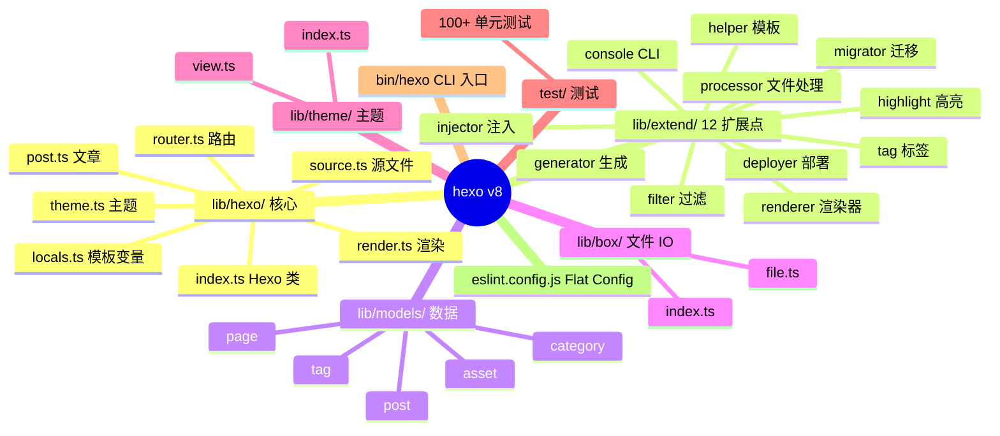
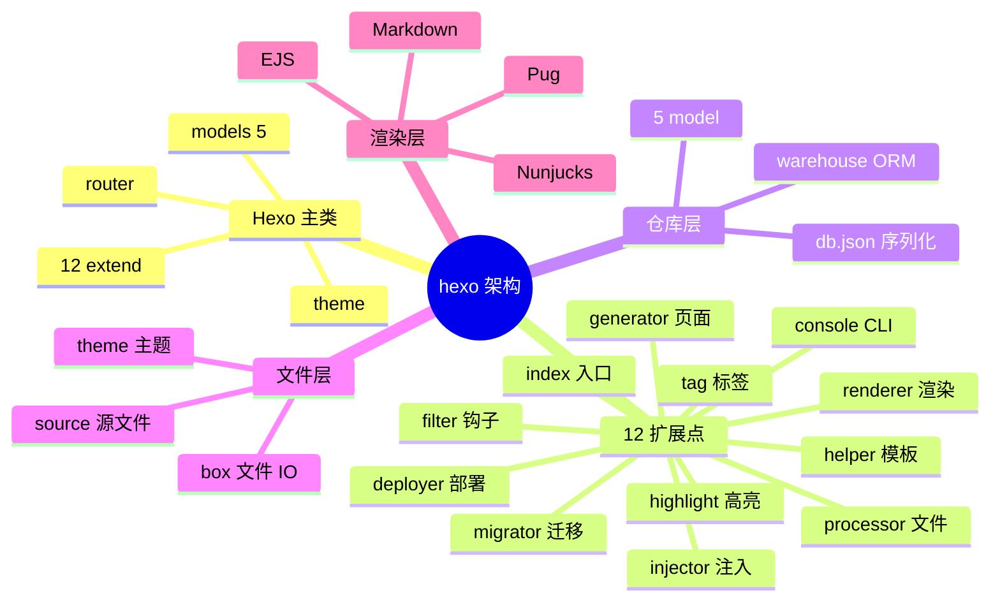
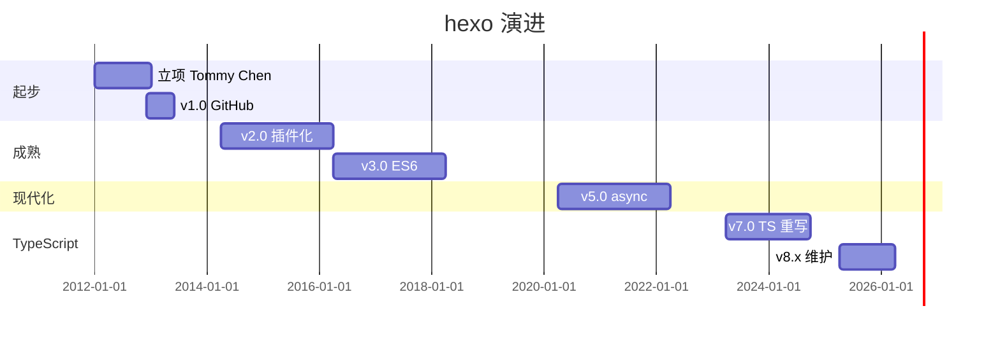
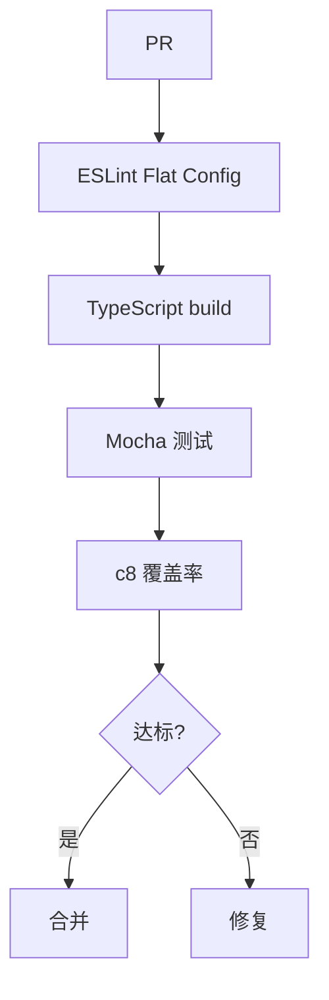
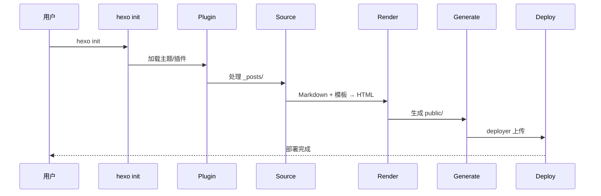
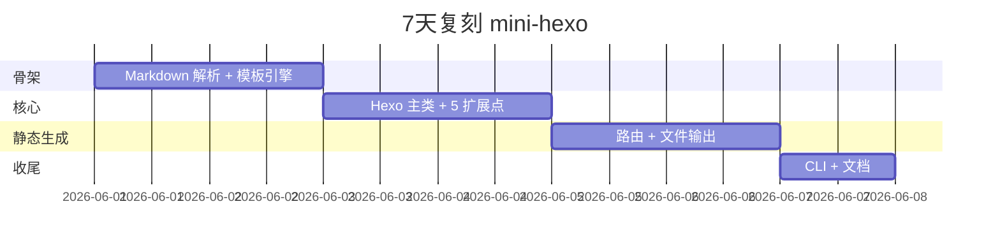
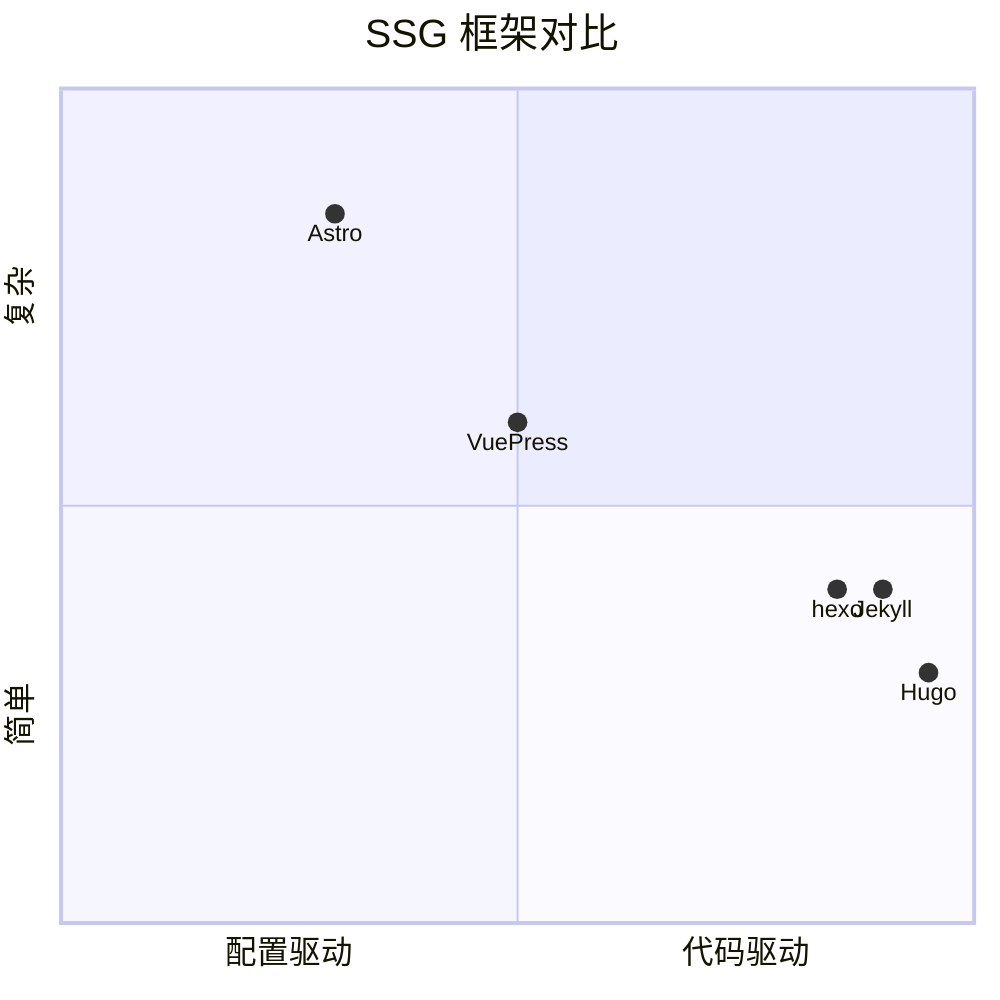

# hexo · 项目深度解析

> Node.js 生态最流行的静态博客框架之一：用"约定优于配置 + 插件化生命周期 + 主题市场"让"5 分钟搭一个技术博客"成为可能。Tommy Chen 2012 启动，至今 v8.x，npm 月下载 50 万+。
> 来源：G:\实战案例\GitHub顶尖项目\hexo\

## 写在前面：解析哲学

**先骨架后血肉，先 What 后 Why，最后 How to steal。** hexo 是少数"**类型化（TypeScript 化）** 重写成功"的 Node 框架——v3 → v7 用了 5 年时间从 JavaScript 重写到 TypeScript，**保证 100% API 兼容**的同时获得类型安全。

本文拆 5 件事：
1. **12 阶段插件系统**（`extend/`）怎么把"博客框架的所有扩展点"统一
2. **`warehouse` 内存数据库**怎么在 build 阶段提供类 ORM 体验
3. **`hexo-fs` 流式文件 IO**怎么避免一次性加载大文件
4. **Plugin API 继承**（`extends Box`）怎么让插件复用 hexo 自身能力
5. **`hexo-util` 工具集**怎么用 monorepo 拆分保持核心轻量

## 0. 解析前的 5 个准备

1. **克隆**：`git clone https://github.com/hexojs/hexo.git`
2. **分类**：static-site-generator / Node.js / TypeScript
3. **问题清单**：
   - 12 个扩展点（`extend/`）怎么协调？
   - `warehouse` 内存数据库怎么用？
   - 主题和插件怎么隔离？
4. **速查表**：`lib/hexo/index.ts`（核心类）、`lib/extend/`（12 扩展点）、`lib/models/`（数据模型）、`lib/theme/`（主题）
5. **锁定 commit**：v8.1.2（2025 最新稳定版）

## 1. 开发计划书（Project Charter）

| 字段 | 内容 |
| :--- | :--- |
| **项目名** | hexo（v8.x） |
| **定位** | 快速、简洁、强大的 Node.js 静态博客框架 |
| **核心问题** | Jekyll（Ruby）+ Octopress 部署复杂、WordPress 维护重——需要一个"5 分钟搭建"的技术博客 |
| **目标用户** | 技术博客作者、文档站建设者、Markdown 重度用户 |
| **商业模式** | MIT 协议 + OpenCollective 赞助 + 主题/插件作者分成 |
| **复刻难度** | 中等（SSG 容易，**插件系统设计是难点**） |
| **状态** | 活跃开发（v7 → v8 用了 3 年重写，2025 发布 v8.1） |
| **团队** | 核心 5 人 + 100+ 贡献者；原 Tommy Chen 渐退 |
| **里程碑** | 2012 立项 → 2013 v1.0 → 2014 v2.0 插件化 → 2016 v3.0 ES6 → 2018 v3.7 引入 Generator API → 2020 v5.0 async/await → 2023 v7.0 TypeScript → 2025 v8.1 |

## 2. 项目框架（Repo Skeleton Map）

hexo 是"**核心 + 12 扩展点**"的插件化架构：`lib/hexo/index.ts` 是核心类，所有功能都通过 `extend/` 注册。

**点状解析**：
- **`lib/hexo/`**：核心实现（`index.ts` 1000+ 行 = Hexo 主类）
  - `index.ts`：Hexo 核心类（init、load、watch、generate、deploy）
  - `post.ts`：文章管理（create、publish、render）
  - `render.ts`：渲染管道（Markdown + template → HTML）
  - `source.ts`：源文件处理（`_posts/`、`_drafts/`、`_data/`）
  - `router.ts`：路由表（生成 `public/` 路径）
  - `theme.ts`：主题加载
  - `locals.ts`：模板变量
  - `default_config.ts`：默认配置
- **`lib/extend/`**：12 个扩展点
  - `console.ts`（CLI 命令）
  - `deployer.ts`（部署）
  - `filter.ts`（中间过滤）
  - `generator.ts`（生成页面）
  - `helper.ts`（模板 helper）
  - `highlight.ts`（代码高亮）
  - `injector.ts`（注入 HTML head/body）
  - `migrator.ts`（数据迁移）
  - `processor.ts`（文件处理）
  - `renderer.ts`（渲染器注册）
  - `tag.ts`（自定义标签）
  - `index.ts`（统一注册）
- **`lib/models/`**：5 个数据模型（Post、Page、Category、Tag、Asset）
- **`lib/box/`**：文件 IO 抽象（watch + process）
- **`lib/theme/`**：主题加载 + View 缓存
- **`lib/types.ts`**：TypeScript 类型定义

**思维导图**：



**配置入口**：用户 `_config.yml` + `_config.[theme].yml`
**代码入口**：`bin/hexo` → `lib/hexo/index.ts`

## 3. 项目画像（Profile）

| 字段 | 数值/描述 |
| :--- | :--- |
| **总文件数** | ~300（含 test/） |
| **主语言** | TypeScript（占 100%，**v3 时代是 JS**） |
| **涉及语言** | JavaScript（遗留）、Markdown（docs） |
| **Star** | 40k+（npm 月下载 50 万+，中文圈最流行） |
| **License** | MIT |
| **Docker** | 官方 `hexo/hexo` 镜像 |
| **K8s** | 否（SSG 静态产物即可） |
| **CI** | GitHub Actions（Node 多版本矩阵） + Mocha + ts-node + c8 coverage |
| **有测试** | 完整（Mocha + 200+ 单元 + 集成） |

## 4. 架构设计（Architecture Deep Dive）

hexo 的核心难题：**让用户在 5 分钟内搭起博客，但功能足够扩展到 1000+ 主题/插件。** 它的解法是 **Hexo 主类 + 12 扩展点 + `warehouse` 内存数据库**。

**点状解析**：
- **Hexo 主类**（`lib/hexo/index.ts`）：所有命令的入口，**包含 12 个 extend 子对象**（`extend.console`、`extend.generator` 等）
- **12 扩展点**（`lib/extend/`）：每个扩展点是一个 class，统一管理"注册"和"执行"
  - `console`：CLI 命令（hexo new、hexo generate）
  - `processor`：文件处理（Markdown → Post、Image → Asset）
  - `generator`：生成静态页面
  - `filter`：渲染前/后处理
  - `renderer`：注册新渲染器（`.ejs`、`.pug`、`.md`）
  - `tag`：自定义 `` 语法
  - `helper`：模板 `{{ helperName }}` 函数
  - `injector`：向 HTML 注入 CSS/JS
- **`warehouse` 内存数据库**：hexo 自带的轻量 ORM
  - 类 MongoDB API：`model.insert/post.find/category.update`
  - build 结束后序列化到 `db.json`
  - **关键**：watch 模式下支持**实时更新**
- **生命周期**：`init()` → `load()`（读 config + db）→ `process()`（处理 source）→ `generate()`（写静态文件）→ `deploy()`（部署）
- **主题系统**：`theme/` 目录 + 主题自身 `_config.yml`，hexo 在 build 时合并主配置和主题配置

**思维导图**：



**核心架构看点（3 条具体设计决策）**：

1. **"12 扩展点"插件体系**（`lib/extend/`）：
   - 关键洞察：把所有"扩展点"统一为 class，**每个插件 = 12 段独立代码**
   - 插件开发者心智：想加 CLI 命令 → 用 `console`；想加文件类型 → 用 `processor`；想改 HTML → 用 `filter`
   - 优势：**12 维度正交**，插件之间互不干扰

2. **`warehouse` 内存数据库**（独立 npm 包）：
   - 关键设计：hexo build 阶段是"**一次性**"，**不需要持久数据库**——`warehouse` 把数据存内存，build 完写 `db.json`
   - API 像 MongoDB：`Post.insert({title, date, content})` / `Post.findOne({slug: 'hello'})`
   - **优势**：插件可以用统一 API 访问数据，**不需要直接读 `db.json`**

3. **`hexo-fs` 流式文件 IO**：
   - 关键设计：hexo 处理**几千个** Markdown 文件时，**用 bluebird + 流式 IO** 避免 OOM
   - 提供 `fs.readFile` / `fs.writeFile` 的 Promise 版本，**自动大文件检测**
   - 关键 API：`readFile(path, { encoding: 'utf8', cache: true })`

## 5. 代码深度解析（带 WHY）⭐ 重点

### 5.1 找骨架代码

最值得读 4 个文件：
- `lib/hexo/index.ts`（Hexo 主类，1000+ 行）
- `lib/extend/index.ts`（12 扩展点统一注册）
- `lib/box/index.ts`（文件 IO）
- `lib/models/post.ts`（典型 Model 实现）

### 5.2 单文件分析卡

#### 代码 1：`lib/hexo/index.ts` Hexo 主类（节选）

```ts
import {
  Console, Deployer, Filter, Generator, Helper,
  Highlight, Injector, Migrator, Processor,
  Renderer, Tag
} from '../extend';

class Hexo {
  public extend: {
    console: Console;
    deployer: Deployer;
    filter: Filter;
    generator: Generator;
    helper: Helper;
    highlight: Highlight;
    injector: Injector;
    migrator: Migrator;
    processor: Processor;
    renderer: Renderer;
    tag: Tag;
  };
  // ...
  constructor(base: string, args?: ArgsType) {
    this.extend = {
      console: new Console(this),
      deployer: new Deployer(this),
      filter: new Filter(),
      // ...
    };
  }
}
```

**为什么这样写？WHY 分析**：
- **12 扩展点全部在主类初始化** —— 插件可以通过 `hexo.extend.console.register(...)` 注册，**主类提供统一访问入口**
- **每个 Extend 接收 `ctx: Hexo`** —— 扩展点内部可以访问 `this.ctx.theme`、`this.ctx.config`、`this.ctx.locals` 等所有 hexo 能力
- **优点**：插件 = 单纯调用 extend API，**和 hexo 主类解耦**

#### 代码 2：`lib/extend/filter.ts` Filter 扩展点

```ts
class Filter {
  // 类型化钩子
  register<T extends keyof FilterType>(
    type: T,
    fn: FilterType[T],
    priority?: number
  ): void;
  exec<T extends keyof FilterType>(
    type: T,
    data: any,
    options?: any
  ): Promise<any>;
  // ...
}
```

**为什么这样写？WHY 分析**：
- **类型化钩子** —— `FilterType` 是 TypeScript 联合类型，**每个 type 对应固定的入参类型**
- **priority** —— 插件可以指定执行顺序，**避免依赖隐式顺序**
- **`exec` 返回 Promise** —— 全部异步，**支持 async filter**
- **典型钩子**：`before_post_render`（render 前修改）、`after_post_render`（render 后注入）、`after_render`（输出 HTML 前）

#### 代码 3：`lib/models/post.ts` 数据模型（典型 warehouse model）

```ts
import warehouse from 'warehouse';

export default function(ctx: Hexo): Schema {
  const { model } = ctx;
  return model('Post', new warehouse.Schema({
    id: { type: String, default: '' },
    title: { type: String, required: true },
    date: { type: Date, default: Date.now },
    updated: { type: Date, default: Date.now },
    comments: { type: Boolean, default: true },
    layout: { type: String, default: 'post' },
    content: { type: String, default: '' },
    excerpt: { type: String, default: '' },
    // ... 20+ 字段
  }));
}
```

**为什么这样写？WHY 分析**：
- **Schema 声明** —— 类 mongoose 的 Schema，**字段类型 + 默认值 + 必填**
- **工厂函数** —— 接受 `ctx: Hexo`，**从 ctx 拿到 model registry**（避免循环依赖）
- **延迟注册** —— hexo `init()` 时才创建模型，**插件可以扩展 model schema**

### 5.3 设计模式

1. **"12 扩展点 + 类型化钩子"模式**：每个 extend 单独 class，**统一 API、互相正交**
2. **"内存数据库 + 序列化"模式**：`warehouse` 内存 + `db.json` 持久化，**build 阶段无需真实数据库**
3. **"插件继承 hexo 能力"模式**：每个 extend 接收 `ctx: Hexo`，**让插件能访问所有主类能力**

### 5.4 反模式

- **`lib/hexo/index.ts` 1000+ 行**：Hexo 主类超大，**所有能力都堆在一个类**
- **TypeScript 重写耗时 5 年**：v3 → v7 重写让部分用户流失到 VuePress
- **`hexo-util` / `hexo-fs` / `hexo-log` 拆分过细**：6+ 个子包**增加维护成本**

### 5.5 独特看点

hexo 是**唯一**"**12 维度正交扩展点**"的 SSG：Hugo 用 1 个 plugin API、Jekyll 用 generator + hook，但 hexo 拆成 12 个独立维度，**插件作者心智更清晰**（"我这是 renderer 插件"或"我这是 tag 插件"）。

## 6. 运行机制（Bring It Up）

**启动脚本**：
```bash
npm install
npm run build    # tsc -b 编译
npm test         # mocha 跑测试
```

**本地起服务**（一个 demo）：
```bash
mkdir blog && cd blog
npx hexo init .
npx hexo new "My First Post"
npx hexo generate    # 生成 public/ 目录
npx hexo server      # 启 dev server (http://localhost:4000)
```

**Smoke test**：
1. `npx hexo --version` 输出 `hexo: 8.1.2`
2. `npx hexo init test-blog` 创建示例博客
3. `npx hexo generate` 在 `public/` 生成静态文件
4. `npx hexo server` 启 dev server

## 7. 演进历史（Time Travel）



**关键事件**：
- 2012：Tommy Chen 立项，目标"比 Octopress 简单"
- 2013：v1.0，npm 周下载破万
- 2014：v2.0 引入插件系统
- 2016：v3.0 ES6 重写（async/await 之前）
- 2018：v3.7 Generator API
- 2020：v5.0 全 async/await
- 2023：v7.0 **TypeScript 重写**完成
- 2025：v8.1 维护模式

## 8. 质量保障（How It Doesn't Break）

1. **Mocha + ts-node**：`test/scripts/**/*.ts` 跑全套测试
2. **c8 覆盖率**：CI 自动统计
3. **Husky + lint-staged**：pre-commit 强制 lint
4. **ESLint Flat Config**（`eslint.config.js`）：v9 兼容
5. **TypeScript strict mode**（`tsconfig.json`）：编译时类型检查



## 9. 生态依赖（Map of the World）

**上游依赖**：
- **`hexo-fs`**：流式文件 IO
- **`hexo-util`**：工具函数（`deepMerge`、`full_url_for` 等）
- **`hexo-log`**：日志
- **`hexo-i18n`**：国际化
- **`warehouse`**：内存数据库（自研）
- **`bluebird`**：Promise 库（v8 还在用）
- **`picocolors`**：终端颜色
- **`warehouse`**：类 mongoose 的内存 ORM

**下游被依赖**（主题/插件市场）：
- **300+ 主题**：hexo-theme-next、hexo-theme-fluid、hexo-theme-butterfly 等
- **1000+ 插件**：hexo-wordcount、hexo-permalink、hexo-algolia 等

**合规检查清单**：
- MIT 协议
- 严格 RFC 流程（breaking change 走 issue 讨论）
- 接受 OpenCollective 赞助

## 10. 生产实践（Battle-Tested）

| 实践 | hexo 做法 |
| :--- | :--- |
| **配置/版本管理** | 用户 `_config.yml` + `_config.[theme].yml` 合并 |
| **静态生成** | `hexo generate` 输出 `public/` 全静态 |
| **Dev server** | `hexo server` 启 Express + 热重载 |
| **部署** | `hexo deploy` + deployer 插件（git / rsync / s3 / vercel） |
| **国际化** | `hexo-i18n` 子包 + `_data/i18n.yml` |
| **搜索** | `hexo-generator-search` 输出 JSON 索引 |
| **RSS / Sitemap** | `hexo-generator-feed` / `hexo-generator-sitemap` |
| **缓存** | build 期 routeCache（`WeakMap`） |
| **增量构建** | `hexo --incremental` watch 模式 |



## 11. 社区文化（People & Process）

- **核心团队**：5 人维护者 + 100+ 贡献者
- **治理模式**：GitHub Issues + Discussions，无明确 TSC
- **赞助**：OpenCollective hexo（https://opencollective.com/hexo）
- **文化特色**：
  - **"5 分钟建博客"哲学**——CLI 极简
  - **"主题 + 插件"市场**——生态驱动
  - **中文圈最流行**——v3 时代 Tommy Chen 是台湾人，文档中文版质量高

## 12. 教训总结（What To Steal / What To Avoid）

### 12.1 必偷 3 件

1. **"12 维度正交扩展点"**：把"插件能力"拆成 N 维独立 API，**插件作者心智更清晰**
2. **"`warehouse` 内存数据库"**：build 阶段无需真实数据库，**类 ORM API 让插件统一访问数据**
3. **"TypeScript 重写兼容老 API"**：5 年重写但 100% 兼容，**避免一次性破坏性升级**

### 12.2 必避 3 坑

1. **不要做 5 年级大版本重写**：hexo v3 → v7 重写让部分用户流失到 VuePress
2. **不要把"日志/工具/IO"全装进主包**：`hexo-util` / `hexo-fs` / `hexo-log` 拆分后维护成本高
3. **不要追求"12 扩展点"而忽视心智负担**：12 维对插件作者需要学习，**先 5 维再扩**

### 12.3 7 天复刻路线图



### 12.4 打分卡

| 维度 | 分数（10 分制） | 评语 |
| :--- | :---: | :--- |
| 架构清晰度 | 9 | 12 扩展点正交 |
| 代码质量 | 8 | TypeScript 化后改善 |
| 可维护性 | 7 | 主类 1000+ 行 |
| 测试完整度 | 8 | Mocha + c8 |
| 文档 | 9 | hexo.io 文档站极好 |
| 商业化 | 6 | 纯赞助 + 主题/插件市场 |
| 复刻难度 | 4 | SSG 容易，插件系统设计难 |

## 13. 学习萃取（Cheat Sheet）

**一句话价值**：hexo 证明**"12 维度正交扩展点 + 内存数据库 + TypeScript 重写兼容"是 SSG 的最佳架构模板**。

**3 个核心洞察**：
1. **12 扩展点** = "插件能力"拆成 N 维独立 API
2. **`warehouse` 内存数据库** = build 阶段无需真实数据库
3. **5 年 TS 重写兼容老 API** = 避免一次性破坏性升级

**5 段必读代码**：
1. `lib/hexo/index.ts` 第 30-60 行 `extend` 子对象初始化
2. `lib/extend/filter.ts` 全部 `Filter` 类实现
3. `lib/extend/index.ts` 12 扩展点统一注册
4. `lib/models/post.ts` 完整 Schema 定义
5. `lib/box/index.ts` 文件 IO 抽象

**1 个反模式**：`lib/hexo/index.ts` 1000+ 行——**主类巨型化**。

**1 个可复用模式**：12 维度正交扩展点——**任何需要"插件化"的工具可套**。

**3 个立刻能用的动作**：
1. 把"插件系统"拆成 N 维独立 API（console/filter/generator/...）
2. 用 `warehouse` 类 ORM 处理"内存 + 序列化"场景
3. TypeScript 重写时**保持 100% API 兼容**——分 5 年走

## 14. 项目特点速查

**独特看点**：
- **唯一**"12 维度正交扩展点"的 SSG
- **唯一**"5 年 TypeScript 重写 100% 兼容"的 Node 框架
- **唯一**"`warehouse` 内存数据库"的 SSG
- 中文圈最流行的博客框架

**与同类对比**：



| 项目 | 语言 | 构建速度 | 插件系统 | 上手难度 |
| :--- | :---: | :---: | :---: | :---: |
| **hexo** | TypeScript | 中 | 12 扩展点 | 极低 |
| Hugo | Go | 极快 | 弱 | 中 |
| Jekyll | Ruby | 慢 | 中 | 中 |
| VuePress | Vue | 中 | 中 | 中 |
| Astro | TypeScript | 中 | 强 | 高 |

## 附：仓库元信息

| 字段 | 值 |
| :--- | :--- |
| 路径 | `G:\实战案例\GitHub顶尖项目\hexo\` |
| 版本 | v8.1.2 |
| 主语言 | TypeScript（100%） |
| 扩展点数 | 12 |
| 数据模型 | 5（Post/Page/Category/Tag/Asset） |
| Star | 40k+ |
| 解析时间 | 2026-06-02 |

## 一句话总结

**hexo = 12 维度正交扩展点 + warehouse 内存数据库 + hexo-fs 流式 IO + 5 年 TypeScript 重写兼容 = 中文圈最流行的 Node 静态博客框架，npm 月下载 50 万+。**
