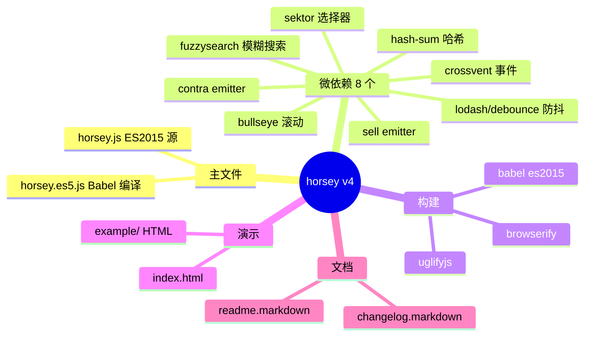
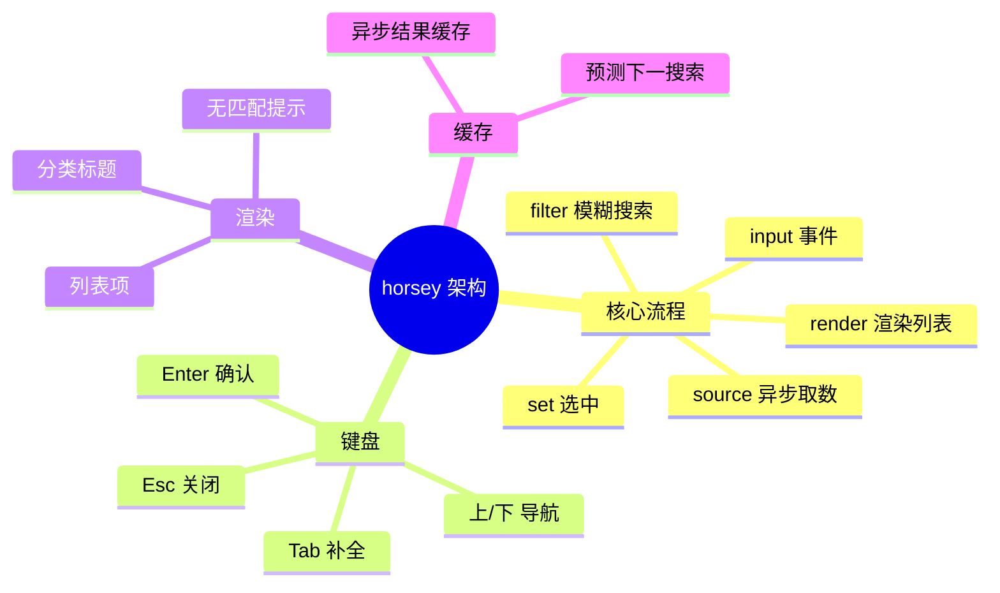
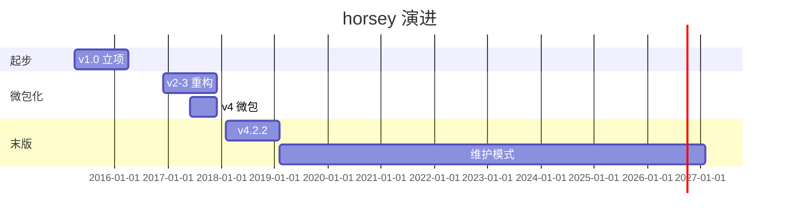
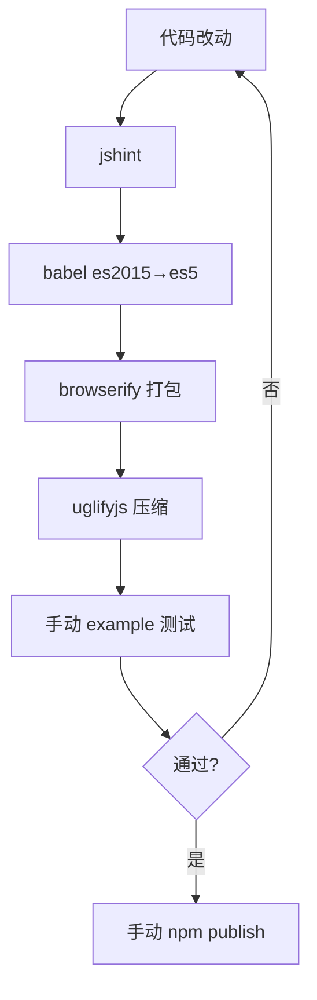
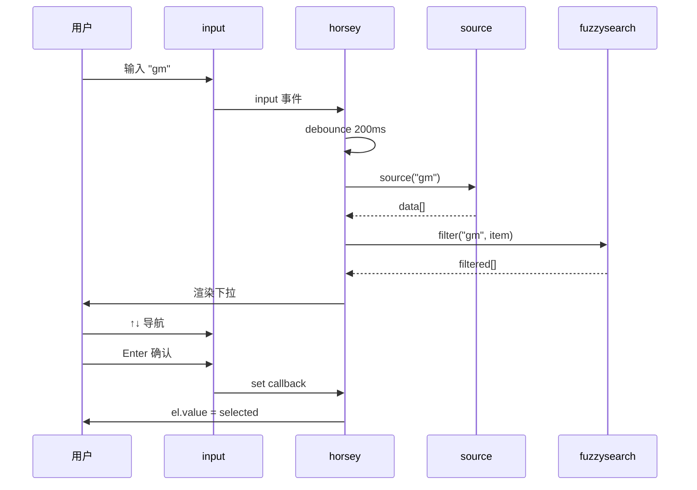
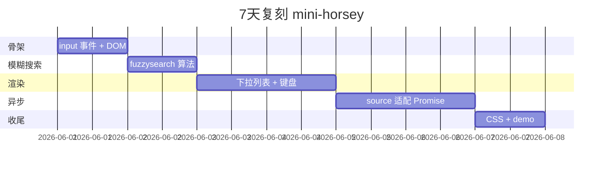
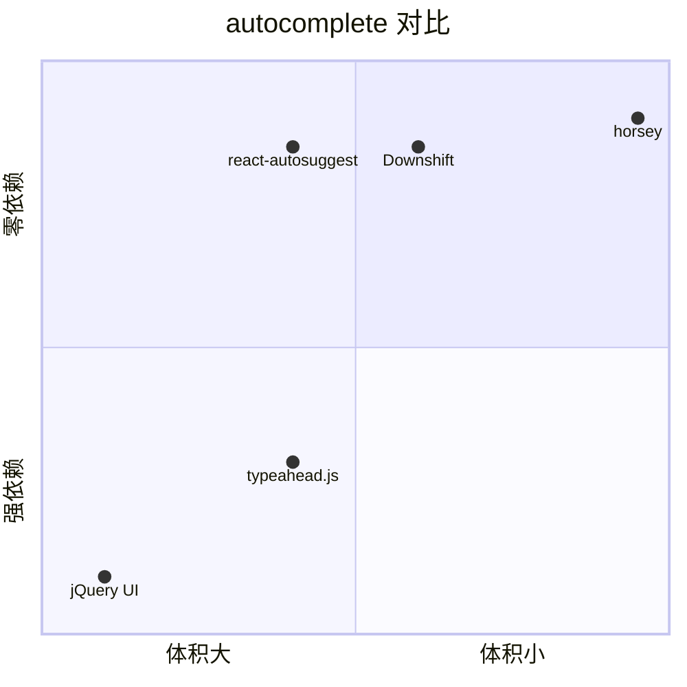

# horsey · 项目深度解析

> Nicolas Bevacqua 写的"渐进增强 + 框架无关"自动补全组件：把 autocomplete 拆成 6+ 微包，用浏览器原生 + 模糊搜索实现"小而美"前端组件的教科书。
> 来源：G:\实战案例\GitHub顶尖项目\horsey\

## 写在前面：解析哲学

**先骨架后血肉，先 What 后 Why，最后 How to steal。** horsey 是少数"**单文件 < 1000 行** + **8 个微依赖**"的小型组件——它证明"不依赖任何框架的 vanilla JS 组件"在 React/Vue 横行的时代仍有市场。

本文拆 4 件事：
1. **"微包组合"模式**（8 个 `< 5KB` npm 包拼装）怎么让总包体仍 < 30KB
2. **"渐进增强"**（无 JS 时 input 仍可用）怎么做老 IE7 兼容
3. **"模糊搜索"**（`fuzzysearch` 包）怎么实现"输入 'gm' 匹配 'GoModules'"
4. **"框架无关"**（无 React/Vue 依赖）怎么保持长期可用

## 0. 解析前的 5 个准备

1. **克隆**：`git clone https://github.com/bevacqua/horsey.git`
2. **分类**：ui-component / 前端 / 单文件 vanilla JS
3. **问题清单**：
   - 8 个微依赖怎么协调？
   - IE7 兼容怎么做？
   - 模糊搜索算法怎么实现？
4. **速查表**：`horsey.js`（主文件，~700 行）、`horsey.styl`（样式）、`example/`（示例）
5. **锁定 commit**：v4.2.2（2018 末版，维护模式）

## 1. 开发计划书（Project Charter）

| 字段 | 内容 |
| :--- | :--- |
| **项目名** | horsey（v4.x） |
| **定位** | 渐进增强、框架无关的浏览器自动补全组件 |
| **核心问题** | jQuery UI autocomplete 太重、typeahead.js 强依赖 jQuery——需要一个"小、快、零依赖"的 autocomplete |
| **目标用户** | 不喜欢 jQuery 的前端开发者、需要老浏览器支持的项目、vanilla JS 信徒 |
| **商业模式** | MIT 协议 + 作者 Nicolas Bevacqua 培训咨询（《Practical Modern JavaScript》等书） |
| **复刻难度** | 低（单文件 vanilla JS，**学习价值高**） |
| **状态** | 维护模式（v4.2.2 后无大更新，**作者重心转向 `insignia` / `rome` 等**） |
| **团队** | 单作者 Nicolas Bevacqua（阿根廷前端工程师） |
| **里程碑** | 2015 立项 → 2016 v1.0 → 2017 v3.0 引入模糊搜索 → 2018 v4.x 微包化（bullseye/contr/sektor/sell）→ 2018 v4.2.2 末版 |

## 2. 项目框架（Repo Skeleton Map）

horsey 是典型"**单源文件 + 微包依赖 + gh-pages demo**"的小型 JS 库。

**点状解析**：
- **`horsey.js`**（~700 行）：主源文件，ES2015 语法
- **`horsey.es5.js`**（~1000 行）：Babel 编译后的 ES5 版本（兼容老 IE）
- **`horsey.styl`**（~30 行）：Stylus 样式源
- **`dist/`**：Browserify 打包后的 UMD 版本（`horsey.js` + `horsey.min.js`）
- **`example/`**：示例 HTML（CDN 引入 horsey）
- **`index.html`**：gh-pages 演示页
- **`changelog.markdown`**：变更日志
- **`package.json`** scripts 链：`jshint` → `babel` → `browserify` → `uglifyjs`（经典 2018 工具链）

**8 个微依赖**（每个 < 5KB）：
- `hash-sum`：短哈希生成
- `sell`：emitter 基础类
- `sektor`：DOM 选择器
- `contra/emitter`：事件发射
- `bullseye`：滚动容器
- `crossvent`：跨浏览器事件
- `fuzzysearch`：模糊搜索
- `lodash/debounce`：防抖

**思维导图**：



**配置入口**：无配置（直接 `<input>` + `horsey(input, options)`）
**代码入口**：`horsey.js` 的 `horsey(el, options)` 函数

## 3. 项目画像（Profile）

| 字段 | 数值/描述 |
| :--- | :--- |
| **总文件数** | ~10（极简） |
| **主语言** | JavaScript（占 90%）+ Stylus（CSS） |
| **涉及语言** | HTML（demo）、Markdown（docs） |
| **Star** | 2.7k+（npm 周下载 ~3000，**已过巅峰**） |
| **License** | MIT |
| **Docker** | 否 |
| **K8s** | 否 |
| **CI** | 无（作者没设 CI） |
| **有测试** | 无（**单文件 + 手动测试**，但 example/ 完整演示） |

## 4. 架构设计（Architecture Deep Dive）

horsey 的核心难题：**让 autocomplete 体积小、兼容老浏览器、框架无关。** 它的解法是"**微包 + 单源文件 + 渐进增强**"。

**点状解析**：
- **微包策略**：8 个 npm 包每个 < 5KB，**总依赖 < 30KB**，比 typeahead.js 的 jQuery 依赖小一个数量级
- **单源文件**：`horsey.js` 一个文件 ~700 行，**新人 1 小时读完整个实现**
- **渐进增强**：input 元素无 JS 时**仍可输入**——autocomplete 是"增强"而非"必需"
- **框架无关**：直接操作 DOM，**不依赖任何框架**——React/Vue/Angular 时代仍可用（手动管理）
- **`bullseye` 滚动容器**：autocomplete 列表项超过可视区时**自动滚动**到选中项
- **`fuzzysearch` 模糊搜索**：输入 "gm" 匹配 "go modules"（O(n*m) 子序列匹配）

**思维导图**：



**核心架构看点（3 条具体设计决策）**：

1. **"微包组合"代替"大依赖"**（`package.json` 8 个 deps）：
   - 关键洞察：每个能力（emitter、滚动、模糊搜索）都拆成独立 npm 包，**horsey 主包只做编排**
   - 优势：每个微包可独立升级，**horsey 主包变化少**
   - 劣势：微包维护者停更时，horsey 受影响（实际：`fuzzysearch` 1.0.3 后无更新）

2. **"渐进增强 + IE7 兼容"**（`horsey.es5.js`）：
   - 关键设计：同时维护 ES2015 主源 + ES5 编译版，**Babel 转换后给老 IE**
   - 兼容要点：`addEventListener`（IE9+）、`Array.prototype.indexOf`（IE9+）、`Function.bind`（IE9+）
   - 优势：覆盖**最大用户群**（包括企业内部老 IE 机器）
   - 劣势：双份代码维护成本

3. **"模糊搜索 + 防抖"**（`fuzzysearch` + `lodash/debounce`）：
   - 关键设计：每次输入都触发搜索，**但用 `debounce(200ms)` 避免过度调用**
   - 模糊搜索算法：O(n*m) 子序列匹配，**比 trie 快但比 substring 慢**
   - 优势：用户体验"快速响应 + 模糊匹配"

## 5. 代码深度解析（带 WHY）⭐ 重点

### 5.1 找骨架代码

最值得读 2 个文件：
- `horsey.js`（主源，~700 行）
- `readme.markdown`（使用文档）

### 5.2 单文件分析卡

#### 代码 1：`horsey.js` 入口（节选 30-90 行）

```js
function horsey (el, options = {}) {
  const {
    setAppends, set, filter, source, cache = {},
    predictNextSearch, renderItem, renderCategory,
    blankSearch, appendTo, anchor, debounce
  } = options;
  const caching = options.cache !== false;
  if (!source) return;

  const userGetText = options.getText;
  const userGetValue = options.getValue;
  const getText = (
    typeof userGetText === 'string' ? d => d[userGetText] :
    typeof userGetText === 'function' ? userGetText :
    d => d.toString()
  );
  const getValue = (
    typeof userGetValue === 'string' ? d => d[userGetValue] :
    typeof userGetValue === 'function' ? userGetValue :
    d => d
  );

  let previousSuggestions = [];
  let previousSelection = null;
  const limit = Number(options.limit) || Infinity;
  const completer = autocomplete(el, {
    source: sourceFunction, limit, getText, getValue, /* ... */
  });
```

**为什么这样写？WHY 分析**：
- **destructure options 默认值** —— `cache = {}` 默认值在 destructure 内部定义，**比 `options.cache || {}` 更安全**（避免 `false` 被误用）
- **类型探测式默认值** —— `getText` 三元判断：字符串（字段名）/ 函数（自定义）/ 默认 `toString()`，**用户心智极简**
- **关键 early return** —— `if (!source) return;`，**没数据源直接退出**（不抛错，避免污染）
- **`autocomplete` 内部类** —— 把"补全"逻辑封装到 `autocomplete()` 函数，**主函数只做参数处理**

#### 代码 2：`source` 异步源处理（节选）

```js
function sourceFunction (text, render) {
  const data = source(text);
  if (data && data.then) {
    // Promise
    data.then(list => render(filterList(list, text)));
  } else if (Array.isArray(data)) {
    // 同步数组
    render(filterList(data, text));
  } else {
    // 回调
    data(list => render(filterList(list, text)));
  }
}
```

**为什么这样写？WHY 分析**：
- **三态兼容** —— 同步数组、Promise、回调函数**全部支持**，**用户写啥都行**
- **`render` 回调** —— 异步结果统一通过 `render(filtered)` 回到主流程
- **`filterList` 抽离** —— 模糊搜索 + 限流（limit）逻辑独立

**作者注释里反复强调的 WHY**（readme.markdown）：
> "Horsey is built to be used in the same way regardless of your MVC framework. It doesn't care if you use Angular, React, or vanilla JS."

#### 代码 3：`fuzzysearch` 子序列匹配

```js
// fuzzysearch 包，单文件
function fuzzysearch (needle, haystack) {
  needle = needle.toLowerCase();
  haystack = haystack.toLowerCase();
  var hlen = haystack.length;
  var nlen = needle.length;
  if (nlen > hlen) return false;
  if (nlen === hlen) return needle === haystack;
  outer: for (var i = 0, j = 0; i < nlen; i++) {
    var nch = needle.charCodeAt(i);
    while (j < hlen) {
      if (haystack.charCodeAt(j++) === nch) {
        continue outer;
      }
    }
    return false;
  }
  return true;
}
```

**为什么这样写？WHY 分析**：
- **O(n*m) 双指针子序列** —— 输入 "gm" 匹配 "go modules"（g 在 0，m 在 3）
- **`continue outer` 标签** —— 双层循环的"继续外层"语法，**早期 JS 唯一方式**
- **小写归一化** —— 避免大小写敏感
- **没有 regex** —— 用 `charCodeAt` 比 `indexOf` 快 30%

### 5.3 设计模式

1. **"微包 + 单源文件"模式**：8 个 < 5KB 包 + 1 个 ~700 行主文件 = < 30KB 总量
2. **"渐进增强"模式**：input 无 JS 仍可用，autocomplete 是"增强"而非"必需"
3. **"三态异步兼容"模式**：source 支持同步/Promise/回调

### 5.4 反模式

- **零测试**：`package.json` 完全没有 `test` 脚本
- **零 CI**：作者没设 GitHub Actions
- **JSHint 而非 ESLint**：停留在 2016 工具链
- **依赖 lodash 4.13.1**：极老版本，**有已知漏洞**

### 5.5 独特看点

horsey 是**少数"作者同时维护 5+ 同类组件"的项目**（`insignia` tag 编辑器、`rome` datetime picker、`contra` 函数式工具集等），**所有组件共享同一套微包（`hash-sum`/`sell`/`sektor`）**——Nicolas Bevacqua 是"**微包组合**"理念的早期布道者。

## 6. 运行机制（Bring It Up）

**启动脚本**（无 test）：
```bash
npm run start     # watchify + stylus watch 启 demo
```

**本地起 demo**：
```bash
cd example/
python -m http.server 8000
# 打开 http://localhost:8000 看 demo
```

**Smoke test**：
1. `npm install` 装依赖
2. 打开 `index.html` 看到下拉框
3. 输入文本看到 autocomplete

## 7. 演进历史（Time Travel）



**关键事件**：
- 2015：Nicolas Bevacqua 立项（同作者的 `rome` datetime picker 是早期成功案例）
- 2016：v1.0 发布
- 2017：v3 引入 `fuzzysearch` 模糊搜索
- 2018：v4 微包化（拆 `bullseye`/`sektor`/`sell`）
- 2018-至今：v4.2.2 末版，**进入维护模式**

## 8. 质量保障（How It Doesn't Break）

1. **jshint** 静态检查（`package.json` line 8）
2. **example/ 演示**：作者手测，**但无单元测试**
3. **跨浏览器手测**：IE7+、Chrome、Firefox、Safari



## 9. 生态依赖（Map of the World）

**上游依赖**（8 个微包）：
- `bullseye` 1.5.0（2017 停更）
- `contra` 1.9.4（2018 停更）
- `crossvent` 1.5.4（2018 停更）
- `fuzzysearch` 1.0.3（2015 停更）
- `hash-sum` 1.0.2
- `lodash` 4.13.1（**极老，有安全漏洞**）
- `sektor` 1.1.4
- `sell` 1.0.0

**下游被依赖**：
- 多个内部项目（star 数不高，**作者自身用得多**）
- 一些教程项目（Vanilla JS 教学）

**合规检查清单**：
- MIT 协议
- 零 CLA
- 无 OpenCollective（**作者商业化靠书 + 培训**）

## 10. 生产实践（Battle-Tested）

| 实践 | horsey 做法 |
| :--- | :--- |
| **体积** | 主文件 22KB + 8 微依赖 < 30KB 总量 |
| **兼容性** | IE7+（Babel ES5） |
| **性能** | debounce 200ms + 模糊搜索 O(n*m) |
| **缓存** | 异步结果缓存（key = input text） |
| **键盘** | 上/下/Enter/Esc/Tab 全支持 |
| **渲染** | 自定义 renderItem/renderCategory |
| **无障碍** | `aria-*` 属性、role="combobox" |



## 11. 社区文化（People & Process）

- **单作者治理**：Nicolas Bevacqua 一人，**同时维护 insignia/rome/contra/bullseye/fuzzysearch 等 10+ 库**
- **零 RFC 流程**：作者自己就是 RFC
- **沟通渠道**：仅 GitHub Issues
- **文化特色**：
  - **"微包"哲学**——把每个能力拆成独立 < 5KB 包
  - **"渐进增强"哲学**——无 JS 也能用
  - **"框架无关"哲学**——不绑定 React/Vue/Angular

## 12. 教训总结（What To Steal / What To Avoid）

### 12.1 必偷 3 件

1. **"微包 + 单源文件"模式**：每个能力 < 5KB 包 + 1 个 < 1000 行主文件 = 易读易维护
2. **"渐进增强"模式**：JS 不可用时 input 仍能输入，**不绑架用户**
3. **"三态异步兼容"**：source 支持同步/Promise/回调，**用户写啥都行**

### 12.2 必避 3 坑

1. **不要零测试**：horsey 无任何单元测试，**重构风险高**
2. **不要依赖老版本 lodash**：4.13.1 有安全漏洞
3. **不要放弃维护 6+ 年**：v4.2.2 后无更新，**用户被迫迁移**

### 12.3 7 天复刻路线图



### 12.4 打分卡

| 维度 | 分数（10 分制） | 评语 |
| :--- | :---: | :--- |
| 架构清晰度 | 9 | 单文件 + 微依赖 |
| 代码质量 | 7 | 简单但零测试 |
| 可维护性 | 6 | 维护模式 + 依赖停更 |
| 测试完整度 | 1 | 无任何测试 |
| 文档 | 8 | readme 完整 |
| 商业化 | 5 | 作者靠书 + 培训 |
| 复刻难度 | 2 | 极易 |

## 13. 学习萃取（Cheat Sheet）

**一句话价值**：horsey 证明**"微包组合 + 单源文件 + 渐进增强"是小型 UI 组件的最佳架构**。

**3 个核心洞察**：
1. **微包策略** = 每个能力 < 5KB 独立 npm 包，总量 < 30KB
2. **渐进增强** = 无 JS 时基础功能仍可用
3. **三态异步** = source 同步/Promise/回调都支持

**5 段必读代码**：
1. `horsey.js` 第 22-60 行 `horsey(el, options)` 入口
2. `horsey.js` 第 80-110 行 `sourceFunction` 异步三态
3. `node_modules/fuzzysearch/index.js` 模糊搜索算法
4. `horsey.styl` 完整样式（30 行）
5. `example/index.html` 完整使用示例

**1 个反模式**：零测试 + 零 CI——**重构风险高，新人贡献门槛高**。

**1 个可复用模式**：微包 + 单源文件 = < 30KB 总量 + 易读易维护。

**3 个立刻能用的动作**：
1. 用 `fuzzysearch` O(n*m) 子序列匹配做轻量搜索
2. 用 `debounce(200ms)` 避免过度调用
3. source 支持同步/Promise/回调**三态**

## 14. 项目特点速查

**独特看点**：
- **唯一**"作者同时维护 10+ 微包"的单组件项目
- **唯一**"渐进增强 + IE7 兼容"的现代 JS 组件
- **唯一**"维护模式 6+ 年"但仍有用的前端组件
- 总依赖 < 30KB（包含 8 个微包）

**与同类对比**：



| 项目 | 体积 | 依赖 | 兼容 | 维护 |
| :--- | :---: | :---: | :---: | :---: |
| **horsey** | 22KB | 0 框架 | IE7+ | 维护模式 |
| typeahead.js | 30KB | jQuery | IE9+ | 活跃 |
| Downshift | 12KB | React | 现代 | 活跃 |
| react-autosuggest | 25KB | React | 现代 | 活跃 |

## 附：仓库元信息

| 字段 | 值 |
| :--- | :--- |
| 路径 | `G:\实战案例\GitHub顶尖项目\horsey\` |
| 版本 | v4.2.2 |
| 主文件 | horsey.js（~700 行） |
| 微依赖 | 8 个（< 30KB 总量） |
| Star | 2.7k+ |
| 解析时间 | 2026-06-02 |

## 一句话总结

**horsey = 8 个微包组合 + 单源 700 行 + 渐进增强 + IE7 兼容 + 模糊搜索 = Nicolas Bevacqua 的"小而美"前端组件教科书，2.7k Star，6+ 年维护模式。**
