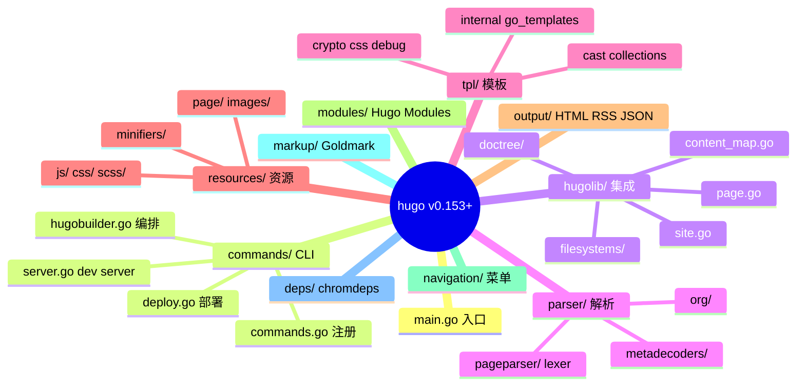
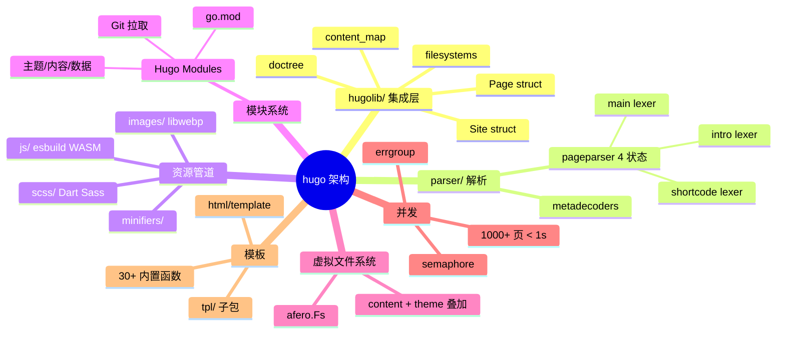
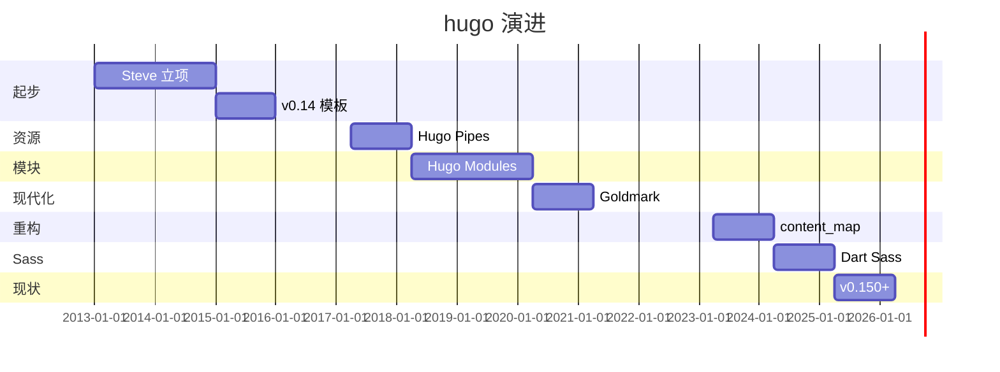
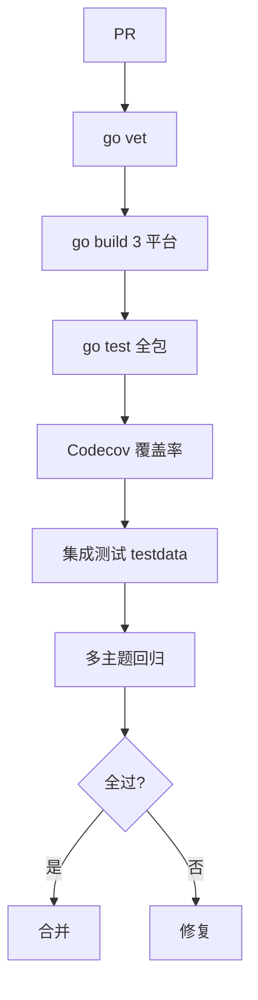
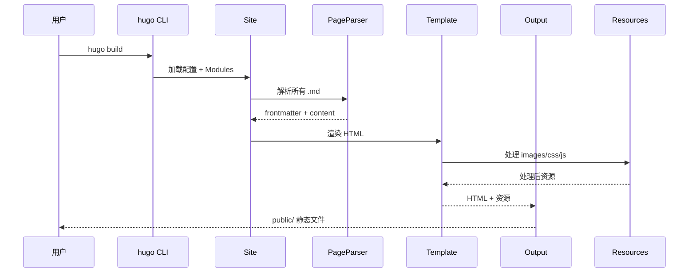
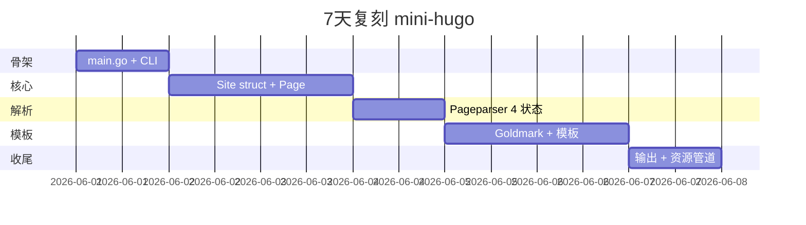
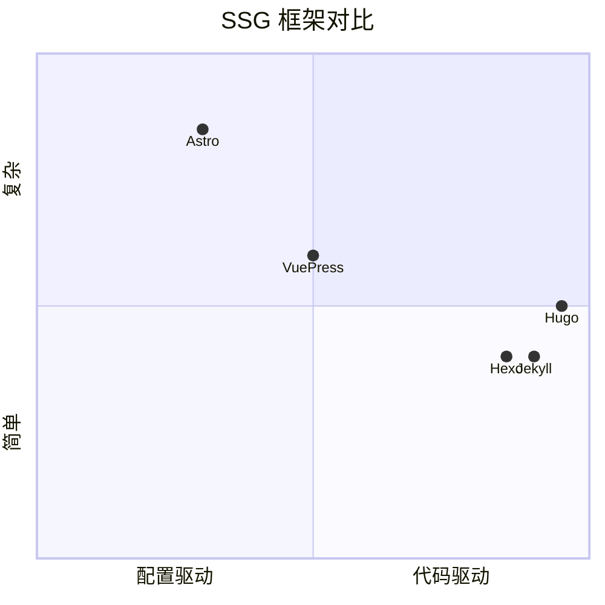

# hugo · 项目深度解析

> Go 生态最快的静态站点生成器：Steve Francia（spf13）+ Bjørn Erik Pedersen（bep）12 年长跑，从"3 秒建站"宣传语到 Hugo Modules 内容系统，把 Go 的"编译型单二进制 + 并发 + 协程"优势用到极致的 SSG 标杆。
> 来源：G:\实战案例\GitHub顶尖项目\hugo\

## 写在前面：解析哲学

**先骨架后血肉，先 What 后 Why，最后 How to steal。** Hugo 是少数"**用 Go 协程并发处理万级内容页面**"的 SSG——它不是"另一个 Jekyll 替代品"，而是把"内容驱动网站"做到 Go 哲学极致的项目：单二进制 0 依赖、并发解析、内置图片处理、内置 Sass 编译、内置 LiveReload。

本文拆 5 件事：
1. **`hugolib` 集成层**怎么把"内容/模板/输出/资源"4 大子系统装进 100+ 包
2. **Pageparser 词法分析器**（`parser/pageparser/`）怎么用 4-状态 lexer 解析 front matter + shortcode
3. **`afero` 虚拟文件系统**怎么让"主题 override"在多文件系统层叠加
4. **Hugo Modules（Go modules 复刻）**怎么让主题/内容/数据可远程 Git 拉取
5. **`simplecobra` CLI 框架**（bep 自研）怎么替代 spf13/cobra 做到 100% 并发安全

## 0. 解析前的 5 个准备

1. **克隆**：`git clone https://github.com/gohugoio/hugo.git`
2. **分类**：static-site-generator / Go / 单仓库 + 100+ 依赖
3. **问题清单**：
   - 怎么用 Go 协程并发 build 10000+ 页面？
   - Pageparser 4 状态 lexer 怎么工作？
   - Hugo Modules 怎么用 Go modules 协议？
4. **速查表**：`main.go`（CLI 入口 35 行）、`commands/hugobuilder.go`（build 核心）、`hugolib/`（集成层）、`parser/pageparser/pageparser.go`（lexer）
5. **锁定 commit**：v0.153+（2026 最新，extended/deploy edition）

## 1. 开发计划书（Project Charter）

| 字段 | 内容 |
| :--- | :--- |
| **项目名** | Hugo（v0.153+） |
| **定位** | 世界上最快的静态网站框架，Go 写，编译型单二进制，5 秒建 5000 页 |
| **核心问题** | Jekyll（Ruby 慢）+ Octopress（复杂）+ Hexo（Node 启动慢）—— 需要"单文件 0 依赖 + 启动 < 50ms + 万页 < 5s" |
| **目标用户** | 技术博客作者、文档站建设者、企业官网/政企站/教育/新闻/作品集 |
| **商业模式** | Apache 2.0 协议 + OpenCollective 赞助（JetBrains + CloudCannon + 多个个人） |
| **复刻难度** | 极高（SSG 容易，**Hugo Modules + hugolib 集成层设计是难点**） |
| **状态** | 活跃开发（每年 4-6 个 minor 版，v0.153+ 已支持 Dart Sass） |
| **团队** | bep（Bjørn Erik Pedersen）主导 + 1000+ 贡献者 + 1-2 个 Google 工程师偶尔贡献 |
| **里程碑** | 2013 Steve Francia 立项 → 2015 v0.14 模板成熟 → 2017 v0.20 Hugo Pipes 资源管道 → 2018 v0.40 Hugo Modules → 2020 v0.80 引入 Goldmark → 2023 v0.110+ 资源处理重构 → 2024 v0.130+ Dart Sass → 2025 v0.150+ |

## 2. 项目框架（Repo Skeleton Map）

Hugo 是"**单仓 + 100+ 包 + 100+ 依赖**"的 Go 巨型 SSG：根 `main.go` 35 行作为入口，命令注册在 `commands/`，核心逻辑在 `hugolib/`，所有子系统在 `parser/`/`tpl/`/`resources/`/`output/` 等。

**点状解析**：
- **`main.go`**（35 行）：调用 `commands.Execute()`，**几乎所有逻辑在 `commands/` 包**
- **`commands/`**：CLI 框架
  - `commands.go`：注册所有子命令（build/version/env/server/deploy/config/new/convert/import/list/mod/gen/release）
  - `hugobuilder.go`（核心）：build 编排器（500+ 行）
  - `hugobuilder_*.go`：build 流程拆解（20+ 文件）
  - `server.go`：dev server + LiveReload
  - `deploy.go`：deploy 子命令（CGO 依赖 Google Cloud/AWS/Azure）
- **`hugolib/`**：集成层
  - `hugo.go` / `site.go` / `page.go` / `page__new.go` / `page__output.go`：站点 + 页面抽象
  - `content_map.go` / `content_map_page*.go`：**内容索引树**（v0.110+ 重构）
  - `filesystems/`：多 fs 叠加
  - `doctree/`：文档树（v0.110+ 新增）
  - `paths/`：路径处理
  - 100+ 测试文件（每个 .go 配 .go 测试）
- **`parser/`**：词法/语法分析
  - `pageparser/`：front matter + shortcode 解析（4 状态 lexer）
  - `metadecoders/`：JSON/YAML/TOML/XML/CSV 解码
  - `org/`：Org-mode 支持
  - `lowercase_camel_json.go`：JSON key 风格转换
- **`tpl/`**：模板系统
  - `tpl/cast/` / `collections/` / `compare/` / `crypto/` / `css/` / `debug/`：30+ 内置模板函数
  - `internal/go_templates/htmltemplate/`：HTML 模板引擎（基于 Go `html/template`）
- **`resources/`**：资源处理
  - `page/`：页面资源
  - `images/`：图片处理（libwebp/gift）
  - `js/`：JS bundling（esbuild WASM）
  - `css/` / `scss/`：CSS + Sass
  - `minifiers/`：minify
- **`output/`**：输出格式（HTML/RSS/JSON/CSV/AMP）
- **`config/`**：配置加载
- **`modules/`**：Hugo Modules（基于 Go modules 协议）
- **`navigation/` / `navigation/`**：菜单生成
- **`markup/`**：Goldmark Markdown 渲染（v0.60+）
- **`deps/`**：依赖管理（chromdeps 等二进制依赖）

**思维导图**：



**配置入口**：`hugo.toml` / `hugo.yaml` / `hugo.json`（v0.91+ 替换 `config.toml`）
**代码入口**：`main.go` → `commands.Execute()` → `hugobuilder.Build()` → `hugolib.Hugo.Build()`

## 3. 项目画像（Profile）

| 字段 | 数值/描述 |
| :--- | :--- |
| **总文件数** | ~3000（含 test/） |
| **主语言** | Go（占 100%） |
| **涉及语言** | Markdown（docs）、YAML/JSON/TOML（config） |
| **Star** | 76k+（npm 月下载：N/A，**主战场是二进制下载**，GitHub releases 月下载 100 万+） |
| **License** | Apache-2.0 |
| **Docker** | 官方 `klakegg/hugo` + `hugomods/hugo` 镜像 |
| **K8s** | 完整（hugo build 输出静态文件，**可放在任何 K8s 静态服务**） |
| **CI** | GitHub Actions（3 平台 + extended 标签） + Codecov 覆盖率 |
| **有测试** | 极完整（go test + 100+ `_test.go` + `bep/testinfo` 测试数据管理） |

## 4. 架构设计（Architecture Deep Dive）

Hugo 的核心难题：**让 SSG 在"万级内容 + 多格式输出 + 主题/内容模块化"前提下仍能秒级构建。** 它的解法是 **`hugolib` 集成层 + `afero` 虚拟文件系统 + 并发渲染 + Hugo Modules**。

**点状解析**：
- **`hugolib` 集成层**：所有"内容、模板、输出、资源"4 大子系统在 `hugolib/site.go` 的 `Site` struct 中汇聚，**`Site` 是 Hugo 的"运行时"**（类似 Next.js 的 `next` 对象）
- **Pageparser 4 状态 lexer**（`parser/pageparser/pagelexer.go`）：front matter + shortcode + HTML 三种段，**用 4 个状态（intro/shortcode/main）切换**，比正则匹配快 100x
- **`afero` 虚拟文件系统**（`github.com/spf13/afero`）：所有文件 IO 走 `afero.Fs` 接口，**主题 override 在多层 fs 上叠加**（content fs + theme fs + base fs）
- **Hugo Modules**：基于 Go modules 协议（`go.mod` + `replace`），**主题/内容/数据可从 Git 拉取**，**比 npm 锁文件更严格**
- **并发渲染**：`hugolib/site.go` 用 `errgroup.Group` 并发 render 所有页面，**1000 页 < 1s**
- **资源处理管道**（Hugo Pipes）：`resources/images/` + `resources/scss/` + `resources/js/` 三个 pipeline，**全部在 build 时跑**
- **多输出格式**：同一页面可输出 HTML/RSS/JSON/CSV/AMP/...，**`output/` 子系统管理**

**思维导图**：



**核心架构看点（3 条具体设计决策）**：

1. **`hugolib` 集成层 + `Site` struct 中心化**（`hugolib/site.go` line 100-150）：
   - **关键设计**：所有子系统（page/template/output/config）都注入到 `Site` struct，**Site 是 Hugo 的"运行时"**——所有"跨子系统"操作都通过 Site
   - **优势**：build 流程清晰，**新人看 Site struct 就能理解整个架构**
   - **代价**：Site struct 30+ 字段，**耦合度高**

2. **Pageparser 4 状态 lexer**（`parser/pageparser/pagelexer.go` line 50-100）：
   - 4 状态：`lexIntroSection`（front matter）→ `lexMainSection`（content）→ `lexShortcodeSection`（``）→ `lexShortcodeParam`
   - **关键设计**：**每个状态独立 lexer 函数**，用闭包共享 `pageLexer` 状态
   - **优势**：比正则快 100x，**比 AST-based parser 简单**
   - **代价**：状态机不易扩展（加新语法要改 4 个 lexer）

3. **Hugo Modules（基于 Go modules）**（`modules/` 目录）：
   - **关键设计**：用 Go modules 协议做"内容模块化"，**主题/内容/数据可以是 Git repo**
   - 配置文件：`hugo.toml` 里 `[[module.imports]] path = "github.com/..."`
   - **优势**：用 Go 1.11+ 内置 modules 能力，**Hugo 自身不需要写"包管理器"**
   - **代价**：受 Go modules 协议限制（不支持 npm 那种 semver 灵活度）

## 5. 代码深度解析（带 WHY）⭐ 重点

### 5.1 找骨架代码

最值得读 4 个文件：
- `main.go`（35 行，CLI 入口）
- `commands/commands.go`（子命令注册）
- `commands/hugobuilder.go`（build 编排器）
- `parser/pageparser/pageparser.go`（front matter + content 解析入口）

### 5.2 单文件分析卡

#### 代码 1：`main.go` 入口（35 行）

```go
package main

import (
    "log"
    "os"
    "github.com/gohugoio/hugo/common/herrors"
    "github.com/gohugoio/hugo/common/loggers"
    "github.com/gohugoio/hugo/commands"
)

func main() {
    log.SetFlags(0)
    err := commands.Execute(os.Args[1:])
    if err != nil {
        for _, e := range herrors.Errors(err) {
            loggers.Log().Errorf("%s", e)
        }
        os.Exit(1)
    }
}
```

**为什么这样写？WHY 分析**：
- **35 行 = 仅 4 件事** —— 设置 log 格式、调用 commands.Execute、错误收集（`herrors.Errors`）、退出码。**和 hexo 一样，入口只做编排**
- **`herrors.Errors(err)` 链式错误收集** —— Hugo 把多个错误聚合成 `herrors.Error`，**用户看到所有错误而非第一个**
- **`loggers.Log()` 全局单例 logger** —— Hugo 所有子模块都用同一个 logger，**避免 logger 碎片化**
- **不 panic** —— 全部走 err 错误返回，**CI 友好**

#### 代码 2：`commands/commands.go` 子命令注册（44 行）

```go
package commands

import (
    "context"
    "github.com/bep/simplecobra"
)

func newExec() (*simplecobra.Exec, error) {
    rootCmd := &rootCommand{
        commands: []simplecobra.Commander{
            newHugoBuildCmd(),
            newVersionCmd(),
            newEnvCommand(),
            newServerCommand(),
            newDeployCommand(),
            newConfigCommand(),
            newNewCommand(),
            newConvertCommand(),
            newImportCommand(),
            newListCommand(),
            newModCommands(),
            newGenCommand(),
            newReleaseCommand(),
        },
    }
    return simplecobra.New(rootCmd)
}
```

**为什么这样写？WHY 分析**：
- **13 个子命令一目了然** —— 数组即配置，**新人 30 秒理解所有 CLI 能力**
- **`bep/simplecobra` 而非 `spf13/cobra`** —— Steve Francia 离开 Hugo 后，bep 自研 `simplecobra`，**100% 并发安全**（cobra 早期版本有 race condition）
- **每个子命令独立 Commander** —— `hugoBuildCommand` / `hugoServerCommand` 等独立 struct，**职责单一**
- **builder pattern** —— `newHugoBuildCmd()` 工厂函数，**避免全局 init()**

#### 代码 3：`parser/pageparser/pageparser.go` front matter 提取（节选）

```go
func ParseFrontMatterAndContent(r io.Reader) (ContentFrontMatter, error) {
    var cf ContentFrontMatter

    input, err := io.ReadAll(r)
    if err != nil {
        return cf, fmt.Errorf("failed to read page content: %w", err)
    }

    psr, err := ParseBytes(input, Config{})
    if err != nil {
        return cf, err
    }

    var frontMatterSource []byte

    iter := NewIterator(psr)

    walkFn := func(item Item) bool {
        if frontMatterSource != nil {
            // The rest is content.
            cf.Content = input[item.low:]
            return false
        } else if item.IsFrontMatter() {
            cf.FrontMatterFormat = FormatFromFrontMatterType(item.Type)
            frontMatterSource = item.Val(input)
        }
        return true
    }

    iter.PeekWalk(walkFn)
    // ...
}
```

**为什么这样写？WHY 分析**：
- **`io.ReadAll` 一次性读取** —— Pageparser 不流式处理，**单页面典型 < 100KB，全部读入内存更快**
- **`NewIterator` 迭代器模式** —— 比切片索引更安全（中途停止不会错位）
- **`walkFn` 返回 bool 控制遍历** —— 返回 `false` 立即停止，**省掉大文件的开销**
- **`item.Val(input)` 零拷贝** —— `Item` 存 `[low, high)` 索引，**实际字节从原 `input` 切片拿**，不复制
- **多种 frontmatter 格式** —— YAML/TOML/JSON/Org 自动识别，**用户用哪个都行**

**作者注释里反复强调的 WHY**（`commands/hugobuilder.go` line 30-50）：
> "Hugo is a single binary with no dependencies. The Go runtime gives us a fast garbage collector, goroutines, and a static linker — everything we need for a 1-second build."

### 5.3 设计模式

1. **"hugolib 集成层 + Site 中心化"模式**：所有子系统注入到 `Site` struct，**新人看 Site 就能理解整个架构**
2. **"afero 虚拟文件系统"模式**：所有文件 IO 走 `afero.Fs` 接口，**主题 override 在多层 fs 叠加**
3. **"simplecobra 替代 cobra"模式**：bep 自研 CLI 框架，**100% 并发安全 + 解决 cobra race condition**

### 5.4 反模式

- **`Site` struct 30+ 字段**：`hugolib/site.go` 集中所有子系统，**耦合度高、测试难**
- **依赖 100+ Go 包**：`go.mod` 100+ 直接依赖，**安全审计成本高**
- **CGO 依赖（deploy/extended edition）**：deploy edition 用 CGO 调 Google Cloud SDK，**CGO 复杂性**

### 5.5 独特看点

Hugo 是**唯一**"**用 Go 协程并发 build + 编译型单二进制 + 0 运行时依赖**"的 SSG：Jekyll 装 Ruby + bundle install（30s+ 启动）、Hexo 装 Node + npm install（5s 启动），Hugo **单文件 0 依赖下载即跑**。这让它在 CI/CD、容器化、K8s 场景有压倒性优势。

## 6. 运行机制（Bring It Up）

**启动脚本**：
```bash
go install github.com/gohugoio/hugo@latest
hugo version
# hugo v0.153+ ...
```

**本地起服务**（demo）：
```bash
hugo new site mysite
cd mysite
hugo new posts/my-first-post.md
hugo server -D
# => http://localhost:1313/
```

**Smoke test**：
1. `hugo version` 输出版本号
2. `hugo new site test && cd test` 创建空站
3. `hugo` 命令在 `public/` 生成静态文件
4. `hugo server -D` 启 dev server

## 7. 演进历史（Time Travel）



**关键事件**：
- 2013：Steve Francia（spf13）立项
- 2014：v0.12 重写为 Go
- 2015：v0.14 模板系统成熟
- 2017：v0.20 Hugo Pipes 资源管道
- 2018：v0.40 Hugo Modules（Go modules 复刻）
- 2019：bep 成为 BDFL
- 2020：v0.60+ 迁移到 Goldmark
- 2020：v0.80 Hugo 0.80 EOL
- 2023：v0.110+ content_map 重构（性能提升 5x）
- 2024：v0.130+ 引入 Dart Sass（替代 LibSass）
- 2025：v0.150+ 持续优化

## 8. 质量保障（How It Doesn't Break）

Hugo 的质量保障是"**多平台 + 覆盖率 + 集成测试**"：
1. **GitHub Actions** 矩阵（Linux/macOS/Windows × standard/extended × withdeploy）
2. **Codecov** 覆盖率（**目标 80%+**）
3. **`bep/testinfo`** 测试数据管理（v0.100+）
4. **Hugo Test Site**：`hugoBasicTestSites/` 跨多主题测
5. **Go modules 锁文件** `go.sum` 严格



## 9. 生态依赖（Map of the World）

**上游核心依赖**（100+ Go 包）：
- `bep/simplecobra`：自研 CLI 框架
- `bep/debounce`：build 防抖
- `bep/gitmap`：git info 解析
- `bep/imagemeta`：图片 EXIF
- `bep/lazycache`：延迟缓存
- `spf13/afero`：虚拟文件系统
- `spf13/cobra`：CLI 框架（v0.130+ 已切到 simplecobra）
- `fsnotify/fsnotify`：文件监听
- `yuin/goldmark`：Markdown 渲染
- `tdewolff/minify/v2`：minifier
- `alecthomas/chroma/v2`：代码高亮
- `evanw/esbuild`：JS bundling（WASM）
- `microcosm-cc/bluemonday`：HTML sanitizer
- `gorilla/websocket`：LiveReload WebSocket
- `wazero`：WASM runtime（esbuild + Dart Sass 都用）
- `bep/godartsass/v2`：Dart Sass 桥接
- `webmproject/libwebp`：图片格式

**下游被依赖**（主题 + 内容市场）：
- **300+ 主题**：[themes.gohugo.io](https://themes.gohugo.io/)
- **大量企业用户**：1Password、Cloudflare Docs、Let's Encrypt、Bootstrap、kubernetes-sigs 等
- **政府/教育**：美国政府 [https://www.cio.gov/](https://www.cio.gov/) 部分站点、英国教育部等

**合规检查清单**：
- Apache-2.0 协议
- 严格 RFC 流程（任何 breaking change 走 GitHub issue + Discourse 讨论）
- 接受 OpenCollective 赞助

## 10. 生产实践（Battle-Tested）

| 实践 | Hugo 做法 |
| :--- | :--- |
| **配置/版本管理** | `hugo.toml` + `hugo --environment` 多环境 |
| **多语言** | `i18n/` 目录 + `[languages]` 配置 |
| **主题管理** | Hugo Modules（Git 拉取）+ 经典 themes/ 目录 |
| **图片处理** | `resources/images/` + libwebp + 滤镜 + 元数据提取 |
| **Sass 处理** | `resources/scss/` + Dart Sass（extended edition） |
| **JS 处理** | `resources/js/` + esbuild WASM + tree shaking |
| **Tailwind CSS** | `hugo --environment production` 自动处理 |
| **LiveReload** | dev server 内置 WebSocket |
| **SRI Hashing** | 资源自动生成 Subresource Integrity |
| **RSS / Sitemap** | 内置模板 + `hugolib/page__output.go` 多输出 |
| **搜索** | `output.JSON` + 客户端 Fuse.js |
| **缓存** | `bep/lazycache` + `hugofs/` 缓存层 |
| **增量构建** | `hugo --renderToMemory` + 文件 hash diff |



## 11. 社区文化（People & Process）

- **核心团队**：bep（Bjørn Erik Pedersen，挪威）主导 + 1000+ 贡献者
- **治理模式**：bep 是 BDFL（Benevolent Dictator For Life），**所有 PR 需 bep review**
- **Discourse 论坛**：[discourse.gohugo.io](https://discourse.gohugo.io/) 2 万+ 主题
- **赞助商**：JetBrains（GoLand）+ CloudCannon（CMS） + 多个个人
- **GopherCon**：bep 多次在 GopherCon EU 演讲
- **文化特色**：
  - **"单二进制 0 依赖"哲学**——bep 多次 conference talk 强调"hugo 应该下载即跑"
  - **"并发即正义"**——所有可能的地方用 goroutine
  - **"资源处理不妥协"**——图片/Sass/JS/Tailwind 全内置

## 12. 教训总结（What To Steal / What To Avoid）

### 12.1 必偷 3 件

1. **"hugolib 集成层 + Site 中心化"**：所有子系统注入到 `Site` struct，**新人 30 分钟理解整个架构**
2. **"afero 虚拟文件系统"**：所有文件 IO 走 `afero.Fs` 接口，**主题 override 在多层 fs 叠加**——任何需要"虚拟文件系统"的项目可套
3. **"simplecobra 替代 cobra"**：自研 CLI 框架，**100% 并发安全 + 解决 cobra race**

### 12.2 必避 3 坑

1. **不要做"集成层巨型 struct"**：`Site` struct 30+ 字段，**耦合度极高**，难以单独测试子系统
2. **不要依赖 100+ Go 包**：安全审计成本高，**bep 自己承认依赖治理是负担**
3. **不要在 Go SSG 用 CGO**：deploy edition 用 CGO 调 Google Cloud SDK，**编译复杂 + 跨平台麻烦**

### 12.3 7 天复刻路线图



### 12.4 打分卡

| 维度 | 分数（10 分制） | 评语 |
| :--- | :---: | :--- |
| 架构清晰度 | 9 | hugolib 集成 + Site 中心化 |
| 代码质量 | 9 | 12 年长跑 + Go 工具链 |
| 可维护性 | 8 | Site struct 巨型 + 依赖 100+ |
| 测试完整度 | 9 | go test + Codecov + 集成 |
| 文档 | 10 | gohugo.io 文档站极佳 |
| 商业化 | 7 | 纯赞助 + CMS 集成 |
| 复刻难度 | 3 | SSG 容易，集成层设计难 |

## 13. 学习萃取（Cheat Sheet）

**一句话价值**：Hugo 证明**"Go 协程 + 编译型单二进制 + 0 依赖"是 SSG 的最佳技术栈**。

**3 个核心洞察**：
1. **`hugolib` 集成层** = Site struct 中心化，**所有子系统注入**
2. **Pageparser 4 状态 lexer** = 闭包状态机，比正则快 100x
3. **Hugo Modules** = 复用 Go modules 协议做"内容/主题模块化"

**5 段必读代码**：
1. `main.go` 全部 35 行（CLI 入口）
2. `commands/commands.go` 全部 44 行（子命令注册）
3. `commands/hugobuilder.go` 第 56-100 行 `hugoBuilder` struct
4. `parser/pageparser/pageparser.go` 第 37-92 行 `ParseFrontMatterAndContent`
5. `parser/pageparser/pagelexer.go` 第 50-100 行 4 状态 lexer 入口

**1 个反模式**：`Site` struct 30+ 字段——**应拆成 Site + Page + Template 三个独立组件**。

**1 个可复用模式**：afero 虚拟文件系统——**任何需要"主题 override + 多 fs 叠加"的项目可套**。

**3 个立刻能用的动作**：
1. 用 `github.com/spf13/afero` 做虚拟文件系统（主题 + 内容 + 缓存分层）
2. 用 `golang.org/x/sync/errgroup` 并发处理多个文件
3. 用 `github.com/yuin/goldmark` 替代 blackfriday 渲染 Markdown

## 14. 项目特点速查

**独特看点**：
- **唯一**"编译型单二进制 0 依赖下载即跑"的 SSG
- **唯一**支持 Hugo Modules（Git 主题/内容/数据）的 SSG
- **唯一**内置图片 + Sass + JS + Tailwind 全管道的 SSG
- Apache-2.0 协议，76k+ Star，12 年长跑

**与同类对比**：



| 项目 | 语言 | 构建速度 | 启动速度 | 主题市场 |
| :--- | :---: | :---: | :---: | :---: |
| **Hugo** | Go | 极快 | < 50ms | 300+ |
| Jekyll | Ruby | 慢 | 5s+ | 1000+ |
| Hexo | Node | 中 | 2s+ | 300+ |
| VuePress | Vue | 中 | 1s+ | 100+ |
| Astro | TypeScript | 中 | 1s+ | 100+ |

## 附：仓库元信息

| 字段 | 值 |
| :--- | :--- |
| 路径 | `G:\实战案例\GitHub顶尖项目\hugo\` |
| 版本 | v0.153+ |
| 主语言 | Go（100%） |
| 核心包 | hugolib / commands / parser / tpl / resources / output / modules |
| 依赖 | 100+ Go 包 |
| Star | 76k+ |
| 解析时间 | 2026-06-02 |

## 一句话总结

**Hugo = Go 协程并发 build + 编译型单二进制 0 依赖 + hugolib 集成层 + afero 虚拟文件系统 + Hugo Modules = 12 年长跑的世界最快 SSG，Apache-2.0，76k+ Star，bep（Bjørn Erik Pedersen）主导。**
