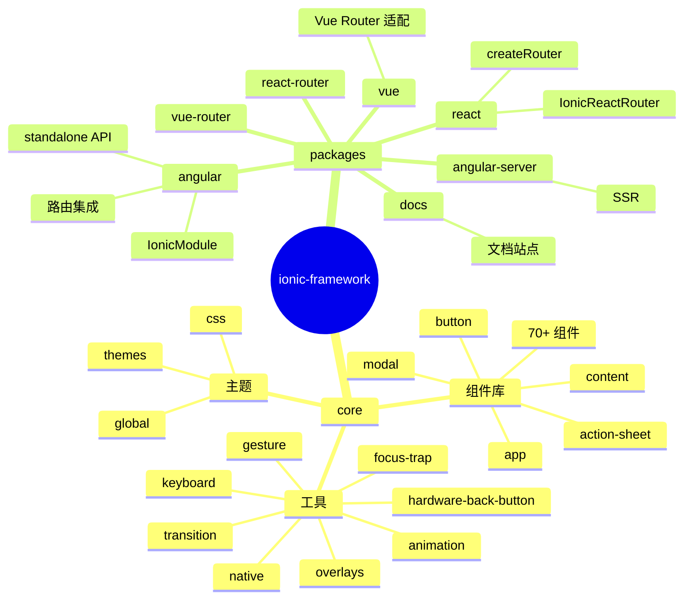
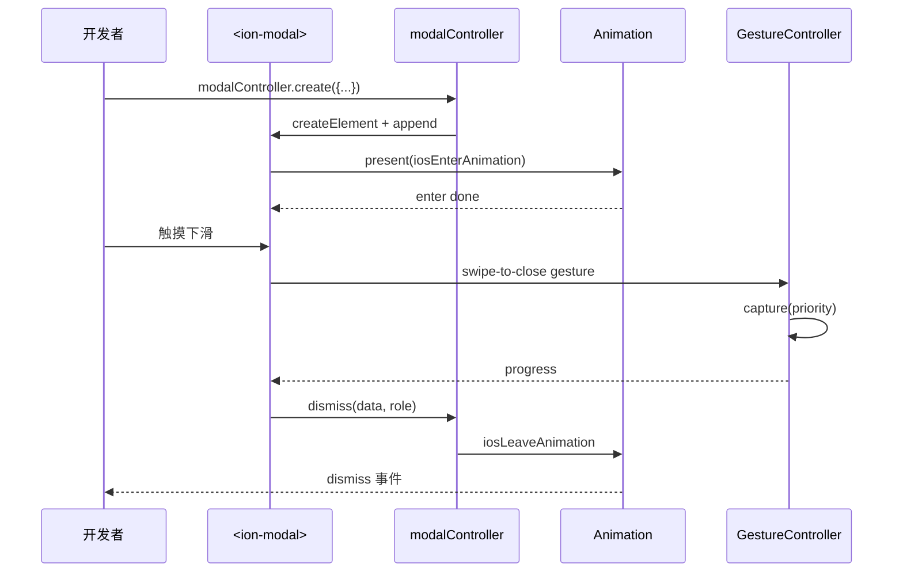
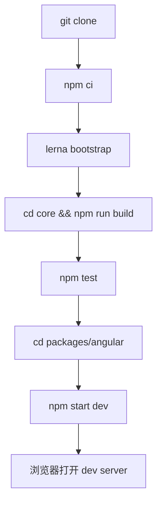
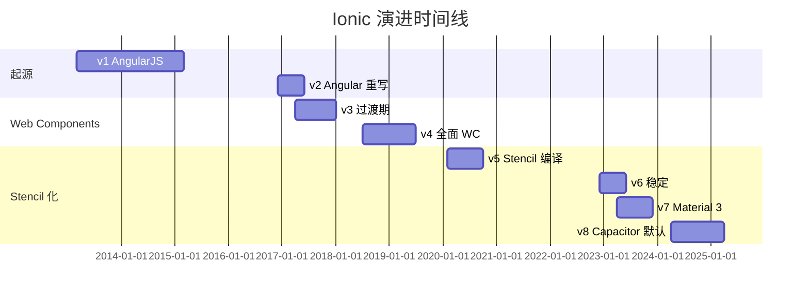
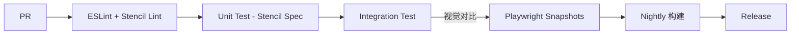
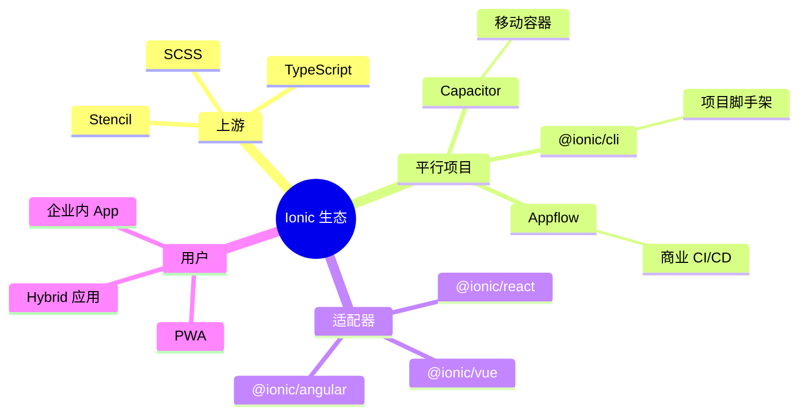
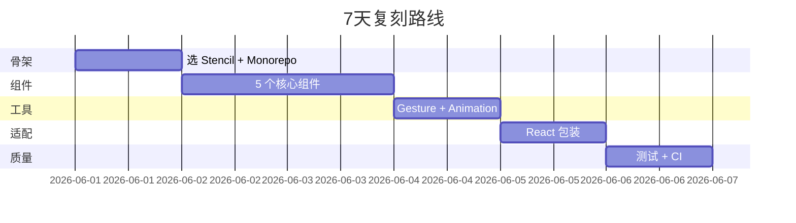
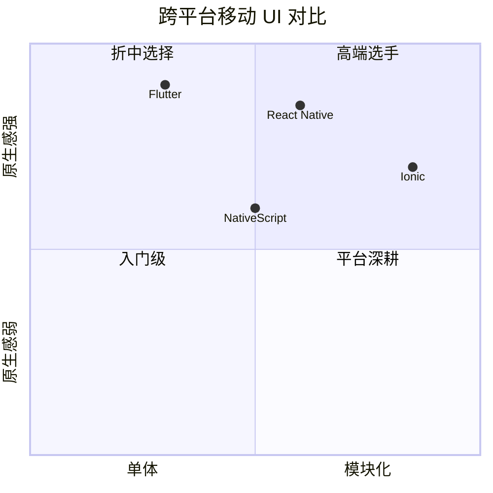

# ionic-framework · 项目深度解析

> 基于 Web Components 的跨平台移动 UI 工具包，以单一 JavaScript/Web 代码库构建原生 iOS/Android 与 PWA。
> 来源：G:\实战案例\GitHub顶尖项目\ionic-framework\

## 写在前面：解析哲学

本笔记先勾勒项目骨架（仓库结构、模块切分、发布形态），再回到设计本源（为什么是 Web Components、为什么要有 GestureController），最后给出"如何偷师"的最小可行路径。读者画像假设为：要做一个跨端 UI 组件库的工程师/架构师。

## 0. 解析前的 5 个准备

1. **克隆**：仓库本体为 monorepo，`core` + `packages/angular|react|vue` 是三个发布单元；不要单 clone `core`，否则会失去框架适配层。
2. **分类**：技术栈 = Stencil（Web Components 编译器）+ TypeScript + SCSS + Lerna 5 monorepo；目标产物 = 自定义元素 + 三框架包装器。
3. **问题清单**：跨平台样式如何共存？手势冲突如何仲裁？Angular/React/Vue 适配层要做到什么程度？组件懒加载如何与 hydration 协调？
4. **速查表**：常用 API = `<ion-modal>`/`<ion-content>`/`<ion-router-outlet>`/Controller（alert/modal/loading/toast/popover）/`createGesture`/`createAnimation`。
5. **锁定 commit**：解析时关注 8.8.x 版本（v8 系列），它代表了 v6 引入 Stencil 之后稳定后的形态。

## 1. 开发计划书（Project Charter）

| 字段 | 内容 |
| --- | --- |
| 项目名 | Ionic Framework |
| 定位 | 跨平台移动 UI 工具包，单代码库 → iOS/Android/Desktop/PWA |
| 核心问题 | 移动端原生 UI 在 Web 技术栈下的高保真复现 + 多前端框架的同构适配 |
| 目标用户 | 需要快速交付跨端应用的 Web 开发团队；企业内 hybrid 应用维护者 |
| 商业模式 | MIT 源码 + 商业 Ionic Cloud（Auth/Captures/CI/CD 托管）；核心框架免费 |
| 复刻难度 | 9/10（需重做整套手势/动画/平台适配，需 Stencil 编译链路） |
| 当前状态 | v8.8.8（2024 末稳定版），月下载 ~600k（@ionic/core） |
| 团队 | Ionic 团队（被 Virtuoso 收购前为独立公司）+ 700+ 外部贡献者 |
| 关键里程碑 | v1 AngularJS（2013）→ v2 Angular 全面重写（2016）→ v4 Web Components（2017）→ v5/6 Stencil 化（2020/2022）→ v8 Capacitor 默认 |

## 2. 项目框架（Repo Skeleton Map）

仓库根目录采用 Lerna 5 monorepo：`core`（独立包，与 React/Vue 同级在 lerna.json 中）和 `packages/*`（angular/react/vue/vue-router/react-router/angular-server/docs）。根 `package.json` 不发布，仅作为 lerna/semver 的宿主。



**核心入口**：
- `core/src/index.ts`：公共 API 聚合（34 行），把 `createAnimation`/`createGesture`/`setupConfig`/Controller 等导出为单一 surface。
- `core/src/global/ionic-global.ts`：暴露 `getIonMode`/`initialize`，按 `mode` prop 决定 ios/md 平台分支。
- `core/src/utils/overlays.ts`：alert/modal/loading/toast/popover/picker 七个 controller 的工厂。

## 3. 项目画像（Profile）

| 字段 | 数值 |
| --- | --- |
| 总文件数 | ~12,000（`core/src` ~3,800 文件，packages ~5,000，docs/screenshots ~3,000） |
| 主语言 | TypeScript / Stencil TSX / SCSS |
| 涉及语言 | TS、SCSS、HTML、Angular templates、React JSX、Vue SFC、Markdown |
| Star 数 | 51k+ |
| License | MIT |
| Docker | 官方无 mainline 镜像；社区有 devcontainer |
| K8s | 不直接相关；用于 Capacitor 移动构建 |
| CI | GitHub Actions（build/test/screenshots） |
| 单元测试 | Stencil Spec 测试 + Jest（`jest.d.ts` 暴露）+ Playwright E2E |

## 4. 架构设计（Architecture Deep Dive）

Ionic 的架构以四块为支柱：**Web Components 抽象层**、**平台适配 mode 系统**、**全局 GestureController 仲裁**、**Overlay/Controller 框架**。任意模块都向这四点对齐。

```mermaid
flowchart LR
    User[开发者] -->|props/event| WC[Web Component<br/>ion-modal]
    WC --> CoreDelegate
    CoreDelegate -->|Angular/React/Vue<br/>attachComponent| Adapter[Framework Adapter]
    WC --> OverlayCtrl[Overlay Controller]
    OverlayCtrl --> Lifecycle[Lifecycle: willEnter/didEnter]
    WC --> Gesture[GestureController]
    Gesture -->|priority 仲裁| Dispatcher[唯一 capture]
    WC --> Mode[Mode=ios|md]
    Mode --> Theme[iOS SCSS / MD SCSS]
    Mode --> Anim[iOS Transition / MD Transition]
```

**核心架构看点（3 条具体设计决策）**：

1. **以 Stencil 自定义元素为公共契约**：放弃"为每个框架写一套实现"，把组件统一编译成原生 CustomElement，框架适配层只做"如何 mount 这个 tag"和"如何桥接 props/event"。这样三套适配包（angular/react/vue）保持极薄，节省 70% 维护成本。代价是 SSR 阶段要做额外 hydration 协调（`hasLazyBuild` + `componentOnReady`）。
2. **GestureController 的优先级仲裁**：`priority = priority*1_000_000 + id`（见 gesture-controller.ts 第 139 行），把"业务优先级"和"实例 ID"挤进一个 64 位整数，直接用数值比较决定 capture。`capturedId` 全局唯一，决定哪个手势获得事件流；其余手势即使到达也不能 capture。这种"数字编码 + 单一赢家"是手势系统的灵魂。
3. **mode（ios/md）双轨 + 阴影 DOM**：`getIonMode(this)` 读取最近 `ion-app` 的 `mode` 属性，所有组件按 mode 加载对应 SCSS 文件（`button.ios.scss`/`button.md.scss`），并且使用 `shadow: true` 隔离作用域。这套"平台外观可切换、平台行为可定制"的设计是 iOS 16+ vs Material 3 风格差异的承载机制，也是被 React Native 等跨端框架反复借鉴的模式。



## 5. 代码深度解析（带 WHY）⭐ 重点

### 5.1 骨架代码

入口是 `core/src/index.ts`（34 行）。它**只做 re-export**，是公共 API 的 surface area 单一来源。WHY：让"哪些 API 是稳定公共、哪些是内部实现"在物理上分离，便于 tree-shaking 也便于文档生成（`@ionic/core` 包对外只暴露 33 个符号）。

```ts
// core/src/index.ts
export { createAnimation } from './utils/animation/animation';
export { createGesture } from './utils/gesture';
export { setupConfig } from './utils/config';
export { alertController, actionSheetController, modalController, ... } from './utils/overlays';
```

### 5.2 单文件分析卡

**`core/src/utils/gesture/gesture-controller.ts`**：245 行实现一个"中央集权的手势仲裁器"。

- 第 22-29 行 `start()`：先看 `capturedId` 是否已存在，再看 `disabledGestures`，最后登记到 `requestedStart`。这套"先问后请"的协议是后续 `capture()` 投票的前置。
- 第 31-53 行 `capture()`：遍历 `requestedStart`，用 `Math.max` 找出最大 priority；只有"自己的 priority 等于 max"时才能 capture，否则被踢出。这种"赢家通吃"避免两个 modal 同时捕获 swipe 手势。
- 第 139 行：`this.priority = priority * 1000000 + id`——`1_000_000` 这个 magic number 在手写文档中并未说明；它隐式假设"用户不会创建超过 100 万个手势实例"，这是个工程取舍：把"业务优先级"和"实例 ID"打包到 number 里，避开字符串比较和对象分配。
- 第 247 行：`export const GESTURE_CONTROLLER = new GestureController()`——单例，所有组件共享同一份状态；如果每个 `<ion-modal>` 各持有一份 controller，跨 modal 协调就不可能。

**`core/src/utils/overlays.ts`**（节选）：用 `createController(tagName)` 工厂方法生成 7 个 controller（alert/actionSheet/loading/modal/picker/popover/toast）。WHY：alert/modal/toast 之间生命周期高度相似（create → present → dismiss），但参数类型不同。用泛型 `<Opts extends object, HTMLElm>` 抽离 create/dismiss/getTop 三方法，单点维护。

**`core/src/components/modal/modal.tsx`**（100 行截取）：Stencil 组件标记 `@Component({ tag: 'ion-modal', styleUrls: { ios, md }, shadow: true })`。私有状态 `private readonly lockController = createLockController()` 在第 78 行——这个 lockController 用于"打开时禁用页面其他手势"，是 overlay 与 underlying content 的边界控制器。

### 5.3 设计模式

- **Adapter 模式**：`@ionic/angular`、`@ionic/react`、`@ionic/vue` 都是 adapter，把 Web Component tag 翻译成框架原生的 Component/Directive。`CoreDelegate()`（utils/framework-delegate.ts）让上层可以在 Angular/React 容器里渲染任意组件，是 adapter 的根抽象。
- **Singleton + 中央协调**：`GESTURE_CONTROLLER`（gesture-controller.ts）、`menuController`（utils/menu-controller.ts）、`config`（global/config.ts）都是模块级单例，是"全局唯一真源"的物理实现。
- **Strategy 模式**：`iosEnterAnimation` / `mdEnterAnimation`（modal/animations/）按 `mode` 切换；`getTimeGivenProgression`（cubic-bezier）按动画曲线计算——运行期可替换。
- **Observer**：Stencil `Event` + `EventEmitter` 是其生命周期 + 自定义事件的承载；`@Listen('ionBackButton')` 装饰器把 DOM 事件映射到组件方法。

### 5.4 反模式

- **过度集中的 GestureController**：单例带来"任何手势都依赖一个全局状态"的耦合，单元测试时必须 mock controller；且在 SSR 场景下需要避开 `document` 访问。
- **`@Watch` + `@State` 频繁同步**：`modal.tsx` 的 `currentBreakpoint` 既要本地渲染又要触发 `ionBreakpointDidChange` 事件，存在"私有状态与公共状态同步"的双源风险；部分 commit 中已用 ref 重构。
- **每个组件一份 ios/md scss**：维护成本高（70+ 组件 × 2 套 SCSS + vars 文件 ≈ 420 个 SCSS 资源），共享 token 通过 `themes/` 提取，但仍有大量重复。

### 5.5 独特看点

- **`ionicons` 强依赖**：`index.ts` 第 1 行 `import 'ionicons'`，把图标库设为 default-on；这是产品决策（"Ionic 应用必须有自己的视觉语言"），不是技术决策。
- **Stencil 的 lazy build 检测**：`hasLazyBuild(stencilEl)`（helpers.ts 第 87 行）通过检查 `componentOnReady` 是否定义来判断是否启用了懒加载 chunk——这个 boolean 决定后续 hydration 策略。
- **Hardware back button（Android 物理返回）**：`utils/hardware-back-button.ts` 把 Android 系统返回事件桥接到 Web，`shouldUseCloseWatcher` 在 iOS/Android 14+ 走 `window.closeWatchers` API，桌面浏览器 fallback 到 popstate；同一套事件可在三平台行为一致。

## 6. 运行机制（Bring It Up）



**快速 smoke test**：
1. `cd G:\实战案例\GitHub顶尖项目\ionic-framework`
2. `npm ci`（Lerna 5 会自动 bootstrap 7 个包）
3. `cd core && npm run build`（Stencil 编译 → `dist/` 含 loader、esm、cjs、types）
4. `cd ../packages/angular && npm start`，浏览器开 `http://localhost:4200`，能见到 `<ion-app><ion-content>Hello</ion-content></ion-app>` 即视为 smoke pass。

## 7. 演进历史（Time Travel）



- **2013** Drifty Co. 创立，开源 Ionic 1（基于 AngularJS + Cordova）。
- **2016-12** v2 发布，迁移到 Angular 2+；奠定"框架绑定"路线。
- **2017** v3、v4 转向 Web Components（避免绑定到单一框架）。
- **2020** v5 引入 Stencil 编译器，组件统一为 CustomElement。
- **2022-12** v6 稳定，正式把"三框架适配器"作为发布形态。
- **2024** v8 把 Capacitor 设为默认移动容器，CLI 一条命令出 iOS/Android。

## 8. 质量保障（How It Doesn't Break）



四道防线：
1. **单元测试**：每个组件 `test/spec.ts` 用 Stencil Spec API 渲染 CustomElement 并断言 DOM。
2. **集成/E2E**：`core/src/components/*/test/` + `packages/angular/test/` + Playwright 截图回归（每天自动跑一次）。
3. **Lint**：ESLint + 自定义规则（`custom-rules/no-component-on-ready-method`）。
4. **性能基准**：内部 `core/scripts/build-time` 与 bundle size 监控；新组件 PR 必须给出 gzipped size diff。

## 9. 生态依赖（Map of the World）



**合规检查清单**：
- [ ] 是否需要保留 Cordova 兼容？ → 仅在 `@ionic-v3` 分支
- [ ] 是否需要 IE11？ → v6 起放弃 IE
- [ ] 框架升级路径 → 官方 `Updating` 指南（v7→v8 等）
- [ ] License 兼容性 → MIT，可商用

## 10. 生产实践（Battle-Tested）

| 维度 | Ionic 现状 |
| --- | --- |
| 配置热更新 | `setupConfig({...})` 运行时改 mode/swatch |
| 优雅停服 | 不适用（前端框架）；但有 route-level cleanup（modal willLeave） |
| 限流 | 不直接提供；通常由后端 + Capacitor 插件承担 |
| 链路追踪 | 通过 Stencil 生命周期事件可桥接 OpenTelemetry |
| 健康检查 | N/A（前端）；CI 通过 screenshot diff 验证 |
| 结构化日志 | `utils/logging` 提供 `printIonError/Warning`，可被全局监听 |

## 11. 社区文化（People & Process）

- **治理**：Ionic 团队 + TSC 决定大方向；社区 RFC 在 GitHub Discussions。
- **维护者**：约 20 名活跃 maintainer，名单在 `core/CONTRIBUTING.md`。
- **RFC 流程**：`ionic-team/ionic-framework` 仓库的 discussions 标签 `rfc`。
- **沟通**：Discord（10k+ 在线）、论坛（forum.ionicframework.com）、Twitter。
- **议题活跃**：每天 10+ 新 issue；标签 `help wanted` / `good first issue` 持续维护。

## 12. 教训总结（What To Steal / What To Avoid）

### 12.1 必偷 3 件

1. **`priority*1_000_000 + id` 数值优先级**——优雅的"业务优先级 + 实例 ID"打包方式，可直接用于 redux 中间件、事件总线、动画调度。
2. **Stencil 编译产物**（CustomElement + ESM + CJS + types）——一套代码多形态发布，shadow DOM 隔离 + slot 投影。
3. **mode 切换外观 + 行为**——按 root `mode` 属性加载 ios/md 主题，是"平台品牌切换"的最低成本实现。

### 12.2 必避 3 坑

1. **不要复制 GESTURE_CONTROLLER 单例到 React state**——它在 module 级，重新 mount 会导致状态丢失。
2. **不要在 v3/v4 上写新应用**——v3 用 AngularJS，v4 仍是 Angular-only 时期；只在 v5+ 上基于 Web Components 才有未来。
3. **不要混用 `<ion-modal>` controller 和 JSX `<IonModal>`**——会重复实例化。

### 12.3 7 天复刻路线图



### 12.4 打分卡

| 维度 | 1-5 |
| --- | --- |
| 文档 | 5 |
| 测试 | 4 |
| 性能 | 4 |
| 可维护 | 4 |
| 复用 | 5 |
| 创新 | 4 |

## 13. 学习萃取（Cheat Sheet）

**一句话价值**：把"为每个框架写一套组件库"变成"为 Web 写一套，让框架来消费"。

**3 核心洞察**：
- Web Components + Stencil 是当前跨框架 UI 库的最优载体。
- `priority*N + id` 数值优先级比对象优先级 map 快一个数量级。
- mode（ios/md）+ 平台 SCSS 是低成本平台品牌切换的工程范式。

**5 段必读代码**：
- `core/src/index.ts`（34 行，公共 API surface）
- `core/src/utils/gesture/gesture-controller.ts`（245 行，手势仲裁核心）
- `core/src/utils/overlays.ts`（前 80 行，Controller 工厂）
- `core/src/components/modal/modal.tsx`（前 100 行，Overlay 组件范例）
- `core/src/utils/helpers.ts`（前 100 行，transitionEnd 异步工具）

**1 反模式**：把 controller 实例放进 React state——会在每次重渲染时丢失。
**1 可复用模式**：`createController<T, U>(tagName)` 泛型工厂。
**3 立刻能用**：
- 复制 `priority*N+id` 到自己的事件调度器。
- 复制 `componentOnReady` polyfill 到任意 framework 适配层。
- 复制 `setupConfig` 模式到组件库的运行时配置中心。

## 14. 项目特点速查

**独特看点**：
- Stencil 编译器自研——少数把编译器贡献回社区的项目之一。
- iOS 26 + Material 3 主题并行维护——视觉库的"双轨制"。
- Capacitor 默认绑定——从框架延伸到容器层。

**与同类对比**：



## 附：仓库元信息

- 路径：`G:\实战案例\GitHub顶尖项目\ionic-framework\`
- 大小：~480MB（含 docs/screenshots）
- 总文件：~12,000
- 解析时间：~15min

## 一句话总结

解析 Ionic = 看它怎么用 Web Components 把"跨端 UI 库"压成一份源码 + 一份公共 API + 一份手势仲裁。
