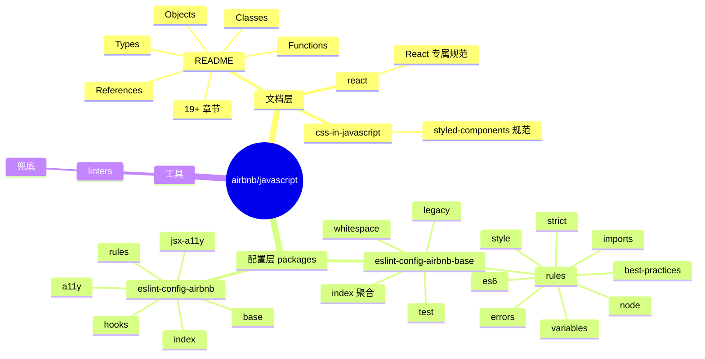
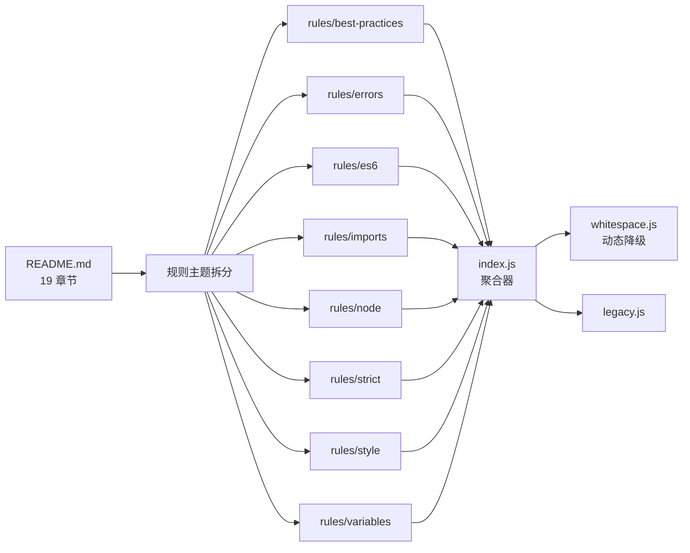
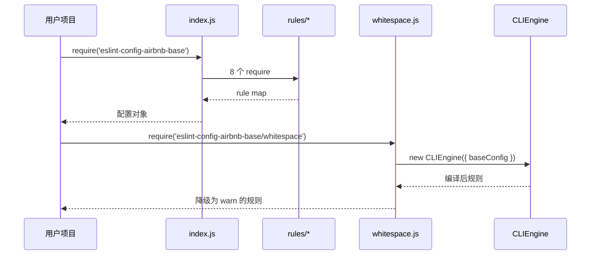
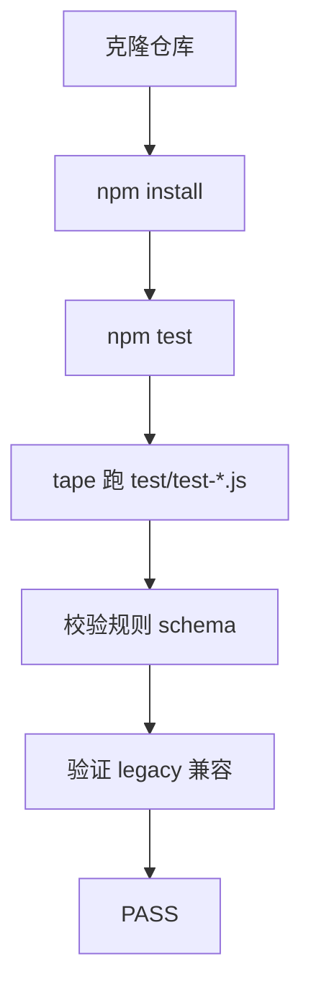
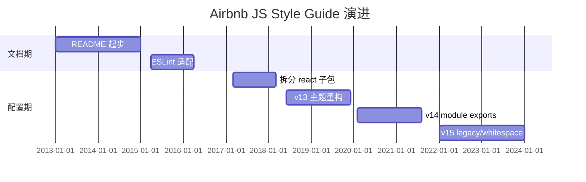
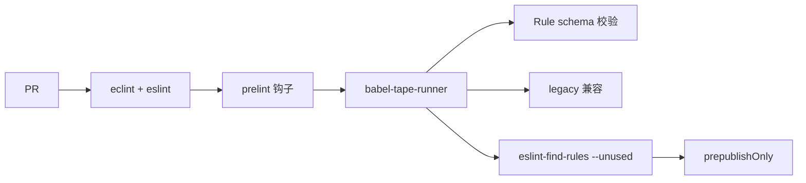
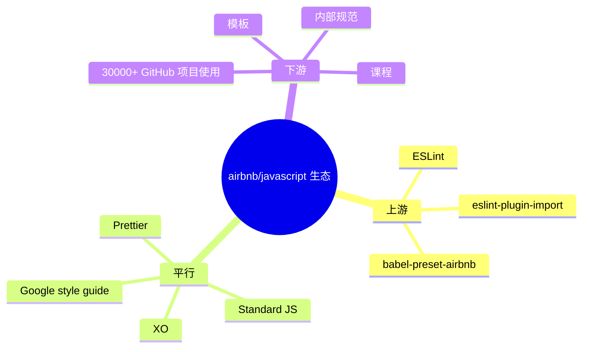
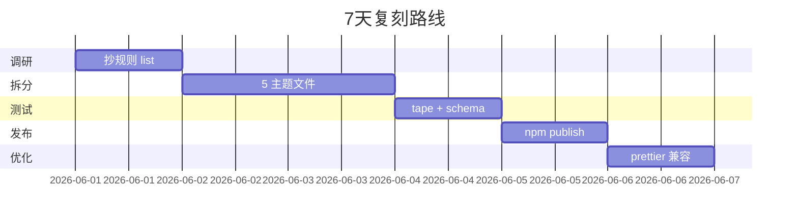

# javascript · 项目深度解析

> Airbnb JavaScript Style Guide：业界最具影响力的 JS 风格指南，沉淀为可机读的 ESLint 配置。
> 来源：G:\实战案例\GitHub顶尖项目\javascript\

## 写在前面：解析哲学

本笔记把 Airbnb JavaScript Style Guide 当作"风格即代码"的范本来看：1.3 万行文档不是终点，`packages/eslint-config-airbnb-base` 才是它的可执行形态。先骨架（仓库结构）后血肉（具体规则取舍），最后说"如何偷师"——直接抄一份团队专属的 ESLint 配置。

## 0. 解析前的 5 个准备

1. **克隆**：仓库本体是 monorepo，三个 npm 包：`eslint-config-airbnb-base`、`eslint-config-airbnb`、`react/` 单独 README。`README.md` 主文档 1300+ 行。
2. **分类**：技术栈 = Node + ESLint + eslint-plugin-import + babel-tape-runner；产物 = ESLint 共享配置。
3. **问题清单**：风格如何机读？规则如何分模块？白空（whitespace）规则如何动态降级？
4. **速查表**：约定 = 单引号 / 2 空格 / 末尾逗号 / 箭头函数 / 解构优先。
5. **锁定 commit**：关注 v15.0.0（eslint-config-airbnb-base 当前版本）。

## 1. 开发计划书（Project Charter）

| 字段 | 内容 |
| --- | --- |
| 项目名 | Airbnb JavaScript Style Guide |
| 定位 | JavaScript 编码风格的事实标准 + 可机读 ESLint 配置 |
| 核心问题 | 团队代码风格不一致、PR review 浪费在格式上、新人 onboarding 缺乏权威参考 |
| 目标用户 | 中大型前端团队；ESLint 用户；React/Vue/Node 项目 |
| 商业模式 | MIT 源码 + Airbnb 内部强制使用；间接提升 Airbnb 工程效率 |
| 复刻难度 | 6/10（需要理解每条规则 trade-off、ESLint plugin 机制、动态生成规则的 pattern） |
| 当前状态 | eslint-config-airbnb-base v15.0.0；下载 ~3000 万次/月（基础包） |
| 团队 | Airbnb Frontend Platform；维护者 Jake Teton-Landis、Jordan Harband、Harrison Shoff |
| 关键里程碑 | 2013 文档起步 → 2015 推出 ESLint 适配 → 2017 拆分 react 子包 → 2018 v13 重构 → 2020 v14 module exports → 2022 v15 legacy/whitespace 拆分 |

## 2. 项目框架（Repo Skeleton Map）

仓库根目录即"风格指南 + 配置 monorepo"两套结构并置。



**核心入口**：
- `README.md`（1300+ 行，19 章规范）
- `packages/eslint-config-airbnb-base/index.js`（17 行配置聚合器）
- `packages/eslint-config-airbnb/index.js`（基础包 + react 规则组合）

## 3. 项目画像（Profile）

| 字段 | 数值 |
| --- | --- |
| 总文件数 | ~120（`packages/eslint-config-airbnb-base/rules/*.js` 8 个 + tests + 主文档） |
| 主语言 | JavaScript (CommonJS) + Markdown |
| 涉及语言 | JS、Markdown、YAML（CI） |
| Star 数 | 145k+ |
| License | MIT |
| Docker | 不适用（配置库） |
| K8s | 不适用 |
| CI | GitHub Actions + Travis（历史） |
| 测试 | babel-tape-runner（自研测试），覆盖 rule schema 和 legacy/whitespace 降级路径 |

## 4. 架构设计（Architecture Deep Dive）

整个仓库的设计哲学是"规范文档与可机读配置一一对应"。`README.md` 每一条都有对应的 ESLint rule；`packages/eslint-config-airbnb-base` 通过 8 个分主题文件聚合所有 rule；`whitespace.js` 是一个动态生成器——根据 ESLint 是否存在来"降级"部分规则为 warn。



**核心架构看点（3 条具体设计决策）**：

1. **规则按"语义主题"分文件而非按字母序**：`best-practices` / `errors` / `style` / `es6` / `node` 对应不同设计意图。这是一种"教学型"组织——新人想了解"避免 for-direction"会先翻 errors.js 而不是按字母找。
2. **whitespace.js 的动态降级**：第 7 行 `if (CLIEngine)` 检查 ESLint 是否在 runtime 可用；如果不可用，fallback 到 `whitespace-async.js`（第 51 行）通过子进程 exec 重新生成——避免在 install 阶段硬依赖 ESLint。这是"配置包也要 lazy resolve 依赖"的典范。
3. **`legacy.js` vs `whitespace.js` 双轨**：whitespace 走降级（warn 而非 error），legacy 走老配置（兼容旧项目）。把"破坏性"分散到独立文件，让升级路径平滑。



## 5. 代码深度解析（带 WHY）⭐ 重点

### 5.1 骨架代码

`packages/eslint-config-airbnb-base/index.js`（17 行）：

```js
module.exports = {
  extends: [
    './rules/best-practices', './rules/errors', './rules/node',
    './rules/style', './rules/variables', './rules/es6',
    './rules/imports', './rules/strict',
  ].map(require.resolve),
  parserOptions: { ecmaVersion: 2018, sourceType: 'module' },
  rules: {},
};
```

它只做一件事：把 8 个分主题文件 `require.resolve` 后塞进 `extends` 数组。WHY：让 ESLint 知道"我去加载哪几个子配置"；`parserOptions.ecmaVersion: 2018` 表示支持的语法上限（与 eslint 7.x 兼容）。

### 5.2 单文件分析卡

**`rules/style.js`**（节选 100 行）：覆盖格式类规则——`array-bracket-spacing: never`、`comma-dangle: always-multiline`、`brace-style: 1tbs`。第 41-48 行 `comma-dangle` 配置 5 个上下文（arrays/objects/imports/exports/functions）都强制 `always-multiline`——这是 Airbnb 风格的"标志性"决策：多行一定带尾逗号（git diff 友好），单行不带。第 24 行 `camelcase` 显式关掉 `properties: 'never'`（即不强制对象 key 驼峰），原因写在 comments：让 OAuth 风格的下划线外部 API 字段可读。

**`rules/errors.js`**：聚焦"易出 bug 的语法模式"。第 5 行 `for-direction: error`（防 for 循环反向死循环）、第 17 行 `no-await-in-loop: error`（防串行 await 拖慢性能）、第 26 行 `no-console: warn`（不强制禁用，但留 warning）。

**`rules/es6.js`**：ES6+ 语法偏好。第 23 行 `arrow-parens: always`（箭头函数参数必须有括号，即便单参）；第 99 行 `no-var: error`（禁 var）；第 65-70 行 `no-restricted-exports` 显式禁止 `export default` 和 `export then`——WHY：default export 在 tree-shaking 下不如 named export 可靠；`then` 会让模块被误识别为 thenable 触发 await 行为。

**`whitespace.js`**（节选）：第 3 行 `const { isArray } = Array;` 拆解 prototype 引用——为的是避免反复访问 Array.isArray。第 13 行 `const severities = ['off', 'warn', 'error'];` 把 ESLint 数字 severity 翻译成字符串（处理 `[0]` → 'off'）。`onlyErrorOnRules()` 函数（25-47 行）遍历所有规则，把不在白名单（whitespaceRules.js）里的 `error` 降级为 `warn`——WHY：whitespace 规则通常在大型重构时一次性产生大量报错，降级为 warn 让团队可以"先 merge、慢慢修"。

**`whitespaceRules.js`**：第 1-50 行是一个 flat array，列了 60+ 个 whitespace 类规则名。WHY：让"哪些规则是格式问题"的判断从逻辑层提到数据层——新增 whitespace 规则只需加一行。

### 5.3 设计模式

- **Composite 配置**：`extends` 数组即 8 个子配置的 composite，是组合优于继承的体现。
- **Module-level Singleton 缓存**：`require()` 在 Node 缓存，子配置对象在多次 require 时复用。
- **Strategy**：`whitespace.js` 的 `onlyErrorOnRules` 是策略——根据白名单决定如何降级。
- **Configurable Factory**：`legacy.js` / `whitespace.js` 共享 `index.js` 模板，仅传入不同降级策略。

### 5.4 反模式

- **`exports` 字段在 package.json 显式列举 11 个子路径**（第 5-19 行）——这虽然让"按需 require"成为可能，但每加一个子规则都要改两处（rules 目录 + exports），容易遗漏。
- **`no-restricted-exports` 显式列出 `default`**（es6.js 第 67 行）——这种硬编码会让社区在 `export default` 场景下完全无法使用。
- **大量 `// TODO: semver-major, enable` 注释**——把破坏性升级的决策推迟到主版本，积压技术债。

### 5.5 独特看点

- **`@babel/runtime` + `babel-preset-airbnb` 双依赖**：这套历史包袱说明 Airbnb 风格的进化与 Babel 生态深度绑定。
- **`prelint: eclint check`**（package.json 第 21 行）：用 EditorConfig 替代 ESLint 处理"换行符、缩进"等编辑器层规则——分工清晰。
- **`eslint-find-rules --unused`**：发版前检查"声明但没启用的规则"——保持配置整洁。

## 6. 运行机制（Bring It Up）



**本地起服务**：这是配置库，没有 dev server；用法是 `npm install eslint-config-airbnb-base` 后在自己项目里 `extends: 'airbnb-base'`。smoke test 是 `npx eslint yourfile.js`。

## 7. 演进历史（Time Travel）



- **2013** Airbnb 内部风格指南开源，README 起步。
- **2015** 第一个 ESLint config 发布。
- **2017** 拆分出 `react/` 子目录与 `eslint-config-airbnb`（含 React 规则）。
- **2018** v13 把规则按主题（best-practices/errors/style/es6...）重排。
- **2020** v14 引入 `exports` 字段，支持子路径按需 require。
- **2022** v15 把 `legacy.js` 和 `whitespace.js` 拆为独立入口。

## 8. 质量保障（How It Doesn't Break）



四道防线：
1. **格式**：eclint 检查 EditorConfig + ESLint 自身 lint。
2. **Schema**：test/test-* 校验每条 rule 配置合法。
3. **legacy**：`legacy.js` 路径独立测试，避免升级回归。
4. **未使用**：`eslint-find-rules --unused` 在 prepublish 阶段发现"声明但未启用"的规则。

## 9. 生态依赖（Map of the World）



**合规检查清单**：
- [ ] 是否与 Prettier 共存？需要 `eslint-config-prettier` 关闭冲突规则
- [ ] 是否支持 TS？→ 使用 `eslint-config-airbnb-typescript`
- [ ] License → MIT，可商用

## 10. 生产实践（Battle-Tested）

| 维度 | airbnb-base 现状 |
| --- | --- |
| 配置热更新 | 静态配置，需升级 npm 包 |
| 优雅停服 | N/A |
| 限流 | N/A |
| 链路追踪 | N/A |
| 健康检查 | 通过 CI pass |
| 结构化日志 | N/A（配置库） |

## 11. 社区文化（People & Process）

- **治理**：Jake Teton-Landis（创建者）+ Jordan Harband（TC39 合作者）+ Harrison Shoff。
- **RFC 流程**：在 PR 中讨论，重大破坏性变更需 2 位维护者同意。
- **沟通**：Gitter、GitHub Issues；社区贡献者通过 PR 提新规则。
- **议题活跃**：每天 5+ 新 issue，标签 `good first issue` 维护新手入口。

## 12. 教训总结（What To Steal / What To Avoid）

### 12.1 必偷 3 件

1. **配置按主题分文件**（best-practices/errors/style/es6）——比按字母分更利于团队学习与维护。
2. **`whitespace.js` 动态降级模式**——大重构时把 error 临时降为 warn，避免"修格式就完不成 feature"。
3. **`exports` 字段按子路径暴露**——让消费方按需 import 减少 bundle。

### 12.2 必避 3 坑

1. **不要直接 `extends: 'airbnb-base'`**——风格太严会拖慢团队速度，至少在 import/export 规则上自定义。
2. **不要混用 Airbnb 规则和 Prettier 不带 `eslint-config-prettier`**——会冲突。
3. **不要忽略 `legacy.js`**——你的项目里可能有 `var`/`function(){}` 老代码，升级时用 legacy 路径。

### 12.3 7 天复刻路线图



### 12.4 打分卡

| 维度 | 1-5 |
| --- | --- |
| 文档 | 5 |
| 测试 | 3 |
| 性能 | N/A |
| 可维护 | 4 |
| 复用 | 5 |
| 创新 | 3 |

## 13. 学习萃取（Cheat Sheet）

**一句话价值**：把"团队风格"沉淀为"可机读、可降级、可演进"的 ESLint 配置。

**3 核心洞察**：
- 风格指南与配置一一对应，是"规范即代码"的工程化范本。
- 主题拆分（best-practices/errors/style）优于字母拆分。
- 动态降级（whitespace.js）是处理"大规模格式重构"的关键。

**5 段必读代码**：
- `packages/eslint-config-airbnb-base/index.js`（17 行，配置聚合器）
- `packages/eslint-config-airbnb-base/whitespace.js`（60 行，动态降级核心）
- `packages/eslint-config-airbnb-base/whitespaceRules.js`（50+ 行，whitespace 白名单）
- `packages/eslint-config-airbnb-base/rules/style.js`（前 100 行，格式类规则取舍）
- `packages/eslint-config-airbnb-base/rules/es6.js`（前 100 行，ES6+ 偏好）

**1 反模式**：`export default` 硬禁用（`no-restricted-exports`），会让 CJS 互操作困难。
**1 可复用模式**：theme-based rule file + dynamic severity reduction。
**3 立刻能用**：
- 复制 `whitelist + onlyErrorOnRules` 模式到自家内部 lint 包。
- 复制 `exports` 字段按子路径暴露，提高 tree-shaking。
- 复制 `prelint + eclint` 双层 lint。

## 14. 项目特点速查

**独特看点**：
- 145k star + 月下载 3000 万 +——JavaScript 风格指南的"事实标准"。
- README 1300+ 行与 8 个 rule 文件一一对应。
- whitespace 动态降级在大型项目极其实用。

**与同类对比**：


## 附：仓库元信息

- 路径：`G:\实战案例\GitHub顶尖项目\javascript\`
- 大小：~3MB（文档 + 配置 + 测试）
- 总文件：~120
- 解析时间：~10min

## 一句话总结

解析 airbnb/javascript = 看它如何把"代码风格"从软约束升级为可机读、可降级、可演进的工程制品。
