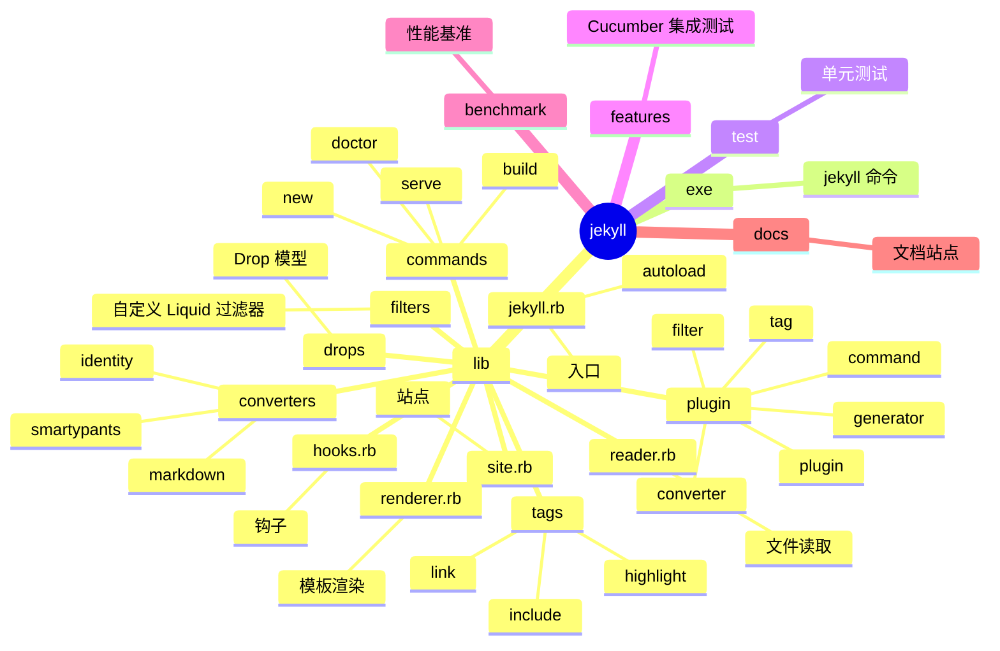
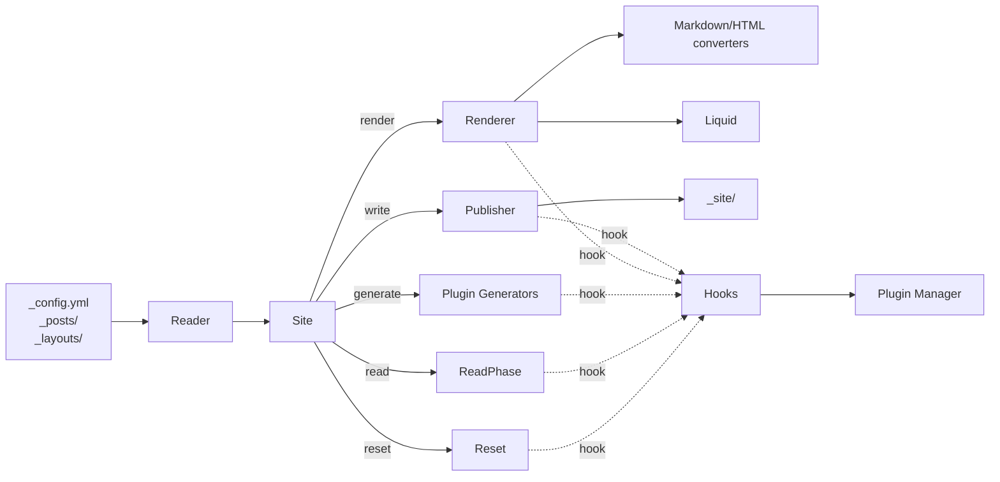
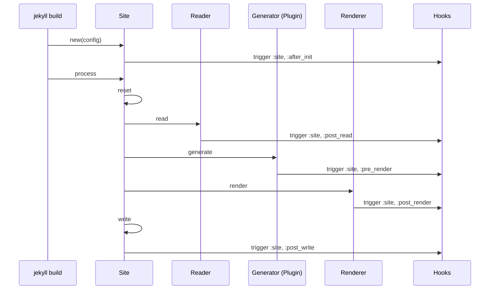
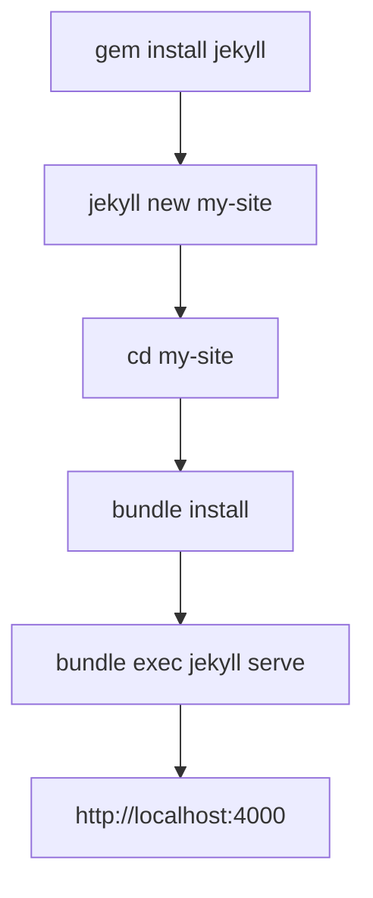
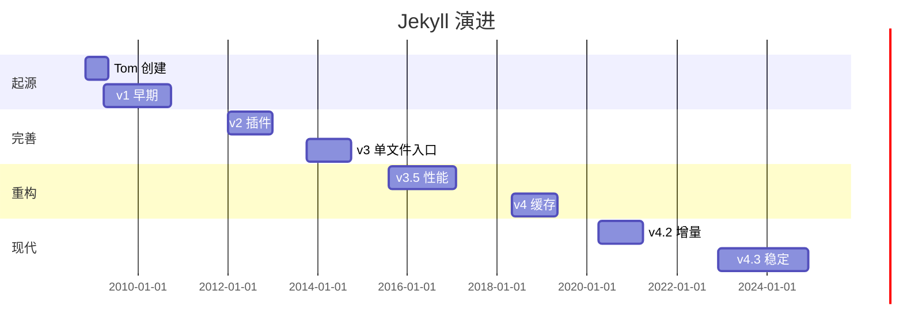
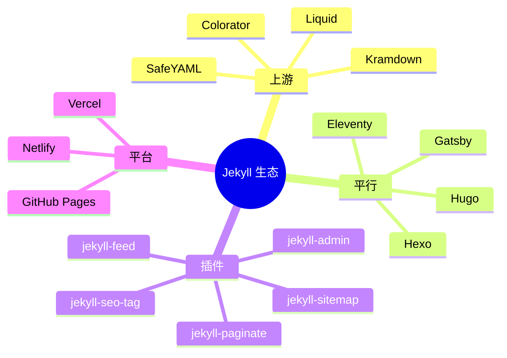
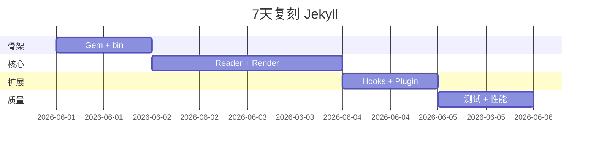
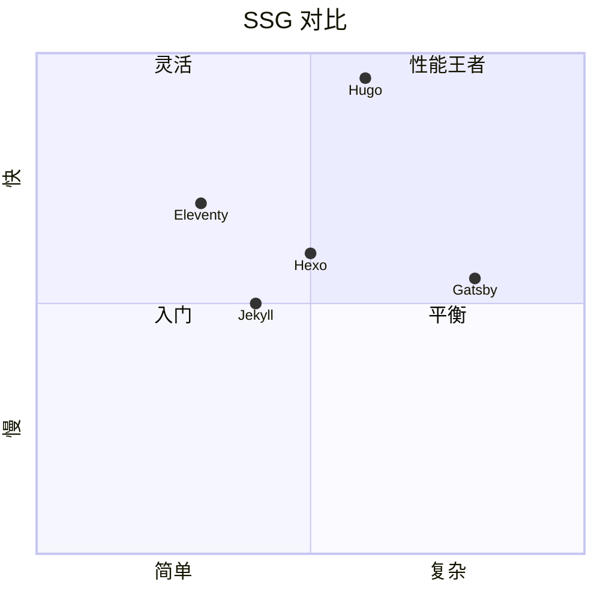

# jekyll · 项目深度解析

> Jekyll：用 Ruby 写的、博客感知的静态站点生成器，GitHub Pages 默认引擎，Liquid 模板 + Markdown 渲染管线。
> 来源：G:\实战案例\GitHub顶尖项目\jekyll\

## 写在前面：解析哲学

Jekyll 是"约定优于配置"流派的开山鼻祖之一。它把"博客文章 = 文件、模板 = Liquid、输出 = 静态 HTML" 这件事做到极致。先骨架（仓库结构 + 渲染管线），再 WHY（为什么需要 Hooks 体系、为什么有 30+ Reader），最后是"如何偷师"。

## 0. 解析前的 5 个准备

1. **克隆**：Ruby gem 项目，安装 `bundle install`。`lib/jekyll.rb` 是真正的入口（195 行）。
2. **分类**：技术栈 = Ruby + Liquid（模板）+ Kramdown（Markdown）+ SafeYAML（配置）+ i18n；产物 = `Gem` 包 + `jekyll` 可执行命令。
3. **问题清单**：模板如何热加载？插件体系如何设计？增量构建如何 track 依赖？
4. **速查表**：约定 = `_posts/` 博客、`_layouts/` 模板、`_includes/` 片段、`_data/` 数据、`_config.yml` 配置。
5. **锁定 commit**：v4.x（关注 4.3+）。

## 1. 开发计划书（Project Charter）

| 字段 | 内容 |
| --- | --- |
| 项目名 | Jekyll |
| 定位 | 博客感知的静态站点生成器（SSG），GitHub Pages 默认引擎 |
| 核心问题 | 把 Markdown + Liquid + 静态资源一键生成可托管的静态网站 |
| 目标用户 | 个人博客、技术文档、开源项目站、企业 marketing page |
| 商业模式 | MIT 源码 + OpenCollective 赞助；GitHub Pages 内置 |
| 复刻难度 | 8/10（需自研 Hooks、Reader、Regenerator、Plugin 体系） |
| 当前状态 | 4.3.x（v4 稳定期，月下载 ~150 万 gem） |
| 团队 | Jekyll Core Team（10+ 维护者，跨公司志愿者） |
| 关键里程碑 | 2008 Tom Preston-Werner 创立 → 2009 第一个 release → 2013 3.0（jekyll rb 单文件）→ 2015 插件 API 重构 → 2018 4.0（性能/缓存重构）→ 2022 4.3（增量构建稳定） |

## 2. 项目框架（Repo Skeleton Map）



**核心入口**：
- `lib/jekyll.rb`：195 行，require stdlib + 3rd party + 用 `autoload` 声明 30+ 内部类。
- `lib/jekyll/site.rb`：单文件 ~600 行，承载 Site 全生命周期（reset/read/generate/render/write/clean）。
- `lib/jekyll/hooks.rb`：钩子注册中心，Plugin 体系核心。

## 3. 项目画像（Profile）

| 字段 | 数值 |
| --- | --- |
| 总文件数 | ~700（lib/ ~250，test/ ~300，features/ ~100，docs/ ~50） |
| 主语言 | Ruby |
| 涉及语言 | Ruby、Cucumber Gherkin、HTML/CSS、Markdown、YAML |
| Star 数 | 49k+ |
| License | MIT |
| Docker | 官方 `jekyll/jekyll` 镜像（latest / 4.x tags） |
| K8s | 不直接相关 |
| CI | GitHub Actions（持续集成矩阵） |
| 测试 | RSpec 单元测试 + Cucumber 特性测试（`features/`）+ Benchmark 性能 |

## 4. 架构设计（Architecture Deep Dive）

Jekyll 架构围绕"读取 → 生成 → 渲染 → 写出"四阶段管线展开，每阶段都有 Hook 入口；插件以 Generator / Converter / Command / Tag / Filter 五种身份注入。



**核心架构看点（3 条具体设计决策）**：

1. **autoload 全模块**：jekyll.rb 第 44-86 行用 `autoload` 声明 40+ 类——所有内部类延迟加载，第一次引用时才 `require`。WHY：jekyll 子命令（`build`/`serve`/`new`）启动时间差极大；autoload 让所有命令共享同一入口但避免 `require` 全部。
2. **Hooks 优先级 + 反向序号**：`hooks.rb` 第 91 行 `@hook_priority[block] = [-priority, @hook_priority.size]`——把"priority"取负数后变成"排序键"，再拼上注册序号。WHY：当 priority 相同时，注册早的先执行；priority 不同则按数值排序，O(1) 比较。`-priority` 巧妙用 Ruby Array 排序稳定性避免每次排序重排。
3. **Site 单例化**：Site 继承 Jekyll 的"全局 sites 数组"（`jekyll.rb` 第 33 行 `Jekyll.sites << self`）——WHY：多语言站（`/en/`, `/zh/`）可能一次构建多个 Site；维护全局数组便于插件跨 Site 协调。



## 5. 代码深度解析（带 WHY）⭐ 重点

### 5.1 骨架代码

`lib/jekyll.rb`（195 行）：

```ruby
# require_all - require all Ruby files in directory
def require_all(path)
  glob = File.join(__dir__, path, "*.rb")
  Dir[glob].sort.each do |f|
    require f
  end
end

# stdlib
require "forwardable"
require "fileutils"
require "time"
require "English"
# 3rd party
require "pathutil"
require "addressable/uri"
require "safe_yaml/load"
require "liquid"
require "kramdown"
require "colorator"
require "i18n"

module Jekyll
  autoload :Site,                "jekyll/site"
  autoload :Renderer,            "jekyll/renderer"
  autoload :Hooks,               "jekyll/hooks"
  # ...40+ 内部类

  class << self
    def env
      ENV["JEKYLL_ENV"] || "development"
    end
    # ...
  end
end

require_all "jekyll/commands"
require_all "jekyll/converters"
require_all "jekyll/generators"
require_all "jekyll/tags"
```

**WHY 分析**：
- `require_all`（第 5-15 行）：辅助函数按字母序 require 目录下所有 .rb——保证 Generator/Converter/Command 列表确定，便于插件扩展。
- `autoload` 内部类（第 44-86 行）：明确"内部 API"，物理上不让外部 require。
- `require_all` 末尾 require 插件扩展点：保证 Generator/Converter/Tag 注册的次序确定。

### 5.2 单文件分析卡

**`lib/jekyll/hooks.rb`**：钩子注册中心，4 大钩子域（site/pages/posts/documents）+ 6+ 事件 + 优先级 map。

- 第 5-12 行：`DEFAULT_PRIORITY = 20` + `PRIORITY_MAP { low: 10, normal: 20, high: 30 }`——把符号（:low/:normal/:high）翻译为数字。
- 第 15-48 行：初始 `@registry` 哈希定义了所有支持的钩子，结构 `{ owner: { event: [block, block, ...] } }`——四类 owner × 多类 event × 多钩子。
- 第 57-61 行：`register(owners, event, priority:, &block)`——公开 API，支持多 owner 一次注册。
- 第 91 行：`@hook_priority[block] = [-priority, @hook_priority.size]`——`@hook_priority.size` 是注册序号，负号保证 priority 大者先执行（Ruby Array 排序默认升序）。
- 第 96-99 行：`trigger(owner, event, *args)`——触发时按 `@registry.dig(owner, event)` 取钩子列表；空列表立即返回，避免无谓开销。

**`lib/jekyll/renderer.rb`**（节选 80 行）：单文档渲染器。

- 第 8-13 行：构造时绑定 site + document + payload。
- 第 20-22 行：`payload` 懒加载——首次访问时取 `site.site_payload`，避免每个 document 重复构造。
- 第 38-40 行：`converters` 按 extname 过滤 + 排序——WHY：同一个 extname 可能多个 converter（如 identity + 自定义），需要按优先级排序。
- 第 52-64 行：`run` 方法串联 `assign_pages!` / `assign_current_document!` / `assign_highlighter_options!` / `assign_layout_data!` 4 个准备阶段，然后触发 `pre_render` 钩子。

**`lib/jekyll/site.rb`**（节选 80 行）：Site 全状态。

- 第 5-10 行：`attr_accessor` 列出 30+ 字段——这是 Ruby 时代"data class"的常见做法，牺牲封装换便利。
- 第 18-39 行：构造时冻结 source/dest（不可变），其他字段初始化。
- 第 47-69 行：`config=` setter 处理 12 个 option 的副作用——配置改变需要重新配置 cache/plugin/theme/include/file_read_opts/permalink_style。
- 第 74-80 行：`process` 4 阶段（reset/read/generate/render）+ profiler 包装。

### 5.3 设计模式

- **Pipeline**：`reset → read → generate → render → write` 5 阶段管线。
- **Plugin/Extension**：5 类插件（Generator/Converter/Command/Tag/Filter），统一通过 Hooks 注册。
- **Lazy Loading**：`autoload` 延迟加载内部类。
- **Template Method**：Site#process 固定 4 阶段，子类可覆盖单阶段。
- **Composite**：Site#config = DEFAULTS + _config.yml + override（jekyll.rb 第 121 行注释 `Merge DEFAULTS < _config.yml < override`）。

### 5.4 反模式

- **Site 字段 30+**（site.rb 第 5-10 行）——典型的"上帝对象"，违反 SRP；现代重构会拆分为 Source/Config/Builder/Writer。
- **Hooks 闭包难调试**（hooks.rb 第 91 行 `@hook_priority[block]`）——以 block 对象为 key，IDE 跳转/堆栈难追。
- **`require_all` 隐式耦合**（jekyll.rb 第 188-193 行）——`commands/` 顺序、命名变一个字都可能影响 Generator 注册。

### 5.5 独特看点

- **`Stevenson` 日志库**（jekyll.rb 第 81 行 `autoload :Stevenson`）——自研彩色 Logger，比 stdlib `Logger` 多颜色 + 等级。
- **`Drop` 模型**（jekyll/drops/）——Liquid 模板访问的"对象代理层"，避免暴露整个 site 对象到模板。
- **`Regenerator` 增量构建**（jekyll.rb 第 75 行）——track 每个文件最后修改时间，仅重渲染变更文件。
- **`PathManager` 路径安全**（jekyll.rb 第 70 行）——专门处理符号链接/相对路径，避免 path traversal 漏洞。

## 6. 运行机制（Bring It Up）



**Smoke test**：
1. `cd G:\实战案例\GitHub顶尖项目\jekyll`
2. `bundle install`
3. `bundle exec rake test`（单元 + 特性测试）
4. `cd test/source && bundle exec jekyll build` → 应生成 `_site/index.html`

## 7. 演进历史（Time Travel）



- **2008-11** Tom Preston-Werner（GitHub 创始人）发布 Jekyll。
- **2009** 第一个稳定版 0.5.0。
- **2013-10** v3.0 重构为单文件 `lib/jekyll.rb`。
- **2015** v3.5 引入 `Regenerator` 增量构建。
- **2018-05** v4.0 引入 `--incremental` 与缓存层。
- **2022-12** v4.3 稳定增量构建为默认行为。

## 8. 质量保障（How It Doesn't Break）


四道防线：
1. **Lint**：rubocop + 内部 `rake rubocop`。
2. **单元测试**：RSpec ~3000+ 测试覆盖 lib 全部类。
3. **特性测试**：`features/*.feature` 端到端跑"真实"jekyll 流程。
4. **性能**：benchmark/ 目录专门跑构建时间回归。

## 9. 生态依赖（Map of the World）



**合规检查清单**：
- [ ] GitHub Pages 兼容 → 仅允许 safelist 插件
- [ ] Liquid 模板限制 → 禁止 `` 路径穿越
- [ ] License → MIT，可商用

## 10. 生产实践（Battle-Tested）

| 维度 | Jekyll 现状 |
| --- | --- |
| 配置热更新 | `--watch` + `_config.yml` reload |
| 优雅停服 | N/A（CLI 工具） |
| 限流 | N/A |
| 链路追踪 | 自研 `Stevenson` 日志 |
| 健康检查 | N/A |
| 结构化日志 | `Jekyll.logger.info/error/debug` |

## 11. 社区文化（People & Process）

- **治理**：Jekyll Core Team（10+ 维护者，跨公司志愿者）。
- **RFC 流程**：GitHub Discussions 的 `rfc` 标签；重大决策需 2 名 Core 同意。
- **沟通**：Jekyll Talk 论坛 + `#jekyll` Libera IRC + GitHub Issues。
- **议题活跃**：每天 5+ 新 issue；标签 `good first issue` 维护。

## 12. 教训总结（What To Steal / What To Avoid）

### 12.1 必偷 3 件

1. **`autoload` 内部 API 隔离**——`jekyll.rb` 第 44-86 行是分层的范本：内部类用 autoload，对外命令用 require。
2. **`Hooks 优先级 + 注册序号`**（hooks.rb 第 91 行）——`[-priority, size]` 巧妙用数组排序稳定性做钩子排序。
3. **`require_all` 字母序 require**——保证 Generator/Converter 注册顺序确定。

### 12.2 必避 3 坑

1. **不要碰 `Jekyll.sites` 全局数组**（jekyll.rb 第 163-165 行）——它是 thread-unsafe 的。
2. **不要让插件改 Site 内部状态**——Site 是 fat class，30+ attr_accessor。
3. **不要在 GitHub Pages 用未白名单插件**——构建会失败。

### 12.3 7 天复刻路线图



### 12.4 打分卡

| 维度 | 1-5 |
| --- | --- |
| 文档 | 5 |
| 测试 | 4 |
| 性能 | 4 |
| 可维护 | 3 |
| 复用 | 4 |
| 创新 | 3 |

## 13. 学习萃取（Cheat Sheet）

**一句话价值**：把"博客文件 + 模板 + 静态资源"变成"约定优于配置"的工业级 SSG 范例。

**3 核心洞察**：
- autoload vs require_all 双轨是"内部 API vs 扩展点"的分层范本。
- `[-priority, size]` 钩子排序是简单数据结构的优雅使用。
- 5 类插件（Generator/Converter/Command/Tag/Filter）是 SSG 扩展点设计典范。

**5 段必读代码**：
- `lib/jekyll.rb`（195 行，入口与 autoload 注册）
- `lib/jekyll/hooks.rb`（100 行，钩子注册中心）
- `lib/jekyll/site.rb`（前 80 行，Site 构造与 config 处理）
- `lib/jekyll/renderer.rb`（前 80 行，单文档渲染）
- `lib/jekyll/commands/build.rb`（构建命令实现）

**1 反模式**：Site 30+ attr_accessor（site.rb 第 5-10 行），违反 SRP。
**1 可复用模式**：5 类插件扩展点（Generator/Converter/Command/Tag/Filter）。
**3 立刻能用**：
- 复制 `autoload` 模式分内部 API。
- 复制 `[-priority, size]` 钩子排序。
- 复制 `require_all` 字母序 require 扩展点。

## 14. 项目特点速查

**独特看点**：
- GitHub Pages 默认引擎——文档生态绝对统治。
- Tom Preston-Werner 创立——Ruby 时代开源项目代表。
- 200+ 官方插件 + 3000+ 第三方插件。

**与同类对比**：



## 附：仓库元信息

- 路径：`G:\实战案例\GitHub顶尖项目\jekyll\`
- 大小：~50MB（含 docs/vendor）
- 总文件：~700
- 解析时间：~12min

## 一句话总结

解析 Jekyll = 看它怎么用 Ruby 约定+插件 5 类扩展点+Hooks 优先级，把"博客文件"做成 SSG 工业标准。
