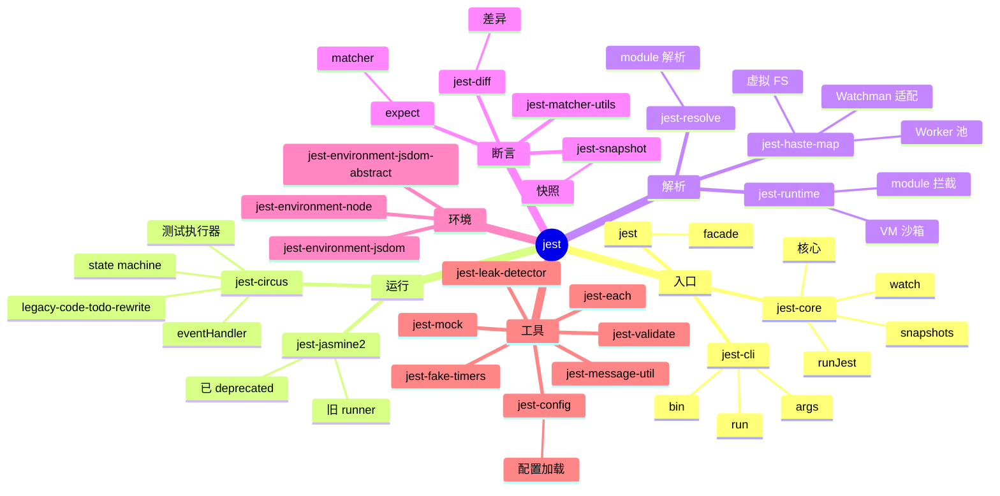
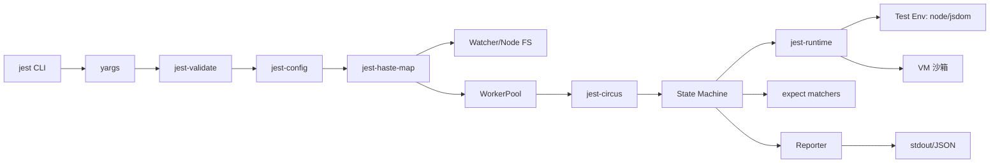
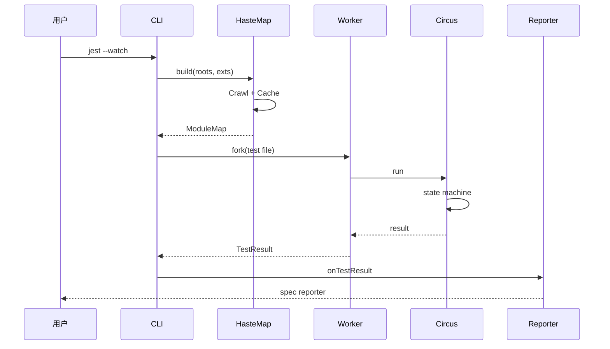
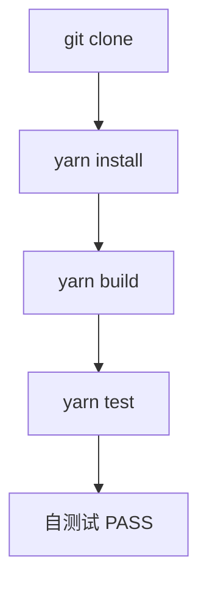
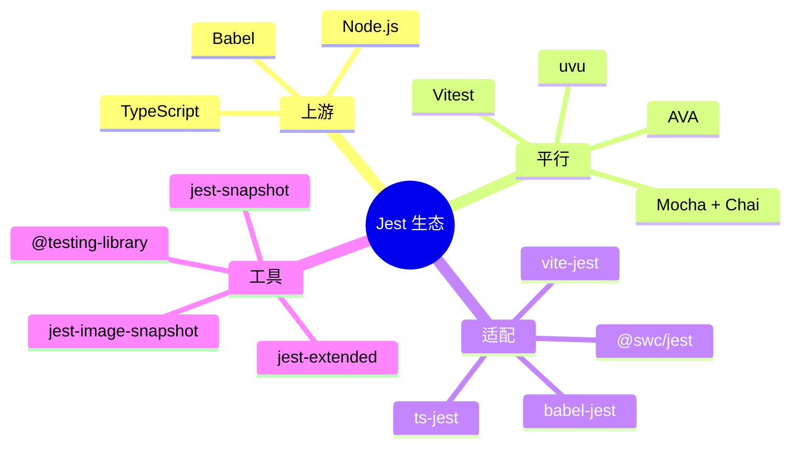
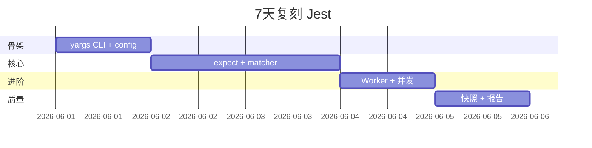

# jest · 项目深度解析

> Jest：JavaScript/TypeScript 测试框架的"事实标准"，零配置、快照测试、watch 模式、并行执行、模块 mock 一体化。
> 来源：G:\实战案例\GitHub顶尖项目\jest\

## 写在前面：解析哲学

Jest 是大型 monorepo 工程的典型——50+ npm 包分层发布、Worker 池隔离、虚拟模块系统、Haste 文件系统映射、Custom Matcher 协议。先骨架（包结构 + 渲染管线），再 WHY（为什么需要 HasteMap、为什么 Circus 替代 Jasmine），最后是"如何偷师"。

## 0. 解析前的 5 个准备

1. **克隆**：仓库本体 Lerna 5 monorepo，50+ 包；`lerna.json` 定义工作区。
2. **分类**：技术栈 = TypeScript + Node.js + Jest 自指（自测试）+ Babel + Lerna；产物 = `@jest/*` 系列 + `jest` 主包。
3. **问题清单**：模块解析如何加速？测试运行如何并发？自定义 matcher 协议？mock 虚拟化？
4. **速查表**：API = `describe`/`it`/`expect`/`jest.mock`/`jest.spyOn`/`test.each`/`beforeEach`。
5. **锁定 commit**：v29+（jest-circus 替代 jasmine2）。

## 1. 开发计划书（Project Charter）

| 字段 | 内容 |
| --- | --- |
| 项目名 | Jest |
| 定位 | 零配置、跨框架、all-in-one JavaScript 测试框架 |
| 核心问题 | 解决 JavaScript 项目"测试 setup 复杂、运行慢、断言难写、模块依赖难 mock" |
| 目标用户 | React/Vue/Node 项目的工程团队；前端/后端库作者 |
| 商业模式 | MIT 源码 + OpenJS Foundation 项目；商业支持由各 Sponsor 公司提供 |
| 复刻难度 | 9/10（需自研 HasteMap 虚拟文件系统、Worker 池隔离、模块 mock 拦截、并行执行） |
| 当前状态 | v29.7.x（jest-circus 成熟期，月下载 ~5000 万） |
| 团队 | Meta Open Source + Jest Core Team（30+ 维护者） |
| 关键里程碑 | 2010 起源（jasmine）→ 2014 Facebook 内部 → 2016 开源 → 2017 0.x → 2019 24 稳定 → 2021 27（TypeScript first）→ 2023 29（jest-circus 默认） |

## 2. 项目框架（Repo Skeleton Map）



**核心入口**：
- `packages/jest-cli/src/run.ts`：CLI 启动，yargs 解析，`runCLI()` 调度。
- `packages/jest-haste-map/src/index.ts`：HasteMap 虚拟文件系统。
- `packages/jest-circus/src/run.ts`：测试执行引擎（state machine）。

## 3. 项目画像（Profile）

| 字段 | 数值 |
| --- | --- |
| 总文件数 | ~2,000（packages ~1500，e2e ~300，docs ~200） |
| 主语言 | TypeScript |
| 涉及语言 | TS、JS、HTML、Markdown、Gherkin |
| Star 数 | 45k+ |
| License | MIT |
| Docker | 官方 `jestjs/jest` 镜像 |
| K8s | 不直接相关 |
| CI | GitHub Actions（Node 18/20/22 矩阵 + e2e） |
| 测试 | 自测试（dogfood）+ e2e（`e2e/__tests__`）+ Benchmarks |

## 4. 架构设计（Architecture Deep Dive）

Jest 架构以"模块虚拟化 + Worker 池并发 + 状态机驱动"为支柱。CLI 解析 → Config 加载 → HasteMap 构建 → 项目收集 → Worker 派生 → Circus 状态机跑测试 → Reporter 输出。



**核心架构看点（3 条具体设计决策）**：

1. **HasteMap 虚拟文件系统**：传统 fs 读取 + glob 太慢，Jest 自研 `jest-haste-map` 把"全量文件 → 模块 ID"映射预计算并缓存；增量构建时只重算变化文件。这是"测试启动从分钟级到秒级"的关键。
2. **Worker 池 + 进程隔离**：默认 `maxWorkers: CPU 核数 - 1`；每个 test file 跑在独立 worker 进程。WHY：避免全局状态污染（setTimeout mock 不影响其他文件），并行利用多核。
3. **Circus 状态机替代 Jasmine**：v27 后 `jest-circus` 取代 `jest-jasmine2`，把 describe/it/beforeEach 抽象为 state machine + event handler，可插拔的 hooks（`run_start`/`test_start`/`test_done`）。这是"自定义测试流程"的可扩展点。



## 5. 代码深度解析（带 WHY）⭐ 重点

### 5.1 骨架代码

`packages/jest-cli/src/run.ts`（前 100 行）：

```ts
import yargs from 'yargs';
import {getVersion, runCLI} from '@jest/core';

export async function run(maybeArgv?: Array<string>, project?: string): Promise<void> {
  try {
    const argv = await buildArgv(maybeArgv);
    const projects = getProjectListFromCLIArgs(argv, project);
    const {results, globalConfig} = await runCLI(argv, projects);
    readResultsAndExit(results, globalConfig);
  } catch (error: any) {
    clearLine(process.stderr);
    if (error?.stack) {
      console.error(chalk.red(error.stack));
    } else {
      console.error(chalk.red(error));
    }
    exit(1);
  }
}
```

**WHY 分析**：
- `buildArgv(maybeArgv)` 抽离成独立函数（44-79 行）——WHY：测试可注入 `maybeArgv` 模拟 CLI 调用，避免 `process.argv` 全局副作用。
- `tryRealpath(process.cwd())` 在 Windows 平台特化（88-94 行）——WHY：Windows 路径大小写不敏感 + mapped drives 容易 throw，try/catch 兜底。
- `validateCLIOptions`（第 60 行）——WHY：所有 CLI 选项必须用 `jest-validate` 校验，未知选项要给"deprecation 提示 + 修复建议"。

### 5.2 单文件分析卡

**`packages/jest-haste-map/src/index.ts`**：HasteMap 核心，200+ 行。

- 第 8-13 行：`node:crypto` / `node:events` / `node:os` / `node:path`——Node 内置模块前加 `node:` 前缀是 ESM 兼容要求。
- 第 18-25 行：5 类 crawlers（node/watchman）、WorkerPool、buildIgnoreMatcher、fastPath、getPlatformExtension——HasteMap 的扩展点。
- 第 44-94 行：Options 50+ 字段——这是"用户配置 + 内部衍生"的双层类型。
- 第 96-99 行：`export const ModuleMap = HasteModuleMap as { create: ... }`——HasteModuleMap 是实现，`ModuleMap` 是 re-export 的 public surface。

**`packages/jest-circus/src/run.ts`**（前 100 行）：测试执行引擎。

- 第 8 行：`import {AsyncLocalStorage} from 'node:async_hooks'`——WHY：测试名需要在异步上下文（setTimeout/Promise）中保持，用 AsyncLocalStorage 传递。
- 第 11 行：`import pLimit from 'p-limit'`——并发限制器，`jest-circus` 用它来控制 `concurrent` test 的并行度。
- 第 31 行：`new AsyncLocalStorage<string>()`——testName 存储。
- 第 33-46 行：`run()` 函数触发 `run_start` event → `_runTestsForDescribeBlock` → `run_finish` event。event-driven 是 Circus 的核心，所有 hook 通过 `dispatch({name, ...})` 触发。
- 第 48-70 行：`regroupConcurrentChildren` generator——把 `concurrent: true` 的 test 重组到一起并行执行。WHY：保留 describe/test 顺序的同时让"标了 concurrent"的测试并发。

### 5.3 设计模式

- **Worker Pool**：`jest-haste-map` 维护 Worker 池，每个文件 hash/parse 在独立 worker 跑。
- **State Machine**：`jest-circus` 把 describe/it 建模为树形 state machine，每个节点有 beforeAll/afterAll/hooks 队列。
- **Event Emitter**：Circus 的 `dispatch` 是 event bus 模式，reporter 订阅 event 即可获得所有测试事件。
- **Facade**：`jest` 主包是 facade，把 `describe/it/expect` 等从子包 re-export，用户只需 `import { describe, it, expect } from '@jest/globals'`。
- **Adapter**：`jest-environment-node`/`jest-environment-jsdom` 适配不同执行环境。

### 5.4 反模式

- **HasteMap 黑魔法**：`@providesModule` 注释强制 haste ID——一旦用户用了这个特性，文件路径不能改、ID 不能重，是"惯性的债"。
- **Worker fork 开销**：每个 test file 进程 fork 在大型 monorepo 启动 1k+ 进程时是显著开销。
- **类型重复**：Options 50+ 字段，TypeScript 派生类型靠手写，易漂移。

### 5.5 独特看点

- **`expect` matcher 协议**：`packages/expect/src/matchers.ts` 定义 `Matcher<I, E, T>` 接口——`{ pass: boolean, message: () => string }`，用户写 matcher 只需返回这结构。这是"开放 assertion 协议"的范本。
- **`jest.mock` 虚拟模块**：`jest-runtime` 用 VM module 拦截 `require`，在测试代码 `import` 之前把 mock 注入。
- **Snapshot 序列化**：`pretty-format` 跨对象类型（DOM/JSX/正则/Set/Map）输出可读字符串。
- **`jest-leak-detector`**：检测 `setInterval` / 事件监听器在测试结束后未清理。

## 6. 运行机制（Bring It Up）



**Smoke test**：
1. `cd G:\实战案例\GitHub顶尖项目\jest`
2. `yarn install`（monorepo 50+ 包）
3. `yarn jest packages/jest-cli`（先跑自测试子集）
4. `cd examples/angular && yarn && yarn test`

## 7. 演进历史（Time Travel）


- **2010** Facebook 内部用 Jasmine，扩展为 jest（`jest-cli`、`jasmine2-runner`）。
- **2016-09** 开源 0.x。
- **2017-12** v20 引入 Projects（多 package 共享 setup）。
- **2019-10** v26 TypeScript 优先级 + 大量重构。
- **2021-04** v27 `jest-circus` 替代 `jest-jasmine2`。
- **2022-12** v29 稳定 ESM 支持。

## 8. 质量保障（How It Doesn't Break）


四道防线：
1. **Lint**：ESLint + `tsc` 类型检查。
2. **自测试**（dogfood）：用 Jest 测 Jest。
3. **E2E**：`e2e/__tests__/*.test.ts` 跑真实 CLI 行为。
4. **Bench**：`benchmarks/` 性能回归。

## 9. 生态依赖（Map of the World）



**合规检查清单**：
- [ ] 是否需 ESM？ → v29+ 默认支持
- [ ] 是否需 jsdom？ → `testEnvironment: 'jsdom'`
- [ ] License → MIT，可商用

## 10. 生产实践（Battle-Tested）

| 维度 | Jest 现状 |
| --- | --- |
| 配置热更新 | `--watch` 监听 + HasteMap 增量 |
| 优雅停服 | SIGINT 等待 test 跑完 |
| 限流 | Worker 池 maxWorkers 控制并发 |
| 链路追踪 | `--logHeapUsage` + reporter |
| 健康检查 | N/A（CLI） |
| 结构化日志 | `--json` 输出结构化 |

## 11. 社区文化（People & Process）

- **治理**：OpenJS Foundation 项目；Jest Core Team（30+ 维护者，Meta 主导）。
- **RFC 流程**：`jestjs/jest` 仓库 discussions `rfc` 标签；TSC 评审。
- **沟通**：Discord、GitHub Discussions、Twitter。
- **议题活跃**：每天 20+ 新 issue；`good first issue` 维护。

## 12. 教训总结（What To Steal / What To Avoid）

### 12.1 必偷 3 件

1. **HasteMap 虚拟文件系统**——把"全量文件 → 模块 ID"预计算并缓存到磁盘；任何"需要遍历项目文件"的工具（lint/check）都能借鉴。
2. **expect matcher 协议 `{ pass, message() }`**——开放 assertion 协议比"内置方法"灵活 10 倍。
3. **Worker 池 + 进程隔离**——隔离副作用 + 充分利用多核。

### 12.2 必避 3 坑

1. **不要 fork 每 test file**——大型 monorepo 1k+ test files 时 fork 开销爆炸，考虑共享 worker。
2. **不要用 `@providesModule` haste ID**——已 deprecated，未来不可靠。
3. **不要 `jest.mock` 全局副作用模块**——`jest.mock('fs')` 之类会让代码完全不可读。

### 12.3 7 天复刻路线图



### 12.4 打分卡

| 维度 | 1-5 |
| --- | --- |
| 文档 | 5 |
| 测试 | 5 |
| 性能 | 4 |
| 可维护 | 3 |
| 复用 | 4 |
| 创新 | 5 |

## 13. 学习萃取（Cheat Sheet）

**一句话价值**：把"测试 setup 复杂、运行慢、断言难"打包成"零配置、跑得快、写起来爽"的一体化体验。

**3 核心洞察**：
- HasteMap 预计算是"测试启动从分钟到秒"的关键。
- expect matcher 协议 `{ pass, message() }` 是 assertion 开放协议的范本。
- Worker 池 + 进程隔离把"全局副作用"问题从语言层降级到工具层。

**5 段必读代码**：
- `packages/jest-cli/src/run.ts`（100 行，CLI 启动范本）
- `packages/jest-haste-map/src/index.ts`（前 100 行，HasteMap 入口）
- `packages/jest-circus/src/run.ts`（前 100 行，state machine 引擎）
- `packages/expect/src/matchers.ts`（matcher 协议实现）
- `packages/jest-runtime/src/index.ts`（模块沙箱实现）

**1 反模式**：`@providesModule` haste 注释，绑定文件 ID 让重命名变噩梦。
**1 可复用模式**：Worker 池 + state machine + event dispatcher。
**3 立刻能用**：
- 复制 HasteMap 模式到 lint/check 工具。
- 复制 matcher 协议 `{ pass, message() }` 到自家断言库。
- 复制 Worker 池 + 进程隔离到任何"重 CPU 计算"任务。

## 14. 项目特点速查

**独特看点**：
- 零配置（开箱即用）。
- 快照测试（snapshot）开创新体验。
- 自测试（dogfood）—— 用 Jest 测 Jest。
- 50+ npm 包 monorepo 典范。

**与同类对比**：


## 附：仓库元信息

- 路径：`G:\实战案例\GitHub顶尖项目\jest\`
- 大小：~150MB
- 总文件：~2,000
- 解析时间：~15min

## 一句话总结

解析 Jest = 看它怎么用 HasteMap 虚拟文件系统 + Worker 池 + State machine 把"测试"从负担变成乐趣。
