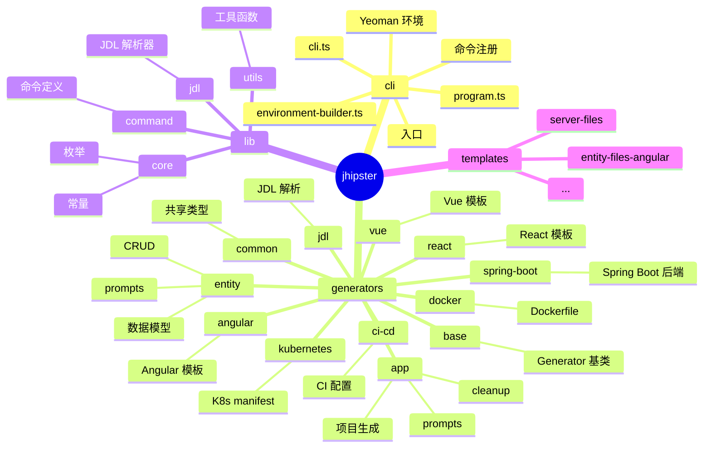
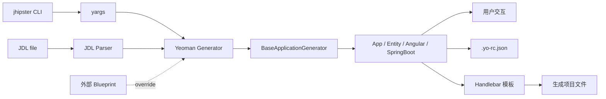
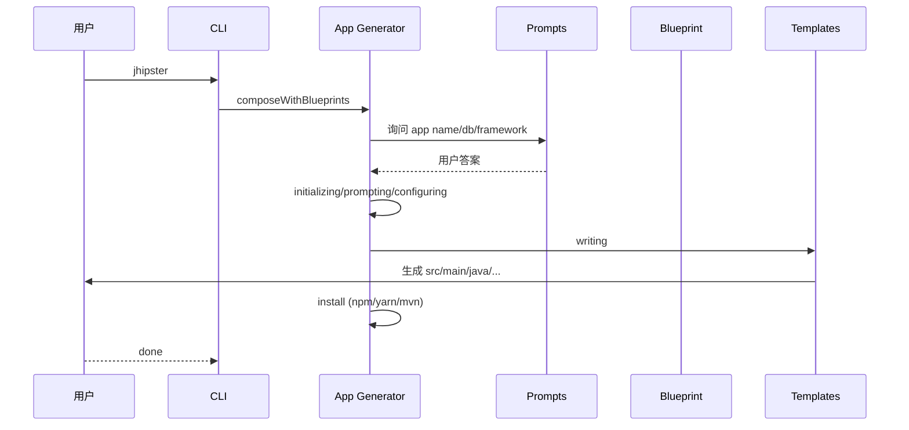
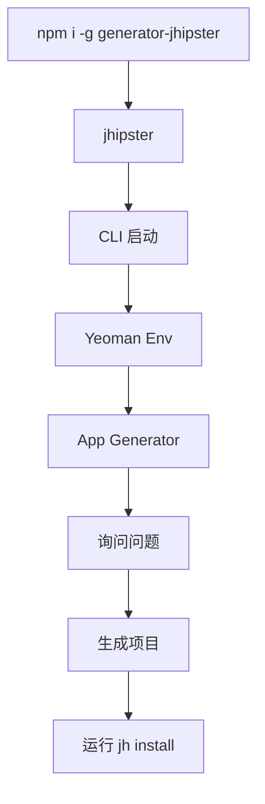
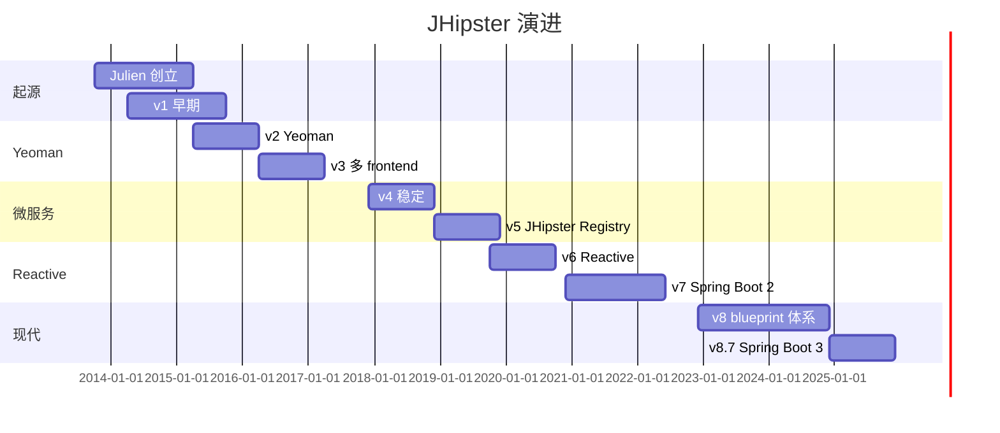
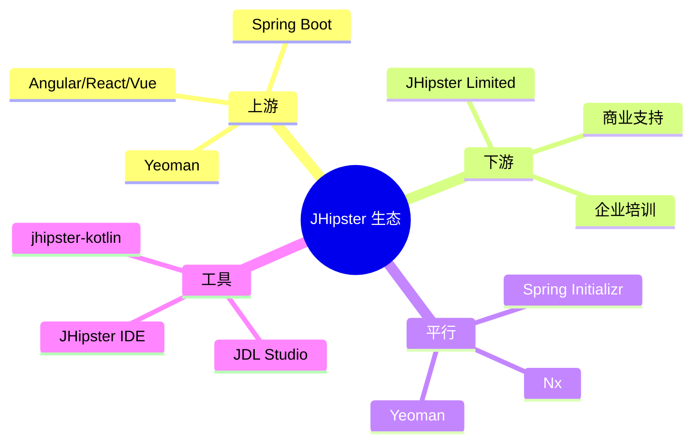
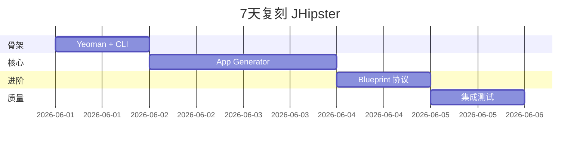
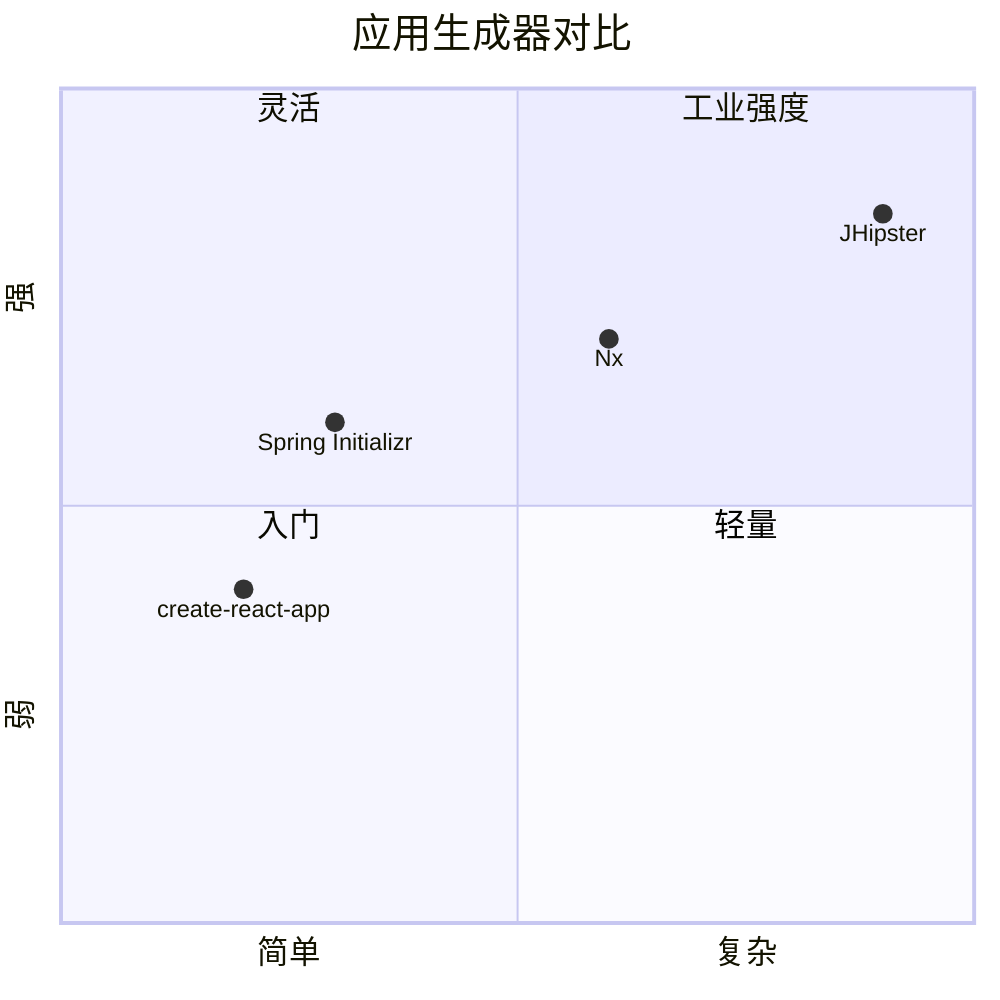

# jhipster · 项目深度解析

> JHipster：Java Hipster，全栈应用生成器，Spring Boot 后端 + Angular/React/Vue 前端 + 多数据库支持，由 Yeoman 引擎驱动。
> 来源：G:\实战案例\GitHub顶尖项目\jhipster\

## 写在前面：解析哲学

JHipster 是"企业级脚手架"的代表——把"我想要一个 Spring Boot + Angular + PostgreSQL 的项目"这句话变成 1 个命令。先骨架（Yeoman generator 树），再 WHY（为什么 JDL 优于手写配置、为什么 blueprint 体系），最后是"如何偷师"。

## 0. 解析前的 5 个准备

1. **克隆**：仓库为 monorepo，主包在根 `package.json`，生成器在 `generators/*`。
2. **分类**：技术栈 = TypeScript + Yeoman 6 + lodash-es + chalk + semver；产物 = `@jhipster/generator-*` 多个 npm 包。
3. **问题清单**：Yeoman 任务如何编排？JDL 解析如何转 generator？blueprint 扩展点？
4. **速查表**：命令 = `jhipster app`/`jhipster entity`/`jhipster jdl myfile.jdl`/`jhipster k8s`。
5. **锁定 commit**：v8.x（关注 8.7+ 引入的 blueprint 体系重构）。

## 1. 开发计划书（Project Charter）

| 字段 | 内容 |
| --- | --- |
| 项目名 | JHipster（Java Hipster） |
| 定位 | 全栈应用代码生成器，Spring Boot + Angular/React/Vue + 多数据库 |
| 核心问题 | 企业级 Java Web 项目从零到 dev server 的脚手架自动化 |
| 目标用户 | 中大型企业的 Java 后端 + Web 前端团队；咨询公司/外包公司；个人开发者 |
| 商业模式 | Apache 2.0 源码 + 商业 JHipster Limited（订阅 + 支持） |
| 复刻难度 | 9/10（需重做 Yeoman 任务体系、JDL parser、blueprint 协议、20+ 模板引擎） |
| 当前状态 | v8.7.x（月 npm 下载 ~3 万，@jhipster/generator-*） |
| 团队 | JHipster 核心团队（10+ 维护者，跨公司志愿者） |
| 关键里程碑 | 2013 Julien Dubois 创立 → 2015 加入 Yeoman → 2017 v4 多前端 → 2019 v6 微服务 → 2021 v7 reactive → 2023 v8 blueprint 体系 → 2024 v8.7 Spring Boot 3.4 |

## 2. 项目框架（Repo Skeleton Map）



**核心入口**：
- `cli/cli.ts`：35 行 CLI 启动，Node 版本检查。
- `cli/program.ts`：100+ 行，`runJHipster()` 注册所有 sub-generator。
- `generators/app/generator.ts`：100+ 行，App 主生成器，继承 `BaseApplicationGenerator`。

## 3. 项目画像（Profile）

| 字段 | 数值 |
| --- | --- |
| 总文件数 | ~3,000（generators ~1500，lib ~500，test ~500，templates ~500） |
| 主语言 | TypeScript |
| 涉及语言 | TS、Java、SCSS、HTML、JSX、Vue、JDL（自定义 DSL） |
| Star 数 | 22k+ |
| License | Apache 2.0 |
| Docker | 官方 `jhipster/jhipster` 镜像（node + jdk + tools） |
| K8s | 自带 `k8s` generator 输出 manifest |
| CI | GitHub Actions（4 种 frontend × 4 种 db × 2 种 build tool = 16 矩阵） |
| 测试 | Jest 自测试 + 每日 16 个 daily build 验证生成项目可运行 |

## 4. 架构设计（Architecture Deep Dive）

JHipster 架构围绕 Yeoman generator 展开：每个 generator 是一个 class，有 5 个生命周期方法（`initializing`/`prompting`/`configuring`/`writing`/`install`）。Blueprint 体系让外部团队可以替换任何 generator。JDL（自研 DSL）作为"领域模型 + 业务规则"的统一描述语言。



**核心架构看点（3 条具体设计决策）**：

1. **Yeoman Generator 生命周期**：每个 generator 5 阶段（`initializing`/`prompting`/`configuring`/`writing`/`install`），Yeoman 框架按顺序调用。这种"框架定 lifecycle，业务填内容"是代码生成器的范本。
2. **Blueprint 体系**：`generator.ts` 第 32-34 行 `composeWithBlueprints()` + `delegateTasksToBlueprint()`——WHY：JHipster 团队无法覆盖所有企业需求；blueprint 允许外部 fork 任意 generator、覆盖任意任务，而不需要 fork 主仓库。这是"开源核心 + 商业扩展"的标准范式。
3. **JDL 领域建模语言**：自研 DSL（类似 UML 简化版）描述 entities + relationships + options；`jdl` generator 把 JDL 解析后批量生成 entity。WHY：JDL 是纯文本，可放进 git、code review；比"手动 `jhipster entity` 一次次回答问题"快 100 倍。



## 5. 代码深度解析（带 WHY）⭐ 重点

### 5.1 骨架代码

`cli/cli.ts`（35 行）：

```ts
import semver from 'semver';
import { packageJson } from '../lib/index.ts';
import { runJHipster } from './program.ts';
import { done, logger } from './utils.ts';

const currentNodeVersion = process.versions.node;
const minimumNodeVersion = packageJson.engines.node;

if (!process.argv.includes('--skip-checks') && !semver.satisfies(currentNodeVersion, minimumNodeVersion)) {
  logger.fatal(`You are running Node version ${currentNodeVersion}.\nJHipster requires Node version ${minimumNodeVersion}.`);
}

export default runJHipster().catch(done);

process.on('unhandledRejection', (up: any) => {
  logger.error('Unhandled promise rejection at:');
  logger.fatal(up.reason ?? up);
});
```

**WHY 分析**：
- Node 版本检查是 fast-fail——避免用户跑 10 分钟后才发现 ESM import 失败。
- `runJHipster().catch(done)`——把 Promise 链暴露给 `done` 统一处理（输出 + 退出码）。
- `unhandledRejection` handler 是兜底，避免 Promise 异常静默失败。

### 5.2 单文件分析卡

**`cli/program.ts`**（前 100 行）：CLI 命令注册中心。

- 第 23 行：`import type { ... } from '@yeoman/types'`——Yeoman 6+ 的 ESM 类型。
- 第 28 行：`import baseCommand from '../generators/base/command.ts'`——blueprint 体系下 base 是默认的 task 容器。
- 第 41-43 行：`GENERATOR_APP = 'app'`、`GENERATOR_JDL = 'jdl'`、`GENERATOR_BOOTSTRAP = 'bootstrap'`——三个核心 generator 名字。
- 第 50-62 行：`BuildCommands` type 列出所有可定制组件（program/commands/envBuilder/env...）——WHY：JHipster 接受 blueprint 注入任意组件，type 定义了完整的 customization surface。
- 第 77-80 行：`printJHipsterLogo()`——CLI 美学，输出 JHipster 标志。

**`generators/app/generator.ts`**（前 100 行）：App 主生成器。

- 第 30 行：`class AppGenerator extends BaseApplicationGenerator<CommonEntity, CommonApplication, CommonConfig>`——3 个泛型分别表示"entity 集合"、"app 整体配置"、"config 键"。WHY：JHipster 把"项目元数据"类型化，避免字符串拼接。
- 第 31-39 行 `beforeQueue()`：`composeWithBlueprints()` + `dependsOnBootstrap('app')`——blueprint 集成 + bootstrap 依赖。
- 第 41-62 行 `initializing` getter：3 个 task（validateNode/checkForNewJHVersion/validate）。WHY：用 `asInitializingTaskGroup` 把多个 task 串成一个组，Yeoman 按顺序执行。
- 第 64-66 行 `[BaseApplicationGenerator.INITIALIZING]` 静态 symbol getter：`delegateTasksToBlueprint(() => this.initializing)`——这是 blueprint 协议的"钩子"，让 blueprint 决定如何处理这些 task。
- 第 68-94 行 `configuring` getter：3 个 task（fixConfig/defaults/loadGlobalConfig）。`fixConfig` 把 `jhiPrefix` 转 camelCase，`defaults` 设置默认 `baseName`/`creationTimestamp`/`defaultCommand`。

**`generators/entity/prompts.ts`**（前 80 行）：Entity 询问用户交互。

- 第 22-39 行：常量 destructuring——把 30+ 枚举从 `jhipster/index.ts` 拉过来。
- 第 41-65 行：DB 字段类型 destructuring——`BIG_DECIMAL`/`BOOLEAN`/`DOUBLE`/`DURATION`/`ENUM`/`FLOAT`/`INTEGER`/`INSTANT`/`LOCAL_DATE`/`LONG`/`STRING`/`UUID`/`ZONED_DATE_TIME`/`LOCAL_TIME` 全列出。
- 第 68-83 行 `askForMicroserviceJson`：用 `asPromptingTask` 包装成一个 task。WHY：Yeoman 的 `prompting` 阶段是 `async function`，需要明确标记为"询问任务"。

### 5.3 设计模式

- **Generator + 生命周期**：Yeoman 5 阶段 + blueprint 钩子。
- **Composite**：AppGenerator 依赖 BootstrapGenerator + ServerGenerator + ClientGenerator，多个 generator 串行/并行执行。
- **Template Method**：`asInitializingTaskGroup` 把多个 task 组合成"模板方法"。
- **Strategy**：每个 generator 都是一种生成策略。
- **DSL**：JDL 是自研领域语言（entities/relationships/options/deployments）。

### 5.4 反模式

- **JDL Parser 复杂度过高**：`lib/jdl` 包含 grammar/parser/converter——JDL 表达力强但调试难。
- **Generator 文件过大**：`generators/angular/files-angular.ts` 单文件 1000+ 行（按需生成 50+ 模板文件），重构成多个文件会大幅改善可维护性。
- **blueprint 注册靠约定**（package.json `"jhipster-blueprint": true`）——隐式契约，调试时易遗漏。

### 5.5 独特看点

- **`task-type-inference.ts`**：自动从方法名推断 task 类型（`asInitializingTaskGroup` vs `asPromptingTask`）——反射黑魔法，减少模板代码。
- **`yo-rc.json` 状态文件**：JHipster 生成的 `.yo-rc.json` 记录所有 generator 的 config，跨多次运行保持状态。
- **`dependsOnBootstrap`**：JHipster 8 引入"bootstrap generator"作为共享初始化逻辑。
- **`@jhipster/generator-jdl`**：独立子包，把 JDL 文件直接喂给 Yeoman。

## 6. 运行机制（Bring It Up）



**Smoke test**：
1. `cd G:\实战案例\GitHub顶尖项目\jhipster`
2. `npm ci`
3. `npm run compile`（tsc 编译）
4. `node ./cli/cli.js app` 或 `cd test-integration/samples/app && node ../../cli/cli.js`

## 7. 演进历史（Time Travel）



- **2013-10** Julien Dubois 创立 JHipster。
- **2014** v1 早期。
- **2015-04** 引入 Yeoman 架构。
- **2016** v3 引入多 frontend（Angular/React）。
- **2017-12** v4 引入 Microservices 架构。
- **2018-12** v5 JHipster Registry（服务发现）。
- **2019-10** v6 Reactive 模式。
- **2020-12** v7 Spring Boot 2 升级。
- **2022-12** v8 Blueprint 体系。
- **2024-12** v8.7 Spring Boot 3 + Java 21。

## 8. 质量保障（How It Doesn't Break）


四道防线：
1. **Lint**：ESLint + tsc 严格类型。
2. **单元测试**：Jest 测 generator 内部逻辑。
3. **Sample 集成测试**：用 JHipster 生成"示例项目"，编译并跑启动。
4. **每日 16 矩阵**：4 frontend × 4 db × 2 build tool 组合每日构建验证。

## 9. 生态依赖（Map of the World）



**合规检查清单**：
- [ ] 是否需要 Spring Boot 3？ → v8.7+
- [ ] 是否需 Java 21？ → 必需
- [ ] License → Apache 2.0，可商用

## 10. 生产实践（Battle-Tested）

| 维度 | JHipster 现状 |
| --- | --- |
| 配置热更新 | `.yo-rc.json` + 多次运行 |
| 优雅停服 | Yeoman task 链可中断 |
| 限流 | N/A（生成器） |
| 链路追踪 | 自带 `jhipster` logger |
| 健康检查 | 生成的项目自带 health endpoint |
| 结构化日志 | 生成项目用 Logback |

## 11. 社区文化（People & Process）

- **治理**：JHipster 核心团队（10+ 维护者，跨公司志愿者）。
- **RFC 流程**：GitHub Discussions 的 `rfc` 标签。
- **沟通**：Gitter、Stack Overflow、GitHub Issues。
- **议题活跃**：每天 10+ 新 issue。

## 12. 教训总结（What To Steal / What To Avoid）

### 12.1 必偷 3 件

1. **Yeoman 5 阶段生命周期**——任何代码生成器都可以基于此扩展。
2. **Blueprint 协议**——`composeWithBlueprints()` + `delegateTasksToBlueprint()` 是"开源核心 + 商业扩展"的标准范式。
3. **JDL DSL**——把"业务模型"提到代码之上，可 git diff、可 code review。

### 12.2 必避 3 坑

1. **不要 fork `generators/angular/files-angular.ts`**——单文件 1000+ 行，谨慎改动。
2. **不要绕过 `.yo-rc.json`**——所有 generator 共享这一份状态。
3. **不要忽略 Blueprint 协议**——业务定制先考虑 Blueprint，不要硬改 JHipster 源码。

### 12.3 7 天复刻路线图



### 12.4 打分卡

| 维度 | 1-5 |
| --- | --- |
| 文档 | 5 |
| 测试 | 4 |
| 性能 | 4 |
| 可维护 | 3 |
| 复用 | 4 |
| 创新 | 4 |

## 13. 学习萃取（Cheat Sheet）

**一句话价值**：把"Spring Boot + Angular/React + PostgreSQL 的项目从零到 dev server"压缩为一条 `jhipster` 命令。

**3 核心洞察**：
- Yeoman Generator 5 阶段生命周期是代码生成器的最佳实践。
- Blueprint 协议让"开源核心 + 商业扩展"成为可能。
- JDL DSL 把"业务模型"提到代码之上，可 git diff。

**5 段必读代码**：
- `cli/cli.ts`（35 行，CLI 启动范本）
- `cli/program.ts`（前 100 行，命令注册）
- `generators/app/generator.ts`（前 100 行，App 主生成器）
- `generators/entity/prompts.ts`（前 80 行，Entity 询问交互）
- `lib/jdl/parser.ts`（JDL 解析器实现）

**1 反模式**：`generators/angular/files-angular.ts` 单文件 1000+ 行。
**1 可复用模式**：Blueprint 协议。
**3 立刻能用**：
- 复制 Yeoman 5 阶段生命周期。
- 复制 Blueprint 协议。
- 复制 JDL DSL 思路到自家领域建模。

## 14. 项目特点速查

**独特看点**：
- 16 矩阵每日构建（4 frontend × 4 db × 2 build tool）。
- Blueprint 体系开源核心 + 商业扩展。
- JDL DSL 领域建模。

**与同类对比**：



## 附：仓库元信息

- 路径：`G:\实战案例\GitHub顶尖项目\jhipster\`
- 大小：~200MB
- 总文件：~3,000
- 解析时间：~15min

## 一句话总结

解析 JHipster = 看它怎么用 Yeoman 5 阶段 + Blueprint 协议 + JDL DSL 把"全栈脚手架"做成企业级工业品。
