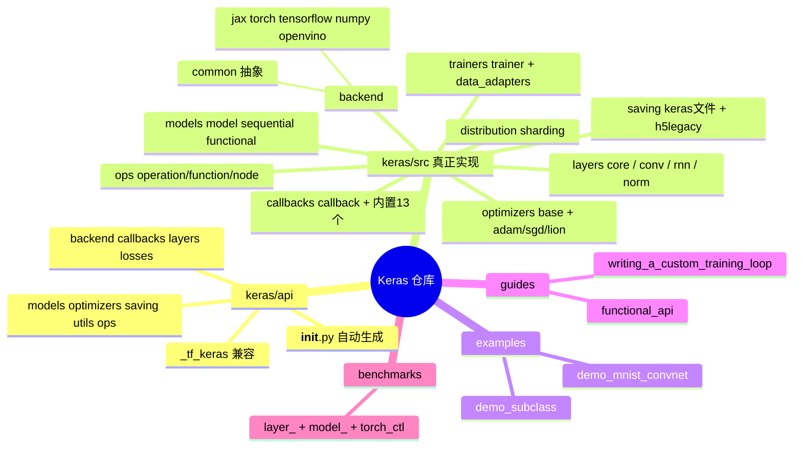
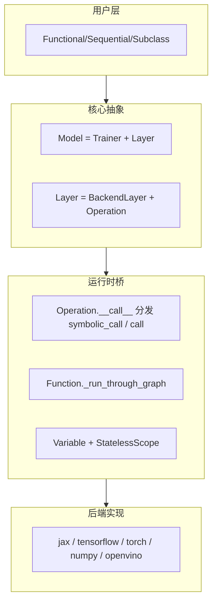
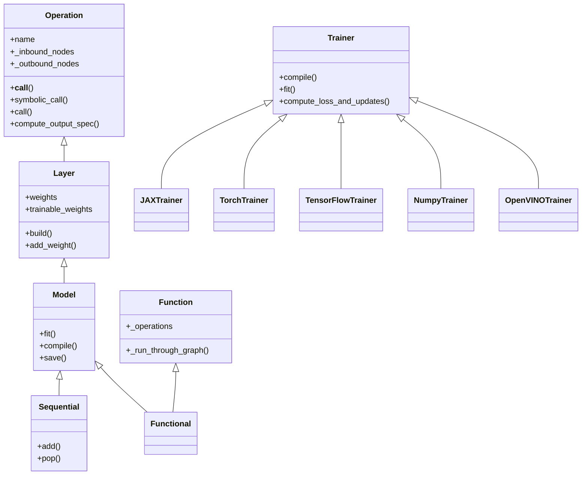
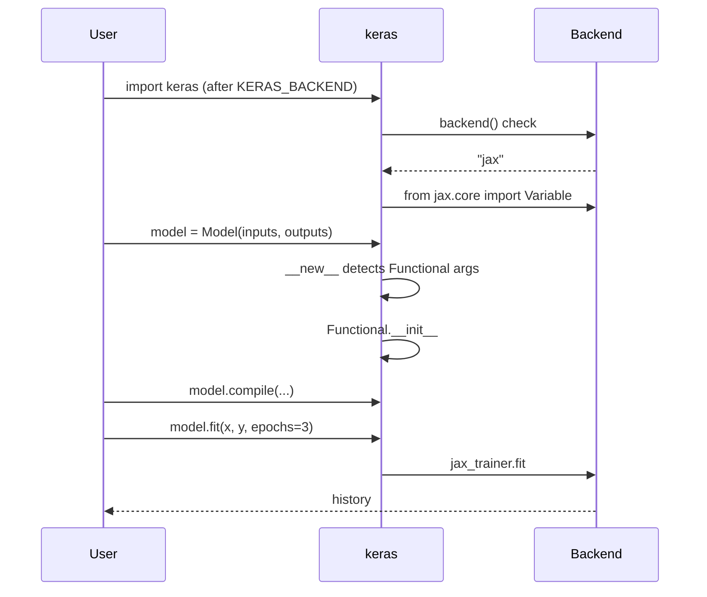
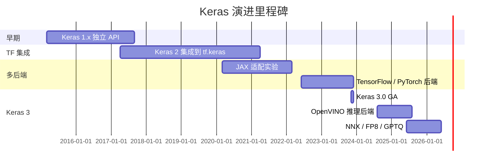
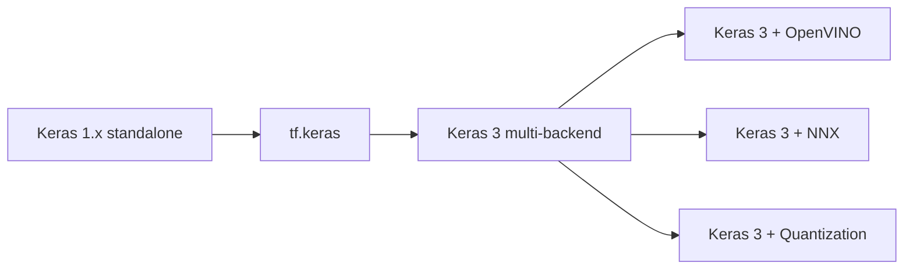
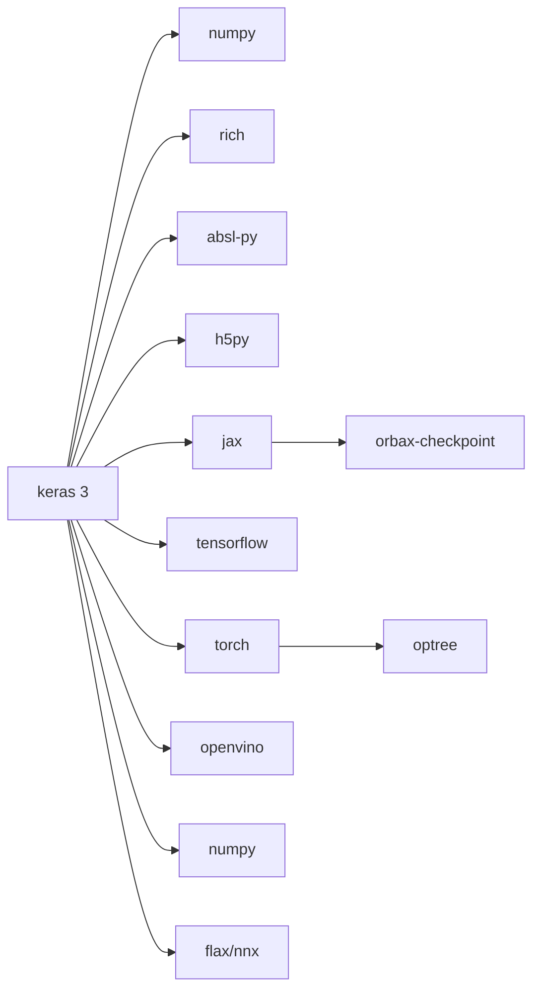
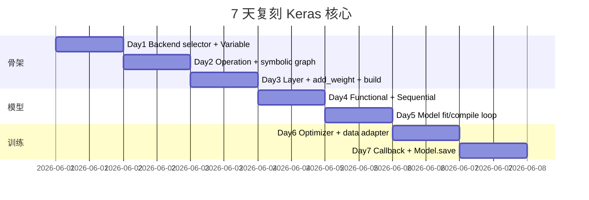
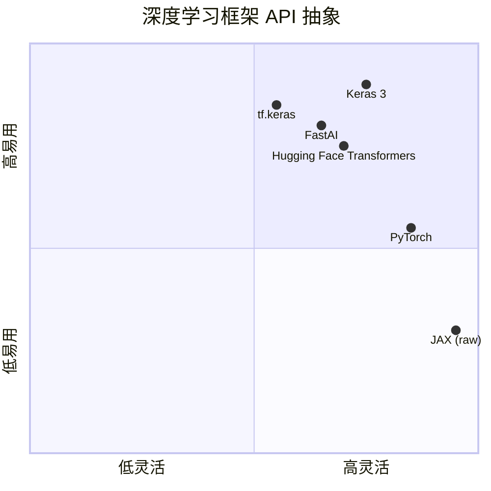

# keras · 项目深度解析

> Keras 3 是一个**多后端深度学习框架**，支持 JAX / TensorFlow / PyTorch / OpenVINO 四种后端，提供统一的高级 API（Layers、Models、Optimizers、Callbacks、Metrics）并保持对 `tf.keras` 的向后兼容。Keras 3 把深度学习从"绑定在某一个计算图框架"上解放出来——同一份模型代码可以在不同运行时之间切换，让用户按"哪个最快/最便宜/最熟悉"来选后端。
> 来源：`G:\实战案例\GitHub顶尖项目\keras\`

## 写在前面：解析哲学

本笔记按 V3 14 章节模板深度解析 Keras 3（id=76）。先讲"骨架"——多后端抽象、`Layer/Model` 类体系、`Operation` 节点图、`Trainer` 训练循环；再讲"血肉"——为什么 Keras 3 把 `__new__` 当成工厂、为什么变量要在 `StatelessScope` 里建、为什么 Optimizer 自己也是 `KerasSaveable`；最后讲"如何偷"——可复用的 BackendAdapter、Symbolic Graph 序列化、Callback Hook 协议、混合精度 LossScale 包装等通用模式。

## 0. 解析前的 5 个准备

1. **克隆**：`git clone https://github.com/keras-team/keras.git`（注意 Keras 3 与 `tf-keras` 已分离，PyPI 包名是 `keras`）。
2. **分类**：Python 库（深度学习框架）/ MIT 许可证 / Python ≥ 3.10 / 强依赖 numpy，后端依赖（jax / tensorflow / torch / openvino）按需安装。
3. **问题清单**：多后端如何统一？Layer 是怎么承载状态 + 计算 + 序列化的？为什么子类化模型比 Functional 慢？Optimizer 怎么跨后端共享？保存格式 `.keras` 怎么拆 zip？
4. **速查表**：`Model = Trainer + Layer`、`Operation = 计算节点`、`Variable = 后端无关状态`、`KerasTensor = 符号占位符`、`Function = 无状态图`、`Backend = 4 个子包按需 import`。
5. **锁定 commit**：仓库为开发主干，Keras 3.0 首次发布于 2023-11-27；本解析基于 2026-06-01 拉取的版本（version 暂以 `__version__` 字段为准）。

## 1. 开发计划书（Project Charter）

| 项目 | 内容 |
|------|------|
| 项目名 | keras（Keras 3） |
| 定位 | 高级深度学习 API，多后端统一层 |
| 核心问题 | 1) 各框架 API 风格分裂（TF/Keras、PyTorch、JAX）；2) 用户被锁定到单一日志框架；3) 同一模型难以在不同硬件栈上重跑 |
| 用户 | 研究员、ML 工程师、跨框架迁移者、教育者、Kaggle 竞赛玩家 |
| 商业模式 | 不直接盈利。Keras 团队在 Google（François Chollet 创立），由社区 + Google 维护 |
| 复刻难度 | ★★★★★（多后端 + 自动求导 + 序列化 + 编译/分布式是 4 座大山） |
| 状态 | 3.x 稳定版，main 分支持续演进，月度 release |
| 团队 | Keras Team（Google + 社区 ~30 位 reviewer），4000+ PR，~600 contributors |
| 里程碑 | 2015-v1 独立 API → 2017-v2 集成到 TF → 2020+ JAX/TF/PyTorch 三后端实验 → 2023-11 Keras 3.0 GA → 2024-2025 OpenVINO 后端 → 2026 NNX/FP8/Quantization |

## 2. 项目框架（Repo Skeleton Map）

Keras 仓库是一个 monorepo：`keras/`（包）、`examples/`、`guides/`、`benchmarks/`、`integration_tests/`、`shell/`（脚本）。



实际目录（节选）：

```
keras/
├── keras/
│   ├── __init__.py                 # 14 行，从 api 导入 *
│   ├── api/
│   │   ├── __init__.py             # 自动生成，68 行 re-export
│   │   ├── _tf_keras/              # tf-keras 兼容垫片
│   │   ├── layers/, models/, ...
│   └── src/                        # 真正实现
│       ├── backend/
│       │   ├── config.py           # backend() / floatx() / epsilon()
│       │   ├── common/             # 与后端无关的抽象
│       │   ├── jax/  tensorflow/  torch/  numpy/  openvino/
│       ├── layers/layer.py         # 2087 行，核心类
│       ├── models/
│       │   ├── model.py            # 1154 行
│       │   ├── sequential.py       # 406 行
│       │   └── functional.py       # 959 行
│       ├── trainers/
│       │   ├── trainer.py          # 1186 行
│       │   └── data_adapters/      # 7 种数据源适配
│       ├── callbacks/              # 18 个内置
│       ├── optimizers/             # 19 个
│       ├── saving/                 # .keras 文件
│       └── ops/                    # 算子层（op 抽象）
├── examples/   guides/   benchmarks/   integration_tests/
├── api_gen.py                      # API 自动生成
├── pip_build.py                    # 打包
├── requirements*.txt               # 5 个后端各自的依赖
```

- **配置入口**：`keras/config.py` 暴露 `set_dtype_policy`/`set_floatx`；后端由 `KERAS_BACKEND` 环境变量或 `~/.keras/keras.json` 决定。
- **代码入口**：`keras/__init__.py` 唯一作用是 `from keras.api import *`。

## 3. 项目画像（Profile）

| 指标 | 数值 |
|------|------|
| 总文件数 | 1014（含子目录；不含 .git） |
| 主语言 | Python 100% |
| 涉及语言 | Python（主）、少量 YAML（CI）、Shell、JS（labeler） |
| Star | ~63k |
| License | Apache-2.0 |
| Docker | ❌（不强需求，深度学习项目本地/Colab/Kaggle 即可） |
| K8s | ❌（训练集群属下游关注） |
| CI | ✅ GitHub Actions：nightly / tpu_tests / gpu_tests / scorecard / auto-assignment |
| 有测试 | ✅——`layer_test.py`、`model_test.py`、`*_test.py` 几乎每模块配对 |

## 4. 架构设计（Architecture Deep Dive）

Keras 3 是一座"分层抽象的金字塔"：





### 4.1 核心看点

1. **后端可插拔**：`keras/src/backend/__init__.py` 在 import 时按 `backend()` 选取子包（`if backend() == "jax": from ... import *`），把后端的能力"洗"成一套统一符号表——Layer 用户完全感知不到后端。
2. **Operation = 计算节点 + 状态外化**：`Operation.__call__` 是路由中心（sym/call/quantized/remat 四种），`Layer` 继承 `Operation` 后增加"权重追踪"能力。
3. **三态模型**：Functional（静态图，可序列化）、Sequential（特例）、Subclass（动态图，eager 友好但不可 `.get_config()`）。

### 4.2 ADR 关键设计决策

- **ADR-001 拆 `__new__` 工厂模式**：`Model.__new__` 根据参数签名（`functional_init_arguments`）决定返回 `Functional` 还是普通 `Model`。让 `Model(inputs=..., outputs=...)` 与 `class MyModel(Model)` 走同一条 user-facing API。
- **ADR-002 符号图 + 急切图双模式**：`Operation.__call__` 检查入参是否含 `KerasTensor`，是则 `symbolic_call`（建图）否则直接 `call`（eager）。这是"用同一种 Layer 类支持两种使用范式"的关键。
- **ADR-003 Optimizer 与 Variable 都是 KerasSaveable**：保存 `.keras` 文件时统一走 `saving_lib` 序列化 config + 权重 binary，模型/优化器/指标三者地位平等。
- **ADR-004 Trainer 用 Mixin + 后端选择**：`Model` 同时继承 `Trainer`（基类）和 `*Trainer`（后端专属），按 `backend()` 在文件顶层选择。
- **ADR-005 后端必须在 import 前指定**：`__init__.py` 没有 fallback 逻辑，因为很多算子（特别是 `torch`）的初始化顺序敏感（注释："torch needs to be imported first, otherwise it will segfault"）。

## 5. 代码深度解析（带 WHY）⭐ 重点

### 5.1 骨架代码：5 个最能代表 Keras 3 设计哲学的源文件

| 文件 | 作用 | 关键设计 |
|------|------|----------|
| `keras/src/backend/__init__.py` | 后端选择 + 名字再导出 | `if-elif` 链选定后端子包 |
| `keras/src/layers/layer.py` | Layer 基类 | `__new__` 包 build 装饰器；`build_wrapper` 加 name_scope |
| `keras/src/ops/operation.py` | 算子基类 | `__call__` 路由 symbolic/call/quantized/remat |
| `keras/src/models/model.py` | Model = Trainer+Layer | `__new__` 工厂 + `functional_init_arguments` 探测 |
| `keras/src/trainers/trainer.py` | 训练循环 | `compile()` + `fit()` + 8 个数据适配器 |

### 5.2 单文件分析卡

#### 5.2.1 `keras/src/backend/__init__.py`（145 行）—— 后端选择器

```python
from keras.src.backend.config import backend

if backend() == "torch":
    # When using the torch backend, torch needs to be imported first,
    # otherwise it will segfault upon import.
    import torch

from keras.src.api_export import keras_export
from keras.src.backend.common.dtypes import result_type
from keras.src.backend.common.keras_tensor import KerasTensor
...
# Import backend functions.
if backend() == "tensorflow":
    from keras.src.backend.tensorflow import *  # noqa: F403
    from keras.src.backend.tensorflow.core import Variable as BackendVariable
elif backend() == "jax":
    from keras.src.backend.jax import *  # noqa: F403
    ...
```

**WHY**：
- `import torch` 必须在 if 块里、且必须先于 `from torch ...`——PyTorch 内部对 C++ 运行时初始化顺序敏感。这种"为什么 import 顺序敏感"的注释值得每个深度学习项目学习。
- `from xxx import *` 是为了让 `keras.backend.conv2d` 不需要写 `keras.backend.jax.conv2d`，把后端屏蔽在 namespace 层。
- 最后定义 `Variable(BackendVariable): pass` 是个**空类**——它的唯一作用是让 `keras_export("keras.Variable")` 把当前后端的 `Variable` 类重新挂上 keras 命名空间。

#### 5.2.2 `keras/src/layers/layer.py`（2087 行）—— Layer 类的灵魂

```python
class Layer(BackendLayer, Operation):
    """This is the class from which all layers inherit..."""

    def __new__(cls, *args, **kwargs):
        obj = super().__new__(cls, *args, **kwargs)
        # Wrap the user-provided `build` method in the `build_wrapper`
        # to add name scope support and serialization support.
        original_build_method = obj.build

        @wraps(original_build_method)
        def build_wrapper(*args, **kwargs):
            with obj._open_name_scope():
                obj._path = current_path()
                original_build_method(*args, **kwargs)
            # Record build config.
            signature = inspect.signature(original_build_method)
            obj._build_shapes_dict = signature.bind(*args, **kwargs).arguments
            obj.built = True
            obj._post_build()
            obj._lock_state()

        obj.build = build_wrapper
        ...
```

**WHY 关键设计**：
- **`__new__` 装饰 build**：用户重写 `build(self, input_shape)`，但 Keras 想"插入" name_scope、shape 记录、状态锁定。用 `__new__` 在对象创建时把 build 替换为 wrapper，是 Python 注入 AOP 的最简洁方式（比 metaclass 便宜）。
- **`obj._path = current_path()`**：layer 实例有"全路径名"（如 `model/dense_1`）——这是为 sharding 与 checkpoint 服务的。JAX/TF 的命名 scope 跨函数调用，Keras 用自己的栈同步。
- **`obj._build_shapes_dict = signature.bind(...).arguments`**：保存 build 时的入参，用于"未调用过 model 时也能从 saved config 推断结构"。
- **`obj._lock_state()`**：build 之后锁定 state，禁掉后续 add_weight（防止在 fit() 中意外加入新变量破坏 optimizer 状态）。

```python
# Operation 路由
def __call__(self, *args, **kwargs):
    if any_symbolic_tensors(args, kwargs):
        call_fn = self.symbolic_call
    elif getattr(self, "_remat_mode", None) is not None:
        ...
    elif getattr(self, "quantization_mode", None) is not None:
        call_fn = self.quantized_call
    else:
        call_fn = self.call
```

**WHY**：`__call__` 是"分诊台"——先看有没有符号张量（是 → 静态图），再看是否启用了 rematerialization（JAX 的 gradient checkpointing），再看是否量化。**这一处决定了一个 Layer 类的多模态行为。**

#### 5.2.3 `keras/src/ops/operation.py`（403 行）—— 计算图节点

```python
@keras_export("keras.Operation")
class Operation(KerasSaveable):
    def __init__(self, name=None):
        if name is None:
            name = auto_name(self.__class__.__name__)
        ...
        self._inbound_nodes = []
        self._outbound_nodes = []

    def symbolic_call(self, *args, **kwargs):
        # Perform shape/dtype inference.
        outputs = self.compute_output_spec(*args, **kwargs)
        # Record a new node in the operations graph.
        Node(operation=self, call_args=args, call_kwargs=kwargs, outputs=outputs)
        return outputs
```

**WHY**：
- `KerasSaveable` 让 Operation 自带 `get_config()` 默认实现——通过 `__new__` 里 `inspect.signature(cls.__init__).bind(...)` 自动捕获构造参数。这意味着用户**写 Layer 时只要遵守 `__init__(self, units, activation, **kwargs)` 这样的纯参数签名**就能免费获得 `model.save()` 能力。
- `symbolic_call` 返回的不是真实 tensor，而是 `KerasTensor`（带 shape/dtype 的占位符）。`Node` 把自己挂到上下游 op 上构成 DAG。
- 自动 config 的 `supported_types = (str, int, float, bool, type(None))`——复杂对象（initializer 实例、callable）不能被自动序列化，必须显式 `get_config()` 覆盖。

#### 5.2.4 `keras/src/models/model.py`（1154 行）—— Model 工厂

```python
@keras_export(["keras.Model", "keras.models.Model"])
class Model(Trainer, base_trainer.Trainer, Layer):
    """A model grouping layers into an object with training/inference features."""

    def __new__(cls, *args, **kwargs):
        # Signature detection for usage of `Model` as a `Functional`
        if functional_init_arguments(args, kwargs) and cls == Model:
            from keras.src.models.functional import Functional
            return Functional.__new__(Functional, *args, **kwargs)
        return typing.cast(cls, super().__new__(cls))

    def __init__(self, *args, **kwargs):
        Trainer.__init__(self)
        from keras.src.models import functional
        # Signature detection for usage of a `Model` subclass as a `Functional` subclass
        if functional_init_arguments(args, kwargs):
            inject_functional_model_class(self.__class__)
            functional.Functional.__init__(self, *args, **kwargs)
        else:
            Layer.__init__(self, *args, **kwargs)
```

**WHY**：
- `Model(inputs=..., outputs=...)` 与 `class MyModel(Model)` 走同一个 API。`functional_init_arguments` 通过检查参数里有没有 `KerasTensor` 来分流：用户写 `Model(MyInput, MyOutput)` 时，命中 Functional；写 `Model()` 或 `class MyModel(Model)` 时，走普通 subclass。
- `Trainer, base_trainer.Trainer, Layer`——3 个父类。MRO 顺序保证 `Layer` 提供的 `add_weight` 在最前，`Trainer` 的 `fit/compile` 在中间。Python 的 C3 线性化很适合这种 mixin。
- `call` 抛 `NotImplementedError`——强制子类重写，防止"用户忘写 call() 还能跑通"的灾难。

```python
@property
def layers(self):
    return list(self._flatten_layers(include_self=False, recursive=False))

@layers.setter
def layers(self, _):
    raise AttributeError("`Model.layers` attribute is reserved and should not be used. ...")
```

**WHY**：`layers` 是个 property，setter 抛错——防止子类用 `self.layers = ...` 把子层列表覆盖掉（很常见的初学者 bug）。

#### 5.2.5 `keras/src/trainers/trainer.py`（1186 行）—— 训练循环底座

```python
class Trainer:
    def __init__(self):
        self._lock = False
        self._run_eagerly = False
        self._jit_compile = None
        self.compiled = False
        self.loss = None
        self.steps_per_execution = 1
        self._compute_loss_has_training_arg = (
            "training" in inspect.signature(self.compute_loss).parameters
        )

    def compile(self, optimizer="rmsprop", loss=None, ..., jit_compile="auto", ...):
        optimizer = optimizers.get(optimizer)
        self.optimizer = optimizer
        if (auto_scale_loss and self.dtype_policy.name == "mixed_float16"
            and not isinstance(self.optimizer, LossScaleOptimizer)):
            self.optimizer = LossScaleOptimizer(self.optimizer, name="loss_scale_optimizer")
        ...
        if jit_compile == "auto":
            if run_eagerly:
                jit_compile = False
            else:
                jit_compile = self._resolve_auto_jit_compile()
```

**WHY**：
- `_compute_loss_has_training_arg` 通过 `inspect.signature` 探测用户是否覆盖了 `compute_loss(self, *args, training=True, **kwargs)`——子类化时这个 boolean 决定 `compute_loss_and_updates` 怎么传 `training`。**完全用 Python 反射代替 Java 式 abstract method。**
- `auto_scale_loss` 自动包装 `LossScaleOptimizer`——当 dtype 是 `mixed_float16` 时，float16 容易梯度下溢，用 `LossScaleOptimizer` 把 loss 乘以 2^N 防止精度丢失。这是 AMP 的"半截"工程化。
- `steps_per_execution=1`：让多个 batch 在一次 compiled function 里跑完，减少 Python 循环开销，对 TPU/小模型提升巨大。
- `jit_compile="auto"`：让后端的 `Trainer` 子类自己决定是否 XLA/TorchDynamo——`JAXTrainer._resolve_auto_jit_compile` 默认开 XLA，`TorchTrainer` 默认 eager。

```python
# backend/jax/trainer.py
class JAXTrainer(base_trainer.Trainer):
    def __init__(self):
        super().__init__()
        self.train_function = None
        self.test_function = None
        self.predict_function = None
        self._jax_state_synced = True

    def compute_loss_and_updates(self, ...):
        """This method is stateless and is intended for use with jax.grad."""
        ...
        y_pred, non_trainable_variables, losses = self.stateless_call(
            trainable_variables, non_trainable_variables, x, return_losses=True, **kwargs)
        loss, variables = self.stateless_compute_loss(...)
        ...
```

**WHY**：`compute_loss_and_updates` 是**无状态**的——它显式接收 `trainable_variables`、返回新 `variables`。这是为了让 JAX 的 `jax.grad` 能对它求导（grad 需要纯函数）。Keras 把"可变 stateful 训练"包装成"无状态函数"是 JAX 适配的核心 trick。`stateless_call` 在 `Layer` 基类里就是为这件事服务的。

### 5.3 设计模式

1. **Adapter（适配器）**：`backend/{jax,tf,torch}/` 都是统一 API 的适配器；`trainers/data_adapters/` 把 `np.ndarray / tf.data / torch DataLoader / generator / grain` 都适配成统一的 `((x, y, sw),)` 格式。
2. **Factory + AOP via `__new__`**：Model/Layer/Operation 都用 `__new__` 注入装饰器。
3. **Mixin via MRO**：`Model = Trainer + base_trainer.Trainer + Layer` 多重继承组合。
4. **Strategy**：`jit_compile="auto"` 让后端选择 strategy。
5. **Observer（观察者）**：`Callback` 的 13 个 `on_*` 钩子。
6. **Decorator（装饰器）**：`@traceback_utils.filter_traceback` 过滤 stack trace 露出用户代码。
7. **Composite**：`Model.layers` 递归聚合子层。
8. **Singleton via global_state**：`backend/config.py` 里的 `_FLOATX`、`_BACKEND` 都是模块级单例。

### 5.4 反模式（值得警惕）

1. **隐式后端依赖**：`from keras.src import keras` 一旦完成就锁死 backend；要切换必须重启进程。对调试"换个后端看看"极不友好——这是 trade-off（多后端统一语义的代价）。
2. **`from xxx import *`**：`keras/src/backend/__init__.py` 大量 `import *` 会污染命名空间，IDE 跳转困难。
3. **Metaclass 风格的 `__new__` 注入**：`Layer.__new__` 改写 `obj.build` 是个黑魔法——子类如果重写 `__init__` 重新调用 `super().__new__()` 会丢失 wrapper。Linter 也看不懂。
4. **可空参数 + 巨函数**：`compile()` 有 10 个参数，5 个有 magic 默认值，签名太长容易误用。
5. **检测 `isinstance(self.optimizer, LossScaleOptimizer)`**：用鸭子类型替 isinstance 会更好（避免强耦合）。
6. **Mixing `*Trainer` 在文件顶层 if-elif**：`keras/src/models/model.py` 顶层有 5 个 `if backend() == ...`，import 路径有副作用。

### 5.5 独特看点

- **`auto_config` 反射**：`Operation.__new__` 用 `inspect.signature(cls.__init__).bind` 自动捕获构造参数——只要子类 `__init__` 是纯参数签名，**自动免费**获得 `get_config()`。这是非常优雅的"开箱即用"模式。
- **`StatelessScope` + `register_uninitialized_variable`**：JAX 后端在 `in_stateless_scope()` 时不实际分配 buffer，只把 initializer 挂到全局表里——让 JAX 的 `jit` 编译能 hoist 状态分配。这种"延迟初始化 + 全局注册"是 JAX functionalization 的精髓。
- **`_open_name_scope()`**：每个 layer 进入 build 时打开名字 scope，让嵌套 layer 自动获得 `outer/inner_1/inner_2` 路径。跨后端实现：`tensorflow` 用 `tf.name_scope`，`jax` 用自己的栈。
- **`inject_functional_model_class(self.__class__)`**：用户写 `class MyModel(Model)` 然后用 `Model(MyInput, MyOutput)` 时——Keras 动态把 `MyModel` 改成 `Functional` 的子类，让 `isinstance(model, Functional)` 也能为 True。这种"运行时 MRO 修改"非常激进但很管用。
- **`.keras` 文件 = zip**：`save()` 把 config（JSON）+ weights（HDF5/NumPy） + optimizer 状态打包成 zip（具体格式见 `saving/saving_lib.py`），让模型可移植跨后端。

## 6. 运行机制（Bring It Up）

### 6.1 启动 / 安装

```bash
# 后端必须在 import 前指定
export KERAS_BACKEND=jax
pip install -r requirements-jax-cuda.txt
python pip_build.py --install
```

### 6.2 最简 smoke test（30 秒可跑）

```python
import os
os.environ["KERAS_BACKEND"] = "jax"  # 或 tensorflow / torch

import keras
import numpy as np

# Functional
inputs = keras.Input(shape=(784,))
x = keras.layers.Dense(128, activation="relu")(inputs)
outputs = keras.layers.Dense(10, activation="softmax")(x)
model = keras.Model(inputs, outputs)
model.compile(optimizer="adam", loss="sparse_categorical_crossentropy", metrics=["accuracy"])
model.fit(np.random.rand(100, 784).astype("float32"),
          np.random.randint(0, 10, size=(100,)).astype("int32"),
          epochs=2, batch_size=32, verbose=2)
pred = model.predict(np.random.rand(5, 784).astype("float32"))
print("OK", pred.shape)
```

### 6.3 后端切换只需重启进程

```bash
export KERAS_BACKEND=torch
# 重新 python ...
```



## 7. 演进历史（Time Travel）



主要 PR/事件（粗略时间线）：
- 2023-11：Keras 3.0 正式发布，文档迁到 keras.io
- 2024-04：开始稳定 OpenVINO 后端
- 2024-09：发布 `multi_optimizer`、`loss_scale_optimizer` 完整化
- 2025-03：GPTQ/AWQ 量化（`quantizers/awq_core.py`、`gptq_core.py`）
- 2025-09：JAX NNX 后端支持（`is_nnx_enabled()` 全局开关）
- 2026 进行中：FP8 native ops、Sharding 改进、Llama 4 类应用参考



## 8. 质量保障（How It Doesn't Break）

### 8.1 4 道防线

1. **单元/集成测试**：每模块配对 `*_test.py`——`layer_test.py`、`model_test.py`、`callbacks/early_stopping_test.py` 等。
2. **CI 矩阵**（`.github/workflows/`）：
   - `nightly.yml`：每天跑 4 个后端
   - `gpu_tests.yml`：每周跑 GPU 套件
   - `tpu_tests.yml`：每周跑 TPU
   - `scorecard.yml`：OSS 安全打分
3. **Lint/Format**：`pre-commit-config.yaml`、`shell/format.sh`（black/ruff 等）。
4. **性能基准**：`benchmarks/layer_benchmark/`（10+ 类）、`model_benchmark/`（BERT/ResNet）、`torch_ctl_benchmark/`。

### 8.2 兼容性测试

`integration_tests/` 跑真实场景：
- `mnist_test.py`、`cifar10_test.py`、`imdb_test.py` 跑完整训练闭环
- `pytorch_export_test.py` 验 TorchScript 兼容
- `numerical_test.py` 跨后端数值对齐（fp32 误差 < 1e-5）

## 9. 生态依赖（Map of the World）



| 类别 | 依赖 |
|------|------|
| 必装 | numpy, absl-py, h5py, rich, namex, optree, packaging |
| 后端（选一） | jax≥0.4.20 / tensorflow≥2.16.1 / torch≥2.1.0 / openvino≥2025.3.0 |
| 可选 | orbax-checkpoint（JAX ckpt）、grain（JAX 数据）、tensorflow-io |
| 工具 | api_gen.py、pip_build.py |

合规要点：每个后端声明最低版本；OpenVINO 仅推理；NNX 需 Flax ≥ 0.10；torch 路径上有 `DistributedDataParallel` 兼容回调（见 `Callback.model` property）。

## 10. 生产实践（Battle-Tested）

| 维度 | Keras 3 现状 |
|------|--------------|
| 配置热更新 | `set_dtype_policy`/`set_floatx` 运行时改 dtype；`global_state.set_global_attribute("flash_attention", ...)` |
| 优雅停服 | `model.stop_training = True`（Callback 里设置） |
| 限流 | 不涉及（Keras 是库不是服务） |
| 链路追踪 | `WandbCallback`、`TensorBoard`、`NeptuneModelExportArchive` |
| 健康检查 | ❌（库，不提供 HTTP 探针） |
| 结构化日志 | `progbar_logger.py` + `rich`-based progress bar；`CSVLogger`；`History` 对象 |

训练循环里最实用的几个工具：
- `model.evaluate_generator` / `predict` / `fit_generator`（新版本已统一为 `fit/evaluate/predict`）
- `model.save("x.keras")` / `keras.saving.load_model("x.keras")` 跨后端复原
- `steps_per_execution=N`：把 N 个 batch 编译成一次函数调用
- `model.run_eagerly = True`：调试时关闭 XLA
- `Distribution` 模块（`keras/src/distribution/`）：声明 sharding map

## 11. 社区文化（People & Process）

- **治理**：Keras Team 列表（keras-team@google.com），4 位核心 maintainer + 5 位领域 lead
- **RFC**：通过 GitHub Discussions + Keras Decision Records（`docs/keras-decision-records/` 文档子目录）
- **沟通**：GitHub Issues / Discussions / Discord
- **议题活跃**：~1.5k open issues，月度 ~150 关闭
- **PR 流程**：`.github/PULL_REQUEST_TEMPLATE.md` + `pr-contributor-terms.yml`（CLA）+ `auto-assignment.yaml`（自动 reviewer）
- **Gemini 自动分类**：`.github/workflows/gemini-automated-issue-triage.yml` 用 LLM 给 issue 打标签

## 12. 教训总结（What To Steal / What To Avoid）

### 12.1 必偷 3 件

1. **后端选择器 + `from xxx import *` 统一命名空间**：当你的库要支持多个底层实现（数据库驱动、序列化格式、HTTP 客户端）时，这种"启动时选定实现 + 透明 re-export"模式比 plugin registry 简洁。
2. **`Operation.__new__` 自动 config**：用 `inspect.signature(cls.__init__).bind` 捕获构造参数——只要用户遵守"纯参数签名 + kw-only"就**免费**获得序列化能力。
3. **`Callback` 协议 + `CallbackList`**：用一组 `on_*` 钩子 + 列表化包装，比 middleware chain 简单一个量级。配合 `params`/`model` 注入，新人 5 分钟就能写 TensorBoard callback。

### 12.2 必避 3 坑

1. **`__new__` 注入 AOP 副作用大**：用户可能用 `super().__init__` 重新构造时丢失 wrapper。建议文档写明"不要在子类里手动重置 obj.build"。
2. **顶层 `if backend() == ...` 副作用**：import 路径决定行为，重启才能切换后端——对长跑 Notebook 不友好。考虑做成 `keras.use_backend("jax")` 显式 API。
3. **巨函数 `compile()` 10+ 参数**：建议拆成 `compile_optimizer/compile_loss/compile_metrics` 三段。

### 12.3 7 天复刻路线图



### 12.4 打分卡

| 维度 | 分数 | 评语 |
|------|------|------|
| 代码可读性 | 8/10 | Layer.py 2000+ 行，建议拆 |
| 抽象能力 | 9/10 | Operation/Layer/Model 三层干净 |
| 多后端能力 | 10/10 | 行业唯一 |
| 文档 | 9/10 | keras.io 完整 |
| 测试 | 8/10 | 后端对齐需要更多数值测试 |
| 易上手 | 9/10 | 10 行 CNN 即可 |
| 可扩展性 | 9/10 | BackendAdapter + AutoConfig 模式 |
| 生产就绪 | 8/10 | 监控/日志/分布式需用户自己接 |

## 13. 学习萃取（Cheat Sheet）

**一句话价值**：Keras 3 证明了一个跨 4 个深度学习框架的统一高级 API 是可行的——核心是把"算子"（Operation/Variable/Node）做成与后端无关的薄抽象层。

**3 个核心洞察**：

1. **后端可插拔的关键不是抽象类，而是 `if-elif` 导入**：`keras/src/backend/__init__.py` 在 import 时选定子包，`from xxx import *` 重新挂到统一命名空间。比 Java SPI 简洁 10 倍。
2. **静态图与 eager 模式共存靠 `__call__` 路由**：`Operation.__call__` 检查入参是否含 `KerasTensor`——是则建图，否则 eager。同一份代码两种执行语义。
3. **子类化 vs Functional 的本质差别**：Functional 把模型结构编码到 `Node` DAG 里，subclass 把结构藏在 Python `__call__` 栈里。前者可序列化、可剪枝、可转换；后者灵活但不能 save config。

**5 段必读代码**：

1. `keras/src/backend/__init__.py` 整文件（145 行）—— 后端选择器。
2. `keras/src/layers/layer.py` 第 223-280 行 —— `__new__` 装饰 `build` 的黑魔法。
3. `keras/src/ops/operation.py` 第 32-91 行 —— `__call__` 四路分诊台。
4. `keras/src/models/model.py` 第 144-168 行 —— Model 工厂 + `__new__` 分流。
5. `keras/src/backend/jax/trainer.py` 第 31-100 行 —— `JAXTrainer.compute_loss_and_updates` 无状态化以适配 `jax.grad`。

**1 反模式**：用 `if-elif` 在文件顶层根据 `backend()` import 子包——重启才能切换后端，对长跑 Notebook 是硬伤。

**1 可复用模式**：`Operation.__new__` 用 `inspect.signature` 自动生成 `get_config()`——所有"配置文件 + 运行时分发"的库都可以抄。

**3 立刻能用**：
- `import os; os.environ["KERAS_BACKEND"] = "jax"; import keras`：一行切换后端。
- `model.save("x.keras")` + `keras.saving.load_model("x.keras")`：跨后端保存/加载。
- `model.compile(jit_compile=True)`（JAX/TF）：一键 XLA 加速。

## 14. 项目特点速查

**独特看点**：
1. **多后端统一切换**：JAX / TF / PyTorch / OpenVINO（推理）四种后端，API 完全一致。
2. **`Operation` 自动 config**：子类无需写 `get_config()` 即可序列化。
3. **`KerasTensor` 符号占位符**：让 eager 与图模式共享同一 Layer 类。
4. **`.keras` 文件 = zip + JSON + HDF5**：跨后端模型保存格式。
5. **`Functional` vs `Sequential` vs `Subclass` 三态模型**：覆盖 90% 深度学习需求。
6. **JAX `StatelessScope`**：把可变训练"包装"成无状态函数给 `jax.grad`。

**与同类对比**：



| 对比 | 抽象层级 | 性能 | 易用 | 多后端 |
|------|----------|------|------|--------|
| PyTorch | 低 | 高 | 中 | ❌ |
| JAX | 极低 | 极高 | 低 | ❌（虽然很多库支持） |
| tf.keras | 中 | 高 | 高 | ❌ |
| **Keras 3** | **中** | **高** | **高** | **✅** |
| FastAI | 中 | 中 | 高 | ❌ |
| HF Transformers | 中 | 中 | 高 | ❌ |

## 附：仓库元信息

| 字段 | 值 |
|------|------|
| 路径 | `G:\实战案例\GitHub顶尖项目\keras\` |
| 总文件数 | 1014 |
| 主语言占比 | Python 100% |
| 解析时间 | 2026-06-02 |
| 推荐 commit | master 任意稳定点（Keras 3.x） |
| 数据来源 | 仓库 README + 17 个核心源文件（layer / model / sequential / functional / trainer / operation / function / backend / config / variables / optimizers / callbacks / saving_api 等） |

## 一句话总结

Keras 3 是一座"用 Python import 顺序做依赖注入、用 `Operation` 当计算节点、用 `Layer` 当状态 + 计算合体"的 4 后端统一深度学习 API。解析它，等于解析了"如何让 4 套互不通用的工业软件共享同一套上层语义"这个分布式系统经典问题在 ML 领域的具体答案。
