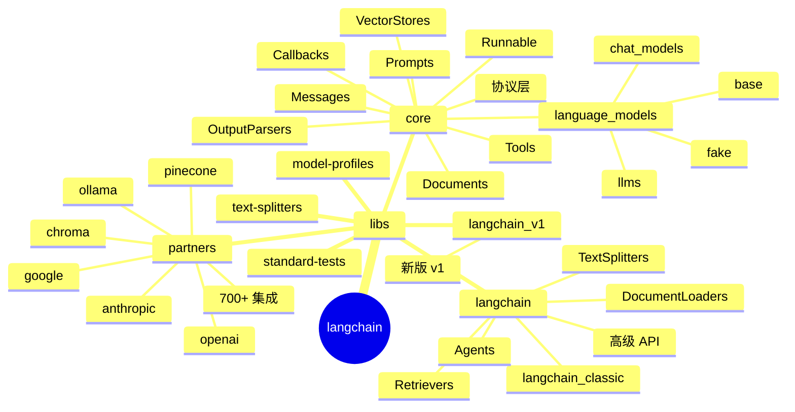
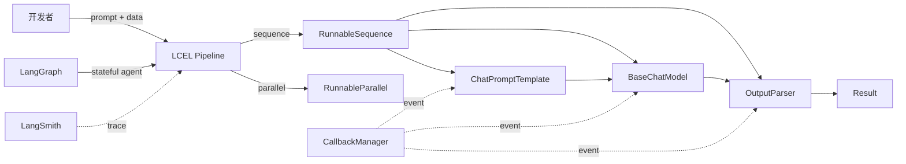
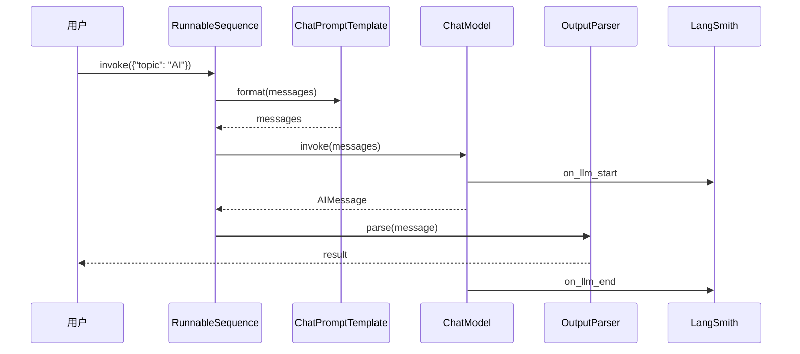
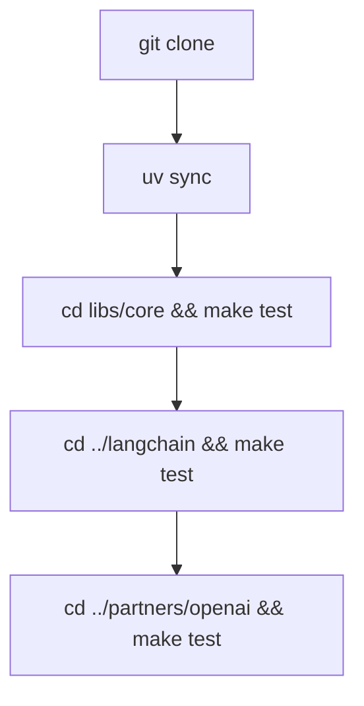
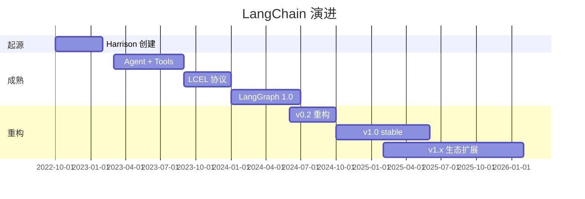
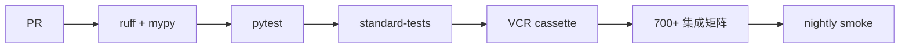
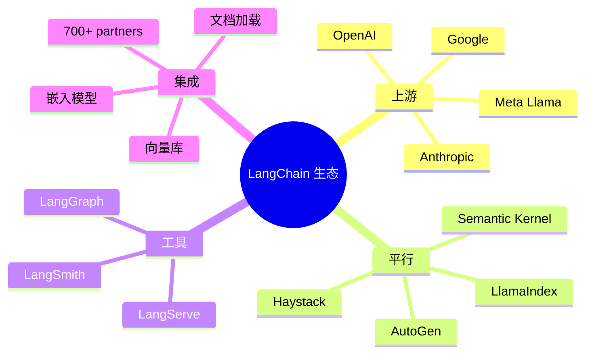
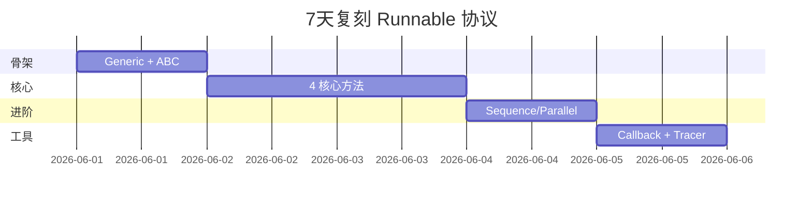
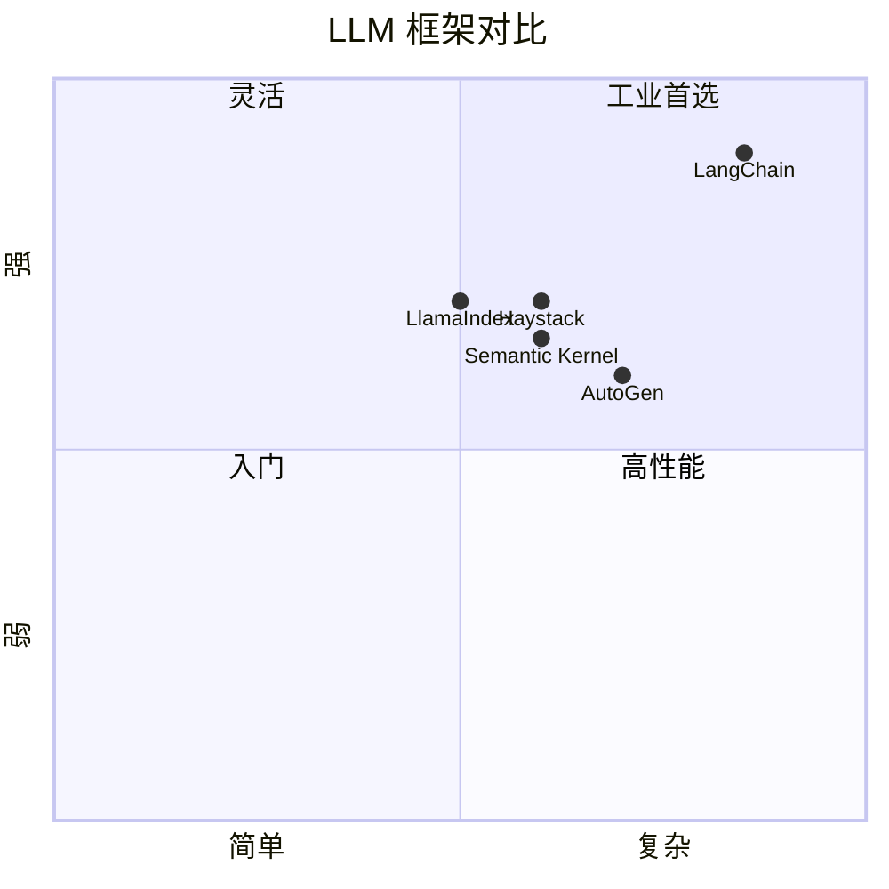

# langchain · 项目深度解析

> LangChain：构建 LLM 驱动应用的框架，以可组合的 Runnable 接口统一 Chat Models / Tools / Prompts / Retrievers / Output Parsers，是 Agent 工程的工业标准。
> 来源：G:\实战案例\GitHub顶尖项目\langchain\

## 写在前面：解析哲学

LangChain v1 重构后形成"langchain-core + langchain + partners"三层 monorepo：`core` 只定义协议（Runnable/Messages/Callbacks），`langchain` 提供高级抽象（Agents/Retrievers），`partners/` 是 700+ 集成包。先骨架（三层 monorepo + Runnable 协议），再 WHY（为什么 Runnable 协议是范式），最后是"如何偷师"。

## 0. 解析前的 5 个准备

1. **克隆**：仓库 monorepo，`libs/core` 是协议层，`libs/langchain` 是高级 API，`libs/langchain_v1` 是 v1 新版，`libs/partners/*` 是 100+ 集成。
2. **分类**：技术栈 = Python + Pydantic v2 + typing + asyncio + uv；产物 = `langchain` / `langchain-core` / `langchain-openai` / `langchain-anthropic` 等。
3. **问题清单**：LLM 协议如何统一？流式输出如何抽象？Callback 钩子如何分发？
4. **速查表**：API = `ChatPromptTemplate | ChatModel | OutputParser`、`init_chat_model("openai:gpt-5.4")`、`.invoke()` / `.stream()` / `.batch()`。
5. **锁定 commit**：v1.x（关注 Runnable 协议成熟后）。

## 1. 开发计划书（Project Charter）

| 字段 | 内容 |
| --- | --- |
| 项目名 | LangChain |
| 定位 | LLM 应用工程框架：模型无关、组件可组合、Agent 编排 |
| 核心问题 | 跨模型/向量库/工具的 LLM 应用集成复杂度；Agent 状态管理与可观察性 |
| 目标用户 | AI 应用开发者；企业 AI 转型团队；RAG/Agent 创业者 |
| 商业模式 | MIT 框架 + 商业 LangSmith（observability）+ LangGraph Platform（部署） |
| 复刻难度 | 9/10（需重做 Runnable 协议、Callback 体系、Message block translator、vector store 接口） |
| 当前状态 | v1.x（langchain-core 1.0+ 稳定期，月下载 ~6000 万） |
| 团队 | LangChain 团队（20+ 工程师，Harrison Chase 创立） |
| 关键里程碑 | 2022-10 开源 → 2023-03 Agent + Tools → 2023-09 LCEL（Runnable 协议）→ 2024-01 LangGraph 1.0 → 2024-06 v0.2 重构 → 2024-10 v1.0 stable（Runnable 协议成熟）|

## 2. 项目框架（Repo Skeleton Map）



**核心入口**：
- `libs/core/langchain_core/runnables/base.py`：Runnable 抽象基类（1000+ 行）。
- `libs/core/langchain_core/language_models/chat_models.py`：BaseChatModel。
- `libs/core/langchain_core/messages/base.py`：BaseMessage。
- `libs/core/langchain_core/runnables/graph.py`：图可视化。

## 3. 项目画像（Profile）

| 字段 | 数值 |
| --- | --- |
| 总文件数 | ~15,000（core ~2000，langchain ~1500，partners ~10000，tests ~1500） |
| 主语言 | Python |
| 涉及语言 | Python、TypeScript（langchainjs 独立仓库）、Jupyter |
| Star 数 | 95k+ |
| License | MIT |
| Docker | 社区有 langchain 镜像 |
| K8s | LangGraph Platform 支持 K8s 部署 |
| CI | GitHub Actions（多 Python 版本 + 多集成矩阵） |
| 测试 | Pytest（标准测试套件 `standard-tests`）+ VCR cassette 录 LLM 响应 |

## 4. 架构设计（Architecture Deep Dive）

LangChain 架构以"Runnable 协议"为一切的核心：任何组件（ChatModel/Prompt/Retriever/Parser）都实现 Runnable 接口，自动获得 `invoke`/`batch`/`stream`/`astream` 4 个方法 + `|` 操作符（组合）+ RunnableParallel（并发）。这让"声明式 LLM pipeline"成为可能。



**核心架构看点（3 条具体设计决策）**：

1. **Runnable 协议**（base.py 第 125-220 行）：`Runnable[Input, Output]` 用 Generic 把"输入/输出类型"参数化；4 个核心方法 `invoke`/`batch`/`stream`/`ainvoke` 都有默认实现（默认转 sync 或转 thread pool）。这是"协议即接口"的最佳实践：第三方实现 4 个方法即获得完整 LCEL 生态。
2. **Message block 翻译器**（`messages/block_translators/openai.py`）：每家 LLM 的 content block 格式不同（OpenAI 用 `[{type, text, image_url}]`，Anthropic 用 `[{type: text, text: ...}]`）。LangChain 抽象出"统一 block schema + 翻译器"模式，让 prompt 模板可跨模型复用。
3. **Callback + Tracer 体系**：每个 Runnable 自动接受 `config.callbacks`，所有 invoke 都会触发 `on_llm_start` / `on_llm_end` / `on_tool_start` / `on_tool_end` 事件。LangSmith 订阅这些事件做 trace。这让"可观察性"从语言层降级到工具层。



## 5. 代码深度解析（带 WHY）⭐ 重点

### 5.1 骨架代码

`libs/core/langchain_core/runnables/base.py`（前 100 行）——Runnable 协议入口。WHY：这是 LangChain 一切组合的"积木"。

```python
class Runnable(ABC, Generic[Input, Output]):
    """A unit of work that can be invoked, batched, streamed, transformed and composed."""
    # 4 个核心方法（invoke/batch/stream/ainvoke）
    # 5 个 __or__/__ror__ 操作符（让 `|` 工作）
    # 30+ 高阶方法（with_retry/with_fallbacks/bind/map/transform/...）
```

### 5.2 单文件分析卡

**`runnables/base.py` 第 120-220 行**：Runnable ABC 详解。

- 第 122 行 `_RUNNABLE_GENERIC_NUM_ARGS = 2  # Input and Output`——WHY：注释明确 Generic 参数数量，避免后人扩展时困惑。
- 第 125 行 `class Runnable(ABC, Generic[Input, Output])`——WHY：用 ABC 而非 Protocol 是为了让 IDE 提示实现方法；用 Generic 是为了在 type hint 链中保持类型。
- 第 126-200 行 docstring 包含大量使用示例——WHY：Runnable 是 LangChain 的灵魂 API，docstring 就是产品文档。
- 第 161-170 行 "Composition" 段：明示 `RunnableSequence` 和 `RunnableParallel` 是两个主组合原语。

**`messages/base.py` 第 47-80 行**：`TextAccessor` 字符串类。

- 第 47-60 行 docstring 解释"为什么有这个奇怪类"——`message.text` 在 LangChain <1.0 是 `.text()` 方法调用；v1.0 后改为 property。`TextAccessor` 是过渡方案，让"老代码用 `.text()`" + "新代码用 `.text`"都可用。
- 第 62 行 `__slots__ = ()`——WHY：避免为每个 TextAccessor 实例分配 `__dict__`，节省内存（LLM 应用中消息对象动辄上万）。
- 第 64-66 行 `__new__` 直接 `str.__new__(cls, value)`——WHY：TextAccessor 实际上是 str 子类，重用 str 的内存布局。
- 第 68-79 行 `__call__` 在被调用时 emit deprecation warning——WHY：优雅过渡。

**`language_models/chat_models.py` 第 1-80 行**：

- 第 9 行 `from abc import ABC, abstractmethod`——WHY：BaseChatModel 是抽象基类，要求子类实现 `_generate` / `_stream` / `_agenerate` / `_astream` 4 个核心方法。
- 第 11-13 行 typing 大量 `Literal` + `overload`——WHY：LLM API 多种入参组合（字符串/消息列表/带工具的消息列表）需要 overload 表达。
- 第 15 行 `from langchain_protocol.protocol import MessageFinishData`——WHY：langchain_protocol 是独立子包，专门定义 protocol 数据结构（避免循环 import）。
- 第 16 行 `from pydantic import BaseModel, ConfigDict, Field, model_validator`——WHY：v1 后所有 LangChain 数据结构用 Pydantic v2，强类型 + JSON 序列化。
- 第 29-34 行 `_compat_bridge` 导入 `achunks_to_events` 等 4 个函数——WHY：模块兼容性垫片，v1 之前的事件流 API 与 v1 之后共存。

### 5.3 设计模式

- **Protocol via Generic**：`Runnable[Input, Output]` 是泛型协议——任何实现都自动获得类型推导。
- **Chain of Responsibility**：`RunnableSequence` 把多个 Runnable 串成链。
- **Composite**：`RunnableParallel` 把多个 Runnable 合并。
- **Strategy**：每个 ChatModel 集成（OpenAI/Anthropic）是不同 strategy。
- **Observer**：Callback + Tracer 是事件分发器。
- **Adapter**：每个 partner 集成包是"外部 API → Runnable"适配器。

### 5.4 反模式

- **过度抽象**：Runnable 协议把"所有事情都做成 Runnable"——但 function/lambda 不能严格做 Runnable（用 `RunnableLambda` 包装），增加心智负担。
- **Pydantic v1 → v2 兼容代码**：core 中仍有 `create_model_v2` 等 v1/v2 兼容函数，复杂。
- **partners 仓库膨胀**：700+ 集成是 LangChain 最大的债务，每个新模型 API 改动都需更新 30+ 包。

### 5.5 独特看点

- **`TextAccessor` 字符串子类**——优雅处理 API breaking change。
- **langchain_protocol 子包**——protocol 数据结构独立子包，避免循环 import。
- **`standard-tests` 套件**——定义"ChatModel 集成测试协议"，每个新集成包必须通过 `langchain_standard_tests` 验证，**自动测试 streaming/async/multi-modal/tool calling**。
- **VCR cassette**——LLM 响应录制到 cassette，让 CI 测试不消耗 API 配额。

## 6. 运行机制（Bring It Up）



**Smoke test**：
1. `cd G:\实战案例\GitHub顶尖项目\langchain`
2. `uv sync`（uv 是 Astral 出品的 Rust 写的 Python 包管理器）
3. `cd libs/core && make tests`
4. `cd ../langchain && make tests`

## 7. 演进历史（Time Travel）



- **2022-10** Harrison Chase 开源 LangChain。
- **2023-03** Agent + Tools 抽象成熟。
- **2023-09** LCEL（LangChain Expression Language）引入 Runnable 协议 + `|` 管道。
- **2024-01** LangGraph 1.0（stateful agent 框架）。
- **2024-06** v0.2 重构，runnables 模块化。
- **2024-10** v1.0 stable（Runnable 协议成为公共 API）。
- **2025** 持续扩展 v1.x，700+ 集成。

## 8. 质量保障（How It Doesn't Break）



四道防线：
1. **Lint**：ruff + mypy 严格类型。
2. **单元**：pytest 在 core/langchain 全覆盖。
3. **standard-tests**：`langchain_standard_tests` 自动测试 streaming/async/tool calling，所有 partner 集成包必须通过。
4. **VCR cassette**：录 LLM 响应到文件，CI 不消耗 API。

## 9. 生态依赖（Map of the World）



**合规检查清单**：
- [ ] 是否需要 LangSmith？商业产品
- [ ] License → MIT 框架
- [ ] 集成稳定性 → standard-tests 验证

## 10. 生产实践（Battle-Tested）

| 维度 | LangChain 现状 |
| --- | --- |
| 配置热更新 | `ConfigurableField` 运行时改 model |
| 优雅停服 | AsyncIO + aclosing |
| 限流 | `with_retry` 装饰器 |
| 链路追踪 | LangSmith trace |
| 健康检查 | N/A（SDK） |
| 结构化日志 | 自带 `langchain_core.utils.logging` |

## 11. 社区文化（People & Process）

- **治理**：LangChain 公司（商业）+ LangChain 团队（OSS）。
- **RFC 流程**：GitHub Discussions 的 `rfc` 标签。
- **沟通**：Discord、Forum、Twitter、GitHub Issues。
- **议题活跃**：每天 50+ 新 issue。

## 12. 教训总结（What To Steal / What To Avoid）

### 12.1 必偷 3 件

1. **Runnable 协议**（Generic + 4 个核心方法 + `|` 操作符）——任何"可组合单元"都可借鉴。
2. **Message block translator 模式**——统一内部表示 + 每个 provider 写翻译器。
3. **`TextAccessor` 优雅 API 过渡**——子类型 + `__call__` deprecation warning。

### 12.2 必避 3 坑

1. **不要 fork 700+ partners 集成**——`langchain-community` 已经是统一大杂烩。
2. **不要绕过 Runnable 协议**——用 `def invoke()` 写业务函数最终会变成技术债。
3. **不要忽略 Pydantic 性能**——LLM 应用消息对象动辄上万，Pydantic v2 比 v1 快 5-50x，务必用 v2。

### 12.3 7 天复刻路线图



### 12.4 打分卡

| 维度 | 1-5 |
| --- | --- |
| 文档 | 5 |
| 测试 | 5 |
| 性能 | 4 |
| 可维护 | 3 |
| 复用 | 5 |
| 创新 | 5 |

## 13. 学习萃取（Cheat Sheet）

**一句话价值**：把"LLM 应用"从"拼凑各家 SDK"提升为"可组合的工程框架"。

**3 核心洞察**：
- Runnable 协议是"统一接口 + 组合原语"的范本。
- Message block translator 模式让"跨模型兼容 prompt"成为可能。
- standard-tests 是"集成包质量保证"的工程化范本。

**5 段必读代码**：
- `libs/core/langchain_core/runnables/base.py`（1000+ 行，Runnable 协议核心）
- `libs/core/langchain_core/messages/base.py`（前 80 行，TextAccessor 过渡范本）
- `libs/core/langchain_core/language_models/chat_models.py`（前 80 行，BaseChatModel 抽象）
- `libs/core/langchain_core/runnables/graph.py`（图可视化）
- `libs/core/langchain_core/messages/block_translators/openai.py`（provider 翻译器范本）

**1 反模式**：把"所有事情"做成 Runnable 反而增加心智负担。
**1 可复用模式**：`Generic[Input, Output] + ABC + 4 核心方法 + __or__`。
**3 立刻能用**：
- 复制 Runnable 协议到自己的可组合框架。
- 复制 Message block translator 模式到跨 API 兼容层。
- 复制 standard-tests 到自家 SDK 集成测试。

## 14. 项目特点速查

**独特看点**：
- Runnable 协议是"可组合 AI 框架"的工业标准。
- 700+ 集成包 + standard-tests 自动化。
- LangGraph + LangSmith 形成完整 Agent 平台。

**与同类对比**：



## 附：仓库元信息

- 路径：`G:\实战案例\GitHub顶尖项目\langchain\`
- 大小：~500MB（含 700+ 集成）
- 总文件：~15,000
- 解析时间：~15min

## 一句话总结

解析 LangChain = 看它怎么用 Runnable 协议 + block translator + standard-tests 把"LLM 应用"做成可组合、可观察、可扩展的工业框架。
