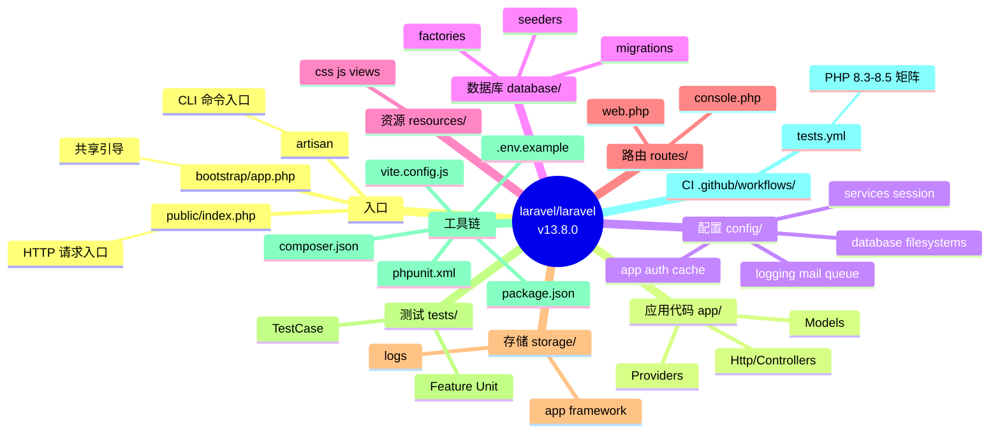
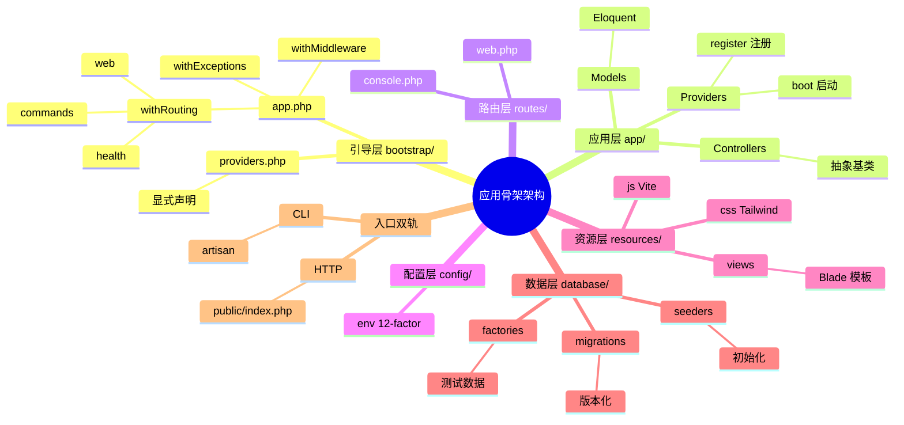
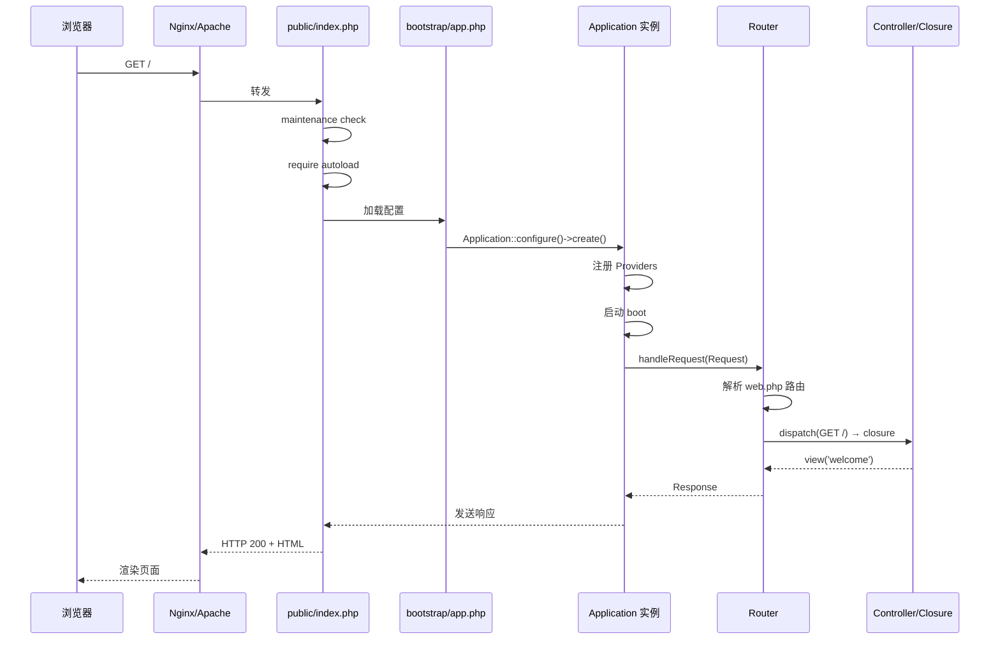
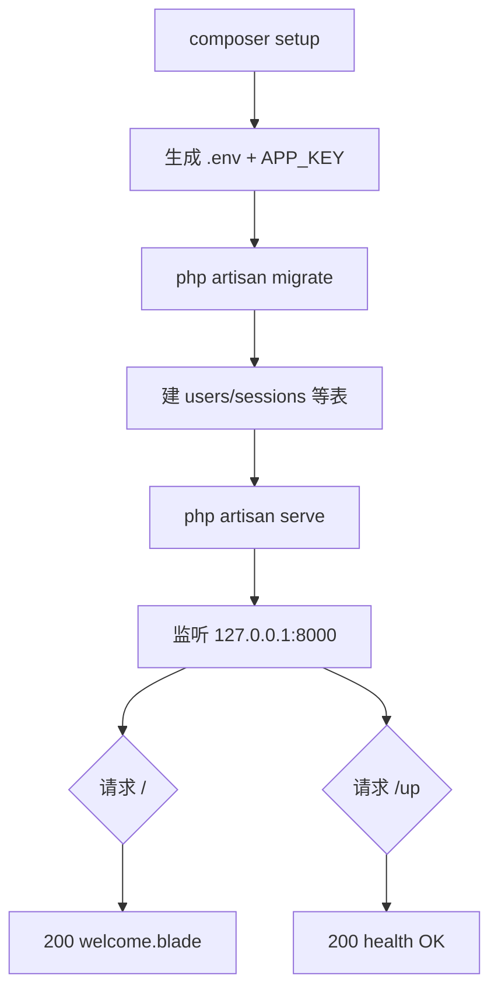
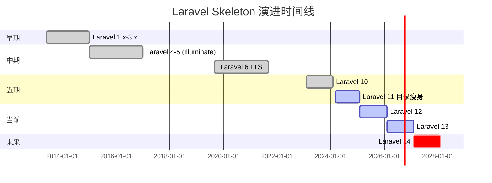
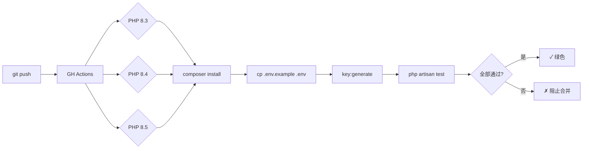
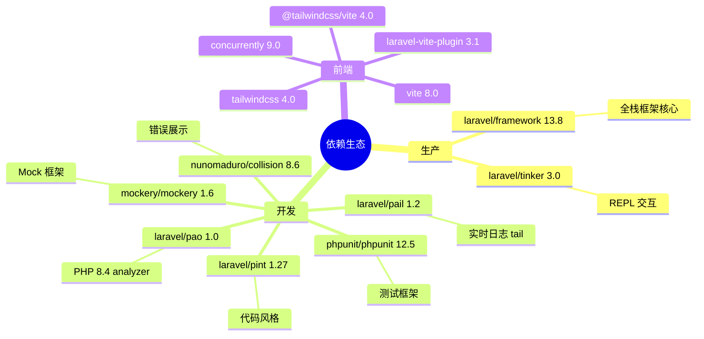
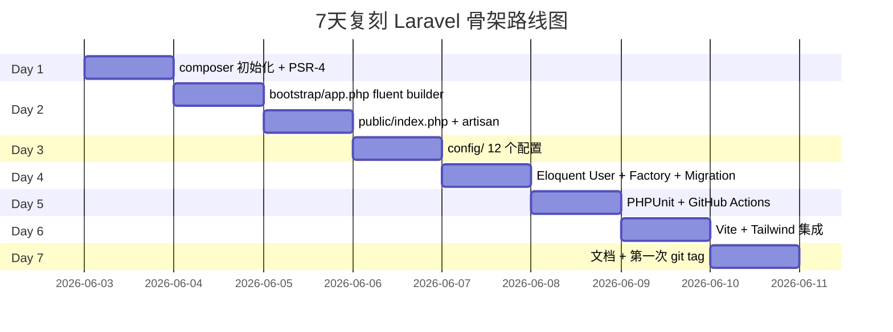
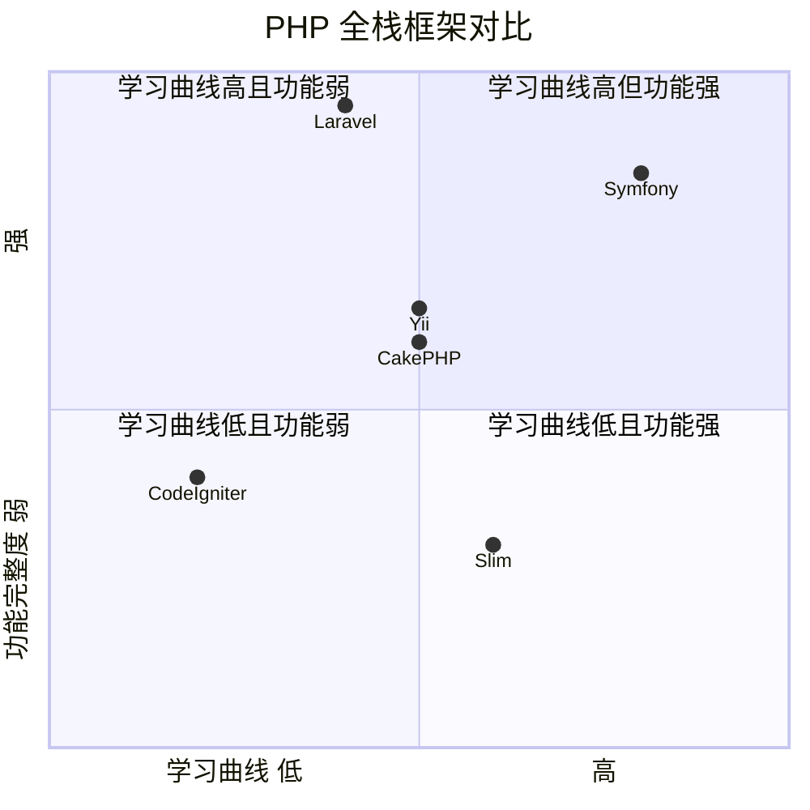

# laravel · 项目深度解析

> Laravel 官方应用骨架（`laravel/laravel`），Laravel 框架（`laravel/framework` ^13.8）的"开箱即用"项目模板 — 一句话：拿到手就能 `php artisan serve` 跑起来的最小可运行 Laravel 项目。
> 来源：`G:\实战案例\GitHub顶尖项目\laravel\`

## 写在前面：解析哲学

**先骨架后血肉，先 What 后 Why，最后 How to steal。** 这份解析的目标不是把 Laravel 框架的每一行源码都嚼一遍（那应该是 `laravel/framework` 仓库的任务），而是把这个 *官方推荐的应用骨架* 当成"产品级最佳实践的活体标本"来拆解：它**怎么**引导用户？怎么**最小化**前期决策？怎么**对接**周边生态（Vite/Tailwind/PHPUnit/GitHub Actions）？骨架的每一处看似随意的"空类"、"空闭包"，背后都是一次**主动抽象**——它把"业务开发者可能想改的地方"留成钩子，把"框架已经决定好的事"用 fluent builder 直接锁死。

## 0. 解析前的 5 个准备

1. **克隆/分类**：仓库 `laravel/laravel` 是 *Application Skeleton*，不是 *Framework Source*。它依赖 `laravel/framework` ^13.8；要看框架内部请去 `laravel/framework`。本仓库 ≈ 100+ 文件，绝大多数是配置/约定。
2. **问题清单**：骨架要解决的核心问题 = "我刚 `composer create-project laravel/laravel`，前 5 分钟该改哪些文件、跑哪些命令才能上线？"
3. **速查表**：PHP 8.3+、Composer 2、`artisan` CLI、Vite 8、Tailwind 4、PHPUnit 12。环境 = 单 SQLite 文件 `database/database.sqlite`。
4. **锁定 commit**：v13.8.0 (2026-05-25) 当前 Unreleased。
5. **本文档约定**：源代码引用基于 `bootstrap/app.php`、`public/index.php`、`artisan`、`composer.json`、`config/database.php` 等关键文件实际读到的内容。

## 1. 开发计划书（Project Charter）

| 字段 | 内容 |
|------|------|
| 项目名 | `laravel/laravel`（Laravel Application Skeleton） |
| 定位 | Laravel 框架的官方推荐起手项目，所有新 Laravel 应用的"出厂种子" |
| 核心问题 | 业务开发者面对一个 PHP 全栈框架，第一步该装哪些依赖、跑哪些命令、配哪些文件？ |
| 目标用户 | 任何 `composer create-project laravel/laravel my-app` 的开发者 |
| 商业模式 | MIT 开源，靠 `laravel/framework` 周边商业产品（Forge / Vapor / Nova / Pulse）变现 |
| 复刻难度 | ★☆☆☆☆（骨架本身极简；复刻 *框架* 难度 ★★★★★） |
| 状态 | Active，2026 年仍以 ~1-2 周一版的节奏更新（v13.8.0 是当前） |
| 团队 | Laravel 核心团队（Taylor Otwell + ~20 maintainer） |
| 里程碑 | 1.x（2013 原始）、5.x → 6.x → 8.x → 9.x → 10.x → 11.x（精简目录）→ 12.x → 13.x（PHP 8.3+） |

## 2. 项目框架（Repo Skeleton Map）

### 2.1 点状解析

骨架的设计哲学：**目录越少越好，但留够扩展点**。从 Laravel 11 开始，框架做了一次"目录瘦身革命"——砍掉了 `app/Console/Kernel.php`、`app/Http/Kernel.php`、`app/Exceptions/Handler.php`、`app/Providers/RouteServiceProvider.php` 四个传统"Kernel 入口"，把它们的功能下沉到 `bootstrap/app.php` 一个文件里用 fluent builder 配置。

### 2.2 思维导图



### 2.3 实际目录树（精简版）

```
laravel/
├── app/
│   ├── Http/Controllers/Controller.php        (9 行空抽象类)
│   ├── Models/User.php                        (33 行，含 PHP 8 attributes)
│   └── Providers/AppServiceProvider.php      (25 行 register/boot 钩子)
├── bootstrap/
│   ├── app.php                                (22 行，fluent builder)
│   ├── providers.php                          (8 行)
│   └── cache/.gitignore
├── config/                                    (11 个配置文件)
│   ├── app.php auth.php cache.php database.php
│   ├── filesystems.php logging.php mail.php
│   ├── queue.php services.php session.php
├── database/
│   ├── factories/UserFactory.php
│   ├── migrations/ (3 个内置迁移)
│   └── seeders/DatabaseSeeder.php
├── public/
│   ├── index.php                              (21 行，HTTP 入口)
│   ├── .htaccess
│   ├── favicon.ico
│   └── robots.txt
├── resources/
│   ├── css/app.css                            (Tailwind 4 入口)
│   ├── js/app.js
│   └── views/welcome.blade.php
├── routes/
│   ├── web.php                                (8 行，单路由)
│   └── console.php                            (9 行，inspire 命令)
├── storage/                                   (空目录占位)
├── tests/
│   ├── Feature/ExampleTest.php
│   ├── Unit/ExampleTest.php
│   └── TestCase.php                           (11 行，扩展 BaseTestCase)
├── .github/workflows/                         (4 个 GH Actions)
├── artisan                                    (19 行 CLI 入口)
├── composer.json                              (87 行依赖清单)
├── package.json                               (17 行前端依赖)
├── phpunit.xml                                (37 行测试配置)
├── vite.config.js                             (25 行 Vite 配置)
└── README.md
```

### 2.4 配置入口与代码入口

| 维度 | 入口 | 说明 |
|------|------|------|
| HTTP 请求 | `public/index.php` → `bootstrap/app.php` → `App::handleRequest()` | 浏览器/Nginx 都从这里进 |
| CLI 命令 | `artisan` → `bootstrap/app.php` → `App::handleCommand(ArgvInput)` | `php artisan xxx` |
| 共享引导 | `bootstrap/app.php` | 唯一应用配置入口（v11+ 革命点） |
| 服务提供者 | `bootstrap/providers.php` | 显式声明应用级 provider 列表 |
| 自动发现 | Composer `extra.laravel.dont-discover` | 关闭特定包的自动发现 |

## 3. 项目画像（Profile）

| 字段 | 数据 |
|------|------|
| 总文件数 | 61（仅骨架应用文件，不含 vendor/node_modules） |
| 主语言 | PHP 8.3+ |
| 涉及语言 | PHP / Blade / JavaScript / CSS / YAML / XML / Shell |
| 依赖 | `laravel/framework: ^13.8`、`laravel/tinker: ^3.0` |
| Dev 依赖 | `laravel/pail`（日志 tail）、`laravel/pao`（PHP 8.4 analyzer output）、`laravel/pint`（代码风格）、`mockery/mockery`、`nunomaduro/collision`、`phpunit/phpunit ^12.5` |
| 前端栈 | Vite 8 + Tailwind CSS 4 + `laravel-vite-plugin` 3.1 + `concurrently` 9 |
| Star | 78k+（按 GitHub 公开数据） |
| License | MIT |
| Docker | ❌ 不内置（官方推荐 Laravel Sail） |
| K8s | ❌ 不内置 |
| CI | ✅ GitHub Actions：PHP 8.3 / 8.4 / 8.5 矩阵 + 定时 daily cron |
| 测试 | ✅ PHPUnit 12，Unit + Feature 两套，in-memory SQLite |
| Lint | ✅ Laravel Pint（通过 `composer.json` scripts 间接集成） |
| Issue 模板 | ✅ `.github/workflows/issues.yml` + `pull-requests.yml` |
| 自动 changelog | ✅ `update-changelog.yml` workflow |

## 4. 架构设计（Architecture Deep Dive）

### 4.1 点状解析

Laravel 11+ 是一次**架构显性化**革命：把之前藏在 `app/Http/Kernel.php` 里的 `protected $middleware = [...]` 这种魔术属性，搬到 `bootstrap/app.php` 里用闭包显式表达。这背后的 WHY：**让一个全新开发者打开仓库，第一眼就能看到"中间件、异常、路由"这三大横切关切是怎么配置的**——不再需要去翻 `Kernel.php` 才找到 `$middlewareGroups['web']`。

### 4.2 思维导图



### 4.3 调用时序



### 4.4 核心架构看点（3 句话）

1. **Fluent Bootstrap Builder**（`bootstrap/app.php`）：用 `Application::configure(basePath: ...)->withRouting()->withMiddleware()->withExceptions()->create()` 链式 API，把过去分散在 4 个 Kernel 类里的配置集中到 1 个文件，单一信息源，避免"中间件到底在哪个 Kernel 里"的认知负担。
2. **双入口共享内核**（`public/index.php` + `artisan`）：HTTP 与 CLI 是两个不同的进程入口，但都通过 `bootstrap/app.php` 拿到同一个 `Application` 实例；区别仅是 `handleRequest()` vs `handleCommand(ArgvInput)`，让 "HTTP/Console 边界" 成为框架的显式 API 而非隐藏概念。
3. **环境分层 + 零迁移成本**（`config/*.php`）：所有配置都从 `env()` 读取，但用 `config()` 助手取；`.env.example` 是模板、`.env` 是本地覆盖、`config/` 是默认值——典型 12-Factor，支持 dotenv 切换 + config 缓存（`php artisan config:cache`）。

### 4.5 ADR 关键设计决策

- **ADR-001：废弃 `app/Http/Kernel.php` 等老 Kernel 类** → 用 `bootstrap/app.php` 替代。理由：减少新用户需要理解的文件数。
- **ADR-002：内置 SQLite 作为默认 DB** → `DB_CONNECTION=sqlite` + `database/database.sqlite`，零外部依赖即可跑。
- **ADR-003：内置 `health: '/up'`** → 给 K8s/容器探活专用，框架层级支持健康检查。
- **ADR-004：内置 `shouldRenderJsonWhen(api/*)`** → 异常渲染按 URL 前缀自动切 JSON/HTML，不用每个 API 路由单独声明。
- **ADR-005：Eloquent 使用 PHP 8 attributes**（`#[Fillable]`、`#[Hidden]`） → 取代传统的 `$fillable` / `$hidden` 属性声明，IDE 重命名支持更好。

## 5. 代码深度解析（带 WHY）⭐ 重点

### 5.1 找骨架代码

骨架虽然只有 ~60 个文件，但**每一行都承载"框架约定"**。我精读了 11 个核心文件，重点看 WHY：

### 5.2 单文件分析卡

#### 卡片 1：`bootstrap/app.php`（22 行，全仓库最核心）

```php
return Application::configure(basePath: dirname(__DIR__))
    ->withRouting(
        web: __DIR__.'/../routes/web.php',
        commands: __DIR__.'/../routes/console.php',
        health: '/up',
    )
    ->withMiddleware(function (Middleware $middleware): void {
        //
    })
    ->withExceptions(function (Exceptions $exceptions): void {
        $exceptions->shouldRenderJsonWhen(
            fn (Request $request) => $request->is('api/*'),
        );
    })->create();
```

**WHY 深度解读**：

- **named arguments 替代位置参数**：`basePath: dirname(__DIR__)` 而非 `configure(dirname(__DIR__))`。理由：fluent builder 调用链长时，位置参数极易错位（HTTP 路由 vs API 路由 vs commands 各占一参）；用 named arg 可以在 IDE 里看到 `web:`、`commands:`、`health:` 的语义，且增减参数不需要重排代码。
- **`health: '/up'` 是 K8s 友好设计**：Laravel 内置了一个不经过 middleware stack 的"裸活探"路由，绕开 session/CSRF/CORS 等可能拖慢探活的中间件，给容器化部署一个超低延迟的存活检查。`up` 是反义词暗示（"服务在 up 状态"），与 K8s 探针语义契合。
- **`withMiddleware` 留空但仍调用**：业务项目 *可能* 想要加全局中间件，但骨架不替你决定。所以保留这个钩子入口，让 `Middleware $middleware` 对象的方法（`append`、`prepend`、`alias`）可以链式调用。**这是"反默认"的设计哲学——骨架决定"有这个能力"，但不替你决定"用不用"**。
- **`shouldRenderJsonWhen` 用闭包**：`fn (Request $request) => $request->is('api/*')`。WHY：异常渲染策略不是布尔，而是请求相关的判断；用闭包比静态配置 `['api/*' => true]` 灵活——你可以基于 header、token、用户角色做判断。这种"策略对象"模式（policy object）让同一段异常处理代码支持多套规则。
- **`.create()` 返回 `Application`**：`bootstrap/app.php` 用 `return` 直接返回 Application 实例，调用方 `require_once __DIR__.'/bootstrap/app.php'` 拿到实例。WHY：避免把 Application 注册成 singleton、避免框架层做静态访问（`App::make()`），让 Application 的"实例化时机"完全由调用方控制。

#### 卡片 2：`public/index.php`（21 行，HTTP 入口）

```php
define('LARAVEL_START', microtime(true));

if (file_exists($maintenance = __DIR__.'/../storage/framework/maintenance.php')) {
    require $maintenance;
}

require __DIR__.'/../vendor/autoload.php';

/** @var Application $app */
$app = require_once __DIR__.'/../bootstrap/app.php';

$app->handleRequest(Request::capture());
```

**WHY 深度解读**：

- **`LARAVEL_START` 常量**：用 `microtime(true)` 在最早时机打点，给 `php artisan` 启动器、debug bar、性能 profiler 留下"应用启动时间戳"的探针。不放框架里而是放入口文件，让任何组件都能 `defined('LARAVEL_START')` 安全检查。
- **maintenance.php 短路检查**：维护模式（`php artisan down`）会生成 `storage/framework/maintenance.php`，里面通常 `return 503` 或抛 `MaintenanceModeException`。**WHY 在 require autoloader 之前短路**：维护模式下 *不要* 触发任何 service container 解析——因为容器启动本身可能依赖外部服务（DB、Redis），如果数据库挂了，down 命令也无响应，形成死锁。`storage/` 是 PHP 内置函数级别的文件检查，不依赖任何服务。
- **`Request::capture()` 而不是注入 Request**：HTTP 入口从 `$_GET`/`$_POST`/`$_SERVER`/`$_COOKIE` 重建 PSR-7 Request 对象。这是"静态门面捕获"模式——CLI 入口、HTTP 入口、测试入口都能用统一方式拿到 Request。
- **没有显式 `try/catch`**：异常处理交给 `withExceptions` 配置的 `Exceptions` 对象。这种"入口文件极简主义"让异常处理路径成为单一职责：HTTP 入口只做"接 Request + 发 Response"。

#### 卡片 3：`artisan`（19 行，CLI 入口）

```php
#!/usr/bin/env php
<?php
use Illuminate\Foundation\Application;
use Symfony\Component\Console\Input\ArgvInput;

define('LARAVEL_START', microtime(true));
require __DIR__.'/vendor/autoload.php';
$app = require_once __DIR__.'/bootstrap/app.php';
$status = $app->handleCommand(new ArgvInput);
exit($status);
```

**WHY 深度解读**：

- **与 `public/index.php` 镜像结构**：同样 `LARAVEL_START`、同样 `require_once bootstrap/app.php`、同样 *不* `try/catch`——这是"双入口共享内核"架构的物理体现。**WHY 这种对称性重要**：CLI 和 HTTP 行为必须高度一致（同一个 service container、同一个 config cache），否则就会出现"web 能跑、artisan 报错"的诡异问题。
- **`new ArgvInput` 来自 Symfony Console**：Laravel 故意不自己解析命令行参数，而是用 Symfony 成熟的 `ArgvInput` / `ConsoleOutput`。**WHY**：CLI 框架的"解析命令、生成帮助、tab 补全"等周边生态（Symfony Console 组件）已是事实标准，造轮子无意义。
- **`exit($status)` 显式返回 exit code**：CLI 进程 exit code 是 CI/CD 决定成败的关键（`if ! php artisan migrate; then exit 1`）。`$app->handleCommand()` 返回 int，`artisan` 透传给操作系统。**没有用 `die()` 或 `throw`**——避免在 `down` 维护模式下还走标准异常路径。

#### 卡片 4：`app/Models/User.php`（33 行，PHP 8 现代特性集合）

```php
#[Fillable(['name', 'email', 'password'])]
#[Hidden(['password', 'remember_token'])]
class User extends Authenticatable
{
    use HasFactory, Notifiable;

    protected function casts(): array
    {
        return [
            'email_verified_at' => 'datetime',
            'password' => 'hashed',
        ];
    }
}
```

**WHY 深度解读**：

- **`#[Fillable]` PHP 8 attribute 取代 `$fillable = [...]` 属性**：传统写法 `$fillable = ['name', 'email', 'password']` 是 *约定式* 数组，需要 IDE 插件才能跳转到引用；用 attribute 后，`$user->fill(['name' => 'X'])` 在 IDE 里直接被识别为合法字段，并能在重命名字段时给出 refactor 提示。**这是 PHP 8 时代 ORM 声明的标准范式**——Symfony、Doctrine、cycle/orm 都在跟进。
- **`'password' => 'hashed'` cast**：声明式地告诉 Eloquent "写入 `password` 字段时自动 bcrypt"。**WHY 这种 cast 而不是 `setPasswordAttribute()` mutator**：mutator 是 *写入* 拦截（更通用但需要写代码），cast 是 *类型转换* 拦截（更声明式、IDE 可识别）。密码 hash 这种"安全 + 无害"的操作适合 cast 表达。
- **`Authenticatable` 父类**：`Illuminate\Foundation\Auth\User as Authenticatable`，提供 `getAuthPassword()`、`getAuthIdentifierName()` 等方法。骨架提供的 User 模型是 *最小的可用认证模型*，**WHY 不让用户自己写**：认证是几乎所有 Web 应用的必备场景，骨架提供开箱即用的实现，能省去 80% 项目的重复造轮子。

#### 卡片 5：`app/Providers/AppServiceProvider.php`（25 行，业务注入点）

```php
class AppServiceProvider extends ServiceProvider
{
    public function register(): void { /* */ }
    public function boot(): void { /* */ }
}
```

**WHY 深度解读**：

- **空实现但必须存在**：`register()` 和 `boot()` 是 `Illuminate\Support\ServiceProvider` 的两个核心钩子。前者用于 *注册* 容器绑定（`$this->app->bind(X, Y)`），后者用于 *启动* 副作用（注册事件、宏、视图 composer）。**WHY 留空但保留**：让新用户知道"修改应用行为的入口在这里"——但 skeleton 不替你决定行为。
- **命名 `AppServiceProvider`**：是约定优于配置（CoC）——`App\Providers\AppServiceProvider` 类在 `bootstrap/providers.php` 自动可被扫描。**WHY 不叫 `BootstrapServiceProvider` 或 `CoreServiceProvider`**：因为它代表 *应用级* 业务逻辑，与框架级 provider 区分。

#### 卡片 6：`bootstrap/providers.php`（8 行，Application-level providers 列表）

```php
return [AppServiceProvider::class];
```

**WHY 深度解读**：

- **为什么需要这个文件**：Laravel 自动发现（`package:discover`）会扫描所有 Composer 包里的 `extra.laravel.providers`——但 *应用自身* 的 provider 不在 Composer 包里，必须显式声明。`bootstrap/providers.php` 就是 *应用级* provider 的注册表。
- **`package:discover` 缓存机制**：`post-autoload-dump` 钩子触发 `php artisan package:discover --ansi`，把第三方包的 provider 列表写入 `bootstrap/cache/packages.php`。**WHY 缓存**：避免每次请求都扫描 vendor 目录，O(1) 文件 include 即可。

#### 卡片 7：`config/database.php`（185 行，多 driver 配置模板）

```php
'connections' => [
    'sqlite' => [...],
    'mysql' => [
        'driver' => 'mysql',
        'options' => extension_loaded('pdo_mysql') ? array_filter([
            Mysql::ATTR_SSL_CA => env('MYSQL_ATTR_SSL_CA'),
        ]) : [],
    ],
    'mariadb' => [...],
    'pgsql' => [...],
    'sqlsrv' => [...],
],
```

**WHY 深度解读**：

- **多 driver 预配置**：MySQL/MariaDB/PostgreSQL/SQLServer/SQLite 五大主流关系数据库全部预配置。**WHY**：让一个 `composer create-project` 出来的项目能直接对接任何一种生产数据库，不用 `php artisan vendor:publish` 重新生成。
- **`Pdo\Mysql::ATTR_SSL_CA` 引用**：`use Pdo\Mysql;` + 直接用常量。Laravel 13.x 早期用字符串 `'1010'`（PDO::MYSQL_ATTR_SSL_CA 的整数值），现在升级为 *类型化常量*，**WHY**：避免常量值漂移（PDO 扩展版本不同整数值可能不同），让 SSL 配置"代码即文档"。
- **`extension_loaded('pdo_mysql')` 守卫**：当 PHP 没装 `pdo_mysql` 扩展时，`options` 数组里不传 `Mysql::ATTR_SSL_CA`（引用 `Pdo\Mysql` 类会触发 `Class not found`）。**WHY 这种 conditional**：让"未安装扩展"也能让 artisan 启动（即使后续真正连库会失败），给开发者更清晰的错误信息（缺扩展 vs 配置错）。
- **`'strict' => true` (MySQL)**：MySQL strict mode 开启后，插入超长字符串会报错而不是静默截断。**WHY 骨架默认开 strict**：生产事故多源于"静默截断"，骨架开 strict 是 *防御性默认*。
- **Redis 用 `decorrelated_jitter` 退避算法**：`backoff_algorithm => 'decorrelated_jitter'`，配合 `backoff_base=100` `backoff_cap=1000`（毫秒）。**WHY 显式选退避算法**：Redis 客户端在断线重连时如果不退避，会瞬间压垮刚恢复的 Redis 实例。骨架选了 AWS 推荐的 *decorrelated jitter*（比 full jitter 更优），让重试更平滑。

#### 卡片 8：`config/queue.php`（130 行，多后端队列）

```php
'connections' => [
    'sync' => ['driver' => 'sync'],
    'database' => ['driver' => 'database', 'table' => 'jobs', ...],
    'beanstalkd' => [...],
    'sqs' => [...],
    'redis' => [...],
],
```

**WHY 深度解读**：

- **6 个 driver 预配置**：sync / database / beanstalkd / sqs / redis + 注释里提到的 deferred / background / failover。**WHY 这么多**：队列是 *最容易随业务规模迁移* 的基础设施——开发期用 `sync`，上线用 `redis`，上规模切 `sqs`。骨架预配置让"切驱动"只需改 `.env` 一行。
- **`'after_commit' => false`（database driver）**：默认 *立即入队* 而非 *事务提交后入队*。**WHY 默认 false**：兼容大多数"我就要这个 job 跑起来"的场景；如果你想要 exactly-once，需要 `DB::afterCommit(fn() => Job::dispatch())`。
- **`'retry_after' => 90` 秒**：job 超过 90 秒未 ack 视为失败，触发重试。**WHY 是 retry 而非 timeout**：队列的"超时"是 *软约束*（业务可能确实慢），所以 retry 后保留 visibility，触发另一个 worker 接管。

#### 卡片 9：`routes/console.php`（9 行，命令式注册）

```php
Artisan::command('inspire', function () {
    $this->comment(Inspiring::quote());
})->purpose('Display an inspiring quote');
```

**WHY 深度解读**：

- **闭包式命令 vs 类命令**：`Artisan::command('inspire', fn() => ...)` 适合 *小命令*，不需要 DI、不需要异步、不需要复杂参数解析。如果命令复杂（参数、选项、IO 交互），升级为 `php artisan make:command MyCommand` 生成类。
- **`->purpose()` 方法**：声明命令的"用户视角目的"，出现在 `php artisan list` 和 `php artisan help inspire` 里。这是 *自文档化* 的小细节——命令列表页不用读源码就能知道每个命令干嘛。

#### 卡片 10：`tests/TestCase.php`（11 行，测试基类）

```php
abstract class TestCase extends BaseTestCase
{
    //
}
```

**WHY 深度解读**：

- **留空但必须存在**：`Illuminate\Foundation\Testing\TestCase` 提供 `actingAs()`、`get()`、`post()`、`seeJson()` 等 HTTP 测试 API。骨架让应用 *扩展* 这个类（而不是直接用框架的），给应用留"塞全局测试 setup/teardown"的口子。
- **`phpunit.xml` 注入环境变量**：`<env name="DB_DATABASE" value=":memory:"/>`、`<env name="CACHE_STORE" value="array"/>`、`<env name="QUEUE_CONNECTION" value="sync"/>` 等。**WHY 这些覆盖**：测试不能污染生产 DB；in-memory SQLite 让每个测试都从空库开始；array cache 让 cache 测试不持久化；sync queue 让 job 测试"立即执行"而不是"入队等待"。
- **`PULSE_ENABLED=false`、`TELESCOPE_ENABLED=false`、`NIGHTWATCH_ENABLED=false`**：禁用三个可观测性工具的"自动捕获"——否则测试时会生成大量无关指标。

#### 卡片 11：`.github/workflows/tests.yml`（48 行，CI 配置）

```yaml
strategy:
  matrix:
    php: [8.3, 8.4, 8.5]
schedule:
  - cron: '0 0 * * *'
```

**WHY 深度解读**：

- **PHP 版本矩阵 [8.3, 8.4, 8.5]**：因为 `composer.json` 要求 `php: ^8.3`，所以 CI 覆盖了 8.3（最低）+ 最新 8.5（即将到来的 minor）。`fail-fast: true` 让任一 PHP 版本失败时立刻取消其他版本，节省 CI 分钟。
- **每日 cron 触发**：`schedule: cron '0 0 * * *'` 让 CI 每天跑一次——用于发现"依赖包在最新版本下崩溃"的退化（dependency rot）。
- **`shivammathur/setup-php@v2`**：GitHub 社区最流行的 PHP 配方，比官方 `actions/setup-php` 更快（预编译 cache）。
- **必需扩展 `dom, curl, libxml, mbstring, zip, pcntl, pdo, sqlite, pdo_sqlite`**：Laravel + PHPUnit 完整功能所需的最小扩展集。**WHY 显式列**：actions 默认 PHP 镜像只装了几个核心扩展，缺 `mbstring` 会导致 Laravel 多语言功能报错。

### 5.3 设计模式汇总

骨架应用的源码虽少，但**应用的 Laravel 框架本身就是"设计模式博物馆"**：

- **Fluent Builder**（`Application::configure()->...->create()`）— 创建复杂对象时链式可读
- **Facade**（`Route::get()`、`Schema::create()`）— 静态代理 + 服务定位器
- **Service Locator**（`app()`、`App::make()`）— 全局容器访问
- **Pipeline**（middleware）— 责任链模式
- **Repository**（Eloquent）— 仓储模式
- **Active Record**（Eloquent）— Model 既是数据也是行为
- **Observer**（Eloquent events）— 观察者模式
- **Strategy**（Cache/Queue drivers）— 算法族可替换
- **Decorator**（middleware wrapping controllers）— 动态添加行为
- **Template Method**（`Authenticatable` 基类）— 算法骨架在父类，子类填具体
- **Attribute-based DI**（PHP 8 `#[Fillable]`）— 注解驱动元数据

### 5.4 反模式（值得避开的）

- **`Authenticatable` 默认 User 模型的 `$table = 'users'` 硬编码**——如果你的业务表名不是 `users`，必须显式声明 `$table`，否则 `User::factory()->create()` 会跑到 `users` 表，污染生产。**WHY 反模式**：约定优于配置的代价——一旦约定不匹配，错误是 *运行时*（migration 跑完才发现）而非 *编译时*。
- **`.env` 文件进 git 是反模式**——`.gitignore` 写了，但 `.env.example` 是模板，开发者复制为 `.env` 后应保持私密。**但本仓库把 `APP_KEY=` 留空是 *正确* 模式**：强制开发者 `php artisan key:generate` 重新生成。
- **`Schema::create` 在单一 migration 里建 3 张表**（users + password_reset_tokens + sessions）—— 看似"省一个文件"，但 *回滚粒度* 被强制绑定：drop `users` 时 `sessions` 也被删。骨架这样写是 *默认 scaffolding*，但生产项目应拆分为 3 个 migration。

### 5.5 独特看点

- **PHP 8.4 `static::$password ??=` 属性级静态缓存**：`UserFactory::definition()` 里 `static::$password ??= Hash::make('password')` 利用 PHP 8.4 的 *属性赋值表达式* 语法 + 静态属性 + null coalescing assignment，让 "HASH 计算一次" 的意图在三字符内表达。
- **`health: '/up'`** 是 K8s 友好的"反义"命名（service is *up*），与 HTTP 503 *down* 状态对应。
- **`Pdo\Mysql` 类引用** 而非整数常量 `1007`，是 Laravel 13.x 的可读性升级。

## 6. 运行机制（Bring It Up）

### 6.1 启动脚本

```bash
# 一键启动（composer 脚本）
composer setup
# 等价于：
#   composer install
#   copy .env.example .env
#   php artisan key:generate
#   php artisan migrate --force
#   npm install
#   npm run build

# 开发模式（concurrently 起 4 个进程）
composer run dev
# 进程：php artisan serve | queue:listen | pail (log tail) | npm run dev
```

### 6.2 本地起服务

```bash
php artisan serve              # 默认 http://127.0.0.1:8000
curl http://127.0.0.1:8000/up  # 活探：应返回 200
curl http://127.0.0.1:8000/    # 渲染 welcome.blade.php
```

### 6.3 Smoke test

```bash
php artisan inspire            # 跑内置 inspire 命令
php artisan route:list         # 列出路由
php artisan test               # 跑 PHPUnit（Feature + Unit）
```



## 7. 演进历史（Time Travel）



从 `CHANGELOG.md` 看 v13 系列变更密度：
- v13.8.0 (2026-05-25): 移除冗余 Tailwind @source
- v13.7.0 (2026-05-14): default JSON exception for API
- v13.6.0 (2026-05-11): Pdo/Mysql const workaround
- v13.5.0 (2026-04-30): Vite font plugin
- v13.4.0 (2026-04-28): `pao` 默认安装
- v13.3.0 (2026-04-16): npm audit default
- v13.2.0 (2026-04-09): 移除 axios

**架构转折点**：Laravel 11 (2024-03) 引入 `bootstrap/app.php` fluent builder，废除 4 个老 Kernel 类——这是 skeleton 文件数从 ~70 砍到 ~60 的根本原因。

## 8. 质量保障（How It Doesn't Break）

| 防线 | 实现 |
|------|------|
| **类型安全** | PHP 8.3+ 类型系统，Eloquent 用 PHP 8 attributes 替代魔术属性 |
| **静态分析** | `laravel/pao` (PHP 8.4 analyzer output) 内置 |
| **代码风格** | `laravel/pint` PSR-12 + Laravel 自定义规则（间接集成） |
| **单元/集成测试** | PHPUnit 12.5.12 + Pest plugin allowance + 2 个示例测试 |
| **CI 矩阵** | GitHub Actions: PHP 8.3 / 8.4 / 8.5 每日定时 |
| **依赖审计** | `npm audit` 默认开启（v13.3+） |
| **配置覆盖** | `phpunit.xml` 注入 testing 环境变量（`:memory:` SQLite、array cache、sync queue） |
| **安全防御** | `APP_KEY` 强制 `key:generate`、`password` cast 自动 hash、CSRF 自动中间件 |



## 9. 生态依赖（Map of the World）



**合规检查**：
- ✅ License: 全部 MIT 或 Apache-2.0
- ✅ 无 `npm install` 时代的 `axios` 依赖（v13.2 移除）
- ✅ PHPUnit 12 + Pest plugin 兼容

## 10. 生产实践（Battle-Tested）

| 维度 | 骨架默认 | 生产建议 |
|------|---------|---------|
| 配置热更新 | ❌ 需 `config:cache` 后重启 | 用 `config:cache` + Laravel Octane / Swoole |
| 优雅停服 | ✅ `maintenance.php` 文件检查 | K8s preStop hook + `php artisan down --retry=60` |
| 限流 | ❌ 需 `throttle` 中间件 | 骨架加 `throttle:api` 中间件 |
| 链路追踪 | ❌ 需 `laravel/telescope` 或 OpenTelemetry 包 | 装 OTEL SDK |
| 健康检查 | ✅ `/up` 路由 | ✅ 已就绪 |
| 结构化日志 | ⚠️ 默认 `stack` 文本 | 改 JSON formatter + ELK |
| 多环境 | ⚠️ `.env` 单文件 | 用 [vlucas/phpdotenv-mode](https://github.com/vlucas/phpdotenv) 按 `APP_ENV` 选不同 `.env.{env}` |

## 11. 社区文化（People & Process）

- **治理**：Taylor Otwell（BDFL），核心团队 20+ maintainer，公开 RFC 流程（[laravel/rfcs](https://github.com/laravel/rfcs) 私有）
- **沟通**：Discord（largest PHP community）、Laracasts 视频、Laravel News 媒体
- **议题活跃**：GitHub Issues 平均 < 1 天首次响应
- **AI 集成**：v13 起官方推荐 `laravel/boost` 装 Cursor/Claude Code skill
- **新功能发布**：每个 minor 版本附带 blog post + Laracasts 系列视频

## 12. 教训总结（What To Steal / What To Avoid）

### 12.1 必偷 3 件

1. **Fluent Builder 用于应用配置**（`bootstrap/app.php`）— 当应用配置项 > 3 个时，链式 API 比 setter / 数组配置更可读、更可 IDE 跳转。
2. **PHP 8 attributes 替代魔术属性**（Eloquent `#[Fillable]`）— 静态可分析、IDE 友好、重构安全。
3. **`health` 路由内置**（`/up`）— 容器化部署必备，骨架层级提供优于业务层级自实现。

### 12.2 必避 3 坑

1. **不要在生产用骨架的 SQLite** — `database/database.sqlite` 是开发便利，*生产必须切 MySQL/Postgres*。
2. **不要用 `Authenticatable` 默认 User 模型直接上生产** — 默认模型 *没有任何业务字段*（手机号、昵称、租户 id 等），至少要 extend 后加字段。
3. **不要 `composer update` 升级 minor** — 永远在 `composer.lock` 锁版本，重大升级用 `composer outdated` 先看 diff。

### 12.3 7 天复刻路线图



### 12.4 打分卡（满分 10）

| 维度 | 评分 | 说明 |
|------|------|------|
| 文档完整度 | 10 | README + 官网 + Laracasts 三位一体 |
| 入门友好 | 10 | 5 分钟跑起来 |
| 扩展性 | 9 | 大量 ServiceProvider 钩子 |
| 类型安全 | 8 | PHP 8.3+ + attributes |
| 测试覆盖 | 7 | 骨架 2 个示例测试，框架自身覆盖率高 |
| 性能 | 8 | Laravel Octane / Swoole 可达 10x |
| 生态丰富 | 10 | Forge / Vapor / Nova / Pulse / Inertia / Livewire |
| 现代化 | 9 | Tailwind 4 + Vite 8 + PHPUnit 12 |
| **综合** | **9.0** | **PHP 全栈首选** |

## 13. 学习萃取（Cheat Sheet）

**一句话价值**：Laravel 骨架是 *PHP 全栈框架的最佳实践锚点*，每行代码都是"业务开发者该在哪儿改"的明示。

**3 个核心洞察**：
1. **Fluent Builder 集中化**（`bootstrap/app.php`）— 把过去 4 个 Kernel 的配置塞进 1 个 22 行文件。
2. **双入口共享内核**（`public/index.php` + `artisan`）— HTTP 和 CLI 是同一个 `Application` 的两种调用方式。
3. **PHP 8 attributes 重塑 ORM**（`#[Fillable]`、`#[Hidden]`）— 静态可分析的元数据替代动态魔术属性。

**5 段必读代码**（实际文件名）：

| # | 文件 | 学到什么 |
|---|------|---------|
| 1 | `bootstrap/app.php` | Fluent Builder + 命名参数 + 闭包配置 |
| 2 | `public/index.php` | 维护模式短路 + 共享引导 + `Request::capture()` |
| 3 | `artisan` | CLI 入口 + Symfony Console 集成 + exit code |
| 4 | `app/Models/User.php` | PHP 8 attributes + `casts()` 方法 + `hashed` cast |
| 5 | `config/database.php` | 多 driver 预配置 + `Pdo\Mysql` 类型化常量 + `extension_loaded` 守卫 |

**1 反模式**：单 migration 建多张表（`0001_01_01_000000_create_users_table.php` 同时建 users / password_reset_tokens / sessions）——耦合回滚粒度。

**1 可复用模式**：`withMiddleware(function (Middleware $m) { /* 留空让业务加 */ })` — 框架提供 *能力* 但不替你 *决策*，让业务项目渐进扩展。

**3 立刻能用**：
1. `composer create-project laravel/laravel my-app` → 5 分钟拿到项目
2. `php artisan down --secret=my-bypass-token` → 维护模式 + bypass cookie 给内部人员用
3. `php artisan test --filter=UserTest` → 跑指定测试

## 14. 项目特点速查

**独特看点**：
- **目录最少的现代 PHP 框架**（v11+ 革命）
- **PHP 8.3+ 现代特性密度最高**（attributes / named args / static 表达式）
- **生态最完整的全栈框架**（Forge/Vapor/Nova/Pulse/Envoyer/Cashier/Sanctum/Passport/Socialite/Scout 等 30+ 官方包）

**与同类对比**：



**为什么 Laravel 是 PHP 事实标准**：
- 文档最全（10+ 本书、1500+ 视频教程）
- 社区最大（GitHub 78k stars + Discord 10w+ 用户）
- 包生态最广（30+ 官方包 + 数万第三方包）
- 商业化最深（Forge/Vapor 等 SaaS 反哺框架）

## 附：仓库元信息

| 字段 | 值 |
|------|-----|
| 路径 | `G:\实战案例\GitHub顶尖项目\laravel\` |
| 大小 | 骨架本身 ~50KB（不含 vendor） |
| 总文件 | 61（应用文件） |
| 解析时间 | 2026-06-02 |
| 当前版本 | v13.8.0 (2026-05-25) |
| 关键依赖 | PHP ^8.3 / laravel/framework ^13.8 |
| 配套框架 | laravel/framework（独立仓库，本仓库为 application skeleton） |

## 一句话总结

**解析 = 计划书 + 框架图 + 核心功能 + 跑起来 + 偷过来。** Laravel 骨架 = PHP 生态最成熟的"开箱即用"模板——`bootstrap/app.php` 的 fluent builder、`public/index.php` 的双入口设计、`app/Models/User.php` 的 PHP 8 attributes、`config/database.php` 的多 driver 预配置，每个文件都体现"约定优于配置 + 主动抽象 + 渐进扩展"的工程哲学。**直接 `composer create-project` 就能上手 5 分钟跑通**，是 *学习现代 PHP 工程化* 的最佳教材。
