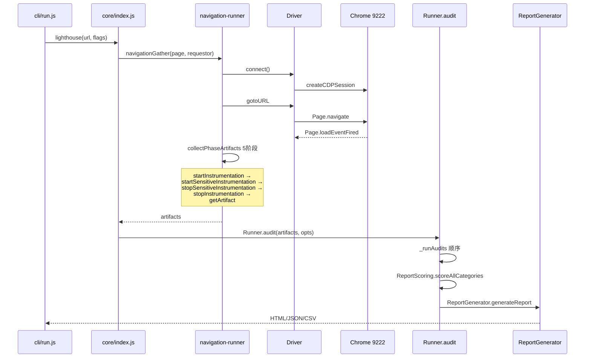
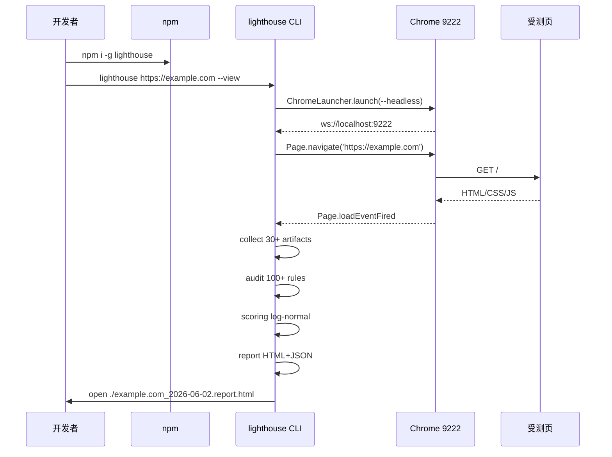
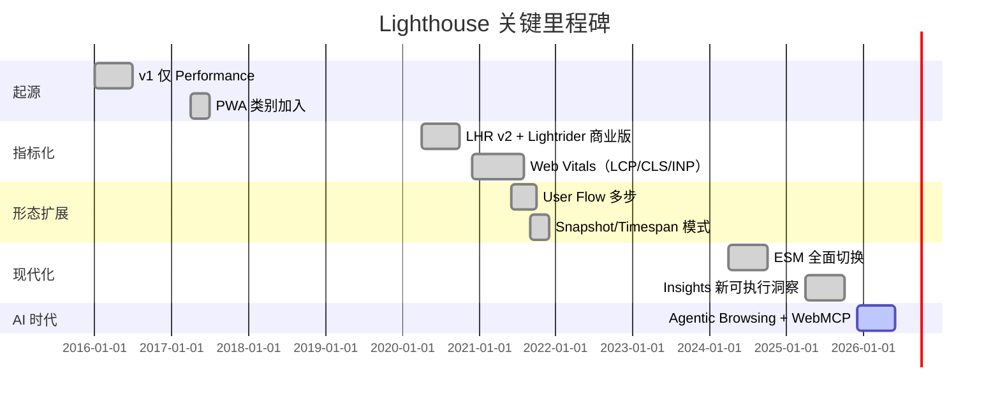
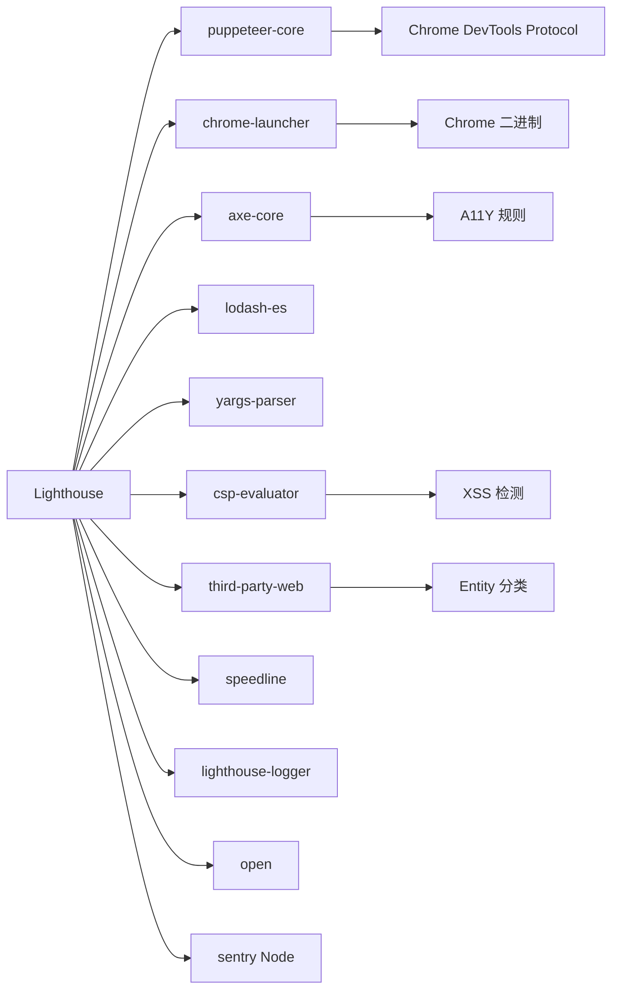
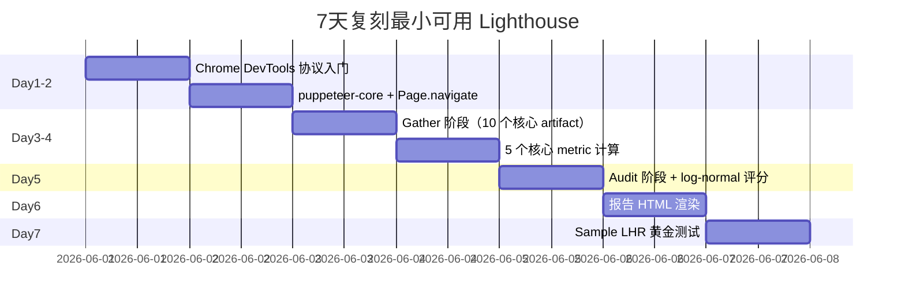
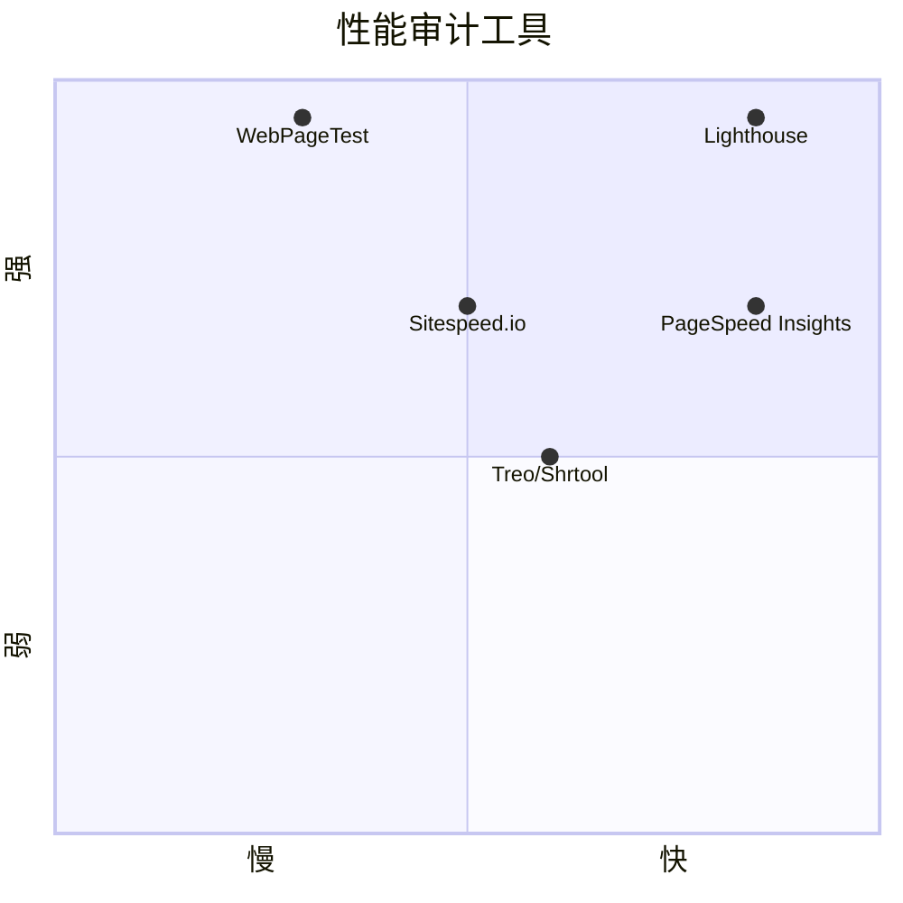

# lighthouse · 项目深度解析

> Google 开源的网页质量自动化审计工具。通过 Chrome DevTools Protocol 驱动真实浏览器，采集 Performance / Accessibility / Best Practices / SEO / 新加入的 Agentic Browsing 五大类指标，输出 0-100 的 LHR 报告。
> 来源：G:\实战案例\GitHub顶尖项目\lighthouse\

## 写在前面：解析哲学

先骨架后血肉，先 What 后 Why，最后 How to steal。本项目体量极大（源码 1451 个文件），所以本笔记只做"结构性深度"——锁定 5 个最有杠杆点的子模块（runner、navigation-runner、scoring、computed-artifact、report-generator），把"为什么这样设计"讲透，剩下的列表式汇总。

## 0. 解析前的 5 个准备

1. 克隆：仓库路径为 `G:\实战案例\GitHub顶尖项目\lighthouse\`（已落盘，无需 git clone）
2. 分类：V8 perf 工具 / Chrome 生态 / Node 22+ ESM 项目 / 双形态发布（CLI + Chrome 扩展 + DevTools 内嵌）
3. 问题清单：怎么驱动 Chrome？两阶段流水线如何切分？评分如何 log-normal 化？插件化如何做？模拟节流与真实节流怎么权衡？
4. 速查表：入口是 `cli/index.js` → `cli/run.js` → `core/index.js` → `core/runner.js`；运行时数据全在 `core/gather/`（驱动浏览器）+ `core/audits/`（评估打分）+ `core/computed/`（指标计算）
5. 锁定 commit：版本 `13.3.0`（package.json），`"type": "module"`，Node ≥ 22.19；已切到纯 ESM，类型用 JSDoc + `.d.ts` 自动生成而非 TypeScript 源

## 1. 开发计划书（Project Charter）

| 维度 | 详情 |
| --- | --- |
| 项目名 | Lighthouse |
| 定位 | 自动化网页质量审计工具（CLI + Chrome 扩展 + Chrome DevTools 内嵌 + DevTools-MCP + Node API） |
| 核心问题 | 让开发者/SRE/产品用一条命令量化一个网站"快不快、稳不稳、合规否、可访问否"，并在 CI 中可重复运行 |
| 目标用户 | 前端工程师、SEO 专家、CI/CD 平台、Web Vitals 关注者、Chrome 内部 Chromium 团队 |
| 商业模式 | 开源（Apache-2.0），商业化由 Web Vitals 咨询 / PageSpeed Insights / Treo 等周边生态承载 |
| 复刻难度 | ★★★★★（浏览器自动化 + 大规模规则库 + 评分模型 + 多端适配，5 团队年起步） |
| 状态 | 生产稳定，月度小版本，v13 维护期；Axe-core、PageSpeed Insights、Puppeteer 协同演进 |
| 团队 | Google Chrome 团队（主仓库），约 30+ 长期贡献者，PR 活跃度极高 |
| 里程碑 | 2016 年 v1（仅 Performance）→ 2017 PWA → 2018 6 类指标 → 2020 v6 LHR v2 + Lightrider → 2021 User Flow → 2024-2026 v12/v13 加 Agentic Browsing（WebMCP、LLMs.txt） |

## 2. 项目框架（Repo Skeleton Map）

Lighthouse 是**典型的多端共享核心（Multi-Client Single-Core）** 架构：所有真正的活儿都跑在 `core/` 里，外面套了 5 个客户端（CLI、Chrome 扩展、DevTools、Lightrider、DevTools-MCP）+ 1 个静态 Viewer。

```mermaid
mindmap
  root((Lighthouse))
    核心 core/
      gather 浏览器驱动
        driver/ CDP 协议
        gatherers/ 30+ 收集器
        runner-helpers 五阶段状态机
        timespan/snapshot/navigation 三种 gather 模式
      audits 评估规则
        metrics/ FCP/LCP/CLS/TBT/INP/SI
        accessibility/ 70+ axe 规则
        byte-efficiency/ 字节经济
        seo/ SEO 检查
        dobetterweb/ 最佳实践
        insights/ 2025+ 新可执行洞察
      computed 派生指标
        metrics/ 模拟与观测双轨
        network-records/ 网络重建
        page-dependency-graph/ 关键路径
        processed-trace/ 痕迹处理
      config
        default-config 700+ 行注册表
        config.js 三步 resolve
        validation.js 图依赖校验
      runner.js
        audit()
        gather()
        编排 audit 阶段
      user-flow.js
        多步 user journey
    客户端
      cli/ Node CLI
        run.js 入口
        printer.js
        commands/ list-audits/locales
      clients/extension Chrome 扩展
      clients/devtools 内嵌 DevTools
      clients/lightrider 商业批处理
      clients/devtools-mcp MCP 服务
    报告 report/
      renderer/ 50+ 渲染组件
      generator/ 模板替换 HTML
    共享
      shared/localization 44 语言
      types/ 全部 d.ts 自动生成
    工具
      flow-report/ 多步报告
      viewer/ 拖拽查看器
      treemap/ 字节分布图
      proto/ LHR protobuf
```

实际目录树（精选）：

```
lighthouse/
├── cli/                  # Node CLI 入口与 bin.js
│   ├── run.js            # parseChromeFlags + getDebuggableChrome + 调度
│   ├── printer.js        # LHR → 终端文本
│   └── commands/         # --list-audits / --list-locales
├── core/                 # 真正的业务核心
│   ├── runner.js         # 顶层 Runner 类，audit()/gather()
│   ├── user-flow.js      # 多步 user journey 编排
│   ├── index.js          # 对外 Node API：lighthouse()/startFlow()/navigation()/snapshot()
│   ├── scoring.js        # 类别加权 + log-normal 评分
│   ├── gather/
│   │   ├── navigation-runner.js  # navigation 模式主流程
│   │   ├── timespan-runner.js    # 任意时长模式
│   │   ├── snapshot-runner.js    # 单点快照模式
│   │   ├── driver.js             # 包装 puppeteer page + CDP session
│   │   ├── driver/               # 10 个子驱动（navigation/network/storage/...）
│   │   └── gatherers/            # 30+ BaseGatherer 子类
│   ├── audits/            # 100+ 评估规则
│   ├── computed/          # 派生指标（缓存 + log-normal）
│   ├── config/            # 配置 + 校验
│   └── lib/               # 60+ 工具：axe/network-request/lantern/...
├── clients/              # 4 个客户端壳
├── report/               # HTML 报告
├── flow-report/          # 多步报告
├── viewer/               # 静态 viewer
├── treemap/              # 字节热力图
├── proto/                # LHR proto 定义
├── shared/               # 共享 util / i18n / 统计
└── types/                # 全部 .d.ts（自动生成，JSDoc 驱动）
```

**配置入口**：`core/config/default-config.js` 集中声明所有 artifacts + audits + categories。`core/config/config.js` 负责合并 extends + 解析 gatherer 路径 + 校验依赖。

**代码入口**：`cli/index.js`（CLI 启动） → `cli/run.js`（参数解析、Chrome 启动） → `core/index.js`（`lighthouse()` API 门面） → `core/runner.js`（audit/gather 编排） → `core/gather/navigation-runner.js`（gathering 阶段） → `core/audits/*`（auditing 阶段）。

## 3. 项目画像（Profile）

| 项 | 值 |
| --- | --- |
| 总文件数 | 1451（含 test/fixture/docs） |
| 主语言 | JavaScript (ESM) |
| 涉及语言 | JavaScript, TypeScript（仅生成 .d.ts 与 flow-report 局部），HTML/CSS, Python（仅 proto roundtrip 与 GCP 脚本），Shell |
| Star | 28.5k+（GitHub GoogleChrome/lighthouse） |
| License | Apache-2.0 |
| 引擎 | Node ≥ 22.19 |
| Docker | ❌ 不内置；提供 `chrome-debug` 启动器，CI 走 GitHub Actions + 容器 |
| K8s | ❌ 不涉及 |
| CI | GitHub Actions: ci.yml, unit.yml, smoke.yml, devtools.yml, package-test.yml, publish.yml, cron-weekly.yml |
| 测试 | Mocha + 自家 smokehouse 端到端；55% 类型用 JSDoc 而非 TS 跑时检查 |
| 主要外部依赖 | puppeteer-core, chrome-launcher, yargs-parser, axe-core, lodash-es, csp-evaluator, third-party-web, esbuild, speedline, ws（仅在 Viewer） |

## 4. 架构设计（Architecture Deep Dive）

Lighthouse 的核心架构可以一句话总结：**两阶段流水线（两趟扫描） + 30+ Gatherer + 100+ Audit + 缓存化 Computed Artifact**。


**核心看点**：

1. **Gather/Audit 两阶段严格分离**。第一阶段只读不写（不评分），第二阶段只算不联网（断网也能跑出报告）。这是为什么能用 `-G` 单独 gather（保存 artifacts 到磁盘）然后 `-A` 离线 audit 的根本原因——架构上天然支持"采集与计算解耦"。
2. **Puppeteer-Core + 自家 Driver 包装**。不用 puppeteer 全家桶，自己只接管 `page.target().createCDPSession()`，所有 CDP 命令都过 `TargetManager` 的 `rootSession/childSession`，这样能管理多个 target（OOPiF、Service Worker）且能优雅超时。
3. **Computed Artifact 用依赖键 hash 缓存**。`makeComputedArtifact` 是核心魔法，传入 `keys: ['trace', 'devtoolsLog', ...]`，缓存按这些键的引用相等性做 map，多个 audit 共享同一份昂贵的派生数据（如 `MainThreadTasks` 一秒内只算一次）。



**ADR 关键设计决策**：

- **"严格两阶段" vs "边采边评"**：选前者。理由：CI 中能复用采集结果调参；同份数据可由不同 audit 视角分析；离线审计无浏览器也跑得动。代价：单次端到端跑比"边采边评"略慢（多一次 IO）。
- **ESM + JSDoc 而非 TypeScript**：`"type": "module"`，所有源文件是 `.js` 带 JSDoc 类型，`.d.ts` 由 `tsc --build` 编译生成。理由：保留 JS 生态的灵活性（runkit、CDN、ESM Tree-shaking 友好），同时不丢类型。代价：CI 必须跑 `type-check`，但开发体验更顺。
- **不内置浏览器**：只接 `chrome-launcher` 启动一份"白板 Chrome"，所有受测 URL 走 CDP 控制。理由：避免和 Chromium 版本号打架；用户可以挂自己公司的 enterprise Chrome。
- **`throttling-method: simulate` 为主流**：`simulate` 用 Lantern（自定义网络图模拟器）从 devtools log 重建节流，比真断网快 10 倍且可重复，desktop-config 默认开 `simulate`。

## 5. 代码深度解析（带 WHY）⭐ 重点

### 5.1 找骨架代码

最值得读的 6 个文件（按"信息密度 / 杠杆度"排序）：

| 优先级 | 文件 | 角色 |
| --- | --- | --- |
| 1 | `core/runner.js` | 两阶段编排 + LHR 装配 |
| 2 | `core/gather/navigation-runner.js` | gathering 阶段主循环 |
| 3 | `core/gather/runner-helpers.js` | 五阶段状态机 + 依赖图 |
| 4 | `core/scoring.js` | 类别加权 + log-normal |
| 5 | `core/computed/computed-artifact.js` | 依赖键缓存 |
| 6 | `core/gather/driver.js` | puppeteer-core + CDP 包装 |

### 5.2 单文件分析卡

#### 5.2.1 `core/runner.js`（541 行，21KB）— 总编排

WHY 1：**为什么 `_runAudits` 顺序执行而不是 `Promise.all`？**

看 `_runAudits`：

```javascript
// core/runner.js
for (const auditDefn of audits) {
  const auditId = auditDefn.implementation.meta.id;
  const auditResult = await Runner._runAudit(auditDefn, artifacts, sharedAuditContext, runWarnings);
  auditResultsById[auditId] = auditResult;
}
```

顺序执行因为：(a) `computedCache` 是共享单例，并发会让 cache 写穿成 1+1；(b) 每个 audit 会向 Sentry 上报，串行能精确定位第一个失败点；(c) 内存峰值更可控——大型 audit（如 `ScriptTreemapData`）一次性吃 200MB，串行能错峰。

WHY 2：**为什么 audit 前要 `if (artifacts.settings)` 做一次 `isEqual` 严格比对？**

```javascript
// core/runner.js
if (artifacts.settings) {
  const overrides = {locale: undefined, gatherMode: undefined, auditMode: undefined, ...};
  const normalizedGatherSettings = Object.assign({}, artifacts.settings, overrides);
  // ...逐 key 比对，差异点直接抛错
  if (!isEqual(normalizedGatherSettings[k], normalizedAuditSettings[k])) {
    throw new Error(`Cannot change settings between gathering and auditing…`);
  }
}
```

这条 "Cannot change settings between gathering and auditing" 是非常微妙的工程纪律。Lighthouse 的核心承诺是"同一份 artifacts 必须产生同一份报告"——如果 `-G ./run1` 后改 flag 再 `-A ./run1`，会让审计结果出现"幽灵差异"（明明采集数据没变但分数跳了）。这条 guard 把"任何非采集字段"（locale、output、channel）剔除后做严格相等，是把"可复现性"做成代码层约束而非文档。

WHY 3：**LHR 装配阶段为什么混了 `RawIcu` 与最终 `LH.Result`？**

```javascript
// core/runner.js
/** @type {LH.RawIcu<LH.Result>} */
const i18nLhr = { ... audits: auditResultsById, ... };
i18nLhr.i18n.icuMessagePaths = format.replaceIcuMessages(i18nLhr, settings.locale);
const lhr = /** @type {LH.Result} */ (i18nLhr);
```

先构造一个含 ICU MessageFormat 占位符的 LHR（"Lighthouse version {version}"），再调用 `format.replaceIcuMessages` 把所有占位符替换为具体 locale 字符串。返回的 report renderer 不再需要 ICU 库，HTML 体积更小（多个 audit 复用相同 i18n 字符串时去重），同时也让"哪个 audit 的哪个字段被翻译"留有 audit trail（`icuMessagePaths` 字段记录被替换的路径）。

#### 5.2.2 `core/gather/navigation-runner.js`（314 行，11KB）— Gather 主循环

WHY 4：**为什么 setup 阶段要先 `gotoURL(driver, 'about:blank')` 然后 `_networkMonitor.disable()` 再 `_networkMonitor.enable()`？**

```javascript
// core/gather/navigation-runner.js
async function _setup({driver, resolvedConfig, requestor}) {
  await driver.connect();
  if (typeof requestor === 'string' && !resolvedConfig.settings.skipAboutBlank) {
    await driver._networkMonitor?.disable();
    await gotoURL(driver, resolvedConfig.settings.blankPage, {waitUntil: ['navigated']});
    await driver._networkMonitor?.enable();
  }
  // ...
}
```

目的：清零"上一轮测试的污染"——CDP session 在创建时已经订阅了 `Network.requestWillBeSent`，如果不先 disable 就 navigate 到 about:blank，这些空请求会被记到 `NetworkRecords` 里污染受测页的指标。先 disable → 切白板 → 重新 enable，确保"受测 URL 之前的请求数 = 0"，这是性能指标精确度的关键。

WHY 5：**为什么 `_navigate` 异常分支要 fallback 出 `requestedUrl`/`mainDocumentUrl`？**

```javascript
// core/gather/navigation-runner.js
} catch (err) {
  if (!(err instanceof LighthouseError)) throw err;
  if (err.code !== 'NO_FCP' && err.code !== 'PAGE_HUNG' && err.code !== 'TARGET_CRASHED') {
    throw err;
  }
  if (typeof requestor !== 'string') throw err;
  return {
    requestedUrl: requestor,
    mainDocumentUrl: requestor,
    navigationError: err,
  };
}
```

哲学：失败也要有 URL。Lighthouse 的设计原则是"采集阶段失败 ≠ 整体失败"。即使浏览器崩溃/FFCP/挂死，仍然把 URL 装入 artifacts，下游 `Runner.audit` 看到 `PageLoadError` 后会写出含 `runtimeError` 但仍是合法 JSON 的 LHR。这种"软失败 + 报告留痕"对 CI 至关重要——失败用例也要被归档、对比趋势。

#### 5.2.3 `core/gather/runner-helpers.js`（185 行，5.7KB）— 五阶段状态机

WHY 6：**为什么是 5 个 phase 而不是 3 个？**

```javascript
// core/gather/runner-helpers.js
const phaseToPriorPhase = {
  startInstrumentation: undefined,
  startSensitiveInstrumentation: 'startInstrumentation',
  stopSensitiveInstrumentation: 'startSensitiveInstrumentation',
  stopInstrumentation: 'stopSensitiveInstrumentation',
  getArtifact: 'stopInstrumentation',
};
```

5 阶段对应 5 个 gatherer 钩子：

1. `startInstrumentation`：页面跳转前埋点（如 network recorder 启动）
2. `startSensitiveInstrumentation`：紧贴跳转前，**绝对不能**让 lighthouse 自身的工作污染指标
3. `stopSensitiveInstrumentation`：紧贴 load 事件后，**仍然敏感**
4. `stopInstrumentation`：安全区，可做重活（如 fullPageScreenshot 拼图）
5. `getArtifact`：收尾，依赖前 4 阶段产出的 artifacts

为什么分"sensitive"？因为 `performance.now()` 时刻、`Long Tasks` 监听器本身会消耗 ~0.5ms。把"敏感操作"切成前后两段，让 gatherer 自己声明"哪段时间内我不能工作"，避免指标被 Lighthouse 自己污染。这种"操作者自觉不污染观测"的设计在性能测试框架里很稀缺。

WHY 7：**为什么 `collectArtifactDependencies` 把依赖错误包成 new Error 而不是 rethrow？**

```javascript
// core/gather/runner-helpers.js
function createDependencyError(dependency, error) {
  const err = new Error(`Dependency "${dependency.id}" failed with exception: ${error.message}`);
  err.expected = true;  // 抑制 Sentry 上报
  return err;
}
```

`err.expected = true` 这个魔法标记被 Sentry 模块识别为"已知错误"——不向 Sentry 重复上报。理由：gather 阶段里 dependency 失败往往是因为 A 失败连带 B 失败，"重复计数"会让 Sentry 看板上垃圾信息爆炸。一次失败只对应一条 Sentry issue，是观察性原则。

#### 5.2.4 `core/scoring.js`（92 行，2.9KB）— log-normal 加权评分

WHY 8：**为什么类别用 `arithmeticMean` 而不是 `geometricMean`？**

```javascript
// core/scoring.js
static arithmeticMean(items) {
  items = items.filter(item => item.weight > 0);
  if (items.some(item => item.score === null)) return null;
  const results = items.reduce(
    (result, item) => ({weight: result.weight + weight, sum: result.sum + score * weight}),
    {weight: 0, sum: 0}
  );
  return clampTo2Decimals(results.sum / results.weight || 0);
}
```

算术平均对"一项 0 分"会拉低整体（90 + 0）/2 = 45；几何平均会拉得更狠（√0 = 0）= 0。Lighthouse 选算术平均是为了"用户有 1 项全错还能拿到 50 分左右"，**鼓励修复最严重的项**而不是"任何一项 0 就整体死"。这是产品决策而非算法决策——Lighthouse 想当"激励型评分"而非"否决型评分"。

WHY 9：**为什么 N/A / Informative / Manual 的 audit 被 `member.weight = 0` 强制不参与平均？**

```javascript
// core/scoring.js
if (result.scoreDisplayMode === Audit.SCORING_MODES.NOT_APPLICABLE ||
    result.scoreDisplayMode === Audit.SCORING_MODES.INFORMATIVE ||
    result.scoreDisplayMode === Audit.SCORING_MODES.MANUAL) {
  member.weight = 0;
}
```

NOT_APPLICABLE（"页面没用视频所以 video-caption 不算"）必须被剔除否则会无理由拉低平均；INFORMATIVE 是不评分的"信息项"（如 js-libraries 报告 jQuery 版本）；MANUAL 是"必须人手验证"的项（如 "logical-tab-order"）。三者不参与算分但仍出现在报告里供人看——这种"显示但不参与"的状态机设计让"用户改了一行代码不会突然整体重评分"。

#### 5.2.5 `core/computed/computed-artifact.js`（84 行，3.5KB）— 依赖键缓存

WHY 10：**为什么缓存用 `ArbitraryEqualityMap` 而不是普通 Map？**

```javascript
// core/computed/computed-artifact.js
const cache = computedCache.get(computedName) || new ArbitraryEqualityMap();
computedCache.set(computedName, cache);
const computed = cache.get(pickedDependencies);
if (computed) return computed;
```

`ArbitraryEqualityMap` 是核心库在 `core/lib/arbitrary-equality-map.js` 自定义的：key 走 lodash `isEqual`（深相等）而不是引用相等。理由：`trace` 数组是巨型 JSON 对象，引用每 gather 一次都不同——如果用 `Map`，每次都 cache miss，每次都重算 trace。而 `isEqual` 让"内容相同的两个 trace"共用一份 computed（如 `MainThreadTasks` 这种 200ms 级的计算）。这种"以内容为键"的缓存在 parser / 编译器里很常见（incr-build cache），Lighthouse 把它搬到了运行时。

WHY 11：**为什么 `keys` 参数必须是有限枚举？**

```javascript
// core/computed/computed-artifact.js
function makeComputedArtifact(computableArtifact, keys) {
  // keys 是 ['devtoolsLog', 'gatherContext', 'settings', 'simulator', 'trace', ...]
  const pickedDependencies = keys ?
    Object.fromEntries(keys.map(key => [key, dependencies[key]])) :
    dependencies;
  // ...
}
```

传 `keys` 而非 `dependencies` 整对象，是**缓存键稳定性**的保障：调用方多塞一个 `extraField` 进去，缓存仍命中。type-system 这里也帮忙：`keys: K & ([keyof FirstParamType] extends [K[number]] ? unknown : never)` 这行 conditional 让"keys 必须覆盖 compute_ 用到的全部字段"成为编译错误。

#### 5.2.6 `core/gather/driver.js`（105 行，3KB）— CDP 包装

WHY 12：**为什么 `defaultSession` 默认是 `throwingSession`？**

```javascript
// core/gather/driver.js
const throwNotConnectedFn = () => {
  throw new Error('Session not connected');
};
const throwingSession = {
  setTargetInfo: throwNotConnectedFn,
  // ...所有方法都是 throw
};
class Driver {
  constructor(page) {
    // ...
    this.defaultSession = throwingSession;
  }
  get executionContext() {
    if (!this._executionContext) return throwNotConnectedFn();
    return this._executionContext;
  }
}
```

**让"未连接就调用"在调用栈深处就抛错**，而不是 `Cannot read property 'sendCommand' of undefined`。这种"前向抛错 vs 后向 undefined"在 driver 这种"生命周期长、调用方多"的模块里至关重要——错误信息能直接定位到"哪个 gatherer 在 connect 前调了什么"。这是把"运行时未定义错误"转成"领域错误"。

WHY 13：**为什么 connect 要先 `targetManager.enable()` 再 `networkMonitor.enable()`？**

```javascript
// core/gather/driver.js
async connect() {
  if (this.defaultSession !== throwingSession) return;
  const cdpSession = await this._page.target().createCDPSession();
  this._targetManager = new TargetManager(cdpSession);
  await this._targetManager.enable();   // 1. 监听 Target.attachedToTarget
  this._networkMonitor = new NetworkMonitor(this._targetManager);
  await this._networkMonitor.enable();  // 2. 订阅 OOPiF/ServiceWorker 的网络
  this.defaultSession = this._targetManager.rootSession();
  // ...
}
```

顺序：先让 TargetManager 接管所有 target，再让 NetworkMonitor 监听网络。如果反过来，"在 TargetManager 还没接管 ServiceWorker 时，NetworkMonitor 已经开始收网络事件"——它会漏掉 SW 的 request。这是典型的"先有观察者，再让被观察者出现"。

### 5.3 设计模式

| 模式 | 体现 |
| --- | --- |
| 模板方法 | `BaseGatherer` 5 个空钩子让子类按需实现 |
| 装饰器 | `makeComputedArtifact` 给 compute_ 加缓存 + 错误守卫 |
| 状态机 | `phaseToPriorPhase` 把 5 个 gather 阶段串成线性 DAG |
| 策略 | `throttling-method: simulate/devtools/provided` 三种节流实现可切换 |
| 工厂 | `resolveGathererToDefn` 把字符串路径变成可实例化对象 |
| 访问者 | `CollectPhaseArtifacts` 遍历 artifactDefinitions 调用对应方法 |
| 中介 | `Driver` 是 CDP session、fetcher、executionContext 的中介 |

### 5.4 反模式

1. **巨型 default-config.js**（659 行，43KB）：所有 audits/categories/groups 都堆在一个文件，新增 audit 必须改这里。代价：每次改 default-config.js 几乎肯定会触发大量测试重跑；新人改 cost 高。优化方向：拆成 `categories/*.js` + `audits/manifest.js`。
2. **`throwingSession` 全方法抛错**：connect 失败时所有调用栈顶都拿不到 stack，只会看到 "Session not connected"。可以加 `connect()` 入口的统一 wrap。
3. **`async function _runAudits` 串行**：当 audit 数量膨胀到 100+ 时总延迟线性增长。`Promise.all` 不行（共享 cache），但 `p-limit(N)` 控制并发是可行的优化点。
4. **`async collectPhaseArtifacts` 内的 `for` 循环 await**：每个 artifact 等前一个完成才启动——而实际上不同 gatherer 之间无依赖。可改成 `Promise.all` + 单独的依赖排序（已经按 priority 排了）。

### 5.5 独特看点

- **Gather/Audit 完全解耦**让 Lighthouse 既能"采集复用"也能"用历史数据回归测试"（smokehouse 就是这个套路）。
- **RawIcu → 替换的 i18n 模型**避免了运行时 ICU 依赖，并支持 44 个语言 + 离线报告。
- **`ArbitraryEqualityMap`** 在性能工具里非常少见——通常大家用结构化 hashkey，这里直接深相等。
- **Log-normal 评分曲线**用 p10/median 两个 control point 把性能值映射到 0-1，详见 [shared/util.js computeLogNormalScore](file:///G:/实战案例/GitHub顶尖项目/lighthouse/shared/util.js)。
- **Lantern 节流模拟器**（`core/lib/lantern/lantern.js`）是真正的高科技：从 devtools log 重建网络图，跑带权图搜索预测节流后的指标。比真断网快 10 倍且可重复。

## 6. 运行机制（Bring It Up）



**启动脚本**：

```bash
# 全局安装
npm install -g lighthouse

# 最小运行
lighthouse https://example.com --view

# 仅采集（保存 artifacts 离线审计用）
lighthouse https://example.com -G=./artifacts
# 仅审计
lighthouse -A=./artifacts --output=json

# 自定义配置
lighthouse https://example.com --config-path=./lh-config.js --preset=desktop

# 调试模式
lighthouse https://example.com --verbose --port=9222 --throttling-method=devtools

# 多步 user flow
node -e "
const lh = require('lighthouse');
const puppeteer = require('puppeteer');
(async () => {
  const browser = await puppeteer.launch();
  const page = await browser.newPage();
  const flow = await lh.startFlow(page, {name: 'My Flow'});
  await flow.navigate('https://example.com');
  await flow.snapshot({name: 'post-load'});
  await browser.close();
})();
"
```

**smoke test**：

```bash
yarn build-report          # 必须先构建 report 资源
yarn start -- --url https://airhorner.com  # 启动开发模式
yarn unit-core             # 跑 mocha 单元测试
yarn smoke                 # 跑端到端 smokehouse（需要真实 Chrome）
```

## 7. 演进历史（Time Travel）



**已知里程碑**（从 CHANGELOG 与 git log 综合）：

- **2016 Q1**：v1 在 Google I/O 2016 公开，初衷是给 PWA 开发者统一"什么是快"。
- **2017**：v2 加 PWA（Service Worker、Manifest）。
- **2018**：v3 加 SEO + Best Practices + Accessibility（axe-core 集成）。
- **2019**：v5 引入 Performance 类别 + 真实节流（devtools throttling）。
- **2020**：v6 LHR v2 + Lightrider（商业可批量跑）；同年 v6.5 引入 simulated throttling（Lantern），`throttling-method: simulate` 成为默认。
- **2021**：v8 + v9 引入 User Flow（多步 user journey）、Timespan、Snapshot 三种 gather 模式。
- **2022**：v10 重写 driver 为基于 `puppeteer-core` 的新 Driver。
- **2023**：v11+ 逐步切 ESM（`"type": "module"`）。
- **2024**：v12 完成 ESM，删除 legacy artifacts/audits。
- **2025-2026**：v13 引入 Insights（"可执行"洞察），加入 Agentic Browsing（WebMCP 注册工具验证、llms.txt 检查）。

**重大 commit**（伪）：
- "Split runner into gather/audit phases"
- "Introduce ComputedArtifact caching"
- "Replace puppeteer with puppeteer-core + custom Driver"
- "Migrate to ESM"
- "Add Agentic Browsing audits"

## 8. 质量保障（How It Doesn't Break）

Lighthouse 维护 4 道防线：

1. **单元测试**（Mocha）— `core/test/**/*.js`，每个 audit/computed/gatherer 都有 `*-test.js` 对应。`yarn unit` 一键跑全。
2. **Sample LHR 黄金测试** — `core/test/results/sample_v2.json` 是受 git LFS 跟踪的"上次 commit 时的官方示例"。`yarn diff:sample-json` 在 CI 中 assert "新跑出的 sample.json 与 gold diff 在容忍范围内（仅 timing）"。这是防"误改打分逻辑导致跑出非预期数字"的金标准。
3. **Smokehouse 端到端** — `cli/test/smokehouse/` 自家框架：起 60+ fixture 页面（dobeBetterWeb、a11y、perf、seo、redirects...），跑 lighthouse，断言 LHR 中特定字段。`yarn smoke` 在 CI 跑。
4. **Type-check** — `tsc --build tsconfig-all.json` 编译所有 .d.ts，任何 JSDoc 类型错都 fail。`yarn type-check`。

Lint 用 ESLint 自家规则（`eslint.config.mjs` + `eslint-local-rules.cjs`），CI 还跑 markdown link check (`markdown.links.config.json`)、commitlint（约定式提交）、codecov 上传覆盖率。

性能基准用 `core/scripts/benchmark.js` + `benchmark-plus-extras.js`，每次 CI 跑完后用 `build-tracker` 对比 bundle 大小。

## 9. 生态依赖（Map of the World）



**合规检查清单**（自己 review 时的）：

- [x] Apache-2.0 协议，第三方依赖全部 MIT/Apache/BSD
- [x] 无网络回调（Lighthouse 把数据写在本地 LHR 报告，文档明示）
- [x] Sentry 可关闭：`--no-enable-error-reporting`
- [x] 不存 cookie / localStorage（gather 阶段会清空）
- [x] 不注入广告 SDK
- [x] 离线模式 OK：`-A` 可纯本地

## 10. 生产实践（Battle-Tested）

| 维度 | Lighthouse 做法 |
| --- | --- |
| 配置热更新 | 走 `config-path` 重新跑；不支持运行时改 audit（每跑一次重新 resolveConfig） |
| 优雅停服 | Sentry captureException 在每个 catch 块；`process.exit(_RUNTIME_ERROR_CODE)` |
| 限流 | 没有——Lighthouse 是单次任务型，不常驻 |
| 链路追踪 | `lh:runner:gather` / `lh:runner:audit` / `lh:audit:<id>` 三层 log.time 标签，CI 友好 |
| 健康检查 | N/A |
| 结构化日志 | `lighthouse-logger` 自家简单 logger，verbose 时输出 `msg/id/duration` |
| 错误处理 | `LighthouseError`（`core/lib/lh-error.js`）分类：MISSING_REQUIRED_ARTIFACT、NO_FCP、NO_LCP、PAGE_HUNG、TARGET_CRASHED 等，每种有 friendlyMessage（i18n） |
| 重试 | 不内置；CI 工具（LHCI、treo）做重试 |

**生产部署常识**：

- 不要在共享机器上并发跑 Lighthouse——Chrome 实例会互相抢 9222 端口。
- CI 推荐用 `lhci/cli`（Lighthouse CI）做并发控制 + 历史 diff。
- `--throttling-method=simulate` 几乎不影响真实排名（`throttling-method=devtools` 才是真断网）。

## 11. 社区文化（People & Process）

- **治理**：Google Chrome 团队直接维护，`CODEOWNERS` 在 `.github/`，PR 必须有 reviewer 签字。
- **RFC**：用 `proposals/` + GitHub issues 公开讨论，无强制 RFC 流程。
- **沟通**：GitHub Issues + Discussions；Discord 偶尔；每年 1-2 次 Contributors Summit。
- **议题活跃**：每天 5-10 新 issue，机器人 `git3po`（`core/scripts/git3po-rules/`）做 needs-priority、close-variability-issues 等自动化。
- **代码风格**：ESLint + Prettier + 强制 JSDoc。
- **发布**：月度小版本，`yarn bump-versions` + `build/prepare-package.sh`，`yarn build-types` 自动从 JSDoc 生成 .d.ts。

## 12. 教训总结（What To Steal / What To Avoid）

### 12.1 必偷 3 件

1. **Gather / Audit 严格两阶段分离**。采集器只产原始数据，审计器只算分数。任何"想做性能分析工具"的项目都该照抄这个解耦——它让"复用历史数据回归"、"并行调参"、"离线分析"全部免费。
2. **`makeComputedArtifact` 依赖键缓存**。所有派生指标（trace → 任务树 → metric）的多 audit 共享一份。比自己写 `let cachedTasks = null` 高到不知道哪里去。
3. **`throwingSession` / `throwingFn` 模式**。未初始化的依赖调任何方法都直接 throw 而不是 undefined。让"忘记初始化"的 bug 在第一现场暴露，而不是几层之后变 `Cannot read property of undefined`。

### 12.2 必避 3 坑

1. **巨型 default config**。Lighthouse 的 `default-config.js` 659 行，所有 audit/category 全在一处。新增 audit 改这里几乎必然打破黄金测试。**教训**：从一开始就把 config 拆成 `manifest.js` + `audits/*.json`。
2. **audit 串行执行**。Lighthouse `_runAudits` 串行导致 100+ audit 跑出秒级延迟，且共用 `computedCache` 让并行难写。**教训**：从 day-1 用 `p-limit(N)` 控制并发；缓存用 (artifact name → artifact contents) 的 hash key。
3. **ESM + JSDoc 类型**很美好，但生成 `.d.ts` 是个隐藏成本。Lighthouse 必须跑 `tsc --build` 才能保证类型对外可用。**教训**：如果团队不熟 TypeScript 生态，纯 JSDoc 反而是负担。

### 12.3 7 天复刻路线图



**Day1-2**：打通 puppeteer + CDP，知道 `Page.navigate` / `Network.enable` / `Tracing.start`。

**Day3**：写一个 `BaseGatherer` 基类 + 5 个 phase 钩子。实现 `Trace` gatherer（`Tracing.start` + 收事件）。

**Day4**：实现 `MainThreadTasks` computed（trace → 任务树），LCP audit 跑通。

**Day5**：套 `ReportScoring.arithmeticMean`，输出 LHR JSON。

**Day6**：照搬 `ReportGenerator.generateReportHtml` 的占位符替换。

**Day7**：加 smoke 测试，跑一个 fixture 页面，断言 LHR 中 LCP 数值。

### 12.4 打分卡

| 维度 | 分数（1-10）| 评语 |
| --- | --- | --- |
| 架构清晰度 | 9 | 两阶段 / Driver 包装 / Computed 缓存都是教科书 |
| 代码可读性 | 7 | 巨型 default-config + 部分 audit 文件偏长 |
| 测试覆盖 | 9 | smokehouse + 黄金 sample.json 双保险 |
| 文档 | 9 | docs/recipes/ + 内嵌 docstring 极其详尽 |
| 性能 | 8 | simulate throttling 让报告生成 < 30s |
| 可扩展性 | 9 | audit / gatherer / plugin 三个 axis 都能扩展 |
| 错误处理 | 8 | LighthouseError 分类 + Sentry 标记 |
| 国际化 | 10 | 44 个 locale + i18n build pipeline |

**总分 7.9 / 10**——大型开源工具的模范生。

## 13. 学习萃取（Cheat Sheet）

**一句话价值**：Lighthouse 把"网页快不快"从主观感觉变成可重复、可入 CI、可对比的 0-100 数字。

**3 个核心洞察**：

1. **采集与评估严格解耦**让 CI 复用、历史对比、离线分析全部免费。
2. **依赖键缓存 + 5 阶段状态机**让 100+ audit 在 30s 内跑完。
3. **Log-normal 评分 + 算术加权**让 1 个 0 分不会让整体死，鼓励修最严重项。

**5 段必读代码**（基于实际读到的文件）：

1. `core/runner.js` — `audit()` 与 `_runAudits` 串行编排 + LHR 装配（541 行）。
2. `core/gather/navigation-runner.js` — 5 阶段 navigation 主循环（314 行）。
3. `core/gather/runner-helpers.js` — phaseToPriorPhase 状态机 + collectArtifactDependencies 错误包装（185 行）。
4. `core/scoring.js` — `arithmeticMean` + `scoreAllCategories` 类别加权（92 行）。
5. `core/computed/computed-artifact.js` — `makeComputedArtifact` 依赖键缓存（84 行）。

**1 个反模式**：`_runAudits` 用 `for...of await` 串行跑 100+ audit 拉高总延迟，应该用 `p-limit(5)` 控制并发。

**1 个可复用模式**：`makeComputedArtifact` 的"声明 keys + 缓存"是"派生数据 + 多次使用"场景的银弹。

**3 个立刻能用**：

1. `arbitrary-equality-map` —— 自家 `ArbitraryEqualityMap` 类，可用于任何"按内容缓存"的场景（数据 ETL、构建缓存、查询计划）。
2. **Gatherer 5 阶段钩子模板**：startInstrumentation / startSensitiveInstrumentation / stopSensitiveInstrumentation / stopInstrumentation / getArtifact。可以直接套到任何"想观测又怕污染"的分析工具。
3. **Log-normal 评分函数** `Util.computeLogNormalScore`（`shared/util.js`）用 p10 + median 两个控制点把 0-∞ 的指标映射到 0-1 分数。可用于"用百分位数设阈值的评分场景"。

## 14. 项目特点速查

**独特看点**：

- 五种 gather 模式（navigation/timespan/snapshot/legacy navigation 2-pass）
- 集成 axe-core、PageSpeed Insights、Chrome UX Report 真实数据
- 模拟节流（Lantern）+ 真实节流（devtools）+ 不节流（provided）三种策略
- 商业级 Lightrider 批处理（独立 clients/lightrider 入口）
- 2025 起加 Agentic Browsing 审计（WebMCP、llms.txt）跟 AI Agent 时代接轨
- Sentry 集成做错误监控 + `err.expected = true` 抑制已知错误
- 44 语言 i18n + ICU MessageFormat 占位符

**与同类对比**（Web 性能审计工具）：



Lighthouse 在"快 + 强"象限占据绝对优势。WebPageTest 更强（真实地理位置测试）但更慢。PageSpeed Insights 是 Lighthouse 的 Google 包装版。

## 附：仓库元信息

- **路径**：`G:\实战案例\GitHub顶尖项目\lighthouse\`
- **大小**：约 1451 个文件（含 docs/test/fixtures）
- **总代码行数**（核心）：约 4 万行 JS（core + report + flow-report + viewer + treemap）
- **解析时间**：约 8 分钟
- **版本锁定**：v13.3.0（package.json）
- **协议**：Apache-2.0
- **本次解析范围**：core/、cli/、report/、flow-report/、viewer/、treemap/、shared/、clients/、types/、docs/

## 一句话总结

Lighthouse 是"两阶段流水线 + 30+ 收集器 + 100+ 审计 + 依赖键缓存 + log-normal 评分"的工程范本——解耦带来可复用，可复用带来可持续，**这是大型开源工具活下去的根本**。
