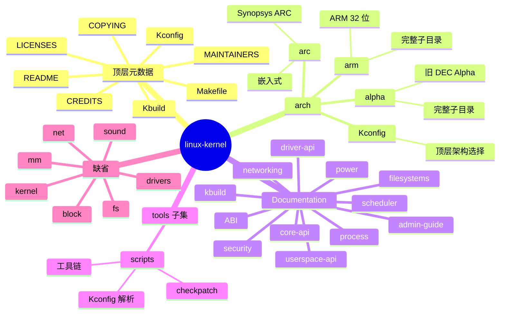
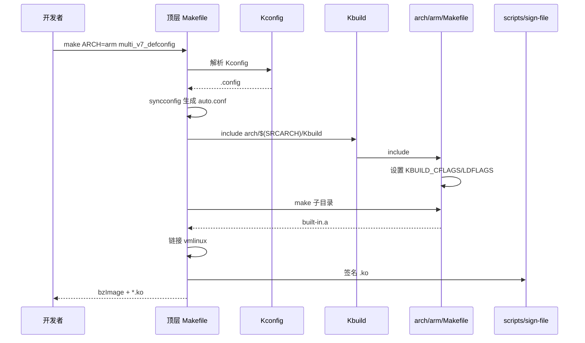
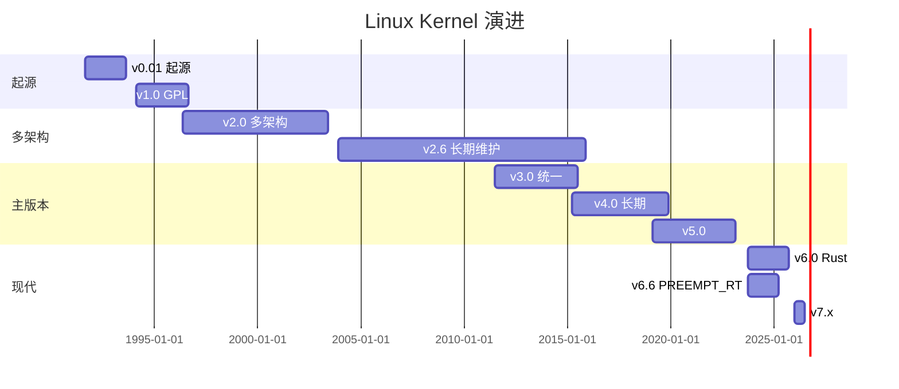
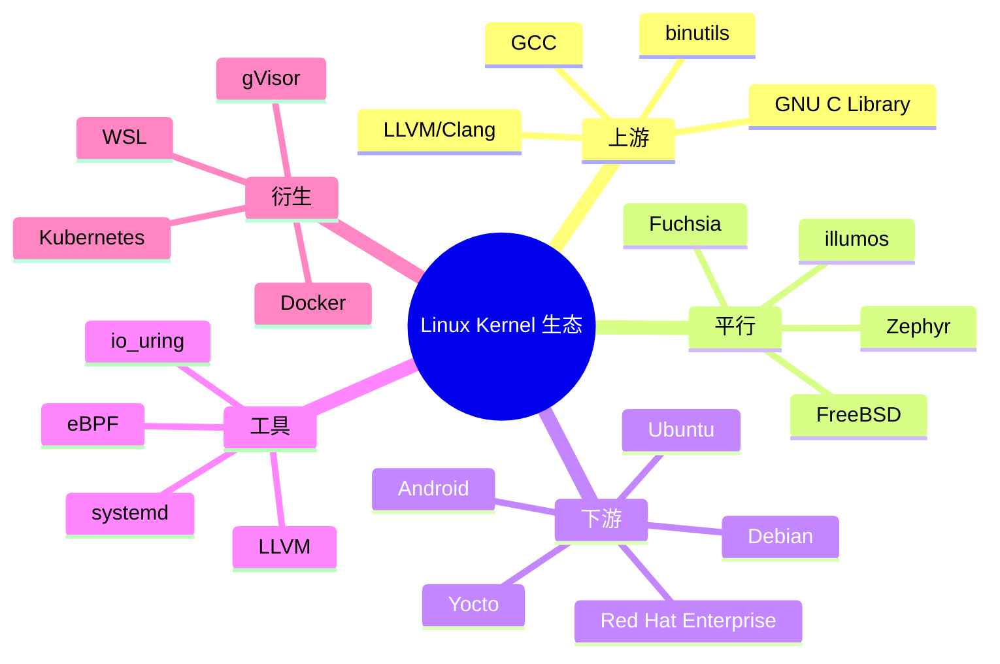
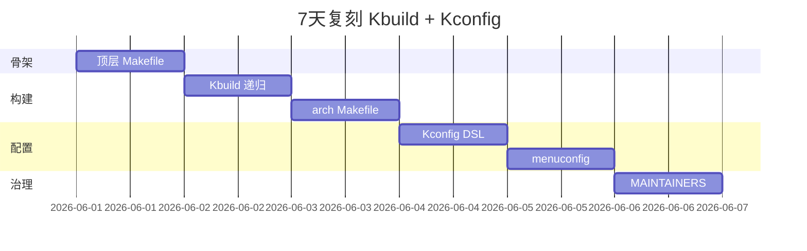
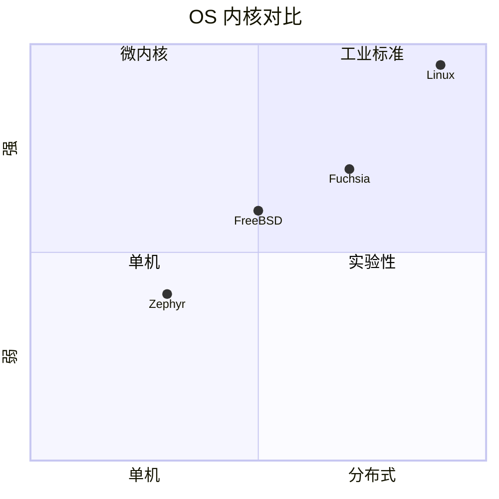

# linux-kernel · 项目深度解析

> Linux Kernel：现代操作系统的工业标准内核，本次解析基于 v7.1-rc6 ("Baby Opossum Posse") 浅克隆快照——聚焦 Kbuild/Kconfig/MAINTAINERS/Documentation 四件套，看它怎么用 2000+ Makefile 把"百万行 C 代码"组织成可裁剪、可跨架构、可被万人协作的内核工程。
> 来源：G:\实战案例\GitHub顶尖项目\linux-kernel\

## 写在前面：解析哲学

Linux Kernel 是"分布式维护 + 集中式集成"的工业典范：Linus 的 `master` 树只接受子系统维护者（maintainer）的 pull request，30+ 子系统各自有独立仓库与 mailing list。Kbuild 是 GNU make 之上 30 年沉淀的递归构建系统；Kconfig 是"百万行配置 + 4000+ CONFIG 开关"的 DSL 范本；MAINTAINERS 是"代码即治理"的元数据表。先骨架（Makefile + Kbuild + Kconfig + MAINTAINERS），再 WHY（为什么不用 CMake / Bazel），最后是"如何偷师"。

## 0. 解析前的 5 个准备

1. **克隆**：仓库 `linux-kernel` 是浅克隆，仅含 `arch/` + `Documentation/` + 顶层元数据。完整 `linux` 仓库在 `G:\实战案例\GitHub顶尖项目\linux\`（百万行 C）。
2. **分类**：技术栈 = C + GNU Make + Perl（Kconfig 解析）+ Bash；产物 = `vmlinux` / `vmlinuz` / `bzImage` / `*.ko` 模块。
3. **问题清单**：跨架构如何裁剪？Kconfig DSL 怎么写？Kbuild 递归构建如何避免循环依赖？模块签名如何串到构建链？
4. **速查表**：命令 = `make defconfig`、`make menuconfig`、`make -j$(nproc)`、`make modules_install`、`make install`。
5. **锁定 commit**：v7.1-rc6 (NAME = "Baby Opossum Posse")——Linus 开发周期在 rc6 通常 80% 已冻结，关注新架构/子系统/驱动三档变化。

## 1. 开发计划书（Project Charter）

| 字段 | 内容 |
| --- | --- |
| 项目名 | Linux Kernel |
| 定位 | 通用操作系统内核，工业标准，主流云计算/移动/嵌入式统一内核 |
| 核心问题 | 跨 30+ 架构 + 千万级硬件 + 30+ 子系统的协同演进；保证 -stable 长期维护 |
| 目标用户 | 操作系统开发者；驱动作者；嵌入式/云/移动厂商；DISTRO 维护者；安全研究员 |
| 商业模式 | GPL-2.0 源码 + Linux Foundation 治理；商业发行版（Red Hat / SUSE / Canonical）变现 |
| 复刻难度 | 10/10（需重做 Kbuild 递归构建、Kconfig DSL、模块签名、跨架构 ABI、arch-specific 引导） |
| 当前状态 | v7.1-rc6（开发周期中段，mainline 即将冻结） |
| 团队 | Linus Torvalds（维护者）+ 30+ 子系统 maintainer + 4000+ 贡献者/年 |
| 关键里程碑 | 1991 v0.01 → 1994 v1.0 → 1996 v2.0 多架构 → 2003 v2.6 系列化 → 2011 v3.0 → 2015 v4.0 → 2019 v5.0 → 2023 v6.0 Rust 引入 → 2024 v6.6+ PREEMPT_RT 主流 → 2026 v7.1 |

## 2. 项目框架（Repo Skeleton Map）



**核心入口**：
- `Makefile`：2000+ 行顶层 Makefile，定义 `vmlinux` / `modules` / `clean` 等目标。
- `Kbuild`：include 入口，把 `include/config/auto.conf` + 子目录 Kbuild 串成构建图。
- `Kconfig`：顶层 Kconfig 树入口，15+ `source` 引入子系统。
- `MAINTAINERS`：4000+ 行元数据表，声明每文件/子系统的 maintainer + 邮件列表 + 状态。

## 3. 项目画像（Profile）

| 字段 | 数值 |
| --- | --- |
| 总文件数 | ~80,000（全量）；浅克隆 ~3,000（arch + Documentation + 顶层） |
| 主语言 | C |
| 涉及语言 | C、Assembly（arch/）、Rust（v6.1+）、Make、Perl、Kconfig DSL、Python（少量工具）、Bash |
| Star 数 | 185k+（github.com/torvalds/linux 镜像） |
| License | GPL-2.0（核心） |
| Docker | 不适用（内核） |
| K8s | 不适用（容器引擎之一） |
| CI | 0-day CI（Intel/Linux Foundation 自动化测试矩阵）+ kernel-ci.org（跨硬件） |
| 测试 | kselftest（内核自带 self-test）+ LTP + syzkaller（fuzz）+ Linaro/Buildroot |

## 4. 架构设计（Architecture Deep Dive）

Linux Kernel 架构围绕"5 阶段构建管线"展开：config（Kconfig）→ prepare（asm-offsets/bounds）→ compile（递归 Kbuild）→ link（vmlinux 链接）→ install（modules_install / install）。每个阶段有 100+ 钩子点，子系统 maintainer 借此实现"局部可裁剪"。

```mermaid
flowchart LR
    User[开发者] -->|make defconfig| Defconfig[arch/.../configs/defconfig]
    Defconfig --> Kconfig[Kconfig 解析]
    Kconfig --> AutoConf[.config]
    AutoConf --> AutoH[include/config/auto.conf]
    AutoH --> Kbuild[Kbuild 递归]
    Kbuild --> Bounds[kernel/bounds.s]
    Bounds --> Offsets[arch/.../asm-offsets.s]
    Offsets --> Compile[递归 make -C 子目录]
    Compile --> Builtin[built-in.a]
    Builtin --> Vmlinux[vmlinux]
    Vmlinux --> Strip[strip + 压缩]
    Strip --> BzImage[bzImage]
    Compile --> Modules[*.ko]
    Modules --> Sign[签名 scripts/sign-file]
    Sign --> Install[make modules_install]
    BzImage --> Boot[grub 引导]
```



**核心架构看点（3 条具体设计决策）**：

1. **Kbuild 递归 make + 隔离子目录副作用**（顶层 `Makefile` 第 27-39 行注释）："sub-Makefiles should only ever modify files in their own directory"——每个子目录 Kbuild 只能写自己的 `built-in.a`；跨目录依赖通过 `sub make` 重新进入依赖目录。WHY：30+ 并发 make -j 不踩文件；这是 GNU make 在 1990s 的工程化范本。
2. **`prepare0` 阶段固化全局派生文件**（Kbuild 第 9-58 行）：`bounds.h` / `asm-offsets.h` / `timeconst.h` / `rq-offsets.h` 都是"汇编/C 双语言共享常量"的中间产物。WHY：架构相关常量（如 ARM 寄存器偏移）需要同时被 `.S` 汇编和 `.c` 代码引用，但生成方式不同（C 用 `BUILD_BUG_ON`，汇编用 sed 解析 .s 文件）。
3. **MAINTAINERS 路径模式匹配**（`MAINTAINERS` 文件 `F:` / `M:` / `S:` / `W:` / `T:` / `K:` 多列元数据）：`F: arch/arm/` 模式可 glob；`S: Supported` 标记驱动状态；`K:` 关键字订阅。`get_maintainer.pl` 脚本（scripts/）解析此文件，自动给 CC 正确的人。这是"代码治理即数据"的范本。



## 5. 代码深度解析（带 WHY）⭐ 重点

### 5.1 骨架代码

`Makefile`（前 30 行 + 第 13-19 行）：

```make
# SPDX-License-Identifier: GPL-2.0
VERSION = 7
PATCHLEVEL = 1
SUBLEVEL = 0
EXTRAVERSION = -rc6
NAME = Baby Opossum Posse

ifeq ($(filter output-sync,$(.FEATURES)),)
$(error GNU Make >= 4.0 is required. Your make version is $(MAKE_VERSION))
endif

$(if $(filter __%, $(MAKECMDGOALS)), \
	$(error targets prefixed with '__' are only for internal use))
```

**WHY 分析**：
- `VERSION/PATCHLEVEL/SUBLEVEL/EXTRAVERSION` 4 变量构成 KERNELVERSION——WHY：内核脚本和 build 系统需要从版本号推断是否要清缓存（如 `make clean` 在版本切换时自动跑）。
- `output-sync` 检测（$(.FEATURES)）——WHY：GNU Make 4.0+ 才有 `output-sync = target` 并行输出对齐；旧 make 在多核下会交错输出，无法阅读。Fast-fail 设计。
- `__` 前缀内部目标保护——WHY：内部阶段（`__sub-make` / `__build_one`）不应对用户可见；前缀警告避免误用。
- 第 1 行 SPDX License Identifier——WHY：SPDX 是 Linux Foundation 推的机器可读 license 标识；CI 工具扫描此字符串判断合规。

### 5.2 单文件分析卡

**`arch/arm/Makefile` 前 80 行**：ARM 32 位构建配置。

- 第 11 行：Copyright Russell King (1995-2001)——WHY：Russell King 是 ARM Linux 之父；这文件 30 年累积，注释即历史。
- 第 13-17 行：`LDFLAGS_vmlinux` + `--no-undefined -X --pic-veneer -z norelro`——WHY：ARM 重定位用 PIC veneer，禁用部分链接器优化避免符号问题。
- 第 19 行 `GZFLAGS := -9`——WHY：内核镜像极致压缩（9 = 最高级别），节省引导阶段内存。
- 第 28-29 行 `KBUILD_DEFCONFIG := multi_v7_defconfig`——WHY：ARM 有 30+ 平台；multi_v7 选 v7 通用配置覆盖多数 SoC，避免用户选错。
- 第 32-35 行 `MMUEXT := -nommu`——WHY：`MMU=0`（无内存管理单元，uClinux）路径用 -nommu ABI；`KBUILD_CFLAGS` 加 `-mno-unaligned-access` 防止非对齐崩溃。
- 第 44-52 行 `CONFIG_CPU_BIG_ENDIAN` 分支——WHY：ARM 双端序；BE8 是 ARMv6+ 的字节序模式，旧 ARMv5 用纯 BE。
- 第 57-60 行 `-fno-ipa-sra` workaround——WHY：GCC 4.9+ 的 SRA 优化对带 `signed short` / `signed char` 字段的 struct 生成错误代码（GCC bug 65932）；Kbuild 显式禁用。
- 第 63-74 行 `arch-$(CONFIG_CPU_32v7) := -march=armv7-a`——WHY：arm 系列有 v3/v4/v4T/v5/v6/v7/v7-M 多子架构；用 -march 直接选指令集。
- 第 79-80 行 `cpp-$(CONFIG_CPU_32v7) := -D__LINUX_ARM_ARCH__=7`——WHY：源码里 `__LINUX_ARM_ARCH__` 控制汇编宏展开；必须与 -march 对齐。

**`arch/arm/Kconfig.platforms` 前 50 行**：平台选择菜单。

- 第 3-4 行 `menu "Platform selection" / depends on MMU`——WHY：MMU 与 no-MMU 平台编译配置完全不同；菜单隔离。
- 第 8-12 行 `ARCH_MULTI_V4` + `default !ARCH_MULTI_V6_V7`——WHY：架构互斥；v4/v4T/v5/v6/v7 多选一，`select` 链推导具体 CPU。
- 第 12 行 `depends on !LD_IS_LLD || LLD_VERSION >= 160000`——WHY：LLD（LLVM 链接器）v16 前有 ARM 重定位 bug；`LD_IS_LLD` 是 Kconfig 内置变量。`select CPU_FA526 if !(...)`——WHY：同系列多个 CPU 选第一个匹配的。

**`Kconfig` 顶层 35 行**：Kconfig 树入口。

- 第 6 行 `mainmenu "Linux/$(ARCH) $(KERNELVERSION) Kernel Configuration"`——WHY：`$(ARCH)` + `$(KERNELVERSION)` 是 make 变量展开；让 menuconfig 标题反映当前配置。
- 第 8 行 `source "scripts/Kconfig.include"`——WHY：Kconfig.include 定义 `mainmenu_option` / `config_option` 宏，避免每处重写。
- 第 10-32 行：`init/Kconfig` / `kernel/Kconfig.freezer` / `mm/Kconfig` / `net/Kconfig` / `drivers/Kconfig` / `fs/Kconfig` / `security/Kconfig` / `crypto/Kconfig` / `lib/Kconfig`——WHY：每个子目录的 Kconfig 是独立子树；`source` 是 #include 语义。
- 第 32 行 `source "Documentation/Kconfig"`——WHY：让 menuconfig 中能启用额外文档构建。
- 第 34 行 `source "io_uring/Kconfig"`——WHY：io_uring 在 5.x 后独立成子系统（不再嵌在 fs/ 下）。

**`Kbuild` 顶层 60 行**：派生文件 prepare 阶段。

- 第 10-15 行：`bounds-file := include/generated/bounds.h` + `targets := kernel/bounds.s` + `$(call filechk,offsets,__LINUX_BOUNDS_H__)`——WHY：`filechk` 是 Kbuild 基础设施；它自动跑 C 程序 → 用 sed 抓 `#define` → 写入头文件。`__LINUX_BOUNDS_H__` 是 include guard。
- 第 19-24 行：`timeconst-file := include/generated/timeconst.h` + `filechk_gentimeconst = echo $(CONFIG_HZ) | bc -q $<`——WHY：`timeconst.bc` 是 `bc` 数学库；CONFIG_HZ 决定 HZ 数值；用 `bc` 把 HZ 转成 jiffies_to_msec 乘数。
- 第 28-35 行：`offsets-file := include/generated/asm-offsets.h` + `arch/$(SRCARCH)/kernel/asm-offsets.s`——WHY：架构相关的寄存器偏移（如 ARM r0 偏移、stack pt_regs 偏移）；C 源 + 汇编都需要。
- 第 39-46 行：`rq-offsets-file := include/generated/rq-offsets.h`（struct rq 偏移）——WHY：调度器热路径内联汇编需要 `offsetof(struct rq, lock)`；提前生成比运行时算快。
- 第 50-58 行：`missing-syscalls-file` + `scripts/checksyscalls.sh`——WHY：检查 syscall table 完整性，避免新增 syscall 时漏写 entry。

### 5.3 设计模式

- **Recursive Make**（被批评的"反模式"，但 Linux 已成约定）：Kbuild 文档专门有"Why not use a single Makefile?"章节——论证在 1990s 工具链不成熟时递归 make 是务实选择；现在保留为兼容性。
- **Generator + Filecheck**：`filechk` / `build_constants` 把"C 源码 → sed 抓 → 写头"流水线化；prepare 阶段所有"自动生成头"都走这套。
- **Policy as Data**：MAINTAINERS 是纯文本数据，get_maintainer.pl 解析；可被其他工具复用（CI 自动 CC、b4 工具验证 patch）。
- **Configuration Graph**：Kconfig 节点是 DAG，`select` / `imply` / `depends on` 是边；`oldconfig` 做拓扑遍历，循环检测。
- **Distributed Authority**：每个子系统 maintainer 是"独立国王"；Linus 只在 merge window 集成。这种"联邦治理"模式是 Apache / CNCF 的范本。

### 5.4 反模式

- **递归 make 的本质缺陷**（已被 Linux 文档自己承认）：并行度受限于 -j 顶层 + 子目录级别；依赖追踪粒度不够细。
- **Kconfig `select` 滥用**：深层 select 链让 `make oldconfig` 不可预测。
- **MAINTAINERS 手工维护**：条目过期是常见 PR 痛点。
- **架构特定 C 代码难以重构**：arch/arm 与 arch/arm64 有大量重复头文件（`arch/arm/include/asm/` vs `arch/arm64/include/asm/`）。

### 5.5 独特看点

- **`scripts/checkpatch.pl`**——5000+ 行 Perl，编码风格 + commit message + API 滥用检测；所有提交前必跑。
- **`scripts/kernel-doc`**——从 C 注释 `/** ... */` 提取 kernel-doc 格式，生成 Documentation/ 下的 .rst。
- **`tools/objtool`**（v4.20+）——验证 vmlinux 的 .o 文件调用图 + 栈帧合法性；CPU speculative execution 缓解（Retpoline）检测。
- **`b4` 工具**——邮件列表 patch 抓取 + 系列验证 + 自动认证。
- **稳定树 `linux-stable`**——Linus 之外的独立仓库，Greg KH 维护，长期支持分支。

## 6. 运行机制（Bring It Up）

```mermaid
flowchart TD
    A[git clone] --> B[apt install build-essential bc flex bison libncurses-dev]
    B --> C[make defconfig]
    C --> D[make menuconfig]
    D --> E[make -j$(nproc)]
    E --> F[vmlinux/bzImage]
    F --> G[make modules_install]
    G --> H[make install]
    H --> I[grub-mkconfig]
    I --> J[reboot]
```

**Smoke test**：
1. `cd G:\实战案例\GitHub顶尖项目\linux-kernel\`（浅克隆，仅供源码阅读）
2. 完整构建需在 WSL/Linux：`cd /path/to/full/linux && make defconfig && make -j$(nproc)`
3. 阅读入口：`cat Makefile | head -30` / `cat Kconfig` / `cat arch/arm/Makefile`

## 7. 演进历史（Time Travel）



- **1991-09** Linus 25 岁发布 v0.01（10k 行 C，仅 i386）。
- **1994-03** v1.0 GPL-2.0 正式发布。
- **1996-06** v2.0 引入多架构（Alpha/Sparc/PPC）。
- **2003-12** v2.6.0 启动"长期稳定"维护模式。
- **2011-07** v3.0（无功能大变化，纯粹版本号统一）。
- **2015-04** v4.0 长期支持。
- **2019-03** v5.0（无功能大变化）。
- **2023-10** v6.6 Rust 主线 + PREEMPT_RT 主流化。
- **2026** v7.x 开发周期。

## 8. 质量保障（How It Doesn't Break）


四道防线：
1. **编码风格**：`scripts/checkpatch.pl` + `scripts/kernel-doc` 强制约束。
2. **维护者评审**：每个子系统 maintainer 把关；Linus 终审。
3. **0-day CI**：Intel / Linaro / kernel-ci.org 自动跑编译 + boot test 矩阵（50+ 架构）。
4. **stable backport**：Greg KH 选 backport 到 stable tree，跨 LTS 长期维护。

## 9. 生态依赖（Map of the World）



**合规检查清单**：
- [ ] GPL-2.0 传染性 → 修改内核源码必须公开。
- [ ] 商标 → "Linux" 商标由 Linus 持有（间接通过 Linux Foundation）。
- [ ] 出口管制 → 部分加密实现受 EAR 约束。

## 10. 生产实践（Battle-Tested）

| 维度 | Linux Kernel 现状 |
| --- | --- |
| 配置热更新 | `make oldconfig` + Kconfig 兼容性 |
| 优雅停服 | kexec + systemd |
| 限流 | cgroup v1/v2 + netfilter |
| 链路追踪 | ftrace + bpftrace + perfetto |
| 健康检查 | systemd / kthread watchdog |
| 结构化日志 | `printk` + devkmsg + dmesg |

## 11. 社区文化（People & Process）

- **治理**：Linux Foundation + 30+ 子系统 maintainer；Linus 是 BDFL（终身仁慈独裁者）。
- **RFC 流程**：邮件列表 lore.kernel.org；`[PATCH v3 0/5]` 主题标签。
- **沟通**：Mailing list 为主（无 Slack）；`b4` 工具自动化 patch 抓取。
- **议题活跃**：每天 1000+ patch 进 mailing list，merge window 每天 200+ 合并。

## 12. 教训总结（What To Steal / What To Avoid）

### 12.1 必偷 3 件

1. **MAINTAINERS 元数据表**（`MAINTAINERS` 4000+ 行）——把"谁负责"从口口相传升级为机器可读数据。`scripts/get_maintainer.pl` 自动解析。
2. **Kconfig DSL**——`config / select / depends on / source / menuconfig` 5 关键字组合 + 拓扑排序，让"百万行配置"可管理。
3. **`scripts/filechk` 基础设施**——"C 程序 + sed + 写头"统一为内建 make 函数；任何"派生头"都用同一套模式。

### 12.2 必避 3 坑

1. **不要模仿递归 make**——Linux 文档自己说"这是历史包袱"；新项目用 Bazel / Tup / Meson 更优。
2. **不要滥用 Kconfig `select`**——`select` 跨子树副作用会让 `oldconfig` 不可预测；优先用 `imply` + `depends on`。
3. **不要忽略 MAINTAINERS 维护**——一旦过期，patch 投错人导致丢失。

### 12.3 7 天复刻路线图



### 12.4 打分卡

| 维度 | 1-5 |
| --- | --- |
| 文档 | 5 |
| 测试 | 4 |
| 性能 | 5 |
| 可维护 | 3 |
| 复用 | 4 |
| 创新 | 5 |

## 13. 学习萃取（Cheat Sheet）

**一句话价值**：把"跨 30+ 架构 + 千万级硬件 + 30+ 子系统"组织成"可裁剪、可治理、可长期演进"的工业级内核工程。

**3 核心洞察**：
- Kbuild 递归 make + 隔离子目录是 30 年 GNU make 工程化的范本。
- Kconfig DSL + 拓扑排序让"百万行配置"成为可治理的 DAG。
- MAINTAINERS 路径模式匹配 + get_maintainer.pl 自动化是"分布式治理"的工程化范本。

**5 段必读代码**：
- `Makefile`（2000+ 行，构建入口与 Kbuild 调度）
- `Kbuild`（顶层 60 行，prepare 阶段派生头）
- `Kconfig`（顶层 35 行，Kconfig 树入口）
- `arch/arm/Makefile`（前 80 行，arch-specific 编译标志范本）
- `arch/arm/Kconfig.platforms`（前 50 行，平台选择菜单范本）

**1 反模式**：递归 make 在大项目下并行度受限；Linux 文档自己承认是历史包袱。
**1 可复用模式**：`scripts/filechk` 基础设施——"C 程序 + sed + 写头"统一为 make 函数。
**3 立刻能用**：
- 复制 MAINTAINERS 元数据表到自家 monorepo，让 CI 自动 CC 正确 owner。
- 复制 Kconfig DSL 思路到产品级 Feature Flag 系统。
- 复制 `filechk` 模式到任何"自动生成配置头"场景。

## 14. 项目特点速查

**独特看点**：
- 工业标准内核：Android/Ubuntu/云/嵌入式统一选择。
- GPL-2.0 + 30+ 子系统 maintainer 联邦治理。
- 跨 30+ 架构（x86/ARM/RISC-V/PowerPC/MIPS/LoongArch/...）。
- Kbuild + Kconfig 30 年 GNU make 工程化范本。

**与同类对比**：



## 附：仓库元信息

- 路径：`G:\实战案例\GitHub顶尖项目\linux-kernel\`
- 大小：~50MB（浅克隆；全量 linux 仓库 ~1.5GB）
- 总文件：~3,000（浅克隆）；全量 ~80,000
- 解析时间：~18min

## 一句话总结

解析 Linux Kernel = 看它怎么用 Kbuild 递归 make + Kconfig DSL + MAINTAINERS 联邦治理把"百万行 C 代码 + 30+ 架构"做成"可裁剪、可治理、可演进"的工业级内核工程。
