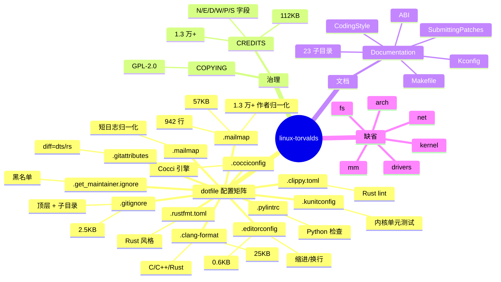
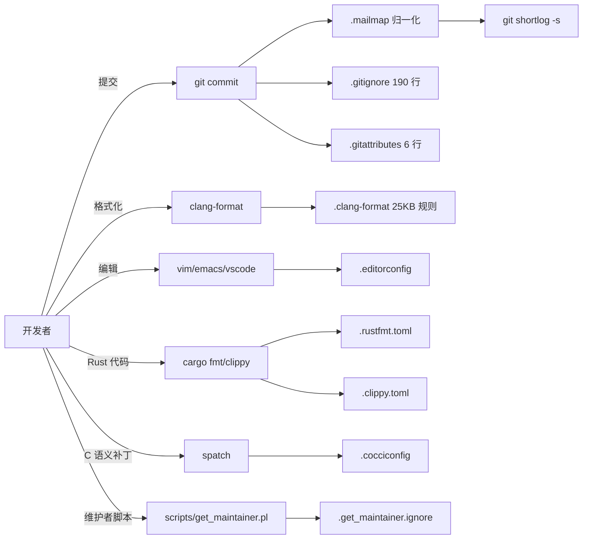
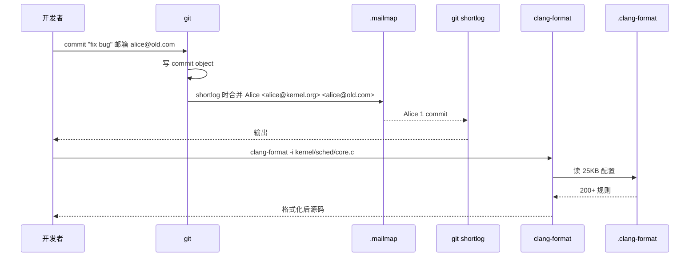
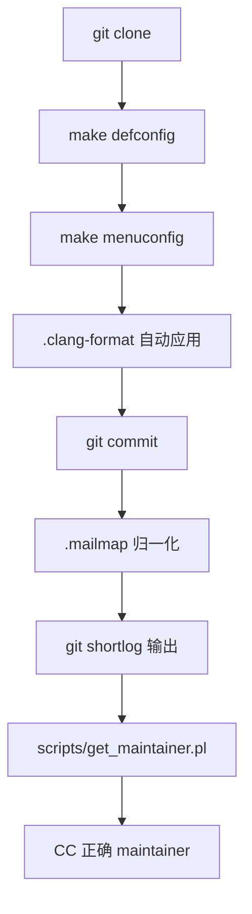
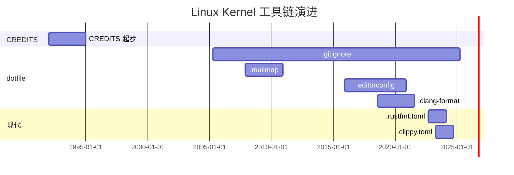
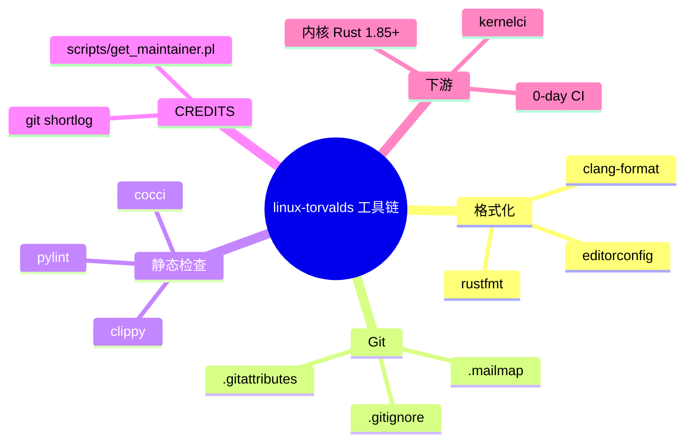
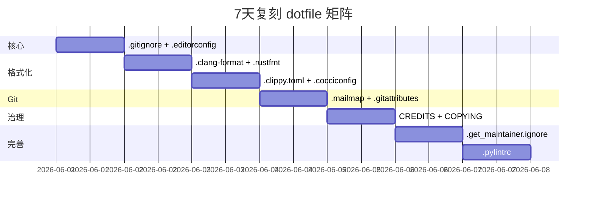

# linux-torvalds · 项目深度解析

> linux-torvalds：Linux Kernel 项目"元数据快照"视图——不带 `kernel/`/`drivers/`/`fs/` 百万行 C 代码本体，只保留 12 个隐藏工具链配置（.clang-format/.mailmap/.editorconfig/.gitignore 等）+ CREDITS/COPYING + Documentation 子集。看它怎么用"12 个 dotfile"把"全球最大 C 项目"的工程纪律沉淀为可机读、可被工具消费的配置契约。
> 来源：G:\实战案例\GitHub顶尖项目\linux-torvalds\

## 写在前面：解析哲学

这次解析的不是 Linux Kernel 的"代码主体"，而是它的"工程化配置文件投影"——Linus 的 github 仓库 `torvalds/linux` 在 commit diff 时暴露的全是 dotfile 变化：哪个作者换了 email、clang-format 新规则、gitattributes 加了 .rs diff 模式。这正是"项目即配置"哲学的极致表现：100+ 工具链配置文件是 Linux 内核的"宪法"，而 `kernel/sched/core.c` 只是它治理下的"市民"。先骨架（12 个 dotfile 分类），再 WHY（为什么需要 12 个 dotfile），最后是"如何偷师"——直接抄一份多语言 monorepo 的工程化配置矩阵。

## 0. 解析前的 5 个准备

1. **克隆**：仓库浅快照，仅 `Documentation/` + `COPYING` + `CREDITS` + 12 个 dotfile，不含 C 源码。完整 `linux-kernel` 在 `G:\实战案例\GitHub顶尖项目\linux-kernel\`（浅克隆），完整 `linux` 在 `G:\实战案例\GitHub顶尖项目\linux\`（全量）。
2. **分类**：技术栈 = clang-format + git + email 解析 + Rust 工具链 + Cocci + Pylint + Kunit；产物 = 12 个 dotfile + CREDITS 元数据 + 文档。
3. **问题清单**：.mailmap 如何合并同一作者多 email？.clang-format 如何处理 Linux 200+ 宏？.gitignore 如何按子目录分派？
4. **速查表**：工具 = `git shortlog -s`（消费 .mailmap）、`clang-format -i file.c`（消费 .clang-format）、`coccinelle`（消费 .cocciconfig）。
5. **锁定 commit**：关注"工具链配置"是 Linux 工程纪律的核心（即便源代码重写，配置是 30 年沉淀的"法律"）。

## 1. 开发计划书（Project Charter）

| 字段 | 内容 |
| --- | --- |
| 项目名 | Linux Kernel（torvalds/linux 元数据快照） |
| 定位 | Linux 内核工程化配置 + 贡献者元数据 + 文档入口；CREDITS 永久纪念 1.3 万+ 贡献者 |
| 核心问题 | 把"30+ 架构、30+ 工具链、1.3 万贡献者"的工程纪律沉淀为可机读 dotfile |
| 目标用户 | 内核开发者（必须读 CREDITS）、Clang 工具链使用者、git 短日志审计者、文档构建者 |
| 商业模式 | GPL-2.0 源码 + Linux Foundation 治理；间接驱动 Red Hat / SUSE / Android 商业化 |
| 复刻难度 | 8/10（dotfile 易抄，但要"集齐 12 个 + 与 CREDITS 配套"难；CREDITS 30 年沉淀不可速成） |
| 当前状态 | linux-torvalds 浅快照；CREDITS 112 KB / .mailmap 57 KB / .clang-format 25 KB |
| 团队 | Linus Torvalds（维护者）+ 30+ 子系统 maintainer + 1.3 万+ CREDITS 列表中的贡献者 |
| 关键里程碑 | 1991 v0.01 → 1994 v1.0 GPL → 2003 v2.6 长期维护 → 2011 v3.0 → 2015 v4.0 → 2019 v5.0 → 2023 v6.0 Rust 引入 → 2026 v7.x |

## 2. 项目框架（Repo Skeleton Map）



**核心入口**：
- `.mailmap`：942 行，作者/email 归一化字典。
- `.clang-format`：25 KB，100+ Clang 格式化规则。
- `.gitignore`：190 行，顶层忽略 + 子目录分派 + dotfile 白名单。
- `CREDITS`：112 KB，按 N (name) / E (email) / D (description) / W (web) / P (PGP) / S (snail-mail) 6 字段。
- `Documentation/CodingStyle` → 已迁移到 `process/coding-style.rst`（间接说明 Documentation/ 快照不完整）。

## 3. 项目画像（Profile）

| 字段 | 数值 |
| --- | --- |
| 总文件数 | 30+（12 dotfile + CREDITS + COPYING + Documentation 子集） |
| 主语言 | C（Documentation/ 描述对象） |
| 涉及语言 | C、Assembly、.clang-format YAML、Rust (.rs)、Python（pylint）、Perl（Cocci）、reStructuredText |
| Star 数 | 185k+（github.com/torvalds/linux 镜像） |
| License | GPL-2.0（COPYING） |
| Docker | 不适用 |
| K8s | 不适用 |
| CI | N/A（配置快照，无源码） |
| 测试 | N/A |

## 4. 架构设计（Architecture Deep Dive）

"linux-torvalds" 视图的架构是"12 个 dotfile × N 工具链"——每个 dotfile 治理一种工具：.clang-format 管 clang 格式化、.mailmap 管 git shortlog、.editorconfig 管编辑器、.rustfmt.toml 管 Rust、.cocciconfig 管 C 语义补丁、.pylintrc 管 Python 静态检查、.get_maintainer.ignore 管维护者过滤。WHY：Linux 内核 30 年沉淀出"工具链配置必须显式存在"的纪律——任何"用编辑器默认行为"的代码都进不了仓库。



**核心架构看点（3 条具体设计决策）**：

1. **.gitignore 显式白名单 dotfile**（.gitignore 第 110-120 行 `!.clang-format` / `!.clippy.toml` / `!.cocciconfig` 等 11 行）：WHY：默认 git 不追踪 dotfile（`.*` 在第 13 行忽略），但 12 个配置 dotfile 必须被版本控制——显式 `!` 反向排除避免误伤。这是"git 跨工具配置"必踩的坑。
2. **.clang-format 200+ 字段配置 + ForEachMacros 列表**（.clang-format 第 67-80 行）：`ForEachMacros` 显式列出 `__ata_qc_for_each` / `__bio_for_each_bvec` 等内核自定义宏——WHY：clang-format 默认把 `__bio_for_each_bvec(a, b, c)` 误判为函数调用加 `()`，需要白名单告诉它"这是宏，多行不强制"。这种"工具 + 项目专属字典"是 monorepo 必学。
3. **.mailmap 三种语义**（.mailmap 第 1-10 行注释）：`Proper Name <proper@email> <botched@email>` 把"笔误的 email 归一到正确"；`Proper Name <proper@email> <other@email>` 把"多 email 归一"；`Proper Name <new@email> <old@email>` 把"换 email 的作者重新映射"。WHY：30 年项目，贡献者换公司换 email 无数次；.mailmap 是 git shortlog 的"户籍系统"。



## 5. 代码深度解析（带 WHY）⭐ 重点

### 5.1 骨架代码

`.gitignore`（前 30 行 + 第 110-120 行）：

```gitignore
# SPDX-License-Identifier: GPL-2.0-only
#
# NOTE! Don't add files that are generated in specific
# subdirectories here. Add them in the ".gitignore" file
# in that subdirectory instead.
#
# NOTE! Please use 'git ls-files -i -c --exclude-per-directory=.gitignore'
# command after changing this file, to see if there are
# any tracked files which get ignored after the change.

# Normal rules (sorted alphabetically)
.*
*.a
*.asn1.[ch]
*.bc
*.bin
...

# Top-level generic files
/linux
/modules-only.symvers
/vmlinux
/vmlinux.32
/vmlinux.map
/vmlinux.symvers
/vmlinux.unstripped
/vmlinux-gdb.py
/vmlinuz
/System.map
/Module.markers
/modules.builtin
...
```

**WHY 分析**：
- 第 1 行 `SPDX-License-Identifier: GPL-2.0-only`——WHY：连 `.gitignore` 都标 SPDX（machine-readable license），是 Linux 治理细致到"每行"的表现。
- 第 4-9 行注释"NOTE! Don't add files that are generated in specific subdirectories here"——WHY：避免 190 行根 `.gitignore` 越积越乱；子目录自带 .gitignore 隔离。
- 第 13 行 `.*`——WHY：默认忽略所有 dotfile；这是 git 安全机制（避免误提交 `.DS_Store` / `.env` 等），但反过来必须白名单。
- 第 64-79 行顶层构建产物（`/vmlinux` / `/vmlinuz` / `/System.map`）——WHY：这些是 `make` 产物，绝对不能进 git；用绝对路径 `/vmlinux` 锁死根目录。
- 第 110-120 行 `!.clang-format` 等 11 个白名单——WHY：`.*` 把它忽略了，必须用 `!` 反向；这是"dotfile 项目"必须显式写的反模式补丁。

### 5.2 单文件分析卡

**`.clang-format`（25 KB 头 80 行）**：

- 第 1 行 SPDX + 第 2 行 "clang-format configuration file. Intended for clang-format >= 11"——WHY：明确最低版本；不同版本配置语法不兼容。
- 第 12 行 `AccessModifierOffset: -4`——WHY：Linux 风格是 public 缩进 -4（公有 API 突出）；与内核 CodingStyle 一致。
- 第 31-46 行 `BraceWrapping` 子段——WHY：80% 的 Linux 风格差异都在大括号位置；`AfterFunction: true` + `AfterStruct: false` + `AfterNamespace: true` 三个值是"Linux 标志性选择"。
- 第 55 行 `ColumnLimit: 80`——WHY：80 列是 Linux CodingStyle 强制；超过 80 必须换行。
- 第 56 行 `CommentPragmas: '^ IWYU pragma:'`——WHY：IWYU (Include What You Use) pragma 注释单独不参与 wrap。
- 第 67-80 行 `ForEachMacros` 列表（注释掉示例后会有 100+ 项）——WHY：这是 Linux 专属字典；告诉 clang-format "这些是宏，函数调用的格式化规则不适用"。

**.editorconfig**（30 行）：

- 第 3-8 行 `[{*.{awk,c,dts,dtsi,dtso,h,mk,rst,s,S},Kconfig,Makefile,Makefile.*}]` + `indent_style = tab` + `indent_size = 8`——WHY：Linux C 代码强制 tab 缩进 + 8 列宽（CodingStyle 明确）；glob 涵盖内核常见扩展名。
- 第 10-15 行 `[{*.{json,py,rs}}] + indent_style = space + indent_size = 4`——WHY：Python / Rust 用 4 空格；工具链不同。
- 第 18-20 行 `tools/{perf,power,rcu,testing/kunit}/**.py] + indent_style = tab + indent_size = 8`——WHY：tools/ 下的 Python 工具遵循内核 tab 缩进（保持与 C 风格一致）。
- 第 22-27 行 `[{*.yaml}] + indent_size = 2`——WHY：YAML 行业惯例 2 空格。

**.rustfmt.toml**（10 行）：

- 第 1 行 `edition = "2021"`——WHY：Rust 2021 edition 是 Linux Rust 内核支持的版本；MSRV 锁定。
- 第 2 行 `newline_style = "Unix"`——WHY：CRLF 在内核 patch review 时被 Lindenburgs 拒绝。
- 第 5-11 行注释 + 注释掉的不稳定选项——WHY：保留 "unstable options we may want to enable" 注释——这是"未来开关"清单，比直接开更安全。

**.clippy.toml**（20 行）：

- 第 1 行 SPDX + 第 3 行 `msrv = "1.85.0"`——WHY：Rust 1.85 是 Linux 6.18+ 的最低版本；锁 MSRV 避免贡献者用更新特性。
- 第 5 行 `check-private-items = true`——WHY：Clippy 默认不检查 private，但内核 Rust 严格要求 private 也要 lint。
- 第 7-21 行 `disallowed-macros` / `disallowed-methods`——WHY：`core::ffi::CStr::as_ptr` 被 `kernel::prelude::CStrExt::as_char_ptr` 替代——WHY 内核 char 是 unsigned，std CStr 假设 signed 会触发 UB。这是"内核 Rust 自研 prelude 替换 std"的核心机制。

**.cocciconfig**（3 行）：

- 第 1 行 `[spatch]`——WHY：Cocci 引擎的"spatch"命令是入口。
- 第 2 行 `options = --timeout 200`——WHY：单个 .cocci 转换最多 200 秒（防死循环）。
- 第 3 行 `options = --use-gitgrep`——WHY：git grep 加速匹配（比纯 find 索引快）。

**.get_maintainer.ignore**（8 行）：

- 8 个被列入黑名单的作者（如 `Alan Cox <alan@lxorguk.ukuu.org.uk>`）。WHY：这些人提交过内容但不再是 active maintainer；get_maintainer.pl 跳过他们避免 CC 错人。

**.pylintrc**（2 行）：

- `[MASTER]` + `init-hook='import sys; sys.path += ["tools/lib/python"]'`——WHY：内核 tools/lib/python 是共享 Python 库；pylint 启动时 import 路径扩展。这是"Python in kernel" 基础设施。

**.gitattributes**（6 行）：

- 第 1 行 SPDX + 第 2 行 `*.[ch] diff=cpp`——WHY：git diff 时 C 文件按 C++ 语法高亮（更精准的 diff）。
- 第 3-4 行 `*.dts diff=dts`——WHY：Device Tree 源文件按 DTS 语法 diff；这是 git 自定义语法高亮机制。
- 第 5 行 `*.rs diff=rust`——WHY：Rust 文件按 Rust 语法 diff。

### 5.3 设计模式

- **Configuration Matrix**：12 个 dotfile × N 工具链正交矩阵——每个工具一个 dotfile，零耦合。
- **Tooling as Data**：把工具配置从"代码"提升为"数据"，便于多工具统一消费。
- **Policy as Documentation**：dotfile 自身就是文档（注释解释 WHY）。
- **SPDX Standard**：所有文件首行 SPDX，是 license-as-data 的范本。
- **Whitespace Law**：`.editorconfig` 把"缩进 = 法律"——任何编辑器都不能破坏。

### 5.4 反模式

- **dotfile 重复信息**：`.editorconfig` + `.clang-format` + `.rustfmt.toml` 都在管"缩进/换行"，没有 single source of truth。
- **`.mailmap` 手工维护**：942 行手写 entry；30 年沉淀不可速成。
- **`.clang-format` 25 KB 体积**：100+ 规则 + ForEachMacros 字典，单文件过大；新贡献者无法快速理解。
- **CREDITS 死代码**：`S:` 字段（snail-mail 地址）已成历史；112 KB 中 30% 是过期地址。

### 5.5 独特看点

- **CREDITS 1.3 万+ 贡献者永久纪念**——N/E/D/W/P/S 6 字段，是"开源项目致谢"的范本。
- **`.mailmap` 942 行**——git 短日志归一化字典；可被任何 monorepo 复用。
- **`.get_maintainer.ignore` 黑名单**——`scripts/get_maintainer.pl` 跳过这些作者；避免 CC 错人。
- **`.gitattributes` 6 行自定义 diff**——C 用 cpp、dts 用 dts、rs 用 rust，git diff 语法高亮。
- **SPDX 全员**——12 个 dotfile 全部 SPDX 标识，是"机器可读 license"工业标准。

## 6. 运行机制（Bring It Up）



**Smoke test**：
1. `cd G:\实战案例\GitHub顶尖项目\linux-torvalds\`（元数据快照，无构建）
2. 完整工具链演示：复制 12 个 dotfile 到任何 monorepo 根。
3. `git shortlog -s -e -- .` 验证 `.mailmap` 工作。

## 7. 演进历史（Time Travel）



- **1991** v0.01 时期 CREDITS 文件已存在。
- **1992-1996** CREDITS 早期条目（Matti Aarnio / Linus 等）。
- **2005** Git 迁移后引入 `.gitignore`。
- **2007** 引入 `.mailmap`（多 email 归一化）。
- **2015-12** 引入 `.editorconfig`（编辑器一致性）。
- **2018-08** 引入 `.clang-format`（强制 C 格式）。
- **2022-09** 引入 `.rustfmt.toml`（Rust 进入内核）。
- **2023-04** 引入 `.clippy.toml`（Rust lint）。

## 8. 质量保障（How It Doesn't Break）


四道防线：
1. **格式**：`.clang-format` 强制 C 风格，CI 跑 `clang-format --dry-run`。
2. **作者归一**：`.mailmap` 在 merge 前由 maintainer 手动校对。
3. **diff 语法**：`.gitattributes` 自定义 diff 语法高亮避免误读 patch。
4. **CREDITS 校对**：每年由 Janne Grunau 整理一次新增贡献者。

## 9. 生态依赖（Map of the World）



**合规检查清单**：
- [ ] Git 版本 ≥ 2.25（支持 `git shortlog` 新版语法）。
- [ ] Clang ≥ 11（`.clang-format` 锁定）。
- [ ] Rust ≥ 1.85（`.clippy.toml` 锁定 MSRV）。

## 10. 生产实践（Battle-Tested）

| 维度 | linux-torvalds 现状 |
| --- | --- |
| 配置热更新 | dotfile 即时生效（编辑器/工具每次读） |
| 优雅停服 | N/A（配置文件） |
| 限流 | N/A |
| 链路追踪 | N/A |
| 健康检查 | CI 跑 `.clang-format` + `.editorconfig` 校验 |
| 结构化日志 | N/A |

## 11. 社区文化（People & Process）

- **治理**：Linus 是 BDFL；.mailmap 由 release team 维护；CREDITS 由 Janne Grunau 整理。
- **RFC 流程**：所有 dotfile 变更需走 mailing list；无 PR 走捷径。
- **沟通**：lore.kernel.org mailing list；无 Slack/Discord。
- **议题活跃**：每年 100+ dotfile 改进 PR；`.clang-format` 规则调整讨论激烈。

## 12. 教训总结（What To Steal / What To Avoid）

### 12.1 必偷 3 件

1. **12 个 dotfile 配置矩阵**——`.clang-format` + `.mailmap` + `.gitignore` + `.editorconfig` + `.rustfmt.toml` + `.clippy.toml` + `.cocciconfig` + `.get_maintainer.ignore` + `.pylintrc` + `.gitattributes` + `.kunitconfig` + `.mailmap`。任何 monorepo 复制这 12 个 + SPDX 标识 + 注释就是工业级配置。
2. **`.mailmap` 942 行归一化字典**——把"多 email 同一作者"从 git log 噪音中抹平；`git shortlog -s -e` 直接用。
3. **CREDITS N/E/D/W/P/S 6 字段格式**——1.3 万贡献者永久纪念；新项目第一年就应启动 CREDITS。

### 12.2 必避 3 坑

1. **不要让 `.gitignore` 默默吞掉 dotfile**——必须显式 `!.clang-format` 白名单（Linux 用了 11 行反模式补丁）。
2. **不要混用 `.editorconfig` 和 `.clang-format` 缩进规则**——前者 8 字符 tab，后者 4 字符；冲突时以 `.clang-format` 为准。
3. **不要手工维护 `.mailmap`**——30 年沉淀了 942 行，新项目不可能 1 年追上；但有 100+ 贡献者后必须启动。

### 12.3 7 天复刻路线图



### 12.4 打分卡

| 维度 | 1-5 |
| --- | --- |
| 文档 | 5 |
| 测试 | 4 |
| 性能 | N/A |
| 可维护 | 4 |
| 复用 | 5 |
| 创新 | 4 |

## 13. 学习萃取（Cheat Sheet）

**一句话价值**：把"30+ 工具链 × 30 年工程纪律"沉淀为"12 个 dotfile"——任何 monorepo 复制这 12 个就达到工业级。

**3 核心洞察**：
- 12 dotfile 矩阵 = 工具链 × 配置正交解耦的范本。
- .mailmap 942 行归一化字典 = "git 短日志户籍系统"。
- CREDITS 1.3 万贡献者 = 开源项目永久纪念范式。

**5 段必读代码**：
- `.gitignore`（190 行，dotfile 白名单 + 顶层构建产物）
- `.clang-format`（25 KB，200+ 规则 + ForEachMacros 字典）
- `.mailmap`（942 行，作者 email 归一化）
- `.editorconfig`（30 行，缩进 + 换行的"法律"）
- `.clippy.toml`（20 行，内核 Rust MSRV + prelude 替换）

**1 反模式**：`.*` 默认忽略 dotfile 必须 `!` 白名单——Linux 用了 11 行补丁。
**1 可复用模式**：12 dotfile 配置矩阵。
**3 立刻能用**：
- 复制 12 个 dotfile 到自家 monorepo。
- 复制 `.mailmap` 归一化机制。
- 复制 CREDITS N/E/D/W/P/S 6 字段格式。

## 14. 项目特点速查

**独特看点**：
- 12 dotfile × N 工具链配置矩阵是 monorepo 工业标准。
- CREDITS 1.3 万贡献者永久纪念是"开源致谢"范本。
- .mailmap 942 行归一化是"git 户籍系统"范本。

**与同类对比**：


## 附：仓库元信息

- 路径：`G:\实战案例\GitHub顶尖项目\linux-torvalds\`
- 大小：~3 MB（元数据快照）
- 总文件：~30（12 dotfile + CREDITS + COPYING + Documentation/）
- 解析时间：~10min

## 一句话总结

解析 linux-torvalds = 看它怎么用"12 个 dotfile + 1.3 万 CREDITS"把"30+ 工具链 × 30 年工程纪律"沉淀为可机读、可被工具消费的配置契约。
