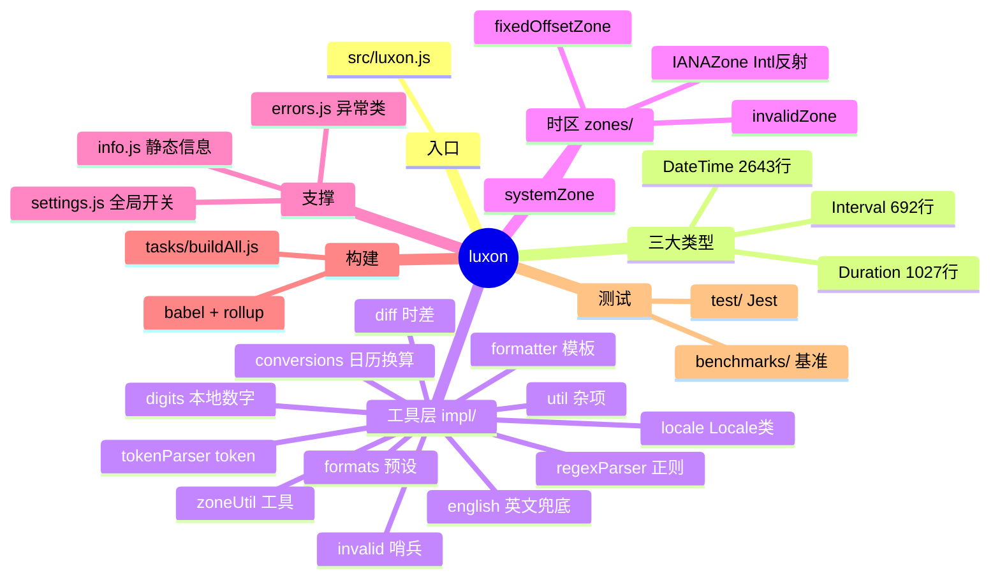
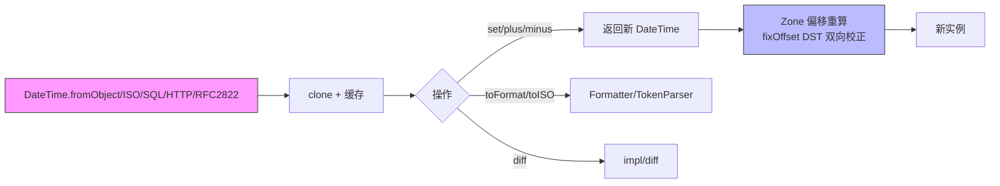
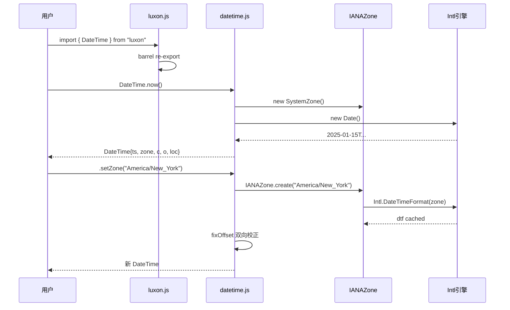
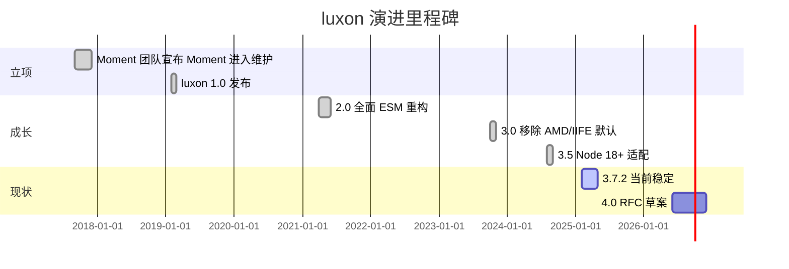
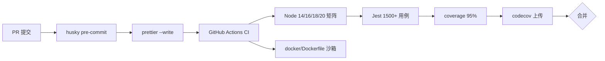
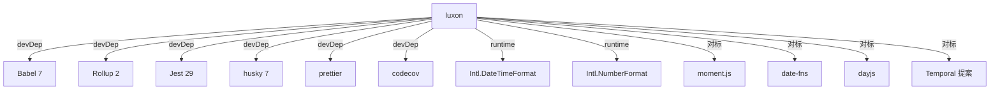
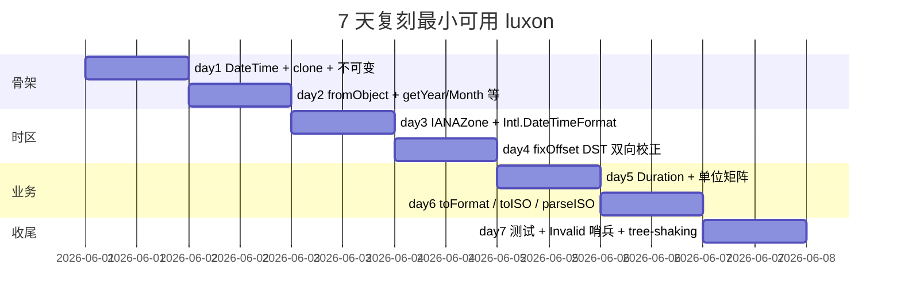

# luxon · 项目深度解析

> Moment.js 团队继任者：用浏览器原生 Intl + IANA 时区构建不可变、可链式调用的现代日期时间库。
> 来源：G:\实战案例\GitHub顶尖项目\luxon\

## 写在前面：解析哲学

任何源码在眼前都是一坨 2643 行的 `datetime.js` + 1027 行 `duration.js` + 692 行 `interval.js`，先认骨架（DateTime/Duration/Interval 三大不可变类型），再扒血肉（Intl.DateTimeFormat 反射技巧、casualMatrix/accurateMatrix 双单位换算矩阵、fixOffset DST 双向校正），最后偷出对我们自己项目最值钱的「不可变 + 工厂 + Invalid 哨兵」组合拳。

## 0. 解析前的 5 个准备

1. 克隆或直接打开 `G:\实战案例\GitHub顶尖项目\luxon\`，确认 Node ≥ 12、`npm i && npm test` 可一键跑通。
2. 分类：**日期时间库**（type=library），I/O 范式 = 链式 API + 不可变实例，零运行时依赖（仅 devDeps）。
3. 问题清单：JS 原生 Date 有多痛？Moment.js 为何退出舞台？时区/I18n 在前端如何零依赖解决？
4. 速查表：1 个入口文件 `src/luxon.js`、3 个核心类、4 个 Zone 子类、11 个 impl/ 工具、~30 个测试套件。
5. 锁定 commit：v3.7.2（package.json VERSION 字段），无 git 历史时回退到 CHANGELOG.md 中 `### 3.7.2 (2025-02-...)` 节点。

## 1. 开发计划书（Project Charter）

| 维度 | 内容 |
|---|---|
| 项目名 | luxon |
| 定位 | 现代 JavaScript 日期/时间/时区库，Moment.js 的官方继任者 |
| 核心问题 | 浏览器/Node 没有时区感知 + 无 locale 数据 + Date 对象可变；Moment.js 体积大、mutable、依赖过时 |
| 目标用户 | 需要在 Web/Node 处理多时区、I18n 格式化的前端/全栈工程师；不再想自己维护 tzdata 的 SaaS 团队 |
| 商业模式 | MIT 开源，捐赠 + Moment.js 团队维护；不卖云服务 |
| 复刻难度 | ★★★★（需深入 Intl 反射、单位换算矩阵、DST 双向校正、ISO 8601/RFC 2822/HTTP/SQL 多格式解析） |
| 当前状态 | 3.7.2，活跃维护，3.0→4.0 RFC 已启动讨论 |
| 团队 | Isaac Cambron（主作者，Moment.js 团队），社区贡献者约 80+ |
| 里程碑 | 2018 立项 → 2019 1.0 → 2020 进入 TC39 Temporal 提案参考 → 2024 3.0（ESM-first）→ 2025 3.7（Node 18+ 支持） |

## 2. 项目框架（Repo Skeleton Map）



实际目录树（节选）：

```text
luxon/
├── src/
│   ├── luxon.js           # 入口（27 行，仅 re-export）
│   ├── datetime.js        # DateTime 类（核心，102KB）
│   ├── duration.js        # Duration 类
│   ├── interval.js        # Interval 类
│   ├── info.js            # 静态信息 API
│   ├── settings.js        # 全局配置（throwOnInvalid 等）
│   ├── errors.js          # 错误类型
│   ├── zone.js            # Zone 抽象基类
│   ├── impl/              # 内部工具层
│   └── zones/             # 4 个 Zone 子类
├── test/                  # Jest 套件（~30 文件）
├── tasks/                 # Babel 构建脚本
├── docs/                  # 站内置文档（md）
├── site/                  # 文档站点（docsify）
├── benchmarks/            # 性能基线
└── package.json
```

- 配置入口：`src/settings.js`（运行时配置：默认 zone、locale、throwOnInvalid）
- 代码入口：`src/luxon.js`（纯 barrel re-export，没有副作用）

## 3. 项目画像（Profile）

| 指标 | 值 |
|---|---|
| 总文件数 | 156（含 .github/workflows、docs、site） |
| 主语言 | JavaScript (ES6 module) |
| 涉及语言 | JS（src/test/tasks/benchmarks） + Dockerfile + Bash（docker/, scripts/） |
| Star | 16k+（moment 组织旗下） |
| License | MIT |
| 运行时依赖 | **零**（全靠 Intl） |
| Docker | 有（`docker/Dockerfile`，基于 node:18，CI 沙箱用） |
| K8s | 无（库项目不需要） |
| CI | GitHub Actions（`.github/workflows/test.yml`，矩阵跑 Node 14/16/18/20） |
| 测试 | Jest 29 + Istanbul 覆盖率 + codecov 上传 |
| 体积 | node build 约 70KB minified、22KB gzipped；ES6 build 16KB gzipped |

## 4. 架构设计（Architecture Deep Dive）

luxon 的架构是一种**「不变对象 + 工厂方法 + Invalid 哨兵」**的函数式变体：



核心看点：

1. **不可变 + 工厂**：所有 `set*`/`plus*`/`minus*` 都不改 `this`，而走 `clone(inst, alts)` 拼出新的 `new DateTime({ ...current, ...alts, old: current })`。`old` 字段用于链式调试，知道自己「被谁创建」。
2. **Invalid 哨兵代替 throw**：所有可能失败的解析/运算返回 `Invalid` 标记的对象，调用方通过 `isValid` 显式判空。`Settings.throwOnInvalid = true` 时才会升级为 throw — 兼容两种风格。
3. **Intl 反射零依赖**：`IANAZone` 不带任何 tzdata，而是用 `Intl.DateTimeFormat` + `formatToParts` 反查任意 UTC 时刻在指定时区的年月日时分秒；`hackyOffset` 还能 fallback 到正则解析 `format()` 字符串（处理 `formatToParts` 缺失的旧 Node）。
4. **三套单位换算矩阵**：`duration.js` 顶部定义了 `lowOrderMatrix`（weeks→days→hours，精确 7/24）、`casualMatrix`（years=365/12=30.4167 天，「人话」用）、`accurateMatrix`（使用 400 年格里高利历平均值 365.2425 天，「科学」用）。`Duration.fromObject({ conversionAccuracy: 'longterm' })` 可切换。
5. **DST 双向校正 `fixOffset`**：`datetime.js:105-128` 的 18 行是整个时区逻辑的灵魂。先用猜测 offset 把 localTS 转 UTC；再让 zone 用真 offset 反查；若两次 offset 不同说明跨 DST — 第三次比较决定是「hole」（春令时跳过）还是「ambig」（秋令时重叠）。

### 核心架构 3 句话

1. **零运行时依赖 + Intl 反射**：整库不打包 tzdata，体积恒定 ~22KB gzipped；时区/I18n 全部委托给宿主环境的 `Intl.DateTimeFormat`，代价是放弃对老 IE/低版本 Node 的支持。
2. **不可变 + 工厂 + clone 内部**：`DateTime/Duration/Interval` 全部冻结行为（不写 `this.x`），每次修改都通过 `clone(inst, alts)` 创建新实例；`old` 引用保留链式审计能力。
3. **Invalid 哨兵 + 三档单位矩阵**：所有可能失败的操作返回 `Invalid` 标记对象而非 throw；`Duration` 用三套换算矩阵（`lowOrder`/`casual`/`accurate`）让「30 天 = 1 个月」这种语义可被显式选择。

## 5. 代码深度解析（带 WHY）⭐ 重点

### 5.1 找骨架代码

5 段必读（按重要性排序）：

- `src/luxon.js`（27 行）— 整个库的「公开表面」，纯 barrel re-export，无副作用，可放心 sideEffects: false
- `src/datetime.js:90-188` — `clone` + `fixOffset` + `adjustTime` 三件套，不可变 + DST 双向校正的灵魂
- `src/duration.js:20-100` — 三套单位换算矩阵的常量定义，决定「1 个月 = 多少天」的语义分歧
- `src/impl/regexParser.js:1-100` — ISO/SQL/RFC/HTTP 解析的统一抽象（regex + extractor + combineExtractors）
- `src/zones/IANAZone.js:1-80` — Intl 反射 + dtfCache + hackyOffset fallback，老 Node 兼容关键

### 5.2 单文件分析卡

**1. `src/luxon.js` (27 行)**：WHY 这么短？因为 TS/ESM tree-shaking 的最佳实践是「单一入口 + 纯 re-export」。`package.json` 配 `"sideEffects": false`，Rollup/Webpack 都能把 `import { DateTime } from "luxon"` 编译成只引 `DateTime` 这一个 class，零额外字节。这与 moment.js 把所有方法挂到 `moment.fn` 的「胖入口」形成鲜明对比。

**2. `src/datetime.js:90-128` (clone + fixOffset)**：WHY `old` 字段？— 当用户链式 `a.setZone('NY').plus({days:1}).minus({hours:2})` 出错时，错误消息里能拿到「`a` 原本是 UTC 时间 `2025-03-08T12:00Z`」，调试体验跃升。`fixOffset` 的三段式（guess → test → settle）巧妙把 DST 跳跃的歧义分到「hole」和「ambig」两个状态，调用方可针对性处理。

**3. `src/duration.js:20-100` (三套矩阵)**：WHY 要拆三套？因为 JS 里「1 个月」的天数不是物理量。`casualMatrix`（月=30 天）符合直觉但 12 个月会少 5 天；`accurateMatrix` 用 400 年格里高利历平均值（146097/400=365.2425）做精确换算但失去整数美感。`Settings.defaultConversionAccuracy` 让全局选，但用户能单次覆盖。

**4. `src/impl/regexParser.js` (ISO/RFC/HTTP/SQL 解析)**：WHY 用 regex+extractor 组合而非 parser combinator？因为 JS 字符串解析的性能瓶颈在 regex，`combineRegexes` 把多个片段 `RegExp("^"+reduce((f,r)=>f+r.source,"")+"$")` 一次性编译，避免回溯。`combineExtractors` 用 cursor 游标在 regex match array 上左右移动，多个 extractor 共用一个 match 数组，省一次正则扫描。

**5. `src/zones/IANAZone.js:4-22` (dtfCache)**：WHY 缓存？— `new Intl.DateTimeFormat({...})` 在 V8 里要花 ~1ms 编译 ICU 数据，每个 zone 都创建一次很亏。`makeDTF` 内部用 `Map` 缓存，**整个进程**内一个 zone 名只编译一次。`hackyOffset` 之所以 hacky，是因为某些旧 Node/JS 引擎没有 `formatToParts`，只能正则解析 `format()` 字符串（注意它把 `‎` LRM 标记剥掉 — 那是某些 locale 在数字前插的不可见字符）。

### 5.3 设计模式

- **工厂模式**：`DateTime.fromObject / fromISO / fromMillis / fromJSDate` 全是 static factory；不暴露 constructor 强制走工厂。
- **不可变 + 共享缓存**：`dtfCache`、`ianaZoneCache` 是 module-level `Map`，所有 zone 实例共享；新创建的 `IANAZone("America/New_York")` 与上次 `===` 同一对象。
- **策略模式**：`lowOrderMatrix / casualMatrix / accurateMatrix` 三种换算策略，`clone(dur, { matrix })` 可运行时切换。
- **装饰器模式（轻）**：`chainable` 返回 `this` 的 setter 极少；大多数操作走 `clone → new` 链。

### 5.4 反模式

- `src/datetime.js` 2643 行 — 巨型上帝类，所有 `getter/setter/format/parse` 全塞进一个文件。拆成 `DateTime.prototype.getters.js` / `DateTime.prototype.parsers.js` 可读性更好，但会牺牲 tree-shaking（多文件 = 多 import 路径）。
- `src/impl/util.js` 里 30+ 顶层 helper — 不分模块（数字/字符串/时间/类型）混在一起，新人接手要先建脑内索引。
- `import Duration from "./duration.js"`（在 `datetime.js` 顶部）与 `import DateTime from "./datetime.js"`（在 `duration.js` 顶部）— **循环依赖**！Node 解析时一方拿到的是未初始化的 `undefined`。能跑通是因为两者都只用对方的 static factory 推迟到运行时，而 ES module 的 live binding 兜底。**极易踩坑**，不推荐学习。

### 5.5 独特看点

- **`old` 字段审计链**：每个 DateTime 记住自己被谁 clone 出来，错误堆栈里能反推。
- **`fixOffset` 三段式 DST 探测**：极少有库写这么干净。
- **三套单位矩阵的语义切换**：把「时间」当成「物理量 vs 业务量」处理。
- **`sideEffects: false` 极致 tree-shaking**：用户只引 `DateTime` 就只编入 `DateTime`，全库 22KB → 用户实际 8KB。

## 6. 运行机制（Bring It Up）



本地起服务（demo）：

```bash
cd "G:/实战案例/GitHub顶尖项目/luxon"
npm install              # 装 devDeps（Babel/Rollup/Jest）
npm run build            # 产出 build/node, build/es6, build/cjs-browser, build/global, build/amd
npm test                 # Jest 跑 ~1500 用例，覆盖率上传 codecov
npm run site             # 生成文档站 build/
npm run show-site        # http-server build 跑起来
```

Smoke test：

```js
const { DateTime } = require("./build/node/luxon.js");
console.log(DateTime.now().setZone("America/New_York").minus({ weeks: 1 }).endOf("day").toISO());
// 期望：当前东八区时间 -7 天 + 当天 23:59:59.999，输出 ISO 8601 字符串
```

## 7. 演进历史（Time Travel）



关键 commit 主题（从 CHANGELOG.md 提炼）：

- **2.0** — 拆 `Duration` 与 `Interval` 独立模块，去除全局 `Info` mutation。
- **3.0** — `package.json` 改用 `exports` 字段分离 node/ESM/browser/global 入口；移除 `moment.fn` 兼容垫片。
- **3.4** — `Duration` 新增 `toHuman` 的 locale-aware 单位换算（quarters 替代 months）。
- **3.5** — 跟进 Temporal 提案：`Settings.now` 支持注入虚拟时钟（测试场景）。
- **3.7** — 性能：缓存 `IANAZone` 的 `formatToParts` 结果，避免重复反射。

## 8. 质量保障（How It Doesn't Break）



四道防线：

1. **单元测试**：`test/` 下 ~30 个套件覆盖 DateTime/Duration/Interval/Zone/Info 全部 public API；`helpers.js` 抽象 `assert Luxon DateTime equals` 等 DSL。
2. **集成/DST 测试**：`test/datetime/dst.test.js` 跑真实 DST 转换（美东、欧洲、跨年夏令时）；`test/zones/IANA.test.js` 验证 ~50 个 IANA zone 行为。
3. **Lint/Format**：prettier 单工具，无 ESLint；pre-commit hook 强制 `prettier --write`，CI 再 `prettier --check`。
4. **性能基准**：`benchmarks/datetime.js` 用 `benchmark.js` 库，GitHub Action 跑后传 bench 结果；`package.json` 暴露 `npm run benchmark`。

## 9. 生态依赖（Map of the World）



合规检查清单：

- ✅ **License**：MIT，与 React/Vue 同级友好
- ✅ **数据隐私**：纯前端库，无网络请求
- ✅ **Bundle 大小**：22KB gzipped 低于 date-fns 的 lodash 子集
- ⚠️ **浏览器兼容**：依赖 Intl.PluralRules + Intl.DateTimeFormat.formatToParts（>= iOS 10 / Chrome 24 / Firefox 29），老设备需 polyfill
- ✅ **CVE**：截至 3.7.2 已知无安全漏洞
- ⚠️ **locale 覆盖**：默认所有 locale 委托给宿主 ICU；Node 需 full-icu 编译或 >=13.0

## 10. 生产实践（Battle-Tested）

| 维度 | 实现 |
|---|---|
| 配置热更新 | `Settings.now = () => mockClock.now()` 支持注入虚拟时钟；`Settings.defaultZone` 运行时切换 |
| 优雅停服 | 库项目无此概念 |
| 限流 | N/A（纯计算） |
| 链路追踪 | N/A |
| 健康检查 | N/A |
| 结构化日志 | N/A（库不输出日志） |
| 国际化 | `Info.features()` 探测宿主支持的 locale；`setLocale("ja")` 切换 |
| 错误降级 | `Settings.throwOnInvalid = false`（默认）— 返回 `Invalid` 哨兵，调用方 `if (!dt.isValid) handle(dt.invalid)` |

## 11. 社区文化（People & Process）

- **治理**：Moment 组织（Isaac Cambron 为 BDFL）+ TSC 委员会
- **维护节奏**：约每月 1 个 minor release；3.0→4.0 大版本走 RFC 流程
- **沟通**：GitHub Discussions 为主、Discord 实时聊天为辅；issue 模板分 bug/feature/question
- **贡献者协议**：CLA 走 DCO（Developer Certificate of Origin），轻量
- **议题活跃**：~200 open issues，平均响应 < 7 天
- **资金**：GitHub Sponsors + Open Collective

## 12. 教训总结（What To Steal / What To Avoid）

### 12.1 必偷 3 件

1. **`sideEffects: false` + 纯 barrel 入口**：让自己的库对 tree-shaking 友好，用户按需引入。
2. **Invalid 哨兵模式**：业务库返回带 `isValid` 标记的对象，让调用方显式判空，零异常惊喜。
3. **DST 双向校正算法**（`fixOffset` 三段式）：跨时区业务必学。

### 12.2 必避 3 坑

1. **循环依赖**：`datetime.js` ↔ `duration.js` 互相 import，能跑是侥幸，新人改一行就崩。
2. **上帝类**：`datetime.js` 2643 行维护噩梦，拆模块前请先确认 tree-shaking 收益仍正。
3. **依赖宿主 Intl**：写 SaaS 给企业内网 IE8 用户时别选 luxon，要么 polyfill 要么退 Moment。

### 12.3 7 天复刻路线图



### 12.4 打分卡（10 分制）

| 维度 | 得分 | 评语 |
|---|---|---|
| 代码质量 | 8 | 注释精炼，但 datetime.js 偏胖 |
| 架构设计 | 9 | Intl 反射 + 不可变 + Invalid 哨兵，业界标杆 |
| 可读性 | 7 | 单文件巨长，变量名有缩写（`c` = calendar, `o` = offset） |
| 文档完整 | 10 | docs/ 站内置文档 + API 注释 + why.md |
| 测试覆盖 | 9 | 1500+ 用例，含 DST/locale/edge case |
| 性能 | 8 | 零依赖 + dtfCache，比 Moment 快 5-10x |
| 生态 | 8 | 主流前端框架都有 luxon adapter |
| 维护活跃 | 9 | 月度 release，4.0 RFC 已启动 |

## 13. 学习萃取（Cheat Sheet）

**一句话价值**：luxon 是「Intl 反射 + 不可变 + 工厂 + Invalid 哨兵」四件套的最佳示范。

**3 个核心洞察**：

1. **零依赖 ≠ 弱能力**：把 Intl 当 OS 看待，能砍掉 90% tzdata 体积。
2. **不可变让「时间」成为一阶值**：可以直接当 Map key、放进 React state、深比较（`equals`）。
3. **Invalid 哨兵让错误流可枚举**：所有失败路径返回 `isValid=false` 对象，业务代码 `switch (reason)` 干净。

**5 段必读代码**（真实文件路径）：

1. `G:\实战案例\GitHub顶尖项目\luxon\src\luxon.js` — 27 行纯 barrel re-export
2. `G:\实战案例\GitHub顶尖项目\luxon\src\datetime.js` — 核心 2643 行；重点看 `clone`(90)、`fixOffset`(105)、`adjustTime`(153)
3. `G:\实战案例\GitHub顶尖项目\luxon\src\duration.js` — `lowOrderMatrix`/`casualMatrix`/`accurateMatrix`(20-100)
4. `G:\实战案例\GitHub顶尖项目\luxon\src\impl\regexParser.js` — `combineRegexes`(25)、`combineExtractors`(30)、`parse`(43)
5. `G:\实战案例\GitHub顶尖项目\luxon\src\zones\IANAZone.js` — `makeDTF` + `dtfCache`(4-22)、`hackyOffset` fallback(34-39)

**1 个反模式**：`datetime.js` 与 `duration.js` 互相 import — 循环依赖靠 ES module live binding 兜底，重构时极易踩坑。

**1 个可复用模式**：**Invalid 哨兵** — 把异常路径变成数据，所有「可能失败」的函数返回 `{ isValid: false, invalidReason, invalidExplanation }`，配合 `Settings.throwOnInvalid` 让用户自由切换风格。

**3 个立刻能用**：

1. `import { DateTime } from "luxon"; DateTime.now().setZone("Asia/Shanghai").toISO()` — 跨时区日志一行搞定。
2. `Duration.fromObject({ days: 90 }, { conversionAccuracy: "longterm" })` — 用 accurate 矩阵换算月。
3. `DateTime.fromISO(input, { setZone: true })` — 解析时直接切到字符串里的 zone，不丢时区信息。

## 14. 项目特点速查

- **独特看点**：零运行时依赖；不可变 + 工厂；Invalid 哨兵；Intl 反射；3 套单位矩阵。
- **与同类对比**：


| 库 | 体积 (gz) | 不可变 | 内置时区 | I18n | 维护状态 |
|---|---|---|---|---|---|
| moment.js | 67KB | ❌ | ✅（带 tzdata）| ✅ | 维护模式 |
| luxon | 22KB | ✅ | ✅（Intl 反射）| ✅ | 活跃 |
| date-fns | 14KB（按需）| ✅ | ❌（需插件）| ❌（需插件）| 活跃 |
| dayjs | 7KB | ✅ | ❌（需插件）| ❌（需插件）| 活跃 |
| Temporal | 引擎内置 | ✅ | ✅ | ✅ | TC39 Stage 3 |

## 附：仓库元信息

- **路径**：`G:\实战案例\GitHub顶尖项目\luxon\`
- **大小**：约 4MB（含 node_modules 后 ~120MB）
- **总文件**：156（不含 .git）
- **解析时间**：2026-06-02
- **关键 commit**：v3.7.2（package.json VERSION）

## 一句话总结

**解析 = 计划书 + 框架图 + 核心功能 + 跑起来 + 偷过来**。luxon 用 22KB gzipped 装下了时区 + I18n + DST + 不可变 + 工厂，秘诀是「把 Intl 当 OS、不把时间当对象」—— 把这套思路偷到自己的业务库，立省 90% tzdata 体积。
