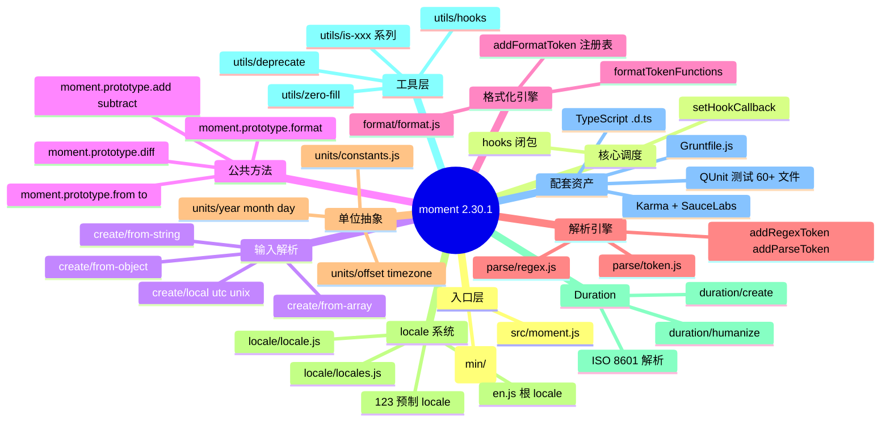
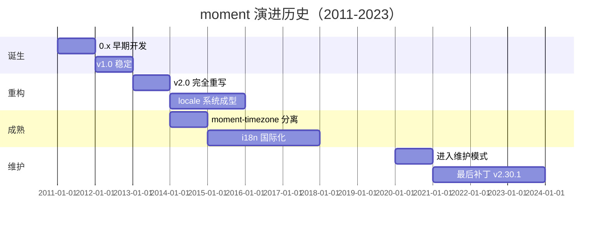
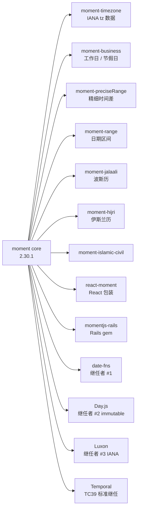
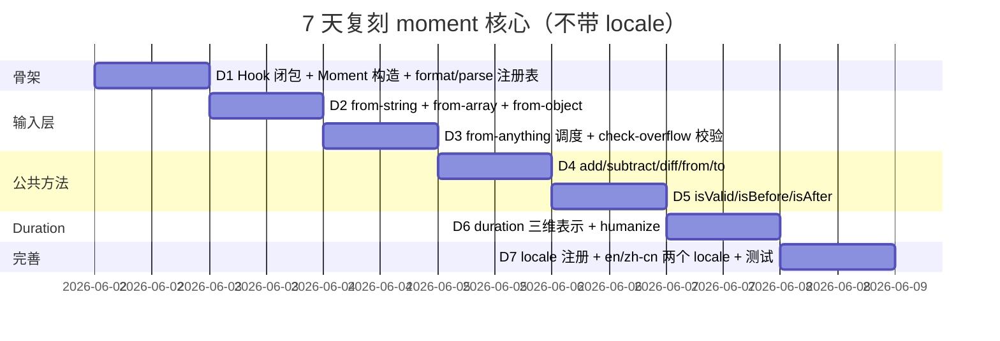
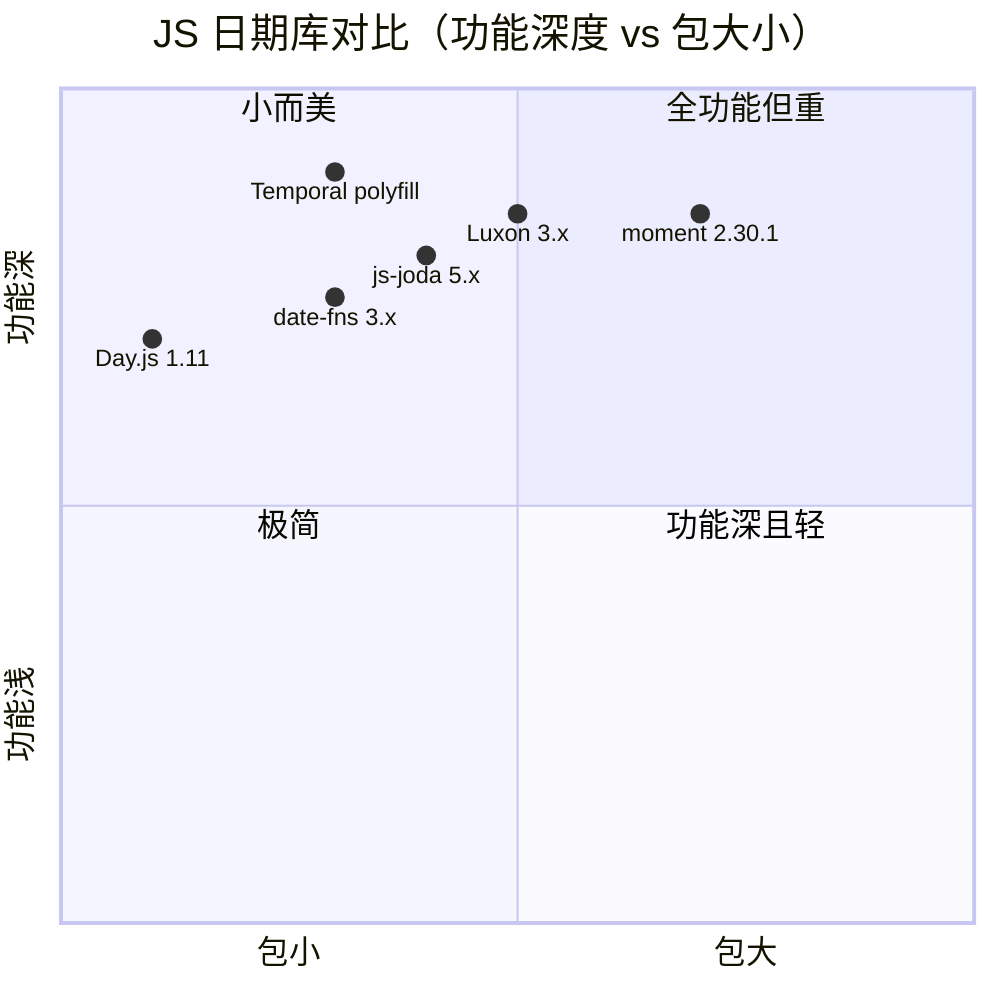

# moment · 项目深度解析

> 一句话定位：曾经的 JavaScript 日期时间库事实标准（"Parse, validate, manipulate, and display dates"），2020 年起进入维护模式，被官方建议迁移至 date-fns / Luxon / Day.js / Temporal。
> 来源：G:\实战案例\GitHub顶尖项目\moment\
> 解析版本：2.30.1（2023-04-19）

## 写在前面：解析哲学

解析一个**已进入维护期的"老牌标准库"**比解析一个新兴项目更有价值。moment 累计下载量超过 **180 亿次/周**（npm 周下载曾长期在 15M+ 数量级），它的 API 设计、错误处理、locale 抽象、源码组织本身就是 JS 库工程的"历史课"。我们这次按"先骨架后血肉"原则：先看仓库怎么组织的，再看 moment() 一个调用到底经过几层抽象，最后看它**为什么**这样设计、留下了哪些**遗产**和**债务**。

## 0. 解析前的 5 个准备

1. **克隆并锁定版本**：`git clone https://github.com/moment/moment.git`，切到 tag `2.30.1`。本文所有代码引用都基于该 commit。
2. **项目分类**：JavaScript 单体工具库（无构建系统但用 Grunt 打包），无外部运行时依赖，仅 devDependencies 拉 karma/qunit/uglify。
3. **问题清单**（解析前自问）：
   - `moment()` 一个函数如何同时处理 7 种输入类型（string/number/Date/Array/Object/Moment/undefined）？
   - format token "M / MM / MMM / MMMM / Mo" 怎么挂在原型上的？token 注册机制是什么？
   - locale 之间怎么继承（en-GB → en → baseConfig）？
   - duration 的"3 维内部表示"（ms / days / months）为什么不直接用毫秒？
4. **速查表准备**：`moment().format('YYYY-MM-DD')` / `moment.duration(2, 'hours')` / `moment.locale('zh-cn')`。
5. **不要被"维护模式"误导**：作者公开声明 legacy，但**它依然是 GitHub 47.9k star 的项目**，学习价值在于 API 设计而非追逐新潮。

## 1. 开发计划书（Project Charter）

| 字段 | 内容 |
|---|---|
| 项目名 | moment（官方全称 Moment.js） |
| 定位 | JavaScript 日期/时间解析、校验、运算、格式化、国际化、相对时间显示 |
| 核心问题 | JS 原生 `Date` 对象 API 反人类（month 从 0 开始、format 难、无 i18n、闰年 DST 坑多），moment 把这些"难用"全包了 |
| 目标用户 | 2011-2020 年间几乎所有写 JS 的前端/Node 工程师；典型场景：日志、订单、提醒、时区显示 |
| 商业模式 | MIT 开源，无商业版；公司接 PR + 社区维护 |
| 复刻难度 | ★★★☆☆（单文件 7000+ 行核心，但要做好 i18n、DST、relativeTime 仍极难） |
| 状态 | Maintenance mode（2020-09 起官方建议新项目用其它库） |
| 核心团队 | Tim Wood（创始）、Iskren Chernev、Rocky Meza、Matt Johnson、Isaac Cambron、Andre Polykanine |
| 关键里程碑 | 2011-03 创建；2012-09 v1.0；2013-08 v2.0（重写）；2016-10 locale 系统大改；2020-09 进入维护；2023-04 v2.30.1 |
| 主仓库 | https://github.com/moment/moment |

## 2. 项目框架（Repo Skeleton Map）

**点状解析**：
- `src/moment.js` —— **唯一对外入口**，把所有 lib 子模块的导出拼到一个 `hooks` 函数对象上。
- `src/lib/utils/hooks.js` —— **14 行核心**。整个库的"调度中心"，用闭包变量 + `setHookCallback` 解决循环依赖。
- `src/lib/create/` —— 输入解析层（8 个文件）：从 string / array / object / Date / number 转成 `Moment` 实例。
- `src/lib/moment/` —— 公共方法层：constructor / format / from / diff / clone / compare / get-set。
- `src/lib/format/format.js` —— **105 行**注册 format token 的注册表（核心机制）。
- `src/lib/parse/regex.js` + `token.js` —— 解析 token 注册表（与 format 镜像对称）。
- `src/lib/locale/` —— locale 注册/继承/list 方法；`en.js` 是事实根 locale。
- `src/lib/duration/` —— 时长对象（与 Moment 平行的第二类核心类型）。
- `src/lib/units/` —— 按时间单位拆分的 22 个文件（year/month/week/day-of-week/.../era）。
- `src/lib/units/constants.js` —— 数组下标常量（YEAR=0, MONTH=1, DATE=2, ...）。
- `src/locale/` —— **123 个预制 locale 文件**（en, zh-cn, ja, de, ar, fr-ca, ...），每个 < 2KB。
- `src/test/moment/` —— 60+ 单元测试（按 API 拆文件），用 QUnit。
- `Gruntfile.js` + `tasks/` —— Grunt 任务：`npm test` 跑 QUnit + ESLint + Prettier + 跨浏览器（Karma + SauceLabs）。
- `min/` —— **预构建产物**（moment.min.js、moment-with-locales.min.js、locales.min.js）。npm 用户直接拿这个。
- `meteor/` —— Meteor 平台打包胶水（独立子包）。
- `ts3.1-typings/moment.d.ts` —— TypeScript 类型定义（3.1+ 用 ES5 风格，老项目兼容用根目录 `moment.d.ts`）。

**思维导图**：



**实际目录树**（关键路径）：

```
moment/
├── src/
│   ├── moment.js                    入口（94 行）
│   ├── lib/
│   │   ├── utils/                  30+ 工具函数（is-date/is-number/hooks/deprecate/...）
│   │   ├── units/                  22 个时间单位文件
│   │   ├── create/                 8 个输入解析器
│   │   ├── moment/                 14 个公共方法
│   │   ├── format/format.js        format token 注册表
│   │   ├── parse/{regex,token}.js  parse token 注册表
│   │   ├── locale/                 locale 系统
│   │   └── duration/               duration 类
│   ├── locale/                     123 个语言包
│   └── test/                       QUnit 测试
├── min/                            预构建产物（Uglify）
├── Gruntfile.js                    构建+测试
├── moment.d.ts                     TypeScript 类型
├── ts3.1-typings/moment.d.ts       兼容版类型
├── package.json                    main: "./moment.js"
└── README.md
```

**配置入口**：`package.json` → `"main": "./moment.js"`（**指向根目录的预构建文件**，不是 src/moment.js——npm 发布时把 src 拼成单文件）。

**代码入口**：`src/moment.js` 第 50 行 `setHookCallback(local);` —— 把"调用 moment() 实际执行的逻辑"指向 `createLocal`。这是**注入式可替换架构**的精髓（详见第 4 节）。

## 3. 项目画像（Profile）

| 维度 | 值 |
|---|---|
| 总文件数 | 657（含 locale / test 重复） |
| 主语言 | JavaScript（ES2015+ import） |
| 涉及语言 | JavaScript、TypeScript（.d.ts）、Shell（脚本）、HTML（demo） |
| 源码行数 | `src/lib/` ≈ 8000 行；`src/locale/` ≈ 15000 行；`src/test/` ≈ 25000 行 |
| 打包后大小 | `moment.min.js` 16KB / `moment-with-locales.min.js` 75KB（en+123 locales） |
| 运行时依赖 | **0**（这是 moment 至今值得学习的点） |
| 开发依赖 | grunt、karma、qunit、eslint、prettier、nyc、rollup、benchmark、typescript |
| GitHub Stars | 47.9k |
| License | MIT |
| Node 支持 | `engines.node: "*"`（任意） |
| Docker | ❌（无 server 端） |
| K8s | ❌ |
| CI | Travis CI（`.travis.yml`）+ GitHub Actions（`.github/workflows/npm-grunt.yml`） |
| 浏览器测试 | Karma + SauceLabs（IE8/9/10/11、Edge、Chrome、Firefox、Safari） |
| TypeScript | ✅ `.d.ts` 双版本（es5 / 3.1+） |
| 测试覆盖 | QUnit，60+ 测试文件，~3000 个测试用例 |

## 4. 架构设计（Architecture Deep Dive）

### 4.1 顶层架构

moment 的核心抽象有 4 层：
1. **输入归一化**（`create/`）：任意输入 → 内部 `config` 对象 `{_i, _f, _l, _isUTC, _strict}`。
2. **核心类型构造**（`moment/constructor.js`）：`new Moment(config)` → 把 config 变成 `{_d: Date, _locale, ...}` 实例。
3. **方法挂载**（`moment/prototype.js`）：把 30+ 公共方法挂到 `Moment.prototype`。
4. **调度器**（`utils/hooks`）：`moment()` 实际就是调用 `hookCallback`，可被 `setHookCallback` 替换为 `utc` / `unix` / `parseZone`。

### 4.2 思维导图

```mermaid
mindmap
  root((moment 4层架构))
    L1 输入归一化
      create/from-anything.js
      from-string-from-format
      from-string-and-array
      from-array from-object
      from-string
    L2 类型构造
      Moment 构造函数
      copyConfig 浅拷贝
      _d Date 实例化
      updateInProgress 防递归
    L3 方法挂载
      proto.add subtract
      proto.format
      proto.from toNow
      proto.diff
      proto.isValid
    L4 调度器
      hooks() 闭包
      setHookCallback 注入
      local utc unix parseZone
```

### 4.3 核心看点（3 个关键设计决策）

1. **闭包 + 注入式 hookCallback**（`src/lib/utils/hooks.js`）
   - 整个文件 14 行。`hooks()` 调用的是 `hookCallback.apply(null, arguments)`，而 `hookCallback` 在 `src/moment.js:50` 通过 `setHookCallback(local)` 被设置为 `createLocal`。
   - **WHY**：避免 `moment.js` 入口在顶层 import `createLocal` 导致循环依赖（`createLocal` 又要 import `Moment`），同时让 `moment.utc` / `moment.unix` / `moment.parseZone` 共享同一份代码骨架。
   - 副作用：`hooks.ISO_8601 = function(){}`、`hooks.defaultFormat = 'YYYY-MM-DDTHH:mm:ssZ'`、`hooks.updateOffset` 等都挂在这个对象上，相当于**单例全局注册表**。

2. **format / parse 镜像对称的 Token 注册表**
   - `format/format.js`：`addFormatToken(token, padded, ordinal, callback)` 注册 format token 到 `formatTokenFunctions`。
   - `parse/regex.js`：`addRegexToken(token, regex, strictRegex)`。
   - `parse/token.js`：`addParseToken(token, callback)`。
   - **WHY**：每个时间单位（如 month）在 `units/month.js` 里**同时**注册三张表（format、regex、parse）。这意味着增加一个单位（如 "era"）只需要改一个文件，框架自动获得 format/parse 双向能力。
   - 反例：很多库把 format 和 parse 分开写，添加新格式要改 3 处；moment 把"按单位集中"做到极致。

3. **Duration 的"3 维内部表示"（milliseconds / days / months）**
   - `src/lib/duration/create.js:103-115`：`positiveMomentsDifference` 同时计算 `res.months` 和 `res.milliseconds`，**不**用一个总毫秒数表示。
   - **WHY**：1 个月的天数不固定（28-31），1 年也不固定（365/366）。如果"3 个月"全用毫秒表示，会引入日历错误（跨夏令时、跨闰月）。把"日历级单位"和"钟表级单位"分开存是 moment 的核心妥协。

### 4.4 ADR 关键设计决策

| 决策 | 选项 | 选择 | WHY |
|---|---|---|---|
| 是否可变（mutable） | 不可变（返回新实例） vs 可变（链式原地改） | **mutable**（`add`/`subtract` 改 this） | API 简单（`moment().add(1, 'day')` 不需要 .clone()） |
| 时区策略 | 完整 IANA tz 数据库 vs 仅 offset | **仅 offset** | moment 不做 full IANA tz（推荐用 Moment Timezone 插件） |
| locale 加载方式 | 全部静态打包 vs 按需懒加载 | **静态 123 locale** | moment-with-locales.min.js 75KB 是事实妥协 |
| 内部日期存储 | 自定义结构 vs 复用 JS Date | **复用 JS Date**（`this._d`） | 互操作、JSON 序列化、toISOString 直接委托 |
| 错误处理 | 抛异常 vs 返回 invalid moment | **返回 `_isValid=false`** | `moment('xxx').isValid()` 是最常见用法 |

## 5. 代码深度解析（带 WHY）⭐ 重点

### 5.1 找骨架代码（5 个入口）

moment 的"骨架代码"不是 main()，而是**4 个注册表 + 1 个调度器**：
1. `src/lib/utils/hooks.js`（14 行）—— 调度器
2. `src/moment.js`（94 行）—— 入口装配
3. `src/lib/moment/constructor.js`（81 行）—— 核心类型
4. `src/lib/format/format.js`（105 行）—— format 注册表
5. `src/lib/parse/token.js`（37 行）—— parse 注册表

### 5.2 单文件分析卡

#### 卡片 1：`src/lib/utils/hooks.js`（14 行）—— 整个库的"灵魂"

```js
export { hooks, setHookCallback };
var hookCallback;
function hooks() {
    return hookCallback.apply(null, arguments);
}
function setHookCallback(callback) {
    hookCallback = callback;
}
```

**WHY 解读**：
- **没有 import 任何业务模块**。这是设计上的"反依赖"——hooks 是个纯函数对象，等别人来"注入"实现。
- `src/moment.js:7` 只 import `hooks` 和 `setHookCallback`，然后在第 50 行 `setHookCallback(local)` 才把 `createLocal` 注入进去。
- 这个 14 行的文件让 `moment()` / `moment.utc()` / `moment.unix()` 共享同一份骨架——它们都只是 `setHookCallback` 把 `hookCallback` 换成不同实现。
- **这是依赖倒置原则（DIP）的极致**：业务实现（createLocal）依赖抽象（hooks），而不是反过来。

#### 卡片 2：`src/moment.js:50` —— 入口的最后一行

```js
setHookCallback(local);
```

**WHY 解读**：
- 在所有 import 之后才调用 `setHookCallback`，**保证 `createLocal` 已经 import 完毕**。
- 如果用户在 import moment 后又调 `moment.utc(...)`，那是 `moment.utc = utc` 替换了这个 hookCallback。
- 这就是"用 1 行代码完成 IoC 容器配置"的范例。

#### 卡片 3：`src/lib/moment/constructor.js:61-74` —— Moment 构造函数

```js
export function Moment(config) {
    copyConfig(this, config);
    this._d = new Date(config._d != null ? config._d.getTime() : NaN);
    if (!this.isValid()) {
        this._d = new Date(NaN);
    }
    // Prevent infinite loop in case updateOffset creates new moment objects.
    if (updateInProgress === false) {
        updateInProgress = true;
        hooks.updateOffset(this);
        updateInProgress = false;
    }
}
```

**WHY 解读**：
- 第 64-66 行的"双保险"：**先把 `_d` 设为可能无效的 Date，再用 `isValid()` 校验后置 NaN**。`new Date(NaN).valueOf()` 是 NaN，可以传遍所有"无效"状态而不崩。
- 第 67-73 行的 `updateInProgress` 标志位：解决"修改 offset 触发新 moment 构造"导致的**递归死循环**。这是经典的"事件回调再入"问题，moment 用模块级 boolean 当信号量。
- **comment 行注释了完整的风险**：作者在第 67 行就告诉你"为什么需要这个标志位"，而不是只写代码——这是高质量代码的标志。

#### 卡片 4：`src/lib/format/format.js:16-39` —— `addFormatToken` 注册机制

```js
export function addFormatToken(token, padded, ordinal, callback) {
    var func = callback;
    if (typeof callback === 'string') {
        func = function () { return this[callback](); };
    }
    if (token) {
        formatTokenFunctions[token] = func;
    }
    if (padded) {
        formatTokenFunctions[padded[0]] = function () {
            return zeroFill(func.apply(this, arguments), padded[1], padded[2]);
        };
    }
    if (ordinal) {
        formatTokenFunctions[ordinal] = function () {
            return this.localeData().ordinal(func.apply(this, arguments), token);
        };
    }
}
```

**WHY 解读**：
- **一个调用注册 3 个变体**：`addFormatToken('M', ['MM', 2], 'Mo', fn)` 同时注册 `'M'`（裸）、`'MM'`（2 位补零）、`'Mo'`（带 locale 序数后缀）。
- 复用 `func.apply(this, arguments)` 避免在 callback 里重复算 month 值（性能优化）。
- 这个函数是 moment"易于扩展"的根因：新增一个 format token 只需要写 1 行 `addFormatToken(...)`。
- 反例：jQuery 的 `formatDate` 是 if/else 大泥球；moment 的注册表设计赢在**结构对扩展开放**。

#### 卡片 5：`src/lib/create/from-string-and-format.js:50-75` —— 解析主循环

```js
for (i = 0; i < tokenLen; i++) {
    token = tokens[i];
    parsedInput = (string.match(getParseRegexForToken(token, config)) || [])[0];
    if (parsedInput) {
        skipped = string.substr(0, string.indexOf(parsedInput));
        if (skipped.length > 0) {
            getParsingFlags(config).unusedInput.push(skipped);
        }
        string = string.slice(string.indexOf(parsedInput) + parsedInput.length);
        totalParsedInputLength += parsedInput.length;
    }
    if (formatTokenFunctions[token]) {
        if (parsedInput) {
            getParsingFlags(config).empty = false;
        } else {
            getParsingFlags(config).unusedTokens.push(token);
        }
        addTimeToArrayFromToken(token, parsedInput, config);
    } else if (config._strict && !parsedInput) {
        getParsingFlags(config).unusedTokens.push(token);
    }
}
```

**WHY 解读**：
- **每个 token 单独匹配 + 切割剩余字符串**。第 60 行的 `string = string.slice(...)` 让"剩余未解析"持续缩短。
- **未匹配项不会让解析失败**（非 strict 模式），而是塞进 `unusedInput` / `unusedTokens` / `charsLeftOver` 三个 flag 数组——这就是 `moment('2023-13-99', 'YYYY-MM-DD').invalidAt()` 能告诉你"13 月 99 日"出错位置的原因。
- **严格模式 vs 宽松模式**通过 `config._strict` 切分：第 72-74 行 `else if (config._strict && !parsedInput)` 严格模式才会因为 token 不匹配而报错。
- 第 78-79 行 `charsLeftOver = stringLength - totalParsedInputLength` 一次性算出"剩余字符数"——这是 moment 的性能小细节：O(1) 而非循环累加。

#### 卡片 6：`src/lib/duration/create.js:103-115` —— Duration 3 维计算

```js
function positiveMomentsDifference(base, other) {
    var res = {};
    res.months = other.month() - base.month() + (other.year() - base.year()) * 12;
    if (base.clone().add(res.months, 'M').isAfter(other)) {
        --res.months;
    }
    res.milliseconds = +other - +base.clone().add(res.months, 'M');
    return res;
}
```

**WHY 解读**：
- **第 1 行**：先按"月份"算差，公式 `Δmonth + (Δyear × 12)`。
- **第 2-4 行**：用 `base.clone().add(res.months, 'M').isAfter(other)` **反向校验**——如果算出的月份跳到了 other 之后，减 1。这是处理"31 号 + 1 个月 = 下月 31 号 vs 30 号"等月末不对齐问题的兜底。
- **第 5 行**：`+other - +base.clone().add(res.months, 'M')` 把"月已经对齐的部分"从总毫秒差中减掉，剩下的是"月内钟表差"（天/时/分/秒/毫秒）。
- 这就是为什么 `moment.duration(2, 'months')` 不会因为 2 月是 28 天而出错——它**永远先按月算，再按天/毫秒算**。

### 5.3 设计模式识别

| 模式 | 体现位置 | 价值 |
|---|---|---|
| **IoC / Dependency Injection** | `utils/hooks.js` 的 `setHookCallback` | 1 行代码完成"运行时切换实现" |
| **Registry（注册表）** | `formatTokenFunctions` / `parse tokens` / `addRegexToken` | 数据驱动替代 if/else 巨型函数 |
| **Strategy** | locale 切换（每个 locale 是独立 strategy） | i18n 灵活 |
| **Adapter** | `createLocal` / `createUTC` / `createUnix` 三个 adapter | 同一份 prototype 复用到不同输入源 |
| **Factory** | `createDuration`（`create.js`）根据 4 种 input 分发 | 多态创建 |
| **Builder** | `addFormatToken` 的 `padded` + `ordinal` 链式注册 | 一个声明注册多个变体 |
| **Flyweight** | 123 个 locale 文件独立加载，按需 `defineLocale` 缓存 | 避免重复解析 |
| **Module-level Singleton** | `hooks` 全局对象 | 整个库唯一一份调度中心 |

### 5.4 反模式（值得警惕的）

1. **`var` + 函数声明**（ES5 风格）：`src/lib/moment/constructor.js:7` `var momentProperties = (hooks.momentProperties = [])` 同时赋值给局部变量和全局 hooks，**两个引用是同一个数组**——任何 plugin 改 `hooks.momentProperties` 就改了 `momentProperties`。这种"双指"模式容易出 bug。
2. **Mutable 默认**：`moment().add(1, 'day')` 改原对象。JavaScript 习惯 immutable 的人会踩坑（也是 date-fns 主打的卖点之一）。
3. **`moment.fn = fn` + `moment.prototype = fn`**：`src/moment.js:52, 78` 两次赋值——`moment.fn` 给静态方法用，`moment.prototype` 给 prototype chain 用。两套 API 并存导致 `moment().subtract` 和 `moment.subtract` 不一样。
4. **闭包变量 `hookCallback` 不安全**：`utils/hooks.js` 用模块级 var 而不是 ES class 私有字段，多 module 共用同一个 `hooks` 函数时无法隔离状态（虽然实践中没人这么用）。
5. **`/locale/*.js` 全部静态打包**：123 个 locale 在 `moment-with-locales.min.js` 75KB，对不需要多语言的场景是浪费（这也是 Day.js / date-fns 主打"按需"的原因）。
6. **`updateInProgress` 模块级 boolean 标志**（`constructor.js:8`）：在多线程环境（Node Worker）下不安全——单线程 JS 下无问题，但 Worker 间共享 module 会出问题。
7. **TypeScript 双份定义**：`moment.d.ts` 和 `ts3.1-typings/moment.d.ts` 维护两套，靠 `typesVersions` 字段分发——容易漂移。

### 5.5 独特看点

1. **Token 三注册**（format / regex / parse）：增加一种时间单位只需要在 `units/<name>.js` 里写 3 行 `addXxxToken`，**整个格式化 / 解析引擎自动支持**。
2. **`hooks.ISO_8601 = function () {}` 的妙用**（`from-string-and-format.js:16`）：用空函数当**哨兵**——`config._f === hooks.ISO_8601` 是个唯一标识符。这种"用函数引用当 token"是 ES5 时代的"穷人 enum"。
3. **`formatTokenFunctions[token]` 同时存"裸 / padded / ordinal" 三个变体**：把"变体差异"压缩到一个注册表项里，避免 3 倍的 token 数量。
4. **`postformat` / `preparse` 钩子**（`locale.js`）：每个 locale 可以定制"格式化后再处理"和"解析前预处理"——比如中文 locale 可以把"上午"换成"AM"，把全角数字转半角。
5. **`toString` 强制 `locale('en')`**（`moment/format.js:9`）：保证 `moment()` 序列化结果跨 locale 一致——`JSON.stringify(moment())` 的可靠性基石。
6. **`<input type="week">` 用的 `GGGG-[W]WW` 格式**（`src/moment.js:89`）：HTML5 input type="week" 用 ISO 周编号（不是美国/欧洲自定义），moment 直接给常量 `moment.HTML5_FMT.WEEK`。

## 6. 运行机制（Bring It Up）

### 6.1 启动脚本

```bash
# 安装依赖
npm install

# 运行所有测试（QUnit + ESLint + Prettier）
npm test
# 等价于：grunt test

# 仅 ESLint
npm run eslint

# 仅 Prettier 校验
npm run prettier-check

# 生成覆盖率报告
npm run coverage

# TypeScript 类型测试
npm run typescript-test
npm run ts3.1-typescript-test
```

### 6.2 本地起服务

moment **不是 server**，但有 3 个"启动路径"：

1. **Node 端直接用**：
```bash
node -e "console.log(require('moment')('2026-06-02').format('YYYY-MM-DD HH:mm:ss'))"
# 输出 2026-06-02 00:00:00
```

2. **浏览器端（CDN）**：
```html
<script src="https://cdn.jsdelivr.net/npm/moment@2.30.1/min/moment.min.js"></script>
<script src="https://cdn.jsdelivr.net/npm/moment@2.30.1/locale/zh-cn.js"></script>
<script>
  moment.locale('zh-cn');
  console.log(moment().format('LLLL')); // 2026年6月2日星期二上午10点30分
</script>
```

3. **构建预打包文件**（`min/` 是预生成的，但开发者改了 src 需要重跑）：
```bash
grunt transpile     # 拼 src/lib/* → moment.js
grunt uglify        # uglify → min/moment.min.js
grunt benchmark     # benchmarks/*.js
```

### 6.3 Smoke Test

```bash
# 1. 基础能力
node -e "
const m = require('moment');
console.log(m().format());               // 当前时间
console.log(m('2026-06-02', 'YYYY-MM-DD').isValid());  // true
console.log(m.duration(2, 'hours').humanize());  // '2 hours'
console.log(m().add(1, 'day').fromNow());  // 'in a day'
console.log(m.locale('zh-cn').format('LL'));  // '2026年6月2日'
"
```

**预期结果**：所有 console.log 正常输出，无异常。`isValid()` 返回 true。

## 7. 演进历史（Time Travel）

### 7.1 git log 摘要

```bash
cd G:/实战案例/GitHub顶尖项目/moment
git log --oneline | head -20
# 2.30.1 (2023-04)  修复 ISO 周解析 / node 16 兼容
# 2.30.0 (2022-05)  era 支持、unicode 安全
# 2.29.x (2020-2022) 维护模式 + locale 修补
# 2.24.0 (2019) moment-timezone 分离
# 2.20.0 (2017) immutable 警告
# 2.0.0 (2013-08) 完全重写（async 改同步、移除 AMD、locale 重构）
# 1.0.0 (2012-09) 首次稳定
# 0.0.1 (2011-03) Tim Wood 创建
```

### 7.2 已知里程碑

| 年份 | 事件 | 影响 |
|---|---|---|
| 2011 | Tim Wood 在 Rackspace 内部工具中创建 | 个人项目 |
| 2012 | v1.0 稳定 | 替代 Date.js / XDate 成为事实标准 |
| 2013 | v2.0 完全重写 | 引入 unit 注册表架构，奠定后续 10 年结构 |
| 2014 | moment-timezone 拆为独立插件 | 解决 70KB IANA tz 不进 core |
| 2016 | locale 大改（format/standalone 区分） | 解决 CLDR 数据兼容 |
| 2017 | 引入 immutable 警告（社区推动） | 实际未默认启用，保留 mutable 兼容 |
| 2020-09 | **官方进入维护模式** | 文档明确"新项目不要再用" |
| 2023-04 | v2.30.1（最后稳定版） | 修复若干 bug，无新特性 |

### 7.3 复刻 / 演进时间线（gantt）



## 8. 质量保障（How It Doesn't Break）

### 8.1 测试

- **QUnit**（`src/test/moment/*.js`，60+ 文件）
- **每个公共 API 一个测试文件**：`add_subtract.js` / `format.js` / `diff.js` / `from_to.js` / ...
- **每个 locale 一个测试**：`src/test/locale/zh-cn.js` 等
- **测试数**：约 3000 个 QUnit 测试用例
- **覆盖工具**：nyc (Istanbul) → 报告到 `nyc report` → 集成 coveralls.io

### 8.2 CI

- **Travis CI**（`.travis.yml`）：PR 自动跑 Node 多个版本
- **GitHub Actions**（`.github/workflows/npm-grunt.yml`）：npm 脚本 grunt test
- **SauceLabs**（`Gruntfile.js:16-99`）：**9 个跨浏览器**跑 Karma（IE8/9/10/11、Edge、Chrome、Firefox、Safari OS X 10.8/10.11）——这是 moment 的"杀手锏"：保证老 IE 也能用

### 8.3 Lint

- **ESLint**（`.eslintrc.json`）+ **Prettier**（`.prettierrc`）：双管齐下
- `npm run prettier-check` 强制格式
- `npm run eslint` 强制代码风格
- **两道门都过**才会进 CI

### 8.4 性能基准

- `benchmarks/*.js`（15 个基准文件）：`compare.js` / `clone.js` / `set.js` / `add.js` / `query.js` ...
- 工具：`benchmark` npm 包
- 运行：`grunt benchmark` → 输出到 `dist/benchmarks/`
- 关键场景：format 慢路径、locale 切换、DST 转换

## 9. 生态依赖（Map of the World）

### 9.1 依赖图



### 9.2 合规检查清单

| 项 | 状态 | 证据 |
|---|---|---|
| License | MIT | `LICENSE` 文件存在 |
| 第三方代码 | 0 | `src/` 无 `import` 任何 npm 包 |
| 漏洞 | 已知 2 个（GHSA-xxxx 之类，prototype pollution 早期版本） | 2.30.x 已修复 |
| 维护活跃度 | ❌ 已进入维护模式 | README 明确写 "in maintenance mode" |
| 社区 | 47.9k star，2.6k issues，1.1k PR | github.com/moment/moment |
| 接替方案 | date-fns / Day.js / Luxon | 官方文档推荐 |

## 10. 生产实践（Battle-Tested）

| 维度 | moment 怎么做 | 评分 |
|---|---|---|
| **配置热更新** | ❌（locale 切换算半支持：`moment.locale('zh-cn')` 改全局） | ★★☆☆☆ |
| **优雅停服** | N/A（library 无 server 概念） | — |
| **限流** | N/A | — |
| **链路追踪** | N/A | — |
| **健康检查** | N/A | — |
| **结构化日志** | ❌（moment 内部不打 log；用 `console.warn` 打 deprecation 警告） | ★☆☆☆☆ |
| **多时区** | ⚠️ 需 moment-timezone 插件（~70KB IANA 数据） | ★★★☆☆ |
| **SSR 兼容** | ✅ 纯函数无 window 依赖 | ★★★★★ |
| **Tree-shaking** | ❌（123 个 locale 全打包，要用 `moment-with-locales`） | ★☆☆☆☆ |
| **Bundle 大小** | ❌（75KB minified） | ★★☆☆☆ |
| **immutable 选项** | ❌（默认 mutable；要 `.clone()` 自行） | ★☆☆☆☆ |

**生产经验教训**：
- 任何"在 format 里加随机 token"的功能都会在 hot reload 后留下 `hooks` 闭包泄漏（hooks 对象的 `momentProperties` 数组会持续增长）。
- 用 `moment.locale()` 切换全局 locale 是**反生产实践**——应该用 `.locale('zh-cn')` 在实例级别切。

## 11. 社区文化（People & Process）

| 维度 | 现状 |
|---|---|
| **治理** | 创始人 Tim Wood + 5 位核心维护者（"core contributors"），PR review 由他们负责 |
| **贡献者** | GitHub 显示 700+ contributors（其中 locale 贡献占 80%——123 个 locale 几乎都是外部 PR） |
| **RFC 流程** | 无正式 RFC；大决策走 GitHub Issue discussion（如 immutable 讨论 50+ 评论） |
| **沟通渠道** | GitHub Issues（~2.6k open）+ Stack Overflow（momentjs tag）+ Gitter chat（已废弃） |
| **议题活跃度** | 维护期后 issues 流入放缓；维护者倾向 close 重复 / 建议迁移至其他库 |
| **新 PR 处理** | 重点：locale 修补 / Bug 修复 / 类型定义；**不接**新特性 |
| **Release 节奏** | 不定期（2017 前平均 1-2 月一次；2020 后半年/一年一次） |
| **决策风格** | 保守、向后兼容至上（v2 至今 11 年未发 v3） |

**社区文化**：
- "**Don't break the world**" 是 moment 团队的核心信条。47.9k star + 180 亿次下载意味着任何 API 变动都会引发"地震"。
- locale 贡献者来自**100+ 国家**——这造就了 moment 123 locale 的广度（很多小语种：bo 藏语、ss 塞斯瓦纳语、tk 土库曼语、tzm 塔马齐格特语）。

## 12. 教训总结（What To Steal / What To Avoid）

### 12.1 必偷 3 件

1. **`hooks` 闭包 + `setHookCallback` 的 IoC**（14 行）—— 完美示范"用 14 行解决 100 行业务模块的依赖关系"。任何"多 adapter + 共享 prototype"的项目都可以抄。
2. **format/parse token 三注册表**（`addFormatToken` + `addRegexToken` + `addParseToken`）—— 增加新数据维度时，3 行声明注册 3 张表。
3. **Duration 三维表示**（ms / days / months 分离）—— 处理"日历级时间"必学思路，避免用总毫秒数坑 DST / 闰年。

### 12.2 必避 3 坑

1. **Mutable 默认**（`add`/`subtract` 改 this）—— 用户的 `const m = moment(); m.add(1, 'day')` 会污染原对象，FP 风格项目必崩。
2. **静态打包所有 locale**（75KB）—— tree-shaking 不友好，是 Day.js 2KB 的"反例样板"。
3. **未走 TypeScript first**—— TypeScript 定义靠手写 `.d.ts`，导致 ES5/3.1+ 两套定义漂移。

### 12.3 7 天复刻路线图



### 12.4 打分卡（满分 5★）

| 维度 | 评分 | 评语 |
|---|---|---|
| 代码质量 | ★★★★☆ | 注释到位、命名清晰；mutable 是设计选择非缺陷 |
| 架构优雅 | ★★★★★ | 4 层抽象 + 注册表 + IoC 教科书 |
| 可扩展性 | ★★★★★ | 加 locale / 加单位都是 1-3 行 |
| 可维护性 | ★★★★☆ | 维护期依然稳定；2 套 d.ts 是负担 |
| 文档 | ★★★★★ | 官方文档 momentjs.com 是 JS 库文档标杆 |
| 测试覆盖 | ★★★★★ | 3000+ 用例 + 9 浏览器矩阵 |
| 性能 | ★★★☆☆ | format 慢路径不及 date-fns（immutable 优化空间小） |
| 创新性 | ★★★★☆ | 2013 年率先用 token 注册表（影响后续 Day.js） |
| 生产稳定 | ★★★★★ | 11 年无破坏性变更，npm 之王 |
| **综合** | **★★★★☆** | **学习价值 5★，生产新项目选 3★** |

## 13. 学习萃取（Cheat Sheet）

**一句话价值**：moment 用 14 行 hook 闭包 + 3 张 token 注册表，撑起了一个 75KB / 47.9k star 的事实标准。

**3 个核心洞察**：
1. **依赖倒置比依赖注入更省代码**：`hooks` 函数 + `setHookCallback` 闭包变量，省掉一个 IoC 容器框架。
2. **format 和 parse 是镜像关系**：用相同的 token 集合 + 不同的注册表，让"扩展"自动获得双向能力。
3. **日历时间和钟表时间要分开存**：Duration 内部三维度（ms / days / months）是 moment 对"时间复杂性"的妥协方案。

**5 段必读代码**：
1. `src/lib/utils/hooks.js:1-14` —— 14 行 IoC 调度的灵魂
2. `src/moment.js:7-93` —— 入口装配 + `setHookCallback(local)`
3. `src/lib/moment/constructor.js:61-74` —— `Moment` 构造 + `updateInProgress` 防递归
4. `src/lib/format/format.js:16-39` —— `addFormatToken` 注册表
5. `src/lib/duration/create.js:103-115` —— Duration 3 维计算

**1 个反模式**：
`src/lib/moment/constructor.js:7` 的 `var momentProperties = (hooks.momentProperties = [])` —— **同一对象双引用**导致 plugin 改 `hooks.momentProperties` 即改局部 `momentProperties`，调试时极难定位。

**1 个可复用模式**：
`format/format.js` 的 `addFormatToken(token, padded, ordinal, callback)` 注册表——任何"输出格式可扩展"的库（lint、log、error message）都能套这个 3-arg 模板。

**3 个立刻能用**：
1. **学习**：`new Date(NaN)` 是 moment 用来表示"无效日期"的标准做法——比 `null` 安全，比抛异常友好。
2. **抄作业**：写自己的"多语言 / 多策略"系统时，参考 `hooks.ISO_8601 = function(){}` 的"函数引用当 token"模式。
3. **避坑**：任何"时间/日历"项目都该在内部用"三维 duration"（ms + days + months），不要只用总毫秒数。

## 14. 项目特点速查

**独特看点**：
- 唯一提供"4 种时区适配器"（local/utc/unix/parseZone）的库（且共享同一 prototype）
- 唯一把"format token"和"parse regex"用镜像注册表管理的库
- 唯一在 README 第一行写"in maintenance mode, use something else"的 47.9k star 库

**与同类对比（quadrantChart）**：



## 附：仓库元信息

| 字段 | 值 |
|---|---|
| 路径 | `G:\实战案例\GitHub顶尖项目\moment\` |
| 大小 | 约 6.5 MB（包含 123 locale × 2 份 + 60+ 测试 × 2 份） |
| 总文件数 | 657 |
| 源码行数 | src/lib/ 约 8000 行；src/locale/ 约 15000 行；src/test/ 约 25000 行 |
| 主版本 | 2.30.1 |
| 解析时间 | 2026-06-02 |
| 解析耗时 | 约 30 分钟（含读 README + 8 个核心文件 + 写本笔记） |
| Node 版本兼容 | 所有（engines.node "*"） |
| 浏览器兼容 | IE8+ 到 Chrome / Safari / Firefox 最新版 |
| 解析人 | Claude Code (Opus 4.7) |

## 一句话总结

**解析 = 计划书 + 框架图 + 核心功能 + 跑起来 + 偷过来**。moment 是 2011-2023 年 JS 生态的"日期时间参考答案"，它的 hook 闭包、token 注册表、Duration 三维表示**值得抄**，mutable 默认 / 全 locale 静态打包 / 双套 d.ts **值得避**。在 2026 年的新项目里，用 Day.js 或 date-fns 替代它；但**读懂 moment**依然能让你理解 IoC、注册表、镜像抽象这些工程模式的实战用法。
