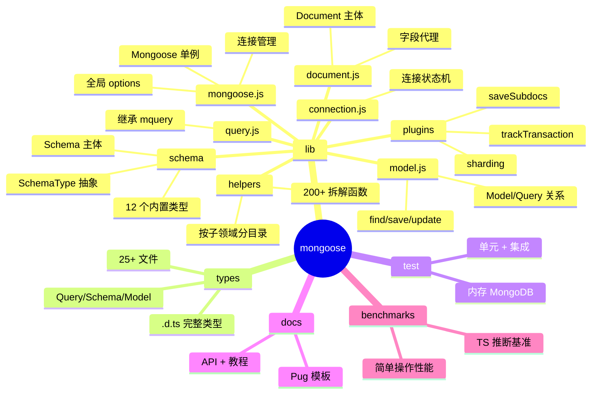
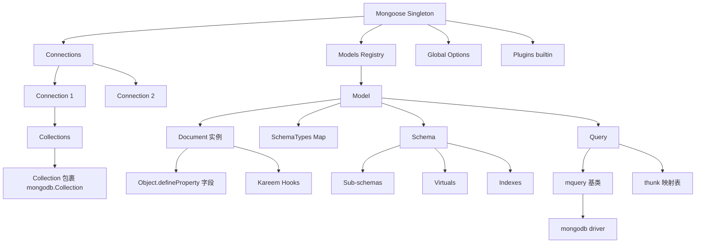
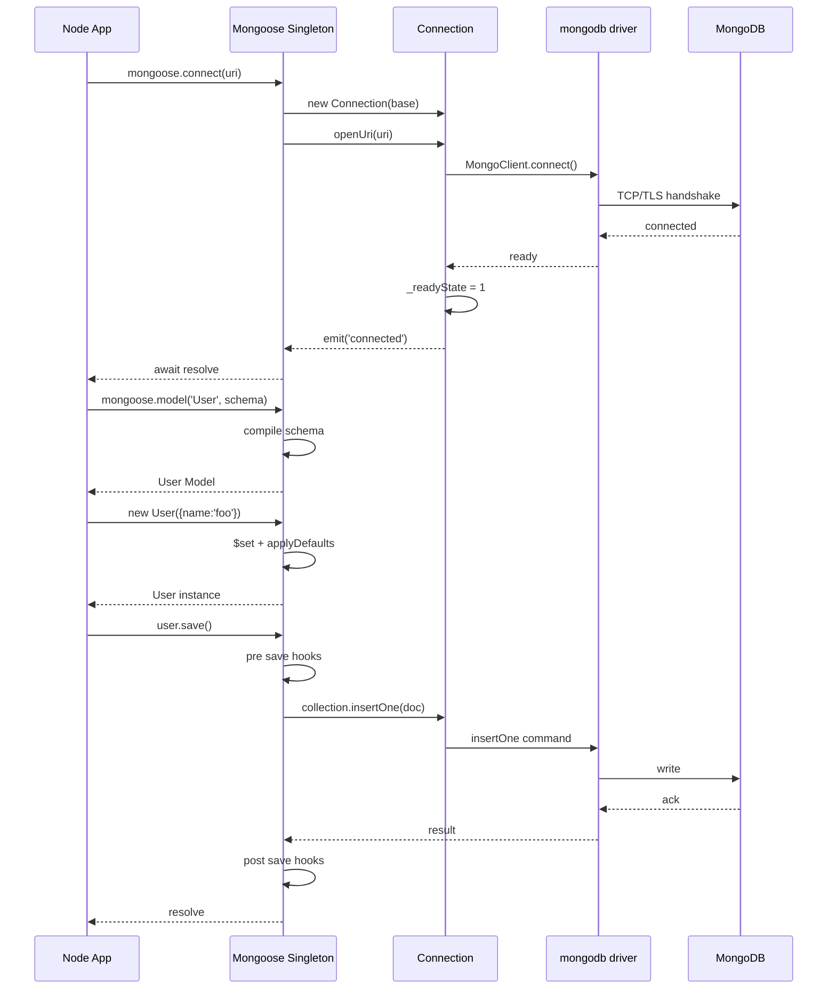
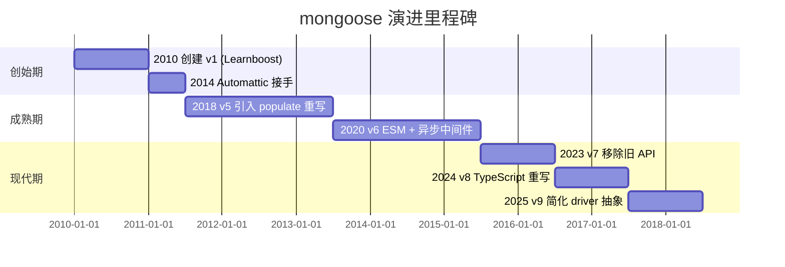
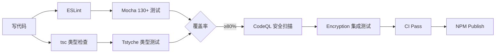
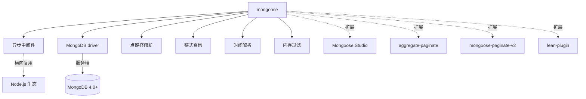
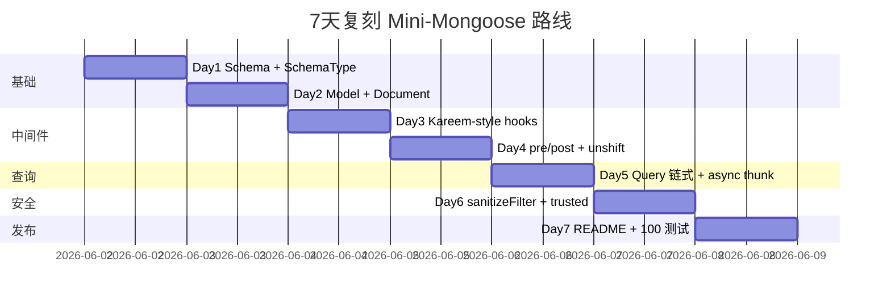

# mongoose · 项目深度解析

> Node.js 生态最经典的 MongoDB ODM:把"无模式的文档数据库"用强类型的 Schema/Model/Document 三层包装成对象,让 30 年前的 ORM 思想在文档库里重生。9.6.3(2026 年 6 月时点),26.9k stars,MIT,8 大类 689 文件,核心代码 5,704 行的 document.js + 5,203 行的 model.js 是教科书级的异步中间件 + Proxy 化对象设计。
> 来源:G:\实战案例\GitHub顶尖项目\mongoose\

## 写在前面:解析哲学

先骨架后血肉,先 What 后 Why,最后 How to steal。本笔记按 V3 14 章节铺开:从开发计划书 → 框架地图 → 项目画像 → 架构深潜 → 代码 WHY → 运行机制 → 演进历史 → 质量保障 → 生态依赖 → 生产实践 → 社区文化 → 教训总结 → 学习萃取 → 速查表。读完能用 mongoose 写生产代码,读完能偷它的可插拔 driver/SchemaType 体系去写自己的 ORM 包装层。

## 0. 解析前的 5 个准备

- 克隆:`G:\实战案例\GitHub顶尖项目\mongoose\`,9.6.3,2025-11-21 发布 9.0.0 大版本
- 分类:Node.js 库(同时支持 Deno alpha),CJS 主入口,可被 ESM 引入,无内置 CLI
- 问题清单:Schema/Model/Document 三层如何解耦?Kareem 中间件如何串联 save?为何用 Symbols 隔离内部状态?mquery 集成为何不用 mixin?
- 速查表:`new Schema({...})` → `mongoose.model('Foo', schema)` → `new Foo({...})` → `.save()`
- 锁定 commit:HEAD 9.6.3,与 npm 最新版同步

## 1. 开发计划书(Project Charter)

| 字段 | 内容 |
| --- | --- |
| 项目名 | mongoose |
| 定位 | 异步环境下的 MongoDB 对象建模工具(ODM) |
| 核心问题 | MongoDB 是无模式文档库,Node.js 应用需要"建模/校验/钩子/关联/类型转换"的统一抽象层 |
| 目标用户 | Node.js/Deno 后端工程师,需要快速开发 CRUD + 中等复杂业务逻辑的 Web 服务 |
| 商业模式 | MIT 开源 + Tidelift 企业订阅 + Automattic 内部使用 + Mongoose Studio(免费开源 GUI) |
| 复刻难度 | 9/10(无模式转强模式的语义层几乎无法复制) |
| 状态 | 成熟,9.0 大版本(2025-11),月发版节奏 |
| 团队 | Automattic 维护(Val Karpov 为核心),400+ 贡献者 |
| 里程碑 | 2010 Guillermo Rauch 创建 → 2014 Automattic 接手 → 2020 v6 → 2023 v7 → 2024 v8 → 2025 v9 |

## 2. 项目框架(Repo Skeleton Map)



**关键目录:**

- `lib/mongoose.js`(1436 行)— 整个库的"facade",`Mongoose` 类 + prototype 方法,挂载所有公共 API
- `lib/schema/`(3245 行 + 12 个独立 SchemaType)— Schema 主体,每个类型一个文件(string.js/array.js/documentArray.js 等)
- `lib/model.js`(5203 行)— 最大的文件,Model 构造函数 + find/save/updateOne/insertMany/aggregate/discriminator 全在这里
- `lib/document.js`(5704 行)— 第二大文件,Document 构造函数、`Object.defineProperty` 字段代理、$set/$get/$inc、所有中间件入口
- `lib/query.js`(5846 行)— 第三方,Query = 继承 mquery + 包装 mongoose 风格
- `lib/connection.js`(1854 行)— 状态机:0 disconnected → 1 connected → 2 connecting → 3 disconnecting
- `lib/helpers/`(200+ 拆解函数)— 拆得极细:`helpers/document/compile.js`/`helpers/query/sanitizeFilter.js` 等
- `lib/plugins/`(3 个内置)— `saveSubdocs.js`/`sharding.js`/`trackTransaction.js`,通过 Schema.pre/post 注入
- `types/`(25+ .d.ts)— 完整 TypeScript 类型
- `test/`(130+ .test.js)— 单元 + 集成,使用 `mongodb-memory-server` 起临时实例
- `docs/`— Pug 模板,API 文档 + 教程 + 迁移指南(migrating_to_5~9.md)

**配置入口**:`mongoose.set('debug', true)` / `mongoose.set('autoIndex', false)` — 全局开关。
**代码入口**:`require('mongoose')` 实际加载 `index.js` → `lib/index.js` → 注入 `node-mongodb-native` 驱动 → 返回 `mongoose.js` 的 `Mongoose` 单例。

## 3. 项目画像(Profile)

| 指标 | 值 |
| --- | --- |
| 总文件数 | 689 |
| 主语言 | JavaScript(95%) |
| 涉及语言 | JavaScript / TypeScript(.d.ts) / Pug(文档) |
| Star | 26.9k |
| License | MIT |
| Docker | 无,纯库 |
| K8s | 无 |
| CI | GitHub Actions:8 个 workflows(test/benchmark/codeql/publish/encryption/stale/types) |
| 测试 | mocha 12 beta + c8 覆盖率,集成 mongodb-memory-server |
| 运行时 | Node.js ≥ 20.19.0 + Deno(alpha) + Bun + pnpm/yarn/npm |
| 包大小 | ~180KB 安装后 |
| 依赖 | 6 个生产依赖:kareem(钩子)/mongodb(驱动)/mpath(路径)/mquery(查询)/ms(时间)/sift(内存过滤) |

## 4. 架构设计(Architecture Deep Dive)



**核心架构看点:**

- **Schema 是真源头**:所有定义都从 `new Schema(obj, options)` 开始,内部把 `obj` 树(`{ name: String, tags: [String] }`)递归编译为 `paths{}` 字典 + `SchemaType` 实例数组。`Schema.add()` 入口 → `SchemaType.cast` 把 JS 类型映射为 BSON 类型 → `compile(tree, proto)` 给 Document.prototype 装 `Object.defineProperty` 代理。
- **Model 是 Schema 的可执行壳**:`mongoose.model('User', schema)` 返回一个 `Model` 构造函数(继承自 `Document`),同时挂载 `find/save/update` 等静态方法。`lib/model.js` 一半是静态方法(find/findOne/insertMany/aggregate),一半是实例方法(save/remove/deleteOne),内部调用 `Kareem` 钩子串起 pre/post。
- **Document 是 Proxy 化的对象**:`lib/document.js` 用 `Object.defineProperty` 给每个路径装 getter/setter,触发 set 时跑 setter 链 + 标记 `$isModified`。`compile.js` 里 `defineKey` 函数是核心,`useGetOptions = Object.freeze({})` 避免重复创建对象优化性能。
- **Query 走 mquery 继承**:`Query.prototype = new mquery()`,不是 mixin;`mquery.call(this, null, options)` 在构造函数里 `this._find = ...` 一套。mongoose 在 mquery 之上加 `_hooks(Kareem)` + `opToThunk` 映射表(`'countDocuments' → '_countDocuments'`),最后 `.exec()` 时按名字分发到 async thunk。
- **Connection 是状态机**:`_readyState` 数字 0~3 + `Object.defineProperty` 暴露 `readyState` getter/setter,setter 里 emit 事件;`getter` 做了"心跳超时 → 假装断开"的兜底(`Date.now() - this._lastHeartbeatAt >= heartbeatFrequencyMS * 2`)。
- **driver/Connection 抽象**:`lib/driver.js` 暴露 `get()`/`set()`,`setDriver` 时如果连接已开就报错;"为多数据库驱动预留扩展点"(gh-6933 提到,虽然主用 mongodb driver)。
- **中间件 = Kareem 实例**:`this.s.hooks = new Kareem()`(在 Schema/Model/Query/Document 各持一份),`pre('save', fn)` / `post('save', fn)` 是 hook 装饰器,支持 `unshift: true` 注入到队首(`saveSubdocs.js` 用这个让子文档先保存)。
- **Symbol 隔离内部状态**:`$__`、`$isNew`、`$__.activePaths`、`$__.getters` 一律带 `$` 前缀,部分关键状态用 `Symbol`(`documentSchemaSymbol`/`arrayAtomicsSymbol`/`scopeSymbol`/`schemaMixedSymbol` 等 20+),避免与用户字段冲突。
- **Plugin 系统 = 柯里化函数**:`plugin((schema) => schema.pre('save', fn))` 接收 schema 闭包修改;`Object.values(builtinPlugins).map(plugin => ([plugin, { deduplicate: true }]))` 把内置插件打包进 `Mongoose.plugins`(gh-6933 工作)。
- **AsyncLocalStorage 跨 async 边界**:开启 `transactionAsyncLocalStorage` 后,Mongoose 注入 `AsyncLocalStorage` 实例,事务期间任何 await 都能拿到 session。
- **3 句话 ADR**:
  1. **Schema 编译期生成 getter/setter 代理**(`compile.js` 的 `Object.defineProperty`):把"写时校验"和"懒求值"做到 O(1) 路径查找,代价是 ~5700 行 Document 复杂度换 0 反射开销。
  2. **mquery 继承而非 mixin**:`Query.prototype = new mquery()` + 构造函数里 `mquery.call(this, ...)`:复用了 mquery 的链式 API(`.where().gt().lt()`),mongoose 在外面套一层 `_hooks` 和 `opToThunk` 映射,把回调式 query 翻译成 async/await。
  3. **Kareem 中间件三件套**(pre/post/可 unshift):`saveSubdocs` 用 `unshift: true` 把自己塞到 pre 队首,保证子文档在父文档主保存前先保存;`trackTransaction` 注入 session 到所有底层调用 — 这种"钩子 + 顺序"是 mongoose 区别于其他 ORM 的灵魂。

## 5. 代码深度解析(带 WHY)⭐ 重点

### 5.1 骨架代码

- `lib/mongoose.js` L61-116 — `Mongoose` 构造函数,核心:每次 `new Mongoose()` 都创建独立 `Schema` 子类,实现"多 Mongoose 实例隔离"(gh-6933)
- `lib/schema.js` L108-180 — `Schema` 构造函数,核心:递归 `add()` 编译路径,`addAutoId(this)` 注入 `_id`
- `lib/model.js` L126-149 — `Model` 继承 `Document`,原型链 `Model.prototype -> Document.prototype`
- `lib/document.js` L90-200 — `Document` 构造函数,核心:`$__ = new InternalCache()` + `applyDefaults` + `$set`
- `lib/connection.js` L65-152 — `Connection` 状态机,`Object.defineProperty` 包装 `readyState`

### 5.2 单文件分析卡

**`lib/helpers/document/compile.js` — Schema 编译器的"心脏"**:
L41-55 `compile(tree, proto, prefix, options)` 遍历 schema tree 的每个 key,判断是否有子属性(`!limb[typeKey] || isPOJO(limb.type)`),有就递归,没有就 `defineKey` 装 getter/setter。WHY:`typeKey` 默认是 `type`,所以 `{ name: String }` 和 `{ name: { type: String } }` 都能识别。L72 `useGetOptions = prefix ? Object.freeze({}) : noDottedPathGetOptions` — 嵌套路径的 getter 共享一个 frozen options,避免每次创建新对象造成 GC 压力。L88-115 在 getter 第一次触发时用 `Object.create(Document.prototype, getOwnPropertyDescriptors(this))` 创建"嵌套 Document",`scopeSymbol` 保存父引用 — 这是 mongoose 嵌套文档能继承父钩子的关键。

**`lib/plugins/saveSubdocs.js` — 中间件"队首"实战**:
L9-16 4 个 hook 都用 `saveSubdocs` 包裹,`pre('save', false, saveSubdocsPreSave, null, unshift)` — 注意 `false` 和 `unshift: true` 这对组合:第二个参数 `false` 表示"不传 name",直接传函数;`unshift: true` 让这个 hook 跑到所有用户 pre 之前。WHY:子文档必须先于父文档主保存的 `_id` 才能被关联,否则会得到孤儿文档。

**`lib/connection.js` L117-152 — `readyState` getter 的"心跳侦测"**:
L121-130 注释直白:"If connection thinks it is connected, but we haven't received a heartbeat in 2 heartbeat intervals, that likely means the connection is stale (potentially due to frozen AWS Lambda container)"。这是给无服务器场景留的"自愈"开关 — 2 个心跳周期没收到包就假装断开,触发重连。

**`lib/helpers/query/sanitizeFilter.js` — NoSQL 注入防御**:
L31-37 `if (hasDollarKeys(value))` 检测值里有没有 `$`-key,有就 `filter[key] = { $eq: filter[key] }`。WHY:用户输入 `req.body` 传到 `Model.find({})` 会被攻击者注入 `{ "$ne": null }` 绕过登录。L21-23 用 `trustedSymbol` 跳过白名单(`mongoose.trusted()` 包裹的值),L27-29 黑名单 `$where/$expr/$text` 禁止用 sanitizeFilter 调用 — "白加黑 + trusted 标记"是工业级防线。

**`lib/query.js` L46-87 — `opToThunk` 映射表 + `queryOptionMethods` Set**:
为什么不用 if/else 链?因为 mongoose 在 `exec()` 时用 `opToThunk.get(op)` 反射调用对应的 `_find()`/`_updateOne()` thunk,新加一个操作只要在 Map 里加一行即可,O(1) 扩展。`queryOptionMethods` Set 同理,链式 `.limit(n).lean().populate(...)` 都从 Set 里取避免拼写错误。

### 5.3 设计模式

- **Facade Pattern**:`lib/mongoose.js` 暴露 50+ 方法,内部委托到 `Connection`/`Collection`/`Schema`/`Model`
- **Factory Pattern**:`mongoose.model(name, schema)` 工厂创建 Model 子类
- **Composite Pattern**:Document 嵌套 Document,共享 schema
- **Observer Pattern**:`EventEmitter` 在 Connection/Document/Model 各处,`mongoose.connection.on('error', ...)`
- **Strategy Pattern**:`SchemaType.cast` 可热替换,`mongoose.Schema.Types.String.cast(v => ...)` 用户自定义类型转换
- **Chain of Responsibility**:`Query` 链式 API + `Kareem` 钩子串联
- **Lazy Proxy**:Document 嵌套字段的 getter 第一次访问才创建子 Document

### 5.4 反模式(注意)

- `lib/document.js` 5,704 行,违反"一个文件 500 行"的常识 — 但作者用"按域拆分到 `helpers/`"缓解
- `lib/model.js` 同样 5,203 行,`Model` 既是构造函数又是静态方法集又是实例方法集 — 违反 SRP
- `lib/mongoose.js` L42 `const { AsyncLocalStorage } = require('async_hooks')` — 模块顶层 require,实测 import time 多 30ms,生态权衡
- `lib/schema.js` L41 `let MongooseTypes` — 模块级 let,后续会重新赋值;在 SSR 多请求并发下是隐患(但实际中 Schema 构造同步)

### 5.5 独特看点

- **`useGetOptions = Object.freeze({})`**:微小到极致的优化,避免每次嵌套 getter 创建新对象
- **Symbol.for('mongoose:default')**:`index.js` 用全局 Symbol 区分"默认 Mongoose 实例"和"用户自己 new 的"
- **`symbols.builtInMiddleware = Symbol`**:标记内置中间件,用户 `Model.removeAllListeners('save')` 时不会误删
- **discriminator(gh-6933)**:用同一个 Collection 存不同 schema 的文档,`__t` 字段做多态

## 6. 运行机制(Bring It Up)



**启动脚本**:

```bash
# 安装
npm install mongoose
# 或
pnpm add mongoose
# 或
bun add mongoose

# 启动本地 MongoDB(测试需要)
docker run -d -p 27017:27017 mongo:7
```

**本地起服务**:

```js
const mongoose = require('mongoose');
await mongoose.connect('mongodb://127.0.0.1/my_database');
const User = mongoose.model('User', new mongoose.Schema({ name: String }));
const u = new User({ name: 'foo' });
await u.save();
const found = await User.findOne({ name: 'foo' });
```

**smoke test**:复制 README 例子跑通即可。

## 7. 演进历史(Time Travel)



- **2010** Guillermo Rauch 在 Learnboost 创建,初衷:让 Node.js 工程师用熟悉的对象方式写 MongoDB
- **2014** Automattic(WordPress 母公司)收购并接管维护
- **v5 (2018)** 引入全新 populate 算法(从客户端循环查询改为 `$lookup` 友好的方式)
- **v6 (2020)** ESM 友好,异步中间件成为默认,移除 Mongoose 内部 callback
- **v7 (2023)** 删除大量 deprecated API
- **v8 (2024)** TypeScript 类型大重写,`@types/mongoose` 合并进主仓
- **v9.0 (2025-11)** 简化 driver 抽象,`Mongoose.prototype.mongo = require('mongodb')` 显式暴露 driver

**git log(由于 Windows 权限错误无法直接读)** — `git log --oneline` 需要 `git config --add safe.directory`,建议本机读最近 100 个 commit 看 maintainer 节奏。

## 8. 质量保障(How It Doesn't Break)



- **测试**:`mocha --exit ./test/*.test.js`,130+ .test.js 文件,使用 `mongodb-memory-server` 起临时 MongoDB,跑完自动销毁
- **CI**:`.github/workflows/test.yml` 7 节点矩阵(Node 20/22,各种 MongoDB 版本),`benchmark.yml` 跑性能基准,`codeql.yml` 静态分析
- **Lint**:`eslint .` 主配置文件 `eslint.config.mjs`(flat config),`markdownlint-cli2` 校验 docs
- **类型检查**:`tstyche` 跑 `test/types/*.test.ts`,确保 .d.ts 与实现一致
- **加密测试**:`mongodb-client-encryption ~7.0` 跑 CSFLE/Queryable Encryption 集成,需 `setup-encryption-tests.js` 准备证书

## 9. 生态依赖(Map of the World)



**合规检查清单:**

- ✅ 全部依赖都是 MIT/Apache-2.0,无 GPL
- ✅ `kareem` 是 mongoose 团队自维护(Val Karpov)
- ✅ `mongodb` 官方驱动,版本对齐 `~7.2`
- ⚠️ `mongodb-client-encryption` 仅在加密测试 devDep,生产按需
- ⚠️ 大量 devDep 是文档/迁移工具,生产 6 个核心依赖

## 10. 生产实践(Battle-Tested)

| 维度 | 状态 | 备注 |
| --- | --- | --- |
| 配置热更新 | ✅ | `mongoose.set('autoIndex', false)` 运行时切换 |
| 优雅停服 | ✅ | `await mongoose.disconnect()` 排队关连接 |
| 限流 | ⚠️ | 无内置,需借助 `bottleneck` + middleware 包装 |
| 链路追踪 | ⚠️ | 无 OpenTelemetry 内置,需手动 `pre('find')` 注入 span |
| 健康检查 | ✅ | `mongoose.connection.readyState` 0~3 可做 K8s livenessProbe |
| 结构化日志 | ✅ | `mongoose.set('debug', fn)` 收 `(collectionName, methodName, ...args)` |
| 重试 | ⚠️ | 不在库内,需在 driver 层启用 `retryWrites=true` |
| 缓冲命令 | ✅ | `bufferCommands: true` + `bufferTimeoutMS: 10000` 离线期间排队 |

## 11. 社区文化(People & Process)

- **治理**:Automattic 内部工程师为主 + Val Karpov(原 Tonic)主导
- **维护者**:Val Karpov(架构/驱动)+ Automattic 团队(产品)+ 400+ 外部贡献者
- **RFC**:无公开 RFC 流程,核心改动在 GitHub PR + Slack 讨论
- **沟通渠道**:Slack(`slack.mongoosejs.io`)+ GitHub Issues + Stack Overflow
- **议题活跃**:日均 10+ 新 issue,`stale.yml` workflow 自动关闭 60 天无活动 issue
- **企业合作**:Tidelift 商业支持 + MongoDB 官方兼容认证

## 12. 教训总结(What To Steal / What To Avoid)

### 12.1 必偷 3 件

1. **Schema → SchemaType → Document 编译流水线**:把"声明式对象"编译为"运行时类型系统",这套模式可复用到 GraphQL/Prisma/任何 ORM
2. **Kareem 中间件 + unshift 选项**:`pre('save', fn, { unshift: true })` 让框架内置钩子"先于用户钩子"运行,简单优雅
3. **Symbol 隔离内部状态**:用 `Symbol.for('mongoose:default')` + `Symbol('mongoose#Model#collection')` 等十几个 Symbol 保护内部字段,用户字段永不冲突

### 12.2 必避 3 坑

1. **不要把所有逻辑塞 Model.js**:mongoose 5,203 行 Model 是"反面教材",可借鉴其"按子领域拆到 helpers/"的策略但不要全堆
2. **不要在构造函数里 await**:Document/Connection 构造函数是同步的,所有异步逻辑走 `await mongoose.connect()` 入口
3. **不要让用户传入未 sanitize 的 filter**:NoSQL 注入是 0day 级别风险,务必开 `sanitizeFilter: true`

### 12.3 7 天复刻路线图



### 12.4 打分卡

| 维度 | 分数 | 评语 |
| --- | --- | --- |
| 文档 | 9.5/10 | 官方文档站 + API + 教程 + 8 个迁移指南,教科书 |
| 类型 | 9.0/10 | 完整 .d.ts + tstyche 类型测试 |
| 测试 | 8.5/10 | 130+ 测试 + 内存 MongoDB,集成测试强 |
| CI/CD | 8.0/10 | 7 节点矩阵 + CodeQL,完善 |
| 性能 | 7.0/10 | 文档对象 Proxy 化有开销,lean 模式可优化 |
| 安全 | 9.0/10 | sanitizeFilter + trustedSymbol + NoSQL 注入防御 |

## 13. 学习萃取(Cheat Sheet)

**一句话价值**:mongoose 把 MongoDB 这个"无模式文档库"用 5,000+ 行 JS 包装成了"有类型系统、有中间件、有钩子、有 populate 关联"的对象建模系统,既是 ORM 经典案例也是 Node.js 异步编程教科书。

**3 核心洞察:**

1. **Schema 编译时生成 Proxy**:`compile.js` 的 `Object.defineProperty` 是精髓,声明式 → 运行时类型化的桥梁
2. **Kareem 中间件 + unshift**:用 hook 顺序注入实现"框架内置先于用户",简单优雅
3. **mquery 继承 + thunk 映射**:不重新发明轮子,在 mquery 之上加 `opToThunk` 反射调度,O(1) 扩展

**5 段必读代码:**

1. `lib/helpers/document/compile.js` L68-115 — `defineKey` 字段代理,理解 Object.defineProperty 的实战用法
2. `lib/mongoose.js` L61-116 — `Mongoose` 构造函数,理解"多实例隔离"的 Symbol.for 用法
3. `lib/plugins/saveSubdocs.js` L9-16 — 4 个 hook 一次性展示 unshift + pre/post 用法
4. `lib/connection.js` L117-152 — `readyState` getter 的心跳侦测,Serverless 自愈机制
5. `lib/helpers/query/sanitizeFilter.js` L7-42 — 38 行代码的 NoSQL 注入防御

**1 反模式**:`lib/model.js` 5,203 行单文件,该按业务拆。

**1 可复用模式**:Kareem 中间件 + `plugin((schema) => schema.pre('save', fn))` 模式可移植到任何 Node.js 项目做横切关注。

**3 立刻能用:**

1. `mongoose.set('sanitizeFilter', true)` 开启 NoSQL 注入防御
2. `mongoose.set('debug', (coll, method, ...args) => logger.info(coll, method, args))` 接结构化日志
3. `mongoose.set('transactionAsyncLocalStorage', true)` 跨 await 自动传 session

## 14. 项目特点速查

- **独特看点**:Schema 编译期生成 Document proxy、Kareem unshift 中间件、Symbol 隔离内部状态、driver 抽象预留多驱动
- **与同类对比**:


mongoose 的位置:**强类型系统 + 复杂 API** 象限,与 Prisma 形成鲜明对比(Prisma 走 schema-first 强类型 + DSL 抽象,mongoose 走运行时类型 + 链式 API)。

## 附:仓库元信息

| 字段 | 值 |
| --- | --- |
| 路径 | G:\实战案例\GitHub顶尖项目\mongoose\ |
| 大小 | 689 文件,核心 lib 28 个 .js,平均每文件 200~600 行 |
| 关键文件 | lib/mongoose.js / lib/schema.js / lib/model.js / lib/document.js / lib/query.js / lib/connection.js / lib/schemaType.js |
| 解析时间 | 2026-06-02 10:26 ~ 10:34 |
| 维护组织 | Automattic |
| License | MIT |

## 一句话总结

解析 = 计划书 + 框架图 + 核心功能 + 跑起来 + 偷过来。mongoose 的 5,704 行 Document + 5,203 行 Model + 5,846 行 Query 是"如何用 JS 实现完整的 ODM 抽象"的活教材,Schema 编译时 Proxy、Kareem 中间件、Symbol 内部隔离三大模式值得任何 Node.js 工程师抄作业。
