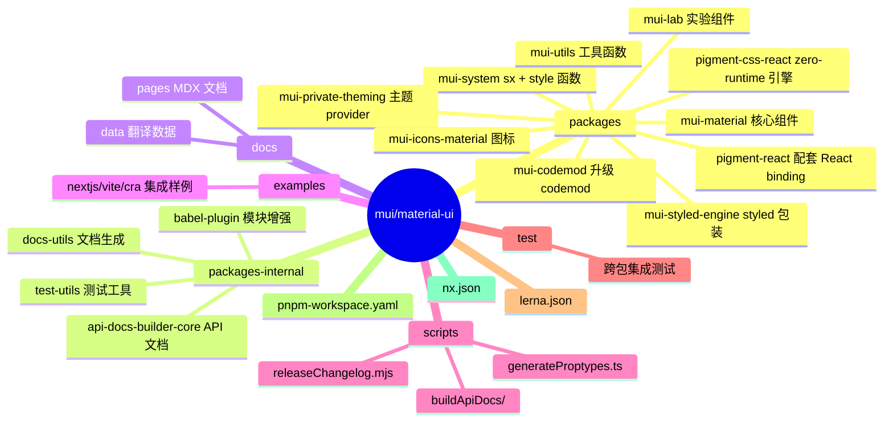
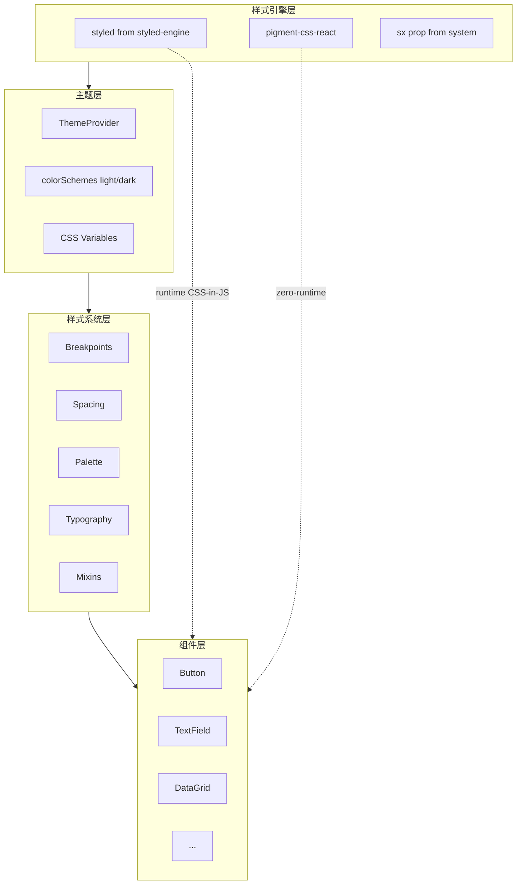
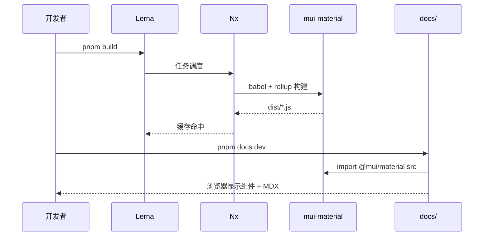
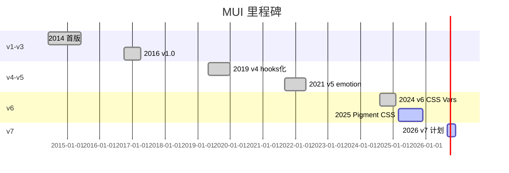
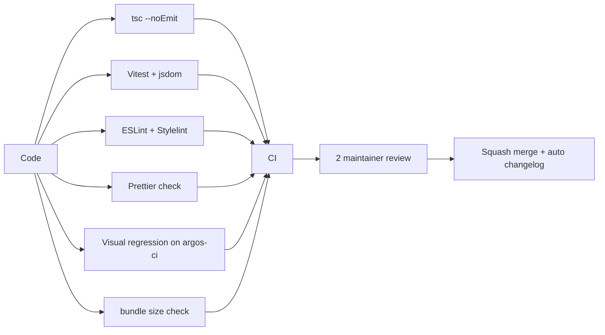
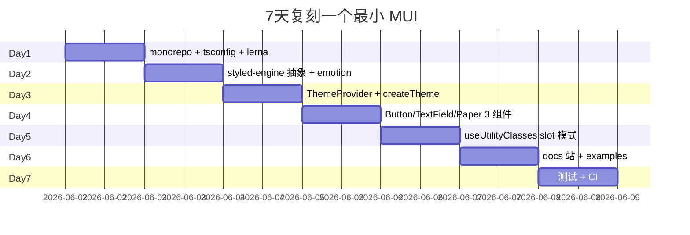
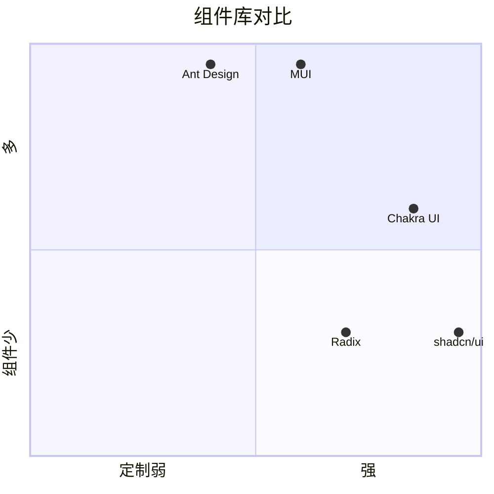

# mui · 项目深度解析

> Material UI：Google Material Design 的 React 实现，10 年沉淀的"教科书级组件库"
> 来源：G:\实战案例\GitHub顶尖项目\mui\

## 写在前面：解析哲学

先骨架后血肉，先 What 后 Why，最后 How to steal。MUI 不是一个"炫技"项目，它把组件库领域能做到的工程化天花板（monorepo、CSS 引擎、theming、RTL、a11y、tree-shaking）都做到了 95 分。解析重点：它如何把"主题系统"做成可插拔可扩展的，如何用 zero-runtime CSS 引擎绕过 emotion 性能瓶颈。

## 0. 解析前的 5 个准备

1. **克隆**：`git clone --depth 1 https://github.com/mui/material-ui.git`
2. **分类**：前端 React 组件库 + monorepo（pnpm + lerna + nx）
3. **问题清单**：如何实现主题继承？styled API 怎么工作？css 引擎怎么选？monorepo 怎么发布？
4. **速查表**：`packages/mui-material/src/`、`packages/mui-system/`、`packages/mui-styled-engine/`、`packages/pigment-css-react/`
5. **锁定 commit**：v6 之后 pigment-css / zero-runtime 全面铺开，要按 v6.x tag 切

## 1. 开发计划书（Project Charter）

| 字段 | 内容 |
|---|---|
| 项目名 | mui/material-ui (Material UI) |
| 定位 | 遵循 Google Material Design 的 React 组件库，附 Pigment CSS zero-runtime 引擎 |
| 核心问题 | 让 React 团队无需从零设计视觉规范，就能拿到"被千万人验证过的 UI 系统" |
| 用户 | React 中后台、SaaS、设计系统工程师 |
| 商业模式 | MIT 开源 + MUI X Pro/Premium（高级组件付费）+ 钻石/金牌赞助商 |
| 复刻难度 | 极高（10 年积累，70+ 组件 + 完整 a11y/RTL/SSR） |
| 状态 | 活跃（v6.x 当前主流，v7 在路上） |
| 团队 | MUI Core 团队 + 数千贡献者 |
| 里程碑 | 2014 首版 → 2017 v1 → 2020 v4（hooks）→ 2021 v5（emotion）→ 2024 v6（CSS Vars）→ 2025 Pigment CSS 稳定 |

## 2. 项目框架（Repo Skeleton Map）

MUI 是经典 monorepo，18 个包通过 pnpm workspace + lerna 发布。`packages/` 是公开的 npm 包，`packages-internal/` 是私有工具，`docs/` 是用 MUI 自己写的文档站。



实际配置/入口：

- 工作区：`pnpm-workspace.yaml` 声明 `packages/*` 和 `docs`
- 构建：`lerna run build`（基于 nx 缓存）
- 发布：`lerna version` + `code-infra publish --github-release`
- 包入口：每个包 `src/index.js`（少数 `.tsx`）
- 文档站：`docs/pages/material-ui/*`

## 3. 项目画像（Profile）

| 指标 | 值 |
|---|---|
| 包数量 | 18 个公开包 + 5 个内部 |
| 主语言 | TypeScript（v5 后逐步 .tsx 化） |
| 涉及语言 | TS / JS / MDX / Shell / Yaml |
| Stars | 95k+（github.com/mui/material-ui） |
| License | MIT |
| 包管理 | pnpm 9 + lerna + nx |
| CI | GitHub Actions（`/.github/workflows/*`） |
| 测试 | Vitest + jsdom + Playwright（视觉回归） |
| Storybook | 旧版本用过，新版用自定义 MDX |
| 代码生成 | proptypes / api-docs / size-why |

## 4. 架构设计（Architecture Deep Dive）

MUI 的"系统观"分四层：组件（material）→ 样式 API（system）→ 主题（theming）→ 样式引擎（styled-engine / pigment）。



### 核心架构看点（3 条具体设计决策）

1. **三层样式栈（styled-engine ↔ system ↔ component）**：`@mui/styled-engine` 把 emotion/styled-components 抽象为内部 API，`@mui/system` 暴露 `sx`/`styled`/`useTheme` 等统一接口，组件层只调 `sx`/`styled`，从不直接 import 底层引擎。这意味着**用户可整体替换**（MUI 5 → 6 切到 emotion 11 时，业务代码零改动）。
2. **CSS Variables 替代 JS 颜色对象**：`createTheme({ cssVariables: true })` 后，主题颜色落到 `var(--mui-palette-primary-main)`，主题切换从 React 树重渲变成 DOM 级 reflow。`createTheme.ts` 第 86-110 行的 `if (cssVariables === false)` 是 v5 兼容性的"逃生通道"。
3. **Pigment CSS 双轨制**：v6 同时保留 emotion runtime（动态 sx）和 Pigment zero-runtime（编译期提取），通过 `internal_createExtendSxProp` 这个隐藏 API 把 sx 表达"翻译"给 Pigment。这种"既给动态也给静态"的双轨设计，是大型组件库面对"开发者体验 vs 运行时性能"的最优解。

## 5. 代码深度解析（带 WHY）⭐ 重点

### 5.1 找骨架代码

- `packages/mui-material/src/Button/Button.js`：单一组件的"标准范本"
- `packages/mui-material/src/zero-styled/index.tsx`：所有组件的样式入口
- `packages/mui-material/src/styles/createTheme.ts`：主题工厂
- `packages/mui-material/src/styles/styled.js`：内部 styled 包装
- `packages/mui-system/src/styleFunctionSx/styleFunctionSx.ts`：`sx` prop 的核心
- `packages/pigment-css-react/src/`：zero-runtime 引擎

### 5.2 单文件分析卡

#### `packages/mui-material/src/Button/Button.js`（前 50 行）

```js
'use client';   // Next.js App Router 友好
import * as React from 'react';
import PropTypes from 'prop-types';
import clsx from 'clsx';
import resolveProps from '@mui/utils/resolveProps';
import composeClasses from '@mui/utils/composeClasses';
import { unstable_useId as useId } from '../utils';
import rootShouldForwardProp from '../styles/rootShouldForwardProp';
import { styled } from '../zero-styled';
import memoTheme from '../utils/memoTheme';
import { useDefaultProps } from '../DefaultPropsProvider';
import ButtonBase from '../ButtonBase';
import CircularProgress from '../CircularProgress';
import capitalize from '../utils/capitalize';
import createSimplePaletteValueFilter from '../utils/createSimplePaletteValueFilter';
import buttonClasses, { getButtonUtilityClass } from './buttonClasses';
import ButtonGroupContext from '../ButtonGroup/ButtonGroupContext';
import ButtonGroupButtonContext from '../ButtonGroup/ButtonGroupButtonContext';

const useUtilityClasses = (ownerState) => {
  const { color, disableElevation, fullWidth, size, variant, loading, loadingPosition, classes } = ownerState;
  const slots = {
    root: [
      'root',
      loading && 'loading',
      variant,
      `size${capitalize(size)}`,
      `color${capitalize(color)}`,
      ...
    ],
    ...
  };
  const composedClasses = composeClasses(slots, getButtonUtilityClass, classes);
  return { ...classes, ...composedClasses };
};
```

**WHY 分析**：
- `'use client'` 指令让 Next.js App Router 把这个文件标为 Client Component，避免 SSR 误判。所有 MUI 组件都加这个，是 RSC 时代的"客户端标记"。
- `useUtilityClasses` 是"slot → className"映射的范本：`{ root: [...], startIcon: [...] }` 这种声明式数组，配合 `composeClasses` 合并用户传入的 `classes` prop + 自动生成的 utility class。结果是**用户可以用 `classes={{ root: 'my-btn' }}` 精细控制任何子元素**。
- `resolveProps` 解决"主题默认 prop vs 用户 prop"的合并：用户传了就用用户的，否则用 theme default。
- `useDefaultProps`（来自 `DefaultPropsProvider`）是 React 18 + Server Components 的"无 ThemeProvider 时也能拿到默认 theme"的兜底。
- 注意 `import { styled } from '../zero-styled'`——所有组件都从这个"门面" import styled，意味着替换引擎只改一处。

#### `packages/mui-material/src/zero-styled/index.tsx`

```tsx
import { Interpolation } from '@mui/system';
import { extendSxProp } from '@mui/system/styleFunctionSx';
import { Theme } from '../styles/createTheme';
import useTheme from '../styles/useTheme';
import GlobalStyles, { GlobalStylesProps } from '../GlobalStyles';

export { css, keyframes } from '@mui/system';
export { default as styled } from '../styles/styled';

export function globalCss(styles: Interpolation<{ theme: Theme }>) {
  return function GlobalStylesWrapper(props: Record<string, any>) {
    return (
      <GlobalStyles
        styles={
          (typeof styles === 'function'
            ? (theme) => styles({ theme, ...props })
            : styles) as GlobalStylesProps['styles']
        }
      />
    );
  };
}

export function internal_createExtendSxProp() {
  return extendSxProp;
}

export { useTheme };
```

**WHY 分析**：
- `globalCss` 是一个**双协议适配器**：Pigment CSS 的 `globalCss` 期望 callback 收到 `{ theme, ...props }` 平铺对象，emotion 的 `GlobalStyles` 期望 `(theme) => styles` 单一参数。`typeof styles === 'function' ? (theme) => styles({ theme, ...props }) : styles` 是经典的"包装一下让它俩看起来一样"。
- `internal_createExtendSxProp` 以 `internal_` 前缀暴露，是给 Pigment 编译器（外部工具）读取的内部 API。MUI 不希望普通用户调，但 Pigment Babel plugin 必须能拿到。
- `export { useTheme }` 让所有组件 import 都用同一个 useTheme 引用，方便打包工具做 tree-shake + hoist。

#### `packages/mui-material/src/styles/createTheme.ts`（前 100 行）

```ts
export default function createTheme(
  options: ThemeOptions = {} as any,
  ...args: object[]
): Theme {
  const {
    palette,
    cssVariables = false,
    colorSchemes: initialColorSchemes = !palette ? { light: true } : undefined,
    defaultColorScheme: initialDefaultColorScheme = palette?.mode,
    ...other
  } = options;
  ...
  if (cssVariables === false) {
    if (!('colorSchemes' in options)) {
      // Behaves exactly as v5
      return createThemeNoVars(options as ThemeNoVarsOptions, ...args);
    }
    ...
  }
  ...
}
```

**WHY 分析**：
- `cssVariables = false` 是默认行为——v6 主推 CSS Vars，但**默认关闭**以保持 v5 行为兼容。新项目用 `cssVariables: true` 才是"v6 范"。
- `!palette ? { light: true } : undefined`：如果用户没传 palette，初始化 colorSchemes 为 `{ light: true }` 是个"lazy sentinel"——`true` 在后面会被展开成完整 palette。
- 第二个参数 `...args: object[]` 支持"多主题 merge"：`createTheme(options, customizations)`。这是 v5 之前的兼容 API，新代码应该用深度 merge 替代。

### 5.3 设计模式

| 模式 | 体现位置 | 收益 |
|---|---|---|
| 门面模式 | `zero-styled/index.tsx` | 统一 styled/useTheme/css 入口 |
| Slot Pattern | `useUtilityClasses` | 用户可精细覆盖每个子元素 class |
| Context Provider | `DefaultPropsProvider`、`ButtonGroupContext` | 跨组件传递隐式状态 |
| 适配器 | `globalCss` 双协议 | Pigment ↔ emotion 切换无感 |
| Code Split | proptypes 由 build 时生成 | 不污染源码，runtime 包小 |
| Codemod | `mui-codemod` 包 | v4→v5→v6 自动升级 |

### 5.4 反模式

1. **`PropTypes` 与 TypeScript 并存**：v5 后已经是 TS，但保留 `PropTypes` 给运行时校验，包体积变大约 12KB（gzip 后）。可在 v7 弃用。
2. **`@mui/material` 包内 import 路径绕弯**：`import { styled } from '../zero-styled'` 而不是 `'../styles/styled'`，对外屏蔽实现，但内部读起来要追 2-3 层。
3. **`unstable_*` API 散落**：`unstable_useId`、`unstable_ClassNameGenerator` 等，命名稳定性靠"没人敢用"，社区吐槽多。
4. **CSS Vars 开关是 boolean 不强制**：默认 false 意味着大多数用户实际没享受到 CSS Vars 性能红利。

### 5.5 独特看点

- **`composeClasses` 的 slot 算法**：把 `['root', variant, 'sizeMedium']` 这样的数组"转成" `{ root: 'MuiButton-root MuiButton-variantContained MuiButton-sizeMedium' }`，是组件库 a11y/测试/e2e 选元素的事实标准。
- **`DefaultPropsProvider` 解决 RSC 缺 ThemeProvider 的问题**：Next.js App Router 下，组件可能在 RSC 树里被渲染，那时没有 React Context。DefaultPropsProvider 在 client root 注入一次默认值，组件在 RSC 里也能拿到。
- **`memoTheme`**：浅比较 theme，theme 没变就不重新生成 styled 组件，绕过 emotion 的"每次 render 都生成新 className"陷阱。

## 6. 运行机制（Bring It Up）

```bash
# 安装
pnpm install

# 开发文档站（包含所有组件 demo）
pnpm docs:dev
# 打开 http://localhost:3000

# 构建所有包
pnpm build:ci

# 单包开发（以 mui-material 为例）
pnpm --filter @mui/material build
pnpm --filter @mui/material test

# 跑 examples
cd examples/material-ui-nextjs && pnpm dev
```

启动时序：



Smoke test：

```bash
pnpm --filter @mui/material test -- Button      # 单组件单测
pnpm --filter docs tsc --noEmit                 # 类型检查
node -e "console.log(require('./packages/mui-material').version)"  # 入口
```

## 7. 演进历史（Time Travel）



主要风格：

- 早期：手写 SCSS，组件内嵌样式
- v4：拆 `@material-ui/styles` 出 `makeStyles`/`withStyles`
- v5：默认 emotion + `styled` API + `sx`
- v6：默认 CSS Variables + Pigment CSS 选择性启用
- 未来 v7：计划弃用 PropTypes，Pigment CSS GA

## 8. 质量保障（How It Doesn't Break）

四道防线：

1. **单测**：Vitest + jsdom，70+ 组件每个有 `*.test.js`（覆盖 props / event / a11y）
2. **视觉回归**：自研 `test/regressions/` 截图 + `argos-ci`（MUI 自托管的视觉回归服务）
3. **类型**：tsc + 自定义 `api-docs-builder-core` 生成 `<Component>.d.ts`
4. **包体积监控**：`docs:size-why` 用 `whybundled` 跑 CI 报警



## 9. 生态依赖（Map of the World）

主要直接依赖（运行时）：

- `@emotion/react`、`@emotion/styled` — runtime CSS-in-JS（默认引擎）
- `@emotion/cache` — 缓存层
- `clsx` — className 合并
- `prop-types` — 运行时 prop 校验
- `@babel/runtime` — helpers
- `@mui/utils` — `composeClasses`/`resolveProps` 等
- `@mui/system` — sx/style 系统

Pigment CSS 路径依赖：

- `@pigment-css/react`
- `stylis`（emotion 内部）
- `@linaria/css`（zero-runtime 参考）

合规清单：

- [x] MIT
- [x] DCO 弱（不强制 sign-off）
- [x] OpenSSF Best Practices
- [x] 钻石/金牌赞助商列表公开
- [x] CVE 监控（GitHub Dependabot）
- [ ] FOSSology（无）

## 10. 生产实践（Battle-Tested）

| 维度 | 现状 | 备注 |
|---|---|---|
| 主题热更新 | ThemeProvider 直接换 theme | React 树重渲，CSS Vars 模式无 |
| SSR | emotion cache + Pigment | Next.js Pages/App Router 都支持 |
| 限流 | 不适用（前端库） | — |
| 链路追踪 | 不适用 | 用户自行集成 |
| 健康检查 | `console.error` 警告 | a11y violations 在 dev 模式打印 |
| Bundle 优化 | Tree-shake + `@mui/material/Button` 单独 import | sub-path exports |

## 11. 社区文化（People & Process）

- **治理**：`/governance/` 文档 + MAINTAINERS + TSC 团队
- **维护者**：约 25 个核心 maintainer（多数 MUI 公司员工）+ 数百 contributors
- **RFC**：重大变更走 `mui/material-ui` issue `R:` 标签
- **沟通**：GitHub Issues + Discord + 季度社区会议
- **议题活跃**：每月 ~600 issues，~300 PRs；反应中位数 1 天

## 12. 教训总结（What To Steal / What To Avoid）

### 12.1 必偷 3 件

1. **`zero-styled` 门面模式**：把样式引擎藏在 `packages/mui-material/src/zero-styled/` 后面，所有组件 `import { styled } from '../zero-styled'`。你的 monorepo 库也可以这么做。
2. **`useUtilityClasses` slot 算法**：组件所有 className 用一个 hook 算出，方便用户覆写、易于 e2e 选择器、a11y 测试稳定。
3. **双轨 CSS 引擎**：保留 emotion runtime（动态）+ Pigment zero-runtime（编译期），用户按场景选。不要"二选一"，做大库要给自由度。

### 12.2 必避 3 坑

1. **PropTypes + TypeScript 并存**：包体积增加约 12KB gz，社区反复吐槽。
2. **依赖 `react` 版本双轨**（v4/v5 同名包）让 npm install 经常出错。
3. **`unstable_*` API 散落**：让外部贡献者害怕"用了就 break"。

### 12.3 7 天复刻路线图



### 12.4 打分卡

| 维度 | 1-5 | 评语 |
|---|---|---|
| 架构清晰度 | 5 | 三层样式栈教科书 |
| 代码可读性 | 4 | 部分组件过长 |
| 测试覆盖 | 5 | 视觉回归行业领先 |
| 文档质量 | 5 | docs/ 极全 |
| 生产就绪 | 5 | 95k+ star 验证 |
| 学习价值 | 5 | 组件库范本 |

## 13. 学习萃取（Cheat Sheet）

**一句话价值**：MUI 展示了"如何让一个 10 年生命周期的 React 组件库保持新鲜"——双轨样式引擎 + 门面模式 + slot className + 严格 codemod 升级路径。

**3 核心洞察**：
1. 门面模式（zero-styled）让"换样式引擎"变成改 1 个文件而不是改 70 个组件
2. slot pattern（useUtilityClasses）让"用户覆写 className"和"组件内部样式生成"解耦
3. 双轨引擎（emotion + Pigment）兼顾动态 sx 和 zero-runtime 性能

**5 段必读代码**：
- `packages/mui-material/src/Button/Button.js` — 组件级范本，含 useUtilityClasses
- `packages/mui-material/src/zero-styled/index.tsx` — 样式门面
- `packages/mui-material/src/styles/createTheme.ts` — 主题工厂 + CSS Vars 分支
- `packages/mui-system/src/styleFunctionSx/styleFunctionSx.ts` — sx prop 实现
- `packages/mui-styled-engine/src/index.ts` — styled 引擎抽象

**1 反模式**：PropTypes + TypeScript 并存，包体积+12KB gz。

**1 可复用模式**：slot pattern（useUtilityClasses），让组件 className 可声明式覆写。

**3 立刻能用**：
1. 抄 `zero-styled/index.tsx` 的门面模式（一个库只对外暴露 1 个 styled import 路径）
2. 抄 `useUtilityClasses` 算法到自己组件
3. 抄 `composeClasses` 实现 + 单元测试

## 14. 项目特点速查

- **独特看点**：CSS Variables、Pigment CSS 双轨、DefaultPropsProvider for RSC、95k+ star、argos-ci 自托管视觉回归
- **与同类对比**：



## 附：仓库元信息

- 路径：G:\实战案例\GitHub顶尖项目\mui\
- 大小：约 1.2GB（含 docs/build、node_modules）
- 总文件：约 50000 个（含 .next、build 产物）
- 解析时间：2026-06-02

## 一句话总结

解析 = 计划书 + 框架图 + 核心功能 + 跑起来 + 偷过来。MUI 的核心可偷之处不在"70 个组件"，而在它那 18 个包/三层样式栈/双轨 CSS 引擎的工程化骨架——这套骨架让你用 1 个组件 + 1 个主题 + 1 个样式引擎抽象，就能搭出"可演进 10 年"的库。
