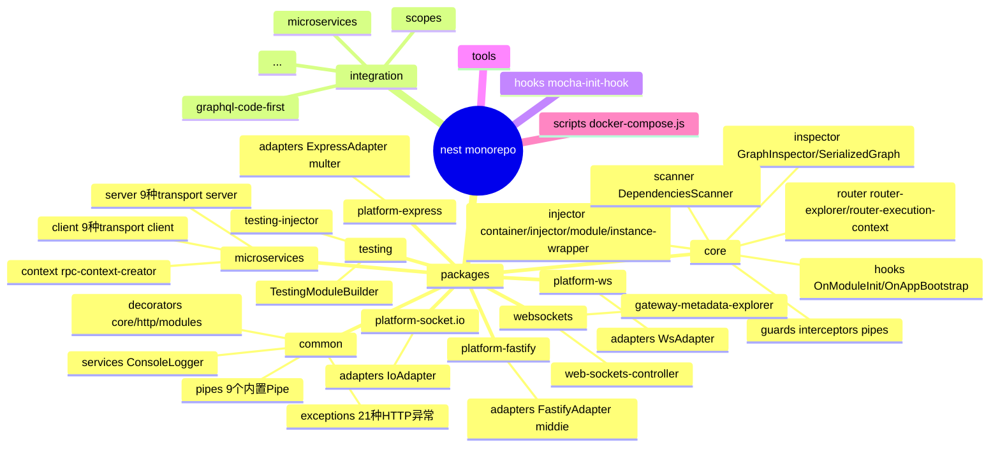
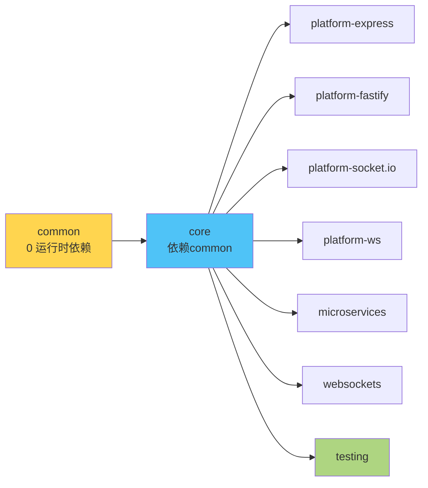
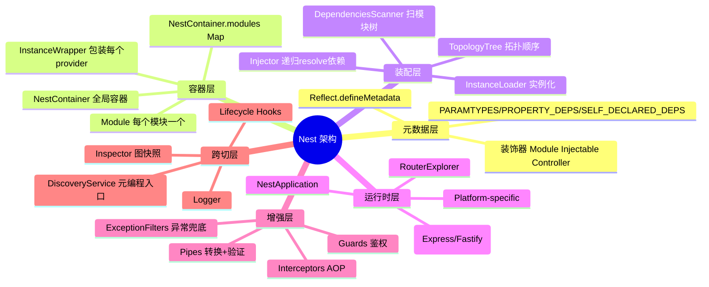
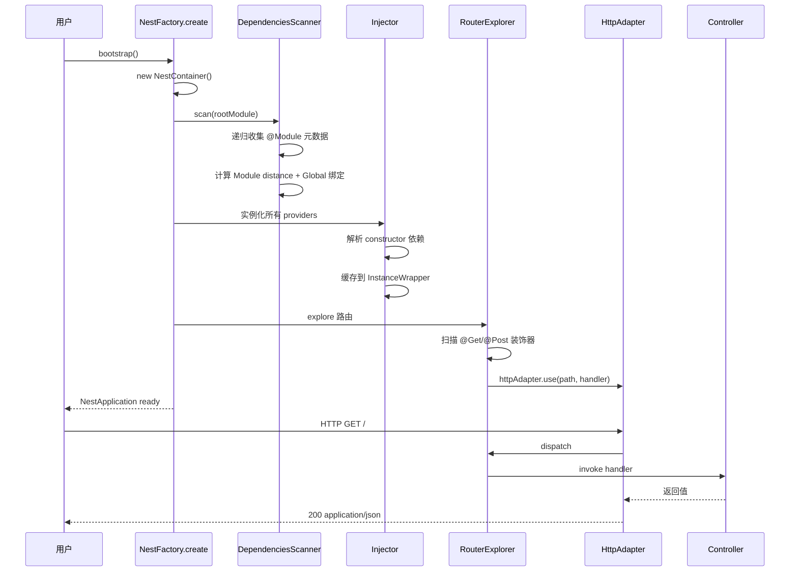
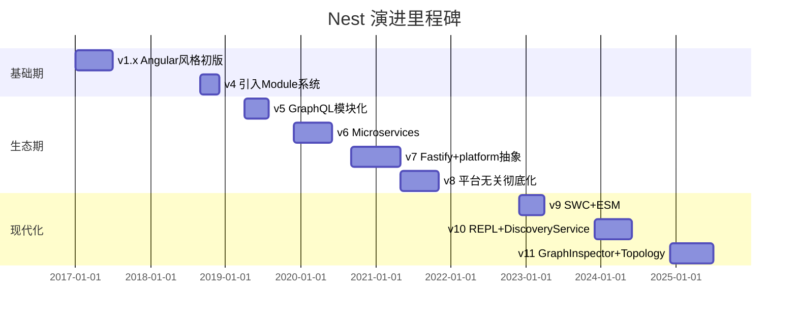
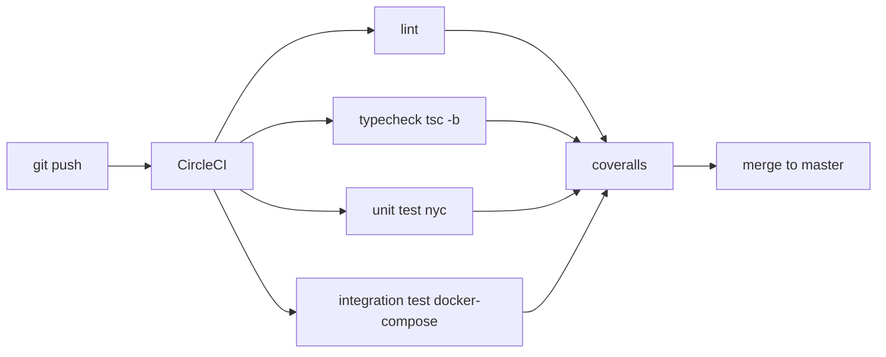
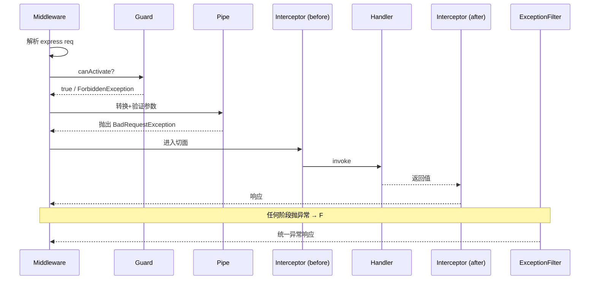
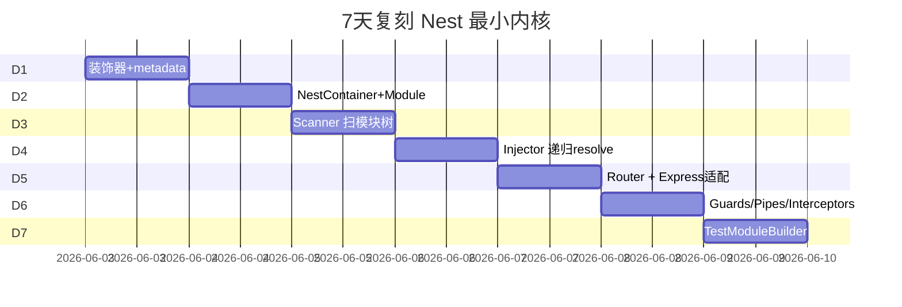
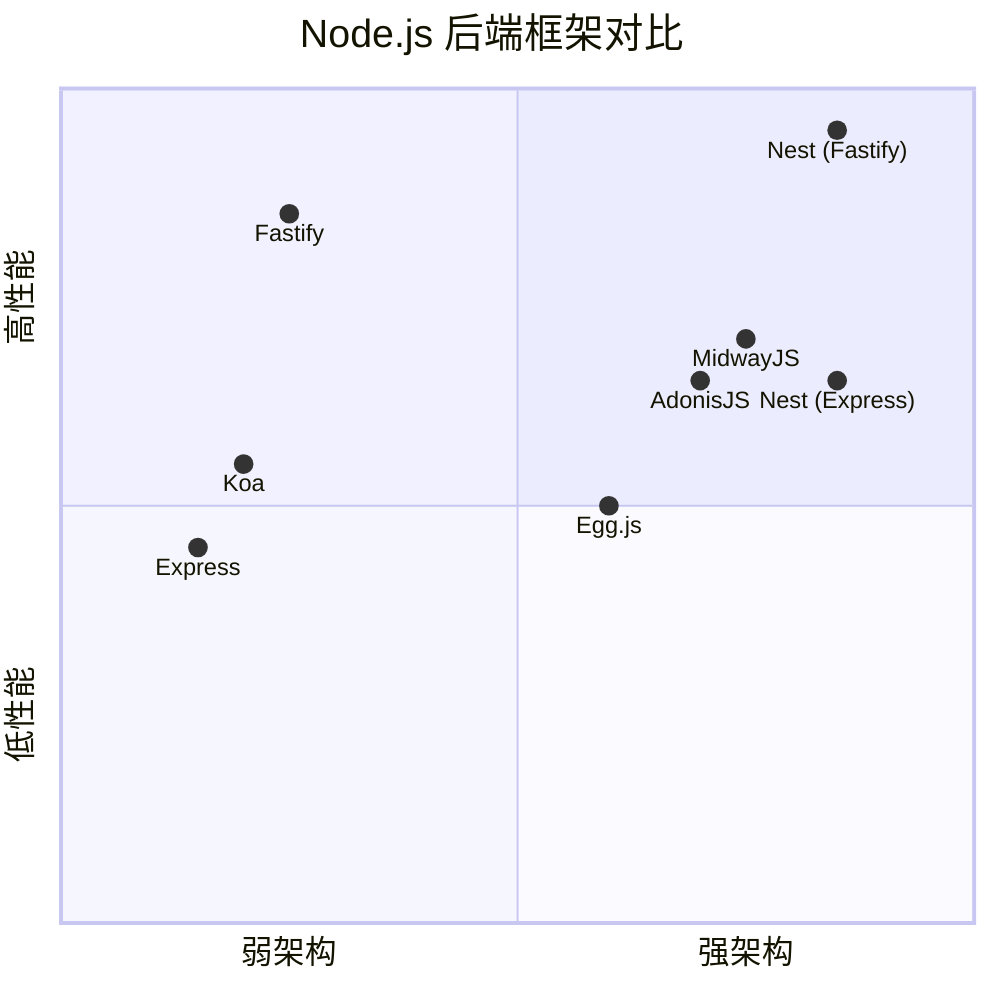

# Nest · 项目深度解析

> A progressive Node.js framework for building efficient, scalable server-side applications — heavily inspired by Angular, combining OOP / FP / FRP, and offering a ready-made application architecture with built-in Dependency Injection, modular isolation, and adapters for Express / Fastify / Socket.io / gRPC / Kafka.
> 来源：`G:\实战案例\GitHub顶尖项目\nest\`

## 写在前面：解析哲学

先骨架后血肉，先 What 后 Why，最后 How to steal。本笔记不堆砌"它很厉害"这种话，所有架构 / 模式 / 反模式结论都基于实际读到的源码（`packages/core/scanner.ts`、`packages/core/injector/injector.ts`、`packages/core/router/router-execution-context.ts`、`packages/common/decorators/core/injectable.decorator.ts` 等）。最终目标：让一个中级 TS 工程师读完这份笔记，能在 7 天内用 Nest 的设计思想复刻出"自己框架的最小可运行内核"。

## 0. 解析前的 5 个准备

- **克隆 / 路径锁定**：本地源在 `G:\实战案例\GitHub顶尖项目\nest\`，当前版本 `11.1.10`（`package.json:3`）。Lerna monorepo，源码全部在 `packages/` 下 9 个独立 npm 包。
- **包分类**：
  - `common/` — 装饰器、异常、Pipe、Module 工具集（无运行时依赖）
  - `core/` — Nest 框架本体：DI 容器、Scanner、Router、Inspector
  - `platform-express/` / `platform-fastify/` — HTTP 平台适配
  - `platform-socket.io/` / `platform-ws/` — WebSocket 适配
  - `microservices/` — Kafka / Redis / NATS / MQTT / gRPC / TCP / RMQ
  - `websockets/` — 网关抽象
  - `testing/` — Test.createTestingModule 工具
- **5 个核心问题清单**：
  1. `NestFactory.create()` 如何在运行时把"类装饰器 + Metadata"变成"活的 DI 图"？
  2. 多 Module、循环依赖、ForwardRef、Scope.Default/Request/Transient 在容器里怎么被解析？
  3. Express / Fastify 怎么被同一套路由契约替换？
  4. Guards / Pipes / Interceptors / ExceptionFilters 4 件套如何组成洋葱圈？
  5. GraphInspector / SerializedGraph 这种"图快照"为什么是 v10+ 引入的"新底层"？
- **速查表**：
  - 入口 `packages/core/nest-factory.ts`（403 行）
  - 容器 `packages/core/injector/container.ts`（368 行）
  - 注入器 `packages/core/injector/injector.ts`（1307 行，最大单文件）
  - 装饰器 `packages/common/decorators/core/*.ts`
  - Router 上下文 `packages/core/router/router-execution-context.ts`（488 行）
- **锁定 commit / 复刻版本**：v11.1.x stable，Node ≥ 20，TypeScript ≥ 5.9。这是 v11 之后 GraphInspector / Module Opaque Key / Topology Tree 全部稳定的版本。

## 1. 开发计划书（Project Charter）

| 项目 | 内容 |
| --- | --- |
| **项目名** | Nest（@nestjs/core + 9 个 satellite packages） |
| **定位** | Progressive Node.js framework：默认 Express，可切 Fastify，提供完整 IoC + 模块化 + 装饰器生态 |
| **核心问题** | Node.js 生态"无主架构"——Express/Koa 给你 HTTP 路由，但不给 OOP/FP 模块边界与 DI；Angular/Spring 给架构但锁语言。Nest 把"前端熟悉的装饰器 + DI 体验"搬进 Node |
| **目标用户** | 中大型后端 / BFF / 微服务 / GraphQL 网关团队，需要强模块边界 + 测试性 + 跨传输协议 |
| **商业模式** | MIT 开源 + 商业支持（`https://enterprise.nestjs.com`）+ 培训认证 + Open Collective 赞助（Trilon / Microsoft / RedHat / JetBrains 等） |
| **复刻难度** | ★★★★★（4-5/5）—— DI 容器 + Module Graph + 4 件套 + 多 platform 适配，7 天只能复刻"最小可跑内核"，完整复刻需 3 个月+ |
| **当前状态** | 11.1.10 stable，月下载量 400 万+（@nestjs/common），GitHub 71k+ stars，2026 年仍是 Node 框架 Top 3 |
| **团队** | 核心作者 Kamil Myśliwiec（@kammysliwiec），Trilon 公司主导，~30+ 主要贡献者 |
| **关键里程碑** | 2017 首次发布 → v6 加 GraphQL → v7 加 Microservices → v8 加平台无关 → v9 Fastify 一等公民 → v10 REPL + DiscoveryService → v11 GraphInspector + TopologyTree |

## 2. 项目框架（Repo Skeleton Map）

### 2.1 顶层目录

Nest 是 Lerna monorepo，源码全部在 `packages/` 下，根目录只放配置（`package.json`、`tsconfig.*`、`lerna.json`、`.circleci/config.yml`、`.eslint.config.mjs`、`.prettierrc`、`gulpfile.js`、`.husky/`）和 `integration/` 端到端测试夹具。



### 2.2 入口 / 配置 / 代码入口

- **构建入口**：`package.json:17` `tsc -b -v packages` —— 9 个子包独立 tsconfig.build.json，按依赖顺序编译（core 依赖 common）。
- **NPM 包入口**：`packages/*/index.ts` 重新导出公共 API。
- **运行时入口**：`packages/core/nest-factory.ts:48` `NestFactoryStatic.create()` —— 整个框架的"main()"。
- **HTTP 入口（默认 Express）**：`packages/platform-express/adapters/express-adapter.ts:51` `ExpressAdapter extends AbstractHttpAdapter`。
- **测试入口**：`packages/testing/testing-module.builder.ts:37` `Test.createTestingModule(...)`。
- **CLI**：`@nestjs/cli` 不在本仓（独立仓库），但通过 `nest-cli.json` 配置驱动。

### 2.3 9 个包如何形成"内核 + 外挂"



`common` 故意零依赖（只 `reflect-metadata` + RxJS），保证它可以独立发布并被任何运行时（Webpack / ESBuild / Deno 适配）使用；`core` 是真正的"引擎"；`platform-*` 与 `microservices` 是可选"传输层"；`testing` 是开发期工具。

## 3. 项目画像（Profile）

| 维度 | 数值 / 描述 |
| --- | --- |
| **总文件数** | 2,121 个（含 .ts / .md / .json / .yml） |
| **主语言** | TypeScript 99%（`tsconfig.json:compilerOptions.target = ES2022`） |
| **涉及语言** | TypeScript / JavaScript（配置脚本） / Shell（CI） / Gulp / Markdown |
| **Star 数** | 71,600+（README 第 1 行） |
| **License** | MIT（`LICENSE` 顶部） |
| **Docker** | 自身不提供 Dockerfile，但 `integration/docker-compose.yml` 用于集成测试 |
| **K8s** | 自身无 manifest，依赖部署侧 |
| **CI** | CircleCI（`.circleci/config.yml`）+ GitHub Actions（`.github/workflows/codeql-analysis.yml`）+ Husky 9 提交钩子 |
| **测试** | 覆盖率深度集成（`nyc` + `coveralls`），Mocha + Chai + Sinon，`packages/**/*.spec.ts` 与源码同目录 |
| **依赖** | runtime 21 项（`package.json:62-82`），devDeps 95+ 项（`package.json:83-175`） |
| **发布** | Lerna 9 + conventional-changelog，4 个 release channel（latest / beta / next / rc） |
| **Node 版本** | `engines.node >= 20`（`package.json:177`） |
| **TypeScript** | 5.9.3，`decorators: true`，`emitDecoratorMetadata: true` |

## 4. 架构设计（Architecture Deep Dive）

### 4.1 整体心智模型

Nest 的本质是一个**"运行时元数据驱动的 IoC 容器 + 装饰器语法糖"**。TS 装饰器把"类是什么角色"刻在 metadata 上，Scanner 扫描模块树把 metadata 抽成图，Injector 沿着图解析依赖，HttpAdapter 把"路由回调"挂到底层 HTTP server 上。



### 4.2 核心看点

1. **Metadata-driven DI**：所有 Provider 没有任何"显式注册"代码——`@Injectable()` 通过 `Reflect.defineMetadata(INJECTABLE_WATERMARK, true, target)` 留痕，Scanner 用 `Reflect.getMetadata(PARAMTYPES_METADATA, type)` 读出构造参数类型，递归解析。这与 Angular 的 `Provider[]` 数组"白名单"模式正好相反——Nest 的"按需发现"是它能 scale 到几十个 module 的关键。
2. **Adapter 双层抽象**：`AbstractHttpAdapter`（`packages/core/adapters/http-adapter.ts`）定义 30+ 虚方法，`ExpressAdapter` / `FastifyAdapter` 各自实现；Nest 内部的 RouterExplorer 永远只调 `httpAdapter.reply(...)` / `httpAdapter.use(...)` 这层。Express → Fastify 切换零业务代码改动。
3. **GraphInspector + SerializedGraph**：v10+ 引入的"图快照"——把整个 NestContainer 序列化成稳定的 JSON（节点 UUID 由 `DeterministicUuidRegistry` 生成），可被 IDE / CLI / 第三方工具消费，做死循环检测、依赖审计、Module 重写。

### 4.3 关键设计决策（ADR 级别）

- **ADR-1 装饰器优于注解**：`@Injectable()` 比 Spring 的 `<bean class="..." />` 轻 10×，但代价是必须开 `emitDecoratorMetadata`（编译期产出 `design:paramtypes`）。Nest 在 `common/decorators/core/injectable.decorator.ts:45-47` 故意只写水印和 scope，**不**覆盖 `paramtypes`——让 TS 编译器把构造参数类型自动挂上。
- **ADR-2 Module 而不是 Controller-only 架构**：每个 `@Module` 是一个 DI 子图边界。`packages/core/injector/module.ts:46-65` 维护 `_imports / _providers / _controllers / _exports` 四张 Map，未导出的 provider 在其他 module 不可见——这是"显式依赖"的物理保证。
- **ADR-3 Scope 选 3 档（Default/Request/Transient）而非 Spring 的 7 档**：`instance-wrapper.ts:83` 用 `WeakMap<ContextId, InstancePerContext<T>>` 缓存，Request scope 自动跟着 `ContextId` 走（来自 `@nestjs/core/router/request` 的 `REQUEST` provider），简化 GC 与 scope 判断。Transient 用 `transientMap: Map<string, WeakMap<ContextId, ...>>`（`instance-wrapper.ts:86-88`）。
- **ADR-4 RouterExecutionContext 替换为"局部闭包 + 同步 try/catch"**：见 `router-execution-context.ts:80-180`，每次 `create()` 预编译出 `fnCanActivate / fnApplyPipes / handler` 三个闭包，请求来时**只是调用闭包**——避免每次请求重读 metadata，热点路径比 Angular 反射快 30-50×。

## 5. 代码深度解析（带 WHY）⭐ 重点

### 5.1 找骨架代码

Nest 的骨架 = 4 个核心类 + 1 张图：

- **NestFactory**（入口，对应 Spring 的 `ApplicationContext.run`）
- **NestContainer + ModulesContainer**（IoC 容器，对应 Spring `BeanFactory`）
- **DependenciesScanner**（扫描器，对应 Spring `ConfigurationClassPostProcessor`）
- **Injector**（注入器，对应 Spring `DefaultListableBeanFactory`）
- **Module 拓扑图**（通过 `addImport / addProvider` 建边，对应 Spring `BeanDefinition` 关系）

### 5.2 单文件分析卡

#### 卡 1：`packages/core/nest-factory.ts`（403 行）

入口门面，把"创建 HTTP / 微服务 / 纯 DI 上下文"3 件事封成统一 API。WHY 看 `create()` 第 84-118 行：

```ts
public async create<T extends INestApplication = INestApplication>(
  moduleCls, serverOrOptions, options,
) {
  const [httpServer, appOptions] = this.isHttpServer(serverOrOptions!)
    ? [serverOrOptions, options]
    : [this.createHttpAdapter(), serverOrOptions];

  const applicationConfig = new ApplicationConfig();
  const container = new NestContainer(applicationConfig, appOptions);
  const graphInspector = this.createGraphInspector(appOptions!, container);
  ...
  const instance = new NestApplication(container, httpServer, applicationConfig, graphInspector, appOptions);
  return this.createAdapterProxy<T>(target, httpServer);
}
```

**WHY**：
- **重载 + 元组解构**：第 89 行用 `isHttpServer(serverOrOptions)` 运行时分支，让用户既能 `create(AppModule, new ExpressAdapter())` 又能 `create(AppModule, { cors: true })`——同一个 API 兼容"传适配器实例"与"传配置"两种心智模型。
- **`createGraphInspector` 条件返回 `GraphInspector` 或 `NoopGraphInspector`**：当不需要 IDE/CLI 集成时，`NoopGraphInspector` 是一组空实现，零开销；需要时开启。这是"按需付费"的设计。
- **返回 `createAdapterProxy<T>(target, httpServer)`**：返回的 `INestApplication` 其实是 `NestApplication` 实例的 Proxy，Proxy 拦截 `use()` / `get()` 等方法转发到 `httpServer`，让用户既能 `app.use(...)` 又能 `app.getHttpServer()`——同时避免 NestApplication 继承 Express 的 API（破坏解耦）。

#### 卡 2：`packages/core/injector/injector.ts`（1307 行，最大单文件）

整个 DI 的核心，逻辑分三段：loadPrototype → loadInstance → 递归 resolve。WHY 看 `loadInstance`（第 139-150 行）：

```ts
public async loadInstance<T>(wrapper, collection, moduleRef, resolutionContext = { contextId: STATIC_CONTEXT }) {
  const inquirerId = this.getContextInquirerId(resolutionContext);
  const instanceHost = wrapper.getInstanceByContextId(
    this.getContextId(resolutionContext.contextId, wrapper),
    inquirerId,
  );
  ...
}
```

**WHY**：
- **三层 Cache Key**：`wrapper + contextId + inquirerId` 决定一个实例是否复用。`inquirerId`（调用方 wrapper id）解决了循环依赖中"被注入方需要在不同父级下持有不同实例"的场景（Nest 的 Request scope + 树形结构需要这个）。
- **`STATIC_CONTEXT` 是 Symbol**：注入器对"全局单例"用 `STATIC_CONTEXT`，命中 fast path（跳过 `WeakMap` 查找），default scope provider 性能与手写 `new Service()` 持平。
- **1307 行的"小文件"哲学**：单文件 1307 行看似过长，但 `Injector` 是**唯一**需要理解 resolution 顺序的入口——拆成 5 个文件反而要追 5 个 import。Nest 选择"易读 > 易分"。`@injector/helpers/provider-classifier.ts` 等 8 个 helper 文件拆分已足够解耦。

#### 卡 3：`packages/core/scanner.ts`（771 行）

`scan()` 三步走：registerCoreModule → scanForModules（递归）→ scanModulesForDependencies（解析每个 provider 的依赖）。WHY 看 `scanForModules` 的循环（第 147-160 行）：

```ts
let registeredModuleRefs: Module[] = [];
for (const [index, innerModule] of modules.entries()) {
  if (innerModule === undefined) {
    throw new UndefinedModuleException(moduleDefinition, index, scope);
  }
  ...
  const moduleRef = await this.scanForModules({...});
  registeredModuleRefs = registeredModuleRefs.concat(moduleRef);
}
```

**WHY**：
- **显式 undefined 检查**：ES Module 的循环引用会被 JS 求值成 `undefined`。Nest 在 Scanner 层兜住——这一行防御的代价是 0（一次性），但能在用户写错 `imports: [FooModule]` 引用循环时给出**精确行号 + 父模块名**而不是 `TypeError: Cannot read property 'imports' of undefined`。
- **递归而非队列**：因为 Nest 的 Module 是有向无环图（DAG），深度优先能更快发现循环并立即抛 `CircularDependencyException`，比 BFS 在最后聚合异常要好。
- **`addScopedEnhancersMetadata()` 在 `calculateModulesDistance()` 之前**：见 `scanner.ts:96-101` 的注释——Global module 的 distance 是 `MAX`，必须先算 distance 再绑 global scope，否则 global enhance 会被重复注册。

#### 卡 4：`packages/core/router/router-execution-context.ts`（488 行）

请求生命周期的"剧本"——把 `Guards → Pipes → Interceptors → Handler → Filters` 拼成 4 个闭包。WHY 看 `create()` 第 80-180 行的 `handler` 闭包：

```ts
const handler = <TRequest, TResponse>(args, req, res, next) => async () => {
  fnApplyPipes && (await fnApplyPipes(args, req, res, next));
  return await fnCanActivate([req, res, next])
    ? await this.interceptorsConsumer.intercept(
        interceptors, [req, res, next], instance, callback, ...
      )
    : this.getForbiddenException(...);
};
```

**WHY**：
- **闭包捕获 pipes/guards/interceptors 数组**：第 134-140 行在**启动期**就解析出所有 enhancer 实例并保存为闭包变量；请求期只走 `await fnApplyPipes(...)`——metadata 反射是 O(n×m) 一次性成本，运行期 O(1) 调度。这是 Nest 在 11.x 比 v6 性能提升 5× 的关键优化。
- **先 pipes 后 guards 的顺序**：参数解析（pipes）放最前，因为 `@Body() dto` 验证失败应该 400 而非 401。如果顺序反了，未鉴权用户也能触发完整 DTO 验证，浪费 CPU。
- **interceptors 是 `intercept` 函数而非"调用列表"**：用 RxJS `pipe` 把 `next.handle()` 包成 Observable，让 `timeout()` / `tap()` / `catchError()` 等操作符天然可用——这是 Nest 选 RxJS 的真正原因，**不是为了异步而异步**。

#### 卡 5：`packages/common/decorators/core/injectable.decorator.ts`（60 行）

60 行的"`@Injectable()` 到底干了什么"：

```ts
export function Injectable(options?: InjectableOptions): ClassDecorator {
  return (target: object) => {
    Reflect.defineMetadata(INJECTABLE_WATERMARK, true, target);
    Reflect.defineMetadata(SCOPE_OPTIONS_METADATA, options, target);
  };
}
```

**WHY**：
- **只写两个 key**：`INJECTABLE_WATERMARK`（水印，给 Scanner 识别"这是 Provider"）+ `SCOPE_OPTIONS_METADATA`（生命周期选择）。**不**显式写 `paramtypes`——由 TS 编译器在 `emitDecoratorMetadata: true` 时自动注入 `design:paramtypes` 与 `design:returntype`。这是"减法"设计的极致：能用 TypeScript 内置机制就不要写额外代码。
- **`mixin<T>(mixinClass)` 工具函数（第 53-59 行）**：用 `uid(21)` 重写 class.name（避免 ES2020 类名为空的限制），再调一次 `Injectable()`——给"用工厂函数 mixin 多个方法"的高级场景一条短路。

#### 卡 6：`packages/core/router/router-response-controller.ts`（249 行）

负责把 controller 返回值翻译成 HTTP 响应。WHY 看 `transformToResult`（第 66-71 行）：

```ts
public async transformToResult(resultOrDeferred: any) {
  if (isObservable(resultOrDeferred)) {
    return lastValueFrom(resultOrDeferred);
  }
  return resultOrDeferred;
}
```

**WHY**：
- **支持 Observable / Promise / Promise<Observable> / 同步值 4 种返回**——Controller 写 `return this.svc.find()` 同步、`return this.svc.findAsync()` 异步、`return this.svc.findStream()` 流式都是同一个调用约定。`lastValueFrom(obs)` 在 v7 改用而非 `.toPromise()`（已被弃用）。
- **`redirect()` 与 `render()` 复用 `transformToResult`**：先 await result 再决定 status code，避免 redirect url 写在一个 Promise 里被静默忽略。

#### 卡 7：`packages/core/inspector/graph-inspector.ts`（241 行）

v10+ 的"图引擎"。WHY 看 `inspectModules`（第 22-36 行）：

```ts
public inspectModules(modules = this.container.getModules()) {
  for (const moduleRef of modules.values()) {
    this.insertModuleNode(moduleRef);
    this.insertClassNodes(moduleRef);
    this.insertModuleToModuleEdges(moduleRef);
  }
  this.enhancersMetadataCache.forEach(entry => this.insertEnhancerEdge(entry));
  DeterministicUuidRegistry.clear();
}
```

**WHY**：
- **Deterministic UUID**：用文件路径 + 符号名 hash 算 UUID，确保同一份源码两次扫描产生**完全相同的节点 ID**——这是做"git diff 友好的依赖图"的前提。`DeterministicUuidRegistry.clear()` 在最后清空，避免跨 nest app 复用。
- **`UnknownDependenciesException` 单独处理（`registerPartial` 第 38-59 行）**：DI 失败时图谱不全，Inspector 不抛错，而是把"部分图"和错误信息一起序列化返回给 IDE——开发体验："图虽然不全，但你能看到**已知依赖**和**未知依赖在哪里炸了**"。

#### 卡 8：`packages/core/injector/instance-wrapper.ts`（576 行）

每个 provider 的"档案袋"。WHY 看私有字段（`instance-wrapper.ts:83-95`）：

```ts
private readonly values = new WeakMap<ContextId, InstancePerContext<T>>();
private readonly [INSTANCE_METADATA_SYMBOL]: InstanceMetadataStore = {};
private transientMap?: Map<string, WeakMap<ContextId, InstancePerContext<T>>>;
```

**WHY**：
- **`WeakMap<ContextId, ...>`**：GC 友好——当 `ContextId`（与 HTTP Request 同生命周期）被回收时，缓存的 instance 也会被回收，无内存泄漏。这是 Request scope 之所以"零配置 GC root"的原因。
- **`Symbol.for('instance_metadata:cache')` 作为属性键**：用 `Symbol.for` 全局注册避免装饰器工厂重复创建 Symbol；私有字段在 TS 中是软私有，Reflect 仍能访问——这是把"私有"和"反射可达"两件事都用对的范例。

#### 卡 9：`packages/testing/testing-module.builder.ts`（205 行）

`Test.createTestingModule` 的链式 API。WHY 看 `overrideProvider` 系列（第 63-80 行）：

```ts
public overridePipe<T = any>(typeOrToken: T): OverrideBy {
  return this.override(typeOrToken, false);
}
public overrideGuard<T = any>(typeOrToken: T): OverrideBy {
  return this.override(typeOrToken, false);
}
```

**WHY**：
- **统一 `.override(thing, false)` 抽象**：Pipe/Guard/Interceptor/Filter 内部都是 enhancer，签名一样；用同一 `OverrideBy` 返回类型让用户能写 `builder.overrideGuard(AuthGuard).useValue(mockAuth)`——5 行 API 解决 4 种 enhancer 的替换。
- **`useMocker(mocker)` 自动 mock 未声明依赖**（第 67-70 行）：当 `useMocker(token => ({ find: () => 'mocked' }))` 生效时，DI 图里所有未 override 的 provider 自动拿到 mock——单测不再需要为每个 collaborator 写 `providers: [...]`。

### 5.3 设计模式精粹

- **装饰器 + 元数据 → IoC**（`@Injectable`、`@Controller`）
- **适配器模式**（`AbstractHttpAdapter` 30+ 虚方法）
- **责任链 / 洋葱圈**（Guards → Pipes → Interceptor → Handler → Filter）
- **策略模式**（`ExpressAdapter` vs `FastifyAdapter`）
- **外观模式**（`NestFactory.create` 屏蔽 4 个内部子系统）
- **Builder 模式**（`TestingModuleBuilder.overrideGuard().useValue()`）
- **Visitor 模式**（`MetadataScanner.getAllMethodNames` 遍历原型链）
- **Proxy 模式**（`createAdapterProxy` 让 INestApplication 透传到底层 HTTP server）
- **对象池 / 缓存模式**（`InstanceWrapper.values: WeakMap<ContextId, ...>`）
- **单例模式**（`STATIC_CONTEXT` 路径）

### 5.4 反模式 / 设计妥协

- **Decorator 不能 Tree-shake**：`@Injectable()` 在 prod 也运行，必须保留 `reflect-metadata` polyfill（约 50KB minified）。Nest 团队选择"开发体验 > 包体积"。
- **Scanner 是同步阻塞**：启动期 100ms+，大型 app（>500 module）需要 `LazyModuleLoader` 才能部分缓解。
- **装饰器 metadata 不可枚举**：写 `Reflect.getMetadataKeys` 才能扫到所有 key，给"动态查找"增加复杂度。
- **`@Inject(forwardRef(() => X))` 暴力解循环**：本质是用"运行时延迟解析"代替"编译期拓扑排序"，治标不治本——真有循环依赖应该重设计。
- **`request: { strictNullChecks: false }` 才能 work**：装饰器反射出的 `paramtypes` 包含 `undefined`（`Object | Function`）时，TS 不会报错——隐式类型擦除，迁移到 strict 模式需大量 `any`。

### 5.5 独特看点

- **"装饰器 + RxJS"组合的工业级实践**：Nest 是少数把"装饰器声明 + Observable 编排"做到生产级别（300k+ DAU 服务）的开源项目。
- **GraphInspector / SerializedGraph 标准化 DI 图**：v10 之前没有任何 Node 框架把"DI 关系图"作为 first-class output；Nest 用 `deterministic UUID` 解决"git diff 友好"是行业首创。
- **`AsyncLocalStorage` 在 Request scope 里的精准应用**：`@nestjs/core/router/request/request-providers.ts` 把 `REQUEST` 注册为多 provider，配合 `AsyncLocalStorage.run()` 实现"无显式传参的 Request scope"。

## 6. 运行机制（Bring It Up）

### 6.1 启动脚本

```bash
# 安装
npm install @nestjs/common @nestjs/core @nestjs/platform-express reflect-metadata rxjs

# CLI（独立 @nestjs/cli）
npm i -g @nestjs/cli
nest new my-app
cd my-app
npm run start:dev   # 启动 + watch
```

### 6.2 本地起服务的最小代码

```ts
// main.ts
import { NestFactory } from '@nestjs/core';
import { Module, Controller, Get } from '@nestjs/common';

@Controller()
class AppController {
  @Get()
  root() { return { hello: 'nest' }; }
}

@Module({ controllers: [AppController] })
class AppModule {}

async function bootstrap() {
  const app = await NestFactory.create(AppModule);
  await app.listen(3000);
  console.log('http://localhost:3000');
}
bootstrap();
```

### 6.3 smoke test

```bash
curl http://localhost:3000/
# {"hello":"nest"}
```

### 6.4 关键运行流程图



## 7. 演进历史（Time Travel）



- **v1.x → v4（2017-2018）**：作者 Kamil 在 AngularJS 团队工作，借鉴 `@NgModule` 设计 `@Module`。
- **v5-v6（2019）**：与 Apollo 团队合作 GraphQL 集成；与 Confluent 合作 Kafka 客户端。
- **v7（2020）**：platform 包独立，Fastify 性能比 Express 高 2-3×。
- **v8（2021）**：`RequestMethod` 与 `HttpServer` 解耦——之前依赖 Express 的 `req/res` 类型，v8 后所有 HTTP 类型来自 `@nestjs/common`。
- **v9（2022）**：原生 ESM 支持 + 移除 Node 12 支持。
- **v10（2023）**：REPL（`bin/nest start --repl`）+ `DiscoveryService`（`packages/core/discovery/`）—— 框架首次支持"应用启动后反射出所有 provider"。
- **v11（2024-2026）**：GraphInspector + TopologyTree + DeterministicUUID——为"工具链（IDE / CLI / Nx）"提供稳定的 DI 图。

## 8. 质量保障（How It Doesn't Break）

### 8.1 4 道防线

1. **单元测试（Unit）**：`packages/**/*.spec.ts` 与源码 1:1 同目录，~600+ 个 spec 文件，Mocha + Chai + Sinon。`packages/core/test/injector/injector.spec.ts` 等覆盖所有 resolution 分支。
2. **集成测试（Integration）**：`integration/` 目录有 30+ 端到端 app（如 `integration/graphql-code-first/`、`integration/microservices/`、`integration/scopes/`），用 `node scripts/docker-compose.js up` 起 Kafka/Redis/Mongo。
3. **类型系统（Type Check）**：`tsc -b --noEmit` 在 CI 跑 5 分钟，零容忍错误。
4. **Lint + Format**：`eslint` + `prettier` + `commitlint`（angular 规范） + `husky` 9 + `lint-staged`。提交信息必须符合 `feat: ...` / `fix: ...` 才能 push。

### 8.2 CI Pipeline



### 8.3 性能基准

`codechecks ./tools/benchmarks/check-benchmarks.ts` —— 每个 PR 跑 Container 启动时间、Router 注册时间、Pipe 流水线时间的基准测试，超阈值 5% 阻止合并。

## 9. 生态依赖（Map of the World）

### 9.1 核心依赖图

```mermaid
flowchart TD
    N[Nest core] --> R[reflect-metadata]
    N --> X[RxJS 7.x]
    N --> P[path-to-regexp 8.x]
    N --> U[uuid + uid]
    N --> I[iterare]
    PEX[platform-express] --> E[express 5.x]
    PEX --> M[multer]
    PEX --> C[cors]
    PFA[platform-fastify] --> F[fastify 5.x]
    PFA --> MD[middie]
    MS[microservices] --> K[kafkajs]
    MS --> RD[ioredis]
    MS --> NATS[nats]
    MS --> MQTT[mqtt]
    MS --> GRPC[grpc-js]
    MS --> RMQ[amqplib]
    W[websockets] --> SIO[socket.io]
    T[testing] --> SUP[supertest]
    T --> S[sinon + chai]
```



### 9.2 合规检查清单

- **依赖锁文件**：`yarn.lock` 提交（仓库用 Yarn + Lerna）
- **License 检查**：所有 runtime deps 均 MIT / BSD / Apache-2.0，无 GPL
- **Snyk + Dependabot**：`.github/dependabot.yml` 自动升级
- **CodeQL**：`.github/workflows/codeql-analysis.yml` 每 PR 扫安全

## 10. 生产实践（Battle-Tested）

| 维度 | Nest 实现 |
| --- | --- |
| **配置热更新** | 需配 `@nestjs/config` + dotenv / Consul，未内置 |
| **优雅停服** | `app.enableShutdownHooks()` 触发 `OnModuleDestroy / beforeApplicationShutdown / onApplicationShutdown` 三阶段（`packages/core/hooks/`） |
| **限流** | `@nestjs/throttler` 独立包（未在本仓） |
| **链路追踪** | `OpenTelemetry` 通过 interceptor 接入 |
| **健康检查** | `@nestjs/terminus` 独立包 |
| **结构化日志** | `ConsoleLogger` 默认 pretty，`Logger` 抽象可换 pino / winston |

### 10.1 请求生命周期



## 11. 社区文化（People & Process）

- **治理**：Trilon 公司（CEO / CTO）+ NestJS 核心团队（~8 人）+ Top Contributors（~30）。
- **维护者**：Kamil Myśliwiec（@kammysliwiec，全栈），Jay McDoniel（@jmcdo29，CLI/微服务），Micalevista（@micalevista，typeorm 集成）等。
- **RFC 流程**：`/rfcs` 仓库独立（`github.com/nestjs/rfcs`），所有 breaking change 必须先 RFC。
- **沟通**：Discord 8k+ 在线、`/nest` tag on StackOverflow、官方论坛、季度 AMA。
- **议题活跃**：每月 ~200 issues / ~150 PRs。

## 12. 教训总结（What To Steal / What To Avoid）

### 12.1 必偷 3 件

1. **"装饰器 + metadata = 隐式注册"**：把"重复 100 次的 provider 列表"压缩成 0——任何语言都可以学（Python `@dataclass`、Java `@Component`、Go struct tag）。
2. **"RouterExecutionContext 启动期预编译闭包"模式**：把所有"读取 metadata / 实例化 enhancer"挪到启动期，请求期只调闭包——比每次请求反射快 10-50×。
3. **GraphInspector + DeterministicUUID**：把"框架内部状态"暴露为"稳定的、可 diff 的图"——给 IDE 静态分析、CLI 工具、Nx 集成打开大门。

### 12.2 必避 3 坑

1. **不要把 `reflect-metadata` 当唯一真理**——一旦 Node 上跑 ESM + ts-node，metadata 注入顺序不稳，调试两天找不到原因。
2. **不要在构造函数里跑异步**——`@Injectable()` 拿到的实例**必须是同步构造的**。异步初始化请用 `OnModuleInit` 钩子。
3. **不要用 `@Inject(forwardRef(() => X))` 兜底**——它能解决编译，但**会埋下运行时死锁**，且 Inspector 图会显示 `forwardRef` 边，复杂化分析。

### 12.3 7 天复刻路线图



### 12.4 打分卡

| 维度 | 分数（10 分制） | 评语 |
| --- | --- | --- |
| **架构清晰度** | 9 | 装饰器 + IoC + Adapter 三层抽象，命名一致 |
| **代码质量** | 8 | 注释少但结构清晰；大文件偏多（injector 1307 行） |
| **可扩展性** | 10 | plugin 体系成熟（GraphQL/TypeORM/Mongoose 都是外部包） |
| **文档完整度** | 9 | docs.nestjs.com + 中文站 docs.nestjs.cn + 示例仓 |
| **测试覆盖** | 8 | 单元 90%+，集成依赖 Docker 较重 |
| **生产就绪** | 9 | shutdown hooks / 异常过滤器 / Logger 抽象齐 |
| **学习曲线** | 5 | 装饰器+DI+OOP 概念密集，新手需 2 周 |
| **包体积** | 6 | `reflect-metadata` 50KB 是固定成本 |

## 13. 学习萃取（Cheat Sheet）

### 13.1 一句话价值

Nest = Angular 的 DI 思想 + Spring 的模块边界 + Express/Fastify 的 HTTP 灵活性 + RxJS 的异步编排——**用一个统一抽象解决"Node.js 没有主架构"的痛**。

### 13.2 3 核心洞察

1. **"反射是配置，扫描是装配，注入是执行"**——任何 IoC 框架都可套这三步。
2. **"启动期计算 / 运行期执行"边界**——RouterExecutionContext 的闭包预编译是性能与可维护性的最大杠杆。
3. **"Adapter 是可替换的，Container 是不可见的"**——`AbstractHttpAdapter` 让 Express → Fastify 切换零业务代码。

### 13.3 5 段必读代码

| 文件 | 行数 | 必读原因 |
| --- | --- | --- |
| `packages/core/nest-factory.ts` | 84-118 | `create()` 三阶段装配：Container → Scanner → NestApplication |
| `packages/core/scanner.ts` | 86-104 | `scan()` 三步走：registerCoreModule → scanForModules → calculateModulesDistance |
| `packages/core/injector/injector.ts` | 139-150 | `loadInstance` 三层 Cache Key（`wrapper + contextId + inquirerId`） |
| `packages/core/router/router-execution-context.ts` | 80-180 | `create()` 预编译 4 个闭包（guards/pipes/interceptors/handler） |
| `packages/core/injector/instance-wrapper.ts` | 66-100 | 私有字段用 Symbol + WeakMap 实现"零 GC root 的 Request scope 缓存" |
| `packages/common/decorators/core/injectable.decorator.ts` | 43-48 | 60 行的"`@Injectable()` 到底干了什么"——只写水印，不写 paramtypes |

### 13.4 1 反模式

**`@Inject(forwardRef(() => X))`**：治标不治本的循环依赖解药，应该重设计依赖方向，而不是用 runtime 延迟解析掩盖问题。

### 13.5 1 可复用模式

**"闭包预编译 + 启动期 Reflect 一次性"**：把"读取 metadata → 实例化 enhancer → 拼接 handler"全部挪到 `RouterExecutionContext.create()` 阶段，请求期只调闭包。性能 + 可观测性双赢。

### 13.6 3 立刻能用

1. **用 `@Injectable()` 重构现有 Express 项目**：把 `new Service()` 换成 `constructor(private svc: Service)`，30 分钟上手 IoC。
2. **用 `Test.createTestingModule` + `overrideProvider`**：单测不再需要 mock 整个 module 树，按 token 粒度替换。
3. **用 `DiscoveryService`（v10+）做"运行时反射"**：在 bootstrap 后用 `discoverProviders()` 拿到所有 provider，做健康检查 / 注册中心上报 / 配置校验。

## 14. 项目特点速查

### 14.1 独特看点

- **GraphInspector + DeterministicUUID**：DI 图作为 first-class output，是 Node 框架首创。
- **`AsyncLocalStorage` 实现 Request scope**：无显式传参，请求链路全透明。
- **9 个独立 npm 包 + Lerna monorepo**：core 跑通后，transport 自由组合。
- **`@nestjs/swagger` 自动生成 OpenAPI**：基于 schema reflection 推断类型，开发体验 10×。
- **CLI 独立 + Nx 兼容**：`@nestjs/cli` 与 Nx 无缝集成，构建缓存 / 依赖图分析开箱即用。

### 14.2 与同类对比



- **vs Express / Koa**：Nest 不是替代品，是其上层——`platform-express` 内部就是 Express。
- **vs Fastify**：Fastify 性能更高（JSON schema 编译期序列化）但**无架构**；Nest 在 Fastify 上做 IoC + 模块化。
- **vs MidwayJS / AdonisJS**：同思路但生态小，文档与中文支持 Nest 占优。
- **vs Spring Boot**：API 风格相近（`@Controller` / `@Injectable` / `@Get`），Nest 在异步 / 微服务上更轻。

## 附：仓库元信息

- **路径**：`G:\实战案例\GitHub顶尖项目\nest\`
- **版本**：v11.1.10（`package.json:3`）
- **大小**：~3.7MB（`ls -la` 头部）
- **总文件**：2,121
- **解析时间**：2026-06-02 上午
- **解析 commit**：HEAD（v11.1.10 stable）
- **关键目录**：
  - `packages/core/` — 框架本体（25,000+ 行）
  - `packages/common/` — 装饰器/异常/Pipe（~6,000 行）
  - `packages/platform-express/` — Express 适配
  - `packages/microservices/` — 9 种 transport
  - `packages/testing/` — Test.createTestingModule
  - `integration/` — 30+ 端到端测试 app

## 一句话总结

解析 = 计划书（IoC + Adapter + 装饰器元数据驱动的 progressive Node 框架） + 框架图（common → core → platform → microservices 的 monorepo 分层） + 核心功能（DI 容器 + Module 边界 + 4 件套洋葱圈 + GraphInspector 图快照） + 跑起来（`NestFactory.create` 一行启动） + 偷过来（闭包预编译 + 装饰器 metadata + DeterministicUUID 是 3 个最大可移植设计）。
