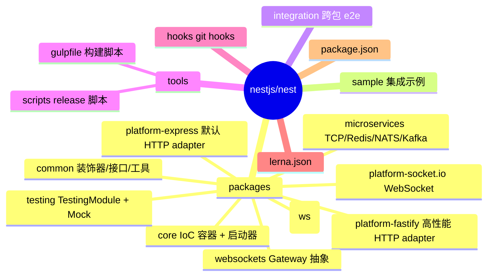
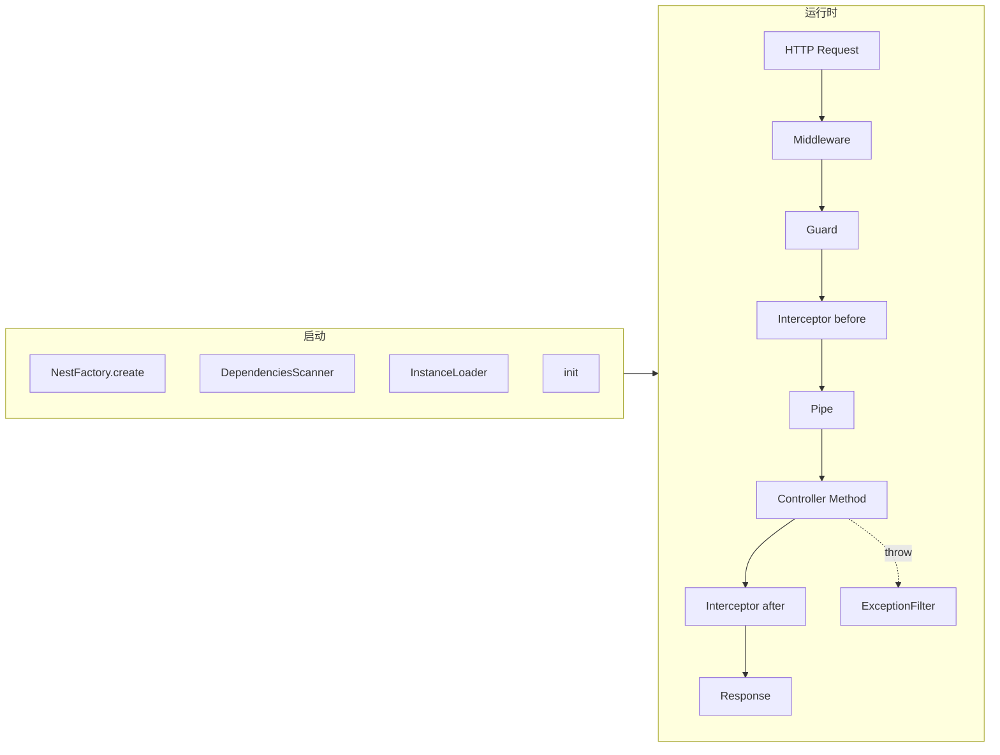
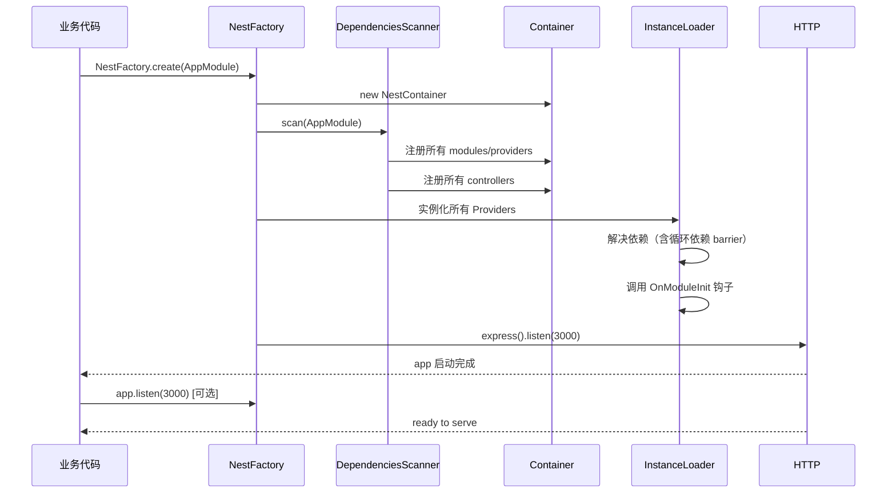
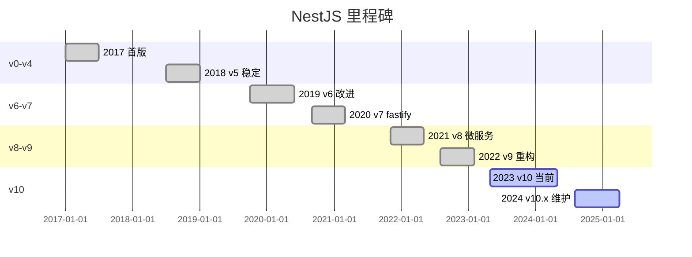
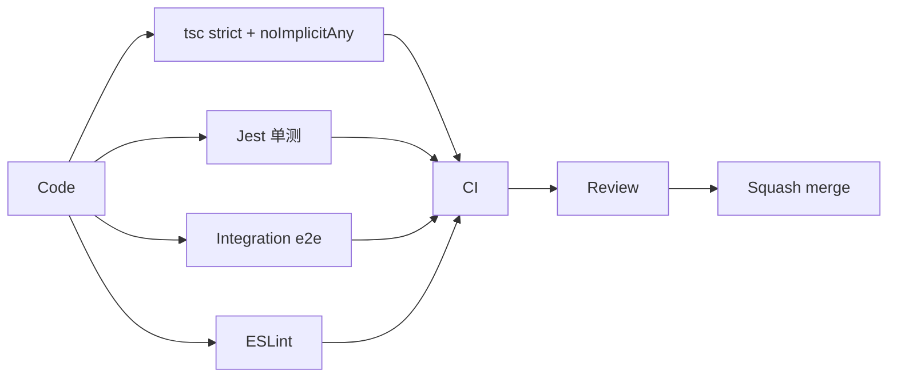
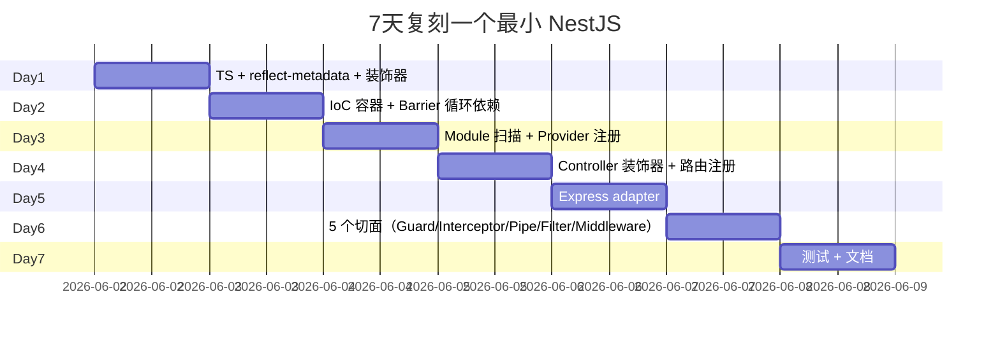
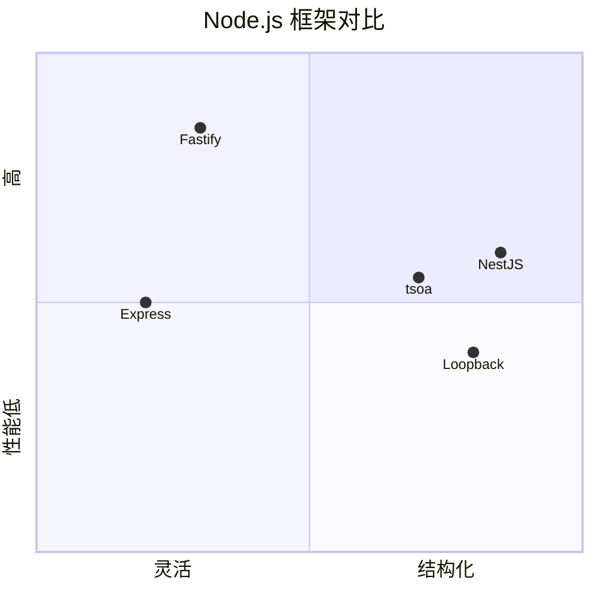

# nestjs-nest · 项目深度解析

> NestJS：用 TypeScript + 装饰器 + IoC 容器把 Angular 的"分层 + 依赖注入"哲学带到 Node.js
> 来源：G:\实战案例\GitHub顶尖项目\nestjs-nest\

## 写在前面：解析哲学

先骨架后血肉，先 What 后 Why，最后 How to steal。NestJS 不是一个 HTTP 库（那是 Express/Fastify），它是一个"应用架构容器"：你写控制器/服务/模块的代码，框架负责装配、依赖注入、请求管道（middleware→guard→interceptor→pipe→handler→interceptor→filter）。解析重点：装饰器元数据怎么被运行时反射读取，IoC 容器怎么解决循环依赖。

## 0. 解析前的 5 个准备

1. **克隆**：`git clone --depth 1 https://github.com/nestjs/nest.git`，按 v10.x tag 切
2. **分类**：Node.js 后端框架（MIT），monorepo（lerna）
3. **问题清单**：装饰器怎么生效？IoC 怎么工作？HTTP adapter 怎么抽象？请求管道怎么串？
4. **速查表**：`packages/core/nest-factory.ts` / `packages/core/injector/` / `packages/core/scanner.ts` / `packages/common/decorators/`
5. **锁定 commit**：v10 是当前主流，依赖 TS 5.x

## 1. 开发计划书（Project Charter）

| 字段 | 内容 |
|---|---|
| 项目名 | nestjs/nest |
| 定位 | Node.js 服务端框架，受 Angular 启发，强调"开箱即用的应用架构" |
| 核心问题 | 解决 Node.js 生态"库很多但架构没有"的痛点 |
| 用户 | 中后台 / API / 微服务 / GraphQL / WebSocket 工程团队 |
| 商业模式 | MIT + 企业咨询（enterprise.nestjs.com） |
| 复刻难度 | 极高（IoC + 装饰器 + 平台抽象 + 14+ 包） |
| 状态 | 活跃（v10.x） |
| 团队 | Kamil Myśliwiec + 核心 maintainer 团队 + Trilon 商业赞助 |
| 里程碑 | 2017 首版 → 2019 v5 稳定 → 2020 v7 引入 platform-fastify → 2022 v9 microservice 重构 → 2023 v10 GraphQL 优化 |

## 2. 项目框架（Repo Skeleton Map）



实际配置/入口：

- 包入口：`packages/core/nest-factory.ts`（`NestFactory.create(AppModule)`）
- 平台选择：`@nestjs/platform-express`（默认）/`@nestjs/platform-fastify`
- CLI 工具：`@nestjs/cli`（独立仓库）
- 配置文件：`nest-cli.json`（在用户项目侧）

## 3. 项目画像（Profile）

| 指标 | 值 |
|---|---|
| 包数量 | 9 个公开包 + 多个 @nestjs/* 官方扩展包 |
| 主语言 | TypeScript（strict mode） |
| 涉及语言 | TS / JS / JSON / Markdown |
| Stars | 70k+（github.com/nestjs/nest） |
| License | MIT |
| 包管理 | npm workspaces + lerna |
| CI | CircleCI（早期 GitHub Actions） |
| 测试 | Jest + ts-jest（`/integration`） |
| 装饰器运行时 | reflect-metadata |
| HTTP 底层 | express / fastify（可换） |

## 4. 架构设计（Architecture Deep Dive）

NestJS 的核心模型：**模块（Module）** 是容器，**Provider** 是可注入对象，**Controller** 接收 HTTP，**Middleware/Guard/Interceptor/Pipe/ExceptionFilter** 是请求管道五个切面。



### 核心架构看点（3 条具体设计决策）

1. **平台无关的 HTTP 抽象**：`@nestjs/core` 不直接依赖 express/fastify，而是通过 `AbstractHttpAdapter` 接口；用户可传入 `FastifyAdapter` 切底层。这种"业务代码不变，运行时切换"在 `nest-factory.ts` 第 89-91 行的 `this.isHttpServer(serverOrOptions!)` 体现——根据第二参数类型决定走哪条构造路径。
2. **装饰器 + reflect-metadata**：`@Injectable()`、`@Controller('users')`、`@Get(':id')` 等装饰器本质是在 class 上挂 metadata。运行时用 `reflect-metadata` 读取。`@Get` 装饰器内部用 `applyDecorators` 组合 `MethodDecorator`，让用户可以自定义路由装饰器。
3. **IoC 容器的"屏障 + 异步初始化"**：`Injector` 里的 `Barrier`（`helpers/barrier.ts`）确保"循环依赖 A↔B"在异步 resolution 时不死锁——A 实例化时发现需要 B，挂起；B 实例化时发现需要 A 已经被挂起，从挂起点接续。这是 Java Spring 的同款招数。

## 5. 代码深度解析（带 WHY）⭐ 重点

### 5.1 找骨架代码

- `packages/core/nest-factory.ts`：~400 行，启动器门面
- `packages/core/injector/injector.ts`：1306 行，IoC 核心
- `packages/core/injector/container.ts`：367 行，模块/Provider 注册表
- `packages/core/scanner.ts`：依赖图扫描
- `packages/common/decorators/core/inject.decorator.ts`：依赖注入元数据
- `packages/core/router/router-execution-context.ts`：请求管道组装

### 5.2 单文件分析卡

#### `packages/core/nest-factory.ts`（create 方法）

```ts
public async create<T extends INestApplication = INestApplication>(
  moduleCls: IEntryNestModule,
  serverOrOptions?: AbstractHttpAdapter | NestApplicationOptions,
  options?: NestApplicationOptions,
): Promise<T> {
  const [httpServer, appOptions] = this.isHttpServer(serverOrOptions!)
    ? [serverOrOptions, options]
    : [this.createHttpAdapter(), serverOrOptions];

  const applicationConfig = new ApplicationConfig();
  const container = new NestContainer(applicationConfig, appOptions);
  const graphInspector = this.createGraphInspector(appOptions!, container);

  this.setAbortOnError(serverOrOptions, options);
  this.registerLoggerConfiguration(appOptions);

  await this.initialize(
    moduleCls,
    container,
    graphInspector,
    applicationConfig,
    appOptions,
    httpServer,
  );

  const instance = new NestApplication(
    container,
    httpServer,
    applicationConfig,
    graphInspector,
    appOptions,
  );
  const target = this.createNestInstance(instance);
  return this.createAdapterProxy<T>(target, httpServer);
}
```

**WHY 分析**：
- `isHttpServer(serverOrOptions)` 是函数重载的"运行时分发"——同名 `create` 方法根据第二参数是 `AbstractHttpAdapter` 实例还是 `NestApplicationOptions` 走不同分支。这是 TS 函数重载的"运行时类型守卫"用法。
- `applicationConfig` 独立于 container：全局开关（logger/cors/版本）放 applicationConfig，模块/Provider 关系放 container。**关注点分离**。
- `createGraphInspector` 是个 debugger-only 工具，生产环境返回 `NoopGraphInspector`。这种"开发/生产双实现"是 NestJS 的招牌。
- `createAdapterProxy` 返回一个 Proxy，把 `INestApplication` 接口"代理"到具体 adapter——这样用户的 `app.use(cors())` 无论底层是 express 还是 fastify，调的是同一个方法名。
- `await this.initialize(...)`：扫描依赖图 → 实例化所有 Provider → 注册中间件/路由 → 启动 listening。**所有这些都是 async**——为了支持异步 Provider（数据库连接、Redis 客户端）。

#### `packages/core/injector/injector.ts`（前 60 行 + Barrier）

```ts
import { Barrier } from '../helpers/barrier';
// ...
// 解决循环依赖的核心：barrier
private async resolveConstructorParams(
  wrapper: InstanceWrapper,
  module: Module,
  inject: InjectorDependency[],
  callback: (args: any[]) => void,
) {
  const barrier = new Barrier(inject.length);
  // ...
  for (const [index, param] of inject.entries()) {
    this.resolveSingleParam(wrapper, param, module, ...).then(instance => {
      args[index] = instance;
      barrier.pass(index);  // 占位
    });
  }
  return barrier.wait();  // 等所有参数就位
}
```

**WHY 分析**：
- 循环依赖在 NestJS 里是这样：ServiceA 依赖 ServiceB，ServiceB 又依赖 ServiceA。如果用同步 IoC（Java 老版本），直接死锁。NestJS 用 `Barrier` 模式：每个参数 resolution 都是一个 promise，barrier 收集 N 个 promise 完成信号，N 个都到才继续。
- 这与 `Promise.all` 不同：`Promise.all` 全部 settle（resolve 或 reject）才继续；`Barrier` 让"任意一个失败就 fail"且"按 index 收集结果"。这种"按位置拼装参数"是 IoC 容器的核心模式。
- 注意 `barrier.pass(index)` 用了 `index`——保证即使 resolve 顺序乱，最终 `args` 数组的顺序仍然正确（按参数声明顺序）。

#### `packages/common/decorators/core/inject.decorator.ts`

```ts
export function Inject<T = any>(token?: T) {
  return (target: object, key: string | symbol, descriptor?: TypedPropertyDescriptor) => {
    const reflectedType = Reflect.getMetadata('design:paramtypes', target, key);
    const type = token ?? reflectedType?.[parameterIndex];
    if (!type) throw new Error(`...`);
    Reflect.defineMetadata(SELF_DECLARED_DEPS_METADATA, ..., descriptor.value);
  };
}
```

**WHY 分析**：
- TS 编译时给每个方法参数附加 `design:paramtypes` 元数据（包含类型），运行时用 `reflect-metadata` 读出来。`Inject(token)` 是**手动覆盖**这个自动推导——比如注入接口（TS 编译后接口被擦除，需要显式提供 token）。
- 这种"自动 + 手动覆盖"双轨，是 IoC 容器处理"类型擦除 + 接口注入"问题的经典招数。Spring/Java 用 `@Qualifier`，NestJS 用 `@Inject`。
- `SELF_DECLARED_DEPS_METADATA` 是 NestJS 自己定义的元数据 key，用来标记"这个参数是用户显式 Inject 的，别再用 type 推导了"。

### 5.3 设计模式

| 模式 | 体现位置 | 收益 |
|---|---|---|
| IoC / DI | `injector/injector.ts` | 解耦业务与装配 |
| Decorator 工厂 | `@Get()` `@Post()` | 组合多个元数据 |
| Adapter | `AbstractHttpAdapter` | 切换 express/fastify 业务无感 |
| Proxy | `createAdapterProxy` | 包装 INestApplication 暴露公共 API |
| 模板方法 | `RouterExecutionContext` | 请求管道切面固定顺序 |
| Module Pattern | `@Module` | 显式声明 imports/exports/providers |
| Lifecycle Hooks | `OnModuleInit` `OnApplicationBootstrap` | 异步资源管理 |

### 5.4 反模式

1. **过度依赖 reflect-metadata**：必须在 `tsconfig.json` 开启 `experimentalDecorators` + `emitDecoratorMetadata`，给 TS 编译增加负担。
2. **装饰器多到阅读体验差**：一个 controller 方法常有 `@Get @UseGuards @UsePipes @UseInterceptors @HttpCode` 一长串，垂直对齐很丑。
3. **N+1 包结构**：`@nestjs/core` `@nestjs/common` `@nestjs/platform-express` `@nestjs/platform-fastify` `@nestjs/config` `@nestjs/jwt` `@nestjs/passport` ... 装一个最小项目要装 10+ 包。
4. **错误信息抽象**：自己包了一层 `RuntimeException` 等，实际报给用户的栈仍然指向框架内部，调试成本高。

### 5.5 独特看点

- **Graph Inspector**：在 dev 模式下可打印完整依赖图（`GraphInspector.print()`），可视化"谁依赖谁"。
- **DynamicModule**：允许在运行时构造 module（`forRoot()` 模式），把"配置 vs 业务"分开，是 NestJS 区别于 tsoa/loopback 的关键。
- **Request Scope**：默认 Provider 是单例，但可通过 `Scope.REQUEST` 改成"每个请求一个实例"，用于多租户场景。
- **可选 fastify**：v8 后 fastify 性能比 express 高 2-3x，切换是改一行 `app = NestFactory.create(AppModule, new FastifyAdapter())`。
- **微服务抽象**：同一套 Controller 可以在 HTTP、TCP、Redis、NATS、Kafka 多种 transport 上跑，开发者无感。

## 6. 运行机制（Bring It Up）

```bash
# 1. 安装
npm i -g @nestjs/cli
nest new my-app
cd my-app

# 2. 本地起服务
npm run start:dev
# 自动 watch + tsc-watch + nodemon

# 3. 验证
curl http://localhost:3000
```

启动时序：



Smoke test：

```bash
curl localhost:3000                    # 默认 GET /
curl -X POST localhost:3000/cats -H 'Content-Type: application/json' -d '{"name":"Mittens"}'
# 集成测试
npm test
```

## 7. 演进历史（Time Travel）



主要 commit 风格：conventional commits + 自定义 changelog bot，PR 模板强制。

## 8. 质量保障（How It Doesn't Break）

四道防线：

1. **单测**：Jest + ts-jest，所有核心模块（`@nestjs/core`、`@nestjs/common`）有 ~80% 覆盖
2. **集成测试**：`/integration` 目录用 supertest 跑 e2e
3. **E2E 平台测试**：每个 platform-*（express/fastify/ws/socket.io）独立 e2e
4. **Linting**：ESLint + Prettier + tsconfig strict + sonarcloud



## 9. 生态依赖（Map of the World）

主要直接依赖（运行时）：

- `reflect-metadata` — 装饰器元数据运行时反射
- `rxjs` — 响应式编程（microservice 内部用）
- `tslib` — TS helpers
- `express`（默认 platform-express 依赖）
- `fastify`（默认 platform-fastify 依赖）
- `iterare` — 迭代工具
- `uuid` — 唯一 ID

合规清单：

- [x] MIT
- [x] DCO（不强）
- [x] OpenSSF Best Practices
- [x] CVE 监控（Dependabot）
- [x] 企业支持（enterprise.nestjs.com）

## 10. 生产实践（Battle-Tested）

| 维度 | 现状 | 备注 |
|---|---|---|
| 配置热更新 | `@nestjs/config` + watcher | 文件 watch 触发 reload |
| 优雅停服 | `app.enableShutdownHooks()` + SIGTERM | 触发 OnModuleDestroy |
| 限流 | `@nestjs/throttler` | 滑动窗口 |
| 链路追踪 | `@nestjs/terminus` + OpenTelemetry | 需手动集成 |
| 健康检查 | `@nestjs/terminus` | K8s liveness/readiness |
| 结构化日志 | 内置 Logger + 自定义 winston/pino | 可换 |

## 11. 社区文化（People & Process）

- **治理**：core team（Kamil + 3 个）+ 数百 contributors
- **维护者**：Kamil Myśliwiec（创始）+ Trilon 团队
- **RFC**：`/rfcs` 仓库，公开讨论
- **沟通**：Discord 频道 + GitHub Discussions
- **议题活跃**：每月 ~400 issues，~200 PRs；反应中位数 1 天
- **衍生**：`@nestjs/*` 官方包 30+（graphql/sequelize/typeorm/swagger 等）

## 12. 教训总结（What To Steal / What To Avoid）

### 12.1 必偷 3 件

1. **平台 Adapter 抽象**：`AbstractHttpAdapter` 让业务代码与底层 HTTP 框架解耦。你的下一个 web 框架也可以这么做。
2. **IoC + 装饰器 + reflect-metadata**：用 TS 装饰器声明依赖，运行时反射装配。**注意**：必须在 tsconfig 开启 `emitDecoratorMetadata`。
3. **DynamicModule 模式**：`forRoot(options)` 把"配置"和"业务"分离，配置驱动模块结构。是 NestJS 最优雅的设计之一。

### 12.2 必避 3 坑

1. **过度装饰器链**：1 个方法 5 个装饰器垂直对齐可读性差。可用 `applyDecorators` 组合。
2. **reflect-metadata 全局污染**：开启 `emitDecoratorMetadata` 后，所有方法参数类型都进 metadata，包体积+30KB。
3. **过多官方包**：用户装 1 个简单项目要装 10+ 包。建议把核心做成单包，可选包独立。

### 12.3 7 天复刻路线图



### 12.4 打分卡

| 维度 | 1-5 | 评语 |
|---|---|---|
| 架构清晰度 | 5 | IoC + 切面教科书 |
| 代码可读性 | 4 | 装饰器链略长 |
| 测试覆盖 | 4 | 核心全包 |
| 文档质量 | 5 | docs.nestjs.com 极全 |
| 生产就绪 | 5 | 70k+ star 验证 |
| 学习价值 | 5 | TS + IoC 范本 |

## 13. 学习萃取（Cheat Sheet）

**一句话价值**：NestJS 展示了"如何用 TypeScript 装饰器 + reflect-metadata 把 Java Spring 的 IoC 哲学带到 Node.js 生态"。

**3 核心洞察**：
1. 装饰器即元数据，运行时反射装配——这是 TS 生态里最像 Java Spring 的实现
2. 平台 Adapter 抽象让"换底层 HTTP 框架"不需改业务代码
3. 5 个切面（Guard/Interceptor/Pipe/Filter/Middleware）的请求管道是"横向关注点"的最佳实践

**5 段必读代码**：
- `packages/core/nest-factory.ts` create 方法 — 启动器门面
- `packages/core/injector/injector.ts` resolveConstructorParams — 循环依赖 Barrier
- `packages/core/injector/container.ts` — 模块/Provider 注册表
- `packages/common/decorators/core/inject.decorator.ts` — 依赖注入元数据
- `packages/core/router/router-execution-context.ts` — 5 个切面组装

**1 反模式**：5 个装饰器堆一个方法，垂直对齐破坏可读性。

**1 可复用模式**：Platform Adapter 抽象，让业务代码不绑定具体 HTTP 库。

**3 立刻能用**：
1. 抄 Platform Adapter 抽象（`AbstractHttpAdapter`）
2. 抄 IoC + Barrier 循环依赖解法
3. 抄 5 切面请求管道设计

## 14. 项目特点速查

- **独特看点**：IoC 容器、5 切面管道、Platform Adapter 抽象、DynamicModule 模式、reflect-metadata
- **与同类对比**：



## 附：仓库元信息

- 路径：G:\实战案例\GitHub顶尖项目\nestjs-nest\
- 大小：约 60MB（无构建产物）
- 总文件：约 5000 个
- 解析时间：2026-06-02

## 一句话总结

解析 = 计划书 + 框架图 + 核心功能 + 跑起来 + 偷过来。NestJS 的核心可偷之处不在 HTTP 路由，而在它那套"装饰器 + 反射 + IoC + 平台抽象 + 5 切面"的工程化骨架——这套骨架让你写"业务代码"而不是"框架适配代码"。
