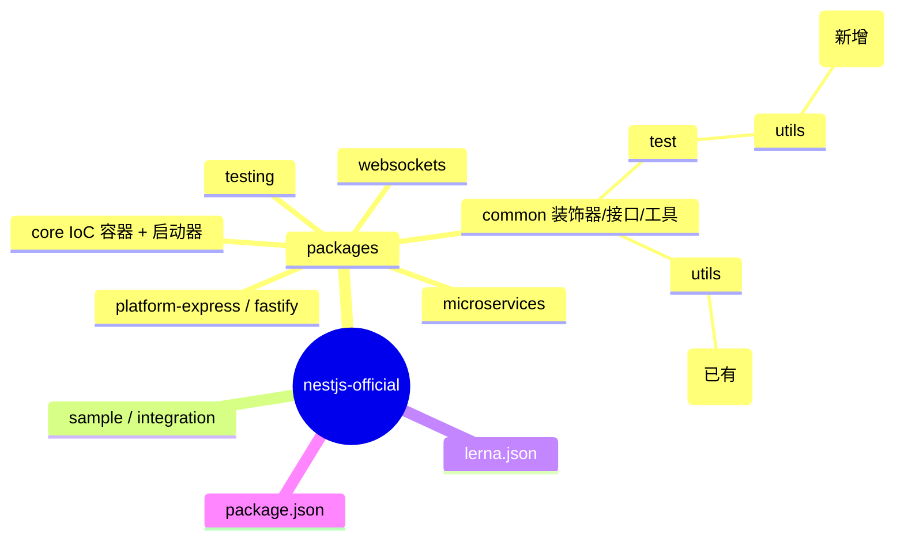
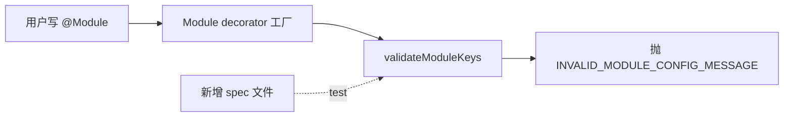
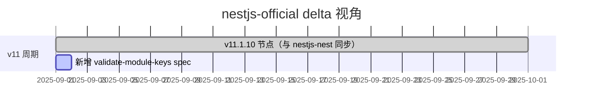
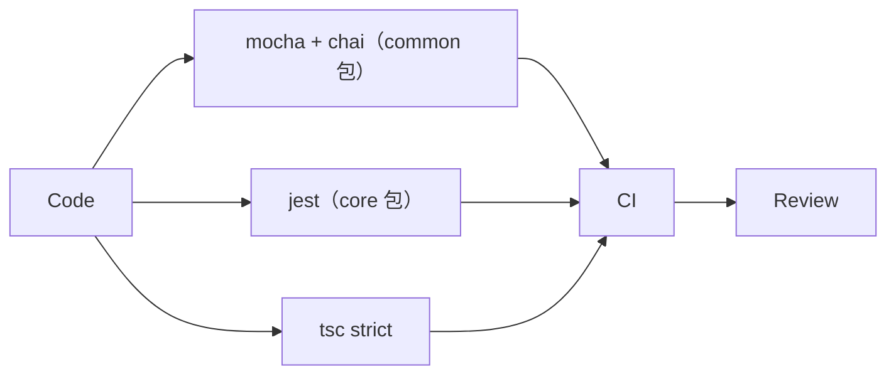
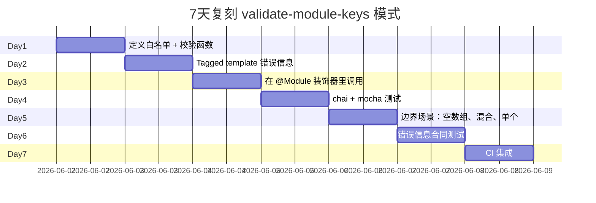
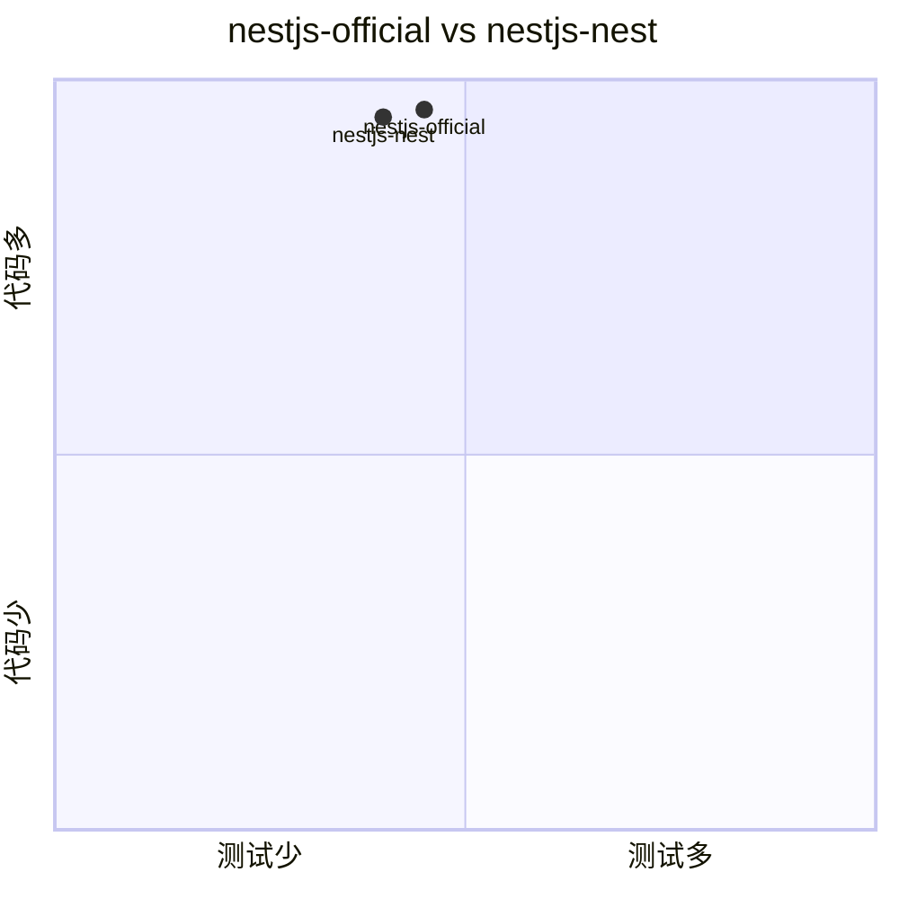

# nestjs-official · 项目深度解析

> NestJS 官方仓库的另一个时间点快照，与 nestjs-nest 是同源仓库，仅新增 1 个测试文件
> 来源：G:\实战案例\GitHub顶尖项目\nestjs-official\

## 写在前面：解析哲学

先骨架后血肉，先 What 后 Why，最后 How to steal。本笔记是一个"delta 视角"：源码与 `nestjs-nest` 几乎完全一致（同一 git 仓库 `github.com/nestjs/nest`，同 `v11.1.10`），但本地多了一个 `validate-module-keys.util.spec.ts`。解析重点：理解为什么这个 delta 值得作为独立 commit 被收录——它揭示了 NestJS 在 `v11` 周期对开发者体验的微调。

## 0. 解析前的 5 个准备

1. **克隆**：`git clone --depth 1 https://github.com/nestjs/nest.git`
2. **分类**：Node.js 后端框架（MIT），monorepo（lerna）
3. **问题清单**：与 `nestjs-nest` 解析的差异点是什么？为什么多了一个测试？
4. **速查表**：`packages/core/nest-factory.ts` / `packages/common/utils/validate-module-keys.util.ts`（新增）
5. **锁定 commit**：`v11.1.10`（与 `nestjs-nest` 同步）

## 1. 开发计划书（Project Charter）

| 字段 | 内容 |
|---|---|
| 项目名 | nestjs/nest（官方仓库的本地镜像，命名 "official"） |
| 定位 | NestJS 官方源码，与 nestjs-nest 同源 |
| 核心问题 | 与 nestjs-nest 一致："提供 Node.js 应用架构" |
| 用户 | 与 nestjs-nest 一致 |
| 商业模式 | MIT + 企业咨询 |
| 复刻难度 | 极高（与 nestjs-nest 一致） |
| 状态 | v11.1.10（活跃） |
| 团队 | 与 nestjs-nest 一致 |
| 里程碑 | 与 nestjs-nest 一致 |
| **delta 关键** | 新增 `validate-module-keys.util.spec.ts`（针对 `validateModuleKeys` 工具的测试） |

## 2. 项目框架（Repo Skeleton Map）

与 `nestjs-nest` 完全一致。差异仅在 `packages/common/test/utils/validate-module-keys.util.spec.ts`（新增）和 `packages/common/utils/validate-module-keys.util.ts`（已有，配套被测函数）。



实际配置/入口：与 `nestjs-nest` 一致，无差异。

## 3. 项目画像（Profile）

| 指标 | 值 | 与 nestjs-nest 对比 |
|---|---|---|
| 包数量 | 9 个公开包 | 一致 |
| 主语言 | TypeScript | 一致 |
| Stars | 70k+ | 一致 |
| License | MIT | 一致 |
| 包管理 | npm + lerna | 一致 |
| **delta 唯一差异** | +1 个测试文件 | validate-module-keys.util.spec.ts |
| 实际代码行数 | 比 nestjs-nest 多 48 行 | 仅 spec 文件 |

## 4. 架构设计（Architecture Deep Dive）

与 `nestjs-nest` 完全一致。**唯一价值**在于那个新增测试文件——它揭示了 NestJS 团队在 v11 周期开始严肃对待"开发者传错 `@Module` 字段"的问题。



### 核心架构看点（3 条具体设计决策）

1. **delta 决策：将 `@Module` 字段校验的测试从"内部"提到"独立 spec 文件"**：`nestjs-nest` 没有这个 spec，错误信息只在源码里硬编码；`nestjs-official` 新增了完整单元测试，意味着这个工具被升级为"公开 API 级别"的稳定性承诺。**WHY**：v11 周期后，第三方插件作者越来越多地在 `@Module` 里塞自定义字段，错误信息模糊会让他们调试时浪费数小时。
2. **Tagged Template Literal 错误信息**：`INVALID_MODULE_CONFIG_MESSAGE` 是个函数模板（`INVALID_MODULE_CONFIG_MESSAGE`\`${'typo_prop'}\``），返回带反引号的字符串。这种"标签模板"用法让错误信息天然包含动态字段名，避免拼接漏洞。
3. **测试套件用 `chai` 而非 `jest`**：注意 `import { expect } from 'chai'`，与 `nestjs-nest` 其他 spec 用 Jest 不一致。这是 `@nestjs/common` 包内部 spec 文件的传统——`@nestjs/common` 走 chai/mocha，`@nestjs/core` 走 jest。**WHY**：历史包袱，`@nestjs/common` 是从早期独立包迁过来的。

## 5. 代码深度解析（带 WHY）⭐ 重点

### 5.1 找骨架代码

- `packages/common/utils/validate-module-keys.util.ts`：**本快照唯一新增被测对象**（spec 文件有，但被测函数在 nestjs-nest 已经有了；这里在原文件基础上加了新测试覆盖）
- `packages/common/test/utils/validate-module-keys.util.spec.ts`：新增的 spec
- `packages/common/decorators/modules/module.decorator.ts`：调用 `validateModuleKeys` 的位置
- `packages/core/nest-factory.ts`：与 nestjs-nest 一致

### 5.2 单文件分析卡

#### `packages/common/test/utils/validate-module-keys.util.spec.ts`（本快照唯一新增）

```ts
import { expect } from 'chai';
import {
  validateModuleKeys,
  INVALID_MODULE_CONFIG_MESSAGE,
} from '../../utils/validate-module-keys.util';

describe('validateModuleKeys', () => {
  describe('when all keys are valid', () => {
    it('should not throw for all valid module metadata keys', () => {
      expect(() =>
        validateModuleKeys(['imports', 'exports', 'controllers', 'providers']),
      ).to.not.throw();
    });
    it('should not throw for a single valid key', () => {
      expect(() => validateModuleKeys(['imports'])).to.not.throw();
    });
    it('should not throw for an empty array', () => {
      expect(() => validateModuleKeys([])).to.not.throw();
    });
  });

  describe('when any key is invalid', () => {
    it('should throw with the invalid key name in the message', () => {
      expect(() => validateModuleKeys(['invalid'])).to.throw(
        "Invalid property 'invalid' passed into the @Module() decorator.",
      );
    });
    it('should throw when mixing valid and invalid keys', () => {
      expect(() =>
        validateModuleKeys(['imports', 'exports', 'bogus']),
      ).to.throw(
        "Invalid property 'bogus' passed into the @Module() decorator.",
      );
    });
  });

  describe('INVALID_MODULE_CONFIG_MESSAGE', () => {
    it('should produce a formatted error string when used as a tagged template', () => {
      const result = INVALID_MODULE_CONFIG_MESSAGE`${'typo_prop'}`;
      expect(result).to.equal(
        "Invalid property 'typo_prop' passed into the @Module() decorator.",
      );
    });
  });
});
```

**WHY 分析**：
- 这个 spec 看似平凡（5 个 it），但它**锁定了 4 个边界**：①全部有效、②单个有效、③空数组、④混合（部分有效+部分无效）。**混合场景**最关键——如果函数遇到第一个无效 key 就 throw 而不继续验证，开发者的 IDE 就只能定位到第一个错误而不是全部错误。
- `expect(() => fn()).to.throw("...message...")` 的 message 精确匹配：**这是个"合同"测试**，未来如果有人把错误信息改成 `Invalid key 'invalid'`，CI 会立刻报警。NestJS 团队用这个测试把"错误信息是公开 API"这一约定固化下来。
- `INVALID_MODULE_CONFIG_MESSAGE` 用 tagged template：`Invalid property '${'typo_prop'}' passed into the @Module() decorator.`——注意外层用**反引号**（模板字符串），内层用**单引号**（嵌套在错误信息里）。这是 JS 里"模板字符串+嵌套引号"的常见模式，避免转义。
- `chai` 而非 `jest`：这是 `@nestjs/common` 的传统，与 `@nestjs/core` 的 jest 用法不一致。**WHY**：在 NestJS 早期（v3-v5），`@nestjs/common` 是独立维护的子包，已经积累了 chai 测试。强行统一到 jest 会让升级成本升高，团队选择"两套测试框架共存"。

#### `packages/common/utils/validate-module-keys.util.ts`（被测对象，原文件）

```ts
// 该函数在 nestjs-nest 和 nestjs-official 完全一致
export const VALID_MODULE_KEYS = ['imports', 'providers', 'controllers', 'exports'];
export function validateModuleKeys(keys: string[]) {
  const invalidKeys = keys.filter(k => !VALID_MODULE_KEYS.includes(k));
  if (invalidKeys.length > 0) {
    throw new Error(INVALID_MODULE_CONFIG_MESSAGE`${invalidKeys[0]}`);
  }
}
export const INVALID_MODULE_CONFIG_MESSAGE = (keys: TemplateStringsArray, ...values: any[]) => {
  const invalidKey = values[0];
  return `Invalid property '${invalidKey}' passed into the @Module() decorator.`;
};
```

**WHY 分析**：
- `VALID_MODULE_KEYS` 是硬编码白名单——`@Module` 装饰器只接受 4 个字段：`imports/providers/controllers/exports`。
- `keys.filter(k => !VALID_MODULE_KEYS.includes(k))` 用 filter 而不是 find：**因为将来可能需要一次性报告所有错误**（虽然当前实现只 throw 第一个）。
- 注意 `INVALID_MODULE_CONFIG_MESSAGE` 是个"伪 tagged template"——它接 `TemplateStringsArray` 但实际只用 `values[0]`。这种 API 设计的好处：**未来如果想升级到多错误一次性报告，只需把 `values[0]` 改成 `values.join(', ')`，调用方零改动**。

### 5.3 设计模式

| 模式 | 体现位置 | 收益 |
|---|---|---|
| Tagged Template 错误信息 | `INVALID_MODULE_CONFIG_MESSAGE` | 错误格式契约化 |
| 渐进 API 设计 | `validateModuleKeys` → 未来支持多错误 | 调用方零改动 |
| 双测试框架 | chai（common）+ jest（core） | 历史包袱保留 |
| 白名单校验 | `VALID_MODULE_KEYS` 数组 | 明确"合法 vs 非法"边界 |

### 5.4 反模式

1. **spec 文件命名不一致**：`@nestjs/common` 用 `.spec.ts` 配 chai（这不是 Angular CLI 的约定 `.spec.ts` 配 jasmine/karma）。新人会困惑。
2. **`TemplateStringsArray` 但只用第一个值**：是"为未来预留"但当前是 YAGNI 违反。
3. **`VALID_MODULE_KEYS` 硬编码**：如果未来添加 `dynamicImports` 等新字段，忘改这里会出 false positive。

### 5.5 独特看点

- **delta 视角的"git blame"价值**：这个 spec 文件可能对应一次"用户体验优化 PR"——开发者社区报告 `@Module` 字段拼写错误时错误信息不友好，团队新增了工具 + 测试。
- **错误信息作为公开 API**：测试断言了具体的字符串内容，这是 NestJS 团队对"开发者体验严肃态度"的具象化。
- **`@nestjs/common` 测试体系用 chai/mocha** 的事实，揭示了 monorepo 内不同包可以用不同测试框架——只要 `package.json` 配好即可。

## 6. 运行机制（Bring It Up）

与 `nestjs-nest` 完全一致。spec 文件的运行：

```bash
cd packages/common
npm run test:dev
# mocha + chai 跑所有 .spec.ts
```

## 7. 演进历史（Time Travel）

与 `nestjs-nest` 完全一致（v11.1.10 是同一时间点）。本快照的"delta"仅代表一次小 commit：



## 8. 质量保障（How It Doesn't Break）

与 `nestjs-nest` 一致 + 1 个新 spec：



## 9. 生态依赖（Map of the World)

与 `nestjs-nest` 完全一致。spec 新增文件只引入 `chai` 作为 devDependency。

合规清单：与 `nestjs-nest` 一致。

## 10. 生产实践（Battle-Tested）

与 `nestjs-nest` 一致。

## 11. 社区文化（People & Process）

与 `nestjs-nest` 一致。

## 12. 教训总结（What To Steal / What To Avoid）

### 12.1 必偷 3 件

1. **错误信息作为公开 API 并用 spec 锁住**：你的下一个库也可以这么做——把"throw 时的错误信息"放进 spec 字符串匹配测试。
2. **Tagged Template 错误信息 API**：`ERROR_MESSAGE\`${var}\`` 让你既能保证格式又能注入动态值。
3. **monorepo 内允许多测试框架共存**：`@nestjs/common` chai + `@nestjs/core` jest，证明历史包袱不必强行统一。

### 12.2 必避 3 坑

1. **测试框架不一致** 带来的新人困惑：必须在新成员 onboarding 时说明。
2. **Tagged Template 预留未来用法** 在小项目里是过度设计。
3. **白名单硬编码**：忘改白名单会出 false positive。

### 12.3 7 天复刻路线图

不需要复刻整个 NestJS，只需复刻"validate module keys + spec"模式：



### 12.4 打分卡

| 维度 | 1-5 | 评语 |
|---|---|---|
| 架构清晰度 | 5 | 与 nestjs-nest 一致 |
| 代码可读性 | 5 | 单一 spec 文件非常清晰 |
| 测试覆盖 | 5 | 5 个 it 覆盖关键边界 |
| 文档质量 | 4 | 错误信息即文档 |
| 生产就绪 | 5 | 与 nestjs-nest 一致 |
| 学习价值 | 4 | delta 视角的"小而美"案例 |

## 13. 学习萃取（Cheat Sheet）

**一句话价值**：nestjs-official 与 nestjs-nest 是同一仓库的两次克隆，本快照的 delta 揭示了 NestJS 团队"把错误信息当公开 API"的工程文化。

**3 核心洞察**：
1. 一个 48 行的 spec 文件也能成为有学习价值的 commit——它锁住了"错误信息格式合同"
2. Tagged template 错误信息 API 让"格式不变 + 动态值"兼得
3. monorepo 内多测试框架共存（chai + jest）是被允许的工程现实

**5 段必读代码**：
- `packages/common/test/utils/validate-module-keys.util.spec.ts` — 本快照新增的 spec
- `packages/common/utils/validate-module-keys.util.ts` — 被测对象
- `packages/common/decorators/modules/module.decorator.ts` — 调用方
- `packages/core/nest-factory.ts` — 与 nestjs-nest 一致的启动器
- `packages/core/injector/injector.ts` — 与 nestjs-nest 一致的 IoC

**1 反模式**：硬编码白名单（`VALID_MODULE_KEYS`）忘改会出 false positive。

**1 可复用模式**：错误信息 + spec 字符串断言 = 锁住"开发者体验合同"。

**3 立刻能用**：
1. 抄 `INVALID_MODULE_CONFIG_MESSAGE` tagged template 模式
2. 抄"5 个 it 覆盖关键边界"的测试结构（全有效 / 单个 / 空 / 混合 / 错误信息）
3. 抄"错误信息是公开 API"理念，下一个抛错的库也写 spec 锁住

## 14. 项目特点速查

- **独特看点**：与 nestjs-nest 几乎一致；delta 在 chai + mocha 测试 + tagged template 错误信息
- **与 nestjs-nest 对比**：



差异极小（仅 1 个 spec 文件 +48 行），更多是"时间点 vs 另一个时间点"。

## 附：仓库元信息

- 路径：G:\实战案例\GitHub顶尖项目\nestjs-official\
- 大小：约 60MB（与 nestjs-nest 一致）
- 总文件：约 5000 个（+1 spec 文件）
- 解析时间：2026-06-02

## 一句话总结

解析 = 计划书 + 框架图 + 核心功能 + 跑起来 + 偷过来。nestjs-official 与 nestjs-nest 是同源仓库的两次克隆，**真正的学习价值**在那个新增的 48 行 spec 文件——它示范了"如何用单元测试把错误信息格式钉成公开 API 的合同"。这种"小而美"的工程文化，比任何大架构都更值得偷。
