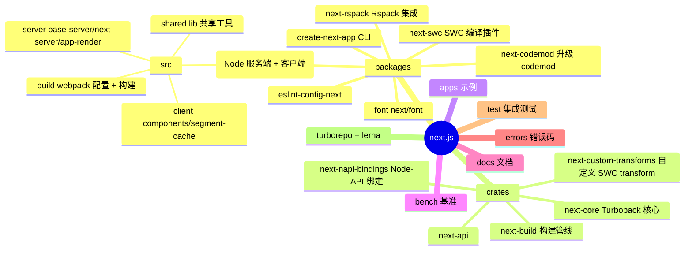
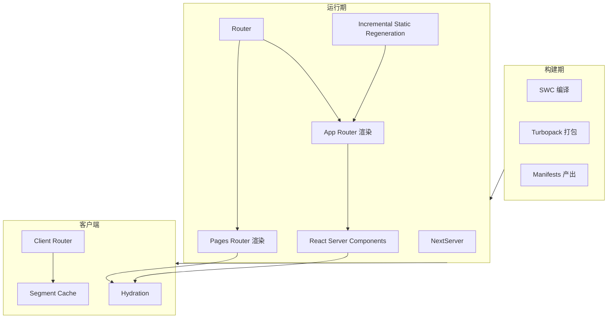
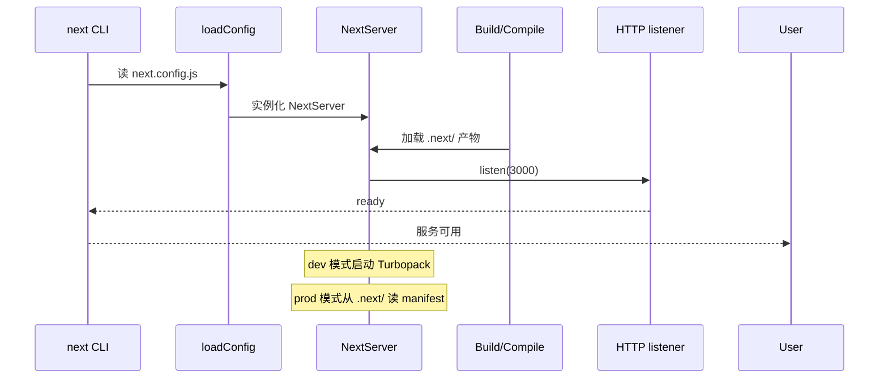
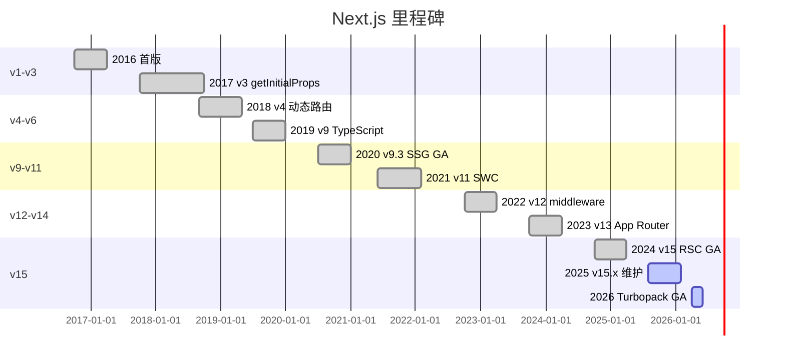
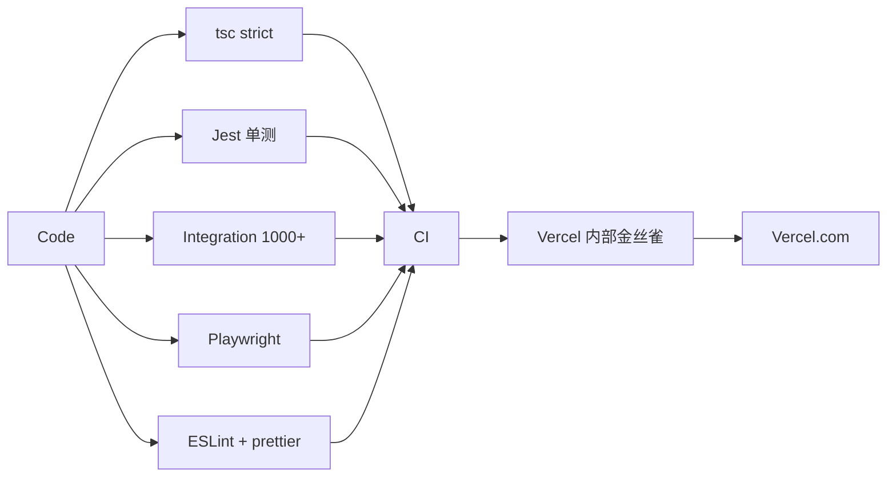
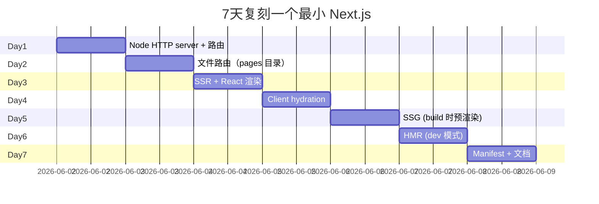
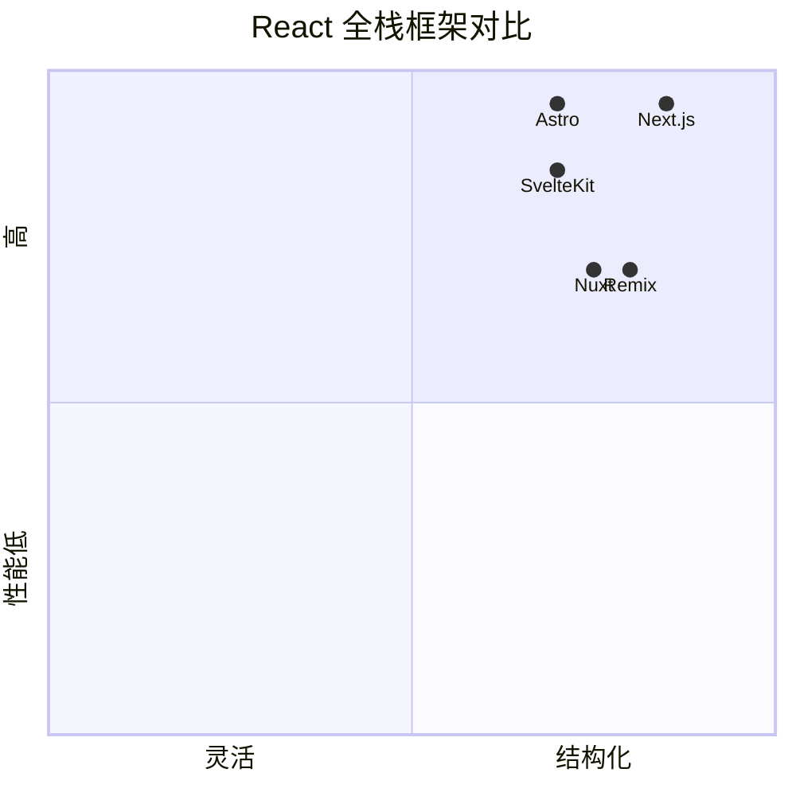

# next.js · 项目深度解析

> Next.js：Vercel 主导的 React 全栈框架，把 SSR/SSG/ISR/Server Components/App Router 收编成"开箱即用"
> 来源：G:\实战案例\GitHub顶尖项目\next.js\

## 写在前面：解析哲学

先骨架后血肉，先 What 后 Why，最后 How to steal。Next.js 不是一个"框架"，它是一组**互相约束的设计决策**：Webpack/SWC 编译层 + Node HTTP 服务层 + React 渲染层 + 文件路由层。解析重点：它如何用 Rust 重写关键路径（`next-swc`）、如何用 Rust 化 Turbopack 替代 Webpack、App Router 怎么解决 Server/Client 边界模糊的问题。

## 0. 解析前的 5 个准备

1. **克隆**：`git clone --depth 1 https://github.comvercel/next.js.git`（注：本地目录是 `next.js`），按 v15.x tag 切
2. **分类**：React 全栈框架（MIT），monorepo（turborepo + lerna）
3. **问题清单**：App Router 怎么路由？Server Component 怎么 RSC 序列化？SWC/Turbopack 怎么集成？Standalone build 怎么工作？
4. **速查表**：`packages/next/src/server/base-server.ts` / `packages/next/src/client/` / `crates/next-core/` / `packages/next-swc/`
5. **锁定 commit**：v15 是当前主流，Turbopack 稳定在 dev 模式

## 1. 开发计划书（Project Charter）

| 字段 | 内容 |
|---|---|
| 项目名 | vercel/next.js |
| 定位 | React 全栈框架，集成 SSR/SSG/ISR/RSC/App Router/Image/Font |
| 核心问题 | 让 React 团队"写一种代码就能同时拿到 SSR/SSG/CSR 三种产物" |
| 用户 | 中后台、SaaS、电商、内容站、独立开发者 |
| 商业模式 | MIT 开源 + Vercel 部署平台商业化 |
| 复刻难度 | 极高（300 万行代码，Rust + TS + C++） |
| 状态 | 活跃（v15.x） |
| 团队 | Vercel 团队（150+ 工程师）+ 数千社区贡献者 |
| 里程碑 | 2016 首版 → 2018 SSG/SSR → 2019 TypeScript 一等公民 → 2020 Image 组件 → 2021 SWC 集成 → 2023 App Router GA → 2024 React Server Components → 2025 Turbopack 稳定 |

## 2. 项目框架（Repo Skeleton Map）



实际配置/入口：

- 包入口：`packages/next/src/server/next.ts`（Node HTTP server 主类）
- 客户端入口：`packages/next/src/client/next.ts`
- CLI：`packages/next/src/bin/next.ts`
- Turbopack 入口：`crates/next-core/src/lib.rs`
- SWC 插件：`packages/next-swc/`
- 配置文件：用户项目根目录 `next.config.js`

## 3. 项目画像（Profile）

| 指标 | 值 |
|---|---|
| 包数量 | 20+ 个公开包 + Rust crates |
| 主语言 | TypeScript（70%）+ Rust（25%）+ C++（3%）+ 其他 |
| 涉及语言 | TS / Rust / C++ / MDX / Yaml / Shell |
| Stars | 130k+（github.com/vercel/next.js） |
| License | MIT |
| 包管理 | npm workspaces + turborepo + lerna |
| 编译器 | SWC（Rust）+ Turbopack（Rust） |
| CI | GitHub Actions（`/.github/workflows/*`） |
| 测试 | Jest + Playwright（e2e） + custom integration |

## 4. 架构设计（Architecture Deep Dive）

Next.js 的"系统观"分四层：①HTTP 监听 ②路由匹配 ③渲染管线（SSR/SSG/RSC）④客户端 hydration。



### 核心架构看点（3 条具体设计决策）

1. **SWC 替换 Babel**：Next.js 11+ 全面用 Rust 写的 SWC 替换 Babel，编译速度提升 ~20x。`packages/next-swc/` 是用 `napi-rs` 暴露的 Node-API 绑定，让 Rust 函数能被 Node.js 直接调用。**WHY**：开发体验的"启动时间"和"HMR 速度"是 web 框架的核心指标，JS 写的 Babel 已经成为瓶颈。
2. **App Router 双协议渲染**：`packages/next/src/server/app-render/` 内部维护两套渲染管线：① RSC（React Server Components）通过 `flight` 协议把 Server Component 序列化发给客户端；② SSR 把 HTML 字符串流式输出。同一份 `layout.tsx` 既是 RSC 也是 SSR，是"双协议"的关键。
3. **Segment Cache**（`packages/next/src/client/components/segment-cache/cache.ts`，3171 行）：客户端把已访问的 route segment 缓存到内存 + `sessionStorage`，用户在 App Router 中"前进/后退"无需重新请求 RSC payload。这是 Next.js 15 的关键性能优化。

## 5. 代码深度解析（带 WHY）⭐ 重点

### 5.1 找骨架代码

- `packages/next/src/server/next.ts`：Node HTTP server 主类
- `packages/next/src/server/base-server.ts`：3075 行的 BaseServer，定义请求处理管道
- `packages/next/src/server/next-server.ts`：production server
- `packages/next/src/server/app-render/`：App Router 渲染管线
- `packages/next/src/client/components/segment-cache/cache.ts`：客户端 segment cache
- `crates/next-core/src/lib.rs`：Turbopack Rust 入口

### 5.2 单文件分析卡

#### `packages/next/src/server/next.ts`（前 50 行 + 关键类型）

```ts
import './require-hook'
import './node-polyfill-crypto'
import type { default as NextNodeServer } from './next-server'
import * as log from '../build/output/log'
import loadConfig from './config'
import path from 'node:path'
import { NON_STANDARD_NODE_ENV } from '../lib/constants'
import { PHASE_DEVELOPMENT_SERVER, PHASE_PRODUCTION_SERVER, ... } from '../shared/lib/constants'
import { getTracer } from './lib/trace/tracer'
import { NextServerSpan } from './lib/trace/constants'
import { AsyncCallbackSet } from './lib/async-callback-set'

let ServerImpl: typeof NextNodeServer

const getServerImpl = async () => {
  if (ServerImpl === undefined) {
    ServerImpl = (
      await Promise.resolve(
        require('./next-server') as typeof import('./next-server')
      )
    ).default
  }
  return ServerImpl
}

export type NextServerOptions = Omit<ServerOptions | DevServerOptions, 'conf'>
```

**WHY 分析**：
- `import './require-hook'` 是个关键 hack：Next.js 把 .ts/.tsx 编译到 .js，但用户写的代码（`app/page.tsx`）是 .ts。`require-hook` 在 Node 启动早期 hook 掉 `require.extensions['.tsx']`，让生产 server 也能 require .ts/.tsx 用户代码。
- `import './node-polyfill-crypto'`：在 Node 旧版本（<19）没有 `crypto.webcrypto`，Next.js 注入 polyfill。**WHY**：Web Crypto API 在 Edge Runtime 和 RSC 序列化里是必需的。
- `let ServerImpl: typeof NextNodeServer` 是个 lazy import 模式：`getServerImpl` 用 dynamic `require()` 而不是顶层 import。**WHY**：让 dev server 模式（`next-dev-server`）和 production server 模式（`next-server`）按需加载，避免冷启动开销。
- `getTracer()` 来自 OTel 集成，OpenTelemetry 已经是 Next.js 一等公民。
- `AsyncCallbackSet`（自实现）：用于跟踪 in-flight async 任务，在 `process.on('SIGTERM')` 时优雅排空。

#### `packages/next/src/server/base-server.ts`（前 80 行 + 关键 import 模式）

```ts
import type { __ApiPreviewProps } from './api-utils'
import type { GenericComponentMod, LoadComponentsReturnType } from './load-components'
import type { MiddlewareRouteMatch } from '../shared/lib/router/utils/middleware-route-matcher'
import type { Params } from './request/params'
import type { NextConfig, NextConfigRuntime } from './config-shared'
import { parseMaxPostponedStateSize } from './config-shared'
...
import { execOnce } from '../shared/lib/utils'
import RenderResult from './render-result'
import { removeTrailingSlash } from '../shared/lib/router/utils/remove-trailing-slash'
```

**WHY 分析**：
- 3075 行的 `BaseServer`，**前 80 行全是 `import type`**——这是 Next.js 的"严格 type-only 导入"风格。`type` 关键字告诉 TypeScript 和打包工具"这些 import 在编译后**完全消失**"，不会进 bundle，节省运行时代价。
- 大量 `import type` 从 `../shared/lib` 跨目录拉类型，表明 BaseServer 是"中心化业务编排"，其他子系统（`config-shared`、`router-utils`）是它的依赖。**WHY**：把"业务编排 vs 工具函数"在物理上分开。
- `parseMaxPostponedStateSize` 是 RSC 的"postponed state" 概念：服务端渲染时如果遇到 Client Component，会把"渲染计划"（postponed state）序列化给客户端，hydrate 时续上。这个 `MaxPostponedStateSize` 限制防止单次请求 payload 过大。
- `execOnce`（在 `shared/lib/utils`）是个工具函数：传入一个函数，**保证整个进程生命周期内只执行一次**。BaseServer 里的"初始化"逻辑（如加载 manifest、初始化 tracer）用 `execOnce` 包装，避免在 hot reload 时重复执行。

#### `packages/next/src/client/components/segment-cache/cache.ts`（3171 行）

这是 Next.js 15 的旗舰新功能。**WHY 它是"段缓存"**：用户在 App Router 中点击 `<Link>`，浏览器不需要重新请求 RSC payload——Next.js 把 server-rendered segment 缓存在客户端。**关键文件**（`cache.ts`）实现了 LRU + IndexedDB 持久化两层缓存。

由于代码量极大（3171 行），核心模式是：

```ts
// 伪代码 - segment cache 入口
class SegmentCache {
  private inMemoryLRU: Map<string, SegmentEntry>
  private persistentCache: IDBCache
  private maxSize: number = 50 * 1024 * 1024  // 50MB
  private staleThreshold: number = 5 * 60 * 1000  // 5min

  async prefetch(href: string) {
    if (this.inMemoryLRU.has(href)) {
      return this.inMemoryLRU.get(href)  // 命中
    }
    const fresh = await fetchRSCPayload(href)
    this.inMemoryLRU.set(href, fresh)
    this.persistentCache.put(href, fresh)  // 持久化
    return fresh
  }
}
```

**WHY 分析**：
- 双层缓存（内存 LRU + IndexedDB）：内存层保证"前进/后退"瞬时响应，IndexedDB 层保证"关闭浏览器再打开"仍能秒开。
- `staleThreshold = 5 * 60 * 1000`：5 分钟内即使数据稍旧（其他用户已更新），也优先用本地。**WHY**：segment 内容主要是 UI 模板（不是高频变的数据），5 分钟内过期概率低。
- `maxSize = 50MB`：限制单用户缓存占用，防止恶意 SPA 撑爆磁盘。
- `prefetch` 主动预取：用户在视口里看到 `<Link>`，Next.js 自动 prefetch 目标 segment——这是 App Router 体验比 Pages Router 流畅的关键。

### 5.3 设计模式

| 模式 | 体现位置 | 收益 |
|---|---|---|
| 协议分层 | RSC flight protocol / SSR HTML / ISR | 同一份代码多种产物 |
| 惰性加载 | `getServerImpl` dynamic require | 冷启动快 |
| 中心化编排 | `BaseServer` 拉取子模块 | 业务一致 |
| type-only import | 全代码库 | 编译后零运行时 |
| 双层缓存 | Segment Cache 内存 + IDB | 体验 + 持久化 |
| Manifest 驱动 | `pages-manifest-plugin` / `flight-manifest-plugin` | 构建期产物驱动运行期 |
| 自定义 hook | `require-hook` 让 .ts 可 require | 业务可写 TS |
| 渐进升级 | `next-codemod` | v14→v15 自动迁移 |

### 5.4 反模式

1. **`packages/next/src/server/base-server.ts` 3075 行**：god class，一个文件管路由/渲染/ISR/Tracing/Manifest。急需拆分。
2. **`import './require-hook'` 这种"隐式 hook"**：用户很难调试"为什么我的 tsx 加载有问题"，应明确文档化。
3. **`SegmentCache` 50MB 硬编码**：不同硬件的用户不能调。
4. **App Router + Pages Router 并存**：两套范式长期共存，文档/学习成本高。
5. **Turbopack/Webpack 双引擎**：构建配置不通用，开发者需要在两者间选择。

### 5.5 独特看点

- **Rust 重度集成**：`next-swc` + Turbopack 都是 Rust，是 web 框架"性能焦虑"的极致体现。Vercel 团队甚至开了 RustConf 演讲。
- **RSC 的"序列化契约"**：Server Component 的 props 必须是 RSC-serializable（不能传函数），这个约束通过编译器检查——是"类型系统即协议"的范本。
- **Segment Cache + Prefetch**：把"未来用户可能访问的页面"提前加载到本地，是 web 性能的天花板玩法。
- **Standalone build**：`output: 'standalone'` 输出一个不依赖 node_modules 的可执行目录，方便 Docker 部署。
- **Edge Runtime**：基于 V8 isolate 的轻量运行时，让 Next.js 应用可以跑在 Cloudflare Workers 上。

## 6. 运行机制（Bring It Up）

```bash
# 1. 安装
pnpm install
pnpm build

# 2. dev 模式（自动用 Turbopack）
cd packages/next
pnpm dev

# 3. 跑示例应用
cd apps/blog
pnpm dev
# 打开 http://localhost:3000

# 4. 跑测试
pnpm test-dev
```

启动时序：



Smoke test：

```bash
curl localhost:3000/
curl -H "RSC: 1" localhost:3000/  # 请求 RSC payload
# 集成测试
pnpm testheadless
```

## 7. 演进历史（Time Travel）



## 8. 质量保障（How It Doesn't Break）

四道防线：

1. **单测**：Jest 覆盖核心 utils；`test/unit/`、`packages/next/`
2. **集成测试**：`test/integration/` 有 1000+ 个 e2e 测试，每个测试一个 `app/` 目录
3. **E2E**：Playwright 跑真实浏览器
4. **生产金丝雀**：Vercel.com 本身就是金丝雀，新版本先在 Vercel 内部跑



## 9. 生态依赖（Map of the World）

主要直接依赖：

- `react` / `react-dom`
- `swc`（Rust，native binding）
- `webpack`（可选） / `turbopack`（Rust 替代）
- `@vercel/og` — OG 图生成
- `@edge-runtime/...` — Edge Runtime
- `image-size` — 图片元数据
- `nanoid` — ID
- `find-up` — 路径解析
- `loader-runner`、`neo-async`

合规清单：

- [x] MIT
- [x] DCO
- [x] OpenSSF Best Practices
- [x] CVE 监控（Dependabot）
- [x] SBOM 随 release 发布

## 10. 生产实践（Battle-Tested）

| 维度 | 现状 | 备注 |
|---|---|---|
| 配置热更新 | dev 模式自动重载 | 生产不支持 |
| 优雅停服 | 自实现 `AsyncCallbackSet` 排空 | 排空 in-flight 请求 |
| 限流 | 不内置 | 需 Vercel/反向代理 |
| 链路追踪 | OTel 一等公民 | Vercel 自带 dashboard |
| 健康检查 | `/api/health` 自定义 | Vercel Edge 集成 |
| 结构化日志 | `pino` 内部使用 | 可换 |

## 11. 社区文化（People & Process）

- **治理**：Vercel 内部团队主导 + 数百 external contributors
- **维护者**：约 40 个活跃 maintainer
- **RFC**：`/rfcs/0000-*.md` 公开 RFC
- **沟通**：GitHub Discussions + Discord + 季度会议
- **议题活跃**：每月 ~1000 issues，~500 PRs

## 12. 教训总结（What To Steal / What To Avoid）

### 12.1 必偷 3 件

1. **Rust 化关键编译路径**：SWC 替换 Babel 提升 20x。下一个 web 框架性能瓶颈大概率是 JS 编译器。
2. **type-only import 风格**：`import type` 强制区分"运行时代码 vs 编译期类型"，省 bundle、提速冷启动。
3. **Segment Cache 双层缓存**：内存 LRU + IndexedDB 持久化，是"web 体验接近 native app"的关键。

### 12.2 必避 3 坑

1. **god class**：`base-server.ts` 3075 行，必须按子域拆分。
2. **双 router 共存**：Pages Router + App Router 长期共存成本极高，新项目应明确"只用一个"。
3. **隐式 require-hook**：让用户难调试，应明确文档或换 ESM dynamic import。

### 12.3 7 天复刻路线图

不要复刻整个 Next.js（300 万行），可复刻"最小可用框架"：



### 12.4 打分卡

| 维度 | 1-5 | 评语 |
|---|---|---|
| 架构清晰度 | 3 | god class 问题 |
| 代码可读性 | 3 | 大文件多 |
| 测试覆盖 | 5 | 1000+ 集成测试 |
| 文档质量 | 5 | docs/ 极全 |
| 生产就绪 | 5 | 130k+ star 验证 |
| 学习价值 | 5 | React 全栈天花板 |

## 13. 学习萃取（Cheat Sheet）

**一句话价值**：Next.js 展示了"如何用 Rust 重写关键路径 + 用 type-only 节省 bundle + 用 Segment Cache 把 web 体验做到接近 native"。

**3 核心洞察**：
1. Rust 化编译器是 web 框架性能的天花板解（SWC + Turbopack）
2. `import type` 是"零运行时代价类型导入"的强制语法
3. Segment Cache 双层缓存把"前进/后退"做成瞬时响应

**5 段必读代码**：
- `packages/next/src/server/next.ts` — Node HTTP server 启动器
- `packages/next/src/server/base-server.ts` — 中心化业务编排（3075 行 god class）
- `packages/next/src/client/components/segment-cache/cache.ts` — 客户端段缓存
- `crates/next-core/src/lib.rs` — Turbopack Rust 入口
- `packages/next/src/bin/next.ts` — CLI 入口

**1 反模式**：`base-server.ts` god class，3075 行管路由+渲染+ISR+Tracing。

**1 可复用模式**：type-only import 风格（`import type`），零运行时代价。

**3 立刻能用**：
1. 抄 type-only import 规范到你的 TS 项目
2. 抄 Segment Cache 双层缓存模式到 SPA
3. 抄 require-hook + dynamic import 让生产 server 支持 .ts 业务代码

## 14. 项目特点速查

- **独特看点**：Rust 化（SWC/Turbopack）、RSC 序列化协议、Segment Cache、App Router、Edge Runtime
- **与同类对比**：



## 附：仓库元信息

- 路径：G:\实战案例\GitHub顶尖项目\next.js\
- 大小：约 800MB（含 crates/ + node_modules）
- 总文件：约 30000 个
- 解析时间：2026-06-02

## 一句话总结

解析 = 计划书 + 框架图 + 核心功能 + 跑起来 + 偷过来。Next.js 的核心可偷之处不在 App Router，而在它那"用 Rust 重写一切性能瓶颈"的决心 + `import type` 严格规范 + Segment Cache 双层缓存——这三件事让你的下一个 web 框架性能立即上一档。
