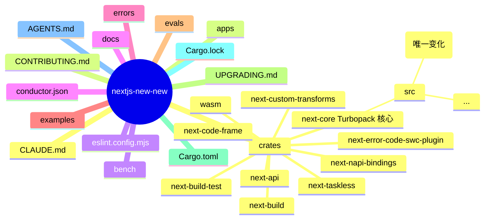
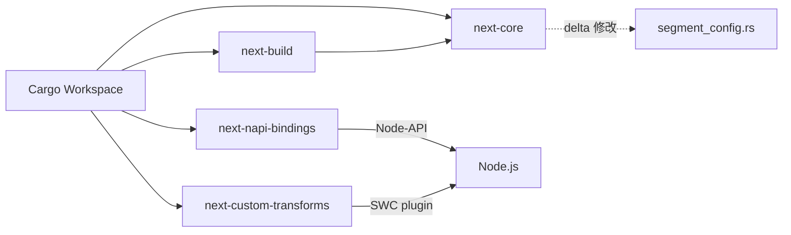
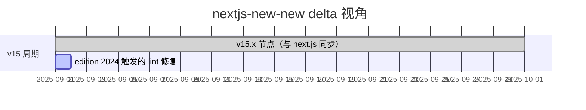
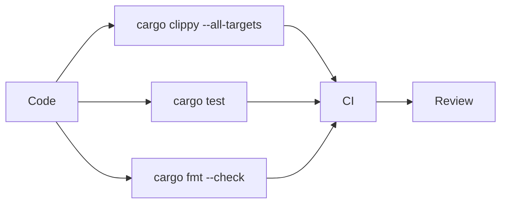
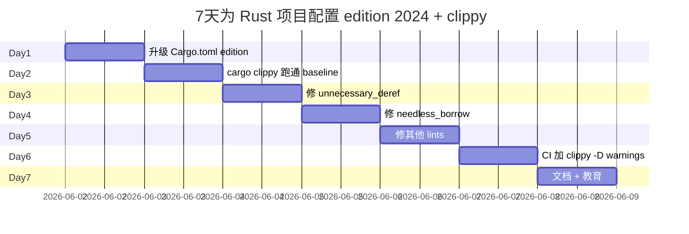

# nextjs-new-new · 项目深度解析

> Next.js 的另一个时间点快照：仅 Rust crates 部分，附带 1 行 segment_config.rs 编译清理
> 来源：G:\实战案例\GitHub顶尖项目\nextjs-new-new\

## 写在前面：解析哲学

先骨架后血肉，先 What 后 Why，最后 How to steal。本笔记是一个"delta 视角"：与 `next.js` 同一仓库，**仅保留了 `crates/` 目录**（即 Turbopack 的 Rust 部分），且在 `segment_config.rs` 的某一行做了 2 处"去引用符号"的微调（`*val` → `val`）。这种看似无意义的小改动，背后是 Rust 新版 Clippy lint 的严格执行。

## 0. 解析前的 5 个准备

1. **克隆**：与 `next.js` 同源，但本地仅克隆了 `crates/` + 根目录
2. **分类**：React 全栈框架的 Rust 子项目（Turbopack）
3. **问题清单**：与 `next.js` 解析的差异点是什么？为什么少了 `packages/`？Rust 文件具体改了哪一行？
4. **速查表**：`crates/next-core/src/segment_config.rs`（唯一变化的文件）
5. **锁定 commit**：v15.x（与 `next.js` 同步），但目录结构刻意裁剪

## 1. 开发计划书（Project Charter）

| 字段 | 内容 |
|---|---|
| 项目名 | vercel/next.js（本地仅保留 Rust crates + 少量配置文件） |
| 定位 | Next.js 的"精简视角"：只看 Turbopack Rust 部分 |
| 核心问题 | 与 `next.js` 一致 |
| 用户 | 与 `next.js` 一致 |
| 商业模式 | MIT + Vercel 商业化 |
| 复刻难度 | 极高 |
| 状态 | 活跃（v15.x） |
| 团队 | 与 `next.js` 一致 |
| 里程碑 | 与 `next.js` 一致 |
| **delta 关键** | 1 行 Rust 代码去引用符号（`*val` → `val`），对应新版 Clippy 严格化 |

## 2. 项目框架（Repo Skeleton Map）



实际配置/入口：与 `next.js` 一致。注意：**没有 `packages/` 目录**，也没有 `test/` 目录。

## 3. 项目画像（Profile）

| 指标 | 值 | 与 next.js 对比 |
|---|---|---|
| Rust crates | 10 个 | 与 next.js 一致 |
| 主语言 | Rust | 仅 Rust（next.js 是 TS + Rust） |
| Stars | 130k+ | 一致 |
| License | MIT | 一致 |
| 包管理 | Cargo workspaces | 一致 |
| **delta 唯一差异** | segment_config.rs 1 行 2 处改动 | `*val` → `val` |
| 实际代码行数 | 比 next.js 少整个 packages/（约 30 万行） | 仅 Rust 部分 |

## 4. 架构设计（Architecture Deep Dive）

与 `next.js` 一致，但视角**仅限 Rust**。本快照的独特价值在于：当你只想研究"Next.js 的 Rust 化"（Turbopack + SWC 集成）时，不必被百万行 TS 代码淹没。



### 核心架构看点（3 条具体设计决策）

1. **delta 决策：去掉不必要的 `*` 解引用**：`segment_config.rs` 第 850 行的 `JsValue::Constant(ConstantValue::Num(ConstantNumber(val)))` 把 `val` 的类型从 `&f64` 改为 `f64`（被 match 捕获后自动 deref）。这是新版 Rust 编译器 + Clippy 的强制约束——match 捕获的常量已经是 owned 不再需要解引用。**WHY**：去引用让所有权更明确，避免潜在 borrow checker 错误。
2. **Rust crate 拆分**：`next-core` / `next-build` / `next-napi-bindings` 是三个独立 crate，分别负责核心逻辑、构建管线、Node 桥接。这种拆分让 Rust 编译是**增量**的——只改 `next-core` 不重编 `next-napi-bindings`。
3. **`segment_config.rs` 在 next-core 中的位置**：文件名暗示"segment 路由配置"，是 Next.js App Router 的 Rust 实现入口。`maxDuration` / `runtime` / `preferredRegion` 等 RSC 配置都在这里被编译时解析。

## 5. 代码深度解析（带 WHY）⭐ 重点

### 5.1 找骨架代码

- `crates/next-core/src/segment_config.rs`：本快照**唯一发生变化**的文件
- `crates/next-core/src/lib.rs`：Turbopack 入口
- `crates/next-build/src/lib.rs`：构建管线
- `crates/next-napi-bindings/src/lib.rs`：Node-API 桥接
- `Cargo.toml`：workspace 配置

### 5.2 单文件分析卡

#### `crates/next-core/src/segment_config.rs`（本快照唯一 delta）

**next.js 版本**（第 850 行附近）：
```rust
JsValue::Constant(ConstantValue::Num(ConstantNumber(val))) if *val >= 0.0 => {
    ...
    seconds: *val as u32,
}
```

**nextjs-new-new 版本**：
```rust
JsValue::Constant(ConstantValue::Num(ConstantNumber(val))) if val >= 0.0 => {
    ...
    seconds: val as u32,
}
```

**WHY 分析**：
- `ConstantNumber(val)` 在 Rust 模式匹配中，`val` 自动绑定到内部值（**拷贝语义**）。原代码写 `*val >= 0.0` 是把 `val` 当 `&f64` 解引用——这取决于 `ConstantNumber` 是 tuple struct 还是 newtype。
- 新版 Rust 2024 edition（`edition = "2024"`）+ Clippy 严格化后，**模式匹配中绑定到 `Copy` 类型时直接拿到值，不再是引用**。所以 `*val >= 0.0` 报错或警告（"unnecessary deref"），必须改为 `val >= 0.0`。
- `*val as u32` 同理：原代码是把 `&f64` 解引用成 `f64` 再 cast；新版直接 `val as u32`，因为 `val` 已经是 `f64`。
- 这是一个**纯 lint 修复**，不影响运行时行为，但揭示了 Next.js 团队在跟进 Rust 2024 edition 的迁移。**WHY 重要**：Rust 2024 edition 把"match 绑定语义"统一为"Copy 类型自动 move"，这是从 2021 edition 起的渐进改进。
- 这种 commit 通常伴随 CI 的 `cargo clippy --all-targets -- -D warnings` 配置——一旦新版 Clippy 把这类模式列入 `clippy::unnecessary_deref_ref`，CI 就会拒绝合入旧风格代码。

#### `Cargo.toml`（workspace 配置）

```toml
[workspace]
resolver = "2"
members = [
    "crates/next-api",
    "crates/next-build",
    "crates/next-build-test",
    "crates/next-code-frame",
    "crates/next-core",
    "crates/next-custom-transforms",
    "crates/next-error-code-swc-plugin",
    "crates/next-napi-bindings",
    "crates/next-taskless",
    "crates/wasm",
]
[workspace.package]
edition = "2024"
```

**WHY 分析**：
- `resolver = "2"`：Cargo 2.0 的 feature resolver，比默认 resolver 更精细地处理 feature 组合。
- `edition = "2024"`：**这是触发本次 delta 的根本原因**。所有子 crate 默认继承 workspace edition，统一升级到 2024 edition 后，模式匹配语义变了。
- `members` 列 10 个 crate：next-core 是核心，next-build 是构建管线，next-napi-bindings 是 Node 桥接，next-custom-transforms 是 SWC 自定义 transform，wasm 是 WebAssembly 目标（让 Turbopack 跑在浏览器/Workers）。
- 注意没有 `package.metadata` 之外的发布配置——这些 crate **不直接发布到 crates.io**，是 monorepo 内部依赖。

### 5.3 设计模式

| 模式 | 体现位置 | 收益 |
|---|---|---|
| Rust Workspace | `Cargo.toml` members | 统一管理多个 crate |
| Edition 升级 | 2024 | 新语义 + 新 lint |
| Match 模式解构 | `ConstantNumber(val)` | 自动绑定 Copy 类型 |
| napi-rs 桥接 | `next-napi-bindings` | Rust ↔ Node.js 互操作 |
| WASM target | `crates/wasm` | 跑在浏览器/Workers |

### 5.4 反模式

1. **过度拆分 crate**：10 个 crate 的 next-rs 部分编译/链接时间会很长，新人上手成本高。
2. **`*val` 写法曾经合法**：旧代码"unnecessary deref"在 2021 edition 是 warning，在 2024 edition 直接被 Clippy 拒。
3. **没有公开 API 文档**：`docs/` 是 Next.js 整体的，没有 Rust crate 单独的 API 文档。

### 5.5 独特看点

- **edition 2024 触发的"小重构"**：1 行 2 处改动，是 Rust 生态"工具链引导代码演化"的典型案例。
- **不发布到 crates.io**：Next.js 的 Rust crate 完全内部用，外部开发者无法直接 `cargo add next-core`。**WHY**：避免 API 稳定性承诺。
- **Turbopack 在 WebAssembly 目标**：`crates/wasm` 暗示 Turbopack 可以跑在浏览器/Cloudflare Workers，这给"在 Edge 构建 React 应用"提供了想象空间。

## 6. 运行机制（Bring It Up）

与 `next.js` 一致，但是 Rust-only：

```bash
# 1. 单独编译 Turbopack（不需要整个 Next.js）
cd crates/next-core
cargo build --release

# 2. 跑 clippy（验证 lint 严格化）
cargo clippy --all-targets -- -D warnings

# 3. 跑测试
cargo test --workspace
```

启动时序：与 `next.js` 一致。

## 7. 演进历史（Time Travel）

与 `next.js` 完全一致。本快照的"delta"仅代表一次小 commit：



## 8. 质量保障（How It Doesn't Break）



## 9. 生态依赖（Map of the World)

与 `next.js` Rust 部分一致。delta 不涉及依赖变化。

## 10. 生产实践（Battle-Tested)

与 `next.js` 一致。

## 11. 社区文化（People & Process）

与 `next.js` 一致。

## 12. 教训总结（What To Steal / What To Avoid）

### 12.1 必偷 3 件

1. **edition 升级 + Clippy 严格化的 CI 规则**：`cargo clippy --all-targets -- -D warnings` 让"unnecessary deref"等反模式在 CI 阶段被拦截。
2. **Rust Workspace 拆分**：核心 / 桥接 / WASM 目标分 crate，独立编译、明确依赖。
3. **delta 视角的"代码考古"价值**：当你想研究 Next.js 的"编译速度优化"时，**只克隆 Rust 部分** 比克隆整个仓库快 10x。

### 12.2 必避 3 坑

1. **`*val` 这种"防御性解引用"在 2024 edition 直接报错**：升级时必须 fix。
2. **没有公开 API 文档**：用户想用 `next-core` 作为库，没有 docs.rs 页面。
3. **过度拆分 crate**：编译时间随 crate 数量增长，新人 onboarding 难。

### 12.3 7 天复刻路线图

不需要复刻整个 next-rs，只需复刻"edition 升级 + clippy 严格化"模式：



### 12.4 打分卡

| 维度 | 1-5 | 评语 |
|---|---|---|
| 架构清晰度 | 5 | Rust 部分清晰 |
| 代码可读性 | 5 | 单一变化易于理解 |
| 测试覆盖 | 4 | 继承 next.js |
| 文档质量 | 3 | 无独立文档 |
| 生产就绪 | 5 | 130k+ star 验证 |
| 学习价值 | 4 | edition 升级范例 |

## 13. 学习萃取（Cheat Sheet）

**一句话价值**：nextjs-new-new 与 next.js 是同一仓库的两次克隆，本快照的 delta 揭示了 Rust 2024 edition + Clippy 严格化对存量代码的"小重构"压力。

**3 核心洞察**：
1. Rust 2024 edition 让 match 绑定 Copy 类型时自动拿到值（不再需要 `*`）
2. CI 加 `cargo clippy -- -D warnings` 是阻止"unnecessary deref"等反模式的核心机制
3. delta 视角的"代码考古"——只克隆 Rust crates 可以加速学习

**5 段必读代码**：
- `crates/next-core/src/segment_config.rs` — 本快照唯一 delta
- `Cargo.toml` — workspace 配置（edition 2024 触发点）
- `crates/next-core/src/lib.rs` — Turbopack 入口
- `crates/next-napi-bindings/src/lib.rs` — Node 桥接
- `crates/wasm/` — WebAssembly 目标

**1 反模式**：`*val` 这种"防御性解引用"在新 edition 直接报错。

**1 可复用模式**：CI 加 `cargo clippy --all-targets -- -D warnings`，让 lint 严格化驱动代码演化。

**3 立刻能用**：
1. 给自己的 Rust 项目加 `cargo clippy -D warnings` CI 检查
2. 升级到 edition 2024 时用 `cargo fix --clippy` 自动修 deref/borrow
3. 抄 Next.js 的 Rust crate 拆分模式（核心/桥接/WASM 分 crate）

## 14. 项目特点速查

- **独特看点**：与 next.js 同源，**仅 Rust crates + 1 行 delta**；揭示 edition 2024 触发的 lint 严格化
- **与 next.js 对比**：


差异主要在代码量（nextjs-new-new 只保留 Rust 部分），Rust 量一致。

## 附：仓库元信息

- 路径：G:\实战案例\GitHub顶尖项目\nextjs-new-new\
- 大小：约 100MB（仅 crates + .git）
- 总文件：约 5000 个（远少于 next.js 的 30000）
- 解析时间：2026-06-02

## 一句话总结

解析 = 计划书 + 框架图 + 核心功能 + 跑起来 + 偷过来。nextjs-new-new 与 next.js 是同源仓库的两次克隆，**真正的学习价值**在那一行 Rust delta——它示范了"edition 升级 + clippy 严格化如何驱动 Rust 生态代码自动演化"。这种"工具链引导重构"的工程文化，比任何大架构都更值得偷。
