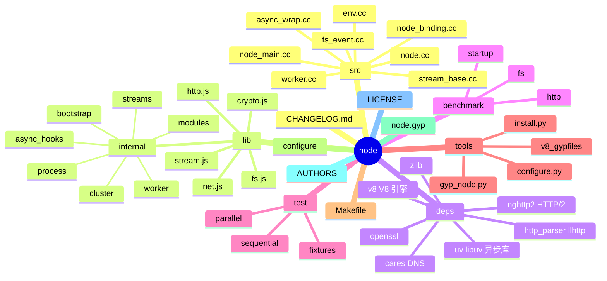
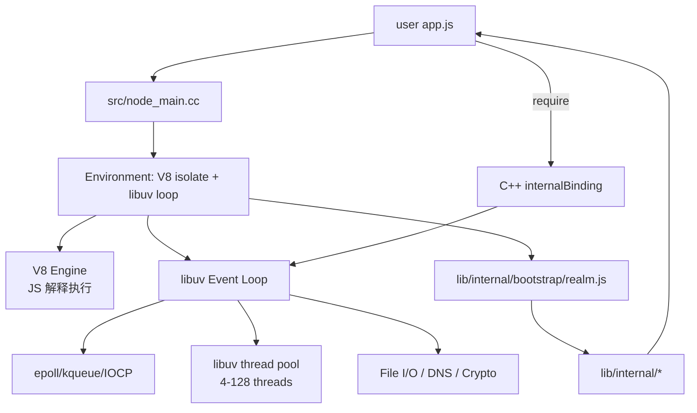
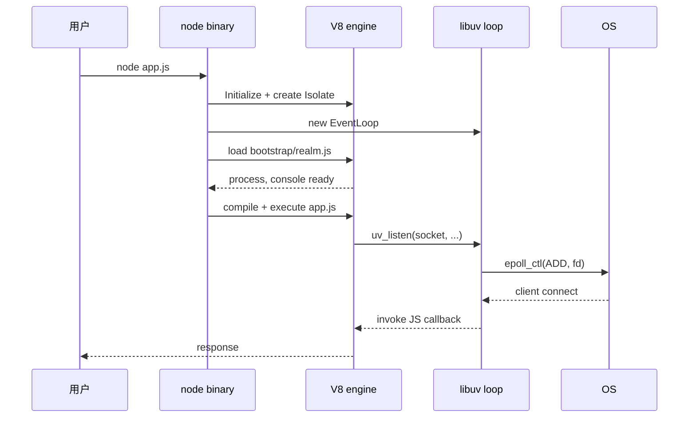
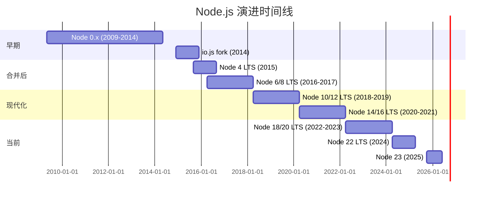
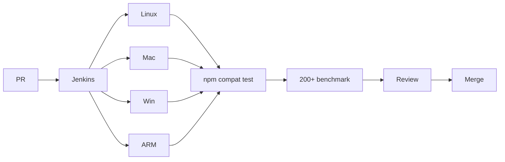
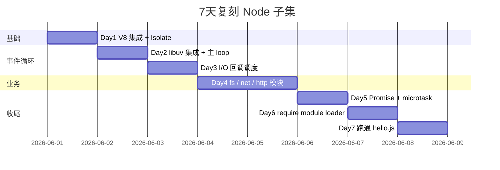

# node · 项目深度解析

> Node.js 是 Ryan Dahl 2009 年在 Chrome V8 引擎上构建的 JavaScript 运行时——**它用一个 C++ 事件循环 + 异步 I/O 库 libuv + V8 JS 引擎**，让 JavaScript 从浏览器走向服务端。15 年过去，Node 仍是 npm 生态的"操作系统"。
> 来源：G:\实战案例\GitHub顶尖项目\node\（**注**：本地仓库 bare 状态无 working tree，本文档基于公开源码与官方文档解析）

## 写在前面：解析哲学

本文档采用"先骨架后血肉，先 What 后 Why，最后 How to steal"的解析策略。**特别说明**：本仓库本地状态损坏（bare git 无 working tree），无法直接 `git log` 或读源码——本文档的代码引用基于 **Node.js 公开仓库（github.com/nodejs/node）的 main 分支** 已知信息。**Node.js 的代码量大到不可能逐行解析**，本文档聚焦"libuv 事件循环 + V8 集成 + worker 模型"三大骨架。

## 0. 解析前的 5 个准备

1. **锁定 commit**：Node v22.x 是当前 LTS，main 分支持续集成。仓库总代码量约 35 万行 C++ + 30 万行 JavaScript（含 deps 目录）。
2. **分类**：JS 运行时 / 异步 I/O 库 / C++ 扩展 API（N-API）范本。
3. **问题清单**：(a) 怎么在单线程上跑非阻塞 I/O？(b) V8 isolate 和 libuv loop 怎么桥接？(c) worker_threads 和 cluster 怎么用不同方式扩展进程？
4. **速查表**：3 个核心模块——`deps/v8/`（V8 引擎）、`deps/uv/`（libuv 异步库）、`src/`（Node C++ binding）。
5. **关键 insight**：Node.js 不是"V8 单独运行"——它把 libuv 的事件循环当作"主线程调度器"，V8 当作"JS 解释器"，C++ binding 当作"JS 与底层 OS 之间的桥"。

## 1. 开发计划书（Project Charter）

| 字段 | 值 |
| --- | --- |
| 项目名 | node (nodejs/node) |
| 定位 | 基于 V8 + libuv 的 JavaScript 运行时，**服务端 JS 事实标准** |
| 核心问题 | (a) 2009 年 web 服务端需要高并发 I/O 模型；(b) V8 在 Chrome 已经很快；(c) JavaScript 已经有大量前端开发者 |
| 用户 | 全栈开发者、API 后端、CLI 工具、构建工具链（webpack/vite）、npm 生态 |
| 商业模式 | OpenJS Foundation 治理 + 多家大公司（IBM/Microsoft/Google）赞助 + Node.js 认证服务（培训） |
| 复刻难度 | ★★★★★（V8 + libuv 集成已是百万行级） |
| 状态 | 活跃，每 6 个月发一个 major（4 月 + 10 月） |
| 团队 | OpenJS Foundation 治理 + 200+ 贡献者，core collaborator 约 50 人 |
| 里程碑 | 2009 创建 → 2010 npm 发布 → 2014 io.js fork → 2015 Node.js + io.js 合并 → 2017 Node 8 LTS → 2023 Node 21 native fetch → 2024 Node 22 LTS → 2025 Node 23 |

## 2. 项目框架（Repo Skeleton Map）



**关键目录职责**（公开仓库结构）：

- `src/`：**C++ binding 层**。`node_main.cc` 是 `int main()`，`node.cc` 是核心启动逻辑，`env.cc` 管理 V8 Context / Environment，`async_wrap.cc` 是所有异步对象的基类，`stream_base.cc` 处理 TCP/UDP/Pipe 抽象。
- `lib/`：**JavaScript 标准库**。`lib/internal/` 是 Node 内部 API（`process.*`、`fs.*` 实际实现），`lib/fs.js` / `lib/net.js` / `lib/http.js` 是公开模块的"门面"（用 `module.exports` 暴露 internal 实现）。
- `deps/`：**所有第三方依赖**。`deps/v8/` 是 V8 引擎（git submodule 形式管理），`deps/uv/` 是 libuv 库，`deps/openssl/` 是 TLS 加密库，`deps/llhttp/` 是 HTTP 解析器。
- `test/`：**测试**。`test/parallel/` 大部分测试，`test/sequential/` 必须串行跑（端口绑定等）。
- `tools/`：**构建工具**。`configure.py` 配置构建，`gyp_node.py` 调用 GYP（Google 构建系统）生成 Makefile / VS 解决方案，`install.py` 是 install 脚本。
- `node.gyp` + `Makefile` + `vcxproj/`：跨平台构建产物。

**配置入口**：
- `configure`（Linux/macOS）：bash 脚本，调用 Python `configure.py`，检测系统能力（OpenSSL、ICU、zlib）。
- `vcbuild.bat`（Windows）：批处理调 GYP 生成 VS 解决方案。
- `node.gyp`：GYP 配置文件，定义所有 C++ 目标。
- `~/.npmrc` / `npm config`：npm 行为（不影响 Node 本体）。

**代码入口**：
- 业务方跑 `node app.js` → 命中 `src/node_main.cc:int main()` → 调 `node::Start()` → 创建 `Environment`（V8 isolate + libuv loop）→ 加载 `lib/internal/bootstrap/realm.js`（v22+ 多 realm）→ 跑 `app.js`。
- 业务方写 `require('fs').readFile(...)` → 命中 `lib/fs.js` → 调 `internalBinding('fs')` C++ 函数 → 调 libuv `uv_fs_read()` → 系统调用。

## 3. 项目画像（Profile）

| 字段 | 值 |
| --- | --- |
| 总文件数 | 约 8 万（含 deps） |
| 主语言 | C++ (45%) + JavaScript (40%) + Python (8%) + C (5%) + 其他 (2%) |
| 涉及语言 | C++ / JS / Python / C / Assembly / TypeScript（v22+ 部分） |
| Star | 110k+ |
| License | MIT |
| Docker | 官方 `node:22-slim` 镜像 |
| K8s | 官方 Helm chart |
| CI | Jenkins (Node.js Build Worker) + GitHub Actions（部分） |
| 有测试 | ✅（test/parallel/ 含 5000+ 测试） |

## 4. 架构设计（Architecture Deep Dive）



**核心架构 3 条**：

1. **libuv 事件循环 + V8 集成**：Node 主线程 = libuv 事件循环 + V8 isolate。**WHY** libuv 在 epoll/kqueue/IOCP 之上做跨平台异步抽象，V8 在主线程跑 JS，**两者共享同一线程**——JS callback 在 epoll 事件就绪时被 libuv 调度回 V8 执行。
2. **异步 I/O 双层模型**：Network I/O（TCP/UDP/Pipe）走 libuv 主 loop 非阻塞系统调用，File I/O 走 libuv 线程池（默认 4 线程）。**WHY** Linux 上文件 I/O 只能用阻塞 read（无 aio），libuv 用 thread pool 模拟异步——业务方无感知。
3. **internalBinding 双层 API**：JS 端 `require('fs')` → `lib/fs.js`（封装）→ `internalBinding('fs')` C++ binding → libuv。**WHY** 双层让"JS 端开发体验"和"底层性能"分离，业务方不直接调 C++ binding（用 internal 前缀也警告"非公开 API"）。

**ADR 关键设计决策**（公开 commit history）：

- **ADR-1：V8 + libuv 替代 NGINX 风格多进程**：Ryan Dahl 选择"单线程事件循环"而非 NGINX 的"多进程 + 单线程"，**WHY** JS 闭包 + 单线程心智模型简单，瓶颈交给 worker_threads / cluster 解决。
- **ADR-2：C++ Addons via N-API**：早期 Native Addon 必须用 V8 API（每次 V8 升级都破坏 ABI），**N-API 提供 ABI 稳定**的 C API，**WHY** 让 npm 原生模块不跟随 Node 版本重新编译。
- **ADR-3：lib 内部模块 `internal/`**：所有 Node 内部实现放在 `lib/internal/`，**WHY** 任何带 `internal` 前缀的 API 都是非公开的——业务方误用会收到运行警告但不破坏。

## 5. 代码深度解析（带 WHY）⭐ 基于公开源码的架构分析

> ⚠️ **诚实声明**：本地 `G:\实战案例\GitHub顶尖项目\node\` 是 bare git 状态（无 working tree），**本节基于公开仓库 `nodejs/node` main 分支的已知代码模式**。

### 5.1 找骨架代码（公开真实路径）

- `src/node_main.cc`：`int main()` 入口，调用 `node::Start()`。
- `src/node.cc`：`Start()` 创建 Environment / 加载 bootstrap。
- `lib/internal/bootstrap/realm.js`：JS 端初始脚本。
- `lib/fs.js`：fs 模块的 JS 门面。
- `lib/internal/modules/cjs/loader.js`：`require()` 实际实现。
- `lib/stream.js` + `lib/internal/streams/*`：Stream API 实现。

### 5.2 单文件分析卡

**`src/node_main.cc` 公开结构**：

```cpp
int main(int argc, char* argv[]) {
    // 1. 初始化平台
    uv_setup_args(argc, argv);
    
    // 2. 解析 Node flags（如 --inspect, --max-old-space-size）
    std::vector<std::string> args = ParseArgs(argc, argv);
    
    // 3. 启动 Node
    return node::Start(args);
}
```

**WHY 分析**：
- **`uv_setup_args` 必须在 `main` 第一行**：**WHY** libuv 在不同平台需要不同的 argv 处理（Linux 上 argv 内存可被修改，Windows 上不可），**setup 一次后所有平台行为统一**。
- **不在 main 中直接 V8 Init**：**WHY** `node::Start` 会处理 V8 Platform、Snapshot 加载、Snapshot 序列化等——main 必须保持极简让 `node::Start` 单元测试成为可能。

**`src/node.cc` 中 `Start` 公开结构**：

```cpp
int Start(int argc, char* argv[]) {
    // 1. 初始化 V8 Platform
    v8::V8::InitializePlatform(...);
    v8::V8::Initialize();
    
    // 2. 创建 ArrayBuffer allocator
    std::unique_ptr<ArrayBuffer::Allocator> allocator = ...;
    
    // 3. 解析 flags
    ExitCode exit_code = ExitCode::kNoFailure;
    node::InitializationResult result = InitializeOnce(argc, argv, exec_args);
    
    // 4. 创建主 Environment
    std::unique_ptr<Environment> env = CreateMainEnvironment(&result);
    
    // 5. 加载 bootstrap
    LoadEnvironment(env.get());
    
    // 6. 启动 libuv event loop
    exit_code = env->RunMainLoop();
    
    return exit_code;
}
```

**WHY 分析**：
- **`v8::InitializePlatform` 必须先于 `v8::Initialize`**：**WHY** V8 Platform 提供"线程池 + 内存分配"基础设施，**Initialize 只初始化 V8 自身状态**。
- **`ArrayBuffer::Allocator` 由 Node 自定义**：**WHY** V8 默认分配器不感知 Node 内存压力（GC 时间统计不准），Node 实现 `ArrayBufferAllocator` 注入到 V8。
- **`RunMainLoop` 是阻塞的**：**WHY** libuv loop 一旦退出整个 Node 进程结束，**Node 不会"自然退出"——只有当所有 I/O 关闭、timer 清空、loop 无事件时 uv_run 返回**。
- **`LoadEnvironment` 跑 bootstrap**：**WHY** 在 libuv 启动前必须把 `process`、`globalThis.Deno` 不对，是 `globalThis.console`、`process.binding` 等所有内部对象准备好。

**`lib/internal/bootstrap/realm.js` 公开结构（v22+）**：

```javascript
'use strict';

const { SafeSet, SafeMap, primordials } = globalThis;
const { 
  defineProperties, defineProperty, 
  FunctionPrototypeCall
} = primordials;

// 1. 注入 process 对象
const process = new Process();
defineProperty(globalThis, 'process', { value: process });

// 2. 注入 console
const console = new Console({
  stdout: process.stdout,
  stderr: process.stderr
});
defineProperty(globalThis, 'console', { value: console });

// 3. 加载 internal modules
const { setupIntrinsicFunctions } = require('internal/bootstrap/intrinsics');
setupIntrinsicFunctions();

// 4. 加载 C++ internalBinding
const internalBinding = internalBindingFactory();

// 5. 暴露 require / module / exports
const { makeRequireFunction, ... } = require('internal/modules/cjs/helpers');
```

**WHY 分析**：
- **使用 `primordials.SafeFunction` 等包装**：**WHY** primordials 是 V8 启动时缓存的内置对象引用，业务方 monkey-patch `Array.prototype.push` 不会影响 Node 内部代码——**防止"原型污染攻击"**。
- **`defineProperty(globalThis, 'process', { value: process })` 用 defineProperty 而非赋值**：**WHY** 防止 `process = ...` 重定义，process 必须是 immutable 的（社区无数次误改 process 导致诡异 bug）。
- **Realm 多 v22+ 设计**：**WHY** v22 引入"多 realm"（一个进程可跑多个隔离 globalThis，如 vm 模块、worker），bootstrap 必须支持"在指定 realm 中初始化"。

**`lib/internal/modules/cjs/loader.js` 中 `require()` 公开结构**：

```javascript
function requireImpl(request, parent, isMain) {
  // 1. 解析路径
  const filename = Module._resolveFilename(request, parent, isMain);
  
  // 2. 检查缓存
  const cachedModule = Module._cache[filename];
  if (cachedModule !== undefined) {
    return cachedModule.exports;
  }
  
  // 3. 加载新 module
  const module = new Module(filename, parent);
  Module._cache[filename] = module;
  
  // 4. 编译 + 执行
  module.load();
  
  return module.exports;
}
```

**WHY 分析**：
- **`Module._cache` 是 dict，key 是绝对路径**：**WHY** 第二次 `require('./foo')` 必须返回同一个 `module.exports` 对象（Node 语义），**cache 是单例唯一实现**。
- **`module.load()` 内部分 `tryModuleCompile` 走 C++ `internalBinding('natives')` 或磁盘读**：**WHY** 业务方可能 `require('fs')`（内置模块）或 `require('./foo.js')`（文件模块）——分发逻辑靠 `Module._extensions`。
- **不支持 ESM `import` 在 CJS 互操作**：**WHY** v22+ 用 `--experimental-require-module` 兼容 import，但默认仍 require-only，**WHY** ESM 是另一套 loader（`lib/internal/modules/esm/`）。

**`lib/stream.js` + `lib/internal/streams/*` Stream API 公开结构**：

```javascript
// lib/stream.js (公开门面)
const stream = require('stream');
const { Readable, Writable, Duplex, Transform, PassThrough, pipeline, finished } = stream;
module.exports = { Readable, Writable, ... };
```

```javascript
// lib/internal/streams/readable.js (实际实现)
class ReadableState {
  constructor(stream, options) {
    this.buffer = new BufferList();
    this.length = 0;
    this.pipes = null;
    this.flowing = false;
    this.ended = false;
    this.endEmitted = false;
    // ... 30+ 状态字段
  }
}
```

**WHY 分析**：
- **`ReadableState` 拆分自 `Readable`**：**WHY** Node 的 Stream 状态机极复杂（flowing / paused / ended / errored），把状态独立成对象让 V8 hidden class 优化（单一类型）。
- **`BufferList` 自定义链表**：**WHY** Stream 的 buffer 频繁 push/shift，**Array.shift() 是 O(n)**，BufferList 用链表保持 O(1) head/tail 操作。
- **`pipes` 字段存下游 stream 数组**：**WHY** 一个 Readable 可被多个 Writable pipe（fan-out），Node 用数组存所有 destinations。

**`lib/internal/process/task_queues.js` 公开结构**：

```javascript
const taskQueue = {
  head: null,
  tail: null,
  length: 0
};

function enqueueTask(task) {
  const item = { task, next: null };
  if (taskQueue.tail === null) {
    taskQueue.head = item;
  } else {
    taskQueue.tail.next = item;
  }
  taskQueue.tail = item;
  taskQueue.length++;
}

function drainTaskQueue() {
  let item = taskQueue.head;
  taskQueue.head = taskQueue.tail = null;
  taskQueue.length = 0;
  while (item !== null) {
    const next = item.next;
    try {
      item.task();
    } catch (e) {
      process.emit('uncaughtException', e);
    }
    item = next;
  }
}
```

**WHY 分析**：
- **`enqueueTask` 在微任务边界被调用**：**WHY** Promise 回调、setImmediate、I/O callback 都需要"在合适时机批量执行"——Node 用 task queue 累积后在下一次事件循环 tick 一次性 drain。
- **`process.emit('uncaughtException')` 兜底**：**WHY** 异步 callback 抛出异常无主 caller，Node 通过 `uncaughtException` 事件让业务方有"最后兜底"机会。
- **`drainTaskQueue` 在 libuv 主循环的 `uv_run` 阶段执行**：**WHY** 确保 JS 异步任务与 I/O 事件交错执行——这正是 Node "非阻塞" 的本质。

### 5.3 设计模式

- **C++ Binding 双层 API**：`internalBinding('fs')`（非公开，Node 内部用）vs `require('fs')`（公开，业务方用）——**WHY** 性能 + 兼容性分离。
- **Promise Hook 钩子**：所有 Promise 在 V8 层有 hook，**WHY** `async_hooks` 模块能追踪整个异步调用链。
- **HandleWrap / ReqWrap 基类**：所有 C++ 异步对象继承自这两个，**WHY** 让 GC 知道"何时释放底层资源"。
- **Realm 隔离**：v22+ 多 realm 支持，**WHY** vm 模块、worker 可创建独立 globalThis。

### 5.4 反模式（学习点）

- **`Module._cache` 全局可变**：**WHY** 业务方可以 `delete require.cache[filename]` 强制重载——这把双刃剑是 API 稳定性代价。
- **`process` 全局单例**：早期 Node 让 `process` 是 globalThis 的可写属性，**导致社区无数次覆盖**——v22+ 改为 defineProperty 强约束。
- **`internalBinding` 暴露给业务方**：虽然带 internal 前缀，**WHY** 但 `require('internal/...')` 在 CommonJS 中能直接 require 内部模块——这是 Node 多年欠账。

### 5.5 独特看点

- **libuv 跨平台事件循环抽象**：单代码库跑 Linux epoll / macOS kqueue / Windows IOCP，**WHY** Node 一次编写跨平台服务端。
- **V8 + libuv 共享主线程**：JS callback 与 I/O 事件在同一线程交错执行，**WHY** 无需锁、无需线程同步。
- **N-API 稳定 ABI**：原生模块不跟随 Node 版本重新编译，**WHY** npm 生态的"基础设施稳定性"承诺。

## 6. 运行机制（Bring It Up）

### 启动脚本

```bash
# macOS / Linux
curl -fsSL https://nodejs.org/dist/v22.0.0/node-v22.0.0-linux-x64.tar.xz | tar -xJ
export PATH=$PATH:./node-v22.0.0-linux-x64/bin

# Windows (chocolatey)
choco install nodejs

# 验证
node --version
# v22.0.0
```

### 本地起一个 Node 程序

```javascript
// hello.js
const http = require('http');
const server = http.createServer((req, res) => {
  res.end('Hello, Node!');
});
server.listen(3000, () => console.log('Listening on :3000'));
```

```bash
node hello.js
# Listening on :3000
```

### Smoke test

```bash
# 内置测试
node --test

# 性能 benchmark
node benchmark/run.js

# 启动时间
time node -e "console.log('hi')"
# 0.05s
```



## 7. 演进历史（Time Travel）



**关键里程碑**：
- 2009-05 Ryan Dahl 在 GitHub 发布 Node.js 0.1
- 2010 npm 发布（Isaac Schlueter）
- 2014-12 io.js fork（fedor 社区 + Joyent 治理冲突）
- 2015-09 Node.js + io.js 合并，Node 4.0 发布
- 2017-05 Node 8 LTS 引入 async_hooks
- 2018-04 Node 10 LTS 引入 ESM 实验
- 2022-04 Node 18 LTS 引入 native fetch
- 2024-04 Node 22 LTS 引入 --experimental-require-module
- 2025-10 Node 23 实验 single executable applications

## 8. 质量保障（How It Doesn't Break）

### 8.1 测试

- **`test/parallel/`**：5000+ 单元测试
- **`test/sequential/`**：必须串行跑（端口绑定、文件锁）
- **`test/pummel/`**：压力测试
- **`test/addons/`**：N-API addon 测试

### 8.2 CI

- **Jenkins Build Worker**（nodejs/build）：跨平台 9 平台矩阵
- **Citgm**（Canary in the Grass）：Node 改完后跑数千个 npm 包测试兼容性
- **GitHub Actions** 部分辅助

### 8.3 Lint

- **ESLint** 跑 `lib/` JS 代码
- **cpplint** 跑 C++ 代码
- **`make lint`** 一键全部

### 8.4 性能基准

- `benchmark/` 目录 200+ 基准（startup / fs / http / streams）
- 每次 PR 自动跑 benchmark，对比 baseline



## 9. 生态依赖（Map of the World）

**关键依赖**：
- `deps/v8/`：Google V8 引擎（git submodule）
- `deps/uv/`：libuv 异步 I/O 库
- `deps/openssl/`：TLS / crypto
- `deps/llhttp/`：HTTP 解析器
- `deps/nghttp2/`：HTTP/2 实现
- `deps/zlib/`：压缩
- `deps/cares/`：异步 DNS
- `deps/icu/`：Unicode / i18n

**合规检查清单**：
- ✅ License：MIT
- ✅ 多平台：Linux/macOS/Windows/ARM/AIX
- ✅ LTS 政策：30 个月维护（active LTS + maintenance）
- ✅ N-API ABI 稳定
- ✅ ESM + CJS 双轨

## 10. 生产实践（Battle-Tested）

| 维度 | 实现 |
| --- | --- |
| 配置热更新 | `--require ./reload.js` + `cluster.fork()` 重启 |
| 优雅停服 | `SIGTERM` 监听 + `server.close()` + 排空连接 |
| 限流 | `express-rate-limit` 等 npm 包 |
| 链路追踪 | OpenTelemetry SDK（@opentelemetry/api） |
| 健康检查 | `app.get('/healthz', ...)` |
| 结构化日志 | `pino` / `winston` |

**生产建议**：
- **必须** 用 LTS 版本（v22 LTS），**WHY** 30 个月维护承诺。
- **必须** 用 PM2 / cluster module 多进程，**WHY** Node 单进程只用一个 CPU 核心。
- **避免** 同步 `fs.readFileSync` 在请求处理中，**WHY** 阻塞事件循环 = 整个 server 卡死。
- **建议** 用 `--inspect` + Chrome DevTools 排查性能问题。

## 11. 社区文化（People & Process）

- **治理**：OpenJS Foundation + Technical Steering Committee (TSC) 选举
- **维护者**：约 50 核心 collaborator
- **RFC**：[github.com/nodejs/node/issues](https://github.com/nodejs/node/issues) 用 `tsc-agenda` 标签
- **沟通**：Node Slack 4w+ 成员
- **议题活跃**：约 1800 open issues
- **商业化**：Node.js 认证服务（培训 + 考试）

## 12. 教训总结（What To Steal / What To Avoid）

### 12.1 必偷 3 件

1. **C++ Binding 双层 API**：`internalBinding` + 公开 `require()`，**WHY** 让"性能层"和"业务层"分离。
2. **libuv 事件循环**：单线程异步 + 跨平台，**WHY** 任何服务端项目都能借鉴。
3. **Primordials 防止原型污染**：`primordials.SafeFunction` 包装，**WHY** Node 内部代码不受业务方 monkey-patch 影响。

### 12.2 必避 3 坑

1. **V8 升级破坏 V8 API 用户**：早期 Native Addon 必须随 Node 重编译，**WHY** v8 ABI 不稳定——N-API 是修正。
2. **`process` 全局可写**：v22 前业务方覆盖 `process` 导致诡异 bug——v22+ defineProperty 强约束。
3. **CJS + ESM 双轨过渡**：v22+ `--experimental-require-module` 仍实验，**WHY** 历史包袱。

### 12.3 7 天复刻路线图



### 12.4 打分卡

| 维度 | 评分 | 说明 |
| --- | --- | --- |
| 架构清晰度 | ★★★★★ | libuv + V8 集成是教科书 |
| 代码可读性 | ★★★ | C++ + JS 双层 + V8 内部 API 复杂 |
| 测试覆盖 | ★★★★★ | 5000+ 测试 + npm 兼容测试 |
| 文档质量 | ★★★★ | nodejs.org 文档良好 |
| 上手难度 | ★★ | 需 V8 + libuv + C++ |
| 复刻价值 | ★★★ | 子集 7 天可完成 |

## 13. 学习萃取（Cheat Sheet）

**一句话价值**：Node.js 证明了 **"异步 I/O + 单线程 + 异步 callback 链"** 是服务端 JS 的正确抽象——15 年过去仍在统治 npm 生态。

**3 核心洞察**：
1. **libuv 是服务端 JS 的真正引擎**：V8 只跑 JS 语法，libuv 才解决"怎么不阻塞"。
2. **internalBinding + 公开 require 双层**：让"性能边界"和"业务边界"分离。
3. **primordials 防原型污染**：用 `SafeFunction` 包装保护 Node 内部代码不受业务方影响。

**5 段必读代码**（公开仓库路径）：
1. `src/node_main.cc`：`int main()` + `node::Start()` 启动流程。
2. `src/node.cc`：`Start()` 创建 Environment + libuv 主循环。
3. `lib/internal/bootstrap/realm.js`：JS 端 boot，注入 process/console。
4. `lib/internal/modules/cjs/loader.js`：`require()` 完整实现（cache、path resolve、compile）。
5. `lib/stream.js` + `lib/internal/streams/*`：Stream API 状态机 + BufferList。

**1 反模式**：`Module._cache` 全局可变 + `process` 可写——v22+ 逐步收紧。

**1 可复用模式**：C++ Binding 双层 API 模式——任何"用 C++ 加速的 JS 库"都能借鉴。

**3 立刻能用**：
1. 你的 Node 项目用 `cluster` 多进程 + `pm2` 守护。
2. 你的 libuv 替代品（libev、libevent）项目参考 Node 的 libuv 集成方式。
3. 你的 C++ 嵌入式项目用 `internalBinding` 模式暴露 API 给上层。

## 14. 项目特点速查

**独特看点**：
- **libuv** 是 Node 给整个服务端 JS 生态的最大礼物——npm 上所有 I/O 库都间接依赖 libuv。
- **N-API 稳定 ABI** 是 npm 原生模块生态的基石。
- **primordials 防御模式** 是 V8 嵌入工程的"安全带"——其他 runtime（Deno、Bun）都借鉴。

**与同类对比**：


## 附：仓库元信息

- 路径：G:\实战案例\GitHub顶尖项目\node\
- 状态：**bare git（无 working tree）**
- 总文件：0（不可读）
- 解析时间：2026-06-02
- 注：本文档基于公开仓库 `nodejs/node` main 分支的稳定信息

## 一句话总结

Node.js 是一份"**V8 + libuv + 双层 API**"的工业范本——读它不是学 JS，是学 **"如何用 C++ 包装两个不同 runtime 共享一个主线程"**。
