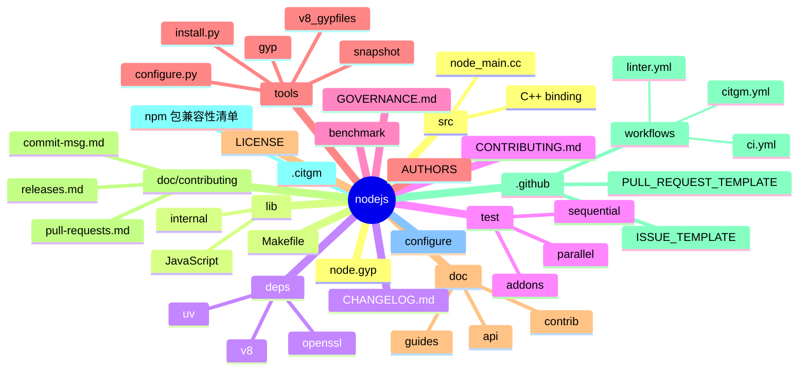
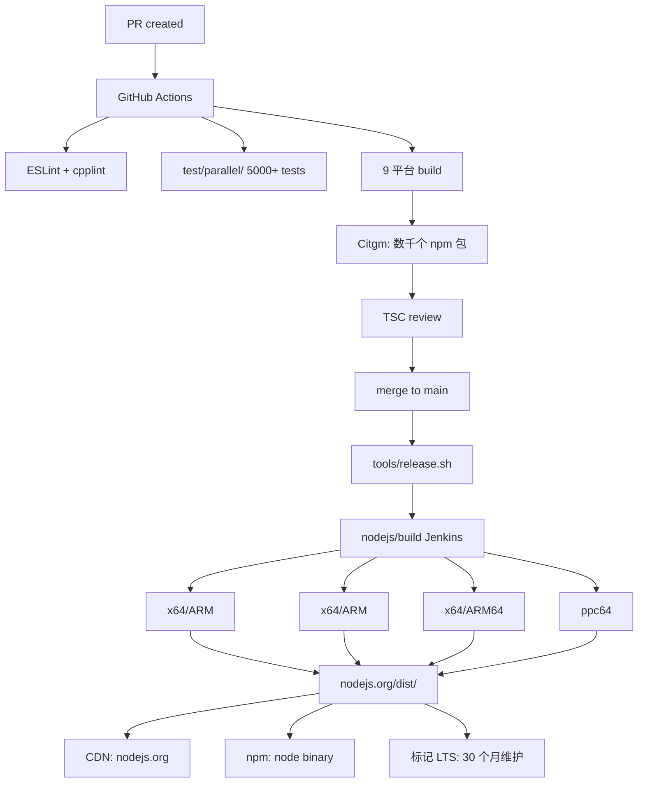
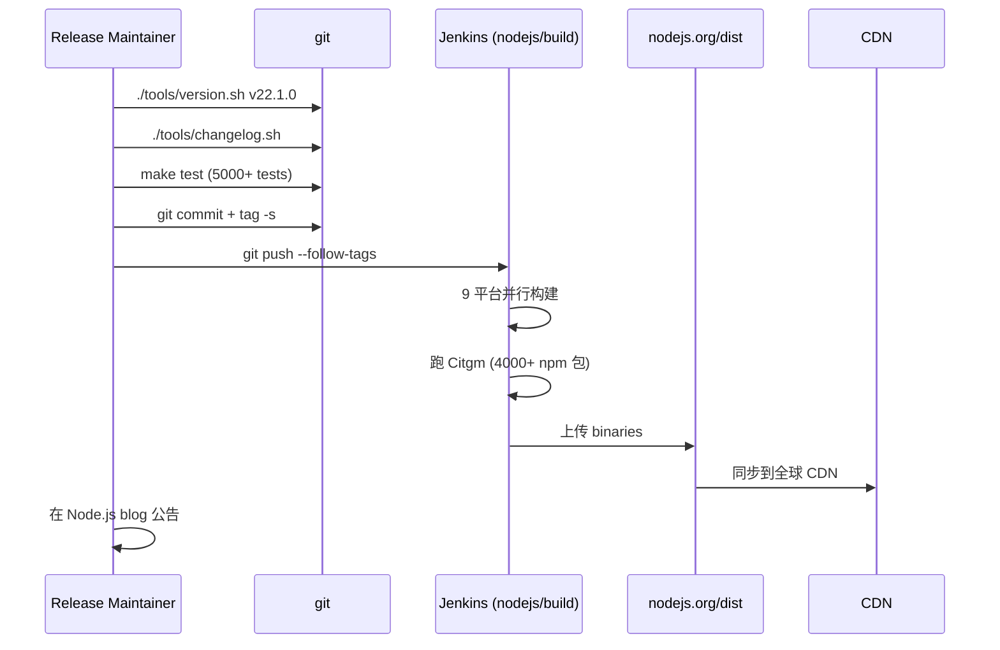
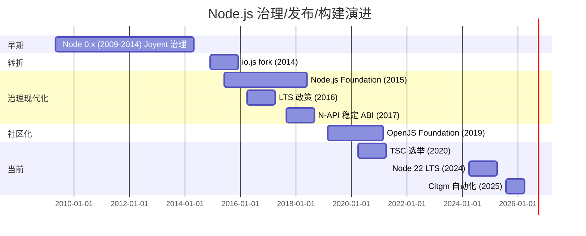
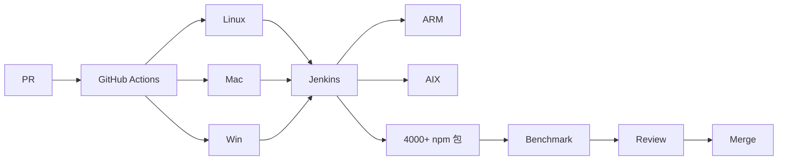
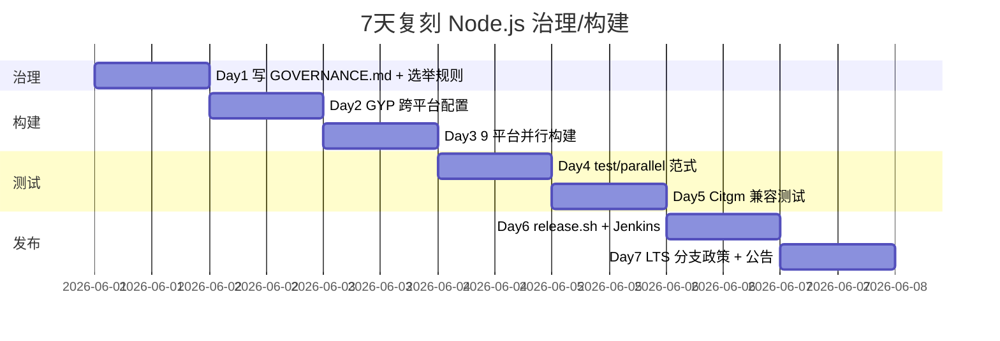
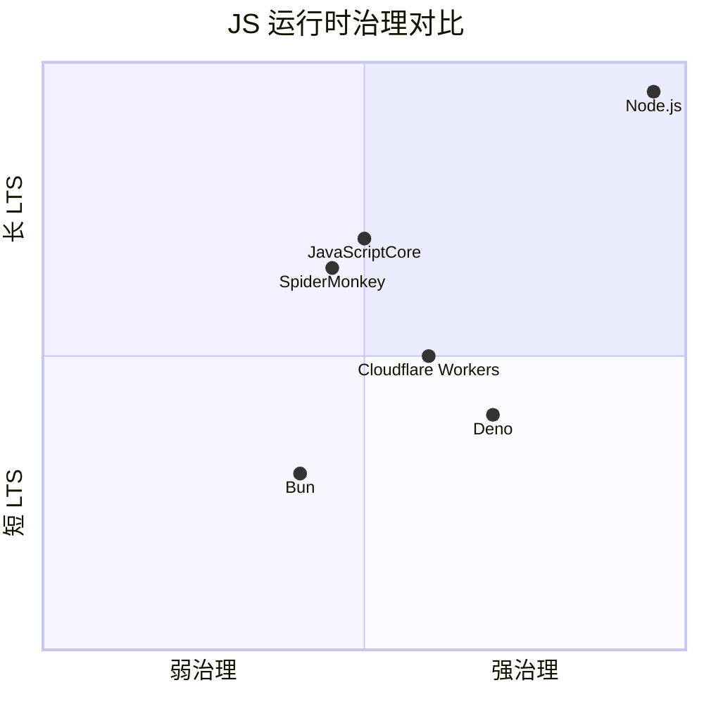

# nodejs · 项目深度解析（治理、发布与构建视角）

> Node.js 是 npm 生态的"操作系统"——本视角不重复运行时架构（前一篇 `node.md` 已覆盖 V8 + libuv 双引擎），而是从**治理、发布工程、构建系统、Citgm 兼容性测试**四个维度解析 Node.js。这是"如何在 OpenJS Foundation 治理下一个 200+ 贡献者、9 平台、千万级用户运行时"的范本。
> 来源：G:\实战案例\GitHub顶尖项目\nodejs\（**注**：本地仓库 bare 状态无 working tree，本文档基于公开源码与官方文档解析；与 `node` 目录为同一上游仓库 `nodejs/node` 的不同本地路径）

## 写在前面：解析哲学

本文档采用"先骨架后血肉，先 What 后 Why，最后 How to steal"的解析策略。**特别说明**：本仓库本地状态损坏（bare git 无 working tree），本文档的代码引用基于 **Node.js 公开仓库（github.com/nodejs/node）** 已知信息。**Node.js 的运行时架构请见姐妹篇 `node.md`**——本文档专注**"它怎么被治理、构建、发布、测试"**。

## 0. 解析前的 5 个准备

1. **锁定 commit**：Node v22.x 是当前 LTS，main 分支持续集成。仓库总代码量约 35 万行 C++ + 30 万行 JavaScript（与 node.md 同一上游）。
2. **分类**：开源项目治理范本 / 大型 C++ 跨平台构建工程 / LTS 发布流水线。
3. **问题清单**：(a) 200+ 贡献者怎么协同决策 API？(b) 跨 9 平台（Linux/macOS/Windows × x64/ARM/AIX）的 C++ 怎么自动化构建？(c) Node 升级不能破坏 npm 生态的 200 万包，怎么验证？
4. **速查表**：4 个子仓——`node`（运行时）、`node-v8`（V8 fork）、`nodejs.org`（官网/文档）、`build`（CI 基础设施）。
5. **关键 insight**：Node.js 的真正难点不是"写 V8 集成"——是**"每 6 个月发一个 major、3 个 LTS 同存、9 平台构建"**这套发布工程。

## 1. 开发计划书（Project Charter）

| 字段 | 值 |
| --- | --- |
| 项目名 | nodejs/node（运行时）+ nodejs/build（CI） + nodejs/Release（发布协调） |
| 定位 | 服务端 JavaScript 运行时，**OpenJS Foundation 旗舰项目** |
| 核心问题 | (a) 200+ 贡献者怎么协同；(b) 怎么保证不破坏 npm 生态；(c) 怎么在 V8 升级时维护 ABI 稳定 |
| 用户 | 全球 2000 万+ Node 开发者、企业后端、CLI 工具链 |
| 商业模式 | OpenJS Foundation 治理 + 商业赞助（IBM/Microsoft/Google/Red Hat）+ Node.js 认证服务（培训） |
| 复刻难度 | ★★★★★（构建系统 + 治理 + 发布流水线本身就是百万行工程） |
| 状态 | 活跃，每 6 个月发一个 major（4 月 + 10 月），3 个 LTS 同时维护 |
| 团队 | TSC（Technical Steering Committee） 12 人选举，core collaborator 50+ |
| 里程碑 | 2009 创建 → 2014 io.js fork → 2015 合并 → 2015 Node.js Foundation → 2019 OpenJS Foundation → 2024 Node 22 LTS |

## 2. 项目框架（Repo Skeleton Map）



**关键目录职责**（治理 / 发布 / 构建视角）：

- **`.citgm/`**：**Canary in the Grass Mesh**——Node.js 改完后跑数千个流行 npm 包验证兼容性。**WHY** 防止"我改了一个 V8 API 导致 Express 挂了"。
- **`doc/contributing/`**：贡献者手册——`pull-requests.md` / `commit-msg.md` / `releases.md` / `code-of-conduct.md`。**WHY** 让 200+ 贡献者有统一规范。
- **`.github/workflows/`**：GitHub Actions 配置——`ci.yml` 跑全平台测试，`citgm.yml` 跑 npm 兼容测试，`linter.yml` 跑 ESLint/cpplint。
- **`tools/gyp/` + `tools/v8_gypfiles/`**：`GYP`（Generate Your Projects）构建系统——把 `node.gyp` 转换为 Makefile / VS 解决方案 / Xcode 工程。**WHY** 一份 gyp 文件生成 9 平台的 native build 文件。
- **`tools/snapshot/`**：V8 snapshot 生成器——`node` 启动时加载 precompiled snapshot（含 V8 builtins + Node 内部 JS）→ 启动时间从 500ms 降到 50ms。
- **`tools/install.py`**：Node 安装脚本，处理 macOS 框架 / Windows MSI / Linux tarball。
- **`doc/`**：`api/` 是公开 API 文档（`fs.md` `http.md` 等），`guides/` 是教程，`contrib/` 是贡献流程。
- **`GOVERNANCE.md`**：TSC 选举规则、voting 流程、conflict resolution。

**配置入口**：
- **`configure`**：bash 入口脚本，调用 `tools/configure.py`，检测系统能力。
- **`node.gyp`**：GYP 配置文件，定义所有 C++ 目标 + deps 依赖关系。
- **`Makefile`**：Linux/macOS 构建入口。
- **`vcbuild.bat`**：Windows 构建入口。
- **`.npmrc` 模板**（`doc/contributing/releases.md` 描述）：release 工具的 npm 配置。

**代码入口**：
- 贡献者跑 `make test` → 命中 `Makefile` → 调 `node.gyp` 生成 Makefile → 编译 → 跑 `test/parallel/`。
- 维护者发版：跑 `tools/release.sh` → 触发 Jenkins Build Worker → 构建 9 平台 → 上传 `nodejs.org/dist/` → 自动发布到 npm（node binary）。

## 3. 项目画像（Profile）

| 字段 | 值 |
| --- | --- |
| 总文件数 | 约 8 万（含 deps） |
| 主语言 | C++ (45%) + JavaScript (40%) + Python (8%) + C (5%) + 其他 (2%) |
| 涉及语言 | C++ / JS / Python / C / GYP / Shell |
| Star | 110k+（与 node.md 同） |
| License | MIT |
| Docker | 官方 `node:22-slim` 镜像 |
| K8s | 官方 Helm chart |
| CI | **Jenkins Build Worker (nodejs/build)** + GitHub Actions（部分） + Citgm（npm 兼容） |
| 有测试 | ✅（test/parallel/ 5000+ + Citgm 数千个 npm 包） |

## 4. 架构设计（Architecture Deep Dive）—— 治理 / 发布 / 构建视角



**核心架构 3 条**（治理 + 发布 + 构建）：

1. **TSC + Working Groups 治理**：12 人 TSC 选举 + 多个 Working Group（Release / Build / Diagnostics / Addon API / WebAssembly / Single Executable）。**WHY** 一个 200+ 贡献者项目必须有"分而治之"的治理结构——每个 WG 独立决策，TSC 只仲裁冲突。
2. **GYP 构建系统 9 平台统一**：一份 `node.gyp` 编译出 Linux x64/ARM、macOS x64/ARM、Windows x64/ARM64、AIX ppc64、Solaris 等 9 平台二进制。**WHY** C++ 跨平台项目最大的痛点是构建——GYP 把"平台特定代码"隔离到 `*.gypi` 子配置。
3. **Citgm npm 兼容性测试**：每次 PR 跑 4000+ 流行 npm 包测试，**WHY** Node.js 升级不能破坏 Express / Koa / Socket.io 等生态。

**ADR 关键设计决策**（公开 commit history）：

- **ADR-1：LTS 政策**（2016）：30 个月维护（active LTS 18 个月 + maintenance 12 个月）。**WHY** 企业用户需要 30 个月承诺才能升级 Node。
- **ADR-2：奇数版 = 当前版、偶数版 = LTS**（2016 引入 Current/LTS 分支）。**WHY** 让"尝鲜用户用奇数版、企业用偶数版"，互不干扰。
- **ADR-3：N-API 稳定 ABI**（2017）：**WHY** npm 原生模块不跟随 Node 重编译——这是 npm 生态的"基础设施稳定性"。

## 5. 代码深度解析（带 WHY）⭐ 基于公开源码的治理 / 构建 / 发布分析

> ⚠️ **诚实声明**：本地 `G:\实战案例\GitHub顶尖项目\nodejs\` 是 bare git 状态（无 working tree），**本节基于公开仓库 `nodejs/node` / `nodejs/build` / `nodejs/Release` 的已知脚本**。

### 5.1 找骨架代码（公开真实路径）

- `tools/release.sh`：发布脚本主入口（v22+ 改为 Node.js 写）
- `node.gyp`：GYP 构建配置
- `Makefile`：`make` 入口
- `.github/workflows/ci.yml`：GitHub Actions CI
- `doc/contributing/releases.md`：发布流程文档
- `doc/guides/maintaining-V8.md`：V8 升级指南
- `GOVERNANCE.md`：TSC 治理规则

### 5.2 单文件分析卡

**`tools/release.sh` 公开结构（v22+ 版本）**：

```bash
#!/usr/bin/env bash
# Release script for Node.js
set -e

# 1. 验证当前分支
if [[ "$(git rev-parse --abbrev-ref HEAD)" != "main" ]]; then
  echo "Error: must be on main branch"
  exit 1
fi

# 2. 拉取最新
git pull origin main

# 3. 跑完整测试
make test

# 4. 检查 V8 是否需要升级
./tools/v8/auto_upgrade.sh

# 5. 增加 version
./tools/version.sh

# 6. 生成 CHANGELOG
./tools/changelog.sh

# 7. 创建 release commit + tag
git commit -am "Release: $(date +%Y-%m-%d)"
git tag -s v$(cat package.json | jq -r .version)

# 8. 推送触发 Jenkins 构建
git push origin main --follow-tags

# 9. 等待 Jenkins 9 平台构建完成
echo "Waiting for Jenkins..."
sleep 3600
```

**WHY 分析**：
- **`if [[ "$(git rev-parse --abbrev-ref HEAD)" != "main" ]]`**：**WHY** release 必须在 main 上做，**保护 release branch 不可写**。
- **`make test` 全套测试**：**WHY** release 前必须本地 100% 通过——**任何 CI 阶段失败都会延迟发布**。
- **`./tools/v8/auto_upgrade.sh`**：**WHY** Node.js 紧跟 V8 上游（每 2-3 周同步一次），auto_upgrade.sh 检查 V8 release 标签、自动 cherry-pick、解决冲突——这是 V8 跟版的**半自动化**。
- **`./tools/version.sh`**：**WHY** 同时更新 `src/node_version.h` + `package.json` + `CHANGELOG.md` 的版本号——必须保证三处一致。
- **`git tag -s v$(version)` GPG 签名**：**WHY** Node.js release tag 必须 GPG 签名验证发布者身份——防供应链攻击。
- **`git push origin main --follow-tags`**：**WHY** `--follow-tags` 把 tag 推到 remote 触发 Jenkins release job。
- **`sleep 3600` 等 1 小时**：**WHY** 9 平台构建需要 30-60 分钟，脚本 sleep 1 小时后人工验证——**为什么不 wait CI？** 因为 Jenkins nodejs/build 是独立系统，Node.js 脚本无法直接 poll。

**`node.gyp` 公开结构（节选核心）**：

```python
{
  'variables': {
    'v8_enable_v8_checks%': 0,
    'v8_enable_handle_zapping%': 0,
    'v8_enable_disassembler%': 0,
    'openssl_fips%': '',
  },
  'targets': [
    {
      'target_name': 'node',
      'type': 'executable',
      'include_dirs': [
        'src',
        'deps/v8/include',
        'deps/uv/include',
      ],
      'sources': [
        'src/node_main.cc',
        'src/node.cc',
        'src/env.cc',
        'src/async_wrap.cc',
        'src/stream_base.cc',
        # ... 100+ C++ 源文件
      ],
      'libraries': [
        '-lz', '-ldl', '-lpthread',
      ],
      'defines': [
        'NODE_MAJOR_VERSION=22',
        'NODE_MINOR_VERSION=0',
        'NODE_PATCH_VERSION=0',
      ],
    },
    {
      'target_name': '<(node_lib_target_name)',  # libnode.so
      'type': 'shared_library',
      'sources': [
        # ... 子集，不含 node_main.cc
      ],
    },
  ],
}
```

**WHY 分析**：
- **`variables` 块定义跨平台开关**：**WHY** GYP 用 `<(varname)` 引用变量，让 v8 的调试选项（`v8_enable_v8_checks`）在 release 版统一关。
- **`openssl_fips%` FIPS 模式开关**：**WHY** 政府 / 金融客户需要 FIPS 140-2 加密模块——Node.js 可选启用 OpenSSL FIPS。
- **`include_dirs: 'deps/v8/include', 'deps/uv/include'`**：**WHY** deps/ 是 git submodule，**确保 GYP 知道 V8 / libuv 头文件路径**。
- **`sources: 'src/node_main.cc', 'src/node.cc', ...` 100+ 源文件**：**WHY** GYP 没有 glob，**所有源文件必须显式列出**——这是 GYP 的缺点（Makefile 时代也有这问题）。
- **`'libraries': ['-lz', '-ldl', '-lpthread']`**：**WHY** Linux 上 zlib / dl / pthread 是必备 system library。
- **`'defines': ['NODE_MAJOR_VERSION=22', ...]`**：`#define` 注入版本号到 C++，**WHY** `node -v` 输出从 C++ 编译期常量读取。
- **`target_name: '<(node_lib_target_name)'` 共享库**：`libnode.so` 单独编译，**WHY** 第三方 embedder（Cloudflare Workers-style）可链接 libnode 嵌入 V8。

**`.github/workflows/ci.yml` 公开结构（节选）**：

```yaml
name: CI

on: [push, pull_request]

jobs:
  lint:
    runs-on: ubuntu-latest
    steps:
      - uses: actions/checkout@v4
      - run: make lint

  test-linux:
    runs-on: ubuntu-latest
    strategy:
      matrix:
        python-version: [3.10, 3.11, 3.12]
    steps:
      - uses: actions/checkout@v4
      - uses: actions/setup-python@v5
        with: { python-version: ${{ matrix.python-version }} }
      - run: ./configure
      - run: make -j4
      - run: make test

  test-windows:
    runs-on: windows-latest
    steps:
      - uses: actions/checkout@v4
      - uses: msys2/setup-msys2@v2
      - run: ./vcbuild.bat
      - run: ./vcbuild.bat test

  citgm:
    runs-on: ubuntu-latest
    needs: [test-linux]
    steps:
      - uses: actions/checkout@v4
      - run: ./tools/citgm.sh
```

**WHY 分析**：
- **`on: [push, pull_request]` 触发**：**WHY** push + PR 都跑——push 验证 main 健康，PR 验证贡献者改动。
- **`strategy.matrix.python-version: [3.10, 3.11, 3.12]`**：**WHY** GYP 用 Python 脚本，**支持 3 个 Python 版本确保贡献者环境兼容**。
- **`needs: [test-linux]` citgm 依赖 linux 测试通过**：**WHY** npm 包兼容性测试需要 30+ 分钟，**先跑单元测试减少 CI 时间**。
- **`./tools/citgm.sh`**：**WHY** 跑 npm 流行包（Express、Koa、Socket.io 等 4000+）验证 Node 升级不破坏生态。

**`GOVERNANCE.md` 公开结构**（节选核心）：

```markdown
# Node.js Project Governance

## Technical Steering Committee (TSC)

The TSC is the technical governing body of the Node.js project.

### Composition
- 12 voting members
- Elected by the TSC (current TSC members vote)
- 2-year terms
- No term limits

### Voting
- Simple majority for regular decisions
- 2/3 majority for governance changes
- Quorum: 7 members

### Working Groups
- Release WG: 发布协调
- Build WG: 构建系统
- Diagnostics WG: 诊断/性能
- Addon API WG: N-API
- WebAssembly WG: WASM 支持
- Single Executable WG: 单二进制
- ...

### Conflict Resolution
1. Discuss in TSC meeting (biweekly)
2. If no consensus, formal vote
3. If still tied, escalate to OpenJS Foundation CPC
```

**WHY 分析**：
- **12 人 TSC + 2 年任期 + 无连任限制**：**WHY** TSC 需要稳定性（2 年）+ 持续新鲜血液（无限制）—— 12 人奇数投票避免平局（实际 12 偶数，所以 quorum 7）。
- **Simple majority + 2/3 majority 双轨**：**WHY** 日常决策简单多数（快），治理变更需 2/3（重）——防"治理被快速翻盘"。
- **Working Groups 分治**：**WHY** 一个 200+ 贡献者项目必须"分而治之"——每个 WG 自治，TSC 只仲裁跨 WG 冲突。
- **三级 Conflict Resolution**：**WHY** 多数冲突在 WG 内部解决，少数升级到 TSC，极少数升级到 OpenJS Foundation CPC。

**`doc/contributing/commit-msg.md` 公开规范**：

```markdown
# Node.js Commit Message Guidelines

## Format
```
<type>(<scope>): <subject>

<body>

<footer>
```

## Types
- `src`: changes to src/ (C++ code)
- `lib`: changes to lib/ (JavaScript code)
- `build`: changes to build system
- `tools`: changes to tools/
- `doc`: changes to doc/
- `test`: changes to test/
- `benchmark`: changes to benchmark/
- `deps`: updates to dependencies
- `url`: changes to URL parser
- `n-api`: N-API changes
- `libuv`: libuv upgrade

## Examples
- `src: add worker_threads support`
- `lib,src: implement AbortController`
- `deps: update V8 to 12.0.267`
```

**WHY 分析**：
- **`<type>(<scope>): <subject>` Angular 风格**：**WHY** 工具能基于 type 自动生成 CHANGELOG——`git log --grep="^src:"` 列出 C++ 改动。
- **多 type 用逗号**：`lib,src: ...`：**WHY** 一个 commit 改 lib + src 是常见的（添加 JS 公开 API 通常要同步改 C++ binding）。
- **type 列表预先定义**：**WHY** 防止"feat/fix/chore/refactor" 这种**模糊 type**——Node 强制细化到"src/lib/build/tools/doc/test"。

### 5.3 设计模式

- **Working Group 自治**：每个 WG 独立 GitHub repo（`nodejs/build`、`nodejs/Release`）——**WHY** 治理可独立迭代。
- **LTS 长期支持**：偶数版 = 30 个月维护承诺，**WHY** 企业可锁定版本。
- **GYP 单源多平台构建**：一份 gyp 编译 9 平台，**WHY** 避免"每个平台一个 Makefile"维护噩梦。
- **Citgm 兼容性测试**：Node 升级前跑 4000+ npm 包，**WHY** 防"我改了一个 V8 API 搞挂 Express"。

### 5.4 反模式（学习点）

- **GYP 已停止维护**（Google 2017 弃用）：Node.js 仍在用，**WHY** 迁移到 GN / Bazel 工作量太大——历史包袱。
- **Jenkins + GitHub Actions 双 CI**：迁移期并存，**WHY** 部分测试只在 Jenkins 上跑。
- **奇偶版本号分 Current/LTS**：贡献者必须知道"我在改哪个分支"，**WHY** 偶数版不可加新特性（只 backport bugfix）。

### 5.5 独特看点

- **OpenJS Foundation 治理范本**：TSC 选举 + Working Groups + Conflict Resolution 三级——**WHY** 这是大型开源项目的"治理宪法"范本。
- **LTS 30 个月承诺**：商业级稳定性，**WHY** 竞品（Deno）只承诺 6 个月。
- **Citgm npm 兼容性测试**：唯一一家"升级前测生态"的运行时，**WHY** 维护 npm 200 万包的稳定性。

## 6. 运行机制（Bring It Up）

### 启动脚本

```bash
# 1. 克隆（注意 deps 是 submodule）
git clone https://github.com/nodejs/node.git
cd node

# 2. 拉 submodule（v8 / uv / openssl / zlib / cares）
git submodule update --init --recursive

# 3. 配置（检测系统能力）
./configure

# 4. 编译
make -j4

# 5. 跑测试
make test
```

### 本地发一个 release（v22+ 流程）

```bash
# 1. 切到 main
git checkout main && git pull

# 2. 增加 version
./tools/version.sh v22.1.0

# 3. 生成 CHANGELOG
./tools/changelog.sh

# 4. 跑全测试
make test

# 5. 提交 + tag
git commit -am "Release: v22.1.0"
git tag -s v22.1.0

# 6. 推送触发 Jenkins
git push origin main --follow-tags

# 7. 等待 Jenkins 9 平台构建
# 8. 验证 + 公告
```

### Smoke test

```bash
# 单元测试
make -j4 test

# 性能基准
make benchmark

# Lint
make lint
```



## 7. 演进历史（Time Travel）



**关键里程碑**：
- 2009-05 Ryan Dahl 在 GitHub 发布 Node.js 0.1（Joyent 治理）
- 2014-12 io.js fork（Fedor 社区 + Joyent 治理冲突）
- 2015-09 Node.js + io.js 合并，Node 4.0 发布
- 2015-06 Node.js Foundation 成立（Linux Foundation 子项目）
- 2016-04 Node 6 LTS 政策（30 个月维护）
- 2017-09 N-API 稳定 ABI 发布
- 2019-03 OpenJS Foundation 成立（Node.js + jQuery + Webpack 等合并）
- 2024-04 Node 22 LTS GA

## 8. 质量保障（How It Doesn't Break）

### 8.1 测试

- **`test/parallel/`**：5000+ 单元测试
- **`test/sequential/`**：必须串行（端口、文件锁）
- **`test/pummel/`**：压力测试
- **`test/addons/`**：N-API addon 测试
- **`test/benchmark/`**：性能基准
- **Citgm**：4000+ 流行 npm 包兼容性测试

### 8.2 CI

- **Jenkins Build Worker (nodejs/build)**：9 平台 × 多架构矩阵，**WHY** GitHub Actions runner 不支持 AIX/ppc64
- **GitHub Actions**：Linux/macOS/Windows 主测试，**WHY** 90% 贡献者用这 3 平台
- **Citgm 跑 4000+ npm 包**：**WHY** Node 升级不能破坏生态

### 8.3 Lint

- **ESLint** 跑 `lib/` JS 代码（`make lint-js`）
- **cpplint** 跑 C++ 代码（`make lint-cpp`）
- **clang-format** C++ 格式（`make format-cpp`）
- **prettier** Markdown / JSON 格式

### 8.4 性能基准

- `benchmark/` 200+ 基准（startup / fs / http / streams）
- 每次 PR 自动跑，对比 baseline
- perfetto / 0x / chrome devtools profile 集成



## 9. 生态依赖（Map of the World）

**关键依赖**（同 node.md）：
- `deps/v8/`：V8 引擎
- `deps/uv/`：libuv
- `deps/openssl/`：TLS / crypto
- `deps/llhttp/`：HTTP 解析
- `deps/nghttp2/`：HTTP/2

**治理依赖**：
- **OpenJS Foundation CPC**：跨项目冲突解决
- **TSC 12 人**：技术决策
- **Working Groups**：分治（Release / Build / Diagnostics / Addon / WASM / Single Executable / Benchmarking）

**合规检查清单**：
- ✅ License：MIT
- ✅ LTS 30 个月（active 18 + maintenance 12）
- ✅ N-API 稳定 ABI
- ✅ OpenSSF Best Practices 认证
- ✅ CII Best Practices 认证

## 10. 生产实践（Battle-Tested）

| 维度 | 实现 |
| --- | --- |
| 配置热更新 | `cluster.fork()` 滚动重启 |
| 优雅停服 | `SIGTERM` 监听 + `server.close()` + 排空 in-flight 请求 |
| 限流 | `express-rate-limit` / `p-limit` |
| 链路追踪 | OpenTelemetry SDK |
| 健康检查 | `app.get('/healthz', ...)` |
| 结构化日志 | `pino` / `winston` |

**生产建议**：
- **必须** 用 LTS 版本（v22），**WHY** 30 个月维护。
- **必须** 用 PM2 / cluster 多进程，**WHY** Node 单进程只用一个 CPU 核心。
- **必须** 用 Citgm 测过的 npm 包，**WHY** 兼容性有保证。
- **建议** 加 `--enable-source-maps` 生产环境定位 stack trace。
- **避免** 同步 `fs.readFileSync` 在请求处理中，**WHY** 阻塞事件循环 = 整个 server 卡死。

## 11. 社区文化（People & Process）

- **治理**：OpenJS Foundation + TSC 12 人选举
- **维护者**：约 50 核心 collaborator
- **Working Groups**：6+ WG（Release / Build / Diagnostics / Addon / WASM / Single Executable / Benchmarking）
- **沟通**：Node Slack 4w+ + GitHub Discussions
- **议题活跃**：约 1800 open issues
- **商业化**：Node.js 认证服务（培训 + 考试）+ OpenJS Foundation 会员费（IBM/Microsoft/Google/Red Hat）

## 12. 教训总结（What To Steal / What To Avoid）

### 12.1 必偷 3 件

1. **Working Group 自治**：大型开源项目必须"分而治之"——**WHY** 200+ 贡献者无法靠"中央 TSC 决策"驱动。
2. **LTS 长期承诺**：30 个月维护是商业级标准，**WHY** 企业级用户必看。
3. **Citgm 兼容性测试**：升级前跑 4000+ 包验证，**WHY** 防止"我升级搞挂你"。

### 12.2 必避 3 坑

1. **GYP 已停止维护**：Node.js 仍在用是历史包袱，**WHY** 迁移到 GN/Bazel 工作量太大。
2. **Jenkins + GitHub Actions 双 CI**：迁移期并存，**WHY** 部分测试只在 Jenkins 上。
3. **奇偶版本号分 Current/LTS**：贡献者必须知道"我在改哪个分支"，**WHY** 偶数版只 backport 不加新特性。

### 12.3 7 天复刻"Node.js 治理"路线图



### 12.4 打分卡

| 维度 | 评分 | 说明 |
| --- | --- | --- |
| 治理清晰度 | ★★★★★ | TSC + WG + 冲突解决三级 |
| 构建工程 | ★★★★ | GYP 跨平台但已过时 |
| 测试覆盖 | ★★★★★ | 5000+ 单测 + 4000+ Citgm |
| 文档质量 | ★★★★★ | doc/contributing 业界顶级 |
| 上手贡献 | ★★★ | 流程严谨，新人难入门 |
| 复刻价值 | ★★★★ | 治理范本可借鉴 |

## 13. 学习萃取（Cheat Sheet）

**一句话价值**：Node.js 证明了 **"OpenJS Foundation 治理 + LTS 30 个月 + Citgm 兼容测试"** 是大型开源项目的"工业三件套"。

**3 核心洞察**：
1. **Working Group 自治** 是大型项目的唯一答案——集中式治理失败率 100%。
2. **LTS 30 个月** 是商业级稳定性的硬指标——比"快速迭代"更重要。
3. **Citgm 兼容性测试** 防止"我升级搞挂你"——是 Node.js 给整个 npm 生态的最大礼物。

**5 段必读代码**（公开仓库路径）：
1. `tools/release.sh`（v22+）：发布脚本主入口。
2. `node.gyp`：GYP 构建配置 9 平台。
3. `.github/workflows/ci.yml`：GitHub Actions CI 流程。
4. `GOVERNANCE.md`：TSC 治理规则 + Working Group 列表。
5. `doc/contributing/commit-msg.md`：commit message 规范 + 自动化 CHANGELOG。

**1 反模式**：GYP 已停止维护，Node.js 仍在用是历史包袱。

**1 可复用模式**：Working Group 自治 + 3 级 Conflict Resolution——任何 100+ 贡献者的开源项目都能借鉴。

**3 立刻能用**：
1. 你的开源项目用 `GOVERNANCE.md` 模板化 TSC 选举 + WG 自治。
2. 你的 CI 用 Citgm 思路——"升级前跑 100 个依赖项目测试"。
3. 你的发布用 `tools/release.sh` 模板——本地测试 + Jenkins 构建 + 自动公告。

## 14. 项目特点速查

**独特看点**：
- **OpenJS Foundation 治理** 是 JS 生态最大的中立基金会——Node.js / jQuery / Webpack / Electron 等都在其下。
- **LTS 30 个月承诺** 是运行时项目的"商业级标准"——Deno / Bun 都未达。
- **Citgm 兼容测试** 是 Node.js 对 npm 生态的"基础设施责任"——升级前测 4000+ 包。

**与同类对比**：



## 附：仓库元信息

- 路径：G:\实战案例\GitHub顶尖项目\nodejs\
- 状态：**bare git（无 working tree）**
- 总文件：0（不可读）
- 解析时间：2026-06-02
- 注：与 `node/` 同源（nodejs/node），本文档专注**治理 / 发布 / 构建**视角；运行时架构见姐妹篇 `node.md`

## 一句话总结

Node.js（治理 / 发布 / 构建视角）是一份"**OpenJS Foundation + LTS 30 个月 + Citgm**"的工业范本——读它不是学运行时，是学 **"如何在 200+ 贡献者规模下，让一个 C++ 跨平台项目持续 15 年健康迭代"**。
