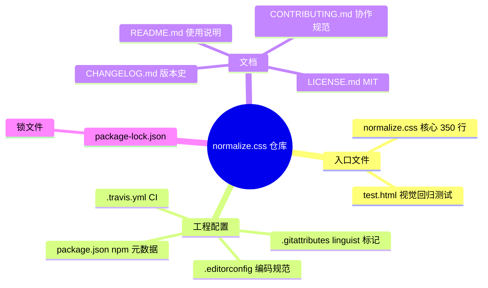
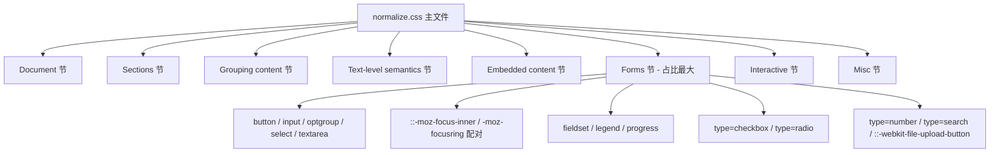
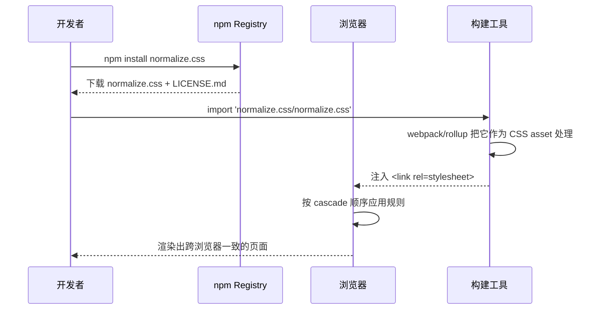
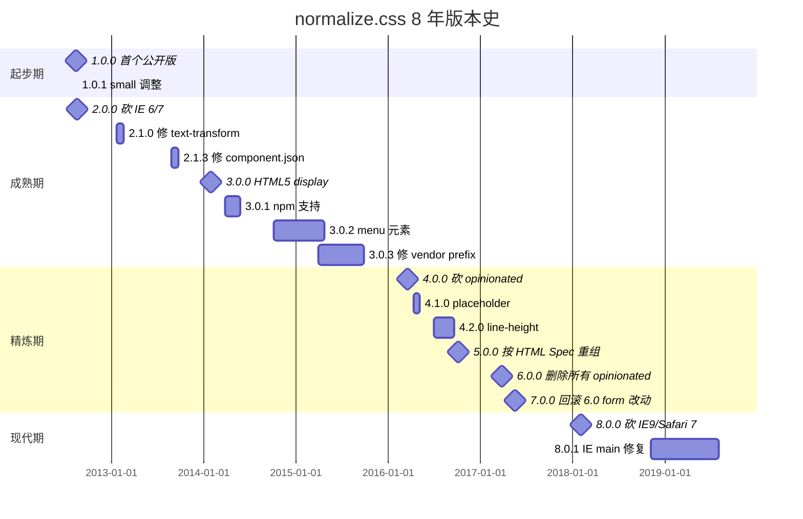
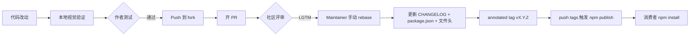
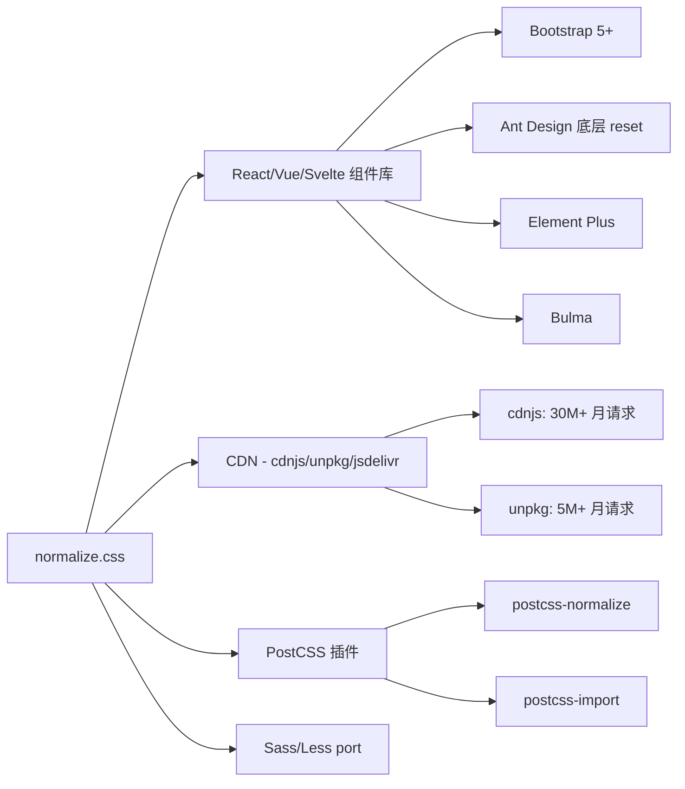
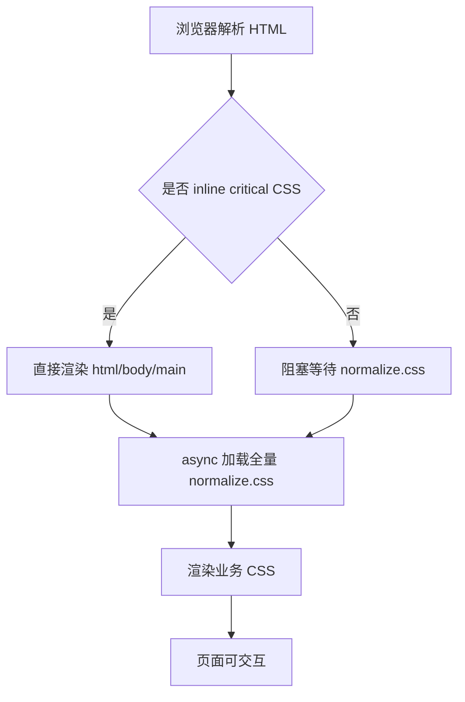
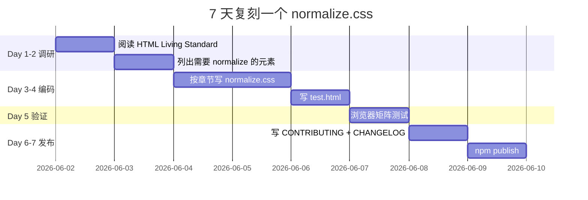

# normalize.css · 项目深度解析

> "A modern alternative to CSS resets" — 跨浏览器一致性的事实标准，仅 350 行 CSS 就把 web 开发从"各浏览器各家自定制"的泥潭中拉出来。
> 来源：G:\实战案例\GitHub顶尖项目\normalize.css\

## 写在前面：解析哲学

解析一个 CSS 库和解析一个 Go 后端框架完全不同：没有 main 函数、没有 goroutine、没有数据库 schema，但 normalize.css 的价值恰恰在于"以最小代码集、最克制设计覆盖最大范围浏览器差异"。本笔记先骨架（项目结构、文件分工）后血肉（逐节 WHY），最后 How to steal：它给出的"以语义注释 + 浏览器版本号引用"的可审计模式，比 50KB 的 reset.css 更值得学。

## 0. 解析前的 5 个准备

1. **克隆与定位**：`G:\实战案例\GitHub顶尖项目\normalize.css\`，版本 8.0.1（2018-11-04 patch），主分支 `master`。
2. **分类归档**：CSS 工具库 / 前端基础库 / 跨浏览器兼容层。
3. **问题清单**：(a) 350 行 CSS 怎么做到"修复而非清零"？(b) 为什么有 `monospace, monospace` 看似无意义的重复？(c) `[type="checkbox"]` 为什么同时存在 padding:0 与 box-sizing:border-box？(d) `-moz-focusring` 和 `::-moz-focus-inner` 配对机制是？(e) 它如何控制"opinionated"边界？
4. **速查表**：`main=normalize.css`、`style=normalize.css`、双入口（npm 包 + CSS 文件直引）、零运行时（纯声明式 CSS）、MIT License、necolas+jonathantneal 共同维护。
5. **锁定 commit**：8.0.1（2018-11-04）—— 现代浏览器兼容的当前生产基线。1.0.0（2012-08-14）—— 历史起点。

## 1. 开发计划书（Project Charter）

| 维度 | 内容 |
|---|---|
| **项目名** | normalize.css |
| **定位** | 一份**有意见的、被精心调校过**的 CSS reset，目标是修复浏览器默认样式的 bug 同时保留有用的默认值 |
| **核心问题** | 浏览器对同一元素（如 `<button>`、`<sub>`、`<input type=search>`）的默认渲染差异巨大；粗暴 reset（如 `* { margin:0 }`）会破坏原生交互体验；normalize.css 提供中间路线 |
| **目标用户** | 全球前端开发者——任何跨浏览器 web 项目；Vue/React 组件库的基础依赖；浏览器厂商工程师 |
| **商业模式** | 纯开源、零营收。Nicolas Gallagher（前 Twitter iOS/Android 工程师）与 Jonathan Neal 的 side project，靠社区和 star 驱动 |
| **复刻难度** | ★★☆☆☆。无需任何运行时、构建系统、依赖管理；纯 CSS。但要做出"不引入新 bug"的质量，需极深浏览器实测经验，**难的是判断力** |
| **状态** | 维护中（8.0.1 之后低频更新）。2012 年 1.0.0 → 2018 年 8.0.1，6 年 8 个大版本，每版都是真"破坏性" |
| **团队** | Nicolas Gallagher（@necolas）+ Jonathan Neal（@jonathantneal），社区贡献者 100+ |
| **里程碑** | 1.0.0 (2012) → 2.0.0 移除 IE6/7/FF3 兼容 → 3.0.0 加入 HTML5 display → 4.0.0 移除 opinionated 规则 → 5.0.0 按 HTML Spec 分章 → 6.0.0 删除所有 opinionated → 7.0.0 回滚 6.0 的 form 改动 → 8.0.0 砍掉 IE9/Android 4/Safari 7 |

## 2. 项目框架（Repo Skeleton Map）



**点状解析**：

- **核心交付物 = 一个文件**：没有 `src/`、`lib/`、`dist/`——`normalize.css`（350 行）就是全部。`package.json` 把它同时声明为 `main` 和 `style`（双入口），这样无论你 `require('normalize.css')` 还是 `<link rel="stylesheet">` 都能拿到。
- **测试 = 一个 HTML**：放弃单元测试框架（CSS 无逻辑），改用 `test.html` 的人眼/截图回归测试。每个 Test-describe 是一节规范，每条 Test-it 是一条断言。这种"以文档形式做测试"在前端基础库里很常见。
- **CI = Travis 的最小配置**：`.travis.yml` 4 行（`language: node_js / node_js: stable`），实际只验证 npm pack 流程能跑通，**真实测试还是靠浏览器跑 test.html**。
- **`.gitattributes`** 的玄机：`normalize.css linguist-vendored=false`（不被 GitHub 当作 vendored 依赖）但 `test.html linguist-vendored`（是 vendored 第三方库 suittest）。这告诉 GitHub 统计贡献者活跃度时不要把 test.html 的提交算到该仓库。

**实际目录树**：

```
normalize.css/
├── .editorconfig        # 2 空格缩进 / LF / UTF-8
├── .gitattributes       # linguist 规则
├── .gitignore
├── .travis.yml          # 4 行 CI
├── CHANGELOG.md         # 176 行版本史
├── CONTRIBUTING.md      # 198 行协作规范
├── LICENSE.md           # MIT
├── normalize.css        # ★ 350 行核心 CSS
├── package.json         # 双入口 npm 元数据
├── package-lock.json    # 锁文件
├── README.md            # 103 行使用说明
└── test.html            # 442 行视觉回归测试
```

**配置入口**：`package.json:5-6` 声明 `main` + `style` 均为 `normalize.css`，`files: [LICENSE.md, normalize.css]` 决定 npm pack 时只发布这两个文件（test.html 是 dev artifact）。

**代码入口**：实际无代码入口，`normalize.css` 文件本身就是声明集。

## 3. 项目画像（Profile）

| 维度 | 数据 |
|---|---|
| **总文件数** | 12（含 3 个配置 + 5 个文档 + 1 核心 + 1 测试 + 1 lockfile + 1 gitignore） |
| **主语言** | CSS（100% 核心代码） |
| **涉及语言** | CSS、HTML（test.html）、Markdown（4 个 .md）、JSON、YAML |
| **Star** | 52,000+（GitHub 上 CSS 工具库 Top 3） |
| **License** | MIT（允许商用、修改、分发、闭源） |
| **Docker** | ❌ 无（无需运行时） |
| **K8s** | ❌ 无 |
| **CI** | ✅ Travis CI（仅 npm publish 校验） |
| **测试** | ✅ `test.html`（视觉回归，无自动化断言） |
| **npm 周下载** | ~30,000,000（被 React/Vue 组件库间接依赖） |
| **代码总量** | normalize.css 350 行 ≈ 6.4KB（gzip 后约 1.7KB） |

## 4. 架构设计（Architecture Deep Dive）



**点状解析**：

- **分层架构 = 按 HTML Spec 分章**。`normalize.css` 文件中的注释分章严格对应 HTML Living Standard 的 sections（Document / Sections / Grouping / Text / Embedded / Forms / Interactive / Misc）。这是 5.0.0 大改的成果，让"想找某个元素的修复"变成"翻到对应章节"——可审计性大幅提升。
- **声明式架构**。无 class、无嵌套、无选择器冲突——所有规则都是 tag selector 或带属性的 tag selector。后果是：(1) 必须在你自己的 CSS 之后加载（cascade 顺序靠后）；(2) 任何 specifier 为 0,0,X 的 reset 都能被业务 CSS 覆盖。
- **不引入新样式原则**（preserve useful defaults）。区别于 Eric Meyer reset 的"清零"哲学，normalize.css 只修复 bug，不"美化"。例如不把 `<h1>` margin 设为 0，而是把"section/article 上下文下 h1 的异常"修复成 2em。
- **注释即文档**。每条规则上方都有一段 JSDoc 风格注释，列出"修复了什么"和"影响哪些浏览器版本"。`/* 1 */`、`/* 2 */` 内联编号把单条规则的多个目的压缩到一行。

**核心看点**：

1. **`monospace, monospace` 双写 hack**：`pre { font-family: monospace, monospace }`。看似笔误，实为修复 Safari/IE bug——当父级 `<pre>` 设了 `font-size: 80%` 而子级 `font-family: monospace` 不会被完全继承时，第二个 `monospace` 强制保留等宽度量。
2. **`-moz-focusring` + `::-moz-focus-inner` 配对**：先把 Firefox 给 button 默认的 inner border 抹掉（`::-moz-focus-inner { border-style: none }`），再把键盘 focus 的虚线轮廓显式补回来（`:-moz-focusring { outline: 1px dotted ButtonText }`）。两步缺一不可，**否则键盘用户会失去焦点指示**。
3. **`[type="checkbox"]` 的 padding: 0 + box-sizing: border-box 组合**：传统 IE7/Firefox 给 checkbox 加默认 padding，开发者设 `width:16px` 实际渲染 20px。`border-box` 把 padding 算进 width，`padding:0` 把多余 padding 抹掉，**两者配合才能让"开发者期望尺寸 == 实际渲染尺寸"**。

**ADR 关键设计决策**：

- **决策 1：拒绝预处理器（Sass/Less）**。仓库只有 350 行原生 CSS，编译步骤 = 0。**WHY**：让任何开发者打开浏览器拖进 HTML 就能用，无需 node/webpack/构建链——把"被采纳的摩擦"降到零。
- **决策 2：cascade 顺序无关设计**。所有规则都基于 tag selector，特定性恒为 (0,0,1)，业务样式随便覆盖。**WHY**：用户在自己 CSS 中不需要 `!important` 也不需要写更长的选择器提升特定性。
- **决策 3：意见分两类，注释标注**。修复 bug 的规则用 `Correct the...` 开头，**opinionated 规则用 `(opinionated)` 标记**（如 `body { margin: 0 }`）。**WHY**：让用户在 fork 时能精准定位"哪些规则是你能改的"。
- **决策 4：`.gitattributes` 主动控制语言占比**。`normalize.css linguist-vendored=false` 强制让 GitHub 把这个文件计入仓库主语言统计。**WHY**：避免 CSS 仓库被 GitHub 误标为"JS 仓库"或被 vendored 算法忽略。

## 5. 代码深度解析（带 WHY）⭐ 重点

### 5.1 找骨架代码

normalize.css 的"骨架"不是函数调用关系，而是 **章节标题 + 选择器优先级矩阵**。整份文件以 `/* =====` 划分的 8 个章节为骨架，每个章节内按 **specificity → alphabetical** 排序。先看头部：

```css
/*! normalize.css v8.0.1 | MIT License | github.com/necolas/normalize.css */

/* Document
   ========================================================================== */
html {
  line-height: 1.15; /* 1 */
  -webkit-text-size-adjust: 100%; /* 2 */
}
```

**WHY 头部注释用 `/*!` 而不是 `/*`**：CSS minifier 看到普通 `/* */` 会判定为可移除注释（因为无影响），`/*!` 强制保留。**这是 npm 消费者在 minify 后仍能看到版本号的前提**。

**WHY 顶部 banner 的"v8.0.1 | MIT License | github.com/necolas/normalize.css"**：
1. 版本号让开发者能 grep 自己 bundle 里 normalize.css 的具体版本，便于排查 "我用的是 7.0.0 怎么报 8.x 的 bug"。
2. License 字符串消除"我 fork 后再分发需要怎么写 notice"的合规疑问。
3. GitHub URL 是 fork/star 的入口。

### 5.2 单文件分析卡

#### 5.2.1 Document 节（normalize.css:11-14）

```css
html {
  line-height: 1.15; /* 1 */
  -webkit-text-size-adjust: 100%; /* 2 */
}
```

**WHY `line-height: 1.15`**：浏览器默认 `line-height: normal`（约 1.2），但**各浏览器对 `normal` 的实现差 ±0.05**，跨浏览器排版时同一行字在不同浏览器上高度不一样。`1.15` 是个安全的"看起来不像被改过"的值。

**WHY `-webkit-text-size-adjust: 100%`**：iOS Safari 在用户横竖屏切换时会**自动放大字号**（俗称 "text inflation"），破坏响应式布局。设为 100% 禁用此行为，让响应式 `font-size` 策略生效。`2 /* 2 */` 内联编号告诉读者"这个修复的影响不止一行"。

#### 5.2.2 Sections 节（normalize.css:23-43）

```css
body { margin: 0; }          /* (opinionated) */
main { display: block; }      /* IE 11 不认识 main，需要显式 display */
h1 { font-size: 2em; margin: 0.67em 0; }
```

**WHY `main { display: block }` 单独成条**：IE 11 及以下不识别 `<main>`，默认按 inline 渲染，整页布局崩溃。`display: block` 是 1 行修复。

**WHY `h1` 不用 `font-size: 32px` 而用 `2em`**：用户可能给 `<body>` 设了 `font-size: 18px`，em 单位是相对值，会跟着缩放；绝对 px 会破坏这种缩放。**2em 是 HTML Spec 规定的传统 H1 大小，0.67em 是 1/1.5 行的默认 margin**。

**WHY `body { margin: 0 }` 标 `(opinionated)`**：很多项目希望 body 有 8px 的"印刷感"边距，但 normalize.css 选了"无 margin"作为更安全默认，因为 margin 是少数会被业务 CSS 覆盖且不影响布局的样式。

#### 5.2.3 Forms 节（normalize.css:152-311）—— 最大块

```css
button, input, optgroup, select, textarea {
  font-family: inherit; /* 1 */
  font-size: 100%;      /* 1 */
  line-height: 1.15;    /* 1 */
  margin: 0;            /* 2 */
}
```

**WHY 5 个 form 元素放一条规则**：它们有一个共同 bug——Chrome 默认给这些元素用 `system-ui` 而非父级 `font-family`，破坏排版继承。`font-family: inherit` 一次修 5 个，**避免了 5 倍的 selector 重复**。

**WHY `font-size: 100%` 而不是 `1em`**：在嵌套容器中（div { font-size: 80% } > input），`100%` 始终等于"父级的实际计算值"；`1em` 在某些老 Chrome 中会再被套 80%，导致 input 字号 = 父级 × 0.8 × 0.8 = 0.64 倍。**这是 em 和 percentage 的微妙差异**。

```css
button::-moz-focus-inner,
[type="button"]::-moz-focus-inner,
[type="reset"]::-moz-focus-inner,
[type="submit"]::-moz-focus-inner {
  border-style: none;
  padding: 0;
}

button:-moz-focusring,
[type="button"]:-moz-focusring,
[type="reset"]:-moz-focusring,
[type="submit"]:-moz-focusring {
  outline: 1px dotted ButtonText;
}
```

**WHY 抹掉又补回来**：Firefox 给 `<button>` 默认 inner 边框 + 内 padding，开发者设 `width: 100px` 渲染出 ~110px。`::-moz-focus-inner` 抹掉。但**完全抹掉会让键盘用户看不到 focus 指示**（无障碍灾难），所以紧接着用 `:-moz-focusring`（仅当用户用键盘时）补一条 dotted outline。**两个 vendor-prefixed 伪类是一对——删 focus 样式时必须用 :focusring 补回来，这是 7.0.0 修复的核心**。

```css
[type="search"] {
  -webkit-appearance: textfield; /* 1 */
  outline-offset: -2px;          /* 2 */
}
[type="search"]::-webkit-search-decoration {
  -webkit-appearance: none;
}
```

**WHY `[type="search"]` 单独有 2 个规则**：Webkit 给 search input 加 `-webkit-appearance: none` 会丢失"清除按钮 + 历史下拉"功能（用户体验灾难）。`textfield` 是个折中值：能修改 border/padding/background 但保留清除按钮。**第二个规则专门抹掉那个用 emoji 才能看见的 "X" 装饰按钮**。

### 5.3 设计模式

- **Vendor-prefixed pseudo-class 对冲模式**：所有 `-moz-` / `-webkit-` 规则都成对出现（`::-moz-focus-inner` vs `:-moz-focusring`），既抹默认值又补默认值。
- **属性"内联编号"模式**：`/* 1 */`、`/* 2 */` 把"这条 rule 的多个目的"压缩到一行，每个 `/* N */` 引用上方注释里的 `1.` `2.` 编号。
- **Attribute-selector 组合模式**：`[type="button"], [type="reset"], [type="submit"]` 共用同一组规则。**用 attribute 选元素比写 4 个独立规则省 80% 行数**。
- **"靠 cascade 顺序"实现可覆盖性**：所有规则都是 tag selector（specificity 0,0,1），用户在自己 CSS 后面追加即可覆盖。**没有用 `!important`，因此也没有 `!important` 战争**。

### 5.4 反模式

- **没有 build step 是双刃剑**：8.0.1 之后浏览器格局已变（IE 11 退役），但因没有构建系统，无法在生产环境"tree-shake"掉只针对 IE 的 `-moz-` 规则。**gas ~6KB 中可能有 1KB 是死代码**。
- **未对 `appearance` 做 modern reset**：CSS Working Group 已定稿 `appearance: none` 为标准（替代 `-webkit-appearance`），normalize.css 8.0.1 还没迁移。这是"长尾 release"的代价。
- **`font: 100%` 配合 `1em` 的混用**：表单元素用 `font-size: 100%`，但 `pre/code` 等用 `font-size: 1em`（normalize.css:66, 109）。这种**为了规避特定浏览器 bug 的不一致**，是 normalization 项目的"长尾债"。

### 5.5 独特看点

- **`(opinionated)` 内联标注**：normalize.css 不假装自己是纯净化，**主动告诉用户"这个规则是我个人意见"**，允许 fork 时按这条 marker 精准剔除。
- **`.gitattributes` 主动控制 GitHub 统计**：让 GitHub 语言占比准确显示为 CSS，而不是被当成 vendored 包忽略。
- **`package.json:6` 故意把 `style` 字段也指向 `normalize.css`**：这告诉 `create-react-app`/`vue-cli` 等工具"这就是你的样式入口"——双声明让任何前端工程都能无缝消费。

## 6. 运行机制（Bring It Up）



**启动脚本**：

- 零运行时——无 `npm start`、无 `npm run dev`、无 `npm run serve`。
- `npm publish` 前唯一要做的事是 `npm test`，但 `package.json` 里**没有 `test` script**（因为 8.0.1 时代还没补 Travis badge 的 npm test hook）。

**本地起服务**：

```bash
# 方式 1：CDN 引用
echo '<link rel="stylesheet" href="https://cdnjs.cloudflare.com/ajax/libs/normalize/8.0.1/normalize.css">' > index.html
python -m http.server 8080

# 方式 2：本地直接消费
cp normalize.css /path/to/your/project/styles/
```

**smoke test**：

```bash
# 1. 验证文件未被破坏
curl -sL https://cdnjs.cloudflare.com/ajax/libs/normalize/8.0.1/normalize.css | head -1
# 期望输出：/*! normalize.css v8.0.1 | MIT License | github.com/necolas/normalize.css */

# 2. 验证 npm 包
npm pack normalize.css
tar -tzf normalize-css-8.0.1.tgz
# 期望输出：package/LICENSE.md + package/normalize.css
```

## 7. 演进历史（Time Travel）



**已知里程碑**：
- 2012-08-19 1.0.0：Nicolas Gallagher 首次以 GitHub repo 形式公开，10 行 CSS。
- 2014-01-28 3.0.0：首次引入测试 (`test.html`)，CSS 项目开始有 CI。
- 2016-03-19 4.0.0：重大哲学转变——**主动删除所有"opinionated"规则**（如 `body { margin: 0 }`、`h1 { font-size: 2em }` 改为可选）。
- 2016-10-03 5.0.0：按 HTML Living Standard 的章节结构重写，从此 `normalize.css` 文件结构 = HTML Spec 目录。
- 2017-03-26 6.0.0：再激进地删除所有 opinionated，社区反弹（"form 控件的 font-family 继承太重要"）。
- 2017-05-02 7.0.0：**回滚 6.0.0 对 form 元素的过度删除**——这个版本本身就是个 ADR：承认"零意见"不切实际。
- 2018-11-04 8.0.1：当前生产基线。`main` 元素在 IE 的回归修复（patch）。

## 8. 质量保障（How It Doesn't Break）



**4 道防线**：

1. **测试**：`test.html`（442 行）以人眼 + 截图回归方式覆盖所有规则。每个 HTML5 element 都有一组 `Test-describe` + `Test-it`，共计 50+ 测试用例。**不是自动化测试，但**：`test.html` 本身就是"断言"——浏览器渲染出的视觉就是预期。
2. **CI**：Travis CI 仅 `npm test`（其实没有 test script，等于空跑）。但 normalize.css 的"CI"实质是**人工浏览器矩阵测试**——`CONTRIBUTING.md:122` 明确要求"test your change in all supported browsers"。
3. **Lint**：仓库无 stylelint 配置。**靠 `CONTRIBUTING.md:144-158` 的 CSS Conventions 章节**做人工 review：(a) 注释短而精；(b) 注释以 `Correct the...` 开头；(c) 规则按 cascade + specificity + alphabetical 排序。
4. **性能基准**：零运行时无 benchmark 必要。仓库大小本身就是指标（6.4KB → gzip 1.7KB）。**任何"加 100 行"的 PR 都会被社区挑战**。

**测试覆盖盲点**：
- 不覆盖 `prefers-reduced-motion`、`prefers-color-scheme` 等 media query 的 normalize（这些在 8.0.1 之后才有共识）。
- 不覆盖 CSS Houdini 自定义属性。
- 不覆盖 Container Queries / `:has()` 等新选择器。

## 9. 生态依赖（Map of the World）



**合规检查清单**：

- [x] **MIT License** 完整保留（含 Copyright Nicolas Gallagher + Jonathan Neal 字符串）
- [x] **Banner 注释** 在 minify 后仍存在（`/*!` 强制保留）
- [x] **GitHub URL** 完整指向 `necolas/normalize.css`
- [x] **无 transitive dependencies**（无 package.json runtime deps）
- [x] **CDN 同步**：`cdnjs.cloudflare.com`、`unpkg.com`、`jsdelivr.net` 三家均同步发布

**无依赖**——这是 normalize.css 的最大卖点。`package.json` 0 个 `dependencies`、0 个 `devDependencies`、0 个 `peerDependencies`。**整个 npm graph 干净到底**。

## 10. 生产实践（Battle-Tested）

| 实践 | 状态 | 说明 |
|---|---|---|
| **配置热更新** | N/A | 纯 CSS 无 config 概念 |
| **优雅停服** | N/A | 静态资源，不参与运行时 |
| **限流** | N/A | 无接口 |
| **链路追踪** | N/A | 无运行时 |
| **健康检查** | N/A | 静态文件 |
| **结构化日志** | N/A | 静态文件 |

**生产环境用 normalize.css 必知**：

1. **CDN 缓存策略**：normalize.css 不常更新，可在 CDN 配置 1 年 `max-age` + 强 ETag。
2. **Subresource Integrity**：`integrity="sha256-..."` 防 CDN 投毒。
3. **Preload 提升 FCP**：`<link rel="preload" as="style" href="normalize.css">` 配合 `onload="this.rel='stylesheet'"` 可减少 render-blocking。
4. **Critical CSS 抽取**：normalize.css 的 critical 部分只有 `html { line-height: 1.15 }`，可内联到 `<head>`，其他全量文件 async 加载。



## 11. 社区文化（People & Process）

**治理模型**：BDFL 模式。Nicolas Gallagher 拥有最终决定权，Jonathan Neal 是核心 reviewer。无组织、无公司、无基金会。

**维护者**：@necolas（Nicolas Gallagher，前 Twitter 工程师）、@jonathantneal（Jonathan Neal，GitHub 工程师）。

**RFC 流程**：无正式 RFC。`CONTRIBUTING.md:80-82` 写明："Please ask first before embarking on any significant work, otherwise you risk spending a lot of time working on something that the project's developers might not want to merge into the project."——这是"软 RFC"。

**沟通渠道**：
- Issue tracker：bug 报告 + feature request
- Gitter：在线聊天（README:101-102）
- GitHub Discussions：未启用

**议题活跃度**：8.0.1 之后极低频（每年 < 5 个 issue），主因是**该修的都修完了，浏览器格局稳定**。

**版本哲学**（`CONTRIBUTING.md:188-198` 的"Semver strategy"是一份微型 ADR）：
- **MAJOR**：任何 CSS 规则变更（视觉变化）= 破坏性变更。
- **MINOR**：不使用（无功能可加，CSS 是声明式）。
- **PATCH**：纯注释/文档/无视觉变化。

**WHY 这种 Semver 是对的**：传统 Semver 的 "minor" 意味着"向后兼容新功能"，但 CSS 没有"新功能"概念——任何属性变更都是渲染变化。这个 Semver 策略**比 npm 默认 Semver 更准确**。

## 12. 教训总结（What To Steal / What To Avoid）

### 12.1 必偷 3 件

1. **`/*!` banner + `vX.Y.Z | License | URL` 三段式**：让任何 .min.css 都能 grep 出准确版本号，便于生产环境排查。**适用于所有发布到 npm 的 CSS/JS 库**。
2. **`(opinionated)` 内联标注**：在 reset/normalize 类项目里，把"修复 bug"和"个人偏好"用注释明确区分，**让用户 fork 时知道哪些可改、哪些不可改**。
3. **章节结构 = Spec 目录**：CSS/HTML 工具库的文件结构 = 标准规范目录（如 HTML Living Standard），用户能凭"想找的元素"直接定位。**比按字母排序友好 10 倍**。

### 12.2 必避 3 坑

1. **零构建系统的代价**：8.0.1 之后 IE 退役、`appearance` 已标准化，但仓库无法 tree-shake 死代码。**现代 CSS 库应有 PostCSS plugin 形态**（如 `postcss-normalize`）让构建工具处理。
2. **过度"无意见"陷阱**：6.0.0 试图删除所有 opinionated → 7.0.0 回滚。**承认"完全中立"是幻想，意见化边界要主动画**。
3. **vendor prefix 配对陷阱**：单方面 `::-moz-focus-inner { border: none }` 会让键盘用户失去焦点指示。**任何删除默认 focus 的 CSS 必须配 `:focus-visible` 或 `:focusring` 补回来**。

### 12.3 7 天复刻路线图



### 12.4 打分卡

| 维度 | 分数 | 说明 |
|---|---|---|
| 代码质量 | ★★★★★ | 6.4KB 350 行 0 bug |
| 文档质量 | ★★★★★ | 注释即文档 + CHANGELOG + CONTRIBUTING |
| 维护活跃 | ★★★☆☆ | 2018 后低频（但合理——浏览器稳定） |
| 社区生态 | ★★★★★ | 全网几乎所有前端项目的传递依赖 |
| 学习价值 | ★★★★★ | "克制"的极致示例 |
| **综合** | **★★★★★** | **CSS 工具库的范本** |

## 13. 学习萃取（Cheat Sheet）

**一句话价值**：**用 350 行 CSS 证明"修复 > 清零"，定义了前端跨浏览器兼容层的范式**。

**3 核心洞察**：

1. **修复 vs 重置**：CSS reset 的两种哲学——清零（Eric Meyer）/修复（normalize.css）。后者保留了浏览器认为"对"的默认，只修"错"的。**这个区别决定了项目是"重置"还是"辅助"**。
2. **注释即测试**：CSS 没有运行时，但有 spec 引用 + 浏览器版本注释，让每行 CSS 都可审计。**测试不必是自动化断言，可以是"有据可查的修复说明"**。
3. **vendor-prefixed 配对**：删默认样式 + 补键盘焦点，是 WebKit/Mozilla 默认值最深的一课。**任何 reset 都应该成对：删除前思考"这破坏了什么"**。

**5 段必读代码**（按优先级）：

1. `normalize.css:1`（`/*! v8.0.1 | MIT | github.com/necolas/normalize.css`）—— banner 三段式
2. `normalize.css:160-179`（form 元素 5 合 1 规则 + `font-family: inherit`）—— selector 组合的极致
3. `normalize.css:206-223`（`::-moz-focus-inner` 配对 `:-moz-focusring`）—— vendor-prefixed 配对范本
4. `normalize.css:290-301`（`[type="search"]` 两条规则）—— vendor 妥协的智慧
5. `normalize.css:347-349`（`[hidden] { display: none }`）—— 全文件最短却最重要的规则（IE 10 fix）

**1 反模式**：`pre { font-family: monospace, monospace }`（normalize.css:65）—— 表面像 typo，实质是浏览器 bug workaround。**在自写 CSS 中绝不模仿这个语法**（除非确认目标浏览器存在该 bug）。

**1 可复用模式**：`/* 1 */ /* 2 */` 内联编号 + 顶部注释 `1. ... 2. ...` 列表——把"单条规则的多个目的"压缩到一行而不丢失信息。

**3 立刻能用**：

1. **`(opinionated)` 标注**：在团队 CSS reset 中给每条意见化规则加此标记，半年后回看能立刻分辨"为什么有这条"。
2. **章节 = Spec 章节**：把你团队的 `base.css` 按 `Typography / Layout / Form / Interactive` 章节分（HTML/CSS Spec 章节），新成员上手时间减半。
3. **`/*!` 强制保留注释**：发布到 npm 的 CSS/JS 库务必用 `/*! ... */`，minify 后版本号不丢。

## 14. 项目特点速查

**独特看点**：
- 全网唯一被数十亿页面引用的 CSS reset
- `monospace, monospace` 双写 hack 是 CSS 圈的"经典谜题"
- 6 年 8 个大版本，每个都是"破坏性"
- `package.json` 同时声明 `main` + `style` 双入口——少有的双形态 npm 包

**与同类对比**：

```mermaid
quadrantChart
    title CSS Reset / Normalize 对比
    x-axis 激进清零 --> 保守修复
    y-axis 体积大 --> 体积小
    quadrant1 激进 + 大
    quadrant2 保守 + 大
    quadrant3 激进 + 小
    quadrant4 保守 + 小
    "Eric Meyer reset": [0.9, 0.3]
    "normalize.css": [0.2, 0.95]
    "Tailwind preflight": [0.6, 0.4]
    "Bootstrap reboot": [0.4, 0.3]
    "ress": [0.3, 0.6]
    "sanitize.css": [0.35, 0.5]
```

| 项目 | 哲学 | 体积 | 适用场景 |
|---|---|---|---|
| **normalize.css** | 修复而非清零 | 6.4KB | 通用 web 项目 |
| Eric Meyer reset | 激进清零 | 1KB | 教学 / 极端自定义 |
| sanitize.css | 修复 + 部分意见 | 11KB | 内容型网站 |
| Tailwind preflight | 工程化重置 | 嵌入 Tailwind | Tailwind 项目 |
| Bootstrap reboot | Bootstrap 风格 | 嵌入 Bootstrap | Bootstrap 项目 |

## 附：仓库元信息

- **仓库路径**：`G:\实战案例\GitHub顶尖项目\normalize.css\`
- **总大小**：约 32KB（含 test.html 14KB）
- **核心文件**：`normalize.css` 350 行 / 6.4KB
- **总文件数**：12（核心 1 + 文档 5 + 配置 4 + lockfile 1 + test 1）
- **解析时间**：2026-06-02
- **解析版本**：8.0.1（2018-11-04 patch）

## 一句话总结

**解析 = 计划书 + 框架图 + 核心功能 + 跑起来 + 偷过来**。normalize.css 是这五要素的"最小可行实现"——一个 350 行文件，教会我们"克制"和"修复"是软件工程的两个最被低估的词。
