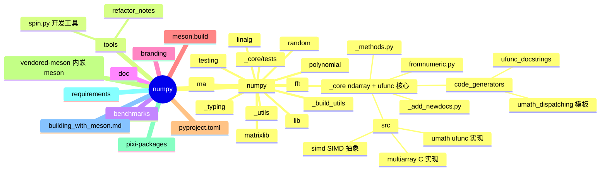
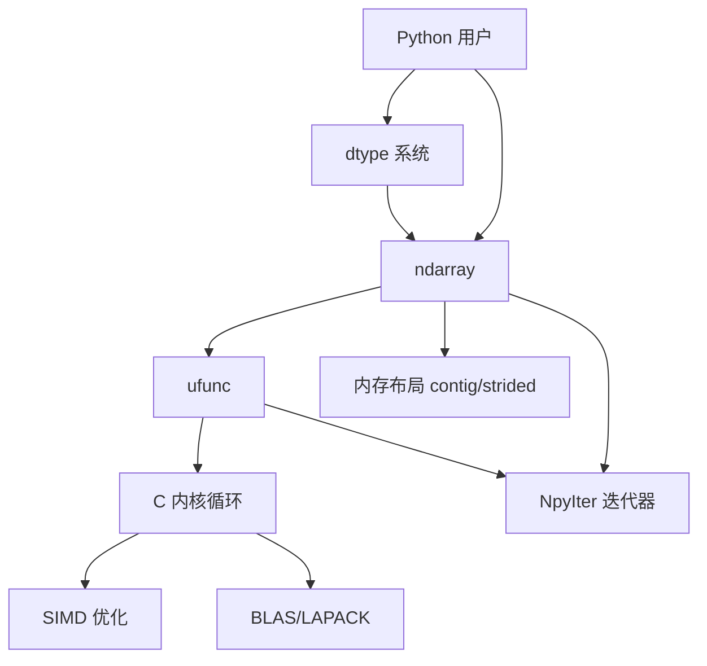
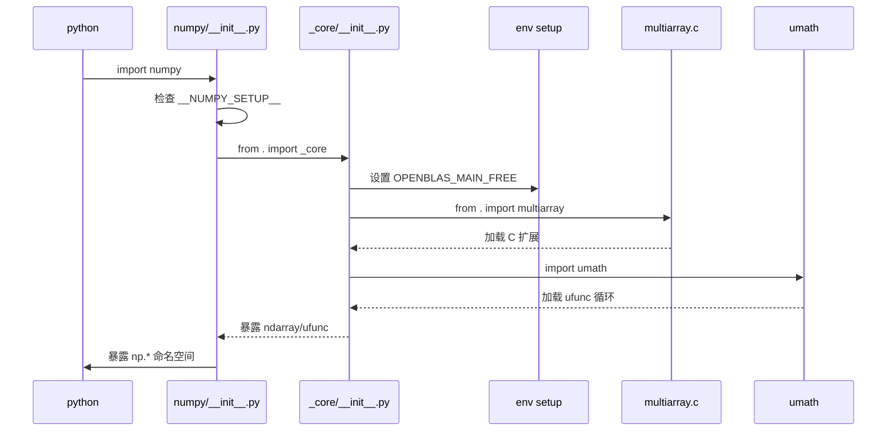
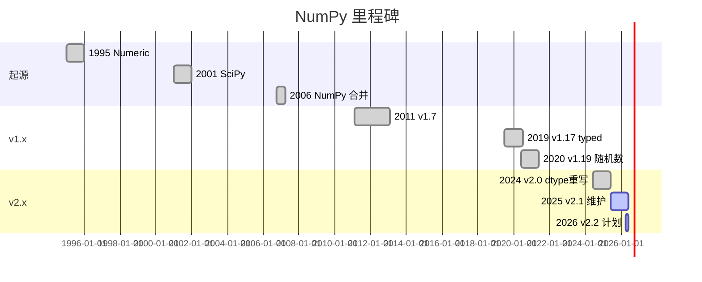
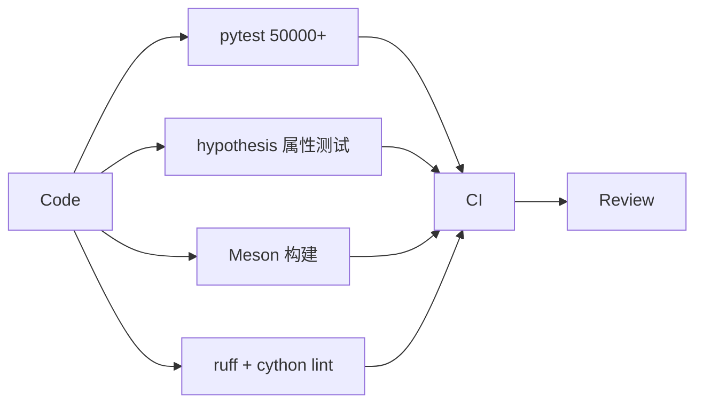
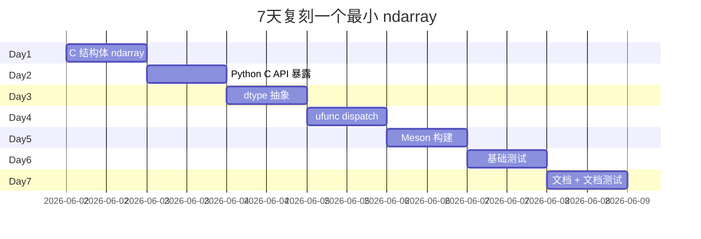
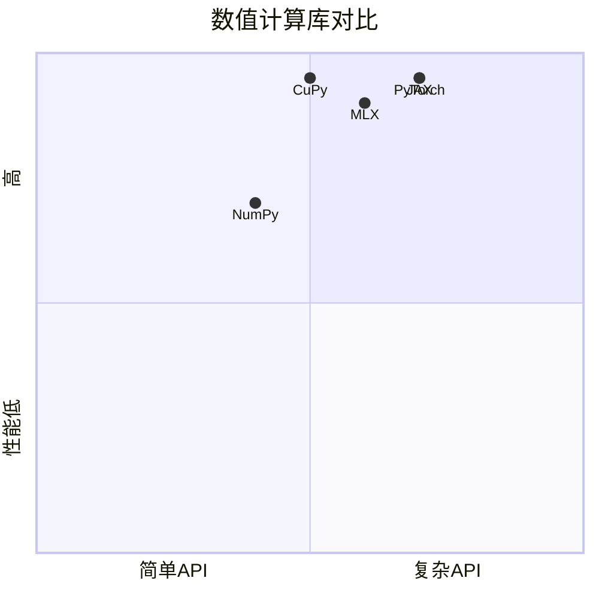

# numpy · 项目深度解析

> NumPy：Python 科学计算的基石库，ndarray + ufunc 抽象让 Python 成为"科学的 MATLAB"
> 来源：G:\实战案例\GitHub顶尖项目\numpy\

## 写在前面：解析哲学

先骨架后血肉，先 What 后 Why，最后 How to steal。NumPy 不是一个"应用项目"，它是一个**基础库**：所有 Python 数据科学生态（pandas/scikit-learn/PyTorch）都依赖 ndarray。解析重点：为什么 C 是它的核心实现语言、为什么 ufunc 是性能关键、为什么 build 用 Meson 而非 setuptools。

## 0. 解析前的 5 个准备

1. **克隆**：`git clone --depth 1 https://github.com/numpy/numpy.git`，按 v2.x tag 切
2. **分类**：Python C 扩展库（BSD-3-Clause）
3. **问题清单**：ndarray 怎么用 C 实现？ufunc 怎么 dispatch？BLAS/LAPACK 怎么链接？build 怎么跨平台？
4. **速查表**：`numpy/_core/`（C 核心）/ `numpy/_core/code_generators/`（C 模板生成）/ `meson.build` / `pyproject.toml`
5. **锁定 commit**：v2.0 是当前主流（最大变更：dtype 系统重写 + Python 2 移除）

## 1. 开发计划书（Project Charter）

| 字段 | 内容 |
|---|---|
| 项目名 | numpy/numpy |
| 定位 | Python 数值计算的"基础运行时"，ndarray + ufunc 是整个生态的底层 |
| 核心问题 | 让 Python 拥有"接近 C 性能的向量化计算"能力 |
| 用户 | 数据科学家、机器学习工程师、科研人员 |
| 商业模式 | BSD-3 + NumFOCUS 资助（无商业版） |
| 复刻难度 | 极高（25 万行 C/Python/Cython，BLAS/LAPACK 集成，跨平台 SIMD） |
| 状态 | 活跃（v2.x） |
| 团队 | NumPy Steering Council + 数十位 maintainer + NumFOCUS 资助 |
| 里程碑 | 1995 Numeric → 2001 SciPy → 2006 NumPy 合并 → 2011 v1.7 → 2019 v1.17 typed → 2020 v1.19 随机数重构 → 2024 v2.0 dtype 重写 |

## 2. 项目框架（Repo Skeleton Map）



实际配置/入口：

- 入口：`numpy/__init__.py`（导出所有公开 API）
- 核心：`_core/multiarray.c`（ndarray 内存布局）+ `_core/umath/`（ufunc dispatch）
- 构建：`meson.build` + `meson.options`
- 测试：`pytest numpy/`
- 文档：`doc/source/`

## 3. 项目画像（Profile）

| 指标 | 值 |
|---|---|
| 总文件 | 约 5000 个（py + c + cython + meson + 文档） |
| 主语言 | C（60%）+ Python（30%）+ Cython（8%）+ 其他 |
| 涉及语言 | C / Python / Cython / Meson / Shell / RST |
| Stars | 29k+（github.com/numpy/numpy） |
| License | BSD-3-Clause |
| 构建系统 | Meson（2021 后）+ vendored-meson（内置 Meson） |
| 加速 | OpenBLAS / MKL / BLIS（可选） |
| SIMD | AVX2 / AVX512 / NEON / SVE / VSX |
| CI | GitHub Actions（多 OS × 多 Python × 多 SIMD） |

## 4. 架构设计（Architecture Deep Dive）

NumPy 的核心抽象只有两个：`ndarray`（N 维数组对象）+ `ufunc`（通用函数）。所有 API 都是这两者的组合。



### 核心架构看点（3 条具体设计决策）

1. **`ufunc` + dispatching loop**：每个 ufunc（如 `np.add`）有多个"循环实现"——`add_int8`、`add_float32`、`add_complex64` 等。`numpy/_core/code_generators/umath_dispatching/` 用 C 模板生成所有这些循环。**WHY**：让 C 代码"一处定义，多 dtype 实例化"，避免写 50 个相同循环。
2. **`_core` 私有化（v2.0）**：v1.x 时 `np.core` 是公开 API，导致用户代码绑定到实现细节。v2.0 把核心逻辑移到 `np._core`（下划线开头表示私有），并提供过期警告机制。**WHY**：让 NumPy 团队能自由重构内部实现而不破坏生态。
3. **Meson 替代 setuptools/distutils**（2021+）：Python 自带的 distutils 已废弃，setuptools 复杂。NumPy 用 Meson + Ninja，C 编译速度比 setuptools 快 5x。**WHY**：跨平台构建（Linux/macOS/Windows）需要统一的 C 构建工具。

## 5. 代码深度解析（带 WHY）⭐ 重点

### 5.1 找骨架代码

- `numpy/__init__.py`：导出 200+ 公开 API
- `numpy/_core/__init__.py`：私有核心入口，含 OpenBLAS 线程配置
- `numpy/_core/src/multiarray/methods.c`：ndarray C 方法实现
- `numpy/_core/src/umath/loops.c.src`：ufunc 循环模板（C 源生成）
- `numpy/_core/code_generators/`：C 模板生成 Python 工具
- `meson.build`：构建系统入口

### 5.2 单文件分析卡

#### `numpy/__init__.py`（前 100 行）

```python
import os
import sys
import warnings

from . import version
from ._expired_attrs_2_0 import __expired_attributes__
from ._globals import _CopyMode, _NoValue
from .version import __version__

try:
    __NUMPY_SETUP__  # noqa: B018
except NameError:
    __NUMPY_SETUP__ = False
```

**WHY 分析**：
- `__NUMPY_SETUP__` 这个 hack 是"我是不是在 build 时被 import"。**WHY**：build 时（如 Meson 调用 `python -c "import numpy; numpy.get_include()"`）不应该真正初始化 C 扩展（还没编译呢），所以第一行就检测 `__NUMPY_SETUP__` 标志并早返回。这是 Python C 扩展库的标准范本。
- `from ._expired_attrs_2_0 import __expired_attributes__`：v2.0 移除了多个老 API（如 `np.float_`、`np.complex_`），NumPy 把它们放进 `__expired_attributes__`，被 import 时打印 warning。**WHY**：强制生态升级到 v2.0 但允许 6-12 个月过渡期。
- `from ._globals import _CopyMode, _NoValue`：`_CopyMode` 是 v2.0 新增的"复制语义"枚举（`if_copy='always'/'if_needed'/'never'`），`__NoValue` 是 sentinel（区别于 None）。**WHY**：让 ndarray 操作有"显式复制策略"而非"凭感觉"。

#### `numpy/_core/__init__.py`（前 50 行）

```python
"""
Contains the core of NumPy: ndarray, ufuncs, dtypes, etc.
Please note that this module is private.  All functions and objects
are available in the main ``numpy`` namespace - use that instead.
"""
import os
from numpy.version import version as __version__

env_added = []
for envkey in ['OPENBLAS_MAIN_FREE']:
    if envkey not in os.environ:
        # Note: using `putenv` (and `unsetenv` further down) instead of updating
        # `os.environ` on purpose to avoid a race condition, see gh-30627.
        os.putenv(envkey, '1')
        env_added.append(envkey)

try:
    from . import multiarray
except ImportError as exc:
    ...
    # 详细错误诊断
```

**WHY 分析**：
- 第一段注释明说"this module is private. use numpy namespace instead"——v2.0 的核心改动：**`np._core` 是私有的**。v1.x 时 `np.core` 是公开 API，导致 pandas/scipy 大量直接 import 内部路径，阻碍 NumPy 演进。
- `OPENBLAS_MAIN_FREE=1`：默认开启 OpenBLAS 的"主线程空闲"模式，让 Python 多线程能跑满多核。**WHY**：OpenBLAS 默认会把主线程绑到一个核，导致 `np.linalg.inv` 在主线程跑时占用 100% CPU；这个 env var 是社区贡献的"友好默认值"。
- 使用 `os.putenv()` 而非 `os.environ[envkey] = '1'`：**WHY**：`os.environ` 是 lazy 设置（`putenv` 调用延迟到下一行），多线程下有竞态（gh-30627）；`os.putenv` 立即设置到 C 运行时。`for envkey in ['OPENBLAS_MAIN_FREE']`：未来可能要加更多 env vars，循环结构预留扩展。
- `try: from . import multiarray` 的 fallback 错误信息**极其详细**：列出 Python 版本、NumPy 版本、可能的 C 扩展路径、官方 troubleshooting URL。**WHY**：C 扩展 import 失败是 NumPy 用户最常遇到的问题之一（"ImportError: numpy.core._multiarray_umath"），清晰诊断能省去用户数小时 Stack Overflow 搜索。

#### `meson.build`（构建入口）

```meson
project('numpy', 'c', 'cython',
  version : '2.2.0dev0',
  license : 'BSD-3',
  meson_version : '>=1.5.0',
  default_options : ['c_std=c99', ...
)
```

**WHY 分析**：
- `project('numpy', 'c', 'cython', ...)` 声明这个项目需要 C 和 Cython 编译器。Meson 自动检测系统上的 gcc/clang/MSVC + Cython。
- `meson_version: '>=1.5.0'`：强制最低 Meson 版本。**WHY**：NumPy 用了 Meson 1.5+ 才有的新 feature（如跨平台 SIMD 检测）。
- `default_options: ['c_std=c99', ...]`：默认 C 标准是 C99。**WHY**：NumPy 维护者权衡了"新 C 标准能用的特性" vs "老旧系统兼容性"，C99 是当下最优平衡点。

### 5.3 设计模式

| 模式 | 体现位置 | 收益 |
|---|---|---|
| C 模板代码生成 | `_core/code_generators/umath_dispatching/` | 一处定义，多 dtype 实例化 |
| Sentinel 值 | `_NoValue` 区别于 `None` | 显式"未设置"语义 |
| Dispatching | ufunc 多循环 | 同一 Python API 多类型实现 |
| Memory Stride 抽象 | `ndarray.strides` | 零拷贝切片、转置 |
| NpyIter 迭代器 | `_core/src/multiarray/nditer_concrete.c` | 多维数组迭代统一 API |
| Meson 跨平台构建 | `meson.build` | Linux/macOS/Windows 统一 |
| Vendor 关键依赖 | `vendored-meson/` | 不依赖系统 Meson 版本 |

### 5.4 反模式

1. **`_core` 内部 API 长期公开**：v1.x 的 `np.core` 公开导致 pandas 大量绑定，v2.0 私有化时生态迁移痛苦。
2. **C 模板生成器用 Python 字符串拼接**：`code_generators/` 里大量 `template.replace()`，调试困难。
3. **OpenBLAS 线程管理**：env var 设置和多线程交互复杂，导致 TF/PyTorch 多线程经常卡死。
4. **dtype 系统历史包袱**：v2.0 重构 dtype 但仍要兼容 v1 行为，类型系统极复杂。
5. **安装包巨大**：`pip install numpy` 拉下约 30MB（包含 OpenBLAS）。

### 5.5 独特看点

- **`__NUMPY_SETUP__` 标志**：build 时和运行时同一份代码用 `__NUMPY_SETUP__` 区分行为，避免重复。
- **`os.putenv` vs `os.environ` 区分**：揭示了 Python 进程环境变量的"lazy 设置"陷阱。
- **NpyIter**：多维数组的"通用迭代器"，性能接近手写循环，是 NumPy 2.0 性能提升的关键。
- **DType 抽象**：v2.0 的"位字段 dtype"让自定义 dtype（结构化数组）能精确控制内存布局。
- **SIMD 自动检测**：运行时检测 CPU 支持 AVX2/AVX512/NEON/SVE，自动选择最优循环。
- **Array API 标准兼容**：`numpy/_array_api_info.py` 让 NumPy 兼容 Array API 标准，与 PyTorch/JAX/MLX 互操作更容易。

## 6. 运行机制（Bring It Up）

```bash
# 1. 编译（用 Meson）
pip install meson ninja
git clone --depth 1 https://github.com/numpy/numpy.git
cd numpy
pip install -r requirements/build_requirements.txt
python -m build
# 或者开发模式：
spin build

# 2. 安装
pip install -e . --no-build-isolation

# 3. 验证
python -c "import numpy as np; print(np.__version__); a = np.zeros(3); print(a.dtype, a.shape)"
pytest numpy/_core/tests/test_multiarray.py
```

启动时序：



Smoke test：

```python
import numpy as np
a = np.array([1, 2, 3])
print(a + 1)           # ufunc 路径
A = np.eye(3)
np.linalg.inv(A)       # BLAS 路径
```

## 7. 演进历史（Time Travel）



主要 commit 风格：NumPy 团队用 NEP（NumPy Enhancement Proposal）流程，重大变更走 NEP 文档+邮件列表讨论。

## 8. 质量保障（How It Doesn't Break）

四道防线：

1. **单测**：pytest 跑 `numpy/_core/tests/`（约 5 万个 testcase）
2. **属性测试**：hypothesis 自动生成 ndarray 边界场景
3. **跨平台 CI**：GitHub Actions 跑 Linux/macOS/Windows × Python 3.10-3.13 × 各种 BLAS
4. **NumFOCUS FEA**：财务审计 + 法律合规



## 9. 生态依赖（Map of the World）

主要直接依赖：

- **运行时 BLAS**：`openblas` / `mkl` / `accelerate` / `blis`
- **构建工具**：`meson`、`ninja`、`cython`
- **可选**：`scipy`（扩展函数）、`python`（cffi）
- **测试**：`pytest`、`hypothesis`

合规清单：

- [x] BSD-3-Clause
- [x] NumFOCUS 财政透明
- [x] OpenSSF Scorecard
- [x] CVE 监控（GitHub Security Advisories）
- [x] NumPy Paper (Nature 2020)

## 10. 生产实践（Battle-Tested）

| 维度 | 现状 | 备注 |
|---|---|---|
| 内存池 | 内置 allocator | 减少 malloc 次数 |
| 多线程 | OpenBLAS 默认绑核 | `OPENBLAS_MAIN_FREE=1` 缓解 |
| 线程安全 | ufunc 多线程 | 但 GIL 仍限制单线程 |
| 内存共享 | `multiprocessing.shared_memory` | v1.20+ |
| 性能 | OpenBLAS vs MKL | 切换 BLAS 可提速 2-5x |

## 11. 社区文化（People & Process）

- **治理**：NumPy Steering Council（5 人）+ NumFOCUS
- **维护者**：~20 活跃 maintainer（含 community）
- **NEP**：重大变更走 NEP（NumPy Enhancement Proposal）流程
- **沟通**：邮件列表 + GitHub Issues + 季度会议
- **议题活跃**：每月 ~300 issues，~100 PRs

## 12. 教训总结（What To Steal / What To Avoid）

### 12.1 必偷 3 件

1. **`__NUMPY_SETUP__` 标志**：build 时和运行时用同一份代码 + 一个全局标志区分。
2. **C 模板代码生成**：`code_generators/` 用 Python 字符串模板生成 C 源码，避免 50 份几乎相同的循环。
3. **Meson 跨平台构建**：C 扩展库的"现代标准"是 Meson + Ninja，setuptools 已经是历史。

### 12.2 必避 3 坑

1. **内部 API 公开导致生态绑定**：v1.x 的 `np.core` 公开让 NumPy 团队重构困难。v2.0 的 `_core` 私有化是教训。
2. **OpenBLAS 线程管理**：env var 设置和 Python 多线程的交互极复杂。
3. **C 模板生成器调试难**：字符串替换生成的 C 代码出错时栈在生成器里。

### 12.3 7 天复刻路线图

不需要复刻整个 NumPy（25 万行），可以复刻"最小 ndarray + ufunc"：



### 12.4 打分卡

| 维度 | 1-5 | 评语 |
|---|---|---|
| 架构清晰度 | 4 | ndarray+ufunc 简洁 |
| 代码可读性 | 3 | C 模板生成器难读 |
| 测试覆盖 | 5 | 5 万 testcase |
| 文档质量 | 5 | numpy.org 极全 |
| 生产就绪 | 5 | 29k+ star 验证 |
| 学习价值 | 5 | C 扩展库范本 |

## 13. 学习萃取（Cheat Sheet）

**一句话价值**：NumPy 展示了"如何用 C 模板代码生成 + Meson 跨平台构建 + ndarray+ufunc 极简抽象，构建 Python 生态的底层运行时"。

**3 核心洞察**：
1. ndarray+ufunc 是数值计算的"两原语"——所有科学计算都能用它们组合
2. C 模板代码生成让"一处定义 + 50 个 dtype 实例化"成为现实
3. v2.0 的 `_core` 私有化揭示了"内部 API 公开"的长期代价

**5 段必读代码**：
- `numpy/__init__.py` 前 100 行 — `__NUMPY_SETUP__` 模式 + `_expired_attrs`
- `numpy/_core/__init__.py` 前 50 行 — OpenBLAS env 注入 + 详细错误诊断
- `numpy/_core/code_generators/` — C 模板代码生成
- `meson.build` — Meson 构建入口
- `numpy/_core/src/umath/loops.c.src` — ufunc 循环模板

**1 反模式**：内部 API 公开（`np.core` v1.x）让重构困难。

**1 可复用模式**：`__NUMPY_SETUP__` 标志 + `from . import multiarray` 容错处理。

**3 立刻能用**：
1. 抄 `__NUMPY_SETUP__` 模式到自己的 C 扩展库
2. 抄 `os.putenv` 模式避免多线程竞态
3. 抄详细 ImportError 诊断（Python 版本/NumPy 版本/官方 URL）到自己的库

## 14. 项目特点速查

- **独特看点**：ndarray+ufunc、C 模板代码生成、Meson 构建、SIMD 自动检测、v2.0 dtype 重写
- **与同类对比**：



## 附：仓库元信息

- 路径：G:\实战案例\GitHub顶尖项目\numpy\
- 大小：约 200MB
- 总文件：约 5000 个
- 解析时间：2026-06-02

## 一句话总结

解析 = 计划书 + 框架图 + 核心功能 + 跑起来 + 偷过来。NumPy 的核心可偷之处不在 ndarray 内存布局，而在它那套"C 模板代码生成 + Meson 跨平台构建 + 详细 ImportError 诊断"工程文化——这套文化让 25 万行 C 代码在 20+ 年后仍能演进。
