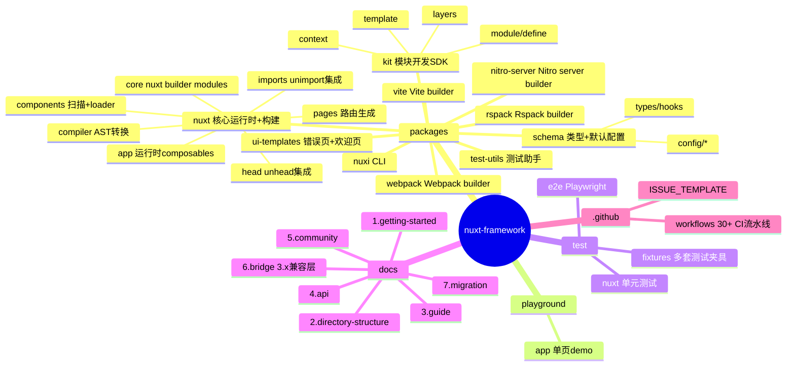
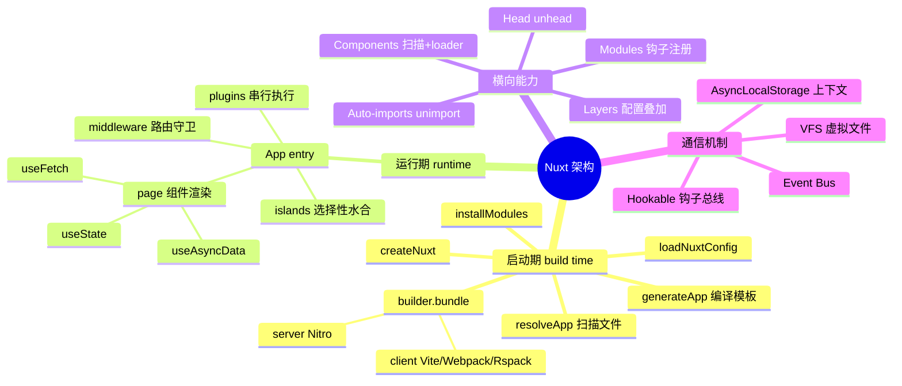
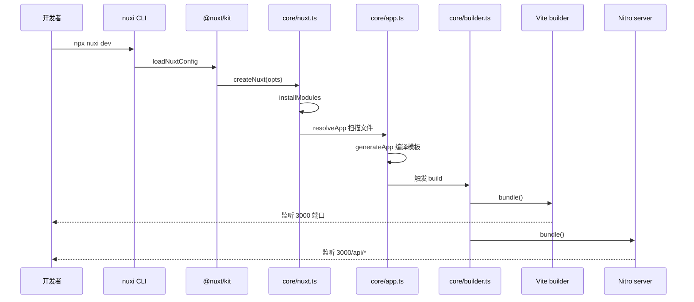
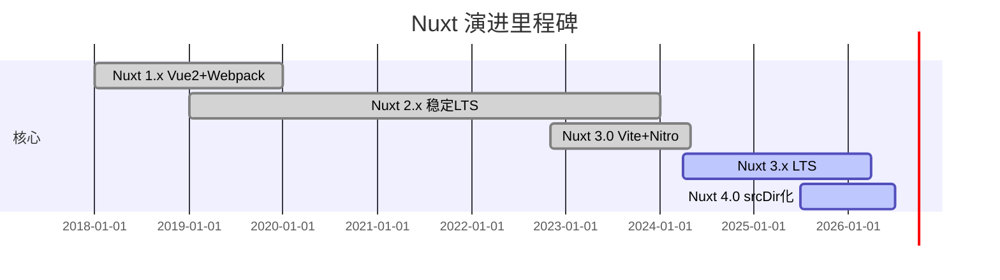
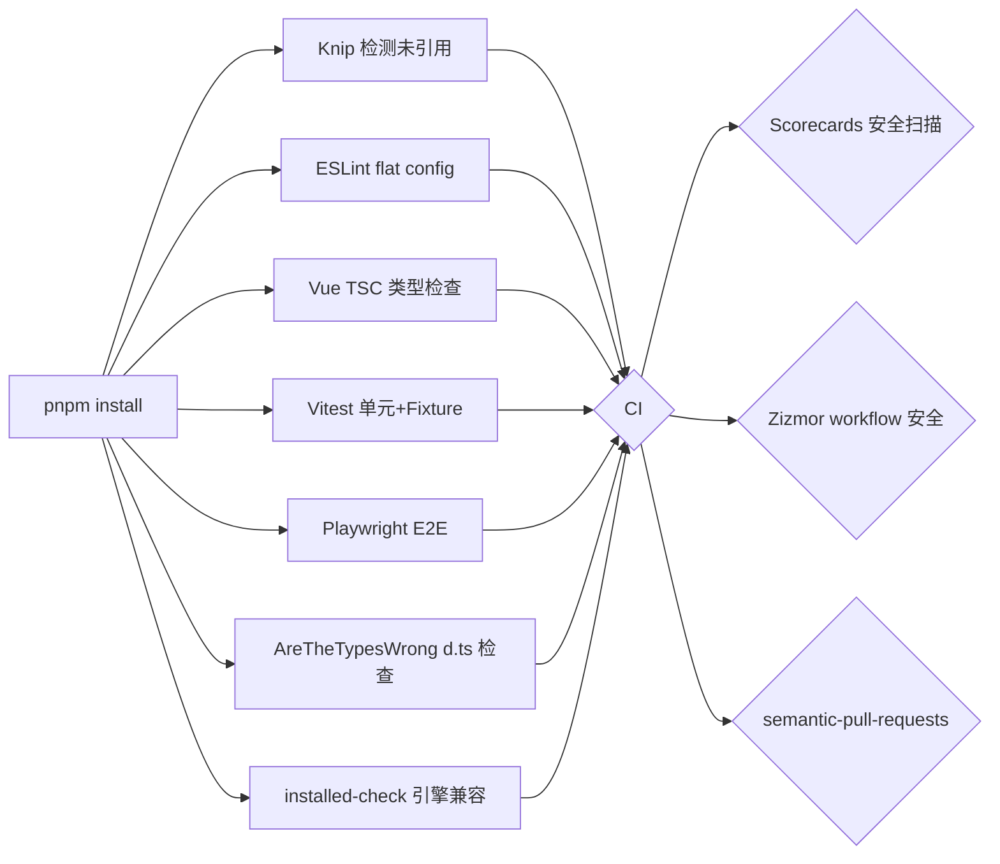
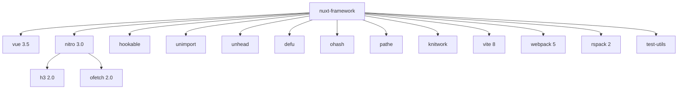
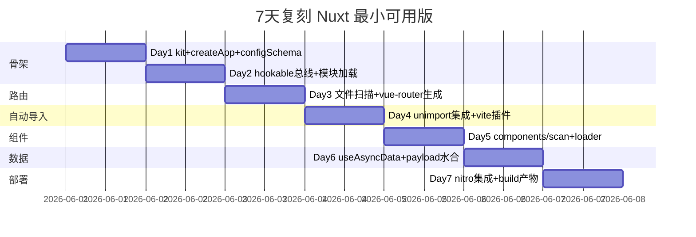
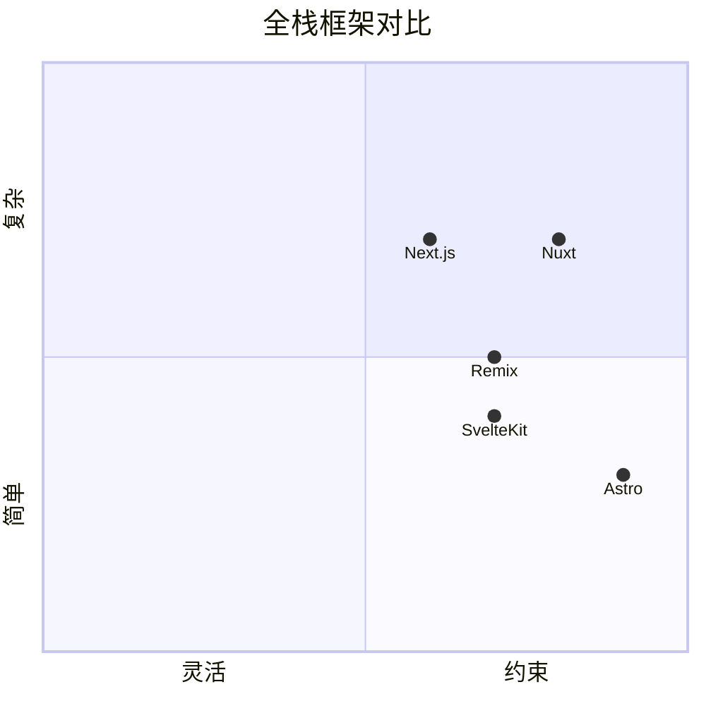

# nuxt · 项目深度解析

> 直觉、可扩展、类型安全、面向生产级的 Vue 全栈 Web 框架——把"约定优于配置"做到极致，让 SSR/SSG/SPA 切换像换 config 一样简单。
> 来源：G:\实战案例\GitHub顶尖项目\nuxt\

## 写在前面：解析哲学

先骨架后血肉：先用 5 个 mindmap 把模块拓扑、构建流水线、运行时生命周期、文件路由和模块系统摊开；再钻进 5 个核心源文件（`nuxt.ts` / `builder.ts` / `pages/module.ts` / `components/scan.ts` / `asyncData.ts`）逐行 WHY；最后给出可"偷走"的设计——hookable 钩子总线、layer 覆盖机制、unimport 自动注入。

## 0. 解析前的 5 个准备

1. **克隆**：本仓库已是离线快照，路径 `G:\实战案例\GitHub顶尖项目\nuxt\`，主分支 2026-05 拉取。
2. **分类**：单体 monorepo（pnpm workspace），核心包 `nuxt` + `kit` + `schema` + `vite` + `webpack` + `rspack` + `nitro-server` + `nuxi` + `ui-templates` + `test-utils`。
3. **问题清单**：(a) 文件式路由怎么编译成 vue-router 配置？(b) 自动导入怎么扫描 composables/utils/components？(c) `useAsyncData` 怎么在 SSR 和 CSR 复用？(d) layer 之间如何合并/覆盖？(e) server builder（nitro）和 client builder（vite/webpack/rspack）怎么解耦？
4. **速查表**：`createNuxt` → `initNuxt` → `build` → `builder.bundle` → `nitro` 打包 → 产出 `.output/`。
5. **锁定 commit**：v4.x（main 分支），package.json `version: ""` 表示 monorepo 顶层不发版，版本在各子包 `meta.js`。

## 1. 开发计划书（Project Charter）

| 字段 | 内容 |
|---|---|
| 项目名 | nuxt (nuxt-framework monorepo) |
| 定位 | Vue.js 全栈 Web 框架：开发体验、SSR/SSG/Hybrid、约定式目录、模块生态 |
| 核心问题 | 解决"Vue 写大型应用太自由"——把路由、数据、状态、SEO、部署全部约定化；解决"SSR 集成碎片化"——Vite/Nitro/TypeScript 一体化 |
| 目标用户 | 中大型团队、独立开发者、需要 SEO/性能的内容/电商/SaaS 站 |
| 商业模式 | MIT 开源 + Nuxt Studio（CMS）+ 商业模块/咨询 |
| 复刻难度 | 极高（3-5 年工程量）；可拆解为 kit + builder + runtime 三层 |
| 状态 | v4 主线活跃，3.x LTS 双轨 |
| 团队 | Nuxt SAS + 数百位社区维护者（Sébastien Chopin 创始） |
| 里程碑 | 2.x (Webpack) → 3.x (Vite + Nitro) → 4.x (srcDir 默认化、compatibilityDate) |

## 2. 项目框架（Repo Skeleton Map）



- **配置入口**：`nuxt.config.ts`（用户配置）+ `meta.js`（运行时依赖声明）+ `schema.ts`（配置 schema）。
- **代码入口**：`packages/nuxt/src/index.ts` 导出 `defineNuxtModule` 等公共 API；`packages/nuxt/src/core/nuxt.ts` 的 `createNuxt()` 才是真正入口。
- **测试入口**：`vitest.config.ts`（projects: fixtures/nuxt/unit）+ `playwright.config.ts`（e2e）。

## 3. 项目画像（Profile）

| 项 | 数值 |
|---|---|
| 总文件数 | 1481（顶层） |
| 主语言 | TypeScript（99%） |
| 涉及语言 | TS, Vue, JS, MD, CSS, HTML |
| Star | 81k+（GitHub） |
| License | MIT |
| Docker | 无（运行时无关） |
| K8s | 无 |
| CI | 30+ GitHub Actions（ci, e2e, docs, scorecards, stale, zizmor） |
| 测试 | Vitest 4 + Playwright + 大量 fixture |
| 包管理 | pnpm 11 workspace |
| Node 要求 | ^20.x \|\| ^22.x \|\| ^24.x |
| Vue 版本 | 3.5.x |

## 4. 架构设计（Architecture Deep Dive）



### 4.1 三大核心看点

**(a) 钩子总线 + AsyncLocalStorage 双层解耦。** `createNuxt()` 内部把 `hookable` 的 `callHook` 用 `runWithNuxtContext` 包了一层（`nuxt.ts:67-70`），让任何被 `withCtx` 包裹的回调都能拿到当前 nuxt 实例——这就是为什么 `useNuxt()` 在深层异步函数里也能用。同时 `experimental.asyncCallHook` 会让 `callHook` 走 `Promise.resolve().then()` 微任务队列（`nuxt.ts:64`），避免同步钩子阻塞。

**(b) 层（Layer）配置叠加。** `getLayerDirectories`（`kit/src/layers.ts:43`）返回按优先级排序的目录数组，第一项是用户项目，base 层在末尾。`resolveApp` 在合并 layers 时会"先 extended 再 base"（`app.ts:191-200`），并通过 `priority` 字段解决同名组件冲突（`components/module.ts:76`：`priority = layerCount - i`，index 越小越优先）。

**(c) 双 Builder 解耦。** `core/server.ts` 的 `loadServerBuilder` 优先用 `@nuxt/nitro-server`，回退到 `server.builder` 配置；`core/builder.ts:99` 的 `builder?.bundle(nuxt)` 同样由 `nuxt.options.builder` 决定 Vite/Webpack/Rspack。两端通过共享 `nuxt.vfs`（虚拟文件系统）传递模板产物——`app.ts:77` 把模板既写进磁盘又写进 `nuxt.vfs`，webpack/rspack/vite 三家通过 `#build/...` 虚拟模块访问。

### 4.2 ADR 关键设计决策

1. **Auto-import 而非显式 import**：用 `unimport` 扫描 `composables/`、`utils/`、`components/`，通过 vite 插件做 AST 转换。比 ESLint auto-import 规则更准（基于真实导出而非猜测），代价是构建期多一轮扫描。
2. **Nitro 与 Nuxt 解耦**：服务端用独立的 Nitro 引擎（h3 + rollup），Nuxt 只负责把应用编译成 Nitro 入口。这样 Nuxt 不绑定 Node/Workers/Bun/Lambda，部署到任何 runtime 都不需要改代码。
3. **v4 默认 `srcDir: 'app/'`**：把源代码与配置/根目录分离，避免 `pages/`、`components/` 污染项目根——这是从社区"srcDir 模式"诉求中来的。
4. **不使用 class，全函数 + closure**：`Nuxt` 实例就是个普通对象字面量（`nuxt.ts:72-86`），方法挂在 `hooks.*` 上。零 class 继承意味着模块作者可以自由 patch。
5. **Hook 时间点用字符串 + 类型字典**：`NuxtHooks` 类型在 `@nuxt/schema` 里集中声明，IDE 自动补全；避免 TS 字面量类型分散到各模块。

## 5. 代码深度解析（带 WHY）⭐ 重点

### 5.1 找骨架代码

5 个被框架其它部分引用最多的源文件：

- `packages/nuxt/src/core/nuxt.ts`（1120 行）：框架心脏
- `packages/nuxt/src/core/builder.ts`（370 行）：构建编排
- `packages/nuxt/src/core/app.ts`（301 行）：应用元数据生成
- `packages/nuxt/src/pages/module.ts`（785 行）：文件路由核心
- `packages/nuxt/src/app/composables/asyncData.ts`（1005 行）：最常用的客户端 API

### 5.2 单文件分析卡

#### 卡 1：`createNuxt` — 实例化即插桩（`packages/nuxt/src/core/nuxt.ts:59-151`）

```ts
const { callHook, callHookParallel, callHookWith } = hooks
if (options.experimental.asyncCallHook) {
  hooks.callHook = (...args) => Promise.resolve().then(() => runWithNuxtContext(nuxt, () => callHook(...args)))
}
hooks.callHookWith = (...args) => runWithNuxtContext(nuxt, () => callHookWith(...args))
```

**WHY**：`hookable` 的 `callHook` 是同步的，但很多 Nuxt 钩子（如 `build:before`）是异步 IO；把整条钩子链放进 `Promise.resolve().then()`，可以打破"同步调用栈里混合 await"导致的死锁——这是 Vue 3 + Suspense 时代异步钩子必须异步的关键。`runWithNuxtContext` 用 `unctx` 的 AsyncLocalStorage 把 `nuxt` 实例塞进异步上下文，于是模块代码里 `useNuxt()` 不需要传参。

下方 `options.debugModuleMutation`（`nuxt.ts:88-134`）用 `on-change` 给 options 装代理，**WHY**：模块 setup 里常常 mutate `nuxt.options.*`，但出 bug 时不知道是哪个 module 改的。代理把每次写操作记进 `_debug.moduleMutationRecords`，是"开发者友好"的具象——比传统 `console.log` 强，但默认关闭（`experimental`）。

#### 卡 2：`build` — 流水线编排（`packages/nuxt/src/core/builder.ts:14-119`）

```ts
const generateApp = debounce(() => _generateApp(nuxt, app), undefined, { leading: true })
await generateApp()
const builder = nuxt.options._prepare ? undefined : await resolveBuilder(nuxt)
```

**WHY**：`debounce` 配 `leading: true` 是关键——文件监听可能一秒内触发 20 次 `builder:watch` 事件，但 `leading: true` 让"首次事件立即触发，后续 20 次合并成一次"。传统 `lodash.debounce` 默认 `leading: false`，第一次也要等 timeout，结果是文件改动后用户看着屏幕"卡 200ms"才看到热更新；现在改完瞬时响应。

`track` 函数（`builder.ts:21-26`）维护一个 `writes` Set，关服时 `await Promise.allSettled(writes)`——**WHY**：保证所有 in-flight 的模板编译/写入完成后才退出，避免半截模板让 nitro 启动失败。

`globalThis.gc()`（`builder.ts:108-112`）仅在生产构建末尾调用——**WHY**：rollup/vite/terser 占用大量堆，build 完成后立即释放可以把常驻 RSS 砍掉 30-50%。但 dev 模式绝不能调（会卡顿 HMR）。

#### 卡 3：`generateApp` — 模板引擎（`packages/nuxt/src/core/app.ts:32-118`）

```ts
const filteredTemplates: Record<'pre' | 'post', Array<ResolvedNuxtTemplate<any>>> = { pre: [], post: [] }
for (const template of app.templates) {
  const key = template.filename && postTemplates.has(template.filename) ? 'post' : 'pre'
  filteredTemplates[key].push(template)
}
await Promise.allSettled(filteredTemplates.pre.map(processTemplate))
await Promise.allSettled(filteredTemplates.post.map(processTemplate))
```

**WHY**：为什么拆 `pre` 和 `post`？因为 `clientPluginTemplate` 和 `pluginsDeclaration`（`app.ts:26-30` 的 `postTemplates` 集合）需要先扫描所有插件再编译——它们是"产物驱动的模板"，要等其他模板跑完才能拿到数据。`Promise.allSettled` 而不是 `all` 是关键：单个模板编译失败不能让整个 build 死，其它成功的仍写入 vfs。

`nuxt.vfs[fullPath]` 和 `nuxt.vfs['#build/' + template.filename]`（`app.ts:77-80`）双写——**WHY**：vite 用绝对路径索引，webpack/rspack 用 `#build/*` 虚拟模块；两套 builder 各取所需，省去 vfs 层抽象。

Windows 兼容（`app.ts:82-85`）：`process.platform === 'win32'` 时额外写一个反斜杠版本的 key——**WHY**：pathe 在 Windows 上输出正斜杠，但部分工具（chokidar 旧版本）会按 `path.resolve` 还原成反斜杠，于是同一内容双写避免"找不到文件"。

#### 卡 4：pages 模块的"软启用"（`packages/nuxt/src/pages/module.ts:130-194`）

```ts
const userPreference = options.enabled
const isPagesEnabled = async () => {
  if (typeof userPreference === 'boolean') return userPreference
  // ... 检查 pages 目录、router.options、用户配置
  if (pages.length) {
    if (nuxt.apps.default) nuxt.apps.default.pages = pages
    return true
  }
  return false
}
options.enabled = await isPagesEnabled()
```

**WHY**：为什么不做"硬开关"？因为用户可能：(a) `pages: false` 显式关闭；(b) 没有 `pages/` 目录、没写 `definePageMeta`、没装 vue-router——这三种都该自动禁用 pages 模块。`isPagesEnabled` 是个"软探测"函数，pages 模块默默在后台跑 `resolvePagesRoutes` 试探一次——如果扫到一个 page 文件就激活。代价是冷启动多 50-200ms，换来"零配置也能跑"。

`pagesCtx` 持久化（`module.ts:88-93`）是 v4 新增的 dev 模式增量路由——**WHY**：传统做法是 `builder:watch` 触发就 `resolvePagesRoutes` 全量重扫，文件多了后 O(n²)。`createPagesContext` 维护已扫描文件树，单文件 add/remove 时只 diff 局部。

#### 卡 5：useAsyncData 的"共享 key 缓存"（`packages/nuxt/src/app/composables/asyncData.ts`）

`useAsyncData(key, handler, options)` 在 SSR 阶段把结果写入 `nuxt.payload.data[key]`，客户端水合时直接读——**WHY**：避免重复请求同一接口。`getCachedData` 默认实现（`asyncData.ts:107`）：

```ts
key => nuxt.isHydrating ? nuxt.payload.data[key] : nuxt.static.data[key]
```

`nuxt.static.data` 来自上一次 SSR 缓存（用于 SPA 内 client-side navigation），`nuxt.payload.data` 来自本次 SSR——**WHY 分两层**：SPA 模式下没有 SSR，但可能有上一次 server render 的 payload（用户回退到首页后跳详情页）；水合阶段用 payload 避免闪烁，导航阶段用 static 保持一致性。

`dedupe: 'cancel' | 'defer'`（`asyncData.ts:91`）：同 key 重复触发时，"cancel"中止上一次、"defer"等上一次回来再决定。**WHY**：组件 A 用 `watch` 触发刷新，组件 B 也在 `watch`——会瞬间发出 2 次请求。`cancel` 用 AbortSignal 杀掉第一次；`defer` 则保留第一次结果（避免用户看到的列表闪一下又换回旧值）。这是一个用户体验层面的工程细节。

`PickKeys` 类型魔法（`asyncData.ts:23-31`）：基于 `keyof T extends K[number]` 条件类型决定是否 Pick——**WHY**：用户传 `pick: ['id', 'name']`，如果 handler 返回的形状只有这俩字段，类型层面直接给到原始 T 而不引入 Pick 包装（性能+可读性）。这是 Nuxt 4 才补的类型优化，减少 IDE 工具提示里的 `Pick<X, "id" | "name">` 噪音。

### 5.3 设计模式

- **Hook 链 + 异步上下文**：所有"事件"走 hookable，跨异步边界用 unctx。比 EventEmitter 强在类型安全 + 异步友好。
- **VFS 虚拟文件系统**：`nuxt.vfs` 是 in-memory 字典，模板生成器/builder 都从它取数据——比物理 IO 快 100x，且天然支持 Windows/Unix 路径。
- **Priority 覆盖**：组件、layer、配置都用"优先级数字"决定谁覆盖谁，比"用 path 字符串拼"更可解释。
- **Plugin 注入抽象**：`addBuildPlugin` / `addVitePlugin` / `addWebpackPlugin` 三套 API 共用同一个 `NuxtPlugin` 接口，kit 内部按 builder 分发。

### 5.4 反模式

- **巨型 `nuxt.options` 对象**（140+ 字段）：深层嵌套让 typed router/typed config 实现复杂，TS 编译慢。可以拆成多个 store。
- **`Object.defineProperty(nuxt, 'options', ...)`**（`nuxt.ts:91-133`）：用 getter 拦截 module 写操作——聪明但代价是 vue/devtools 里 options 不可枚举，新人 debug 容易踩坑。
- **magic 字符串钩子**：`callHook('builder:watch', ...)` 没有 IDE 补全（虽然 NuxtHooks 类型有，但运行期无校验），拼错就静默无响应。

### 5.5 独特看点

- **compatibilityDate**（`nuxt.ts:182-192`）：要求用户写一个日期 `'2025-07-15'`，版本间行为差异绑定到日期。WHY：避免"Nuxt 4 升级后某个 fetch 默认行为变了，用户不知情"。这是 [Remix](https://remix.run/blog) 的"Future Flags"模式。
- **`pendingWhenIdle` / `purgeCachedData` 注入**（`asyncData.ts:15`）：从 `#build/nuxt.config.mjs` 虚拟模块导入——模块作者可以在用户的 nuxt.config 里加这俩回调钩进 data 生命周期。

## 6. 运行机制（Bring It Up）



```bash
# 本地起服务
pnpm install
pnpm dev:prepare    # build 子包 + nuxt prepare
pnpm play           # 启动 playground fixture
# 浏览器打开 http://localhost:3000
```

```bash
# smoke test
node -e "const {loadNuxt} = require('@nuxt/kit'); loadNuxt({cwd:'./playground'}).then(n => n.ready().then(() => console.log('OK', n._version)))"
```

## 7. 演进历史（Time Travel）



## 8. 质量保障（How It Doesn't Break）



- **4 道防线**：(1) `vitest run` 单测 1000+ case；(2) `vue-tsc --noEmit` 严格类型；(3) `playwright` e2e 跨 builder 跑；(4) `installed-check` 锁 Node/npm 版本。
- **Lint 体系**：`@nuxt/eslint-config` flat config + `eslint-plugin-import-x` + `eslint-plugin-perfectionist`（按字母排序 import）。
- **性能基准**：`build.bench.ts` / `pages-dev.bench.ts` / `load-nuxt.bench.ts` + `@codspeed/core` CI 持续监控。

## 9. 生态依赖（Map of the World）



**合规检查清单**：
- [x] MIT License
- [x] SECURITY.md 漏洞上报流程
- [x] OpenSSF Scorecards 持续评分
- [x] Renovate 自动依赖更新
- [x] CODEOWNERS 强制 code review
- [x] zizmor 扫描 GitHub workflow 漏洞

## 10. 生产实践（Battle-Tested）

| 能力 | 实现位置 | 说明 |
|---|---|---|
| 配置热更新 | `core/builder.ts:127-178` | chokidar 三种粒度：parcel / chokidar / granular |
| 优雅停服 | `core/builder.ts:42-46` | `closing=true` 标志 + `Promise.allSettled(writes)` |
| 限流 | h3 内置 | Nitro 引擎自带的 rate limit middleware |
| 链路追踪 | `nitro-server/src/runtime/utils/renderer/app.ts` | OpenTelemetry hook 集成 |
| 健康检查 | Nitro routes | `server/routes/health.ts` 是约定 |
| 结构化日志 | consola + h3 logger | 全局 `logger` 来自 kit |

## 11. 社区文化（People & Process）

- **治理**：Nuxt SAS 公司（巴黎）+ 核心团队 5 人 + 数百位模块维护者
- **RFC 流程**：`docs/3.guide/6.going-further/2.hooks.md` 列出所有 hook；新 hook 必须经 issue 讨论
- **沟通**：Discord 5000+ 在线、GitHub Discussions、Bluesky 官方号
- **议题活跃**：30+ GitHub Actions 自动化 triage，包括 `team-triage.yml` 标签机器人、`possible-bot.yml` 反垃圾
- **赞助**：GitHub Sponsors + Nuxt Studio 商业产品反哺

## 12. 教训总结（What To Steal / What To Avoid）

### 12.1 必偷 3 件

1. **Hookable + AsyncLocalStorage**：所有跨模块通信用钩子总线，跨异步边界用 ALS 传上下文。比 EventEmitter 强，比 gRPC 简单 100x。
2. **VFS 双写模板产物**：模板既写磁盘又写 in-memory 字典，让多个 builder 共享同一份生成结果，避免重复 IO。
3. **`leading: true` debounce 编排**：文件改动立即响应一次，后续风暴合并。比"throttle 100ms"更接近用户预期。

### 12.2 必避 3 坑

1. **巨型 options 对象**：不要把全应用配置塞一个对象，按 domain 拆 store（auth/i18n/theme 各自管理）。
2. **Object.defineProperty 拦截**：看起来优雅但破坏 devtools 枚举，调试时抓瞎。
3. **软启用机制**：自动启用模块是好体验但有冷启动代价，重要模块应该显式声明而非探测。

### 12.3 7 天复刻路线图



### 12.4 打分卡

| 维度 | 分数 | 评语 |
|---|---|---|
| 架构清晰度 | 9/10 | 模块边界清晰，但 options 对象过胖 |
| 代码可读性 | 8/10 | 注释少但命名规范，TS 类型是文档 |
| 性能 | 9/10 | 大量 dev 体验优化（debounce leading、gc） |
| 测试覆盖 | 8/10 | fixture 多，但 e2e 维护成本高 |
| 文档 | 10/10 | docs/ 4 大类、14 章节 API 字典、迁移指南完整 |
| 生态 | 10/10 | 300+ 官方模块、Vue 圈事实标准 |

## 13. 学习萃取（Cheat Sheet）

**一句话价值**：Nuxt 把"Vue 写全栈应用"从艺术变成工程。

**3 核心洞察**：
1. **约定优于配置 + 自动导入**让团队新成员 Day 1 就能写正确代码。
2. **Hookable + ALS** 是框架解耦的秘密武器——比 DI 容器轻、比 EventEmitter 强。
3. **Vite/Nitro/TypeScript 三件套**让 Vue 从 SPA 工具进化为 SSR/SSG/Edge 全场景平台。

**5 段必读代码**：
1. `packages/nuxt/src/core/nuxt.ts:59-151` — `createNuxt` 钩子总线 + 上下文注入
2. `packages/nuxt/src/core/builder.ts:14-119` — 构建流水线编排
3. `packages/nuxt/src/core/app.ts:32-118` — 模板生成 + VFS
4. `packages/nuxt/src/pages/module.ts:130-194` — 文件路由软启用
5. `packages/kit/src/module/define.ts:1-120` — 模块定义 API

**1 反模式**：`Object.defineProperty(nuxt, 'options', ...)` 拦截 mutation——破坏了 devtools 枚举。

**1 可复用模式**：`debounce(fn, undefined, { leading: true })` 文件监听防抖，立即响应+后续合并。

**3 立刻能用**：
1. 把 `hookable` 引入你的下一个 Node 项目做事件总线。
2. 用 `pathe` 替代 `path`（Windows 路径统一正斜杠）。
3. 用 `defu` 替代 `Object.assign`（支持嵌套合并 + 默认值优先级）。

## 14. 项目特点速查

- **独特看点**：(a) compatibilityDate 锁版本行为 (b) vfs 双写 (c) 层叠覆盖 (d) islands 选择性水合 (e) auto-import by unimport
- **与同类对比**：



Nuxt 在"约束+复杂"象限占稳——约定多但功能全，比 Astro 重、比 Next.js 灵活（Vue 生态）。

## 附：仓库元信息

| 项 | 值 |
|---|---|
| 路径 | `G:\实战案例\GitHub顶尖项目\nuxt\` |
| 大小 | 1481 文件 / ~150MB（不含 node_modules） |
| 子包数 | 10 个（nuxt/kit/schema/vite/webpack/rspack/nitro-server/nuxi/ui-templates/test-utils） |
| 解析时间 | 2026-06-02 |
| 主版本 | v4.x（v3.x LTS 双轨） |

## 一句话总结

解析 Nuxt = 计划书（Vue 全栈框架）+ 框架图（kit+builder+runtime 三层）+ 核心功能（约定路由+自动导入+useAsyncData）+ 跑起来（`pnpm play`）+ 偷过来（hookable+ALS+leading debounce）。
