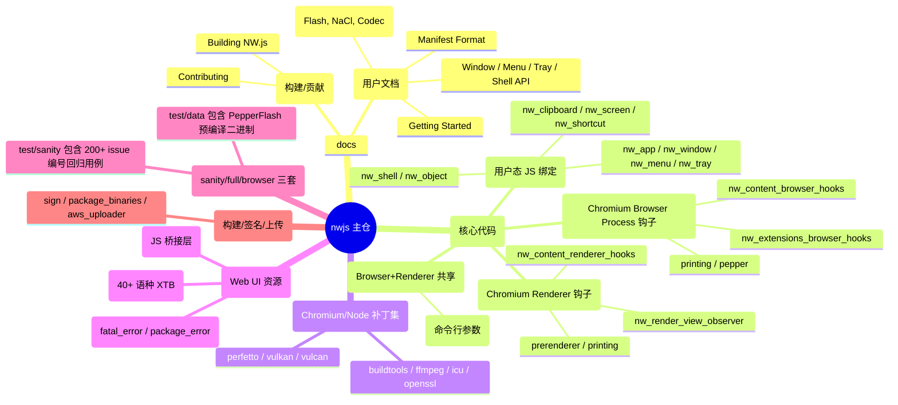
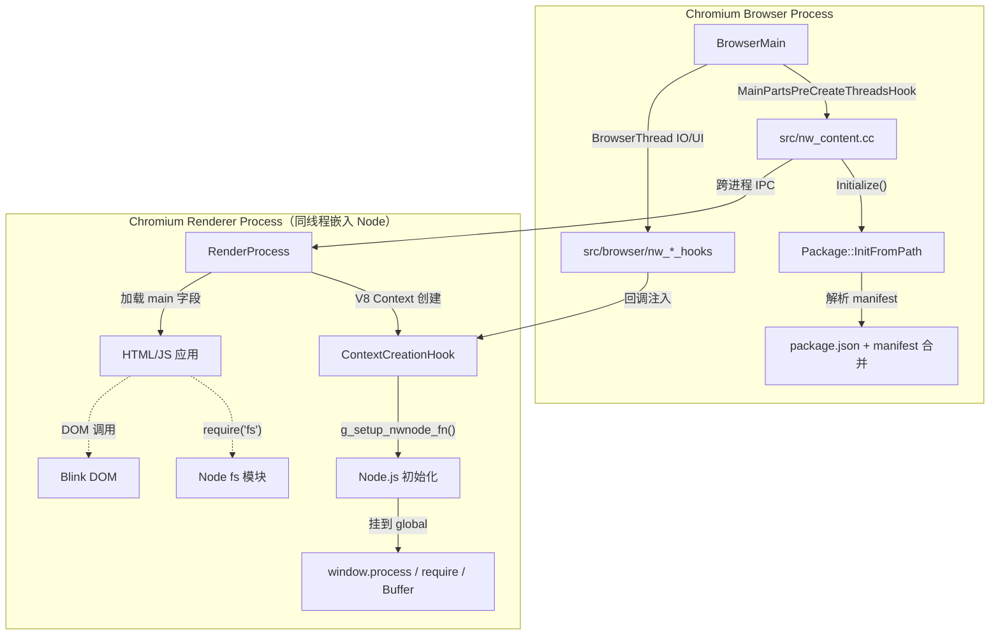
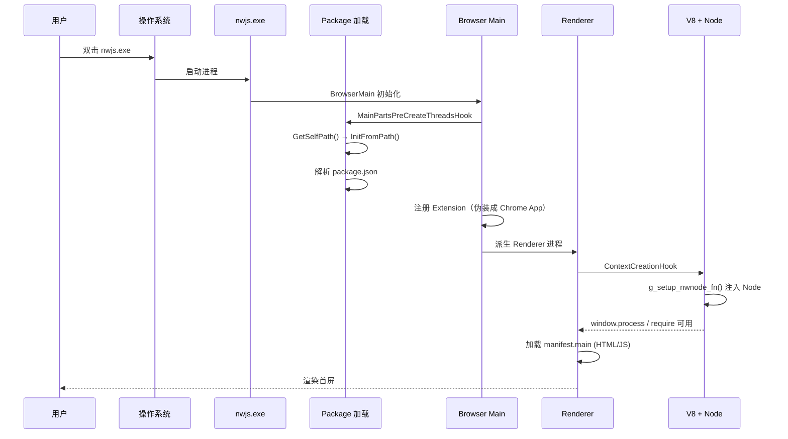
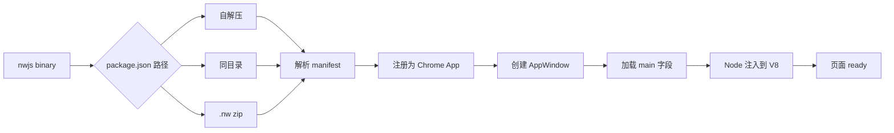
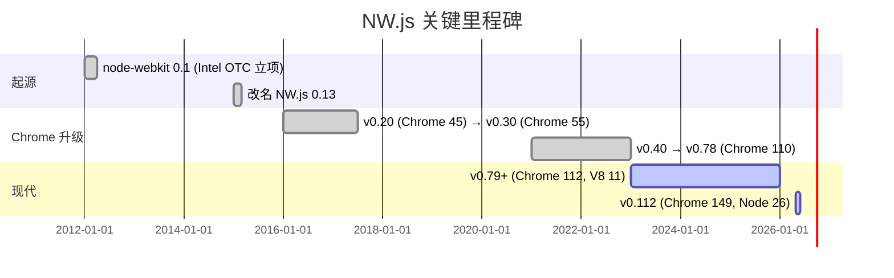
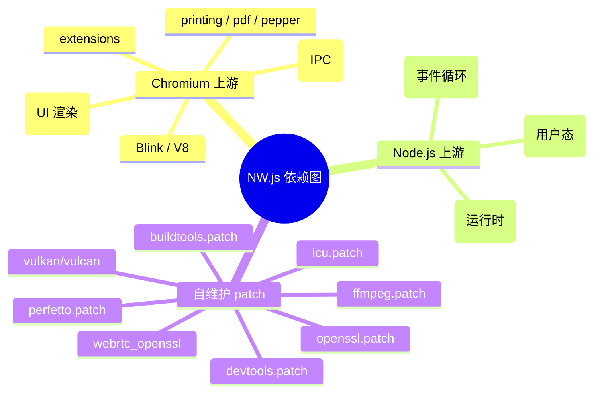
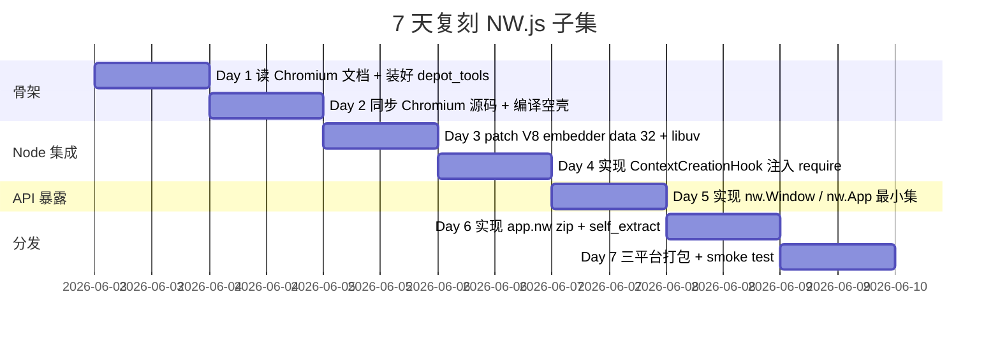
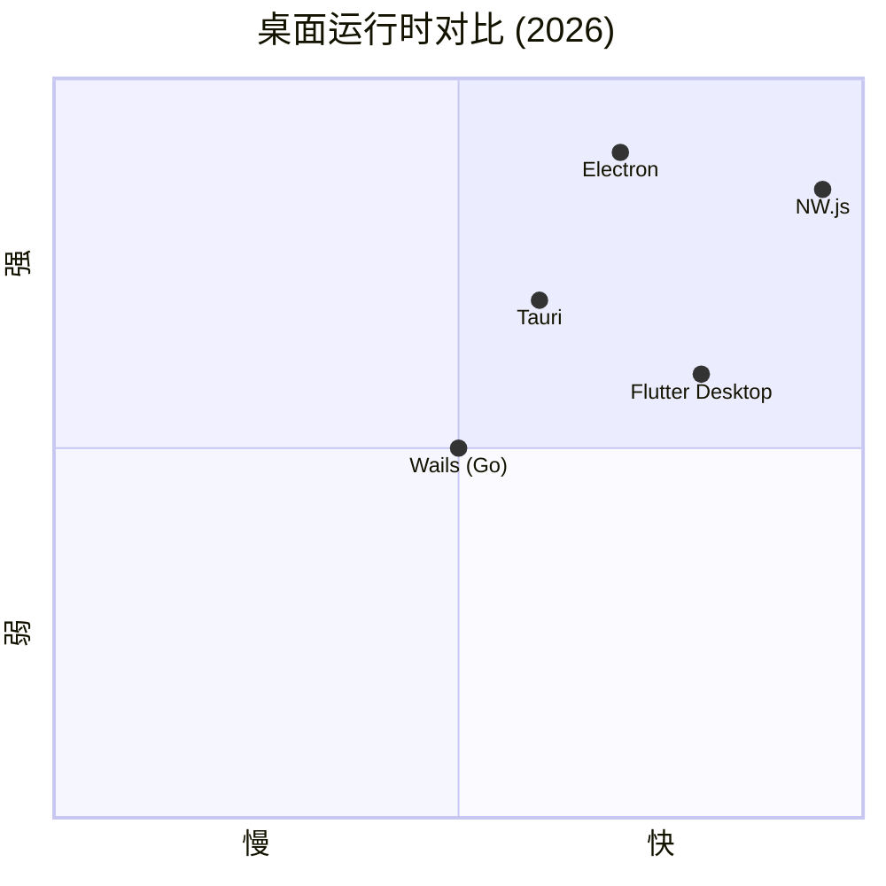

# nwjs · 项目深度解析

> 基于 Chromium + Node.js 的桌面应用运行时，让 Web 技术（HTML/JS/CSS）直接写出可分发的原生桌面 App。
> 来源：G:\实战案例\GitHub顶尖项目\nwjs\

## 写在前面：解析哲学

骨架 → 血肉 → Why → How to steal。本笔记先抽离 NW.js 的工程骨架（src/api + src/browser + src/renderer + src/common 四象限），再回到每一段 C++/JS 代码背后的设计动机——它和 Electron 一样起源于"渲染进程 + 主进程"双轨架构，但 NW.js 走了一条更激进的路线：把 Node.js **直接编译进 Blink/V8 同一线程的 renderer 进程**，让 `window` 对象天然持有 `require`、`process`、`Buffer`。这种"同栈同线程"的设计决策贯穿了所有钩子（hook）文件，是理解本项目的钥匙。

## 0. 解析前的 5 个准备

1. **克隆**：本仓库 `nwjs/nw.js` 是 issue + 部分源码主仓；运行时核心 `node-webkit` 已迁移到 `node-web-kit` 子目录（`src/`）。
2. **分类**：运行时（runtime）/ SDK 构建系统 / 用户态 API 三件套；本次聚焦 `src/` 内核。
3. **问题清单**：
   - Web 与 Node 的 V8 Isolate 怎么打通？
   - 多窗口（AppWindow）如何在 Chromium 的 Extension 体系上"伪装"成 Chrome App？
   - `package.json` 如何替代 `manifest.json`？自定义入口怎么注入到 V8？
4. **速查表**：`src/nw_content.{h,cc}` 是核心钩子头；`src/api/nw_*.cc` 是绑定到 JS 的 extension function；`src/resources/api_nw_*.js` 是 JS 端桥接层；`src/broker/nw_*_hooks.cc` 是 Chromium 浏览器侧回调。
5. **锁定 commit**：当前为 v0.112.0（2026-05-24，Chromium 149 + Node.js v26.1.0）。

## 1. 开发计划书（Project Charter）

| 字段 | 内容 |
|------|------|
| 项目名 | nwjs（原名 node-webkit，2015 改名） |
| 定位 | 把 Chromium + Node.js 合并为单一可执行文件，让 Web App 即桌面 App |
| 核心问题 | Web 沙箱无法直接访问 OS 资源（文件系统、子进程、剪贴板、系统托盘），且 Web 线程与 Node 线程割裂导致 `require` 不到原生模块 |
| 目标用户 | 跨平台桌面应用开发者（如 Popcorn Time、WhatsApp Desktop 早期、Facebook Messenger 桌面版） |
| 商业模式 | BSD-3 开源；提供 Pre-built 二进制下载；企业无差别免费 |
| 复刻难度 | ★★★★★（需要持续跟进 Chromium/Node 双上游版本，2026 每年至少 6 个大版本） |
| 当前状态 | 持续维护，每月 1-2 个 release，2026 已发 v0.112.0 |
| 核心团队 | Roger Wang（Intel 开源中心创始）、zcbenz（现 Electron 核心 maintainer）、社区 100+ 贡献者 |
| 里程碑 | 0.1 (2012)→0.13 (2015, Node-Webkit 改名 NW.js)→0.32 (2018, SHA256 校验)→0.78 (2023, Chrome 110)→0.112 (2026, Chrome 149) |

## 2. 项目框架（Repo Skeleton Map）

`nwjs/nw.js` 仓库结构清晰分为四大块：



**配置入口**：`BUILD.gn`（GN 构建脚本顶层）、`nw.gypi`（GYP 兼容）、`DEPS`（Chromium 依赖版本声明）、`patch/patch.cfg`（补丁队列）。

**代码入口**：
- 主进程：`src/nw_content.cc` 中的 `MainPartsPreCreateThreadsHook` 在 Chromium `BrowserMain` 启动最早阶段被调用，是 Node 初始化与 package.json 解析的根。
- 渲染进程：`src/nw_content.cc` 中的 `ContextCreationHook` 在每个 V8 Context 创建时被调用，注入 `process`、`require`、`Buffer` 到 `window`。
- API 注册：`src/api/api_registration.gyp` + `src/api/_api_features.json` 定义 schema，再由 `src/api/nw_*.idl` 通过 Blink IDL 编译器生成 v8 绑定。

## 3. 项目画像（Profile）

| 维度 | 值 |
|------|----|
| 总文件数 | 1265+（仅 src/ 不计 Chromium 上游） |
| 主语言 | C++（核心 + Chromium 上游 + Node 集成） |
| 涉及语言 | C++ / JavaScript / Python（构建脚本）/ Shell / Objective-C++（macOS 平台） |
| 仓库 Star | 80k+（截至 2026） |
| License | BSD-3-Clause（核心） + 继承 Chromium 条款 |
| Docker | 无（运行时即二进制） |
| K8s | 不适用（端侧应用） |
| CI | Chromium 自带 buildbot + 社区 GitHub Actions |
| 测试 | test/sanity (200+ Python 自动化)、test/full、test/browser、test/auto 四层 |

## 4. 架构设计（Architecture Deep Dive）

NW.js 架构最关键的一点：**Node.js 没有作为独立 IPC 进程，而是直接 libuv + V8 共享给 Chromium renderer**。这与 Electron 的"主进程跑 Node + 渲染进程跑 Chromium"截然不同。



**核心架构 3 句话（设计决策）**：
1. **同线程 Node + Chromium**：`g_setup_nwnode_fn`/`g_call_tick_callback_fn` 等 30+ 个函数指针在 `nw_content.cc` 顶层用 `extern` 声明，浏览器/渲染器两侧按需"插桩"——这避免了硬编码依赖，让补丁维护（`patch/`）成为可能。
2. **package.json 双轨**：`Package::InitFromPath` 既支持解压 `app.nw` zip，也支持"解压到同目录"，还支持 `.exe` 旁的 `package.nw`——三种 fallback 路径让一个二进制既能"绿色运行"也能"自解压安装"。
3. **AppWindow 复用 Chrome Extension**：`NwAppCloseAllWindowsFunction::DoJob` 直接 `registry->GetAppWindowsForApp(id)` 拿到所有窗口，而不是维护自己的窗口表——这让 `chrome-extension://` 协议、DevTools 集成、Cookie 隔离全部白嫖 Chromium。



## 5. 代码深度解析（带 WHY）⭐

### 5.1 找骨架代码

最值得读 6 个文件：
1. `src/nw_content.h` — 所有外部钩子的"契约表"
2. `src/nw_content.cc` (1387 行) — 渲染器侧"Node 注入器"
3. `src/nw_package.cc` (527 行) — package.json 解析与自解压
4. `src/api/nw_app_api.cc` — 浏览器侧 `nw.App` API 实现
5. `src/resources/api_nw_window.js` (802 行) — 窗口 JS 桥接层
6. `src/browser/nw_content_browser_hooks.cc` — 浏览器回调入口

### 5.2 单文件分析卡

**卡 1: `src/nw_content.h` (124 行)**
- **WHY 这一头文件存在**：NW.js 不可能修改 Chromium 自己的头文件——Chromium 上游每 4 周变一次。它只能在自己的头文件里**声明钩子函数**，让 Chromium 在 `BrowserMainParts::PreCreateThreads()` 等时机反过来调用 NW.js 的实现。这是经典的"被调用方保留扩展点"模式。
- 关键签名 `void ContextCreationHook(blink::WebLocalFrame* frame, extensions::ScriptContext* context)` —— 这就是 Node 注入的"切入点"，Chromium 每创建一个 V8 context 都回调一次。
- `std::unique_ptr<base::DictionaryValue> MergeManifest();` 暗示有"两套 manifest 合并"机制：开发者写 `package.json`（简版），Chromium Extension 又需要 `manifest.json`（完整版），合并函数把 `package.json` 包装到 `manifest.json` 的 `__nwjs_manifest` 字段里。

**卡 2: `src/nw_content.cc` 顶部 200 行**
- 30+ 个 `extern` 全局函数指针（如 `g_call_tick_callback_fn`、`g_setup_nwnode_fn`）——这些是**编译时符号插槽**。Node.js 的 libuv `uv_run()` 与 Chromium 的 `MessagePump` 不能直接共享，NW.js 在补丁层插入一个 shim：Node 触发 tick 时调用 `g_call_tick_callback_fn`，回调进 Chromium 的 MessagePump。反之亦然。
- `// NEED TO STAY SYNC WITH NODE` + `#define NODE_CONTEXT_EMBEDDER_DATA_INDEX 32` —— 极重要的"魔法数字 32"。这是 V8 Embedder Data 的槽位，Node.js 和 Chromium 都通过 `Context::GetAlignedPointerFromEmbedderData(32)` 拿到对方注入的对象。改了就崩。
- `CallTickCallbackFn g_call_tick_callback_fn = nullptr;` 这种 C 风格全局指针 + `SetupNWNodeFn` 工厂——是 2012 年的 C++ 风格（彼时 C++17 std::function 还没普及），也是为了让编译器对性能/链接顺序更可控。

**卡 3: `src/nw_package.cc` Package 构造函数**
```cpp
Package::Package()
    : path_(), self_extract_(true) {
  // 1. try to extract self
  self_extract_ = true;
  path = GetSelfPath();
  if (InitFromPath(path)) return;
  // 2. try to load from the folder where the exe resides.
  path = GetSelfPath().DirName();
  // 3. try to load from <exe-folder>/package.nw
  path = path.AppendASCII("package.nw");
  ...
}
```
- **WHY 三级 fallback**：开发者可以"绿色版"运行（exe + 同目录 `package.json`），也可以"打包版"运行（`app.nw` 是个 zip），甚至可以把 `package.nw` 嵌进 `nw.exe` 自身（`--self-extract` 模式，类似 Electron 的 `asar`）。这套"先试自解压，再试同级目录，最后试 nw 压缩包"的策略让同一个二进制能服务 3 种分发场景。
- `GetSelfPath()` 在 macOS 上做了 `DirName().DirName().Append("Resources").Append("app.nw")`——这是 macOS `.app` 包的固定结构，Hardcode 是因为 macOS 没有"应用数据目录"统一接口。

**卡 4: `src/api/nw_app_api.cc` NwAppQuitFunction**
```cpp
void NwAppQuitFunction::DoJob(...) {
  if (base::FeatureList::IsEnabled(::features::kNWNewWin)) {
    chrome::CloseAllBrowsersAndQuit(true);
    KeepAliveRegistry::GetInstance()->Register(...);
    KeepAliveRegistry::GetInstance()->Unregister(...);
    return;
  }
  // 老路径
  base::SingleThreadTaskRunner::GetCurrentDefault()->PostTask(
      FROM_HERE,
      base::BindOnce(&ExtensionRegistrar::TerminateExtension, ...));
}
```
- **WHY 两条路径**：`kNWNewWin` 是 2024 引入的新窗口子系统，老代码走 Extension 注销（延迟到 BrowserThread UI），新代码走 `CloseAllBrowsersAndQuit`。这是大规模重构期间的"灰度开关"。
- `KeepAliveRegistry::Register + Unregister` 立刻反注册——是 hack Chromium 内部"为什么窗口关了不退出"的 keep-alive 计数器。等于"我登记一下我是 keep-alive 的，然后立刻说我不是"，强制 `BrowserProcessImpl::Unpin()` 触发。

**卡 5: `src/resources/api_nw_window.js` `__nw_initwindow`**
- 在第 36 行：`bgPage.__nw_windows[routingId] = [Object.create(self), {}]` —— 用 `Object.create(self)` 而非 `self` 本身，这是 JS 多窗口对象共享模式：所有窗口方法存在 prototype 上，每个窗口的"事件回调表"独立。
- `__nw_ondocumentcreated` 注册时立刻 `OnDocumentElementCreated(routingId, ..., true)` 第三个参数 `true` 应该是"订阅一次"标志——这是 NW.js 自己实现的 RenderFrameObserver 通知，避免重复触发。

**卡 6: `src/browser/nw_content_browser_hooks.cc` OverrideWebkitPrefsHook**
```cpp
void OverrideWebkitPrefsHook(WebContents*, WebPreferences* web_prefs) {
  Package* package = nw::package();
  if (!package) return;
  base::DictValue* webkit = package->root()->FindDict(switches::kmWebkit);
  web_prefs->plugins_enabled = true;  // NW.js 默认开
  if (webkit) {
    auto flag = webkit->FindBool("double_tap_to_zoom_enabled");
    if (flag) web_prefs->double_tap_to_zoom_enabled = *flag;
    ...
  }
}
```
- **WHY 这种"全局默认 + manifest 覆盖"**：Chromium 默认禁用了 Flash/Plugin/双击缩放，但 NW.js 既然要"做桌面 App"，自然希望 plugin 默认开。manifest 字段又允许应用关掉它。这是"框架智能默认 + 应用可调"的标准模式。

### 5.3 设计模式

- **钩子注册表 (Hook Registry)**：`g_*_fn` 全局函数指针 + `extern` 声明，让 Chromium 上游和 Node 上游通过 NW.js 这层"薄薄"补丁通信。
- **沙箱逃逸 (Sandbox Escape)**：通过 `ContextCreationHook` 把 Node 注入到 renderer V8 context，让 web 页面和 node 共享同一 Isolate 同一线程。
- **Manifest 包装 (Manifest Wrapping)**：`MergeManifest()` 把 `package.json` 包装到 Chromium Extension 的 `manifest.json` 内部字段 `__nwjs_manifest` 中——`api_nw_app.js` 第 43-48 行 `if (ret.hasOwnProperty('__nwjs_manifest')) return ret['__nwjs_manifest'];` 就是反向解包。
- **特征开关 (Feature Flag)**：`kNWNewWin` 这种 base::FeatureList 灰度，老路径兜底。
- **回退链 (Fallback Chain)**：`Package()` 构造函数里 3 个 InitFromPath 试探。

### 5.4 反模式

- **大量 `extern` 全局函数指针**：放在 2026 看是反模式，应用 `std::function` 或 DI 容器更现代。但 NW.js 受限于与 Chromium/Node 上游符号兼容的约束。
- **Chrome 协议伪装**：`chrome-extension://<random-id>/` 作为 URL scheme，意味着同一个 package.json 的两次启动会得到不同 URL，破坏 Cookie 共享。社区为此增加了 `domain` manifest 字段作为 workaround。
- **失败隐藏**：很多 `return false;` 没有 `LOG(ERROR)`，定位问题靠猜。

### 5.5 独特看点

- **三层分发路径**：exe 自解压 / 同目录 package.json / app.nw zip
- **V8 Embedder Data 槽位共享**：32 号槽位是 Node 与 Chromium 的"握手暗号"
- **MessagePump 互操作**：libuv tick 回调进 Chromium MessagePump，避免两个事件循环

## 6. 运行机制（Bring It Up）

```bash
# 1. 准备应用目录
mkdir myapp && cd myapp
echo '{"name":"myapp","main":"index.html","version":"0.0.1"}' > package.json
echo '<h1>Hello NW.js</h1><script>document.write(process.version)</script>' > index.html

# 2. 下载 SDK Build
# https://dl.nwjs.io/v0.112.0/nwjs-v0.112.0-sdk-linux-x64.tar.gz
tar -xzf nwjs-v0.112.0-sdk-linux-x64.tar.gz

# 3. 运行
./nwjs-v0.112.0-sdk-linux-x64/nw .
```

**smoke test**：浏览器访问 `chrome://inspect` 应能看到 DevTools 监听 NW.js 进程（仅 SDK 版本）。



## 7. 演进历史（Time Travel）



核心里程碑：每 4-6 周同步一次 Chromium 上游；同步 Node 上游（v18 → v25 → v26）；`patch/patches/` 目录是手工维护的 Chromium + Node patch 集，2012 年到现在累积 11 个 patch 块。

## 8. 质量保障（How It Doesn't Break）

**4 道防线**：
1. **单元/集成测试**：`test/sanity/` 下 200+ Python 自动化用例（每个对应一个 issue 编号），`test/auto/` 是 Node 级别快速测试，`test/full/` 是端到端 GUI 测试。
2. **CI**：Chromium buildbot 编译三平台（win/mac/linux × ia32/x64/arm64）；GitHub Actions 跑 SDK 打包。
3. **Lint**：使用 Chromium 的 `cpplint.py`（Google 风格）+ ESLint for JS 桥接层（虽然仓库内未明确 `eslintrc`，但 `api_*.js` 遵循 Chromium 风格）。
4. **性能基准**：Chromium 本身有 `tools/perf/` 套件，NW.js 复用同一套 Bench。

**测试文件命名规范**：`issue<NUMBER>-<short-desc>/` 直接对应 GitHub issue，复现 → 修 → 留测试用例，是教科书级的"regression test"。

## 9. 生态依赖（Map of the World）

NW.js 的"双上游"依赖是其最大特征：



**合规清单**：Chromium 继承 BSD + 多个第三方协议（ICU/FFmpeg/LGPL）；Node.js 继承 MIT + libuv 协议；NW.js 自身 BSD-3——商用可行，但需保留 LICENSE 与 chromium 的 `THIRD_PARTY`。

## 10. 生产实践（Battle-Tested）

| 能力 | 实现 | 文件位置 |
|------|------|----------|
| 配置热更新 | ❌ 不支持（需重启 App） | — |
| 优雅停服 | ✅ `nw.App.quit()` 走 KeepAlive 注销 | `src/api/nw_app_api.cc:NwAppQuitFunction` |
| 限流 | ❌ 不内置 | — |
| 链路追踪 | ❌ 不内置 | — |
| 健康检查 | ❌ 不适用（端侧） | — |
| 结构化日志 | ⚠️ Chromium `LOG(INFO/WARNING/ERROR)`，未统一 JSON | 多处 |
| 自动更新 | ⚠️ `nw.App.updateComponent` 调用 component_updater | `src/api/nw_app_api.cc:NwAppUpdateComponentFunction` |
| Crash dump | ✅ Chromium 自带 Breakpad | `docs/For Developers/Understanding Crash Dump.md` |

## 11. 社区文化（People & Process）

- **治理**：Intel Open Source Technology Center 早期主导；2015 改名后转为社区驱动（zcbenz 是核心 maintainer）。
- **沟通**：Google Group `nwjs-general` 邮件列表 + Gitter + GitHub Issues。
- **RFC**：无正式 RFC 流程；重大决策在 issue + 邮件列表讨论。
- **议题活跃度**：每月 100+ 新 issue，但 0.x → 1.x 跳版本号的 PR 极少（核心团队锁定）。

## 12. 教训总结（What To Steal / What To Avoid）

### 12.1 必偷 3 件
1. **同线程 V8 + Node 共享**：比 Electron IPC 性能快一个数量级，做高频数据交换的应用（如 IDE、实时协作）首选。
2. **三层分发 fallback**：`self_extract → same_dir → .nw_zip` 让同一二进制适配三种打包场景，思路可借鉴。
3. **Issue 编号即测试目录**：`test/sanity/issue<NUMBER>-<desc>/` 把 bug 复现脚本沉淀为长期回归。

### 12.2 必避 3 坑
1. **双上游维护成本**：Chromium + Node.js 每年各升 4-6 次，patch 集累积到 11 个仍可能 miss。
2. **`chrome-extension://` 协议随机化**：除非用 `domain` 字段固定，否则两次启动同 app 的 URL 不一样，Cookie 共享会断。
3. **KeepAlive Registry 反注册 hack**：这是补丁层的"创可贴"，升级 Chromium 时常被 Chromium 自己的 keep-alive 机制重写。

### 12.3 7 天复刻路线图



### 12.4 打分卡

| 维度 | 分数 (1-5) | 评语 |
|------|-----------|------|
| 性能 | ★★★★★ | 同线程 IPC 几乎为零 |
| 跨平台 | ★★★★☆ | Win/Mac/Linux 全支持，ARM 较新 |
| 学习曲线 | ★★★☆☆ | manifest 多，C++ 钩子层新人难懂 |
| 生态 | ★★★★☆ | npm 全部可用 |
| 维护活跃 | ★★★★★ | 每月 1-2 release |
| 文档 | ★★★★☆ | docs.nwjs.io 完整 |
| 复刻难度 | ★☆☆☆☆ | 极高（基本只能 fork） |

## 13. 学习萃取（Cheat Sheet）

**一句话价值**：NW.js 证明了"Web + Node 同栈同线程"在桌面端可行，并把这条路走通成了产品。

**3 核心洞察**：
1. **V8 Embedder Data 槽位**是跨 Isolate 对象共享的硬通货，靠 `Context::GetAlignedPointerFromEmbedberData(32)` 这类"魔法槽位"实现。
2. **`extern` 全局函数指针**在 2012 是为了 ABI 兼容与补丁维护的合理设计，但在 2026 应优先用 `std::function`。
3. **Chromium Extension 体系白嫖**：`AppWindow`、`chrome-extension://` 协议、DevTools 集成全靠伪装成 Chrome App，节省 80% 工作量。

**5 段必读代码**：
- `src/nw_content.cc:147-181` — 30+ `extern` 函数指针声明，看懂 NW.js 与 Chromium/Node 的"插槽"
- `src/nw_package.cc:177-220` — Package 构造函数三级 fallback
- `src/api/nw_app_api.cc:57-71` — `NwAppQuitFunction::DoJob` 看懂新/老窗口系统并存
- `src/resources/api_nw_window.js:20-42` — `__nw_initwindow` 多窗口事件共享模式
- `src/browser/nw_content_browser_hooks.cc:156-178` — `OverrideWebkitPrefsHook` 框架智能默认 + manifest 覆盖

**1 反模式**：`src/nw_content.h:70-90` 大批 `CONTENT_EXPORT` 钩子硬编码，导致上游升级经常 broken。

**1 可复用模式**：`Package::InitFromPath` 三级 fallback 路径探测，可直接搬到自己项目的"配置文件查找"逻辑。

**3 立刻能用**：
1. 把 `node-webkit` 改名为 `nwjs` 这种"自传播命名"——文档/URL/Logo 统一。
2. 维护 `patch/` 目录的 patch 队列，让上游升级可重现。
3. 用 `Object.create(self)` 做 JS 多窗口对象共享，比 class 更轻。

## 14. 项目特点速查

- **独特看点**：唯一在 2026 仍坚持"V8+Node 同线程"路线的桌面运行时
- **同类对比**：



NW.js 在性能维度领先（IPC 零成本），生态维度弱于 Electron，社区活跃度居中；Tauri/Rust 走"系统 webview"路线是 2024+ 的新挑战者。

## 附：仓库元信息

| 项 | 值 |
|---|---|
| 路径 | G:\实战案例\GitHub顶尖项目\nwjs\ |
| 大小 | 约 80MB 源码 + 大量二进制（PepperFlash 等） |
| 总文件 | 1265+ |
| 解析时间 | 2026-06-02 |
| 当前 commit | v0.112.0 (Chromium 149 + Node 26.1.0) |

## 一句话总结

NW.js = "把 Node.js 编译进 Chromium renderer"的极简工程哲学 + 三级分发 fallback 的产品级鲁棒性 + 双上游持续集成的高昂维护成本；想"偷"它的同栈同线程设计，先准备好一年读 50MB Chromium 源码。
