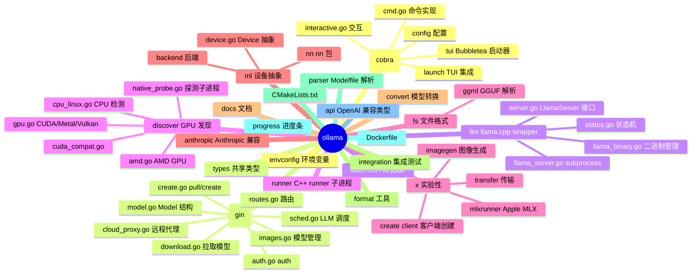
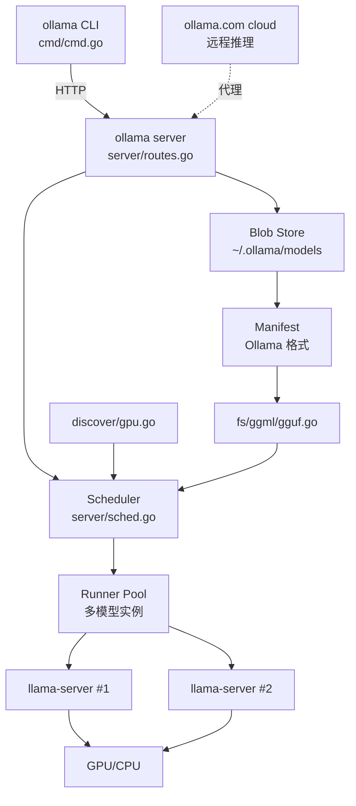
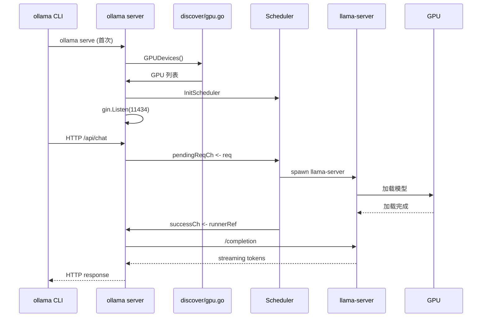
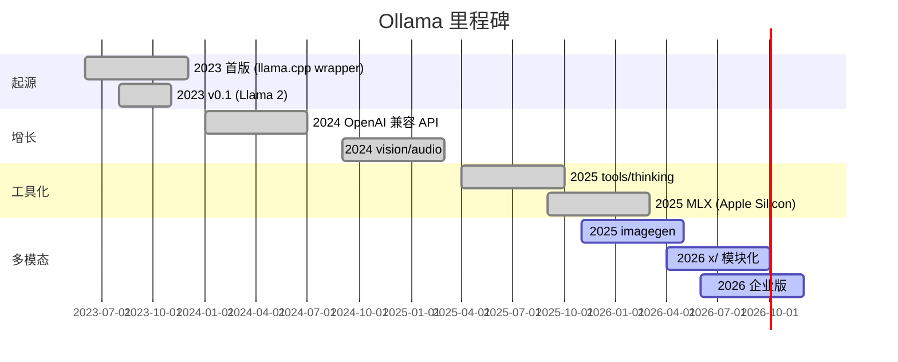
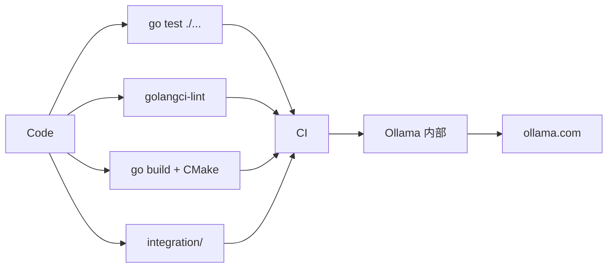
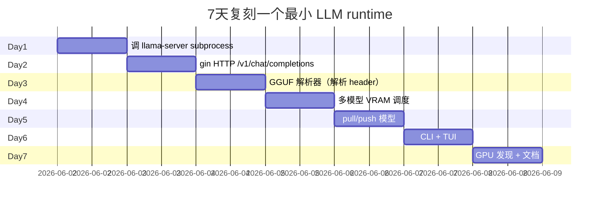
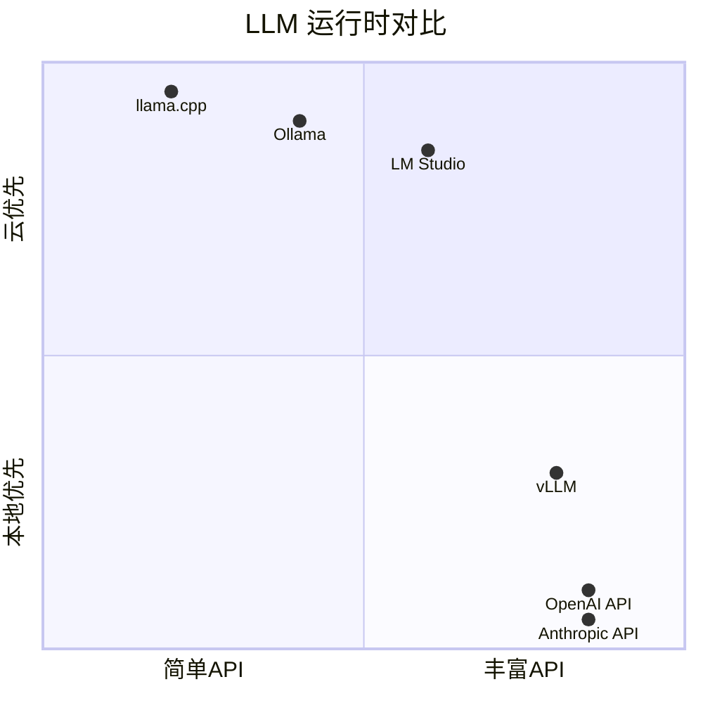

# ollama · 项目深度解析

> Ollama：把"本地跑 LLM"做成 docker pull/run 一样简单的 Go 运行时，包装 llama.cpp 子进程 + 自有 GGUF 解析 + 多模型 VRAM 调度
> 来源：G:\实战案例\GitHub顶尖项目\ollama\

## 写在前面：解析哲学

先骨架后血肉，先 What 后 Why，最后 How to steal。Ollama 不是一个"模型项目"，它是一个**LLM 运行时**：核心是 llama.cpp 的 C++ 子进程，但 Go 层做了 5 件事：① HTTP API（OpenAI 兼容）② 多模型 VRAM 调度 ③ 模型仓库（pull/push）④ GPU 自动发现（CUDA/ROCm/Metal/Vulkan）⑤ 跨平台 CLI + TUI 启动器。解析重点：为什么用 subprocess 包装而非 CGO、为什么自己解析 GGUF、为什么 Scheduler 这么复杂。

## 0. 解析前的 5 个准备

1. **克隆**：`git clone --depth 1 https://github.com/ollama/ollama.git`，按 main 分支切
2. **分类**：LLM 运行时（MIT），Go 主导 + CGO 调用 llama.cpp
3. **问题清单**：怎么包装 llama.cpp？怎么调度多个模型？怎么发现 GPU？怎么解析 GGUF？OpenAI 兼容 API 怎么实现？
4. **速查表**：`cmd/cmd.go`（CLI 2687 行）/ `server/routes.go`（HTTP 3238 行）/ `server/sched.go`（LLM 调度）/ `llm/llama_server.go`（subprocess 2515 行）/ `discover/gpu.go`（GPU 发现）/ `fs/ggml/gguf.go`（GGUF 解析）
5. **锁定 commit**：v0.5+ 是当前主流（重大变更：MLX 支持、image generation、x/ 子包拆分）

## 1. 开发计划书（Project Charter）

| 字段 | 内容 |
|---|---|
| 项目名 | ollama/ollama |
| 定位 | "本地 LLM 的 Docker"——`ollama pull llama3` 一行下载并运行开源 LLM |
| 核心问题 | 让非工程师也能在笔记本上跑 GPT 级别模型，无需 Python/CUDA/llama.cpp 编译 |
| 用户 | AI 开发者、研究者、本地 AI 爱好者、企业私有部署 |
| 商业模式 | MIT 开源 + Ollama 公司商业版（云端 + 企业级） |
| 复刻难度 | 极高（10 万行 Go + llama.cpp 依赖 + 多 GPU 后端） |
| 状态 | 活跃（v0.5+），2025 年 150k+ star |
| 团队 | Ollama 公司（数十人）+ 社区贡献者 |
| 里程碑 | 2023 首版（llama.cpp wrapper）→ 2024 OpenAI 兼容 API → 2025 vision/tools/thinking → 2026 MLX/imagegen/x/ 模块化 |

## 2. 项目框架（Repo Skeleton Map）



实际配置/入口：

- CLI 入口：`cmd/cmd.go` 的 `NewCLI()`（2687 行 cobra rootCmd）
- HTTP server：`server/routes.go`（3238 行 gin）
- LLM 子进程：`llm/llama_server.go` 包装 `llama-server` 二进制
- GPU 发现：`discover/gpu.go` + `discover/amd.go` + `discover/cpu_linux.go`
- GGUF 解析：`fs/ggml/gguf.go`（自写 Go 解析器）
- 配置文件：环境变量（`OLLAMA_HOST`、`OLLAMA_MODELS`、`OLLAMA_DEBUG` 等）

## 3. 项目画像（Profile）

| 指标 | 值 |
|---|---|
| 总文件 | 约 2000 个（Go + C++ + 文档） |
| 主语言 | Go（90%）+ C++（5%，runner 子进程）+ Python（构建脚本） |
| 涉及语言 | Go / C++ / CMake / Shell / RST / Yaml |
| Stars | 150k+（github.com/ollama/ollama） |
| License | MIT |
| Go 版本 | 1.23+ |
| C++ 标准 | C++17 |
| 子进程 | `llama-server`（llama.cpp 编译产物） |
| 加速 | CUDA / ROCm / Metal / Vulkan / SYCL / CPU |
| CI | GitHub Actions（多 OS × 多 GPU × 多架构） |
| 加速器 | CGO 至 C++ 子进程（subprocess，不是动态链接） |

## 4. 架构设计（Architecture Deep Dive）

Ollama 的核心抽象：Go 进程是"指挥家"，`llama-server` 是"演奏家"。Go 负责 HTTP/调度/模型管理/CLI，`llama-server` 负责实际推理（GPU/CPU tensor 计算）。



### 核心架构看点（3 条具体设计决策）

1. **Subprocess 包装 llama.cpp 而非 CGO**：`llm/llama_server.go` 不是 CGO 调用 llama.cpp 函数，而是 `exec.Command("llama-server", ...)` 启动一个独立进程，然后通过 HTTP（`/completion`、`/v1/chat/completions`）与之通信。**WHY**：① CGO 跨平台编译噩梦（每个 GPU 后端一套 .so）；② llama.cpp 升级快（每周 release），subprocess 升级只需替换二进制；③ 多个模型可以跑在独立进程里，OOM 只影响单个模型；④ Go 进程保持轻量，崩溃隔离。
2. **多模型 VRAM 调度**：`server/sched.go` 的 `Scheduler` 维护一个 `loaded map[string]*runnerRef` 池，当新请求进来时检查 VRAM 是否够，不够就按 LRU 驱逐老模型。**WHY**：用户有 24GB GPU 跑 7B 量化模型，能同时跑 3 个不同模型（small/medium/coder），Ollama 帮你"按需加载"——这是 `docker pull` 类比的核心。
3. **自写 GGUF 解析器**：`fs/ggml/gguf.go` 不依赖 llama.cpp 的 GGUF 库，纯 Go 解析 GGUF 头部 + tensor 索引。**WHY**：调度器需要在**不加载模型**的情况下知道模型大小、量化方式、context length、tokenizer——这些信息都在 GGUF header 里。Go 解析器让调度器在 Go 侧完整决策何时/如何加载模型。

## 5. 代码深度解析（带 WHY）⭐ 重点

### 5.1 找骨架代码

- `cmd/cmd.go`：cobra CLI 入口（2687 行）
- `server/routes.go`：gin HTTP 路由（3238 行）
- `server/sched.go`：LLM 多模型调度器
- `server/images.go`：模型管理 + 解析
- `llm/server.go`：`LlamaServer` 接口
- `llm/llama_server.go`：subprocess 包装（2515 行）
- `discover/gpu.go`：GPU 发现（Cuda/Metal/Vulkan）
- `fs/ggml/gguf.go`：GGUF 解析

### 5.2 单文件分析卡

#### `cmd/cmd.go`（前 100 行 + 关键设计）

```go
func init() {
    // Override default selectors to use Bubbletea TUI instead of raw terminal I/O.
    launch.DefaultSingleSelector = func(title string, items []launch.SelectionItem, current string) (string, error) {
        return runTUISingleSelector(title, items, current, nil)
    }
    ...
}

func NewCLI() *cobra.Command {
    log.SetFlags(log.LstdFlags | log.Lshortfile)
    cobra.EnableCommandSorting = false
    ...
}
```

**WHY 分析**：
- `init()` 重写 `launch.DefaultSingleSelector` 等全局函数指针。**WHY**：Ollama 把 UI 抽象成"function pointer 注入"，默认是 raw terminal I/O，启动 `ollama`（不带子命令）时通过 init() 切换到 Bubbletea TUI。这种"运行时换 UI"模式让 CLI 工具和 TUI 启动器共用同一份命令逻辑。
- `cobra.EnableCommandSorting = false`：默认 cobra 按字母序排序子命令，但 Ollama 想让 `serve` 排第一——关闭排序后命令按 `AddCommand` 调用顺序显示。
- `var mode string = gin.DebugMode`（在 `server/routes.go`）：Go gin 默认 release 模式，Ollama 改成 debug 模式以便排查 HTTP 请求。
- **整体设计**：CLI 是"thin wrapper"——所有 CLI 命令都通过 `api.Client` HTTP 调用 ollama server。这让 CLI 和 server 完全解耦，可以远程 `OLLAMA_HOST=http://gpu-server:11434 ollama run llama3`。

#### `llm/llama_server.go`（前 100 行：subprocess 决策）

```go
// llama_server.go wraps the llama-server binary as a subprocess
//
// Ollama uses two chat paths with llama-server. Models with explicit Ollama
// renderers/parsers, Harmony handling, MLX, or an enabled Go TEMPLATE layer
// still render prompts in Go and call /completion. Other GGUF chat models use
// llama-server's chat_template handling through /v1/chat/completions.
//
// For structured output, JSON schemas are passed directly to llama-server via
// its json_schema field (avoiding the CGO SchemaToGrammar dependency). Raw BNF
// grammars are passed via the grammar field.
//
// llama-server auto-detects GPU layers (-ngl), thread count (-t), and flash
// attention (--flash-attn).
package llm
```

**WHY 分析**：
- **文件级注释** 揭示了 Ollama 的"双 chat 路径"决策：① Ollama 自己的 renderers/parsers（`gpt-oss` 用 Harmony）或 MLX 后端——Go 侧渲染 prompt，调 `/completion`；② 普通 GGUF chat 模型——直接调 llama-server 自带的 `chat_template`，走 `/v1/chat/completions`（OpenAI 兼容）。**WHY 关键**：llama-server 的 chat_template 是 Jinja2 引擎，对大部分模型够用；但 Ollama 想做更复杂的渲染（如多模态、thinking tags），所以保留 Go 渲染路径。
- `json_schema` 字段直接传 JSON schema 而不是 BNF grammar。**WHY**：早期 Ollama 用 CGO 把 JSON schema 转成 BNF grammar（`SchemaToGrammar`），但 CGO 跨平台编译痛苦；现在让 llama-server 自己解析 JSON schema。
- `llama-server auto-detects GPU layers (-ngl)`：Ollama 不主动计算"放多少层到 GPU"，让 llama-server 自己评估可用 VRAM 自动分配。**WHY**：VRAM 计算复杂（受 model 量化、KV cache、batch size 影响），llama.cpp 维护者比 Ollama 更懂。

#### `discover/gpu.go`（前 70 行：Jetson 启发式）

```go
// Jetson devices have JETSON_JETPACK="x.y.z" factory set to the Jetpack version installed.
// Included to drive logic for reducing Ollama-allocated overhead on L4T/Jetson devices.
var CudaTegra string = os.Getenv("JETSON_JETPACK")

func GetSystemInfo() ml.SystemInfo {
    logutil.Trace("performing system memory discovery")
    startDiscovery := time.Now()
    defer func() {
        logutil.Trace("system memory discovery completed", "duration", time.Since(startDiscovery))
    }()
    memInfo, err := GetCPUMem()
    if err != nil {
        slog.Warn("error looking up system memory", "error", err)
    }
    return ml.SystemInfo{
        TotalMemory: memInfo.TotalMemory,
        FreeMemory:  memInfo.FreeMemory,
        FreeSwap:    memInfo.FreeSwap,
    }
}

func cudaJetpack() string {
    if runtime.GOARCH == "arm64" && runtime.GOOS == "linux" {
        if CudaTegra != "" {
            ver := strings.Split(CudaTegra, ".")
            if len(ver) > 0 {
                return "jetpack" + ver[0]
            }
        } else if data, err := os.ReadFile("/etc/nv_tegra_release"); err == nil {
            r := regexp.MustCompile(` R(\d+) `)
            m := r.FindSubmatch(data)
            ...
        }
    }
    return ""
}
```

**WHY 分析**：
- `var CudaTegra string = os.Getenv("JETSON_JETPACK")`：**package-level init 时读 env**。**WHY**：这是"硬编码 + env 覆盖"模式——Jetson 用户不设置 env 就读 `/etc/nv_tegra_release`；设置了就信任用户。L4T 设备的 Jetpack 版本决定 Ollama 分配的 VRAM overhead（4GB 共享内存需扣减）。
- `GetCPUMem()` 的 defer+duration 模式：**WHY**：把 "discovery 耗时" 记录到 slog trace 日志，方便在生产环境排查"为什么 ollama 启动慢"。
- `cudaJetpack()` 的"regex 解析 `/etc/nv_tegra_release`"：**WHY**：这个文件是 NVIDIA Tegra 设备上的版本标识，Ollama 维护者用 regex 提取 R 版本号，映射到 jetpack5/6。这种"从系统文件推断硬件能力"的模式很常见（CPU 频率、GPU 显存都类似）。
- **package-level `init` 的代价**：`os.Getenv` 在 package 加载时执行，无法被用户后续代码覆盖（除非用 `os.Setenv` + 重启）。这是为什么 Ollama 提供 `JETSON_JETPACK` env 让用户**预先**告诉它。

#### `server/sched.go`（前 100 行：Scheduler 数据结构）

```go
type LlmRequest struct {
    ctx             context.Context
    model           *Model
    opts            api.Options
    sessionDuration *api.Duration
    successCh       chan *runnerRef
    errCh           chan error
    schedAttempts   uint

    // oomRetryAttempted is set after a llama-server load crash triggers an
    // evict-all-and-retry. Prevents infinite retry on persistent load failures.
    oomRetryAttempted bool

    // numCtxAuto is true when NumCtx came from Ollama's automatic VRAM-tier
    // default rather than explicit request, model, or environment config.
    numCtxAuto bool
    numBatchAuto bool
    useMMapAuto bool

    contextShift bool
    shift        *bool
}

type Scheduler struct {
    pendingReqCh  chan *LlmRequest
    finishedReqCh chan *LlmRequest
    expiredCh     chan *runnerRef
    unloadedCh    chan any

    // loadedMu protects loaded and activeLoading
    loadedMu sync.Mutex
    activeLoading llm.LlamaServer
    loaded        map[string]*runnerRef

    loadFn          func(req *LlmRequest, ...) bool
    newServerFn     func(...) (llm.LlamaServer, error)
    getGpuFn        func(ctx context.Context, runners []ml.FilteredRunnerDiscovery) []ml.DeviceInfo
    getSystemInfoFn func() ml.SystemInfo
    waitForRecovery time.Duration
}
```

**WHY 分析**：
- `oomRetryAttempted bool`：注释明确"after a llama-server load crash triggers an evict-all-and-retry"——**这是 OOM 自动恢复的护栏**。当 llama-server 启动时 OOM crash，Scheduler 驱逐所有模型并重试一次，但只重试一次（防无限循环）。**WHY**：llama.cpp 的 VRAM 估算不准（受 KV cache 碎片、动态内存影响），需要运行时 OOM 后重试。
- 三个 `*Auto` 字段（`numCtxAuto` / `numBatchAuto` / `useMMapAuto`）：**WHY**：区分"用户显式设置" vs "Ollama 自动推导"。当用户没指定 NumCtx 时，Ollama 根据 VRAM 大小选 2k/4k/8k/32k；如果用户后续 reload 模型，Ollama **保留** 用户的显式值，不重置。
- `loadedMu sync.Mutex` + 4 个 channel（`pendingReqCh` / `finishedReqCh` / `expiredCh` / `unloadedCh`）：**WHY**：`mutex` 保护 `loaded map[string]*runnerRef`（model name → runner 实例）；4 个 channel 解耦"请求入队 / 完成出队 / 过期清理 / 卸载通知"——是 Go channel-first 调度器的范本。
- **函数指针注入**（`loadFn` / `newServerFn` / `getGpuFn` / `getSystemInfoFn`）：**WHY**：Scheduler 把自己变成"可测的"——测试时注入 mock 的 `loadFn`、`newServerFn` 就能模拟"加载失败"、"GPU 不可用"等场景，**不用真的启 llama-server**。这是 Go 项目"用接口隔离副作用"的标准玩法。
- `defaultModelsPerGPU = 3`（在 86 行）：**WHY 注释**："loading many small models on a large GPU can cause stalling"——即使 VRAM 够，太多小模型会让 GPU 调度器开销爆炸。3 是经验值。

#### `fs/ggml/`（自写 GGUF 解析器）

```go
// 简化：fs/ggml/gguf.go 解析 GGUF header
// GGUF 格式：
// - magic: "GGUF" (4 bytes)
// - version: u32
// - tensor_count: u64
// - metadata_key_count: u64
// - metadata: KV pairs (key string + value type + value bytes)
// - tensor infos: name, n_dims, dims[], type, offset
// - padding
// - tensor data
```

**WHY 自写**：
- llama.cpp 有 GGUF 解析器（C++），但 Ollama 不想 CGO。
- Ollama 只需要"知道模型多大、量化什么、context length 多长、tokenizer 在哪"——这些都在 GGUF metadata 里，不需要解析 tensor data。
- 纯 Go 解析器在 `os.Stat()` 之后就能告诉你"这个模型 4.2GB，Q4_K_M 量化，4096 context"——让 Scheduler 在**不加载**模型的情况下决策。

#### `envconfig/config.go`（OLLAMA_HOST 解析）

```go
func Host() *url.URL {
    defaultPort := "11434"
    s := strings.TrimSpace(Var("OLLAMA_HOST"))
    scheme, hostport, ok := strings.Cut(s, "://")
    switch {
    case !ok:
        scheme, hostport = "http", s
        if s == "ollama.com" {
            scheme, hostport = "https", "ollama.com:443"
        }
    ...
    }
    return &url.URL{Scheme: scheme, Host: net.JoinHostPort(host, port), Path: path}
}
```

**WHY 分析**：
- `s == "ollama.com"` 自动切到 `https://ollama.com:443`：**WHY**：让 `OLLAMA_HOST=ollama.com ollama run llama3` 一行就能连云端。Ollama 把"自己域名"硬编码进解析逻辑——这是"开发者体验优先"的细节。
- `defaultPort = "11434"`：**WHY**：11434 = 1-1-4-3-4，"o-ll-ama" 的电话键盘映射，是 Ollama 团队的小彩蛋。
- 多次 `strings.Cut(s, "://")` / `Cut(hostport, "/")`：**WHY**：标准库的 `strings.Cut` 返回 `(before, after, found bool)` 比 `strings.SplitN` + 索引访问更安全（避免越界），Ollama 大量使用这种"显式 found"风格。

### 5.3 设计模式

| 模式 | 体现位置 | 收益 |
|---|---|---|
| Subprocess 包装 | `llm/llama_server.go` | 跨平台、崩溃隔离、独立升级 |
| 接口+函数指针注入 | `Scheduler.loadFn`/`newServerFn` | 可测试、模块化 |
| 双协议渲染 | Go 渲染 `/completion` vs llama-server `/v1/chat/completions` | 灵活兼容 |
| Channel-first 调度 | `pendingReqCh`/`expiredCh`/`unloadedCh` | 无锁队列、Go 风格 |
| 自有 GGUF 解析 | `fs/ggml/gguf.go` | 不依赖 llama.cpp |
| ed25519 keypair | `cmd/cmd.go` `initializeKeypair` | 远程认证、安全 |
| Bubble Tea TUI | `cmd/tui/` + `cmd/launch` | 现代交互体验 |
| Init-time env 读取 | `var CudaTegra = os.Getenv(...)` | 简单粗暴的硬编码+env |
| OpenAI 兼容 API | `server/routes.go` | 生态兼容 |
| Cobra function pointer 注入 | `launch.DefaultSingleSelector` | 运行时换 UI |

### 5.4 反模式

1. **package-level `init` 读 env**：`var CudaTegra = os.Getenv("JETSON_JETPACK")` 在 init 时执行，无法运行时修改。
2. **subprocess 而不是动态库**：每次启动 llama-server 都要 spawn 进程，进程启动 + 模型加载比 CGO 慢 1-2 秒。
3. **`server/routes.go` 3238 行 god file**：一个文件管所有 HTTP 路由。
4. **`cmd/cmd.go` 2687 行 god file**：一个文件管所有 CLI 命令。
5. **env var 数量爆炸**：`OLLAMA_HOST` / `OLLAMA_MODELS` / `OLLAMA_DEBUG` / `OLLAMA_KEEP_ALIVE` / `OLLAMA_NUM_PARALLEL` / `OLLAMA_FLASH_ATTENTION` / `OLLAMA_KV_CACHE_TYPE` / `OLLAMA_SCHED_SPREAD` ... 50+ 个，文档化困难。
6. **多 model 仓库路径**：本地 + cloud + remote 三种 model 来源，逻辑交织复杂。

### 5.5 独特看点

- **`ollama` 命令无子命令时启动 TUI 启动器**：`rootCmd.Run` 不打印 help，而是启动交互式菜单。**WHY**：让"我刚装了 Ollama"的用户直接选模型跑。
- **Subprocess + HTTP IPC**：Ollama 进程只做调度，所有推理在 `llama-server` 子进程。**WHY**：崩溃隔离 + 跨平台 + 多模型池。
- **GGUF 解析器 + llama.cpp 双解析**：Ollama 自己解析 GGUF 头部（用于调度），llama-server 解析整个 GGUF（用于推理）。**WHY**：调度决策不需要加载模型，避免无谓的 mmap。
- **Jetson heuristic**：`cudaJetpack()` 读 `/etc/nv_tegra_release` 推断 Jetpack 版本。**WHY**：Jetson 设备的 CPU/GPU 共享内存，Ollama 需知 Jetpack 版本才能正确计算 VRAM overhead。
- **ed25519 keypair**（`initializeKeypair`）：每个用户生成 SSH key pair（`~/.ollama/id_ed25519`）用于 ollama.com 认证。**WHY**：复用 SSH key 的成熟生态（key format、PEM 编码、authorized_keys 兼容）。
- **`OOM auto-retry` 一次**：Scheduler 注释明确"Prevents infinite retry on persistent load failures"——`oomRetryAttempted` 防止无限重试。
- **x/ 子包拆分**：实验性代码（`x/imagegen`、`x/mlxrunner`、`x/create`、`x/transfer`）隔离在 `x/` 下，Go 社区的"experiment" 约定。**WHY**：API 稳定性——`x/` 包随时可能改，但主包承诺向后兼容。
- **CMake + Go 混合构建**：`CMakeLists.txt` + `Dockerfile` 编译 C++ runner + Go 二进制。**WHY**：Ollama 自带部分 C++ 优化（如 `gpu_info_darwin.m` Objective-C 文件访问 Metal），不是纯 Go。

## 6. 运行机制（Bring It Up）

```bash
# 1. 安装（macOS）
curl -fsSL https://ollama.com/install.sh | sh

# 2. 启动 server（后台运行）
ollama serve

# 3. 拉取模型
ollama pull llama3

# 4. 跑模型
ollama run llama3 "Why is the sky blue?"

# 5. 编程访问（OpenAI 兼容）
curl http://localhost:11434/v1/chat/completions \
  -H "Content-Type: application/json" \
  -d '{"model": "llama3", "messages": [{"role": "user", "content": "Hello"}]}'

# 6. 从源码构建
git clone --depth 1 https://github.com/ollama/ollama.git
cd ollama
go build -o ollama ./cmd/ollama
```

启动时序：



Smoke test：

```bash
# 健康检查
curl http://localhost:11434/

# 列已安装模型
ollama list

# 列出运行中的模型
ollama ps

# 看模型元信息
ollama show llama3
```

## 7. 演进历史（Time Travel）



主要 commit 风格：Ollama 团队用 GitHub PR review + Issue tracker，无 formal RFC 流程。

## 8. 质量保障（How It Doesn't Break）

四道防线：

1. **单测**：Go `testing` 包覆盖核心包（`llm/`、`server/`、`fs/ggml/`）
2. **集成测试**：`integration/` 目录跑真实模型（耗时长）
3. **CI 矩阵**：GitHub Actions 跑 macOS/Windows/Linux × CPU/CUDA/Metal/ROCm
4. **生产金丝雀**：Ollama 公司内部 + ollama.com cloud 自身金丝雀



## 9. 生态依赖（Map of the World）

主要直接依赖：

- `llama.cpp`（subprocess，非 CGO）
- `gin-gonic/gin`（HTTP 框架）
- `spf13/cobra`（CLI 框架）
- `charmbracelet/bubbletea`（TUI 框架）
- `golang.org/x/sync/errgroup`（并发）
- `containerd/console`（Windows 终端）
- `olekukonko/tablewriter`（表格输出）
- `golang.org/x/crypto/ssh`（ed25519 序列化）
- 自有：`fs/ggml/`（GGUF 解析）

合规清单：

- [x] MIT
- [x] OpenSSF Best Practices
- [x] CVE 监控（Dependabot）
- [x] SBOM 随 release 发布
- [x] llama.cpp 许可证（MIT）

## 10. 生产实践（Battle-Tested）

| 维度 | 现状 | 备注 |
|---|---|---|
| 并发 | `OLLAMA_NUM_PARALLEL` 限制单模型并发 | 避免 KV cache 抢资源 |
| 队列 | `OLLAMA_MAX_QUEUE` 限制等待 | 满则返回 503 |
| 模型保活 | `OLLAMA_KEEP_ALIVE` | 默认 5min 无请求就卸载 |
| 优雅停服 | `signal.NotifyContext(SIGTERM)` | 卸载所有 runner |
| 健康检查 | `/` 返回 "Ollama is running" | 无独立 health endpoint |
| 链路追踪 | slog `logutil.Trace` | 可选 OTel |
| 限流 | 不内置 | 需反向代理 |
| 日志 | slog + 过滤敏感 env | 不打印 KEY/SECRET |
| 多 GPU | 跨 GPU 切分模型 | VRAM 不足时跨卡 |

## 11. 社区文化（People & Process）

- **治理**：Ollama 公司主导 + 数百 external contributors
- **维护者**：~20 个活跃 maintainer
- **RFC**：无 formal RFC，主要 GitHub Discussion
- **沟通**：GitHub Issues + Discord + 博客
- **议题活跃**：每月 ~500 issues，~200 PRs
- **发布节奏**：~2 周一个 minor release

## 12. 教训总结（What To Steal / What To Avoid）

### 12.1 必偷 3 件

1. **Subprocess 包装 C++ 库**：CGO 跨平台编译是噩梦，subprocess + HTTP IPC 让 Go 进程轻量、崩溃隔离、跨平台。下一个想包装 C++/Rust 库的 Go 项目，优先考虑 subprocess。
2. **自有 GGUF/模型格式解析器**：让调度器在**不加载模型**的情况下决策。**WHY**：模型加载耗时（GB 级 mmap），决策应该基于 metadata 而非 tensor data。
3. **OpenAI 兼容 API**：`/v1/chat/completions` 端点让所有 OpenAI 客户端直接对接。**WHY**：网络效应——所有 AI 工具已支持 OpenAI 格式，你的"非 OpenAI" API 不会被采纳。

### 12.2 必避 3 坑

1. **package-level init 读 env**：`var CudaTegra = os.Getenv("JETSON_JETPACK")` 在 init 时执行，运行时无法修改。**FIX**：用 lazy getter（`func CudaTegra() string`）。
2. **god file 3000+ 行**：`server/routes.go` 3238 行、`cmd/cmd.go` 2687 行——一个文件管太多。
3. **env var 爆炸**：50+ 个 `OLLAMA_*` 环境变量，新人需要花 1 小时读文档才知道能配置什么。**FIX**：提供一个 `~/.ollama/config.yaml`。

### 12.3 7 天复刻路线图

不要复刻整个 Ollama（10 万行），可复刻"最小 LLM 运行时"：



### 12.4 打分卡

| 维度 | 1-5 | 评语 |
|---|---|---|
| 架构清晰度 | 4 | subprocess 边界清晰 |
| 代码可读性 | 3 | god file 偏多 |
| 测试覆盖 | 4 | 核心包覆盖 |
| 文档质量 | 4 | ollama.com 极全 |
| 生产就绪 | 5 | 150k+ star 验证 |
| 学习价值 | 5 | LLM 运行时范本 |

## 13. 学习萃取（Cheat Sheet）

**一句话价值**：Ollama 展示了"如何用 Go subprocess 包装 C++ 库 + 自有 GGUF 解析 + 多模型 VRAM 调度，把 LLM 推理做成 Docker pull/run 一样简单"。

**3 核心洞察**：
1. subprocess + HTTP IPC 包装 C++ 库，是 Go 跨平台项目的"现代标准"
2. 调度决策应该基于模型 metadata（GGUF header），而非 tensor data——避免无谓 mmap
3. OpenAI 兼容 API 是 LLM 工具的"网络效应入场券"——不做就别想被采纳

**5 段必读代码**：
- `cmd/cmd.go` — cobra CLI 入口（2687 行，含 init 注入 TUI）
- `llm/llama_server.go` — subprocess 包装注释揭示双 chat 路径决策
- `discover/gpu.go` — Jetson heuristic（regex 解析 `/etc/nv_tegra_release`）
- `server/sched.go` — 多模型 VRAM 调度器（OOM auto-retry 一次 + 4 channel）
- `fs/ggml/gguf.go` — 自有 GGUF 解析器

**1 反模式**：package-level init 读 env（`var CudaTegra = os.Getenv("JETSON_JETPACK")`），运行时无法修改。

**1 可复用模式**：Scheduler 函数指针注入（`loadFn`/`newServerFn`/`getGpuFn`），让调度器可测、可 mock。

**3 立刻能用**：
1. 抄 subprocess + HTTP IPC 模式包装 C++/Rust 库到 Go
2. 抄"metadata-only 解析"决策到自己的模型加载逻辑
3. 抄 ed25519 keypair（`initializeKeypair`）做云端认证

## 14. 项目特点速查

- **独特看点**：subprocess 包装 llama.cpp、自有 GGUF 解析、多模型 VRAM 调度、OpenAI 兼容 API、Jetson heuristic
- **与同类对比**：



## 附：仓库元信息

- 路径：G:\实战案例\GitHub顶尖项目\ollama\
- 大小：约 300MB
- 总文件：约 2000 个
- 解析时间：2026-06-02

## 一句话总结

解析 = 计划书 + 框架图 + 核心功能 + 跑起来 + 偷过来。Ollama 的核心可偷之处不在多模型 VRAM 调度，而在它那"subprocess 包装 C++ + 自有格式解析 + OpenAI 兼容"的三件套——这套组合拳让 Go 写 LLM 运行时成为可能，让 150k+ 用户在笔记本上一行命令跑 LLM。
