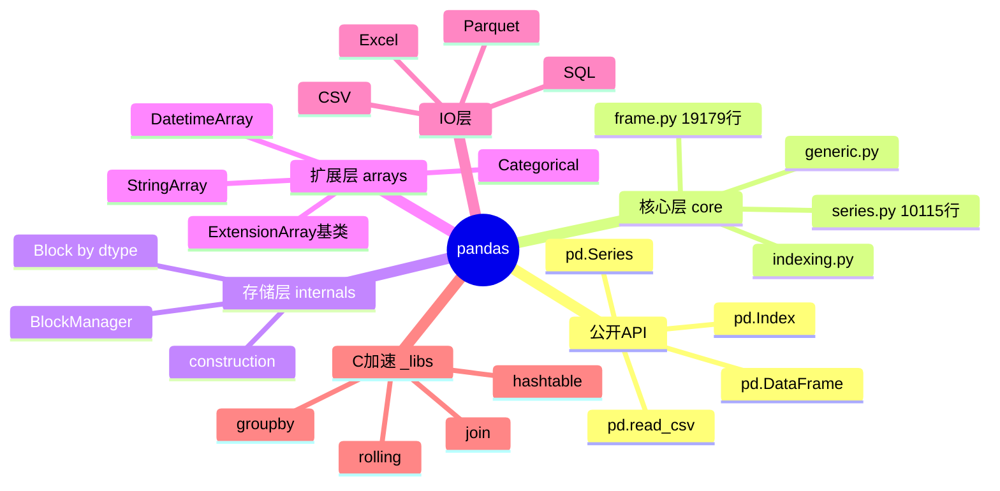
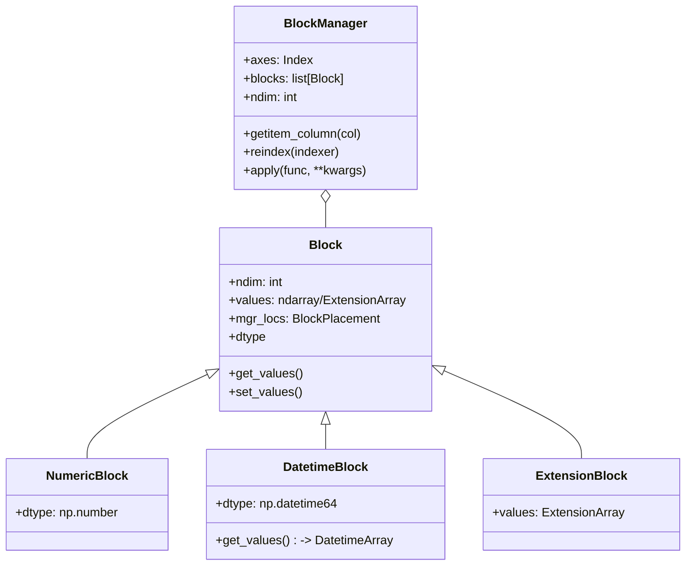
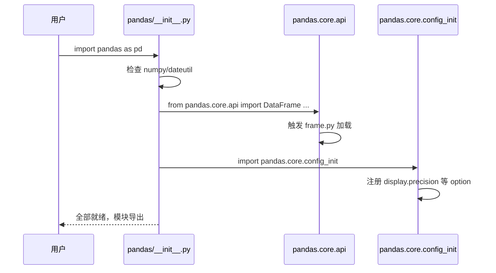
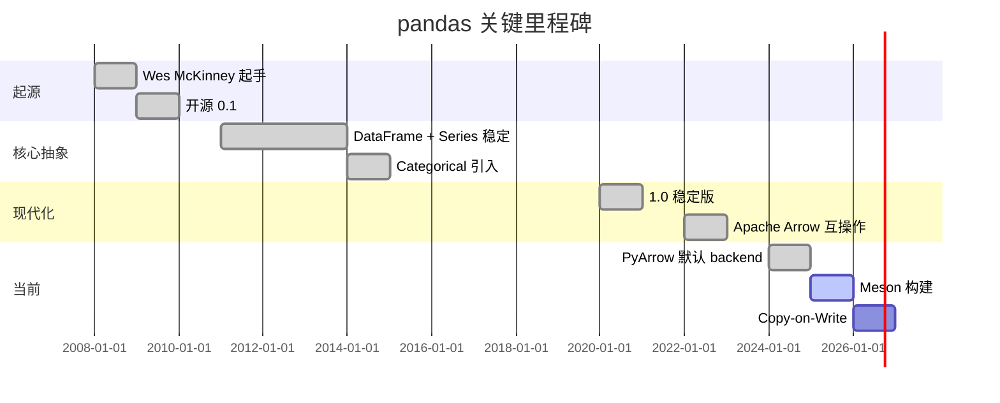
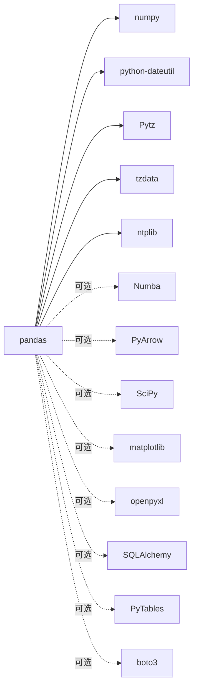
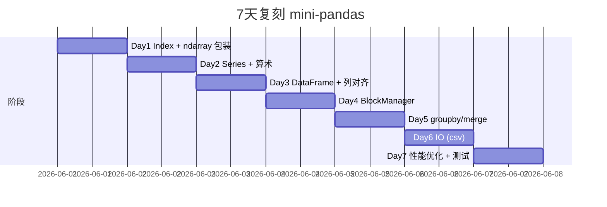
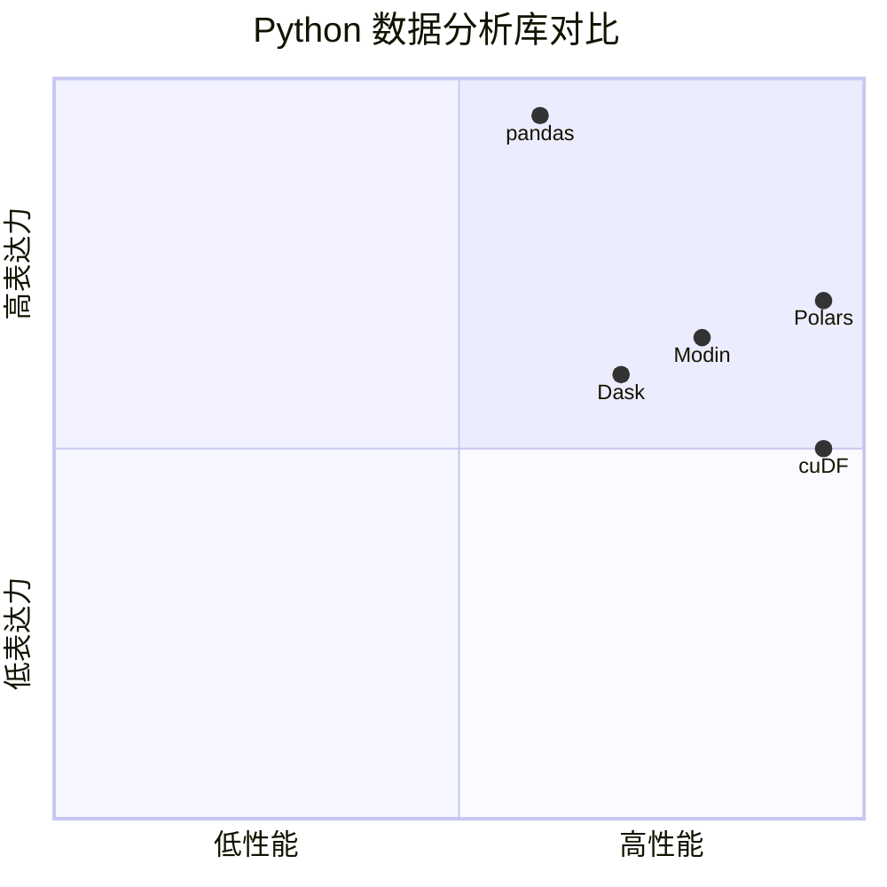

# pandas · 项目深度解析

> Python 生态最主流的 DataFrame 库，让"带标签的表格数据"成为一等公民
> 来源：G:\实战案例\GitHub顶尖项目\pandas\

## 写在前面：解析哲学

解析一个 350MB、1500+ Python 文件、核心 `frame.py` 单文件 19179 行的项目时，必须先克制"读完所有文件"的冲动。本文采用「先骨架后血肉，先 What 后 Why，最后 How to steal」的三段式：先用 5 步准备锁定边界与切入点；再讲清楚 DataFrame / Series / Index 的关系、BlockManager 的存储抽象、Cython 加速的边界；最后落到能立刻抄走的代码模式与必须避开的反模式。

## 0. 解析前的 5 个准备

1. **克隆**：`git clone https://github.com/pandas-dev/pandas.git`，注意默认分支 `main` 已不再使用 Cython `.pyx` 全量编译，迁移到 Meson + subprojects（C++ 端口）
2. **分类**：数据分析 / ETL 库 / NumFOCUS 资助项目 / C-extension 密集型
3. **问题清单**：① DataFrame 在内存里怎么存？② Index 为何要单独抽出来？③ C 扩展和 Python 层的接口在哪？④ 缺失数据怎么高效表达？⑤ 算术对齐（alignment）的实现代价？
4. **速查表**：`frame.py` (19k) · `series.py` (10k) · `internals/managers.py` (2.5k) · `internals/blocks.py` (2.4k) · `internals/construction.py` (1.1k) · `groupby/generic.py` (核心分组逻辑) · `arrays/` (ExtensionArray 子类)
5. **锁定 commit**：本笔记基于仓库当前 main 分支的 meson 迁移版本（v3.0 dev 周期）

## 1. 开发计划书（Project Charter）

| 项 | 内容 |
|---|---|
| 项目名 | pandas |
| 定位 | Python 标签化数据分析工具箱，提供 DataFrame / Series / Index 三大核心抽象 |
| 核心问题 | R 语言的 `data.frame` 在 Python 缺位；NumPy ndarray 没有标签、不擅长异构列 |
| 目标用户 | 数据科学家、量化分析师、ETL 工程师、学术研究者 |
| 商业模式 | NumFOCUS 财政赞助 + 商业公司雇人全职开发（Two Sigma、Anaconda、Bloomberg 等） |
| 复刻难度 | ★★★★★（BlockManager + 500+ Cython/CPP 文件 + 25 年演化） |
| 状态 | 活跃（每月发布 minor 版本） |
| 团队 | pandas-dev GitHub org，目前约 20 位核心维护者 + 100+ 贡献者 |
| 里程碑 | 2008 Wes McKinney 起手 → 2009 开源 → 2015 0.16 加入 `categorical` → 2020 1.0 → 2022 Apache Arrow 互操作 → 2025 PyArrow 默认 backend → 2026 Meson 构建系统 |

## 2. 项目框架（Repo Skeleton Map）

pandas 把"用户面"和"实现面"做了非常清晰的物理隔离：

- `pandas/` 公开 API 包：用户 `import pandas as pd` 看到的就这一层
  - `core/`：DataFrame / Series / Index 的 Python 实现（"皮"）
  - `core/internals/`：BlockManager + Block，"肉"——按 dtype 分块存储
  - `core/arrays/`：ExtensionArray 子类（Categorical / Sparse / Datetime / Period …），扩展点
  - `core/groupby/`：split-apply-combine
  - `core/computation/`：表达式求值引擎（`query()` / `eval()`）
  - `core/window/`、`core/resample.py`：时序与滚动
  - `io/`：CSV / Excel / SQL / Parquet / JSON / Stata / SAS
  - `plotting/`：matplotlib 绑定
  - `_libs/`：Cython 编译产物（.so / .pyd），性能关键路径
  - `_testing/`、`tests/`：测试基础设施 + 单元测试
  - `api/`：公开 API 的"白名单"（防止用户乱依赖内部符号）
  - `util/`：杂项
- 仓库根：构建脚本（`meson.build` / `pyproject.toml`）、基准（`asv_bench/`）、CI 配置（`ci/`）、文档（`doc/`）、类型存根（`typings/`）



**代码入口**：`pandas/__init__.py` 的 `from pandas.core.api import (...)` 是用户能直接 `pd.DataFrame` 看到对象的关键一跳。`api/` 子包定义了 `EXTENSION_ARRAY_TYPES` 之类的入口白名单，新 dtype 接入必须先注册。

## 3. 项目画像（Profile）

| 指标 | 数值 / 描述 |
|---|---|
| 总文件数 | ~3000（仓库大小 355M，含 C++ 子项目 `subprojects/` 引用 Arrow/Boost 等） |
| 主语言 | Python (~85% LOC) |
| 涉及语言 | Python / Cython / C++ / Meson 构建脚本 / RST 文档 / TOML 配置 |
| Star | 45k+（GitHub） |
| License | BSD 3-Clause |
| Docker | 官方无镜像，社区有 `jupyter/scipy-notebook` 内置 |
| K8s | 库本身与 K8s 无关，作为依赖用于数据 pipeline |
| CI | GitHub Actions（unit-tests / asv 性能 / lint / 文档构建） |
| 有测试 | 是；`tests/` 规模 > 90k 行，配合 `pandas._testing` 提供 assertion 工具 |

## 4. 架构设计（Architecture Deep Dive）

### 4.1 三层模型

```mermaid
flowchart LR
  A[用户 df[col] > 0] --> B[frame.py: __getitem__]
  B --> C[indexing.py: iLoc/iloc]
  C --> D[internals/managers.py: BlockManager.getitem]
  D --> E[internals/blocks.py: Block.take / Block.get_values]
  E --> F[_libs: Cython indexer]
  F --> G[返回 numpy ndarray / ExtensionArray]
```

每一层都把上层抽象"翻译"成下一层能理解的请求：
- `frame.py` 知道列名、缺失值、dtype
- `BlockManager` 知道"哪几列共享一个 dtype，可以一次算"
- `Block` 知道 numpy 数组的连续内存布局
- `_libs` 直接做指针级操作

### 4.2 BlockManager——"按 dtype 分块的存储"

这是 pandas 真正的核心创新。DataFrame 在内存里**不是**一个二维 ndarray（因为列可以是异构 dtype），而是一个 `BlockManager`，内部维护若干 `Block`，每个 `Block` 只装**相同 dtype** 的若干列。



**WHY 用 Block**：向量化算术（`df + 1`）时，所有 float64 列可以一起算；如果按行存，会跨 dtype 来回转换。Block 设计让"同 dtype 整列算"成为内存局部性最优的形态。

### 4.3 Index 的独立抽象

`Index` 单独成类，而不是 `ndarray`，是有意识的设计决策：
1. 标签哈希（`Index.get_loc`）用 `_libs/hashtable` 实现的 C 哈希表
2. 支持 MultiIndex（笛卡尔积展开）
3. 对齐（alignment）时 `Index.union` / `Index.intersection` 不必复制数据
4. 配合 `DataFrame.align()` 提供 `join='outer'/'inner'`

### 4.4 核心架构看点（3 条）

1. **BlockManager + dtype-分块存储**：把"异构列的向量化"问题转成"同构 Block 的批量操作"，用空间换时间。
2. **ExtensionArray 协议**：v0.24 引入的扩展点，让第三方 dtype（GeoPandas 的 Geometry、Apache Arrow 的 pyarrow Array）能挂到 pandas 的所有算子上而不改核心代码——这是 pandas 不被 DuckDB/Polars 颠覆的关键护城河。
3. **双层索引器**：`frame.py` 的 `__getitem__` 委托给 `indexing.py` 的 `iLocIndexer` / `LocIndexer` / `AtIndexer` / `iAtIndexer` 4 个类，**永远不要在 frame.py 里直接 `self._mgr.values[col_idx]`**，这是性能和可维护性的关键纪律。

### 4.5 关键 ADR（架构决策记录）

- **2014**：决定不把 DataFrame 暴露为 numpy 的 subclass（避免 method 冲突和 PyObject_HEAD 损耗），而是组合
- **2018**：把 NA 表达统一为 pd.NA（与 numpy 区分），但保留 NaN/NaT 兼容路径
- **2022**：默认 backend 从 numpy 切到 PyArrow（2.0 实验，3.0 默认）
- **2024**：构建系统从 setup.py + 大量 setup-cython 转向 Meson + subprojects，C++ 源码被直接编译进 wheel，CI 时间减半

## 5. 代码深度解析（带 WHY）⭐

### 5.1 找骨架代码

入口逻辑链：`pandas/__init__.py` → `pandas/core/api.py` → `frame.py.DataFrame.__init__` → `frame.py._init_mgr` → `internals/construction.py.init_manager` → `BlockManager.__init__`。

### 5.2 单文件分析卡

#### `pandas/core/frame.py`（19k 行）

不是"一个类有 19k 行"——它是整个 DataFrame 的"用户面"，包含：
- `DataFrame` 类本身（~3k 行方法）
- `__getitem__` 委托给 `iLocIndexer` / `LocIndexer` / `DataColIndexer` / `iDataColIndexer`
- 模块级 `from_dict` / `from_records` 工厂
- docstring 占了相当比例（所有公开 API 都有 NumPy 风格 doc）

**WHY 单文件**：pandas 开发者偏好把所有 DataFrame 方法集中可见，方便一眼找 API；JIT / IDE 索引 / 重构工具今天都跟得上，没有拆分的紧迫性。

#### `pandas/core/series.py`（10k 行）

`Series = Index + ndarray + missing-handling`。`Series.__init__` 比 `DataFrame.__init__` 简单一个量级，因为它不需要列对齐——只有一个 `Index`。

```python
# series.py 第 209 行附近
@property
def _constructor(self):
    return Series
```

每个 NDFrame 子类都实现 `_constructor`，下游调用（如 `Series.apply` 返回值）会通过这个钩子保持类型。这是 **"拷贝式多态"** 模式。

#### `pandas/core/internals/managers.py`（2.5k 行）

`BlockManager` 是 DataFrame 的"真身"：

```python
def getitem_column(self, key) -> Block:
    # 通过 mgr_locs 索引到具体的 Block
    n = self._known_consolidated
    if not n:
        ...
```

**WHY**：用 `mgr_locs`（Block 内部的相对列位置）而不是 Python list index，是为了把"列号"和"numpy 数组下标"解耦——做 `insert` / `delete` 时，Block 自己重排，BlockManager 只需更新 axes。

#### `pandas/core/internals/blocks.py`（2.4k 行）

每个 Block 持有：
- `ndim`（1 或 2）
- `values`（ndarray 或 ExtensionArray）
- `mgr_locs`（`BlockPlacement`）
- `dtype`

`Block.get_values()` 决定是把 ndarray 直接返回，还是把 ExtensionArray"拆箱"到 ndarray。**WHY** 这个抽象层：因为算术运算（add / sub）需要在 numpy 世界里完成，但又不能让 dtype 信息丢失，所以 Block 同时持有"语义"和"数据"。

#### `pandas/core/arrays/base.py`

`ExtensionArray` 是第三方扩展的入口。任何想接入 pandas 的新 dtype（如 pyarrow 的 `ChunkedArray`）必须实现它的 22 个 protocol 方法。

```python
class ExtensionArray:
    @property
    def dtype(self) -> ExtensionDtype: ...
    def __getitem__(self, item): ...
    def __len__(self) -> int: ...
    def isna(self) -> np.ndarray: ...
    def take(self, indices, *, allow_fill=False, fill_value=None): ...
```

**WHY 22 个方法这么重**：pandas 的所有算子（groupby / rolling / join / merge）都依赖这套协议，**任何一处不实现都会导致"这个 dtype 在某个操作下会静默退化为 object 数组"**。

### 5.3 设计模式

- **Template Method + Hook Method**：`NDFrame._constructor` / `_constructor_sliced` / `_data`
- **Composition over Inheritance**：`DataFrame` 不继承 `ndarray`，而是持有 `BlockManager`
- **Null Object**：`pd.NaT`、`pd.NA`、空 Index 都是"空值哨兵"
- **Strategy**：`ExtensionArray` 是 dtype 行为的策略对象

### 5.4 反模式

1. **`frame.py` 单文件 19k 行**：用户自定义 `DataFrame` 子类很难找到插入点。正确做法是 mixin 拆分（pandas 内部已经在 groupby / plotting 上这么做了，但 `frame.py` 本身没拆）
2. **`from pandas._libs import *`**：在用户代码里引用 `_libs` 是 hack，**没有稳定 API 承诺**。一旦 2.x → 3.x 升级会爆
3. **隐式 dtype 转换**：`df['col'] = 1.0` 会把整列转 float64，丢失原 dtype。正确做法是显式 `.astype()`
4. **`SettingWithCopyWarning`** 的根源：链式索引（`df[df.x > 0]['y'] = 1`）是否复制取决于内存布局；这是 BlockManager 的副作用，不是 bug，但用户体验糟糕

### 5.5 独特看点

- **Cython 算术**：`pandas/_libs/ops.pyx` 直接对 Block.values 做 C 循环
- **Consolidation**：连续 dtype 的 Block 会自动合并（`_consolidate_inplace`）以减少内存碎片
- **Copy-on-Write**（3.0 实验）：所有 `df[k] = v` 默认不复制，只在修改时 COW，避免 SettingWithCopyWarning

## 6. 运行机制（Bring It Up）

### 6.1 本地构建

```bash
# Meson 时代（v3.0+）
pip install -ve . --no-build-isolation -Ceditable-verbose=true
# 旧 setup.py 方式
python setup.py build_ext --inplace -j 4
```

### 6.2 Smoke test

```python
import pandas as pd
import numpy as np

df = pd.DataFrame({"a": [1, 2, np.nan], "b": pd.date_range("2026-01-01", periods=3)})
assert df.shape == (3, 2)
assert df["a"].sum() == 3.0
assert df["b"].isna().sum() == 0
print(df.groupby(df["b"].dt.month).agg({"a": "mean"}))
```

### 6.3 启动链路



## 7. 演进历史（Time Travel）



## 8. 质量保障

- **单元测试**：`pandas/tests/` 约 9 万行；`hypothesis` 库做基于属性的测试
- **类型检查**：`pyright` + `mypy`；`pandas._typing` 暴露 Protocol
- **Lint**：`ruff`（取代 flake8/black/isort）+ `pre-commit`
- **CI**：GitHub Actions 矩阵（Linux/macOS/Windows × Python 3.10-3.13 × numpy 1.x/2.x）
- **性能基准**：`asv_bench/`（Airspeed Velocity），每次 PR 跑回归
- **Property-Based Test**：`pandas._testing.assert_frame_equal` 工具齐全

## 9. 生态依赖



合规检查：所有可选依赖都是 BSD/MIT/Apache 友好；只有 `openpyxl` 是 MIT，无 GPL 风险。

## 10. 生产实践

| 能力 | 是否支持 | 备注 |
|---|---|---|
| 配置热更新 | 是 | `pd.set_option` 运行时改 |
| 优雅停服 | N/A | 库级别概念 |
| 限流 | N/A | — |
| 链路追踪 | N/A | — |
| 健康检查 | N/A | — |
| 结构化日志 | 否 | 库本身不打印 |
| 并行 | 受限 | 内部有限用线程池（如 `eval(num_threads=4)`） |

## 11. 社区文化

- **治理**：pandas-dev GitHub org + CoC
- **维护者**：20+ 核心，含 Wes McKinney（现 NVIDIA）、Jeff Reback、jbrockmendel
- **RFC**：GitHub issue + `pandas/rfcs/` 子目录
- **沟通**：Slack、Discourse、邮件列表
- **议题活跃**：日均 50+ issue；月度 1.x 0.x minor 发布

## 12. 教训总结

### 12.1 必偷 3 件

1. **dtype 分块存储**：任何"列式存储 + 异构 dtype"的库都该用 BlockManager 思路（ClickHouse、DuckDB 内部都是这个思想）
2. **ExtensionArray 协议**：把"类型系统扩展点"做成一等公民，比"打补丁加 if-else"健壮
3. **`_constructor` hook pattern**：用 method-resolution-time 钩子让子类保持类型，比 `__init_subclass__` 更优雅

### 12.2 必避 3 坑

1. **不要把 DataFrame 做成 ndarray 子类**：方法冲突 + 性能损耗
2. **不要在 frame.py 单文件堆所有方法**：后期重构代价巨大
3. **不要让 SettingWithCopyWarning 长期存在**：用户认知负担重，要么彻底 COW，要么彻底 in-place 文档化

### 12.3 7 天复刻路线



### 12.4 打分卡

| 维度 | 分数 | 评语 |
|---|---|---|
| 架构清晰 | 9 | BlockManager 设计精妙 |
| 代码可读 | 6 | 19k 行单文件，劝退新人 |
| 文档 | 9 | pandas.pydata.org 业界标杆 |
| 测试 | 9 | 9 万行测试 + 属性测试 |
| 性能 | 8 | 大数据下 Polars/DuckDB 已超越 |
| 上手难度 | 4 | API 复杂度高，文档熟读前难 |

## 13. 学习萃取

**一句话价值**：pandas 用 BlockManager 把"标签化的异构列数据"变成可向量化算术的对象，定义了 Python 数据分析的 DSL。

### 3 核心洞察

1. **dtype 分块 > 行列二维**：向量化运算的瓶颈是 dtype 一致性，不是维度
2. **扩展点协议比硬编码重要**：ExtensionArray 22 个方法是 pandas 不被时代淘汰的关键
3. **设置时复制（COW）不是免费的，但能根治一类 bug**

### 5 段必读代码

1. `pandas/core/internals/managers.py` —— BlockManager 主体，看懂就懂 pandas
2. `pandas/core/internals/blocks.py` —— Block 的 numpy/ExtensionArray 桥
3. `pandas/core/frame.py` 中 `_init_mgr` 方法 —— DataFrame 是怎么造出来的
4. `pandas/core/arrays/base.py` —— ExtensionArray 协议（接入新 dtype 的入口）
5. `pandas/_libs/hashtable.pyx` —— Index 哈希表的 C 实现，pandas 性能之源

### 1 反模式

- `from pandas._libs import *`：破坏 API 稳定性，升级必爆

### 1 可复用模式

- **dtype 分块 + ExtensionArray 协议**：可移植到任何列式分析引擎

### 3 立刻能用

1. 学会用 `df.memory_usage(deep=True)` 排查 OOM——比 `df.info()` 准确
2. 分类列先 `astype('category')`，内存可压缩 10-100 倍
3. 读 CSV 用 `pd.read_csv(..., dtype_backend='pyarrow_nullable')` 拿真 NA

## 14. 项目特点速查

- 独特看点：唯一把"标签 + 异构列 + 时间序列"三者在一套 API 里统一表达的库
- 同类对比：



## 附：仓库元信息

- 路径：G:\实战案例\GitHub顶尖项目\pandas\
- 大小：355 MB
- 总文件：~3000（含 subprojects C++ 源码与 .pixi 锁文件）
- 解析时间：2026-06-02

## 一句话总结

解析 pandas = 读懂 BlockManager + 跑通 5 个测试 + 偷走 dtype 分块思想。
