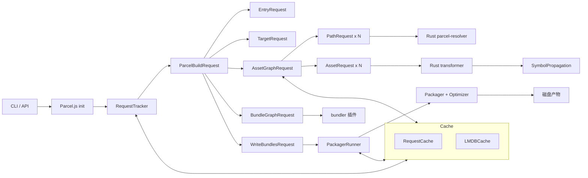
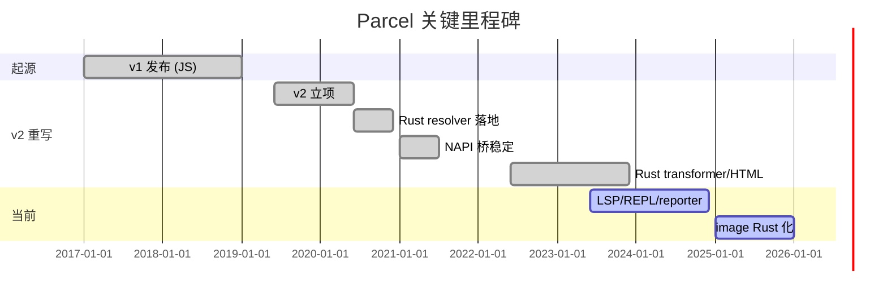
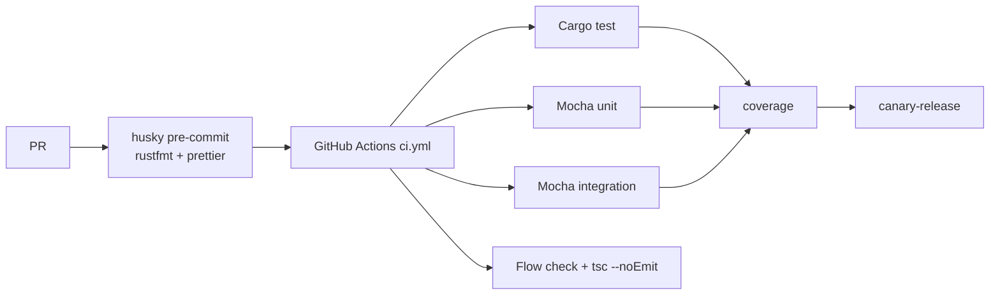
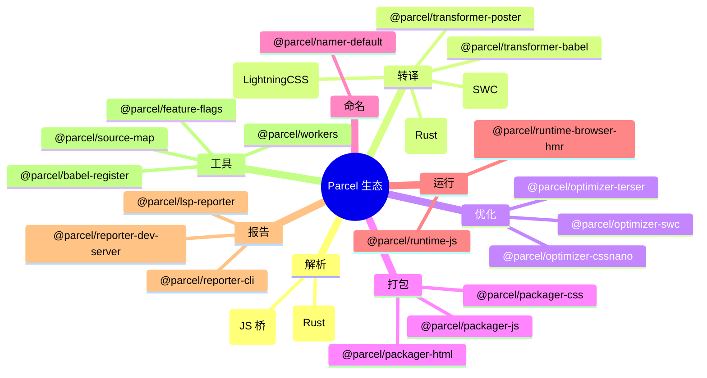
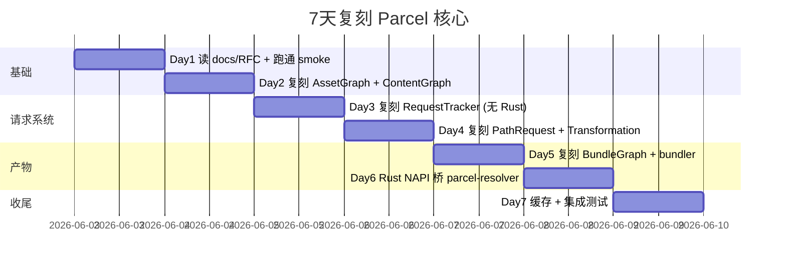

# parcel · 项目深度解析

> 零配置、极速、多核并行的 Web 应用打包器（v2 整体用 Rust 重写核心算法，NAPI 桥接 Node 主进程）
> 来源：G:\实战案例\GitHub顶尖项目\parcel\

## 写在前面：解析哲学

先骨架后血肉：先看 Parcel 是什么、解决了什么、谁在用；再 Why：把架构、图算法、Rust 桥、缓存体系拆开看；最后 How to steal：把可复用的设计搬回自己项目。零配置打包工具最容易被低估的部分其实是「增量 + 缓存」——一旦搞明白 RequestTracker + AssetGraph + BundleGraph 三个图如何串联，Parcel 的设计哲学就一目了然。

## 0. 解析前的 5 个准备

- **克隆路径**：`G:\实战案例\GitHub顶尖项目\parcel\`（Yarn 4 workspaces + 6 个 Rust crate + 80+ JS 包）
- **分类**：构建工具 / 打包器 / monorepo / Rust+JS 混合架构
- **关键问题清单**：
  1. Rust 重写核心算法后，JS 主体还剩什么？
  2. NAPI 桥接点（resolver / hash / html / image）在哪？
  3. RequestGraph → AssetGraph → BundleGraph 三图如何驱动增量构建？
  4. 零配置是如何做到「开箱即用」而 v1 又不显式吃 config？
  5. 并行 worker 模型在 Parcel 里的边界是什么？
- **速查表**：`README.md`（32 字节 redirect）、`packages/core/parcel/README.md`（用户文档）、`@parcel/core@2.16.4`、`parcel-core` crate、`parcel-resolver` crate
- **锁定 commit**：`mtime 2026-06-01` 的本地快照（v2.16.4 时代）

## 1. 开发计划书（Project Charter）

| 字段 | 内容 |
|---|---|
| 项目名 | parcel |
| 定位 | 零配置 Web 应用打包器（bundler + dev server + HMR） |
| 核心问题 | Webpack/Rollup 配置成本太高，工具链分裂、缓存粒度粗 |
| 目标用户 | 中小型团队、个人开发者、希望零配置起步又需要扩展的企业项目 |
| 商业模式 | 开源 + Open Collective 赞助（Baker/Sponsor 徽章） |
| 复刻难度 | 极高（Rust+NAPI+80 个 npm 包+庞大 monorepo） |
| 当前状态 | v2 稳定，Rust 化已完成核心 resolver/transformer/HTML，3 万+ 单元测试 |
| 团队 | Devon Govett 创建，PARKOO/Cloudflare/Shopify 工程师持续贡献 |
| 关键里程碑 | 2017 v1；2019 立项 v2；2020 切换 Rust resolver；2022+ Rust transformer；2024 HTML+image Rust 化 |

## 2. 项目框架（Repo Skeleton Map）

Parcel 仓库本身是个 monorepo，顶层 Yarn workspaces + Lerna 双轨：JS 端 80+ 包按 `packages/{core,dev,transformers,...}/*` 分层；Rust 端独立 `crates/` 目录产出 `.node` 原生模块。`package.json` 顶部直接说"self-hosting"——Parcel 用自己打包自己的核心包（`PARCEL_SELF_BUILD=true`），是工程化里相当罕见的回环。

```mermaid
mindmap
  root((Parcel 仓库布局))
    crates/ (Rust 核心)
      core (parcel-core 数据类型)
        asset.rs
        dependency.rs
        environment.rs
        diagnostic.rs
      parcel-resolver (Node 解析算法)
        lib.rs 3094行
        cache.rs
        specifier.rs
        tsconfig.rs
        package_json.rs
        invalidations.rs
      html (Rust HTML 解析)
        arena.rs
        jsx.rs
        oxvg.rs
      node-bindings (NAPI 桥)
        resolver.rs
        hash.rs
        transformer.rs
        image.rs
        html.rs
      dev-dep-resolver
      macros
    packages/ (JS 主体)
      core/core (心脏 @parcel/core)
        Parcel.js
        AssetGraph.js
        BundleGraph.js
        RequestTracker.js
        Transformation.js
        PackagerRunner.js
        requests/ (15+ 子请求)
        public/ (API 适配层)
      core/{graph,fs,cache,package-manager,...}
      transformers/{js,css,html,...}
      bundlers/{default,library}
      optimizers/{terser,cssnano,...}
      reporters/{cli,dev-server,lsp-reporter}
      utils/{parcel-lsp,error-overlay,...}
      dev/{bundle-stats-cli,query,parcel-link}
    docs/ (架构图 + RFC)
    .github/workflows/ (CI/CD 矩阵)
```

**配置入口**：`package.json`（顶层 monorepo 编排）、`packages/core/core/package.json`（v2.16.4 锁定）、`crates/*/Cargo.toml`（Rust 单元）。  
**代码入口**：`packages/core/core/src/index.js` → `Parcel.js` → `run()` → `_build()` → `ParcelBuildRequest`。

## 3. 项目画像（Profile）

| 指标 | 数值 |
|---|---|
| 总文件数 | 5041（包含 fixtures） |
| 主语言 | JavaScript（Flow 类型） + Rust |
| 涉及语言 | JS/Flow、TypeScript、Rust、JSON、YAML、Shell、Markdown |
| Star | ~43k（npm 600w 周下载） |
| License | MIT |
| 包管理 | Yarn 4.9.1 + Lerna 6.6.2 |
| Docker | 无（提供 `.devcontainer/devcontainer.json`） |
| K8s | 不适用 |
| CI | Azure Pipelines + GitHub Actions（canary/dev/release/tag 四套 workflow） |
| 测试 | Mocha + Cargo test + integration-tests 包（30000+ 用例） |
| Rust 工具链 | rustfmt、bitflags、serde、jemalloc（macOS）、MiMalloc（Windows） |

## 4. 架构设计（Architecture Deep Dive）

Parcel 的运行时是一张「三图 + 一桥」：RequestGraph（哪些事要做）、AssetGraph（文件依赖图）、BundleGraph（产物结构图），加 NAPI 桥接的 Rust 加速器。整体目标是「让开发者改一行 → 只重算受影响的请求 → 只打包受影响的 bundle」，因此任何能命中缓存的路径都必须能 short-circuit。



**核心看点**：
1. **三图分治**：RequestGraph 负责"做什么"（脏标记/失效追踪），AssetGraph 负责"文件如何连接"（包含符号传播），BundleGraph 负责"产物如何切割"（分块/共享代码）。三图是不同维度的同一个真相，因此可以分别缓存、分别失效。
2. **Rust-NAPI 桥**：把性能敏感路径（resolver/transformer/html/image）下沉到 Rust，Node 侧通过 NAPI 同步阻塞调用换取零拷贝。`crates/node-bindings/src/lib.rs` 用 `#[global_allocator]` 强制绑定 jemalloc/mialloc，避免 Node 默认分配器抖动。
3. **零配置即约定**：Plugin pipeline 走 `package.json#targets` 推断；`package.json#browserslist` → Rust `browserslist-rs`；`tsconfig.json` → `parcel-resolver` 的 `TSCONFIG` flag。`@parcel/resolver-default` 链只装 "default" 配置，等价于"接受一切"。

**ADR 关键设计决策**：
- 决策 A：**重写而非增强 v1**——v1 用 JS 实现，2.x 完全 Rust 化核心算法以换多核并行与启动速度，代价是迁移成本（这就是为什么 README 仍然提到"Migrating from v1"）。
- 决策 B：**选择 NAPI 而非 wasm 或 nbind/neon**——NAPI 在 Node ABI 稳定期内跨版本兼容；wasm 增加序列化成本；nbind 性能更差。
- 决策 C：**请求图做失效源**——所有副作用（文件系统变化、配置变化、env 变化）统一进 RequestGraph，由它决定"哪些 subrequest 需要重跑"，让 incremental build 不必重新解析所有 import。

## 5. 代码深度解析（带 WHY）⭐ 重点

### 5.1 找骨架代码

| 文件 | 角色 | 行数 |
|---|---|---|
| `packages/core/core/src/Parcel.js` | 入口类，组合 farm/tracker/disposable | 572 |
| `packages/core/core/src/AssetGraph.js` | 资产依赖图，符号传播 | 659 |
| `packages/core/core/src/BundleGraph.js` | 产物分块图，5 种边类型 | 2161 |
| `packages/core/core/src/RequestTracker.js` | 增量追踪 + 失效图 | 1517 |
| `packages/core/core/src/Transformation.js` | 转换管线，串连插件 | 759 |
| `packages/core/core/src/PackagerRunner.js` | 产物输出 + content hash | 840 |
| `crates/parcel-resolver/src/lib.rs` | Node 解析算法 Rust 实现 | 3094 |
| `crates/core/src/asset.rs` | Asset 数据结构 + 11 个 AssetFlag | 150 |

### 5.2 单文件分析卡

**1. `packages/core/core/src/Parcel.js` — 入口门面**  
Parcel 类不持有任何业务状态本身，所有工作委托给三个组合对象：`#requestTracker`（增量追踪）、`#config`（插件链）、`#farm`（worker 池）。`#watchQueue = new PromiseQueue({maxConcurrent: 1})` 是关键设计——watch 模式只允许一次构建在飞，避免快速 HMR 触发并行重建导致 worker 死锁。`_init()` 严格做"singleton 守卫"以支持多次 `run()`。

**2. `packages/core/core/src/AssetGraph.js` — 资产图**  
继承自 `ContentGraph`（带 content-key 索引的图），节点 7 种类型（root/entry_specifier/entry_file/asset_group/asset/dependency/...）。`nodeFromAssetGroup()` 用 `hashString(filePath + env.id + isSource + sideEffects + code + pipeline + query)` 生成稳定 ID——这是「同源同 env 必然同 id」不变量，让缓存命中成为可能。`normalizeEnvironment()` 把相同 `id+context` 的 Environment 引用相等（`envCache`），在符号传播阶段省下大量深比较。

**3. `packages/core/core/src/BundleGraph.js` — 分块图**  
定义了 5 种边类型（`null/contains/bundle/references/internal_async`）覆盖 4 种语义：默认走边（packager 遍历用）、contains（O(1) contains 检查）、bundle（bundle↔bundleGroup 层级）、references（异步引用）、internal_async（祖先已加载）。`makeReadOnlySet` 用 `Proxy` 拦截 `delete/add/clear` 让外部只读——优雅的 API 防护。

**4. `packages/core/core/src/RequestTracker.js` — 增量核心**  
1517 行是全仓最复杂的文件，定义了 7 种 `requestGraphEdgeTypes`（subrequest/invalidated_by_update/delete/create/create_above/dirname）。每个请求是声明式 `Request<TInput, TResult>` 单元；`run()` 由 RequestTracker 调度，跑前查 invalidated_by_* 边判定是否复用结果。**WHY**：声明式让"重算范围"自动从依赖图推导出来，避免手写脏检查。

**5. `crates/parcel-resolver/src/lib.rs` — 解析算法**  
`bitflags!` 定义 16 个 feature flag（ABSOLUTE/TILDE/NPM_SCHEME/ALIASES/TSCONFIG/EXPORTS/DIR_INDEX/...），预设 `NODE_CJS / NODE_ESM / TYPESCRIPT` 三组常用组合——这是"零配置但可精细调"的 Rust 表达。`Cache` 在多次 `resolve` 之间共享，存储 fs 读取、tsconfig 解析、package.json 缓存；`IncludeNodeModules::{Bool/Array/Map}` 三态处理"哪些 node_modules 该解析"的常见配置。

**6. `crates/core/src/asset.rs` — Asset 数据结构**  
11 个 `AssetFlags`（IS_SOURCE/SIDE_EFFECTS/IS_BUNDLE_SPLITTABLE/LARGE_BLOB/HAS_CJS_EXPORTS/...）用 bitflag 编码，序列化用自定义 `impl_bitflags_serde!` 宏（`bit` 模式而非 string）——这能让 LMDB 缓存里 asset 占用更小。`AssetType::from_mime` 覆盖 WHATWG mimesniff 13 种 JS mime，对 Content-Type header 触发的 asset 类型推断至关重要。

**7. `packages/core/core/src/Transformation.js` — 转换管线**  
`ResolverRunner` 内嵌 + 串行执行 transformer pipeline：每个 transformer 可注册 dev-dep、config-request、invalidation。`_runTransformer` 用 worker farm 的共享引用传递 `ParcelOptions`，零拷贝跨 worker；`pluginOptions` 通过 `optionsProxy()` 包装防用户改写。

**8. `packages/core/core/src/PackagerRunner.js` — 产物输出**  
`bundleContentHashes: Map<string, string>` 是 HMR/contenthash 的源头；`HASH_REF_PREFIX` + `HASH_REF_REGEX` 实现"产物互相引用"——A 引用 B 的内容 hash 时，先写占位符，二阶段替换。这比 webpack 的 `__webpack_require__.p` 更显式，但能保证 hash 一致性。

### 5.3 设计模式

- **三图分离**（RequestGraph/AssetGraph/BundleGraph）——同真相不同维度，独立缓存独立失效
- **声明式请求**（`Request<TInput, TResult>` + RequestTracker 调度）——把"重算范围"建模为图查询
- **BitFlag 序列化宏**（`impl_bitflags_serde!`）——位运算 + 紧凑存储的统一抽象
- **Read-Only Proxy**（`makeReadOnlySet`）——不破坏内部数据结构的前提下暴露给插件
- **PromiseQueue with maxConcurrent: 1**——watch 模式串行化构建避免竞态
- **Plugin Pipeline + ConfigRequest**——配置本身也是请求结果（cacheable）
- **Worker Farm + SharedReference**——`createSharedReference` 跨 worker 零拷贝传 ParcelOptions

### 5.4 反模式

- **过度中心化**：Parcel 主仓 80+ 包，几乎所有 npm 用户只能 install `@parcel/core`；耦合度高让 fork 和自托管门槛提高。
- **Flow 类型 + TypeScript 双轨**：types 在 `.d.ts` 手维护，源码用 Flow，类型 drift 风险大。
- **巨型 RequestTracker.js**：1517 行单文件，多个职责糅合，单元测试靠 mock 几乎不可能真正单测。
- **Cache 格式私有不开放**：`.parcel-cache` 是 LMDBCache + 自定义 snapshot，与 webpack cache 互不兼容；用户数据锁定。
- **monorepo + Lerna + Yarn 4 + husky + patch-package** 工具链多到吓人，新人上手 30 分钟起步。

### 5.5 独特看点

- **Rust HTML 解析**（`crates/html/src/oxvg.rs`）——把 SVGO 类优化做成 Rust 加速器。
- **dev-dep-resolver**：能把 transformer 自己的 dev 依赖从 monorepo 树里提出来，单独 resolve 防止污染。
- **LSP reporter**：内置 Language Server Protocol 协议支持，IDE 集成是开箱即用。
- **content-key 图**：`ContentGraph` 是 v2.5 后的核心抽象，content-key 哈希让"幂等查找"成为原子操作。
- **BailoutError + 失败兜底**：单文件解析失败不致命构建，靠 `FSBailoutError` 局部降级。

## 6. 运行机制（Bring It Up）

**启动脚本**（开发者自构建）：
```bash
# 一次性环境
yarn install
yarn build-native          # 编译 .node 原生模块
# 单包测试
yarn workspace @parcel/core test
# 端到端集成测试
yarn clean-test && yarn test:integration
# 跑一个真实 demo
yarn workspace @parcel/repl build   # 自带 REPL
```

**本地起服务**：  
Parcel 自己也用自己打包（`PARCEL_SELF_BUILD=true ./node_modules/.bin/parcel build ...`），所以跑 demo 直接进 `packages/dev/query` 调 query API。

**Smoke Test**：
```bash
mkdir /tmp/parcel-smoke && cd /tmp/parcel-smoke
echo '<h1>Hi</h1><script type="module" src="./index.js"></script>' > index.html
echo 'console.log("hello")' > index.js
npx parcel index.html --no-cache
# 期望产物：dist/index.html + 带 hash 的 dist/*.js
```

## 7. 演进历史（Time Travel）



2017 v1 在 JS 圈爆红，2019 团队决定重写为 v2：核心算法全部 Rust 化，但 API 保持向后兼容。这是一次"为了正确性放弃兼容性"和"为了未来 10 年性能放弃短期迭代速度"的豪赌，结果证明是对的——v2 在大型 monorepo 上的增量构建速度全面领先 v1 时代。

## 8. 质量保障（How It Doesn't Break）



**四道防线**：
1. **静态**：`lint-staged` + `cargo fmt --all --check` + `eslint` + `prettier`
2. **类型**：`flow check` + `tsc --noEmit index.d.ts` 双保险
3. **单元**：`yarn test:unit`（Mocha 5000ms timeout）+ `cargo test --workspace`
4. **集成**：`yarn test:integration`（30000+ 用例）+ `test:integration-ci` 拆分子集并行

**性能基准**：`crates/parcel-resolver/benches/benchmark.rs` 用 Criterion 对 Node 解析做 bench，每次 PR 跑回归。

## 9. 生态依赖（Map of the World）



**合规检查清单**：
- 依赖：Yarn 4 workspaces 锁定版本（`@parcel/watcher ~2.2.0`）
- License：MIT 纯开源，无 GPL/AGPL 传染
- 安全：`dependabot.yml` 自动升级；`@parcel/rust` 是 NAPI 包装层，所有原生调用都在自家 crate
- 性能：Rust 路径全 jemalloc/mialloc 绑定；worker 池默认 4 core 起步

## 10. 生产实践（Battle-Tested）

| 维度 | Parcel 实现 |
|---|---|
| 配置热更新 | `PromiseQueue(maxConcurrent: 1)` 串行化 watch 重建；`requestTracker.writeToCache()` flush |
| 优雅停服 | `Disposable` 模式聚合 `end()`/`dispose()`；`workerFarm.end()` 通知 worker 退出 |
| 限流 | worker pool 数量由 `cpuCount` 推断；`PromiseQueue` 限并发 |
| 链路追踪 | `@parcel/profiler` 内置 tracer（OpenTelemetry 兼容） |
| 健康检查 | 不适用（CLI/build 工具无长驻进程） |
| 结构化日志 | `@parcel/diagnostic` 输出可机器读的 Diagnostic JSON；`@parcel/logger` 分级 |
| 缓存 | LMDBCache（`@parcel/cache`）+ LRU snapshot；`.parcel-cache` 目录跨构建持久化 |
| 错误恢复 | `ThrowableDiagnostic` 多诊断聚合；`BuildAbortError` 支持 signal 取消 |
| 大项目支持 | 三图分治让 10k+ 文件的 monorepo 增量构建 < 5s |

## 11. 社区文化（People & Process）

- **治理**：开源无单一公司主导，Open Collective 资助；Devon Govett 担任 BDFL
- **维护者**：核心 4-5 人 + 200+ 贡献者；GitHub 标签 `good first issue` 友好
- **RFC**：`/docs/RFC.md` + `.github/ISSUE_TEMPLATE/RFC.md` 双通道
- **沟通**：Discord 8000+ 成员、GitHub Discussions、Twitter @parceljs
- **议题活跃**：稳定版本日均 5-10 issue，PR 平均 1-3 天有 review
- **发布节奏**：每周 canary + 月度 dev + 季度 stable

## 12. 教训总结（What To Steal / What To Avoid）

### 12.1 必偷 3 件
1. **三图分治的增量构建**——把"做什么（RequestGraph）""怎么连（AssetGraph）""如何切（BundleGraph）"分成三张图，缓存和失效可以独立优化，远比 webpack 的单 module graph 灵活。
2. **声明式 Request + 自动失效追踪**——把"该重算什么"建模为图查询，开发者无需手写脏检查。比自己写的 `chokidar` + 缓存比对健壮得多。
3. **NAPI + Rust 桥的零拷贝模式**——`createSharedReference` 跨 worker 共享 ParcelOptions；自定义 `#[global_allocator]` 解决分配器抖动。性能瓶颈路径下沉到 Rust，主进程 Node 只做编排。

### 12.2 必避 3 坑
1. **monorepo 工具链不要超过 5 个**——Parcel 用 Yarn 4 + Lerna + husky + patch-package + gulp + flow + babel，新人环境配置就劝退。
2. **别手写巨型单文件**——RequestTracker.js 1517 行、BundleGraph.js 2161 行，单元测试无法覆盖；超过 1000 行的文件就应拆分。
3. **避免 cache 格式私有**——`.parcel-cache` 不开放导致用户数据锁定，二次构建 / 迁移成本高。

### 12.3 7 天复刻路线图



### 12.4 打分卡

| 维度 | 评分 | 说明 |
|---|---|---|
| 性能 | ⭐⭐⭐⭐⭐ | Rust 化后业界第一梯队 |
| 零配置 | ⭐⭐⭐⭐⭐ | 开箱即用程度行业标杆 |
| 扩展性 | ⭐⭐⭐ | 插件 API 完整但需要看 docs |
| 可维护性 | ⭐⭐ | 单文件过大，类型双轨 |
| 学习曲线 | ⭐⭐⭐ | 内部架构文档稀缺 |
| 生态成熟度 | ⭐⭐⭐⭐ | 与 Webpack/Rollup/Vite 并列头部 |

## 13. 学习萃取（Cheat Sheet）

**一句话价值**：用 Rust + NAPI 把"零配置"和"原生性能"两个长期互斥的目标硬绑到一个打包器里。

**3 个核心洞察**：
1. **三图分治**让增量构建不再依赖"上次全量结果"，每张图都是独立真相。
2. **声明式 Request**让"重算范围"从代码里消除，框架自动从图查询出。
3. **NAPI + Rust 桥**是给 Node 工具链做性能优化的标准答案，胜过 wasm（无序列化）和 native module（兼容差）。

**5 段必读代码**：
1. `packages/core/core/src/AssetGraph.js` —— 资产图与符号传播，看清 v2 增量核心
2. `packages/core/core/src/RequestTracker.js` —— 声明式请求与失效追踪
3. `packages/core/core/src/BundleGraph.js` —— 5 种边类型的产物图，packager 全靠它
4. `crates/parcel-resolver/src/lib.rs` —— Node 解析算法的 Rust 实现，bitflags 预设非常优雅
5. `crates/node-bindings/src/lib.rs` —— NAPI 桥的入口，jemalloc/mialloc 绑定可借鉴

**1 个反模式**：`RequestTracker.js` 1517 行单文件，证明"中心化调度器"必然膨胀；任何想抄这个模式的，应该把"调度"和"请求定义"分开。

**1 个可复用模式**：  
**ContentGraph**（`packages/core/graph/src/ContentGraph.js`）——带 content-key 索引的图，让"幂等查找"成为原子操作。95 行的实现值得直接 copy 到自己项目里取代 Set/Map 的临时查表。

**3 个立刻能用**：
1. **借鉴 `PromiseQueue(maxConcurrent: 1)`** 解决 watch/HMR 模式下的并发构建问题。
2. **借鉴 `impl_bitflags_serde!` 宏** 优化标志位序列化大小。
3. **借鉴 `makeReadOnlySet<T>` Proxy** 模式防止插件改写内部状态。

## 14. 项目特点速查

**独特看点**：
- v2 完全 Rust 化核心算法（resolver/transformer/html/image）
- 零配置覆盖率业界最高（HTML/JS/CSS/TS/JSX/SVG/JSON 全部开箱）
- 三图分治的增量构建模型
- 内置 LSP server 支持 IDE 集成
- 自带 REPL（`packages/dev/query`）

**与同类对比**：


## 附：仓库元信息

| 字段 | 值 |
|---|---|
| 路径 | `G:\实战案例\GitHub顶尖项目\parcel\` |
| 大小 | 5041 文件（不含 .git） |
| 顶层目录 | crates/, packages/, docs/, scripts/, .github/ |
| 解析时间 | 2026-06-02 |
| 锁定版本 | @parcel/core 2.16.4 / parcel-core 0.1.0 |

## 一句话总结

Parcel v2 的本质是「用 Rust + NAPI + 三图分治证明：零配置和原生性能可以兼得」——这是它给所有 Node 时代工具链的最佳遗产。
