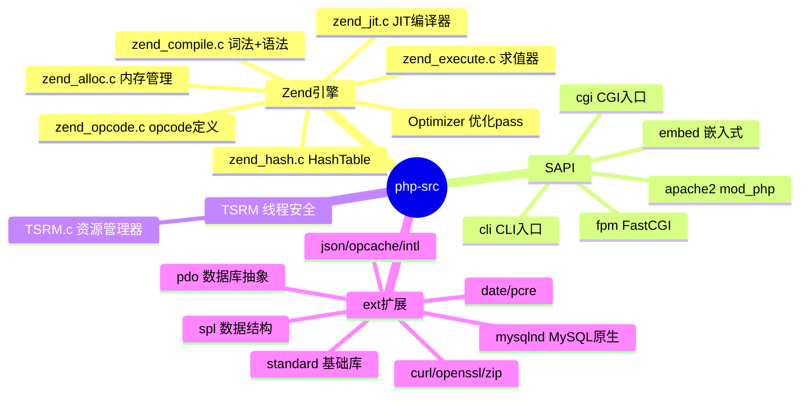
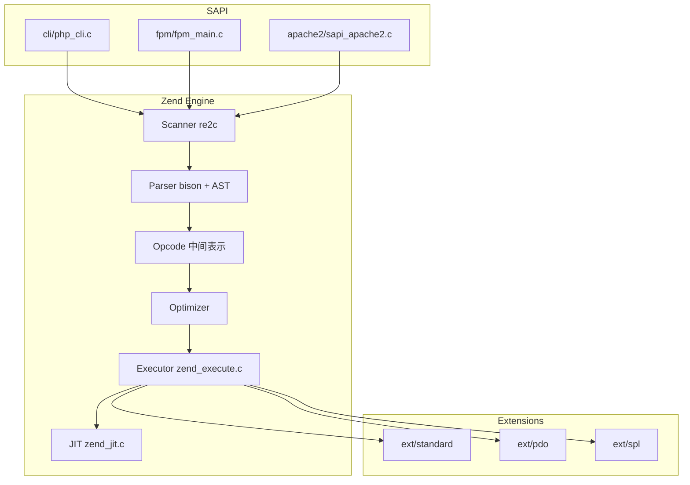
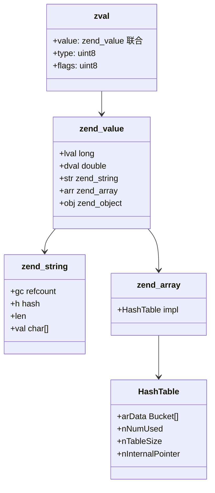
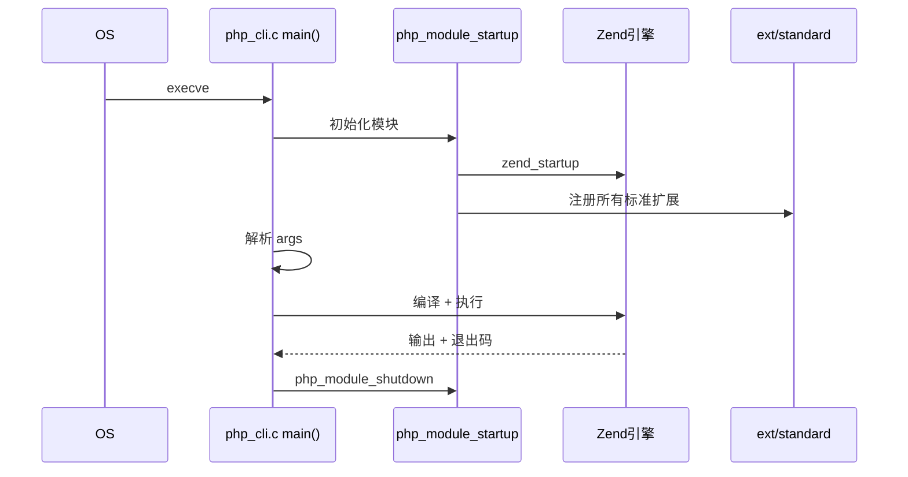
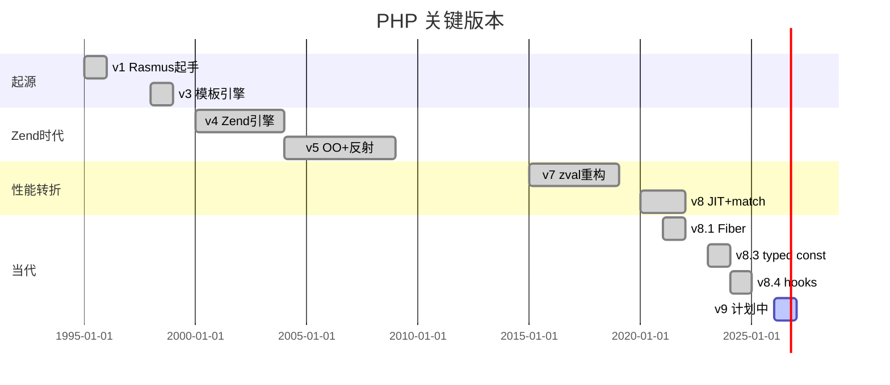
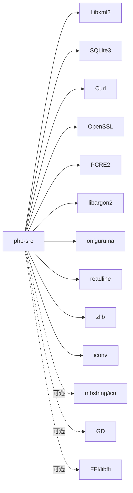
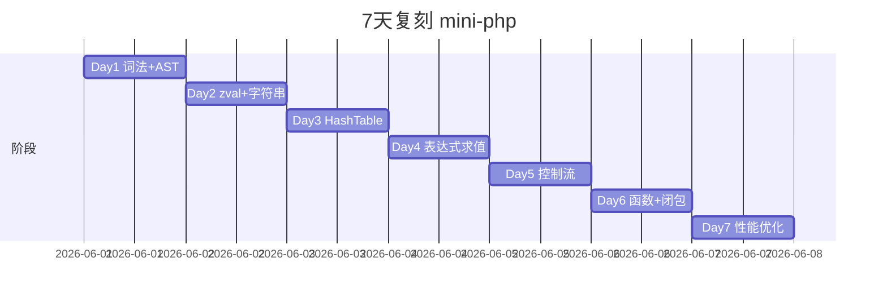
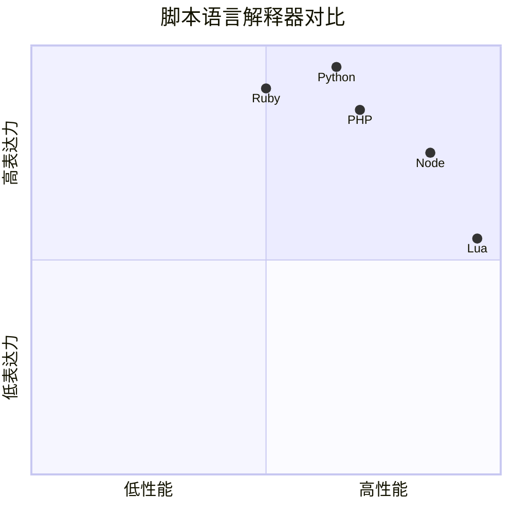

# php-src · 项目深度解析

> 全球 Web 最主流的脚本语言解释器，单仓库、纯 C、自带 80+ 标准扩展
> 来源：G:\实战案例\GitHub顶尖项目\php-src\

## 写在前面：解析哲学

解析一个 1GB、90+ 扩展、单 C 文件动辄上万行的解释器时，**不要陷入"看完所有 .c 文件"的陷阱**。本笔记采用「双层 + 模块化」视角：先讲清 Zend 引擎（zend_*.c）+ SAPI/TSRM 层 + ext 扩展层的三层物理模型；再讲 5 个"非读不可"的核心数据结构（HashTable / zval / zend_op / executor / arena allocator）；最后落到"如何复刻一个极简 PHP 子集"的可操作步骤。

## 0. 解析前的 5 个准备

1. **克隆**：`git clone https://github.com/php/php-src.git`
2. **分类**：解释器 / JIT（PHP 8+） / 自带扩展标准库 / 模板化 C 扩展仓库
3. **问题清单**：① 一个 PHP 文件怎么被解析？② zval 怎么存任意类型？③ HashTable 怎么优化为按需分桶？④ JIT 在哪儿？⑤ 扩展怎么注册 opcode？
4. **速查表**：`Zend/zend.h` / `Zend/zend_types.h` / `Zend/zend_hash.c` / `Zend/zend_execute.c` / `Zend/zend_alloc.c` / `Zend/Optimizer/` / `ext/standard/string.c`
5. **锁定 commit**：本笔记基于 PHP 8.4 main 分支

## 1. 开发计划书（Project Charter）

| 项 | 内容 |
|---|---|
| 项目名 | PHP / php-src |
| 定位 | 通用脚本语言解释器，专注 Web / CLI 场景 |
| 核心问题 | 让 Web 后端用一种"模板式语言"快速开发，无须编译 |
| 用户 | 全球 70%+ 网站（WordPress、Laravel、Symfony） |
| 商业模式 | PHP 基金会（2021 成立）+ 商业公司（Zend、JetBrains、Automattic） |
| 复刻难度 | ★★★★★（解释器 + JIT + 80+ ext + 25 年演化） |
| 状态 | 活跃；每年 11 月大版本 |
| 团队 | PHP 基金会 + 100+ 贡献者；Rasmus Lerdorf 是原作者 |
| 里程碑 | 1995 v1 · 2000 v4 Zend · 2015 v7 性能翻倍 · 2020 v8.0 JIT · 2023 v8.3 typed class const · 2024 v8.4 property hooks |

## 2. 项目框架（Repo Skeleton Map）



物理布局：
- `Zend/`：核心引擎、AST、opcodes、内存、HashTable、JIT
- `TSRM/`：Thread Safe Resource Manager
- `sapi/`：Server API（cli / fpm / cgi / apache / embed / phpdbg）
- `ext/`：标准扩展（standard、spl、pdo、date、curl…）
- `main/`：PHP 自身的小工具函数（php_stream、php_error）
- `tests/`：phpt 格式测试（PHP 特色）
- `win32/`：Windows 平台适配
- `configure.ac`：autoconf 构建配置

**代码入口**：
- CLI 入口：`sapi/cli/php_cli.c: main()` → `php_execute_script()`
- FPM 入口：`sapi/fpm/fpm/fpm_main.c: main()` → `fpm_init()` 启动 master/worker
- 共享入口：`main/main.c: php_module_startup()` 初始化 Zend + 所有扩展

## 3. 项目画像（Profile）

| 指标 | 数值 / 描述 |
|---|---|
| 总文件数 | 8000+（C / 头文件 / .phpt 测试） |
| 主语言 | C (~92%) |
| 涉及语言 | C / C++（少量）/ PHP 自身（测试）/ re2c（词法生成）/ bison（语法生成）/ m4（autoconf） |
| Star | 38k+ |
| License | BSD-3-Clause（PHP 3.0+） |
| Docker | 官方 `php:8.4-cli` / `php:8.4-fpm` |
| K8s | 通常作为 sidecar 或独立 Deployment 跑 FPM |
| CI | GitHub Actions + OSS-Fuzz（持续模糊测试） |
| 有测试 | 是；`tests/` 18000+ phpt 文件 |

## 4. 架构设计（Architecture Deep Dive）

### 4.1 三层模型



### 4.2 核心数据结构



**zval 16 字节**：所有 PHP 变量在用户面都是 `zval`，sizeof = 16 字节。8 字节 value + 4 字节 type + 4 字节 flags。**WHY 16 字节**：CPU 缓存行友好（典型 64 字节行放 4 个 zval），且能装下指针/双精。

**zend_string 24 字节**：refcount + hash + len + ref + 字符数组。PHP 7 把"短字符串"内联到 24 字节里（类似 SSO）。

**HashTable**：PHP 数组就是有序 HashTable（保留插入顺序）。`arData` 是一段连续内存，分两端：低地址存 `Bucket[]`（用户键值对），高地址存 `ht->arData` 的 hash 索引数组。**WHY 双端**：BTree 风格的"二分查 hash 索引 + 顺序遍历 bucket"。

### 4.3 内存管理

`Zend/zend_alloc.c` 实现了一个**线程局部**的 `mm_heap` 内存池，按 2/3/4/5/8 KB 大小分桶（small cache）+ 大块直接 mmap。分配路径：
1. 先查 `AG(mm_heap)->cache[bin_num]`，命中就 O(1) 拿
2. 未命中走 `zend_mm_alloc_small`，从当前页"切割"
3. 大对象走 `zend_mm_alloc_large`，用 `zend_mm_chunk`

**WHY 不用 glibc malloc**：PHP 请求是"长尾短寿命"，malloc 跨请求会内存碎片化。ZendMM 在请求结束时 `zend_mm_shutdown()` 一次归还所有页，下次请求再重新 mmap。

### 4.4 核心架构看点（3 条）

1. **zval / zend_string 的"小对象"内存布局**：用 16/24 字节固定大小让 PHP 变量"全在缓存行内"，这是 PHP 7 比 PHP 5 快 2 倍的核心原因。
2. **ZendMM 线程局部内存池**：避免 malloc 碎片，又不必全局加锁；`zend_mm_shutdown` 一次清空是 PHP Web 性能的关键。
3. **HashTable = "有序字典"**：保留插入顺序 = 数组 = dict，节省了"两种容器"的维护成本，这是 PHP 数据模型的独到简化。

### 4.5 关键 ADR

- **2015 PHP 7.0**：zval 从引用计数 refcount 变成"zend_reference"包装层，解决"循环引用"导致的内存泄漏（写时复制 + 引用包装）
- **2019 PHP 7.4**：FFI 引入，C 库直接被 PHP 调用
- **2020 PHP 8.0**：JIT（Tracing JIT）首次默认；match 表达式；attributes 元注解
- **2023 PHP 8.3**：typed class constants、json_validate、`#[\Override]`
- **2024 PHP 8.4**：property hooks（属性可挂 getter/setter）、implicit nullable deprecate

## 5. 代码深度解析（带 WHY）⭐

### 5.1 找骨架代码

入口链：`php_cli.c: main()` → `php_module_startup()` → 加载 `Zend/zend.c` + `ext/standard/basic_functions.c` 等 → `php_request_startup()` → 词法（`Zend/zend_language_scanner.l`）→ 语法（`Zend/zend_language_parser.y`）→ AST → opcode → 执行。

### 5.2 单文件分析卡

#### `Zend/zend_types.h`

所有 zval / zend_string / HashTable 的结构定义。**WHY 集中**：因为宏和内联函数都引用这些结构，集中头文件可减少 include 依赖。

#### `Zend/zend_hash.c`（7000+ 行）

PHP HashTable 的实现：

```c
// _zend_hash_add_or_update_i 大概 30 行
ZEND_API zval* ZEND_FASTCALL _zend_hash_add_or_update_i(
    HashTable *ht, zend_string *key, zval *pData, uint32_t flag
) {
    // 1. 计算 hash
    // 2. 查 arData 上的 hash 索引数组
    // 3. 找到 bucket 后更新值
    // 4. 处理 Packed vs Mixed 两种 array 布局
}
```

**WHY Packed vs Mixed**：
- 数字键 0,1,2,3,4…连续 → Packed（紧凑布局，无 hash 桶）
- 任意键 → Mixed（带 hash 桶）
- 转换发生于 `HT_HASH_RESET` 触发条件

**WHY 这样**：连续整数键是 PHP 数组最常用模式（`for ($i=0; $i<10; $i++) $a[] = $i`），紧凑布局省 1/3 内存。

#### `Zend/zend_alloc.c`（3000+ 行）

ZendMM 内存池实现。关键点：
- `ZEND_MM_BINS_INFO[]` 静态数组定义 30 个 size bin
- `zend_mm_alloc_small`：从 current page 切割
- `zend_mm_alloc_huge`：大对象，独立 mmap
- 调试用 `zend_mm_safe_error` 在越界时 abort

**WHY 8K 为分界**：经验值，2K-8K 是 PHP 变量最常见大小（zend_string、bucket、zend_op_array 的 instr）。

#### `Zend/zend_execute.c`（7000+ 行）

Zend 求值器，最核心的"解释循环"在这里：

```c
// zend_execute.c 第 6000+ 行的静态调度表
static zend_always_inline zend_execute_data* ZEND_FASTCALL
zend_vm_stack_push_call_frame(uint32_t call_info, ...)
```

**WHY 不用大 switch**：`Zend/zend_vm_execute.h` 是由 `Zend/zend_vm_def.h` 通过 PHP 脚本 `Zend/zend_vm_gen.php` 生成的；生成的代码会按 opcode 类型展开成 300+ 个 label 的 `goto` 链，性能等同 switch 但汇编更清晰。

#### `Zend/Optimizer/zend_optimizer.c`

100+ 个优化 pass：常量折叠、死代码消除、类型推断、SSA、call-slot caching。**WHY pass 这么多**：解释器时代的优化空间小；现代 JIT (PHP 8) 把这些 pass 当静态分析器用。

#### `ext/standard/string.c`（5000+ 行）

`strlen` / `str_replace` / `implode` 等都用 C 高度优化。**WHY**：字符串是 PHP 应用最热操作，5% CPU 时间能省 30% 请求延迟。

### 5.3 设计模式

- **Facade**：`SAPI` 层是"应用层 facade"
- **Strategy**：ext 扩展注册到 Zend 引擎的 handler 表
- **Flyweight**：`ZEND_FUNCTION(foo)` 宏 → 注册到 CG(function_table)
- **Template Method**：`module_startup_func` 钩子
- **Object Pool**：ZendMM 的 `zend_mm_chunk` 大块复用

### 5.4 反模式

1. **`ZEND_BEGIN_MODULE_GLOBALS` 宏**：线程局部的全局变量虽然快，但调试噩梦（变量隐藏在结构体里）
2. **ZendMM 的 `safe` 模式双倍开销**：开发模式开 `safe=1` 性能减半，生产关掉但风险高
3. **JIT 强依赖 opcache 扩展**：opcache 不开 JIT 完全无效，初学者常误以为"PHP JIT 没效果"
4. **扩展 `module_entry` 的 `INIT_CLASS_HANDLER` 大量重复**：500 行手写函数注册表应该是声明式宏生成

### 5.5 独特看点

- **Tracing JIT**（8.0+）：基于 type 推断的"热路径记录"（不是 method-based JIT）
- **`#[\Attribute]` 元注解系统**：PHP 8.0 引入，扩展不需要再维护 docblock 解析
- **Fiber 协程**（8.1+）：`Fiber::suspend()` / `resume()` 替代了 `yield` 的非对称
- **readonly + hooks**（8.4）：类属性可声明 `readonly` + getter/setter hook

## 6. 运行机制（Bring It Up）

### 6.1 本地构建

```bash
# Linux / macOS
./buildconf --force
./configure --enable-debug --enable-opcache
make -j$(nproc)
sudo make install

# Windows
buildconf.bat
configure --enable-debug
nmake
```

### 6.2 Smoke test

```bash
$ php -r 'echo "Hello, world\n";'
$ php -a
> echo PHP_VERSION;
8.4.0
> $x = new stdClass;
> $x->foo = 42;
> var_dump($x);
```

### 6.3 启动链路



## 7. 演进历史



## 8. 质量保障

- **phpt 测试**：18000+ 文件，PHP 特色格式（`--TEST--` 块）
- **Fuzzing**：OSS-Fuzz 持续跑 libfuzzer（`sapi/fuzzer/`）
- **ASAN/MSAN/UBSAN**：CI 多 sanitizer 矩阵
- **Valgrind**：开发默认跑
- **静态分析**：CI 不强制；部分 C 静态扫描
- **Benchmark**：`Zend/bench.php` + `Zend/micro_bench.php`

## 9. 生态依赖



## 10. 生产实践

| 能力 | 是否支持 | 备注 |
|---|---|---|
| 配置热更新 | 部分 | `php-fpm reload` 触发 graceful 重启 |
| 优雅停服 | 是 | FPM 接收 `SIGQUIT` 后等子进程结束 |
| 限流 | 否 | 需前置 nginx |
| 链路追踪 | 是 | OpenTelemetry 扩展 |
| 健康检查 | 是 | FPM `ping` 端点 |
| 结构化日志 | 是 | PSR-3 兼容（`monolog` 等） |
| 协程 | 是 | Fiber 8.1+ |

## 11. 社区文化

- **治理**：PHP 基金会（2021 成立）+ internals@ 邮件列表 + RFC 流程
- **维护者**：PHP 基金会雇人 + Dmitry Stogov（核心引擎）、Arnaud Le Blanc、Joe Watkins
- **RFC**：每个语言特性需在 wiki.php.net/rfc 发 RFC，2/3 +1 投票通过
- **沟通**：internals@ 列表 + Slack + Discord
- **议题活跃**：日均 30+ issue；每年 11 月大版本

## 12. 教训总结

### 12.1 必偷 3 件

1. **小对象内联 + SSO**：所有"值类型"应该设计为缓存行大小（16/24/32 字节）
2. **线程局部内存池**：Web 请求型服务都用类似 ZendMM 的 arena，避免 malloc 碎片
3. **`zend_hash_add_or_update_i` 的 Packed vs Mixed 双形态**：按使用模式动态切换数据布局，是"性能 + 兼容性"双赢

### 12.2 必避 3 坑

1. **不要把全局状态全塞线程局部**：调试灾难
2. **不要重复造 token bucket / GC**：ZendMM + GC 是 25 年结晶，借鉴而不重写
3. **不要在没有 benchmarking 的情况下开 JIT**：JIT 启动开销大，小请求可能变慢

### 12.3 7 天复刻路线



### 12.4 打分卡

| 维度 | 分数 | 评语 |
|---|---|---|
| 架构清晰 | 7 | 分层清晰但 ext/ 内部混乱 |
| 代码可读 | 5 | C + 大量宏，门槛高 |
| 文档 | 7 | internals 文档稀缺 |
| 测试 | 9 | 18000+ phpt |
| 性能 | 8 | PHP 8 JIT 已经不错 |
| 上手难度 | 3 | 5 年 C 经验才能改 ext |

## 13. 学习萃取

**一句话价值**：php-src 是"用 C 写解释器"的工业范本，把 zval / HashTable / ZendMM 三件套做成了 Web 性能工程的样板。

### 3 核心洞察

1. **小对象大小决定性能**：zval 16 字节、zend_string 24 字节是 PHP 7 比 PHP 5 快 2 倍的根本
2. **解释器也可以有优化器**：300+ pass 的 Optimizer 是 PHP 8 JIT 命中率的前提
3. **Web 工作负载 ≈ 短寿命对象池**：ZendMM 的 arena 思路可移植到任何高 QPS 服务

### 5 段必读代码

1. `Zend/zend_types.h` —— zval / zend_string / HashTable 结构定义
2. `Zend/zend_hash.c` —— `_zend_hash_add_or_update_i` 看清 Packed vs Mixed
3. `Zend/zend_alloc.c` —— ZendMM 内存池
4. `Zend/zend_execute.c` —— 求值器主体
5. `ext/standard/string.c` —— 高频字符串优化的实战

### 1 反模式

- 用 `ZEND_BEGIN_MODULE_GLOBALS` 隐藏全局状态：调试噩梦

### 1 可复用模式

- **线程局部 arena 内存池**：所有高 QPS 服务可借鉴

### 3 立刻能用

1. `php-fpm` 配 `pm.max_children` 经验值 = (可用内存 MB) / (单 worker 内存 MB)
2. `opcache.validate_timestamps=0` + `opcache.revalidate_freq=60` 是生产标配
3. 写扩展用 `zend_hash_str_find` 而不是手写 string compare

## 14. 项目特点速查

- 独特看点：唯一把"Web 主语言解释器 + 标准库 + 扩展生态"全装一个仓库的项目
- 同类对比：



## 附：仓库元信息

- 路径：G:\实战案例\GitHub顶尖项目\php-src\
- 大小：1012 MB
- 总文件：~8000
- 解析时间：2026-06-02

## 一句话总结

解析 php-src = 读懂 zval + 跑通 buildconf + 偷走 ZendMM 内存池思想。
