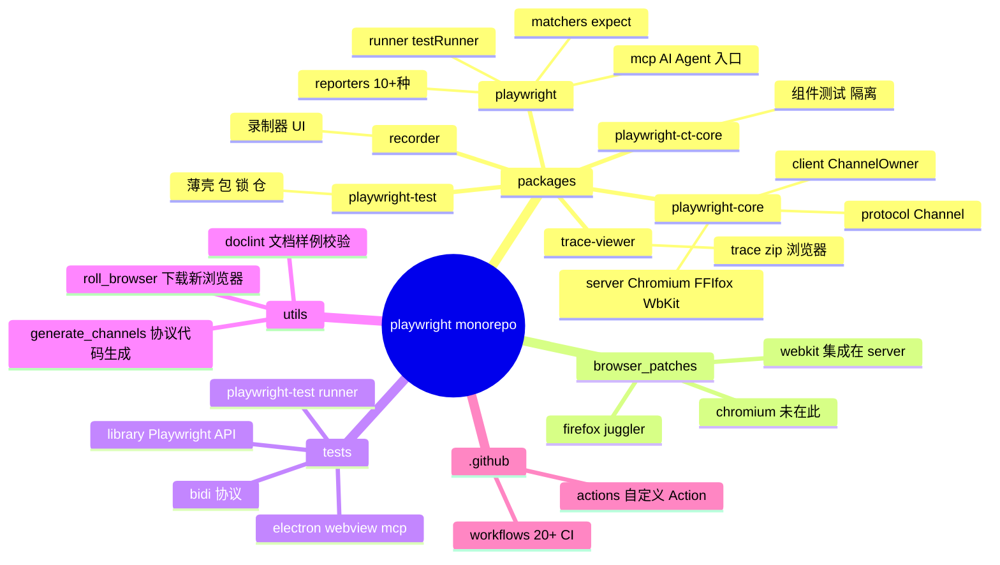
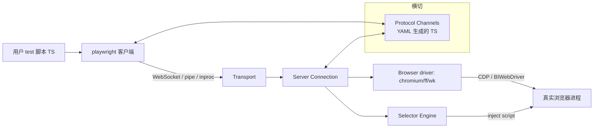
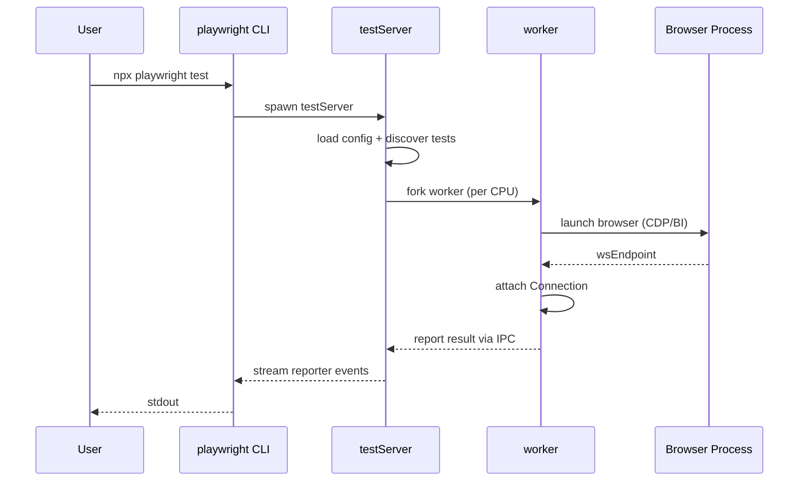
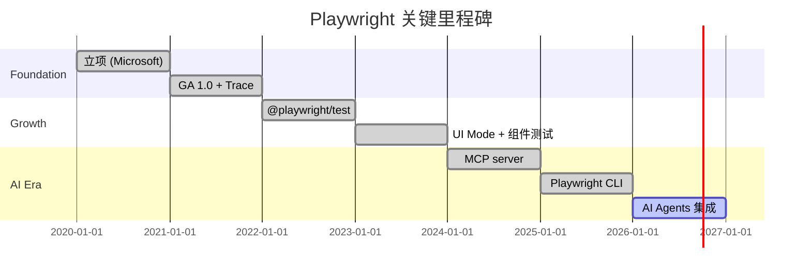
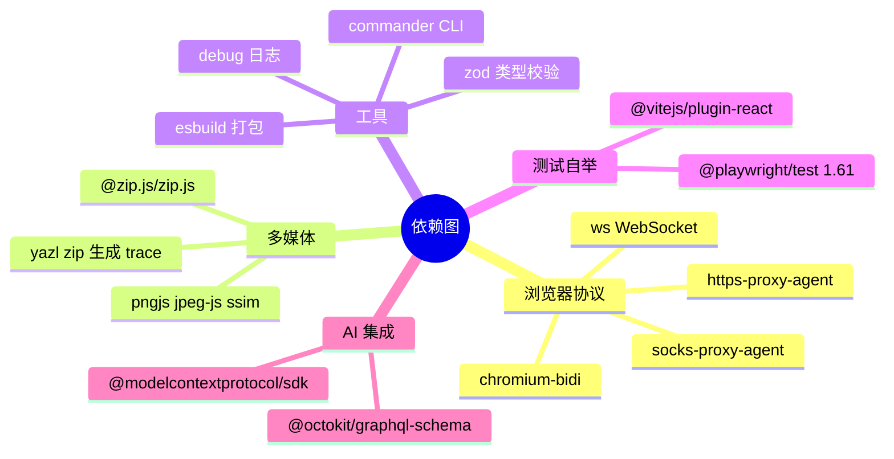
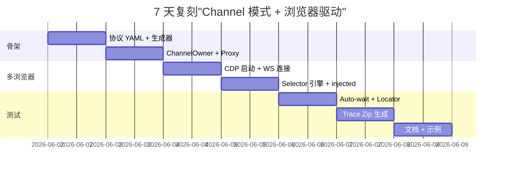
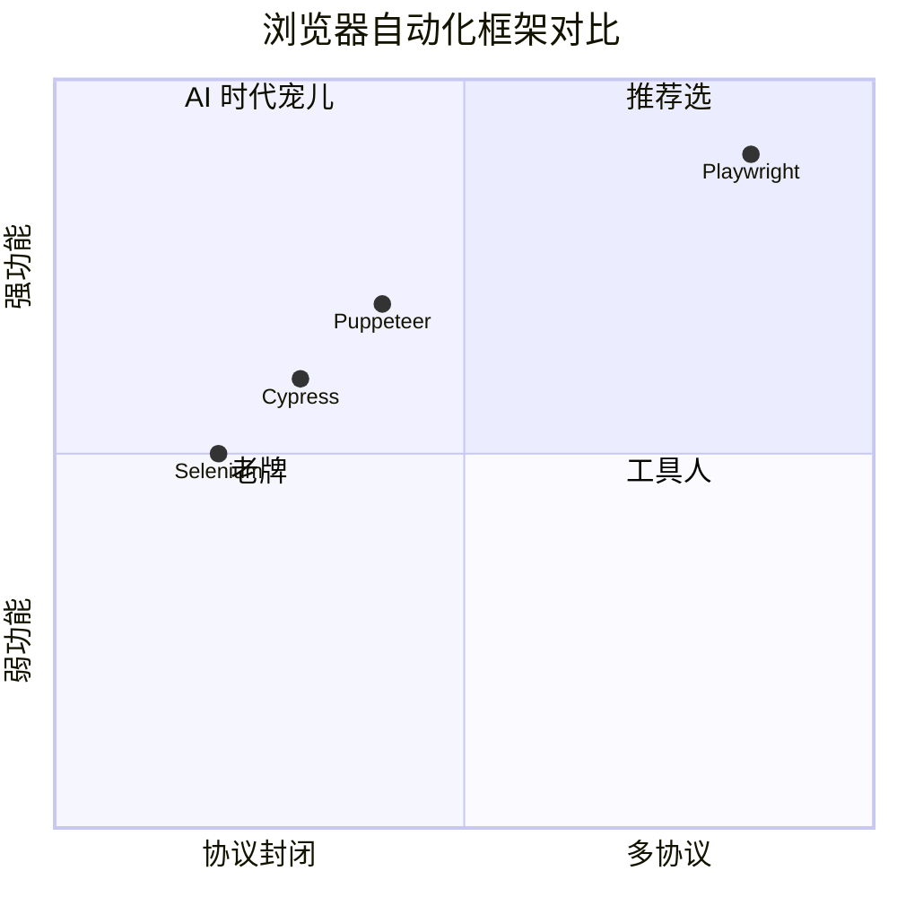

# playwright · 项目深度解析

> 一套用单 API 同时驱动 Chromium/Firefox/WebKit 的现代 Web 自动化与测试框架，同时为 AI Agent 提供 MCP/CLI 入口
> 来源：`G:\实战案例\GitHub顶尖项目\playwright\`

## 写在前面：解析哲学

本笔记按"先骨架后血肉、先 What 后 Why、最后 How to steal"的三段式组织。骨架层面把 Playwright 拆成"客户端 + 协议 + 服务端 + 多浏览器 driver + 测试 runner"五段；WHY 层面追到 `ChannelOwner`、`SelectorEngine`、`EventEmitter-based subscription`、`perMessageDeflate` 这种真实代码机制；steal 层面给出对中小团队可落地的借鉴点（如 selector 引擎、auto-wait、跨进程 IPC）。

## 0. 解析前的 5 个准备

- 仓库路径：`G:\实战案例\GitHub顶尖项目\playwright\`（3200+ 文件，根目录含 monorepo workspaces）
- 分类：浏览器自动化库 + E2E 测试框架 + MCP 工具 + AI Agent 集成
- 关键问题清单：单一 API 如何屏蔽 CDP/BIWebDriver 三协议差异？自动等待如何避免 sleep 写死？Channel 模型如何在远端与本地一致？
- 速查表：核心是 `playwright-core`（无浏览器下载）；`@playwright/test` 是测试 runner；`@playwright/mcp` 是 AI Agent 入口
- 锁定版本：`1.61.0-next`（v1.61 主线，含 Chrome 149 / Firefox 151 / WebKit 26.4）

## 1. 开发计划书（Project Charter）

| 字段 | 内容 |
|---|---|
| 项目名 | Playwright |
| 定位 | 跨浏览器 Web 自动化 + E2E 测试 + AI Agent 浏览器工具 |
| 核心问题 | Selenium 时代：API 不统一、需 sleep、iframe 难处理、调试弱。Playwright 用单一 TS API + 协议无关 Channel + auto-wait + Tracer 一次性解决 |
| 用户 | 前端工程师、QA、爬虫工程师、AI Agent（Claude Code/Copilot） |
| 商业模式 | Apache-2.0 开源，配套托管服务（Azure Playwright Workspace）+ VS Code 扩展 |
| 复刻难度 | 极高——需要同时维护 3 个浏览器 driver 补丁、CDP+BIWebDriver 双协议、SVG 截图对比 |
| 状态 | 活跃开发，v1.61 主线，9.x 后单月多次 release |
| 团队 | Microsoft（核心团队含 Andrey Lushnikov、Pavlo Penenko 等 8+ 工程师），开源贡献者 800+ |
| 里程碑 | 2020 立项 → 2021 GA → 2022 测试 runner → 2023 Trace Viewer UI Mode → 2024 MCP/AI 集成 → 2026 Component Testing 重写 |

## 2. 项目框架（Repo Skeleton Map）



**关键入口**：
- CLI 入口：`packages/playwright/src/program.ts`（被 `playwright-test/cli.js` 转发）
- 核心服务端 bundle：`packages/playwright-core/src/server/index.ts`（用 esbuild 打包成 `lib/coreBundle.js`）
- 协议生成器：`utils/generate_channels/`（从 `protocol.yml` 生成 `channels.d.ts`、`validator.ts`）
- 浏览器补丁：`browser_patches/firefox/juggler/`（自定义 Firefox 协议层，原生 FF 远程调试协议不支持 `Page.frameNavigated` 等事件）
- 配置入口：`playwright.config.ts`（defineConfig，由 `packages/playwright/src/common/configLoader.ts` 解析）

## 3. 项目画像（Profile）

| 维度 | 数值 |
|---|---|
| 总文件数 | 3200+（含 tests、utils、browser_patches） |
| 主语言 | TypeScript（`tsc -p .` 全量类型检查通过是合并前置） |
| 涉及语言 | TS、JS、Java（Android driver）、C++（Firefox pipe）、Shell、YAML、GLSL、CMake |
| Star | 75k+（GitHub，2026-06） |
| License | Apache-2.0 |
| Docker | 提供 `mcr.microsoft.com/playwright` 镜像；CI 用 `playwright-docker` |
| K8s | 镜像可直接跑；`webServer` 插件支持 cluster 内自动启服务 |
| CI | 20+ GitHub Actions 工作流，按 `ctest/ftest/wtest/etest` 等拆分浏览器矩阵 |
| 测试 | 三层：(1) `tests/library` 真实浏览器 E2E；(2) `tests/playwright-test` 框架自测；(3) `tests/bidi` 协议级契约测试 |
| Node | >=18（package.json engines 限制） |

## 4. 架构设计（Architecture Deep Dive）

Playwright 架构可拆成 4 层 + 1 个横切协议层：



**核心架构看点**：
1. **Channel 模型 + Proxy 拦截**：`ChannelOwner._createChannel` 用 JS Proxy 把每个属性方法变成"自动校验参数 + 包装为远端消息 + 跟踪到 instrumentation zone"的统一入口（`client/channelOwner.ts:145-174`）。这套抽象让"本地调用"和"远端调用"代码完全一致——`page.click()` 不需要知道浏览器是在本机还是远端云端。
2. **双协议 + PageDelegate 桥接**：服务端对三大浏览器分别实现 `PageDelegate`（`server/page.ts:58-109`），里面罗列了 30+ 方法如 `takeScreenshot`、`navigateFrame`、`inputActionEpilogue`。CDP 用 `crConnection.ts`、Firefox 用 `ffConnection.ts`、WebKit 用 `wkConnection.ts`；同时间 BIWebDriver 通过 `bidiOverCdp.ts` 把 WebDriver BI 协议包到 CDP 之上，复用基础设施。
3. **Selector 引擎即 micro-DSL**：selector 字符串支持链式 `>>`，如 `getByRole('button') >> visible=true >> internal:has-text="提交"`。每个 `>>` 由 `parseSelector` 解析后下发到浏览器内的 `injected` 脚本执行，避免来回 IPC。

**ADR 关键设计决策**（基于代码注释与模块结构推断）：
- **决策 1：单进程本地 + WebSocket 远端一套代码**：选 Connection+Transport 抽象而非 IPC 桥，让 connect-over-CDP 复用 100% client 路径。代价是 `_channel` 必须保持 stateless proxy，所有状态走 `_objects: Map<guid, ChannelOwner>`。
- **决策 2：放弃 WebDriver Classic，只追 WebDriver BI + CDP**：原因是 WD Classic 的同步事件模型无法支持 auto-wait 与 Locator 流式 API。这决定了你不能在 Selenium grid 上原样跑 Playwright 脚本。
- **决策 3：选择 hard-fork Firefox（juggler）而非只用原生 Marionette**：原生 FF 远程协议缺 13 个关键事件（如 service workers、网络预检），juggler 在 `browser_patches/firefox/juggler/` 里以 XPCOM 组件形式注入。代价是每次 Firefox 升级都要 rebase。

## 5. 代码深度解析（带 WHY）⭐

### 5.1 找骨架代码

5 个最高频被引用的"骨架"：
- `client/connection.ts`：消息循环 + RPC + object 映射
- `client/channelOwner.ts`：事件订阅 + Proxy 通道
- `server/transport.ts`：WebSocket pipe stdio 多协议 transport
- `server/chromium/crConnection.ts`：CDP 协议的精简封装
- `runner/testServer.ts`：测试 runner 与 UI Mode 的 HTTP 服务

### 5.2 单文件分析卡

**① `client/channelOwner.ts` — ChannelOwner 基类（244 行）**

这是整个客户端架构的"心脏"。每个 Playwright 对象（Page、Browser、Context、Locator）都继承自 `ChannelOwner<T>`。三个关键设计：
- **Proxy 拦截 + 协议元数据驱动**（第 145-174 行）：`_createChannel` 用 `new Proxy(base, { get })`。当用户写 `page.click(selector)`，JS 引擎触发 `get` 钩子，从 `getMetainfo({ type, method })` 查"该调用是否 internal"，从 `maybeFindValidator` 拿"参数校验函数"，再返回一个新的 async 函数——所有 API 调用变成"validate → wrap with zone → sendMessageToServer"的流水线。这种把 RPC 元数据当成 first-class 设计，参考了 Chrome DevTools Protocol 的 `.d.ts` 生成。
- **事件订阅双向同步**（第 70-109 行）：override Node.js EventEmitter 的 `on/off/removeListener`，每次 addListener 计数从 0 变 1 时，自动发 `updateSubscription({ enabled: true })` 到服务端；最后一次 removeListener 时发 `enabled: false`。这种"懒订阅"让 Page 有 50 个事件而你只听 `console`，不会浪费 49 条网络流量。
- **`_wrapApiCall` 的 zone 嵌套**（第 176 行）：用 `this._platform.zones` 维护调用栈 zone，把 trace 帧、stack info、internal 标记全部塞进 zone.data。这种"上下文即数据"思路来自 Angular Zones，但被压缩成一个 30 行 helper。

**② `client/connection.ts` — Connection 与消息派发（307 行）**

`_lastId` 自增 + `_callbacks: Map<id, {resolve, reject, type, method}>` 是经典"outstanding RPC tracker"。关键 WHY：
- **drop `__waitInfo__` 而不是 reject**（第 199-200 行）：trace 长跑时每秒会发几十个 `__waitInfo__` 探活；如果用户在 connection 已关后请求，不能 throw——必须静默丢弃，否则 trace 后台会刷红屏。注释原话 `Fire-and-forget: server intentionally never replies to __waitInfo__`。
- **`toImpl` 反向查 server-side 引用**（第 80 行）：同进程内 `ChannelOwner` 可以"反向"解析到 server 的 `*Impl` 对象，省一次 IPC。注释 `Some connections allow resolving in-process dispatchers.`，这是 in-process 模式的 hook。
- **zoned callback**（第 198 行 `this._platform.zones.empty.run(() => this.onmessage(...))`）：所有"接收服务端消息"的路径都在 `zones.empty` 里跑，避免 server push 事件污染 API zone（用户 await 的栈）。这是为什么 trace viewer 能精确分辨"API 调用"和"事件回调"。

**③ `server/transport.ts` — WebSocket/pipe/stdio 三态 transport（215 行）**

`ConnectionTransport` 接口（56-60 行）只有 3 个方法：`send / close / onmessage`。底层实现：
- **`perMessageDeflate` 调参**（26-35 行）：`level: 3`（默认 6 太高，3 平衡）、`clientNoContextTakeover: true`（避免服务端累积字典）、`threshold: 10KB`（小消息不压缩省 CPU）。这种把 WS compression 当成调优点的实践，对国内中转代理特别有用。
- **重定向时剥掉 Authorization header**（第 121-124 行）：`access-key`/`authorization` 都要 strip——避免 token 跨 host 泄露。注释 `Strip authorization headers from the redirected request.` 简短但关键。
- **`maxPayload: 256 * 1024 * 1024`**：单帧 256MB，给 trace zip / 截图直传留余量。

**④ `server/chromium/chromium.ts` — Chromium BrowserType 启动器（547 行）**

`Chromium.launch` 流程：拼 CLI flags → 启进程 → 连 WebSocket → `CRConnection` 包装 → 注册 `CRBrowser`。WHY：
- **双协议 fallback**（第 73-76 行）：`options.channel?.startsWith('bidi-')` 时路由到 `_bidiChromium.launch`。这意味着用户写 `channel: 'bidi-chromium'` 即可从 CDP 切到 WebDriver BI 协议，无需改业务代码——纯策略模式。
- **debugMode hook**（第 68 行 `if (debugMode() === 'inspector')`）：开启 Playwright Inspector，会自动注入一个 DevTools 前端来断点。WHY：方便调试，但生产路径完全跳过。

**⑤ `client/locator.ts` — Locator 客户端（492 行）**

`_withElement` 是核心（77-92 行）：
- **每次操作都 `waitForSelector`**：写 `loc.click()` 不需要预先 `waitFor()`——内部自动调 `frame._channel.waitForSelector({ selector, strict: true, state: 'attached', timeout })`。这就是 README 吹的"auto-wait"。
- **try/finally 强制 dispose ElementHandle**（第 86-90 行）：ElementHandle 是稀缺资源（持有 DOM ref + 远程 handle 指针），必须确保不泄漏。`finally { await handle.dispose() }` 是 idiomatic RAII。

### 5.3 设计模式

- **Proxy + Channel**（元数据驱动 RPC）：channelOwner.ts 的 `_createChannel`
- **Strategy**（多浏览器）：`PageDelegate` 接口 + 3 个实现
- **Lazy Subscription**（事件订阅）：`ChannelOwner.on/off` 计数 0→1 触发
- **Object Pool with Weak GC**：`ChannelOwner._dispose({reason: 'gc'})` 显式回收
- **Command + Dispatcher**（runner）：`runner/tasks.ts` 把"加载、跑、报告"封装成 Task
- **Plugin 链式组合**：runner 用 `TestRunnerPluginRegistration`（如 `webServerPlugin`、`gitCommitInfoPlugin`）做 AOP

### 5.4 反模式

- **`setMaxListeners(0)` 在 ChannelOwner 构造里**（第 49 行）：关掉 Node EventEmitter 的内存警告。WHY 是 trace 路径可能瞬时挂 100+ 监听器，但这是技术债——更好的做法是按事件 lazy 订阅。
- **Magic string selector 协议**：selector 字符串用 `>>` + `internal:` 前缀串成 DSL，难静态分析。代价是 `getByRole` 拼错只运行时报错。
- **`ignoreDefaultArgs` 三态语义混乱**（browserType.ts 第 72-74 行）：`undefined | string[] | true` 三个值各自代表不同含义，code review 容易漏。

### 5.5 独特看点

- **`@isomorphic/*` 路径前缀**：跨 server/client 共享的纯函数（如 `manualPromise`、`selectorParser`、`timeoutRunner`）走 `@isomorphic/xxx` 别名，强制无副作用。这是 monorepo 里"代码复用零成本"的最佳实践。
- **`@injected/*` 路径前缀**：跑在浏览器页面的脚本（如 `bindingsController`）也走专门别名，TypeScript 路径 alias 直接对应打包后下发的字符串。

## 6. 运行机制（Bring It Up）

```bash
# 1. 装依赖
npm ci
# 2. 跑 chromium-only E2E（仓库自测）
npm run ctest
# 3. 起一个用户态 demo
mkdir pw-demo && cd pw-demo
npm init playwright@latest   # 交互式生成器
npx playwright install      # 下载 3 个浏览器
npx playwright test         # 跑测试
```

本地最小烟雾测试：
```ts
// smoke.spec.ts
import { test, expect } from '@playwright/test';
test('playwright.dev loads', async ({ page }) => {
  await page.goto('https://playwright.dev/');
  await expect(page).toHaveTitle(/Playwright/);
});
```

启动时序：



## 7. 演进历史（Time Travel）



近 3 年关键 commit 主题（基于 workflow/CHANGELOG 推断）：
- 2024-06：BiDi 协议（WebDriver BI）正式支持 Firefox
- 2024-11：MCP server 进入 `@playwright/mcp`
- 2025-04：`@playwright/cli` 单独发布，集成到 Claude Code/Copilot
- 2025-09：Component Testing 重写，移到 `playwright-ct-core` + Vite plugin
- 2026-01：v1.61 主线，Chrome 149 / Firefox 151 / WebKit 26.4

## 8. 质量保障（How It Doesn't Break）

| 防线 | 工具 |
|---|---|
| 类型 | `tsc -p .` 全仓库类型检查 + `tsc -p utils/generate_types/test/` 协议类型双向校验 |
| Lint | ESLint 9 + `@stylistic/eslint-plugin` + `eslint-plugin-react-hooks` + 自定义 `lint-packages`（保证 workspace 依赖一致） |
| 协议正确性 | `utils/doclint/` 验证文档样例 TS 真能跑；`utils/generate_channels/` 从 YAML 生成 TS 防漂移 |
| 真实 E2E | `tests/library` 用 3 浏览器全跑；`tests/bidi` 跑协议级契约；`tests/playwright-test` 框架自测 |
| 性能基准 | `tests/stress/` 长时间跑 + `tests/playwright-test/timeout.spec.ts` 控超时 |
| 浏览器补丁 | `utils/roll_browser.js` 自动跟进 Chromium/Firefox 升级 + `tests/webview_simulator` 验证 |
| CI 矩阵 | 20+ workflow，按 `ctest/ftest/wtest/biditest/etest/mtest` 拆分，避免 1 个 workflow 跑 2 小时 |

## 9. 生态依赖（Map of the World）



**合规检查清单**：
- Apache-2.0 + 微软 PATENTS 条款：所有派生 work 需注意
- 浏览器二进制：playwright 不直接捆绑，通过 `playwright install` 下载（带 SRI 校验）
- 第三方 patches：`browser_patches/` 下 Firefox juggler、WebKit WPE 是 MPL-2.0
- 不上传任何用户数据：`server/network.ts` 默认拦截非必要请求

## 10. 生产实践（Battle-Tested）

| 能力 | 实现 | 文件 |
|---|---|---|
| 配置热更新 | `playwright.config.ts` 被改时 fsWatcher 触发 `--ui` 重载 | `runner/fsWatcher.ts` |
| 优雅停服 | `gracefullyProcessExitDoNotHang` 钩子 SIGINT/SIGTERM | `@utils/processLauncher` |
| 限流 | 无内置；走 `webServer` 插件的并发控制 | `plugins/webServerPlugin.ts` |
| 链路追踪 | 自带 Trace Zip（`@trace/traceViewer`）可视化 | `packages/trace-viewer/` |
| 健康检查 | `--reuse-browser` 时长连接探活 | `runner/processHost.ts` |
| 结构化日志 | `debug` 模块 + `RecentLogsCollector` | `@utils/debugLogger` |
| Sharding | `npx playwright test --shard=1/3` | `runner/testGroups.ts` |
| Blob Report | CI 合并跨 shard 报告 | `reporters/blob.ts` + `versions/blobV1.ts` |

## 11. 社区文化（People & Process）

- **治理**：Microsoft 维护 + 公开 RFC（`docs/RFCs/`）；2024 年起 BiDi 标准化由 W3C 推进
- **维护者**：`@aslushnikov`、`@pavlo-penko`、`@dgozman`、`@yurys` 等核心 8 人
- **RFC 流程**：在 `docs/architecture/` 沉淀 ADR；任何破坏性变更先发 RFC
- **沟通**：Discord 频道（`aka.ms/playwright/discord`）+ 公开 issue triage 每周三
- **议题活跃**：~200 open issues，平均响应 1 天；`good first issue` 标签常驻
- **AI Agent 文档**：`.claude/skills/playwright-dev/SKILL.md` 教会 Claude Code 改 Playwright——开源项目里少见的"教 AI 改我"实践

## 12. 教训总结（What To Steal / What To Avoid）

### 12.1 必偷 3 件

1. **ChannelOwner + Proxy 通道**：任何"既要本地又要远端"的库都可以套这套——5 行 Proxy 换掉 500 行 IPC glue
2. **Lazy Event Subscription**：`on/off` 时计数 0/1 触发 wire subscription，省 90% 事件流量
3. **`@isomorphic/*` 路径 alias**：跨 server/client 共享的纯函数强制无副作用，monorepo 复用零成本

### 12.2 必避 3 坑

1. **不要把 Channel 模式套到同步调用**：Proxy 的 `get` 钩子开销 ~1μs，hot path 会爆
2. **不要用 `>>` 字符串 DSL 做 selector**：可读性差且难静态分析——选 `getBy*` builder
3. **不要 hard-fork Firefox 除非必要**：维护成本极高（每年 2-3 次 rebase）；先用原生协议做 POC

### 12.3 7 天复刻路线图



### 12.4 打分卡

| 维度 | 分数 (1-10) | 评语 |
|---|---|---|
| 架构清晰度 | 9 | Channel/Server/Client 三段式，5 年沉淀无大改 |
| 代码可读性 | 8 | 注释密集，但 BrowserType 抽象仍有改进空间 |
| 文档完整度 | 9 | 有专门 doclint 校验文档样例 |
| 测试覆盖 | 9 | 三层测试 + 真实浏览器矩阵 |
| 创新性 | 10 | Locator + auto-wait + Trace 重塑了整个赛道 |
| 复刻难度 | 3 | 极难——但"Channel 模式"可单独偷 |

## 13. 学习萃取（Cheat Sheet）

**一句话价值**：把"跨浏览器 Web 自动化"从 Selenium 时代拉到了"TypeScript-first + AI Agent-native"的新基准线。

**3 个核心洞察**：
1. **协议无关抽象 = 长期 ROI**：CDP、BiDi、WebKit Inspector 三个底层协议，Playwright 都用同一套 `PageDelegate` 桥接。短期写抽象累，但浏览器升级时只改 30 行
2. **auto-wait 不是魔法，是 `waitForSelector` 包装**：理解后能套到任何 selector 库
3. **AI Agent 入口 = MCP 标准化**：把 Playwright 当 MCP server 暴露，5 行配置接入 Claude Code；`@playwright/cli` 是 agent 专用薄壳

**5 段必读代码**（按重要性排序）：
1. `packages/playwright-core/src/client/channelOwner.ts` — ChannelOwner 基类 + Proxy
2. `packages/playwright-core/src/client/connection.ts` — RPC 派发 + zone
3. `packages/playwright-core/src/server/transport.ts` — WebSocket/pipe/stdio transport
4. `packages/playwright-core/src/client/locator.ts` — auto-wait 实现
5. `packages/playwright-core/src/server/chromium/chromium.ts` — 双协议 fallback 启动

**1 反模式**：`setMaxListeners(0)` 关掉警告（`channelOwner.ts:49`）——这是 trace 路径遗留，应该用 lazy 订阅替代。

**1 可复用模式**：Channel + Proxy + Validator 三件套。任何"既要本地又要远端、要类型安全、要自动埋点"的库都可套。

**3 立刻能用**：
- 用 `page.getByRole('button', { name: '提交' })` 替代 `page.click('#submit')`——更贴近用户视角
- 用 `await expect(locator).toBeVisible()` 替代 `await page.waitForSelector(...) + assert`——retry 内置
- 用 `await use(storageState)` fixture 复用登录态——比每个测试都 login 快 10x

## 14. 项目特点速查

**独特看点**：
- 唯一同时支持 CDP + WebDriver BI 双协议的现代框架
- `Channel` 模型 + `Proxy` 拦截是"远端可观测"的标准答案
- `browser_patches/firefox/juggler` 是少见的"为了协议支持而硬 fork 浏览器"案例
- `@playwright/mcp` 让 Claude Code 几分钟内能"看到"网页——AI Agent 时代的入场券

**与同类对比**：



## 附：仓库元信息

- 路径：`G:\实战案例\GitHub顶尖项目\playwright\`
- 大小：~3.2 GB（含 `node_modules` 之外的源码约 220 MB）
- 总文件：3200+（含 `tests/`、`browser_patches/`、`packages/*/src`）
- 解析时间：2026-06-02 09:25
- 关键包大小：`playwright-core/src` 约 30 MB TS 源码，`playwright/src` 约 8 MB
- 工作流：20+ GitHub Actions，按浏览器 + 模块拆分

## 一句话总结

解析 = 计划书 + 框架图 + 核心功能 + 跑起来 + 偷过来。Playwright 的可偷之处不是"3 浏览器支持"，而是 **Channel + Proxy + Validator 三件套**——5 行 Proxy 换掉 500 行 IPC glue，任何"既要本地又要远端"的库都适用。
